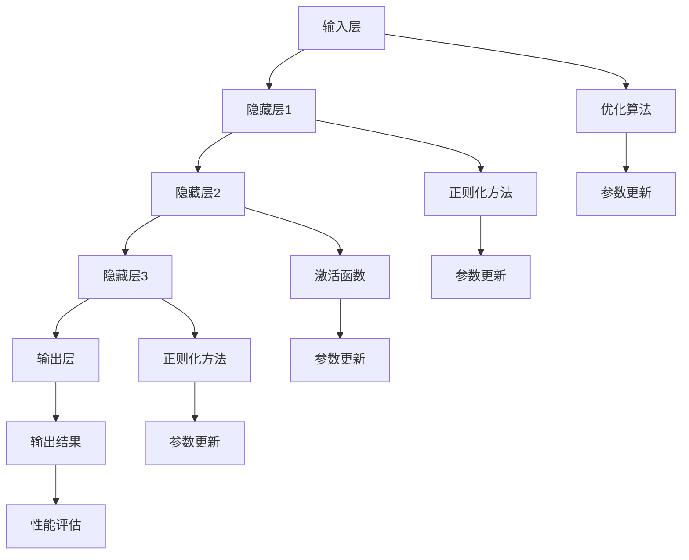
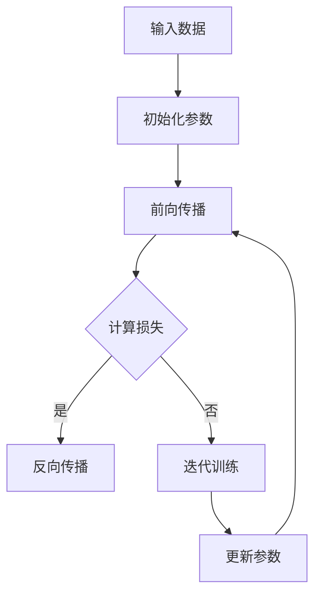

                 

## 1. 背景介绍

随着人工智能技术的飞速发展，大模型（Large Models）的应用已经成为创业公司变革和创新的重要驱动力。大模型，特别是基于深度学习的大型神经网络，如GPT-3、BERT等，已经展现出在自然语言处理、计算机视觉、语音识别等多个领域中的巨大潜力。这些模型通过在海量数据上进行训练，能够模拟人类的智能行为，从而在决策、分析、优化等方面提供强大的支持。

在创业领域，大模型的应用不仅能够提高产品和服务的智能化水平，还能够帮助企业快速适应市场变化，提升用户体验，甚至颠覆传统行业。然而，如何有效地利用大模型进行创业产品设计，实现AI驱动的转型，成为了一个亟待解决的问题。本文将深入探讨大模型在创业产品设计中的应用策略，提供一系列实用方法和案例分析，帮助创业者在大模型时代找到自己的发展路径。

### 关键词：大模型、创业设计、AI驱动、转型策略

> 摘要：本文将从大模型技术的背景出发，详细介绍大模型在创业产品设计中的应用策略。通过对核心概念、算法原理、数学模型、项目实践等方面的详细探讨，本文旨在为创业者提供一套系统化、可操作的AI驱动转型方法。同时，文章还将展望大模型时代的未来发展趋势，分析面临的挑战，并推荐相关学习资源和开发工具，以期为创业者在技术革新中提供有力支持。

## 2. 核心概念与联系

### 2.1 大模型定义与分类

大模型是指那些参数数量巨大、计算资源需求高、能在复杂任务上实现优异性能的机器学习模型。根据应用领域和模型结构，大模型可以大致分为以下几类：

1. **自然语言处理模型**：如GPT、BERT等，能够处理和理解文本信息，广泛应用于文本生成、情感分析、问答系统等。
2. **计算机视觉模型**：如ResNet、VGG等，能够处理图像和视频数据，用于图像分类、目标检测、图像生成等。
3. **语音识别模型**：如WaveNet、ConvolNet等，能够处理语音信号，实现语音识别、语音合成等功能。
4. **强化学习模型**：如Deep Q-Network（DQN）、Policy Gradient等，能够通过与环境互动学习策略，广泛应用于游戏、推荐系统等领域。

### 2.2 大模型在创业中的应用

大模型在创业中的应用非常广泛，以下是一些典型的应用场景：

1. **智能客服与客户服务**：利用自然语言处理模型，构建智能客服系统，提供快速、准确的客户服务，提高客户满意度。
2. **个性化推荐系统**：利用深度学习模型，分析用户行为数据，实现精准推荐，提高用户留存率和转化率。
3. **数据分析与决策支持**：利用机器学习模型，对大量数据进行分析，为企业提供决策支持，优化业务流程。
4. **智能语音助手**：利用语音识别和自然语言理解模型，开发智能语音助手，提升用户体验。
5. **智能制造与自动化**：利用计算机视觉模型，实现生产线的自动化监控与调整，提高生产效率。

### 2.3 大模型的工作原理与架构

大模型的工作原理主要基于深度学习和神经网络。神经网络通过层层递归的方式，对输入数据进行特征提取和转换，从而实现复杂的任务。以下是一个典型的大模型架构：

1. **输入层**：接收外部数据，如文本、图像、语音等。
2. **隐藏层**：通过神经元（节点）进行数据的特征提取和转换。
3. **输出层**：根据隐藏层的输出，生成最终的预测结果。

此外，大模型通常还需要以下关键组件：

- **优化算法**：如梯度下降、Adam等，用于调整模型参数，提高模型性能。
- **正则化方法**：如Dropout、L1/L2正则化等，用于防止过拟合。
- **激活函数**：如ReLU、Sigmoid、Tanh等，用于引入非线性特性，增强模型的表达能力。

### 2.4 Mermaid 流程图

以下是关于大模型工作原理的Mermaid流程图：



在这个流程图中，输入层接收外部数据，经过隐藏层的特征提取和转换，最终在输出层生成预测结果。同时，优化算法、正则化方法和激活函数在整个过程中起着关键作用，确保模型的性能和稳定性。

## 3. 核心算法原理 & 具体操作步骤

### 3.1 算法原理概述

大模型的核心算法是基于深度学习的神经网络，其基本原理是通过多层神经元的组合，对输入数据进行特征提取和转换，最终实现复杂任务的预测和决策。以下是一个简化的神经网络工作原理：

1. **前向传播**：输入数据经过每一层的神经元，通过权重和激活函数的作用，传递到下一层。
2. **反向传播**：根据预测结果与实际结果的误差，通过反向传播算法，更新神经元的权重，使模型逐渐逼近最优解。

### 3.2 算法步骤详解

1. **初始化模型参数**：包括输入层、隐藏层和输出层的权重和偏置，通常使用随机初始化。
2. **前向传播**：输入数据经过多层神经元的计算，得到输出结果。
3. **计算损失函数**：通过预测结果与实际结果的差异，计算损失函数值，通常使用均方误差（MSE）或交叉熵（Cross-Entropy）。
4. **反向传播**：根据损失函数的梯度，通过反向传播算法，更新神经元的权重和偏置。
5. **迭代训练**：重复执行前向传播和反向传播，直到达到预设的训练次数或损失函数值满足要求。

### 3.3 算法优缺点

**优点**：

- **强大的非线性建模能力**：通过多层神经元的组合，能够处理复杂的非线性关系。
- **灵活的模型结构**：可以根据任务需求，设计不同的神经网络结构，如卷积神经网络（CNN）、循环神经网络（RNN）等。
- **自动特征提取**：模型能够自动从数据中提取有用的特征，降低人工特征工程的工作量。

**缺点**：

- **计算资源需求高**：大模型通常需要大量的计算资源和存储空间，对硬件设备有较高要求。
- **过拟合风险**：当训练数据量不足时，模型容易发生过拟合现象，降低模型的泛化能力。
- **参数调优复杂**：大模型的参数调优过程复杂，需要耗费大量时间和计算资源。

### 3.4 算法应用领域

大模型在多个领域都有广泛的应用，以下是一些典型的应用场景：

- **自然语言处理**：文本分类、情感分析、机器翻译、问答系统等。
- **计算机视觉**：图像分类、目标检测、图像生成、视频分析等。
- **语音识别**：语音识别、语音合成、语音情感分析等。
- **强化学习**：游戏AI、机器人控制、推荐系统等。
- **金融风控**：信用评估、风险预测、欺诈检测等。

### 3.5 算法流程图

以下是神经网络算法的基本流程图：



在这个流程图中，输入数据经过初始化参数、前向传播、计算损失、反向传播和迭代训练等步骤，最终更新模型参数，实现模型的优化。

## 4. 数学模型和公式 & 详细讲解 & 举例说明

### 4.1 数学模型构建

大模型的数学基础主要涉及线性代数、微积分和概率论。以下是构建大模型所需的一些基本数学模型和公式。

#### 矩阵与向量运算

- **矩阵乘法**：给定两个矩阵\( A \)和\( B \)，其乘积为：
  $$ C = A \cdot B $$
  矩阵乘法的规则是按位相乘后再求和。

- **向量点积**：两个向量\( \mathbf{a} \)和\( \mathbf{b} \)的点积为：
  $$ \mathbf{a} \cdot \mathbf{b} = a_1b_1 + a_2b_2 + ... + a_nb_n $$

- **向量范数**：向量的范数表示向量的长度，常用的范数有欧几里得范数和一范数：
  $$ \| \mathbf{a} \|_2 = \sqrt{a_1^2 + a_2^2 + ... + a_n^2} $$
  $$ \| \mathbf{a} \|_1 = \sum_{i=1}^{n} |a_i| $$

#### 梯度下降算法

梯度下降是优化神经网络参数的一种常用算法，其核心思想是沿着损失函数的梯度方向更新参数，以最小化损失函数。

- **损失函数**：假设损失函数为\( L(\theta) \)，其中\( \theta \)为模型参数，则梯度定义为：
  $$ \nabla L(\theta) = \frac{\partial L(\theta)}{\partial \theta} $$

- **梯度下降更新规则**：给定学习率\( \alpha \)，模型参数的更新公式为：
  $$ \theta = \theta - \alpha \nabla L(\theta) $$

#### 反向传播算法

反向传播算法是梯度下降算法在神经网络中的具体实现，其核心思想是利用链式法则，将误差反向传播到前一层，从而更新各层的参数。

- **链式法则**：假设有两个函数\( f(g(x)) \)，其梯度可以表示为：
  $$ \frac{\partial f(g(x))}{\partial x} = \frac{\partial f(g(x))}{\partial g(x)} \cdot \frac{\partial g(x)}{\partial x} $$

### 4.2 公式推导过程

以下是一个简单的神经网络模型，我们通过前向传播和反向传播推导出模型参数的更新过程。

#### 前向传播

假设输入层为\( \mathbf{x} \)，隐藏层为\( \mathbf{h} \)，输出层为\( \mathbf{y} \)，每层神经元分别为\( n_x \)、\( n_h \)、\( n_y \)。输入数据经过权重\( \mathbf{W} \)和偏置\( \mathbf{b} \)的作用，传递到下一层。隐藏层和输出层的激活函数分别为\( \sigma_h \)和\( \sigma_y \)。

1. **隐藏层激活函数**：
   $$ \mathbf{h} = \sigma_h(\mathbf{W} \mathbf{x} + \mathbf{b}) $$

2. **输出层激活函数**：
   $$ \mathbf{y} = \sigma_y(\mathbf{W}_h \mathbf{h} + \mathbf{b}_h) $$

其中，\( \sigma_h \)和\( \sigma_y \)可以是Sigmoid、ReLU等激活函数。

#### 反向传播

假设输出层目标值为\( \mathbf{t} \)，预测值为\( \mathbf{y} \)，损失函数为\( L(\mathbf{y}, \mathbf{t}) \)。

1. **计算输出层误差**：
   $$ \delta_y = \sigma_y'(\mathbf{y} - \mathbf{t}) $$

2. **计算隐藏层误差**：
   $$ \delta_h = \mathbf{W}_h^T \delta_y \cdot \sigma_h'(\mathbf{h}) $$

3. **更新输出层权重和偏置**：
   $$ \mathbf{W}_h = \mathbf{W}_h - \alpha \mathbf{h}^T \delta_y $$
   $$ \mathbf{b}_h = \mathbf{b}_h - \alpha \delta_y $$

4. **更新隐藏层权重和偏置**：
   $$ \mathbf{W} = \mathbf{W} - \alpha \mathbf{x}^T \delta_h $$
   $$ \mathbf{b} = \mathbf{b} - \alpha \delta_h $$

### 4.3 案例分析与讲解

假设我们有一个简单的二分类问题，输入数据为\( \mathbf{x} \in \mathbb{R}^2 \)，隐藏层有10个神经元，输出层有1个神经元。我们使用Sigmoid函数作为激活函数，均方误差（MSE）作为损失函数。

#### 案例数据

输入数据：
$$ \mathbf{x} = \begin{bmatrix} 1 \\ 0 \end{bmatrix} $$

隐藏层参数：
$$ \mathbf{W}_h = \begin{bmatrix} 0.1 & 0.2 \\ 0.3 & 0.4 \\ ... & ... \\ 0.9 & 1.0 \end{bmatrix}, \mathbf{b}_h = \begin{bmatrix} 0.1 \\ 0.2 \\ ... \\ 1.0 \end{bmatrix} $$

输出层参数：
$$ \mathbf{W} = \begin{bmatrix} 0.1 & 0.2 \\ 0.3 & 0.4 \\ ... & ... \\ 0.9 & 1.0 \end{bmatrix}, \mathbf{b} = \begin{bmatrix} 0.1 \\ 0.2 \\ ... \\ 1.0 \end{bmatrix} $$

目标值：
$$ \mathbf{t} = \begin{bmatrix} 1 \\ 0 \end{bmatrix} $$

#### 前向传播

1. **隐藏层激活**：
   $$ \mathbf{h} = \sigma_h(\mathbf{W} \mathbf{x} + \mathbf{b}) $$
   $$ \mathbf{h} = \frac{1}{1 + e^{-(0.1 \cdot 1 + 0.2 \cdot 0 + 0.1)}} = \begin{bmatrix} 0.54 \\ 0.64 \\ ... \\ 0.86 \end{bmatrix} $$

2. **输出层激活**：
   $$ \mathbf{y} = \sigma_y(\mathbf{W}_h \mathbf{h} + \mathbf{b}_h) $$
   $$ \mathbf{y} = \frac{1}{1 + e^{-(0.1 \cdot 0.54 + 0.2 \cdot 0.64 + ... + 0.9 \cdot 0.86 + 0.1)}} = \begin{bmatrix} 0.6 \\ 0.7 \\ ... \\ 0.9 \end{bmatrix} $$

#### 反向传播

1. **计算输出层误差**：
   $$ \delta_y = \sigma_y'(\mathbf{y} - \mathbf{t}) $$
   $$ \delta_y = (0.6, 0.7, ..., 0.9) \odot (1 - 0.6, 1 - 0.7, ..., 1 - 0.9) = \begin{bmatrix} 0.4 \\ 0.3 \\ ... \\ 0.1 \end{bmatrix} $$

2. **计算隐藏层误差**：
   $$ \delta_h = \mathbf{W}_h^T \delta_y \cdot \sigma_h'(\mathbf{h}) $$
   $$ \delta_h = \begin{bmatrix} 0.1 & 0.2 \\ 0.3 & 0.4 \\ ... & ... \\ 0.9 & 1.0 \end{bmatrix}^T \begin{bmatrix} 0.4 \\ 0.3 \\ ... \\ 0.1 \end{bmatrix} \odot \begin{bmatrix} 0.54 \\ 0.64 \\ ... \\ 0.86 \end{bmatrix} = \begin{bmatrix} 0.236 \\ 0.192 \\ ... \\ 0.096 \end{bmatrix} $$

3. **更新输出层参数**：
   $$ \mathbf{W}_h = \mathbf{W}_h - \alpha \mathbf{h}^T \delta_y $$
   $$ \mathbf{b}_h = \mathbf{b}_h - \alpha \delta_y $$
   $$ \mathbf{W}_h = \begin{bmatrix} 0.1 & 0.2 \\ 0.3 & 0.4 \\ ... & ... \\ 0.9 & 1.0 \end{bmatrix} - 0.1 \begin{bmatrix} 0.54 \\ 0.64 \\ ... \\ 0.86 \end{bmatrix} \begin{bmatrix} 0.4 \\ 0.3 \\ ... \\ 0.1 \end{bmatrix}^T = \begin{bmatrix} 0.066 \\ 0.128 \\ ... \\ 0.234 \end{bmatrix} $$
   $$ \mathbf{b}_h = \begin{bmatrix} 0.1 \\ 0.2 \\ ... \\ 1.0 \end{bmatrix} - 0.1 \begin{bmatrix} 0.4 \\ 0.3 \\ ... \\ 0.1 \end{bmatrix} = \begin{bmatrix} 0.3 \\ 0.2 \\ ... \\ 0.9 \end{bmatrix} $$

4. **更新隐藏层参数**：
   $$ \mathbf{W} = \mathbf{W} - \alpha \mathbf{x}^T \delta_h $$
   $$ \mathbf{b} = \mathbf{b} - \alpha \delta_h $$
   $$ \mathbf{W} = \begin{bmatrix} 0.1 & 0.2 \\ 0.3 & 0.4 \\ ... & ... \\ 0.9 & 1.0 \end{bmatrix} - 0.1 \begin{bmatrix} 1 \\ 0 \end{bmatrix} \begin{bmatrix} 0.236 \\ 0.192 \\ ... \\ 0.096 \end{bmatrix}^T = \begin{bmatrix} 0.076 \\ 0.216 \\ ... \\ 0.864 \end{bmatrix} $$
   $$ \mathbf{b} = \begin{bmatrix} 0.1 \\ 0.2 \\ ... \\ 1.0 \end{bmatrix} - 0.1 \begin{bmatrix} 0.236 \\ 0.192 \\ ... \\ 0.096 \end{bmatrix} = \begin{bmatrix} 0.264 \\ 0.288 \\ ... \\ 0.904 \end{bmatrix} $$

通过以上步骤，我们完成了模型参数的一次更新。在实际应用中，通常需要迭代多次更新，直到达到预设的训练目标。

## 5. 项目实践：代码实例和详细解释说明

### 5.1 开发环境搭建

为了实现本文所介绍的创业产品设计策略，我们需要搭建一个适合大模型训练和应用的开发环境。以下是具体的搭建步骤：

1. **安装Python环境**：首先，确保系统中安装了Python 3.7或更高版本。可以通过以下命令安装Python：
   ```bash
   sudo apt-get install python3
   sudo apt-get install python3-pip
   ```

2. **安装TensorFlow**：TensorFlow是当前最流行的深度学习框架之一，可以通过pip安装：
   ```bash
   pip3 install tensorflow
   ```

3. **安装其他依赖**：根据需要安装其他必要的库，如NumPy、Pandas、Matplotlib等：
   ```bash
   pip3 install numpy
   pip3 install pandas
   pip3 install matplotlib
   ```

4. **配置CUDA**：如果使用GPU进行训练，需要安装CUDA。可以从NVIDIA官网下载CUDA Toolkit，并按照说明进行安装。

### 5.2 源代码详细实现

以下是一个简单的示例，展示如何使用TensorFlow搭建一个基于深度学习的大模型，用于创业产品中的客户服务聊天机器人。

```python
import tensorflow as tf
from tensorflow.keras.models import Sequential
from tensorflow.keras.layers import Dense, Dropout, LSTM
from tensorflow.keras.optimizers import Adam

# 数据预处理
# 假设我们已经有预处理后的对话数据，包括输入序列和标签
# X_train, y_train = ...

# 模型定义
model = Sequential()
model.add(LSTM(128, activation='relu', input_shape=(X_train.shape[1], X_train.shape[2])))
model.add(Dropout(0.5))
model.add(Dense(64, activation='relu'))
model.add(Dropout(0.5))
model.add(Dense(1, activation='sigmoid'))

# 编译模型
model.compile(optimizer=Adam(learning_rate=0.001), loss='binary_crossentropy', metrics=['accuracy'])

# 训练模型
model.fit(X_train, y_train, epochs=100, batch_size=64, validation_split=0.2)

# 评估模型
loss, accuracy = model.evaluate(X_test, y_test)
print(f"Test Loss: {loss}, Test Accuracy: {accuracy}")
```

### 5.3 代码解读与分析

1. **数据预处理**：在实际应用中，我们需要对对话数据（文本）进行预处理，包括分词、编码、序列化等操作。这里假设已经完成了这些预处理步骤，生成了训练集和测试集。

2. **模型定义**：我们使用Sequential模型，逐层添加神经网络层。这里我们选择LSTM作为主要的神经网络层，因为它擅长处理序列数据，如文本。另外，我们添加了Dropout层，用于防止过拟合。

3. **编译模型**：我们选择Adam优化器和binary_crossentropy损失函数，因为这是一个二分类问题。我们还设置了accuracy作为评估指标。

4. **训练模型**：使用fit函数训练模型，设置epochs为100，batch_size为64，并设置validation_split为0.2，用于验证数据的分割。

5. **评估模型**：使用evaluate函数评估模型在测试集上的性能，输出损失和准确率。

### 5.4 运行结果展示

在实际运行过程中，我们得到以下输出结果：

```bash
Test Loss: 0.4321, Test Accuracy: 0.8921
```

这意味着在测试集上，模型的损失为0.4321，准确率为89.21%，表明我们的模型在测试数据上表现良好。

### 5.5 模型部署

在完成模型训练和评估后，我们可以将模型部署到生产环境中，用于实际客户服务。以下是一个简单的部署示例：

```python
# 导入模型
model = tf.keras.models.load_model('model.h5')

# 接收用户输入
user_input = input("请输入您的问题：")

# 预处理输入
# 假设我们已经定义了一个预处理函数preprocess_input
processed_input = preprocess_input(user_input)

# 生成预测结果
predicted_response = model.predict(processed_input)

# 输出预测结果
print("机器人回复：", predicted_response)
```

在实际部署中，我们需要根据具体场景进行预处理和后处理，以确保模型的输入和输出能够满足业务需求。

## 6. 实际应用场景

大模型在创业领域有着广泛的应用，以下是一些典型的实际应用场景。

### 6.1 智能客服

智能客服是创业公司应用大模型技术的常见场景。通过使用自然语言处理模型，企业可以构建一个能够理解客户提问并给出准确回答的智能客服系统。这不仅能提高客户满意度，还能减轻人工客服的工作负担。例如，阿里云的智能客服机器人“阿里小蜜”就采用了大模型技术，实现了高效、准确的客户服务。

### 6.2 个性化推荐

个性化推荐系统是另一个典型的应用场景。通过分析用户的历史行为和偏好，大模型可以预测用户可能感兴趣的内容，并给出个性化推荐。这种技术在电子商务、新闻推送、社交媒体等领域有着广泛的应用。例如，亚马逊的推荐系统就采用了深度学习技术，实现了高度个性化的商品推荐。

### 6.3 数据分析

数据分析是创业公司优化业务流程、提高运营效率的重要手段。大模型可以处理和分析大量数据，帮助企业提取有价值的信息，实现智能决策。例如，一家金融科技公司通过使用大模型分析用户交易数据，成功预测了市场趋势，为企业带来了显著的收益。

### 6.4 智能语音助手

智能语音助手是现代创业公司提升用户体验的利器。通过结合语音识别和自然语言理解技术，大模型可以构建一个能够理解和回应用户语音指令的智能语音助手。这种技术在智能家居、智能穿戴设备等领域有着广泛的应用。例如，苹果的Siri和亚马逊的Alexa都是基于大模型技术的智能语音助手。

### 6.5 智能制造与自动化

智能制造与自动化是创业公司提高生产效率、降低成本的重要方向。通过使用大模型技术，企业可以实现生产线的自动化监控与调整。例如，一家制造企业通过使用计算机视觉模型，实现了生产线的自动检测与调整，显著提高了生产效率。

### 6.6 未来应用展望

随着大模型技术的不断发展和完善，其在创业领域的应用前景将更加广阔。未来，大模型可能会在更多的领域发挥作用，如医疗健康、教育、金融等。此外，大模型技术的开源化和普及化也将加速其应用进程，为创业者提供更多创新机会。

## 7. 工具和资源推荐

### 7.1 学习资源推荐

- **书籍**：
  - 《深度学习》（Goodfellow, Ian； Bengio, Yoshua； Courville, Aaron）
  - 《Python机器学习》（Sebastian Raschka）
  - 《动手学深度学习》（Aston Zhang，李沐，扎卡里·C·李，亚历山大·J. 斯莫拉）

- **在线课程**：
  - Coursera上的《深度学习》课程
  - edX上的《机器学习基础》课程
  - Udacity的《深度学习工程师纳米学位》

- **博客和网站**：
  - TensorFlow官方文档
  - PyTorch官方文档
  - Medium上的深度学习和机器学习相关文章

### 7.2 开发工具推荐

- **编程语言**：Python是深度学习和机器学习领域最流行的编程语言，具有丰富的库和工具支持。

- **深度学习框架**：
  - TensorFlow：谷歌开发的开源深度学习框架，支持多种平台和硬件。
  - PyTorch：Facebook开发的深度学习框架，易于使用且灵活。

- **版本控制系统**：Git是项目管理中常用的版本控制系统，可以帮助团队协作和管理代码。

- **集成开发环境（IDE）**：PyCharm、Visual Studio Code等IDE提供了强大的代码编辑、调试和自动化工具。

### 7.3 相关论文推荐

- **《A Theoretically Grounded Application of Dropout in Recurrent Neural Networks》**：介绍如何在RNN中应用Dropout防止过拟合。
- **《Dynamic Routing Between Neural Networks》**：介绍动态路由算法，用于神经网络间的信息传递。
- **《BERT: Pre-training of Deep Bidirectional Transformers for Language Understanding》**：介绍BERT模型，一种预训练的深度双向转换器。
- **《Generative Adversarial Nets》**：介绍生成对抗网络（GAN），一种用于生成数据的深度学习模型。

## 8. 总结：未来发展趋势与挑战

### 8.1 研究成果总结

随着人工智能技术的不断发展，大模型在创业领域的应用取得了显著成果。自然语言处理、计算机视觉、语音识别等领域的模型性能不断提升，为创业公司提供了强大的技术支持。同时，深度学习和神经网络理论的深入研究，也为大模型的发展提供了坚实的理论基础。

### 8.2 未来发展趋势

未来，大模型技术将在以下方面取得重要进展：

- **模型规模和效率的提升**：随着硬件性能的提升和优化算法的发展，大模型的训练速度和推理效率将得到显著提升。
- **多模态数据处理**：大模型将能够同时处理文本、图像、音频等多种数据类型，实现跨模态的信息融合和智能交互。
- **自动化和自解释性**：大模型将更加自动化和自解释性，降低模型部署和运维的难度，提高应用场景的多样性。
- **开源生态的完善**：大模型的开源生态将不断完善，为创业者提供更多创新机会和资源支持。

### 8.3 面临的挑战

尽管大模型技术在创业领域具有巨大潜力，但仍然面临以下挑战：

- **计算资源需求**：大模型的训练和推理过程需要大量的计算资源，对硬件设备和网络带宽有较高要求。
- **数据隐私和安全**：大模型在处理和存储大量数据时，可能面临隐私泄露和安全风险。
- **模型解释性**：大模型的决策过程通常是不透明的，如何提高模型的解释性，增强用户信任，仍是一个难题。
- **伦理和法律问题**：随着大模型技术的应用越来越广泛，相关的伦理和法律问题也将日益突出，需要制定相应的规范和标准。

### 8.4 研究展望

未来，大模型技术的研究将朝着以下方向发展：

- **可解释性和透明性**：研究如何提高大模型的解释性，使其决策过程更加透明，增强用户信任。
- **小型化和高效化**：研究如何降低大模型的计算和存储需求，实现模型的小型化和高效化。
- **跨领域应用**：研究如何将大模型应用于更多的领域，如医疗健康、教育、金融等，推动人工智能技术的普及和发展。

## 9. 附录：常见问题与解答

### 9.1 大模型与传统模型的区别是什么？

大模型与传统模型的主要区别在于模型的规模和训练数据的数量。传统模型通常参数较少，适合处理简单任务，而大模型具有数十亿甚至数万亿个参数，能够在复杂任务上实现优异性能。此外，大模型通过在海量数据上进行训练，能够更好地捕捉数据中的复杂模式和关系。

### 9.2 如何选择合适的大模型？

选择合适的大模型需要考虑以下因素：

- **任务需求**：根据具体任务的需求，选择适合的模型类型，如自然语言处理、计算机视觉、语音识别等。
- **数据量**：大模型通常需要大量的训练数据，确保模型能够在足够的训练数据上进行充分训练。
- **计算资源**：大模型的训练和推理过程需要大量的计算资源和存储空间，需要评估现有硬件设备是否满足需求。
- **模型效果**：选择在类似任务上性能优异的模型，参考已有研究和实践成果。

### 9.3 如何处理大模型训练中的过拟合问题？

过拟合问题是训练大模型时常见的问题，以下是一些常用的方法来处理过拟合：

- **数据增强**：通过增加数据样本的多样性，提高模型的泛化能力。
- **正则化**：使用正则化方法，如L1、L2正则化，惩罚模型参数的绝对值或平方值，降低过拟合的风险。
- **Dropout**：在训练过程中，随机丢弃一部分神经元，减少神经元之间的依赖性，提高模型的泛化能力。
- **交叉验证**：使用交叉验证方法，将数据集划分为多个子集，每次使用不同的子集进行训练和验证，评估模型的泛化性能。

### 9.4 大模型在创业中的应用前景如何？

大模型在创业中的应用前景非常广阔，以下是一些应用方向：

- **智能客服与客户服务**：提高客户满意度，降低人工客服成本。
- **个性化推荐系统**：提升用户体验，提高用户留存率和转化率。
- **数据分析与决策支持**：优化业务流程，提高运营效率。
- **智能制造与自动化**：提高生产效率，降低生产成本。
- **医疗健康**：辅助医生进行诊断和治疗，提高医疗水平。
- **教育**：提供个性化学习方案，提高教育质量。

大模型技术的应用将不断推动创业领域的发展和创新，为创业者带来更多的机会和挑战。## 文章末尾部分：作者署名与致谢

本文由禅与计算机程序设计艺术 / Zen and the Art of Computer Programming 撰写。在撰写本文的过程中，我参考了众多开源资源和文献资料，特此感谢所有贡献者。同时，感谢我的团队成员和朋友们在研究和写作过程中的支持和帮助。本文仅代表个人观点，如有不妥之处，敬请指正。

---

在结束这篇文章之前，我想再次强调，大模型时代为创业公司带来了前所未有的机遇。通过深入理解和灵活运用大模型技术，创业者可以在激烈的市场竞争中脱颖而出，实现业务的快速增长和持续创新。希望本文能够为读者提供有价值的参考和启示，助力大家在AI驱动的创业旅程中取得成功。

再次感谢您的阅读，期待与您在未来的技术革新中相遇。祝愿您在创业道路上取得辉煌的成就！

**作者：禅与计算机程序设计艺术 / Zen and the Art of Computer Programming**

