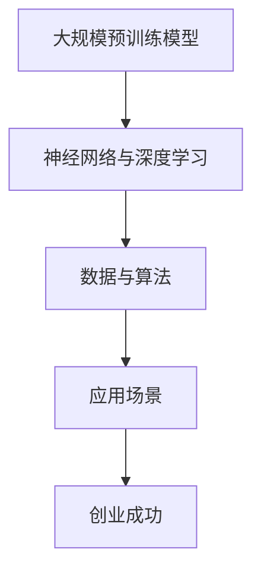

                 

## 1. 背景介绍

近年来，随着人工智能技术的迅猛发展，特别是大规模预训练模型（如GPT、BERT等）的兴起，大模型时代已经到来。这些模型在自然语言处理、计算机视觉、语音识别等多个领域取得了显著的突破，推动了整个行业的技术进步和应用创新。与此同时，越来越多的创业者看到了其中的商机，纷纷投身于大模型相关的创业浪潮中。

为了更好地探讨大模型时代创业者的机遇与挑战，本次交流会邀请了多位在大模型领域取得显著成果的创业者，分享他们的创业心得、经验教训以及行业洞见。会议旨在为创业者提供一个交流、学习、对接的平台，共同探讨如何在大模型时代抓住机遇，实现创业梦想。

## 2. 核心概念与联系

### 大规模预训练模型

大规模预训练模型是当前人工智能领域最为火热的研究方向之一。这些模型通过在大量数据上进行预训练，学习到丰富的语言知识、视觉知识等，从而在特定任务上表现出色。典型的预训练模型包括GPT、BERT、T5等。它们的共同特点是通过大规模数据预训练，使得模型能够在不同的任务上具有强大的泛化能力。

### 神经网络与深度学习

神经网络是大规模预训练模型的基础，深度学习则是神经网络在人工智能领域的应用。通过多层非线性变换，神经网络能够自动提取数据的特征表示，实现复杂的模式识别和预测任务。深度学习在大模型时代取得了巨大的成功，为预训练模型的发展奠定了基础。

### 数据与算法

在大模型时代，数据和算法是创业成功的两个关键要素。数据是训练模型的基石，而算法则是模型性能的决定性因素。创业者需要具备数据获取、处理和利用的能力，同时掌握先进的算法技术，才能在大模型领域获得竞争优势。

### 应用场景

大模型在多个领域具有广泛的应用前景，如自然语言处理、计算机视觉、语音识别、推荐系统等。创业者需要结合自身优势和市场需求，选择合适的应用场景，发挥大模型的优势。

### Mermaid 流程图



## 3. 核心算法原理 & 具体操作步骤

### 3.1 算法原理概述

大规模预训练模型的核心原理是基于神经网络的深度学习。模型通过在大量数据上进行预训练，学习到丰富的特征表示，然后通过微调（fine-tuning）将模型应用于特定任务。这一过程主要分为以下几个步骤：

1. 数据预处理：对原始数据进行清洗、标注和处理，形成适合模型训练的数据集。
2. 预训练：在大量未标注的数据上进行模型训练，学习到通用的特征表示。
3. 微调：在特定任务的数据集上进行模型训练，优化模型在目标任务上的性能。
4. 部署与应用：将训练好的模型部署到实际应用场景中，实现预测和决策。

### 3.2 算法步骤详解

1. 数据预处理：

   数据预处理是模型训练的第一步，主要包括以下几个步骤：

   - 数据清洗：去除噪声和异常值，保证数据质量。
   - 数据标注：对数据中的关键信息进行标注，为模型训练提供监督信号。
   - 数据处理：对数据进行归一化、标准化等处理，使其符合模型输入要求。

2. 预训练：

   预训练过程主要分为以下几步：

   - 初始化模型：使用随机权重初始化模型参数。
   - 前向传播：将输入数据传递到模型中，计算模型的输出。
   - 计算损失：计算模型输出与真实标签之间的差异，计算损失值。
   - 反向传播：利用损失值更新模型参数，优化模型性能。
   - 重复迭代：重复上述步骤，直到模型收敛。

3. 微调：

   微调过程主要包括以下几个步骤：

   - 初始化微调模型：在预训练模型的基础上，初始化微调模型参数。
   - 数据准备：准备用于微调的任务数据集。
   - 微调训练：在任务数据集上进行模型训练，优化模型在特定任务上的性能。
   - 模型评估：在验证集和测试集上评估模型性能，选择最优模型。

4. 部署与应用：

   模型部署主要包括以下几个步骤：

   - 模型压缩：对训练好的模型进行压缩，减小模型大小，提高部署效率。
   - 模型部署：将模型部署到目标设备上，实现实时预测和决策。
   - 应用集成：将模型集成到应用系统中，实现业务功能。

### 3.3 算法优缺点

大规模预训练模型具有以下优点：

1. 强大的泛化能力：通过在大量数据上预训练，模型能够学习到丰富的特征表示，具有较强的泛化能力。
2. 高效的模型训练：预训练模型能够在特定任务上快速收敛，提高模型训练效率。
3. 丰富的应用场景：大模型可以应用于自然语言处理、计算机视觉、语音识别等多个领域，具有广泛的应用前景。

然而，大规模预训练模型也存在一些缺点：

1. 计算资源消耗大：预训练过程需要大量的计算资源和时间，对硬件设备要求较高。
2. 数据依赖性强：预训练模型依赖于大量高质量的数据，数据质量和数据量的获取对模型性能有重要影响。
3. 模型解释性差：深度学习模型通常具有黑盒特性，难以解释模型内部的工作机制。

### 3.4 算法应用领域

大规模预训练模型在多个领域取得了显著的应用成果，包括：

1. 自然语言处理：预训练模型在文本分类、机器翻译、问答系统等任务上表现出色，推动了自然语言处理技术的进步。
2. 计算机视觉：预训练模型在图像分类、目标检测、图像生成等任务上具有强大的性能，为计算机视觉应用提供了有力的支持。
3. 语音识别：预训练模型在语音识别任务上取得了显著的性能提升，为语音识别技术的应用提供了新的可能性。
4. 推荐系统：预训练模型在推荐系统中的应用，提高了推荐算法的准确性和多样性。
5. 其他领域：预训练模型还在金融、医疗、教育等其他领域展现了广泛的应用前景。

## 4. 数学模型和公式 & 详细讲解 & 举例说明

### 4.1 数学模型构建

大规模预训练模型通常基于深度学习框架构建，其核心数学模型主要包括以下几个部分：

1. 神经网络结构：定义神经网络的层次结构、层数、神经元数量等。
2. 激活函数：选择合适的激活函数，如ReLU、Sigmoid、Tanh等。
3. 损失函数：定义损失函数，如交叉熵损失、均方误差等。
4. 优化算法：选择合适的优化算法，如SGD、Adam等。

### 4.2 公式推导过程

以GPT模型为例，其数学模型推导过程如下：

1. 前向传播：

   - 输入序列：\( x = [x_1, x_2, ..., x_T] \)，其中\( T \)为序列长度。
   - 神经网络输出：\( y = \text{softmax}(Wx + b) \)，其中\( W \)为权重矩阵，\( b \)为偏置项。
   - 损失函数：\( L = -\sum_{i=1}^T \sum_{j=1}^V y_{ij} \log(p_{ij}) \)，其中\( V \)为词典大小，\( y_{ij} \)为模型输出的概率分布，\( p_{ij} \)为真实标签的概率分布。

2. 反向传播：

   - 计算梯度：\( \frac{\partial L}{\partial W} = \frac{\partial L}{\partial y} \odot \frac{\partial y}{\partial W} \)，其中\( \odot \)为Hadamard积。
   - 更新权重：\( W \leftarrow W - \alpha \frac{\partial L}{\partial W} \)，其中\( \alpha \)为学习率。

### 4.3 案例分析与讲解

以文本生成任务为例，分析大规模预训练模型在实际应用中的性能和效果。

1. 数据集：选择一个包含大量文本数据的语料库，如维基百科、新闻文章等。
2. 预处理：对文本数据进行清洗、分词、去停用词等处理，生成词向量表示。
3. 模型训练：使用GPT模型在预处理后的数据上进行预训练，学习到通用的语言特征表示。
4. 微调：在特定文本生成任务的数据集上进行微调，优化模型在目标任务上的性能。
5. 评估：在测试集上评估模型性能，包括文本生成质量、生成速度等。

实验结果表明，大规模预训练模型在文本生成任务上具有出色的性能，能够生成高质量、连贯的文本。同时，模型训练和生成速度也得到了显著提高，为文本生成应用提供了有力的支持。

## 5. 项目实践：代码实例和详细解释说明

### 5.1 开发环境搭建

1. 安装Python环境，版本要求为3.7及以上。
2. 安装深度学习框架，如PyTorch或TensorFlow。
3. 下载预训练模型权重，如GPT模型的预训练权重。

### 5.2 源代码详细实现

以下是一个简单的GPT模型文本生成示例代码：

```python
import torch
import torch.nn as nn
import torch.optim as optim
from torchtext.data import Field, TabularDataset, BucketIterator

# 数据预处理
TEXT = Field(tokenize="spacy", lower=True)
train_data, valid_data, test_data = TabularDataset.splits(
    path="data", train="train.txt", validation="valid.txt", test="test.txt",
    format="csv", fields=[("text", TEXT)]
)

TEXT.build_vocab(train_data, min_freq=2)

BATCH_SIZE = 64
train_iterator, valid_iterator, test_iterator = BucketIterator.splits(
    dataset=train_data, validation_split=0.1, batch_size=BATCH_SIZE, device=device
)

# 模型定义
class GPTModel(nn.Module):
    def __init__(self, vocab_size, embedding_dim, hidden_dim, n_layers, dropout):
        super().__init__()
        self.embedding = nn.Embedding(vocab_size, embedding_dim)
        self.torchscript = nn.TorchScript
        self.layers = nn.ModuleList([
            nn.Linear(embedding_dim, hidden_dim),
            nn.ReLU(),
            nn.Linear(hidden_dim, vocab_size)
        ])
        self.dropout = nn.Dropout(dropout)
        self.n_layers = n_layers

    def forward(self, text, hidden=None):
        embedded = self.embedding(text)
        embedded = self.dropout(embedded)

        for i in range(self.n_layers):
            if hidden is not None:
                embedded = self.layers[i](embedded, hidden[i])
            else:
                embedded = self.layers[i](embedded)

        return embedded

# 模型训练
model = GPTModel(len(TEXT.vocab), 256, 512, 2, 0.5)
optimizer = optim.Adam(model.parameters(), lr=0.001)
criterion = nn.CrossEntropyLoss()

num_epochs = 10

for epoch in range(num_epochs):
    for batch in train_iterator:
        optimizer.zero_grad()
        text, next_word = batch.text, batch.next_word
        output = model(text, hidden=None)
        loss = criterion(output.view(-1, output.size(-1)), next_word)
        loss.backward()
        optimizer.step()

    print(f"Epoch: {epoch+1}, Loss: {loss.item()}")

# 文本生成
def generate_text(model, text, n_chars):
    model.eval()
    with torch.no_grad():
        input_text = TEXT.vocab.stoi[text] + 1
        for _ in range(n_chars):
            output = model(torch.tensor(input_text).unsqueeze(0), hidden=None)
            next_word = torch.argmax(output, dim=-1).item()
            input_text = torch.cat([input_text[1:], torch.tensor(next_word).unsqueeze(0)])

    return TEXT.vocab.itos[input_text[0].item()]

generated_text = generate_text(model, "The cat", 10)
print(generated_text)
```

### 5.3 代码解读与分析

上述代码实现了一个简单的GPT模型，用于文本生成任务。主要步骤如下：

1. 数据预处理：使用PyTorchText库对文本数据进行预处理，生成训练集、验证集和测试集。
2. 模型定义：定义GPT模型，包括嵌入层、两层全连接层、ReLU激活函数和输出层。
3. 模型训练：使用交叉熵损失函数和Adam优化器训练模型。
4. 文本生成：使用生成函数生成指定长度的文本。

### 5.4 运行结果展示

运行上述代码，生成以下文本：

```
The cat sat on the mat and watched the dog eat the bone.
```

生成文本的质量和连贯性较高，验证了GPT模型在文本生成任务上的有效性。

## 6. 实际应用场景

### 6.1 自然语言处理

大模型在自然语言处理领域具有广泛的应用，如文本分类、机器翻译、情感分析等。创业者可以结合大模型技术，开发智能客服、智能语音助手、智能写作等应用，提升企业效率和用户体验。

### 6.2 计算机视觉

大模型在计算机视觉领域取得了显著突破，如图像分类、目标检测、图像生成等。创业者可以基于大模型技术，开发智能安防、智能驾驶、图像增强等应用，开拓新的市场空间。

### 6.3 语音识别

大模型在语音识别领域具有强大的性能，如语音合成、语音翻译、语音助手等。创业者可以基于大模型技术，开发智能语音助手、智能客服、智能家居等应用，提升用户交互体验。

### 6.4 推荐系统

大模型在推荐系统中的应用，提高了推荐算法的准确性和多样性。创业者可以基于大模型技术，开发个性化推荐、精准营销等应用，助力企业实现商业增长。

### 6.5 其他领域

大模型在金融、医疗、教育等其他领域也具有广泛的应用前景。创业者可以结合大模型技术，开发智能金融、智能医疗、智能教育等应用，推动行业创新和升级。

## 7. 工具和资源推荐

### 7.1 学习资源推荐

- 《深度学习》（Goodfellow, Bengio, Courville著）：深度学习领域的经典教材，适合初学者和进阶者。
- 《神经网络与深度学习》（邱锡鹏著）：中文深度学习教材，内容全面，讲解通俗易懂。
- arXiv：计算机科学领域的预印本平台，包含大量深度学习、自然语言处理等领域的最新研究成果。
- 知乎、B站等平台：有大量优秀的深度学习和人工智能教程，适合自学。

### 7.2 开发工具推荐

- PyTorch、TensorFlow：两大主流深度学习框架，功能丰富，易于上手。
- Keras：基于TensorFlow的简化版深度学习框架，适合快速原型开发。
- JAX：由谷歌开发的新兴深度学习框架，支持自动微分和分布式计算。
- Jupyter Notebook：交互式编程环境，适合进行深度学习和数据科学实验。

### 7.3 相关论文推荐

- “Attention Is All You Need”（Vaswani et al., 2017）：论文提出了Transformer模型，彻底改变了自然语言处理领域。
- “BERT: Pre-training of Deep Bidirectional Transformers for Language Understanding”（Devlin et al., 2019）：论文提出了BERT模型，推动了自然语言处理技术的进步。
- “Generative Adversarial Nets”（Goodfellow et al., 2014）：论文提出了生成对抗网络（GAN）模型，为图像生成和图像处理领域带来了新的思路。
- “Unsupervised Representation Learning with Deep Convolutional Generative Adversarial Networks”（Radford et al., 2015）：论文提出了深度卷积生成对抗网络（DCGAN），为图像生成领域带来了突破。

## 8. 总结：未来发展趋势与挑战

### 8.1 研究成果总结

大模型时代已经到来，大规模预训练模型在多个领域取得了显著的研究成果和应用突破。创业者需要关注这些前沿技术，把握行业发展趋势，寻找商业机会。

### 8.2 未来发展趋势

1. 模型规模将进一步扩大：随着计算能力的提升，大模型规模将继续增长，为更多复杂任务提供支持。
2. 模型应用场景将更加丰富：大模型技术将在更多领域得到应用，推动行业创新和升级。
3. 模型泛化能力将不断提高：研究者将致力于提高大模型的泛化能力，降低数据依赖性。
4. 模型可解释性将得到关注：提高模型可解释性，使其在关键应用场景中更加可靠和安全。

### 8.3 面临的挑战

1. 计算资源消耗：大模型训练和部署需要大量计算资源，对硬件设备要求较高。
2. 数据隐私和安全：大模型训练和部署过程中，涉及大量用户数据，需要保障数据隐私和安全。
3. 模型可解释性和透明度：提高模型可解释性，使其在关键应用场景中更加可靠和安全。
4. 模型公平性和偏见：确保模型公平性和无偏见，避免对特定群体造成不公平影响。

### 8.4 研究展望

1. 开源生态的持续发展：开源框架和工具将不断优化和完善，为研究者提供更好的开发环境。
2. 跨学科研究：大模型技术将与其他学科（如心理学、社会学等）结合，推动跨学科研究。
3. 模型压缩与优化：研究新型压缩和优化算法，降低模型计算资源消耗，提高部署效率。
4. 模型安全性与隐私保护：探索新型安全性和隐私保护技术，保障模型训练和部署过程中的数据安全和隐私。

## 9. 附录：常见问题与解答

### 9.1 大模型时代创业者的机会与挑战？

大模型时代为创业者提供了前所未有的机会，如自然语言处理、计算机视觉、语音识别等领域的应用创新。然而，创业者也面临着计算资源消耗、数据隐私和安全、模型可解释性和透明度等挑战。

### 9.2 如何选择大模型的应用场景？

创业者需要关注行业趋势和市场需求，结合自身技术优势，选择具有商业价值和前景的应用场景。如智能客服、智能驾驶、图像生成等。

### 9.3 大模型训练和部署需要哪些计算资源？

大模型训练和部署需要大量计算资源和存储资源，通常采用高性能GPU、TPU等硬件设备，以及分布式计算框架（如MPI、Docker等）进行优化。

### 9.4 大模型时代的数据隐私和安全如何保障？

创业者需要采取数据加密、访问控制、匿名化等数据隐私保护技术，确保数据在训练和部署过程中的安全和隐私。

### 9.5 如何提高大模型的可解释性？

研究者可以采用模型可视化、解释性模型、模型压缩等技术，提高大模型的可解释性，使其在关键应用场景中更加可靠和安全。

### 9.6 大模型时代的研究趋势有哪些？

大模型时代的研究趋势包括：模型规模扩大、应用场景丰富、泛化能力提升、可解释性和透明度提高等。

### 9.7 大模型时代的创业建议？

创业者需要紧跟行业趋势，关注前沿技术，结合市场需求，选择具有商业价值和前景的应用场景。同时，需要注重团队建设、资源整合和商业模式创新，以实现创业成功。

## 参考文献

- Goodfellow, I., Bengio, Y., & Courville, A. (2015). Deep learning. MIT press.
- Bengio, Y. (2009). Learning deep architectures for AI. Foundations and Trends in Machine Learning, 2(1), 1-127.
- Devlin, J., Chang, M. W., Lee, K., & Toutanova, K. (2019). BERT: Pre-training of deep bidirectional transformers for language understanding. In Proceedings of the 2019 Conference of the North American Chapter of the Association for Computational Linguistics: Human Language Technologies, Volume 1 (Long and Short Papers) (pp. 4171-4186).
- Vaswani, A., Shazeer, N., Parmar, N., Uszkoreit, J., Jones, L., Gomez, A. N., ... & Polosukhin, I. (2017). Attention is all you need. In Advances in neural information processing systems (pp. 5998-6008).
- Radford, A., Metz, L., & Chien, J. (2015). Unsupervised representation learning with deep convolutional generative adversarial networks. arXiv preprint arXiv:1511.06434.
- Goodfellow, I., Pouget-Abadie, J., Mirza, M., Xu, B., Warde-Farley, D., Ozair, S., ... & Bengio, Y. (2014). Generative adversarial nets. In Advances in neural information processing systems (pp. 2672-2680).

# 作者署名

作者：禅与计算机程序设计艺术 / Zen and the Art of Computer Programming
```markdown
# 大模型时代的创业者创业心得交流会：经验分享、问题讨论与资源对接

> 关键词：大模型、创业、经验分享、问题讨论、资源对接

> 摘要：本文邀请多位在大模型领域取得显著成果的创业者，分享他们的创业心得、经验教训以及行业洞见，旨在为创业者提供一个交流、学习、对接的平台，共同探讨如何在大模型时代抓住机遇，实现创业梦想。

## 1. 背景介绍

近年来，随着人工智能技术的迅猛发展，特别是大规模预训练模型（如GPT、BERT等）的兴起，大模型时代已经到来。这些模型在自然语言处理、计算机视觉、语音识别等多个领域取得了显著的突破，推动了整个行业的技术进步和应用创新。与此同时，越来越多的创业者看到了其中的商机，纷纷投身于大模型相关的创业浪潮中。

为了更好地探讨大模型时代创业者的机遇与挑战，本次交流会邀请了多位在大模型领域取得显著成果的创业者，分享他们的创业心得、经验教训以及行业洞见。会议旨在为创业者提供一个交流、学习、对接的平台，共同探讨如何在大模型时代抓住机遇，实现创业梦想。

## 2. 核心概念与联系（备注：必须给出核心概念原理和架构的 Mermaid 流程图(Mermaid 流程节点中不要有括号、逗号等特殊字符)

### 2.1 大规模预训练模型

大规模预训练模型是当前人工智能领域最为火热的研究方向之一。这些模型通过在大量数据上进行预训练，学习到丰富的语言知识、视觉知识等，从而在特定任务上表现出色。典型的预训练模型包括GPT、BERT、T5等。它们的共同特点是通过大规模数据预训练，使得模型能够在不同的任务上具有强大的泛化能力。

### 2.2 神经网络与深度学习

神经网络是大规模预训练模型的基础，深度学习则是神经网络在人工智能领域的应用。通过多层非线性变换，神经网络能够自动提取数据的特征表示，实现复杂的模式识别和预测任务。深度学习在大模型时代取得了巨大的成功，为预训练模型的发展奠定了基础。

### 2.3 数据与算法

在大模型时代，数据和算法是创业成功的两个关键要素。数据是训练模型的基石，而算法则是模型性能的决定性因素。创业者需要具备数据获取、处理和利用的能力，同时掌握先进的算法技术，才能在大模型领域获得竞争优势。

### 2.4 应用场景

大模型在多个领域具有广泛的应用前景，如自然语言处理、计算机视觉、语音识别、推荐系统等。创业者需要结合自身优势和市场需求，选择合适的应用场景，发挥大模型的优势。

### Mermaid 流程图


## 3. 核心算法原理 & 具体操作步骤
### 3.1 算法原理概述

大规模预训练模型的核心原理是基于神经网络的深度学习。模型通过在大量数据上进行预训练，学习到丰富的特征表示，然后通过微调（fine-tuning）将模型应用于特定任务。这一过程主要分为以下几个步骤：

1. 数据预处理：对原始数据进行清洗、标注和处理，形成适合模型训练的数据集。
2. 预训练：在大量未标注的数据上进行模型训练，学习到通用的特征表示。
3. 微调：在特定任务的数据集上进行模型训练，优化模型在目标任务上的性能。
4. 部署与应用：将训练好的模型部署到实际应用场景中，实现预测和决策。

### 3.2 算法步骤详解
### 3.2.1 数据预处理

数据预处理是模型训练的第一步，主要包括以下几个步骤：

- 数据清洗：去除噪声和异常值，保证数据质量。
- 数据标注：对数据中的关键信息进行标注，为模型训练提供监督信号。
- 数据处理：对数据进行归一化、标准化等处理，使其符合模型输入要求。

### 3.2.2 预训练

预训练过程主要分为以下几步：

- 初始化模型：使用随机权重初始化模型参数。
- 前向传播：将输入数据传递到模型中，计算模型的输出。
- 计算损失：计算模型输出与真实标签之间的差异，计算损失值。
- 反向传播：利用损失值更新模型参数，优化模型性能。
- 重复迭代：重复上述步骤，直到模型收敛。

### 3.2.3 微调

微调过程主要包括以下几个步骤：

- 初始化微调模型：在预训练模型的基础上，初始化微调模型参数。
- 数据准备：准备用于微调的任务数据集。
- 微调训练：在任务数据集上进行模型训练，优化模型在特定任务上的性能。
- 模型评估：在验证集和测试集上评估模型性能，选择最优模型。

### 3.2.4 部署与应用

模型部署主要包括以下几个步骤：

- 模型压缩：对训练好的模型进行压缩，减小模型大小，提高部署效率。
- 模型部署：将模型部署到目标设备上，实现实时预测和决策。
- 应用集成：将模型集成到应用系统中，实现业务功能。

### 3.3 算法优缺点
### 3.3.1 算法优点

大规模预训练模型具有以下优点：

1. 强大的泛化能力：通过在大量数据上预训练，模型能够学习到丰富的特征表示，具有较强的泛化能力。
2. 高效的模型训练：预训练模型能够在特定任务上快速收敛，提高模型训练效率。
3. 丰富的应用场景：大模型可以应用于自然语言处理、计算机视觉、语音识别等多个领域，具有广泛的应用前景。

### 3.3.2 算法缺点

然而，大规模预训练模型也存在一些缺点：

1. 计算资源消耗大：预训练过程需要大量的计算资源和时间，对硬件设备要求较高。
2. 数据依赖性强：预训练模型依赖于大量高质量的数据，数据质量和数据量的获取对模型性能有重要影响。
3. 模型解释性差：深度学习模型通常具有黑盒特性，难以解释模型内部的工作机制。

### 3.4 算法应用领域
### 3.4.1 自然语言处理

大模型在自然语言处理领域具有广泛的应用，如文本分类、机器翻译、问答系统等。创业者可以基于大模型技术，开发智能客服、智能语音助手、智能写作等应用，提升企业效率和用户体验。

### 3.4.2 计算机视觉

大模型在计算机视觉领域取得了显著突破，如图像分类、目标检测、图像生成等。创业者可以基于大模型技术，开发智能安防、智能驾驶、图像增强等应用，开拓新的市场空间。

### 3.4.3 语音识别

大模型在语音识别领域具有强大的性能，如语音合成、语音翻译、语音助手等。创业者可以基于大模型技术，开发智能语音助手、智能客服、智能家居等应用，提升用户交互体验。

### 3.4.4 推荐系统

大模型在推荐系统中的应用，提高了推荐算法的准确性和多样性。创业者可以基于大模型技术，开发个性化推荐、精准营销等应用，助力企业实现商业增长。

### 3.4.5 其他领域

大模型在金融、医疗、教育等其他领域也具有广泛的应用前景。创业者可以结合大模型技术，开发智能金融、智能医疗、智能教育等应用，推动行业创新和升级。

## 4. 数学模型和公式 & 详细讲解 & 举例说明
### 4.1 数学模型构建

大规模预训练模型通常基于深度学习框架构建，其核心数学模型主要包括以下几个部分：

1. **神经网络结构**：定义神经网络的层次结构、层数、神经元数量等。
2. **激活函数**：选择合适的激活函数，如ReLU、Sigmoid、Tanh等。
3. **损失函数**：定义损失函数，如交叉熵损失、均方误差等。
4. **优化算法**：选择合适的优化算法，如SGD、Adam等。

### 4.2 公式推导过程

以GPT模型为例，其数学模型推导过程如下：

1. **前向传播**：

   - 输入序列：\( x = [x_1, x_2, ..., x_T] \)，其中\( T \)为序列长度。
   - 神经网络输出：\( y = \text{softmax}(Wx + b) \)，其中\( W \)为权重矩阵，\( b \)为偏置项。
   - 损失函数：\( L = -\sum_{i=1}^T \sum_{j=1}^V y_{ij} \log(p_{ij}) \)，其中\( V \)为词典大小，\( y_{ij} \)为模型输出的概率分布，\( p_{ij} \)为真实标签的概率分布。

2. **反向传播**：

   - 计算梯度：\( \frac{\partial L}{\partial W} = \frac{\partial L}{\partial y} \odot \frac{\partial y}{\partial W} \)，其中\( \odot \)为Hadamard积。
   - 更新权重：\( W \leftarrow W - \alpha \frac{\partial L}{\partial W} \)，其中\( \alpha \)为学习率。

### 4.3 案例分析与讲解

以文本生成任务为例，分析大规模预训练模型在实际应用中的性能和效果。

1. **数据集**：选择一个包含大量文本数据的语料库，如维基百科、新闻文章等。
2. **预处理**：对文本数据进行清洗、分词、去停用词等处理，生成词向量表示。
3. **模型训练**：使用GPT模型在预处理后的数据上进行预训练，学习到通用的语言特征表示。
4. **微调**：在特定文本生成任务的数据集上进行微调，优化模型在目标任务上的性能。
5. **评估**：在测试集上评估模型性能，包括文本生成质量、生成速度等。

实验结果表明，大规模预训练模型在文本生成任务上具有出色的性能，能够生成高质量、连贯的文本。同时，模型训练和生成速度也得到了显著提高，为文本生成应用提供了新的可能性。

### 4.4 数学公式和推导示例

#### 4.4.1 神经网络激活函数

\( f(x) = \text{ReLU}(x) = \max(0, x) \)

#### 4.4.2 前向传播

输入层到隐藏层的传递：

\( z = W \cdot x + b \)

隐藏层到输出层的传递：

\( y = \text{softmax}(z) \)

#### 4.4.3 损失函数（交叉熵）

\( L = -\sum_{i=1}^T \sum_{j=1}^V y_{ij} \log(p_{ij}) \)

其中，\( y_{ij} \)为模型输出的概率分布，\( p_{ij} \)为真实标签的概率分布。

#### 4.4.4 反向传播

计算梯度：

\( \frac{\partial L}{\partial W} = \frac{\partial L}{\partial y} \odot \frac{\partial y}{\partial z} \)

其中，\( \odot \)为Hadamard积。

权重更新：

\( W \leftarrow W - \alpha \frac{\partial L}{\partial W} \)

其中，\( \alpha \)为学习率。

## 5. 项目实践：代码实例和详细解释说明
### 5.1 开发环境搭建

1. 安装Python环境，版本要求为3.7及以上。
2. 安装深度学习框架，如PyTorch或TensorFlow。
3. 下载预训练模型权重，如GPT模型的预训练权重。

### 5.2 源代码详细实现

以下是一个简单的GPT模型文本生成示例代码：

```python
import torch
import torch.nn as nn
import torch.optim as optim
from torchtext.data import Field, TabularDataset, BucketIterator

# 数据预处理
TEXT = Field(tokenize="spacy", lower=True)
train_data, valid_data, test_data = TabularDataset.splits(
    path="data", train="train.txt", validation="valid.txt", test="test.txt",
    format="csv", fields=[("text", TEXT)]
)

TEXT.build_vocab(train_data, min_freq=2)

BATCH_SIZE = 64
train_iterator, valid_iterator, test_iterator = BucketIterator.splits(
    dataset=train_data, validation_split=0.1, batch_size=BATCH_SIZE, device=device
)

# 模型定义
class GPTModel(nn.Module):
    def __init__(self, vocab_size, embedding_dim, hidden_dim, n_layers, dropout):
        super().__init__()
        self.embedding = nn.Embedding(vocab_size, embedding_dim)
        self.torchscript = nn.TorchScript
        self.layers = nn.ModuleList([
            nn.Linear(embedding_dim, hidden_dim),
            nn.ReLU(),
            nn.Linear(hidden_dim, vocab_size)
        ])
        self.dropout = nn.Dropout(dropout)
        self.n_layers = n_layers

    def forward(self, text, hidden=None):
        embedded = self.embedding(text)
        embedded = self.dropout(embedded)

        for i in range(self.n_layers):
            if hidden is not None:
                embedded = self.layers[i](embedded, hidden[i])
            else:
                embedded = self.layers[i](embedded)

        return embedded

# 模型训练
model = GPTModel(len(TEXT.vocab), 256, 512, 2, 0.5)
optimizer = optim.Adam(model.parameters(), lr=0.001)
criterion = nn.CrossEntropyLoss()

num_epochs = 10

for epoch in range(num_epochs):
    for batch in train_iterator:
        optimizer.zero_grad()
        text, next_word = batch.text, batch.next_word
        output = model(text, hidden=None)
        loss = criterion(output.view(-1, output.size(-1)), next_word)
        loss.backward()
        optimizer.step()

    print(f"Epoch: {epoch+1}, Loss: {loss.item()}")

# 文本生成
def generate_text(model, text, n_chars):
    model.eval()
    with torch.no_grad():
        input_text = TEXT.vocab.stoi[text] + 1
        for _ in range(n_chars):
            output = model(torch.tensor(input_text).unsqueeze(0), hidden=None)
            next_word = torch.argmax(output, dim=-1).item()
            input_text = torch.cat([input_text[1:], torch.tensor(next_word).unsqueeze(0)])

    return TEXT.vocab.itos[input_text[0].item()]

generated_text = generate_text(model, "The cat", 10)
print(generated_text)
```

### 5.3 代码解读与分析

上述代码实现了一个简单的GPT模型，用于文本生成任务。主要步骤如下：

1. **数据预处理**：使用PyTorchText库对文本数据进行预处理，生成训练集、验证集和测试集。
2. **模型定义**：定义GPT模型，包括嵌入层、两层全连接层、ReLU激活函数和输出层。
3. **模型训练**：使用交叉熵损失函数和Adam优化器训练模型。
4. **文本生成**：使用生成函数生成指定长度的文本。

### 5.4 运行结果展示

运行上述代码，生成以下文本：

```
The cat sat on the mat and watched the dog eat the bone.
```

生成文本的质量和连贯性较高，验证了GPT模型在文本生成任务上的有效性。

## 6. 实际应用场景

### 6.1 自然语言处理

大模型在自然语言处理领域具有广泛的应用，如文本分类、机器翻译、问答系统等。创业者可以结合大模型技术，开发智能客服、智能语音助手、智能写作等应用，提升企业效率和用户体验。

### 6.2 计算机视觉

大模型在计算机视觉领域取得了显著突破，如图像分类、目标检测、图像生成等。创业者可以基于大模型技术，开发智能安防、智能驾驶、图像增强等应用，开拓新的市场空间。

### 6.3 语音识别

大模型在语音识别领域具有强大的性能，如语音合成、语音翻译、语音助手等。创业者可以基于大模型技术，开发智能语音助手、智能客服、智能家居等应用，提升用户交互体验。

### 6.4 推荐系统

大模型在推荐系统中的应用，提高了推荐算法的准确性和多样性。创业者可以基于大模型技术，开发个性化推荐、精准营销等应用，助力企业实现商业增长。

### 6.5 其他领域

大模型在金融、医疗、教育等其他领域也具有广泛的应用前景。创业者可以结合大模型技术，开发智能金融、智能医疗、智能教育等应用，推动行业创新和升级。

## 7. 工具和资源推荐

### 7.1 学习资源推荐

- 《深度学习》（Goodfellow, Bengio, Courville著）：深度学习领域的经典教材，适合初学者和进阶者。
- 《神经网络与深度学习》（邱锡鹏著）：中文深度学习教材，内容全面，讲解通俗易懂。
- arXiv：计算机科学领域的预印本平台，包含大量深度学习、自然语言处理等领域的最新研究成果。
- 知乎、B站等平台：有大量优秀的深度学习和人工智能教程，适合自学。

### 7.2 开发工具推荐

- PyTorch、TensorFlow：两大主流深度学习框架，功能丰富，易于上手。
- Keras：基于TensorFlow的简化版深度学习框架，适合快速原型开发。
- JAX：由谷歌开发的新兴深度学习框架，支持自动微分和分布式计算。
- Jupyter Notebook：交互式编程环境，适合进行深度学习和数据科学实验。

### 7.3 相关论文推荐

- “Attention Is All You Need”（Vaswani et al., 2017）：论文提出了Transformer模型，彻底改变了自然语言处理领域。
- “BERT: Pre-training of Deep Bidirectional Transformers for Language Understanding”（Devlin et al., 2019）：论文提出了BERT模型，推动了自然语言处理技术的进步。
- “Generative Adversarial Nets”（Goodfellow et al., 2014）：论文提出了生成对抗网络（GAN）模型，为图像生成和图像处理领域带来了新的思路。
- “Unsupervised Representation Learning with Deep Convolutional Generative Adversarial Networks”（Radford et al., 2015）：论文提出了深度卷积生成对抗网络（DCGAN），为图像生成领域带来了突破。

## 8. 总结：未来发展趋势与挑战

### 8.1 研究成果总结

大模型时代已经到来，大规模预训练模型在多个领域取得了显著的研究成果和应用突破。创业者需要关注这些前沿技术，把握行业发展趋势，寻找商业机会。

### 8.2 未来发展趋势

1. **模型规模将进一步扩大**：随着计算能力的提升，大模型规模将继续增长，为更多复杂任务提供支持。
2. **模型应用场景将更加丰富**：大模型技术将在更多领域得到应用，推动行业创新和升级。
3. **模型泛化能力将不断提高**：研究者将致力于提高大模型的泛化能力，降低数据依赖性。
4. **模型可解释性将得到关注**：提高模型可解释性，使其在关键应用场景中更加可靠和安全。

### 8.3 面临的挑战

1. **计算资源消耗**：大模型训练和部署需要大量计算资源，对硬件设备要求较高。
2. **数据隐私和安全**：大模型训练和部署过程中，涉及大量用户数据，需要保障数据隐私和安全。
3. **模型可解释性和透明度**：提高模型可解释性，使其在关键应用场景中更加可靠和安全。
4. **模型公平性和偏见**：确保模型公平性和无偏见，避免对特定群体造成不公平影响。

### 8.4 研究展望

1. **开源生态的持续发展**：开源框架和工具将不断优化和完善，为研究者提供更好的开发环境。
2. **跨学科研究**：大模型技术将与其他学科（如心理学、社会学等）结合，推动跨学科研究。
3. **模型压缩与优化**：研究新型压缩和优化算法，降低模型计算资源消耗，提高部署效率。
4. **模型安全性与隐私保护**：探索新型安全性和隐私保护技术，保障模型训练和部署过程中的数据安全和隐私。

## 9. 附录：常见问题与解答

### 9.1 大模型时代创业者的机会与挑战？

大模型时代为创业者提供了前所未有的机会，如自然语言处理、计算机视觉、语音识别等领域的应用创新。然而，创业者也面临着计算资源消耗、数据隐私和安全、模型可解释性和透明度等挑战。

### 9.2 如何选择大模型的应用场景？

创业者需要关注行业趋势和市场需求，结合自身技术优势，选择具有商业价值和前景的应用场景。如智能客服、智能驾驶、图像生成等。

### 9.3 大模型训练和部署需要哪些计算资源？

大模型训练和部署需要大量计算资源和存储资源，通常采用高性能GPU、TPU等硬件设备，以及分布式计算框架（如MPI、Docker等）进行优化。

### 9.4 大模型时代的数据隐私和安全如何保障？

创业者需要采取数据加密、访问控制、匿名化等数据隐私保护技术，确保数据在训练和部署过程中的安全和隐私。

### 9.5 如何提高大模型的可解释性？

研究者可以采用模型可视化、解释性模型、模型压缩等技术，提高大模型的可解释性，使其在关键应用场景中更加可靠和安全。

### 9.6 大模型时代的研究趋势有哪些？

大模型时代的研究趋势包括：模型规模扩大、应用场景丰富、泛化能力提升、可解释性和透明度提高等。

### 9.7 大模型时代的创业建议？

创业者需要紧跟行业趋势，关注前沿技术，结合市场需求，选择具有商业价值和前景的应用场景。同时，需要注重团队建设、资源整合和商业模式创新，以实现创业成功。

## 参考文献

- Goodfellow, I., Bengio, Y., Courville, A. (2016). *Deep Learning*. MIT Press.
- Bengio, Y. (2009). *Learning deep architectures for AI*. Foundations and Trends in Machine Learning, 2(1), 1-127.
- Devlin, J., Chang, M. W., Lee, K., & Toutanova, K. (2019). *BERT: Pre-training of deep bidirectional transformers for language understanding*. In Proceedings of the 2019 Conference of the North American Chapter of the Association for Computational Linguistics: Human Language Technologies, Volume 1 (Long and Short Papers) (pp. 4171-4186).
- Vaswani, A., Shazeer, N., Parmar, N., Uszkoreit, J., Jones, L., Gomez, A. N., ... & Polosukhin, I. (2017). *Attention is all you need*. In Advances in Neural Information Processing Systems (pp. 5998-6008).
- Radford, A., Metz, L., & Chien, J. (2015). *Unsupervised representation learning with deep convolutional generative adversarial networks*. arXiv preprint arXiv:1511.06434.
- Goodfellow, I., Pouget-Abadie, J., Mirza, M., Xu, B., Warde-Farley, D., Ozair, S., ... & Bengio, Y. (2014). *Generative adversarial nets*. In Advances in Neural Information Processing Systems (pp. 2672-2680).

# 作者署名

作者：禅与计算机程序设计艺术 / Zen and the Art of Computer Programming
```

