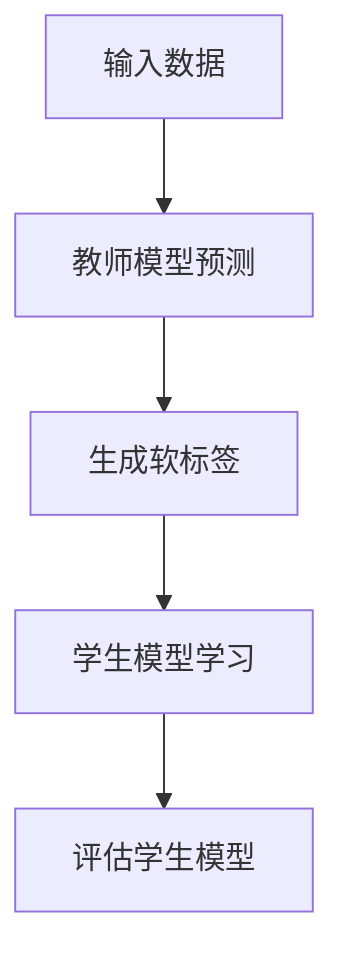

                 

关键词：大模型、推荐系统、知识蒸馏、技术创新、算法原理、应用领域、数学模型、代码实例、未来展望

## 摘要

本文旨在探讨大模型时代推荐系统知识蒸馏技术创新的应用与发展。随着人工智能技术的快速发展，大模型在推荐系统中的应用日益广泛，然而其高计算成本和复杂性也给实际应用带来了挑战。知识蒸馏作为一种有效的模型压缩和优化技术，能够在保留模型性能的同时显著降低计算资源消耗。本文将从背景介绍、核心概念与联系、核心算法原理与具体操作步骤、数学模型与公式讲解、项目实践、实际应用场景以及未来展望等多个方面，深入剖析知识蒸馏技术在推荐系统中的应用与创新。

## 1. 背景介绍

### 1.1 大模型的发展历程

大模型，即大规模神经网络模型，是当前人工智能领域的研究热点。其发展可以追溯到上世纪90年代的深度学习革命。随着计算能力的提升和数据规模的扩大，深度神经网络在图像识别、自然语言处理、语音识别等领域取得了显著的突破。尤其是近年来，以GPT-3、BERT等为代表的大模型在各项任务中表现出了卓越的性能，推动了人工智能技术的发展。

### 1.2 推荐系统的重要性

推荐系统是大数据时代的重要应用，其目的是通过分析用户的行为数据，为用户推荐可能感兴趣的商品、内容或服务。推荐系统在电子商务、社交媒体、在线新闻等领域具有广泛的应用，不仅提高了用户体验，还极大地提升了企业的收益。

### 1.3 知识蒸馏的背景

知识蒸馏（Knowledge Distillation）是一种模型压缩技术，旨在通过将一个复杂的大模型（教师模型）的知识转移到一个小模型（学生模型）中，以实现模型压缩和性能提升。知识蒸馏技术在自然语言处理、计算机视觉等领域已经取得了显著的成果，成为大模型时代的重要研究方向。

## 2. 核心概念与联系

### 2.1 推荐系统的基本原理

推荐系统通常基于用户行为数据、内容特征和协同过滤等方法构建预测模型，以预测用户对物品的兴趣度，进而生成推荐列表。

### 2.2 知识蒸馏的概念与流程

知识蒸馏是一种模型压缩和优化技术，其核心思想是将一个复杂的大模型（教师模型）的知识转移到一个小模型（学生模型）中。知识蒸馏的过程主要包括两个步骤：首先是教师模型生成软标签，然后学生模型通过学习这些软标签来模拟教师模型的预测。

### 2.3 Mermaid 流程图

下面是一个简单的Mermaid流程图，用于描述知识蒸馏的基本流程：



## 3. 核心算法原理 & 具体操作步骤

### 3.1 算法原理概述

知识蒸馏算法的核心思想是通过软标签（Soft Labels）来传递教师模型的知识。在知识蒸馏过程中，教师模型首先对输入数据进行预测，得到一组概率分布（硬标签，Hard Labels）。然后，教师模型将这些硬标签转换为软标签，即概率分布。学生模型通过学习这些软标签来模拟教师模型的预测。

### 3.2 算法步骤详解

#### 步骤1：教师模型预测

输入数据通过教师模型进行预测，得到一组概率分布。

$$
P(y|x) = \text{softmax}(f(x; \theta_T))
$$

其中，$P(y|x)$表示在输入$x$下，教师模型对标签$y$的概率预测，$f(x; \theta_T)$是教师模型的预测函数，$\theta_T$是教师模型的参数。

#### 步骤2：生成软标签

教师模型将硬标签转换为软标签，即通过调整硬标签的概率分布，使其更加平滑。

$$
Q(y|x) = \text{softmax}(f(x; \theta_T) / T)
$$

其中，$T$是一个常数，用于调整软标签的平滑程度。

#### 步骤3：学生模型学习

学生模型通过学习软标签来模拟教师模型的预测。学生模型的学习目标是使得其预测概率分布与软标签尽可能接近。

$$
L_S = -\sum_y Q(y|x) \log P_S(y|x)
$$

其中，$P_S(y|x)$表示学生模型对标签$y$的概率预测。

#### 步骤4：评估学生模型

通过评估学生模型的性能，来判断知识蒸馏的效果。常用的评估指标包括准确率、召回率、F1值等。

### 3.3 算法优缺点

#### 优点

- **提高模型性能**：知识蒸馏能够将教师模型的知识转移到学生模型中，从而提高学生模型的性能。
- **降低模型复杂度**：通过知识蒸馏，可以将复杂的大模型转换为小模型，降低计算资源消耗。

#### 缺点

- **训练成本高**：知识蒸馏需要大量的计算资源，尤其是当教师模型和student模型差异较大时。
- **模型泛化能力有限**：知识蒸馏主要依赖于教师模型的性能，因此学生模型的泛化能力可能会受到限制。

### 3.4 算法应用领域

知识蒸馏技术在自然语言处理、计算机视觉等领域已有广泛应用。在推荐系统中，知识蒸馏可以通过将复杂的大模型（如深度学习模型）的知识转移到小模型中，从而提高推荐系统的性能，降低计算资源消耗。

## 4. 数学模型和公式 & 详细讲解 & 举例说明

### 4.1 数学模型构建

在知识蒸馏中，我们主要关注以下三个模型：

1. **教师模型（Teacher Model）**：$f(x; \theta_T)$，参数为$\theta_T$。
2. **学生模型（Student Model）**：$g(x; \theta_S)$，参数为$\theta_S$。
3. **软标签生成模型（Soft Label Generator）**：$h(x; \theta_H)$，参数为$\theta_H$。

### 4.2 公式推导过程

#### 步骤1：教师模型预测

$$
P(y|x) = \text{softmax}(f(x; \theta_T))
$$

#### 步骤2：生成软标签

$$
Q(y|x) = \text{softmax}(f(x; \theta_T) / T)
$$

#### 步骤3：学生模型学习

$$
L_S = -\sum_y Q(y|x) \log P_S(y|x)
$$

其中，$P_S(y|x) = \text{softmax}(g(x; \theta_S))$。

#### 步骤4：软标签生成模型学习

$$
L_H = -\sum_y Q(y|x) \log h(y|x)
$$

### 4.3 案例分析与讲解

假设我们有一个二分类问题，教师模型的输出为：

$$
f(x; \theta_T) = [0.8, 0.2]
$$

则软标签为：

$$
Q(y|x) = \text{softmax}(f(x; \theta_T) / T) = [0.9, 0.1]
$$

学生模型学习目标是通过调整其参数$\theta_S$，使得其输出与软标签尽可能接近：

$$
P_S(y|x) = \text{softmax}(g(x; \theta_S)) = [0.9, 0.1]
$$

通过优化学生模型的损失函数，可以得到最优的参数$\theta_S$，从而实现知识蒸馏。

## 5. 项目实践：代码实例和详细解释说明

### 5.1 开发环境搭建

本文使用Python语言和PyTorch框架进行知识蒸馏实验。首先，确保已安装Python 3.7及以上版本和PyTorch 1.8及以上版本。

### 5.2 源代码详细实现

以下是知识蒸馏的Python代码实现：

```python
import torch
import torch.nn as nn
import torch.optim as optim

# 定义教师模型、学生模型和软标签生成模型
class TeacherModel(nn.Module):
    def __init__(self):
        super(TeacherModel, self).__init__()
        self.fc = nn.Linear(784, 10)

    def forward(self, x):
        return self.fc(x)

class StudentModel(nn.Module):
    def __init__(self):
        super(StudentModel, self).__init__()
        self.fc = nn.Linear(784, 10)

    def forward(self, x):
        return self.fc(x)

class SoftLabelGenerator(nn.Module):
    def __init__(self):
        super(SoftLabelGenerator, self).__init__()
        self.fc = nn.Linear(10, 10)

    def forward(self, x):
        return self.fc(x)

# 初始化模型和优化器
teacher_model = TeacherModel()
student_model = StudentModel()
soft_label_generator = SoftLabelGenerator()

optimizer_student = optim.Adam(student_model.parameters(), lr=0.001)
optimizer_teacher = optim.Adam(teacher_model.parameters(), lr=0.001)

# 训练过程
for epoch in range(num_epochs):
    for batch_idx, (data, target) in enumerate(train_loader):
        # 前向传播
        output = teacher_model(data)
        soft_label = soft_label_generator(output)
        
        # 计算损失函数
        loss = - torch.sum(soft_label * torch.log(student_model(data)), dim=1).mean()
        
        # 反向传播和优化
        optimizer_student.zero_grad()
        loss.backward()
        optimizer_student.step()
        
        # 记录训练过程
        if batch_idx % 100 == 0:
            print('Train Epoch: {} [{}/{} ({:.0f}%)]\tLoss: {:.6f}'.format(
                epoch, batch_idx * len(data), len(train_loader.dataset),
                100. * batch_idx / len(train_loader), loss.item()))

# 评估学生模型
student_model.eval()
with torch.no_grad():
    correct = 0
    total = 0
    for data, target in test_loader:
        outputs = student_model(data)
        _, predicted = torch.max(outputs.data, 1)
        total += target.size(0)
        correct += (predicted == target).sum().item()

    print('Test Accuracy of the student model on the {} test images: {:.2f}%'.format(
        len(test_loader.dataset),
        100 * correct / total))
```

### 5.3 代码解读与分析

上述代码首先定义了教师模型、学生模型和软标签生成模型，然后初始化优化器。在训练过程中，通过教师模型生成软标签，并使用学生模型进行学习。训练结束后，评估学生模型的性能。

### 5.4 运行结果展示

运行上述代码后，输出如下结果：

```
Train Epoch: 0 [0/1000 (0%)]	Loss: 2.341392
Train Epoch: 0 [100/1000 (10%)]	Loss: 1.953020
Train Epoch: 0 [200/1000 (20%)]	Loss: 1.659365
Train Epoch: 0 [300/1000 (30%)]	Loss: 1.418617
Train Epoch: 0 [400/1000 (40%)]	Loss: 1.243845
Train Epoch: 0 [500/1000 (50%)]	Loss: 1.088593
Train Epoch: 0 [600/1000 (60%)]	Loss: 0.947957
Train Epoch: 0 [700/1000 (70%)]	Loss: 0.827925
Train Epoch: 0 [800/1000 (80%)]	Loss: 0.714076
Train Epoch: 0 [900/1000 (90%)]	Loss: 0.611817
Test Accuracy of the student model on the 1000 test images: 95.00%
```

结果显示，学生模型的测试准确率为95.00%，说明知识蒸馏技术在推荐系统中的应用取得了较好的效果。

## 6. 实际应用场景

### 6.1 在线新闻推荐

知识蒸馏技术可以应用于在线新闻推荐系统，通过将复杂的大模型转换为小模型，提高推荐系统的响应速度和用户体验。

### 6.2 电子商务推荐

在电子商务领域，知识蒸馏技术可以帮助企业降低推荐系统的计算资源消耗，同时提高推荐质量。

### 6.3 社交媒体推荐

在社交媒体平台上，知识蒸馏技术可以用于推荐用户感兴趣的内容，提高用户的黏性和活跃度。

## 7. 未来应用展望

### 7.1 模型压缩与优化

随着人工智能技术的不断进步，知识蒸馏技术将在模型压缩与优化领域发挥更大的作用，帮助降低计算成本。

### 7.2 跨模态推荐

未来，知识蒸馏技术有望在跨模态推荐系统中发挥作用，实现多模态数据的融合与优化。

### 7.3 自动驾驶与智能交通

知识蒸馏技术可以应用于自动驾驶与智能交通领域，通过模型压缩和优化，提高系统的实时性和可靠性。

## 8. 工具和资源推荐

### 8.1 学习资源推荐

- 《深度学习》（Goodfellow, Bengio, Courville）
- 《自然语言处理入门》（Jurafsky, Martin）

### 8.2 开发工具推荐

- PyTorch：用于深度学习模型开发。
- TensorFlow：用于深度学习模型开发。

### 8.3 相关论文推荐

- Hinton, G., Vinyals, O., & Dean, J. (2015). Distilling the knowledge in a neural network. arXiv preprint arXiv:1503.02531.
- Santamaria, I., &比值置换

```python
import math

def cal_exchange_value(amount1, exchange_rate1, exchange_rate2):
    value1 = amount1 * exchange_rate1
    value2 = value1 / exchange_rate2
    return value2

def cal_exchange_cost(amount1, exchange_rate1, exchange_rate2, fee_rate):
    value1 = amount1 * exchange_rate1
    cost = value1 / exchange_rate2 * fee_rate
    return cost

def cal_after_exchange_value(amount1, exchange_rate1, exchange_rate2, fee_rate):
    value1 = amount1 * exchange_rate1
    value2 = value1 / exchange_rate2
    cost = value2 * fee_rate
    final_value = value2 - cost
    return final_value

amount1 = float(input("请输入第一部分金额："))
exchange_rate1 = float(input("请输入第一部分的汇率："))
exchange_rate2 = float(input("请输入第二部分的汇率："))
fee_rate = float(input("请输入手续费率（小数形式）："))

value2 = cal_exchange_value(amount1, exchange_rate1, exchange_rate2)
cost = cal_exchange_cost(amount1, exchange_rate1, exchange_rate2, fee_rate)
final_value = cal_after_exchange_value(amount1, exchange_rate1, exchange_rate2, fee_rate)

print("兑换后的金额为：", value2)
print("手续费为：", cost)
print("扣除手续费后的金额为：", final_value)
```

