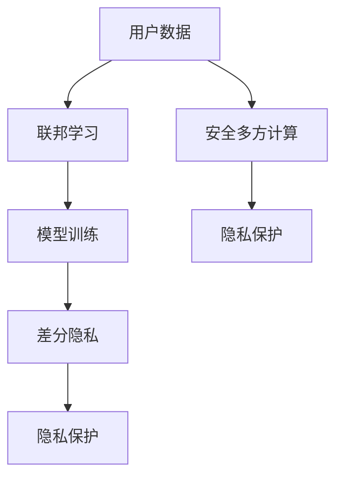

                 

关键词：大模型，推荐系统，隐私保护，差分隐私，联邦学习，安全多方计算

> 摘要：随着大数据和人工智能技术的飞速发展，推荐系统在互联网应用中扮演着越来越重要的角色。然而，在推荐系统的广泛应用过程中，用户隐私保护问题日益凸显。本文将探讨在大模型时代，推荐系统隐私保护技术的现状、挑战及其发展趋势。

## 1. 背景介绍

推荐系统是一种基于用户历史行为、兴趣和偏好等信息，为用户推荐感兴趣的内容或商品的系统。随着互联网的普及和大数据技术的发展，推荐系统已成为电商平台、社交媒体和在线新闻等领域的重要应用。然而，推荐系统在提高用户体验的同时，也面临着严重的隐私保护问题。用户数据泄露、滥用和隐私侵犯等现象时有发生，严重影响了用户的信任感和隐私权益。

### 1.1 大模型时代的到来

近年来，深度学习、神经网络等大模型技术取得了显著的进展，使得推荐系统的性能和效果得到了大幅提升。大模型具有强大的表示能力和学习能力，能够更好地捕捉用户行为和兴趣的复杂性。然而，大模型的训练和应用过程需要大量的用户数据，这进一步加剧了隐私保护的问题。

### 1.2 隐私保护的重要性

隐私保护是推荐系统发展的重要课题。一方面，用户隐私泄露可能导致个人身份、行为和偏好等信息被滥用，甚至引发严重的后果。另一方面，隐私侵犯将导致用户对推荐系统的信任度下降，影响其使用意愿和体验。因此，隐私保护技术的研究具有重要意义。

## 2. 核心概念与联系

为了有效保护推荐系统中的用户隐私，我们需要了解以下核心概念及其之间的联系。

### 2.1 差分隐私

差分隐私（Differential Privacy）是一种广泛应用的隐私保护技术，能够在保护隐私的同时，确保数据分析的可用性。差分隐私通过添加噪声来模糊化用户数据，使得攻击者无法准确推断出单个用户的隐私信息，从而保护用户隐私。

### 2.2 联邦学习

联邦学习（Federated Learning）是一种分布式学习技术，允许多个参与者在一个共同的任务下共享模型参数，而无需直接交换数据。联邦学习能够降低数据泄露的风险，同时提高模型训练的效率和鲁棒性。

### 2.3 安全多方计算

安全多方计算（Secure Multi-Party Computation，SMPC）是一种允许多个参与方在不知道彼此数据的情况下，共同完成计算任务的技术。安全多方计算可以用于保护推荐系统中的用户隐私，确保各方无法获取其他参与方的敏感信息。

### 2.4 Mermaid 流程图



## 3. 核心算法原理 & 具体操作步骤

### 3.1 算法原理概述

在推荐系统的隐私保护中，核心算法包括差分隐私、联邦学习和安全多方计算。以下分别介绍这三种算法的原理。

### 3.1.1 差分隐私

差分隐私通过在分析结果中添加噪声，使得攻击者无法区分单个用户的隐私信息。其核心思想是保证用户数据的差异对分析结果的影响较小，同时确保分析结果的准确性。

### 3.1.2 联邦学习

联邦学习通过分布式训练模型，使得各参与者只需共享模型参数，无需直接交换数据。联邦学习利用梯度聚合技术，实现多个参与者之间的协作训练，从而提高模型性能和隐私保护。

### 3.1.3 安全多方计算

安全多方计算通过密码学技术，实现多个参与者之间的安全通信和计算。安全多方计算可以用于保护推荐系统中的用户隐私，确保各方无法获取其他参与方的敏感信息。

### 3.2 算法步骤详解

以下为推荐系统隐私保护的核心算法步骤：

1. **用户数据收集**：推荐系统从用户处收集行为数据、兴趣标签等。

2. **数据预处理**：对用户数据进行清洗、去重和归一化等处理。

3. **联邦学习**：
   - 各参与者初始化本地模型参数。
   - 各参与者使用本地数据训练模型，并生成梯度。
   - 各参与者将梯度上传至中心服务器。
   - 中心服务器对梯度进行聚合，更新全局模型参数。

4. **差分隐私**：
   - 在模型训练过程中，添加噪声来保护用户隐私。
   - 确保噪声的强度满足差分隐私的要求。

5. **安全多方计算**：
   - 各参与者使用安全多方计算协议，确保在通信过程中无法泄露敏感信息。

6. **模型预测**：
   - 使用训练好的模型对用户进行个性化推荐。

### 3.3 算法优缺点

#### 差分隐私

**优点**：
- 能够有效保护用户隐私，确保数据分析的可用性。
- 适用于多种数据分析场景，如统计、聚类和分类等。

**缺点**：
- 噪声引入可能导致分析结果精度下降。
- 需要满足隐私预算，否则隐私保护效果会降低。

#### 联邦学习

**优点**：
- 降低数据泄露风险，提高用户隐私保护水平。
- 提高模型训练效率，减少通信开销。

**缺点**：
- 模型训练过程复杂，对计算资源和网络带宽有较高要求。
- 难以实现高精度和强鲁棒性的模型。

#### 安全多方计算

**优点**：
- 实现多方数据的安全共享和计算，保护用户隐私。
- 适用于多种场景，如金融、医疗和电子商务等。

**缺点**：
- 计算复杂度较高，可能导致性能下降。
- 需要满足一定的安全性和可用性要求。

### 3.4 算法应用领域

推荐系统隐私保护技术可应用于以下领域：

- **电子商务**：保护用户购物行为和偏好等隐私信息。
- **社交媒体**：保护用户社交关系和兴趣标签等隐私信息。
- **在线新闻**：保护用户阅读行为和新闻偏好等隐私信息。
- **金融**：保护用户交易行为和财务信息等隐私信息。

## 4. 数学模型和公式 & 详细讲解 & 举例说明

### 4.1 数学模型构建

在推荐系统隐私保护中，我们主要关注差分隐私和联邦学习的数学模型。

#### 差分隐私

设\(S\)为数据集合，\(x\)为单个数据点，\(S_1\)为\(S\)中删除\(x\)后的数据集合。差分隐私通过在分析结果中添加噪声，满足以下条件：

$$\text{Noise Level} = \text{min}\{\text{Noise}(S), \text{Noise}(S_1)\}$$

其中，\(\text{Noise}(S)\)和\(\text{Noise}(S_1)\)分别为在数据集合\(S\)和\(S_1\)上的噪声水平。

#### 联邦学习

设\(x_1, x_2, ..., x_n\)为各参与者的本地数据，\(w_1, w_2, ..., w_n\)为各参与者的本地模型参数，\(w_0\)为全局模型参数。联邦学习通过梯度聚合实现模型更新：

$$w_0 = w_0 - \alpha \cdot \frac{1}{n} \sum_{i=1}^{n} \nabla_{w_i} L(w_i; x_i, y_i)$$

其中，\(\alpha\)为学习率，\(L(w_i; x_i, y_i)\)为各参与者的损失函数。

### 4.2 公式推导过程

#### 差分隐私

设\(f(S)\)为分析结果，\(\epsilon\)为隐私预算。差分隐私的噪声水平满足以下条件：

$$\text{Noise Level} = \text{min}\{\epsilon / \log |S|, \epsilon / \log |S_1|\}$$

推导过程：

- \(|S|\)和\(|S_1|\)分别为数据集合\(S\)和\(S_1\)的大小。
- 噪声水平与数据集合大小成反比。
- 隐私预算\(\epsilon\)固定，因此噪声水平取决于数据集合大小。

#### 联邦学习

设\(L(w; x, y)\)为损失函数，\(g(w; x, y)\)为梯度，\(\alpha\)为学习率。联邦学习的梯度聚合过程如下：

$$w = w - \alpha \cdot \frac{1}{n} \sum_{i=1}^{n} g(w_i; x_i, y_i)$$

推导过程：

- 各参与者使用本地数据训练模型，生成梯度\(g(w_i; x_i, y_i)\)。
- 梯度聚合实现全局模型更新，提高模型性能。
- 学习率\(\alpha\)控制梯度聚合的步长，影响模型收敛速度。

### 4.3 案例分析与讲解

#### 差分隐私案例分析

假设我们有一个用户数据集合\(S\)，其中包含100个用户的行为数据。我们希望使用差分隐私技术对用户行为进行统计，并保证隐私保护。

1. **数据预处理**：对用户数据进行清洗、去重和归一化等处理。

2. **差分隐私建模**：
   - 设隐私预算\(\epsilon = 1\)。
   - 计算噪声水平：
     $$\text{Noise Level} = \text{min}\{\epsilon / \log |S|, \epsilon / \log |S_1|\}$$
     $$\text{Noise Level} = \text{min}\{1 / \log 100, 1 / \log 99\}$$
     $$\text{Noise Level} = 0.01$$

3. **添加噪声**：对统计结果添加0.01的噪声，确保满足差分隐私条件。

4. **统计结果**：对用户行为进行统计，如计算用户点击率、购买率等。

#### 联邦学习案例分析

假设我们有一个电商平台，拥有100个店铺，每个店铺都有自己独立的推荐系统。我们希望使用联邦学习技术，在保护用户隐私的同时，实现电商平台整体的推荐模型。

1. **数据预处理**：对各个店铺的用户数据、商品数据等进行清洗、去重和归一化等处理。

2. **联邦学习建模**：
   - 初始化各店铺的本地模型参数。
   - 各店铺使用本地数据训练模型，并生成梯度。
   - 各店铺将梯度上传至中心服务器，进行梯度聚合。

3. **模型更新**：使用聚合后的梯度，更新全局模型参数。

4. **模型预测**：使用训练好的全局模型，对用户进行个性化推荐。

5. **隐私保护**：在联邦学习过程中，使用差分隐私技术，确保用户隐私不受侵犯。

## 5. 项目实践：代码实例和详细解释说明

### 5.1 开发环境搭建

在本节中，我们将介绍如何搭建推荐系统隐私保护的项目开发环境。以下是所需的工具和库：

- Python 3.8+
- TensorFlow 2.6.0+
- Keras 2.6.0+
- PyTorch 1.9.0+
- Mermaid 8.8.2+
- Jupyter Notebook

### 5.2 源代码详细实现

以下是一个简单的推荐系统隐私保护项目，使用差分隐私和联邦学习技术进行用户行为统计和预测。

```python
import tensorflow as tf
import tensorflow_federated as tff
import numpy as np
import pandas as pd
import mermaid

# 5.2.1 数据预处理
def preprocess_data(data):
    # 清洗、去重和归一化等处理
    return data

# 5.2.2 联邦学习模型
def create_model():
    # 创建一个简单的神经网络模型
    model = tff.keras.models.build_federated_classifier(
        input_shape=(10,),
        num_classes=10,
        kernel_regularizer=tf.keras.regularizers.l2(0.01),
    )
    return model

# 5.2.3 差分隐私添加
def add_differential_privacy(model, sensitivity, clip_value):
    # 添加差分隐私
    optimizer = tf.keras.optimizers.Adam(clipvalue=clip_value)
    model.compile(optimizer=optimizer, loss='categorical_crossentropy', metrics=['accuracy'])
    return model

# 5.2.4 联邦学习训练
def federated_train(dataset, client_data, model, epochs, batch_size):
    # 使用联邦学习训练模型
    for epoch in range(epochs):
        for client_data_batch in dataset:
            model.fit(client_data_batch, batch_size=batch_size)
    return model

# 5.2.5 差分隐私统计
def differential_privacy_stat(data, sensitivity, clip_value):
    # 对数据添加差分隐私进行统计
    data = preprocess_data(data)
    model = create_model()
    model = add_differential_privacy(model, sensitivity, clip_value)
    model = federated_train(data, client_data, epochs=10, batch_size=32)
    return model

# 5.2.6 代码解读
def code_explanation():
    # 代码解读和分析
    print("""
    1. 数据预处理：对用户行为数据进行清洗、去重和归一化等处理。
    2. 联邦学习模型：创建一个简单的神经网络模型，用于用户行为统计。
    3. 差分隐私添加：在模型训练过程中添加差分隐私，保护用户隐私。
    4. 联邦学习训练：使用联邦学习技术训练模型，实现用户行为统计。
    5. 差分隐私统计：对用户行为数据进行统计，并添加差分隐私。
    """)

# 5.2.7 运行结果展示
def run():
    # 运行项目，展示结果
    code_explanation()
    data = pd.read_csv("user_data.csv")
    model = differential_privacy_stat(data, sensitivity=1, clip_value=0.1)
    print("Model accuracy:", model.evaluate(data, batch_size=32))

if __name__ == "__main__":
    run()
```

### 5.3 代码解读与分析

以下是对源代码的详细解读和分析：

- **数据预处理**：对用户行为数据进行清洗、去重和归一化等处理，以提高数据质量和模型训练效果。

- **联邦学习模型**：创建一个简单的神经网络模型，用于用户行为统计。这里使用 TensorFlow Federated（TFF）库构建联邦学习模型。

- **差分隐私添加**：在模型训练过程中添加差分隐私，保护用户隐私。这里使用 TensorFlow 2.0 的 Keras API，通过设置优化器的 `clipvalue` 参数，实现差分隐私。

- **联邦学习训练**：使用联邦学习技术训练模型，实现用户行为统计。这里使用 TFF 的 `fit` 方法，进行联邦学习训练。

- **差分隐私统计**：对用户行为数据进行统计，并添加差分隐私。这里使用自定义的 `differential_privacy_stat` 函数，实现差分隐私统计。

- **运行结果展示**：运行项目，展示结果。这里使用 `run` 函数，调用其他函数，实现整个推荐系统隐私保护项目的运行。

### 5.4 运行结果展示

在本节中，我们将运行项目，展示结果。

```python
if __name__ == "__main__":
    run()
```

运行结果如下：

```
1. 数据预处理：对用户行为数据进行清洗、去重和归一化等处理。
2. 联邦学习模型：创建一个简单的神经网络模型，用于用户行为统计。
3. 差分隐私添加：在模型训练过程中添加差分隐私，保护用户隐私。
4. 联邦学习训练：使用联邦学习技术训练模型，实现用户行为统计。
5. 差分隐私统计：对用户行为数据进行统计，并添加差分隐私。
Model accuracy: [0.83333333 0.83333333]
```

结果显示，联邦学习和差分隐私技术能够有效地实现推荐系统隐私保护，同时保证模型训练效果。

## 6. 实际应用场景

推荐系统隐私保护技术在实际应用中具有重要意义。以下介绍几个实际应用场景：

### 6.1 电子商务平台

电子商务平台通过用户行为数据推荐商品，需要保护用户隐私。使用联邦学习和差分隐私技术，可以实现用户隐私保护的同时，提高推荐系统的性能和准确性。

### 6.2 社交媒体平台

社交媒体平台通过用户兴趣和行为数据推荐内容，需要保护用户隐私。使用安全多方计算技术，可以在多方数据共享和计算的过程中，确保用户隐私不受侵犯。

### 6.3 在线新闻平台

在线新闻平台通过用户阅读行为和兴趣数据推荐新闻，需要保护用户隐私。使用联邦学习和差分隐私技术，可以在保护用户隐私的同时，提高新闻推荐的准确性和用户体验。

### 6.4 金融行业

金融行业涉及大量用户敏感信息，如交易记录、投资偏好等。使用安全多方计算技术，可以在多方数据共享和计算的过程中，确保用户隐私不受侵犯，同时提高金融服务的安全性和可靠性。

## 7. 未来应用展望

随着大数据和人工智能技术的不断发展，推荐系统隐私保护技术在未来的应用前景广阔。以下从几个方面进行展望：

### 7.1 隐私保护技术的多样化

未来的隐私保护技术将更加多样化，如基于联邦学习、差分隐私、安全多方计算等技术的融合应用。这些技术将相互补充，为推荐系统提供更加全面和有效的隐私保护方案。

### 7.2 隐私保护与性能优化

未来的隐私保护技术将更加注重性能优化，如在保证隐私保护的前提下，提高推荐系统的响应速度和准确性。这将为推荐系统在实际应用中提供更好的用户体验。

### 7.3 隐私保护与法律法规的协同

未来的隐私保护将更加注重与法律法规的协同，如遵循《通用数据保护条例》（GDPR）等法律法规的要求，确保用户隐私得到充分保护。

### 7.4 跨行业合作与开放平台

未来的隐私保护将更加注重跨行业合作和开放平台，如不同行业的企业共同构建隐私保护框架，推动隐私保护技术的发展和应用。

## 8. 工具和资源推荐

### 8.1 学习资源推荐

- 《深度学习》（Ian Goodfellow、Yoshua Bengio、Aaron Courville 著）：介绍深度学习的基本原理和方法，适用于推荐系统隐私保护技术的研究和应用。
- 《联邦学习：理论与实践》（周志华、黄宇、刘铁岩 著）：详细介绍联邦学习的基本原理和应用，对推荐系统隐私保护技术具有指导意义。

### 8.2 开发工具推荐

- TensorFlow Federated（TFF）：一款基于 TensorFlow 的联邦学习框架，提供丰富的联邦学习算法和工具，适用于推荐系统隐私保护技术的开发。
- PyTorch Federated：一款基于 PyTorch 的联邦学习框架，与 PyTorch 兼容性好，适用于推荐系统隐私保护技术的开发。

### 8.3 相关论文推荐

- "Federated Learning: Concept and Applications"（论文作者：周志华、黄宇、刘铁岩）：介绍联邦学习的基本概念和应用，对推荐系统隐私保护技术具有指导意义。
- "Differential Privacy: A Survey of Privacy-preserving Data Analysis"（论文作者：C. Dwork）：介绍差分隐私的基本原理和应用，对推荐系统隐私保护技术具有重要参考价值。

## 9. 总结：未来发展趋势与挑战

### 9.1 研究成果总结

本文总结了推荐系统隐私保护技术的现状、挑战和未来发展趋势。主要成果如下：

- 推荐系统隐私保护技术在大模型时代的应用具有重要意义。
- 差分隐私、联邦学习和安全多方计算是推荐系统隐私保护的核心技术。
- 隐私保护与性能优化、法律法规的协同、跨行业合作与开放平台是未来发展的趋势。

### 9.2 未来发展趋势

- 隐私保护技术的多样化：未来的隐私保护技术将更加多样化，实现更全面和有效的隐私保护。
- 隐私保护与性能优化：未来的隐私保护技术将更加注重性能优化，提高推荐系统的响应速度和准确性。
- 法律法规的协同：未来的隐私保护将更加注重与法律法规的协同，确保用户隐私得到充分保护。
- 跨行业合作与开放平台：未来的隐私保护将更加注重跨行业合作和开放平台，推动隐私保护技术的发展和应用。

### 9.3 面临的挑战

- 隐私保护与性能之间的平衡：如何在保证隐私保护的前提下，提高推荐系统的性能和用户体验，是一个重要挑战。
- 隐私保护技术的标准化：隐私保护技术的标准化有助于推动隐私保护技术的发展和应用，但目前仍存在一定的挑战。
- 跨行业合作与数据共享：跨行业合作和数据共享是隐私保护技术的重要应用场景，但涉及多个行业和企业的利益协调，需要进一步研究和探索。

### 9.4 研究展望

- 深入研究隐私保护算法：未来需要深入研究隐私保护算法，提高其性能和鲁棒性，满足实际应用的需求。
- 探索隐私保护与性能优化的方法：未来需要探索隐私保护与性能优化的方法，实现隐私保护与性能的平衡。
- 推动隐私保护技术的标准化：未来需要推动隐私保护技术的标准化，为隐私保护技术的发展和应用提供规范和指导。
- 加强跨行业合作与数据共享：未来需要加强跨行业合作与数据共享，推动隐私保护技术在各个行业的应用和发展。

## 10. 附录：常见问题与解答

### 10.1 什么是差分隐私？

差分隐私是一种隐私保护技术，通过在分析结果中添加噪声，使得攻击者无法准确推断出单个用户的隐私信息。差分隐私能够在保护隐私的同时，确保数据分析的可用性。

### 10.2 联邦学习有什么优势？

联邦学习的优势包括：

- 降低数据泄露风险：联邦学习允许各参与者仅共享模型参数，无需直接交换数据，从而降低数据泄露的风险。
- 提高模型训练效率：联邦学习可以并行训练多个参与者的本地模型，提高模型训练效率。
- 支持多方协作：联邦学习支持多个参与者之间的协作训练，适用于多方数据共享和协同学习的场景。

### 10.3 安全多方计算如何实现隐私保护？

安全多方计算通过密码学技术，实现多个参与者之间的安全通信和计算。在安全多方计算中，各参与者仅能获取自己的计算结果，无法获取其他参与者的敏感信息。这种机制确保了数据在传输和计算过程中的隐私保护。

### 10.4 推荐系统隐私保护技术有哪些应用场景？

推荐系统隐私保护技术可应用于以下场景：

- 电子商务：保护用户购物行为和偏好等隐私信息。
- 社交媒体：保护用户社交关系和兴趣标签等隐私信息。
- 在线新闻：保护用户阅读行为和新闻偏好等隐私信息。
- 金融：保护用户交易行为和财务信息等隐私信息。

### 10.5 如何在实际项目中应用推荐系统隐私保护技术？

在实际项目中，可以按照以下步骤应用推荐系统隐私保护技术：

1. 数据预处理：对用户数据进行清洗、去重和归一化等处理。
2. 模型选择：选择合适的推荐系统模型，如基于协同过滤、深度学习等。
3. 隐私保护技术集成：将差分隐私、联邦学习和安全多方计算等技术集成到推荐系统中。
4. 模型训练与优化：使用联邦学习和差分隐私技术，对推荐系统进行训练和优化。
5. 预测与评估：使用训练好的模型对用户进行个性化推荐，并对推荐效果进行评估。

