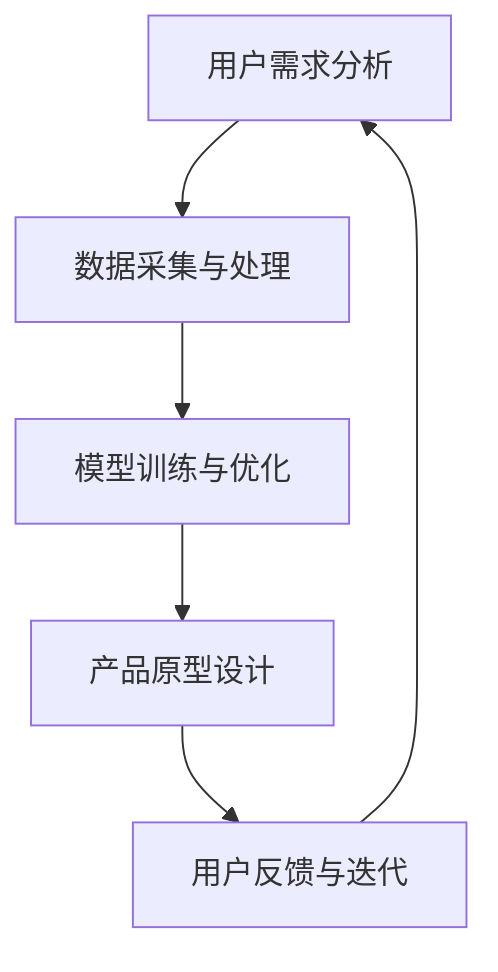

                 

 关键词：大模型，创业设计，产品设计，策略，AI，技术，趋势

> 摘要：本文深入探讨了在人工智能与大数据技术快速发展的背景下，创业企业如何通过科学的设计策略来开发具有市场竞争力的大模型产品。文章涵盖了核心概念介绍、算法原理与操作步骤、数学模型与公式推导、项目实践与代码实例，并探讨了实际应用场景及未来展望。通过本文，读者将了解如何利用先进技术为创业企业带来新的发展机遇。

## 1. 背景介绍

### 1.1 大模型时代的到来

随着云计算、大数据和人工智能技术的迅猛发展，我们正步入一个以大模型为核心的新时代。大模型，顾名思义，指的是能够处理海量数据、具备复杂智能决策能力的机器学习模型。从早期的浅层模型，如神经网络，到如今能够实现高效知识提取与推理的深度学习模型，大模型的规模和复杂性不断增长。

### 1.2 创业设计的重要性

在竞争激烈的市场环境中，创业企业如何通过有效的产品设计来脱颖而出，是每个创业者必须面对的挑战。一个好的产品设计不仅能够满足用户需求，还能在商业上取得成功。随着技术的进步，创业企业可以利用大模型技术来提升产品设计水平，开拓新的市场机遇。

### 1.3 创业产品设计面临的挑战

1. **技术门槛**：大模型设计需要深厚的机器学习知识储备和丰富的工程实践经验。
2. **资源限制**：创业企业通常面临资源限制，难以与大型科技企业竞争。
3. **市场需求**：如何准确捕捉用户需求，开发出真正有价值的产品，是一个巨大的挑战。

## 2. 核心概念与联系

### 2.1 大模型的核心概念

- **深度学习**：一种模拟人脑神经网络的机器学习技术，通过多层神经网络进行数据提取和特征学习。
- **大数据处理**：利用分布式计算和存储技术，对大规模数据进行高效处理和分析。
- **强化学习**：一种通过不断试错来学习策略的机器学习技术，广泛应用于游戏、推荐系统等领域。

### 2.2 大模型与创业设计的联系

- **用户画像**：通过大数据分析构建用户画像，帮助企业更精准地定位用户需求。
- **个性化推荐**：利用深度学习模型为用户推荐个性化的产品或服务。
- **自动化决策**：通过强化学习模型实现自动化决策，提高运营效率。

### 2.3 Mermaid 流程图



## 3. 核心算法原理 & 具体操作步骤

### 3.1 算法原理概述

大模型的设计通常涉及以下核心算法：

- **深度神经网络（DNN）**：用于特征提取和分类。
- **循环神经网络（RNN）**：用于处理序列数据，如自然语言文本。
- **卷积神经网络（CNN）**：用于图像识别和分类。
- **生成对抗网络（GAN）**：用于数据生成和增强。

### 3.2 算法步骤详解

1. **需求分析**：明确产品目标和用户需求。
2. **数据收集**：从各种渠道收集相关数据。
3. **数据处理**：对数据进行清洗、归一化和特征提取。
4. **模型选择**：根据需求选择合适的模型。
5. **模型训练**：使用训练数据对模型进行训练。
6. **模型评估**：使用验证数据对模型进行评估和调整。
7. **产品发布**：将训练好的模型集成到产品中。

### 3.3 算法优缺点

- **深度神经网络（DNN）**：优点是能够处理复杂的非线性问题，缺点是训练时间较长，需要大量计算资源。
- **循环神经网络（RNN）**：优点是能够处理序列数据，缺点是存在梯度消失和梯度爆炸问题。
- **卷积神经网络（CNN）**：优点是能够有效地提取图像特征，缺点是对于非图像数据的应用有限。
- **生成对抗网络（GAN）**：优点是能够生成高质量的数据，缺点是需要大量的计算资源，且训练过程不稳定。

### 3.4 算法应用领域

- **推荐系统**：利用深度学习模型进行用户画像和个性化推荐。
- **自然语言处理**：利用循环神经网络进行文本分类、情感分析等。
- **图像识别**：利用卷积神经网络进行图像分类、目标检测等。
- **数据生成**：利用生成对抗网络生成虚拟数据，用于训练和测试。

## 4. 数学模型和公式 & 详细讲解 & 举例说明

### 4.1 数学模型构建

在深度学习领域，常用的数学模型包括：

- **损失函数**：用于衡量模型预测结果与真实结果之间的差距，如均方误差（MSE）。
- **优化算法**：用于调整模型参数，使损失函数最小化，如梯度下降（GD）。
- **正则化方法**：用于防止模型过拟合，如L1和L2正则化。

### 4.2 公式推导过程

以均方误差（MSE）为例，其公式推导如下：

$$
MSE = \frac{1}{m}\sum_{i=1}^{m}(y_i - \hat{y}_i)^2
$$

其中，\( y_i \) 是真实值，\( \hat{y}_i \) 是模型预测值，\( m \) 是样本数量。

### 4.3 案例分析与讲解

假设我们有一个二分类问题，需要预测一个样本属于正类还是负类。我们可以使用以下步骤进行分析：

1. **数据收集**：收集包含样本特征和标签的数据集。
2. **数据处理**：对数据进行归一化和特征提取。
3. **模型选择**：选择一个合适的二分类模型，如逻辑回归。
4. **模型训练**：使用训练数据对模型进行训练。
5. **模型评估**：使用验证数据对模型进行评估。
6. **模型调整**：根据评估结果调整模型参数。

通过上述步骤，我们可以构建一个有效的二分类模型，用于预测样本的类别。

## 5. 项目实践：代码实例和详细解释说明

### 5.1 开发环境搭建

在开始项目实践之前，我们需要搭建一个合适的开发环境。以下是一个简单的Python开发环境搭建步骤：

1. 安装Python：下载并安装Python 3.x版本。
2. 安装TensorFlow：通过pip安装TensorFlow库。
3. 配置Jupyter Notebook：用于编写和运行Python代码。

### 5.2 源代码详细实现

以下是一个简单的基于TensorFlow的线性回归模型实现：

```python
import tensorflow as tf

# 模型参数
w = tf.Variable(0.0, name='weights')
b = tf.Variable(0.0, name='biases')

# 输入和输出
x = tf.placeholder(tf.float32, name='x')
y = tf.placeholder(tf.float32, name='y')

# 线性模型
y_pred = w * x + b

# 损失函数
loss = tf.reduce_mean(tf.square(y - y_pred))

# 优化算法
optimizer = tf.train.GradientDescentOptimizer(learning_rate=0.5)
train_op = optimizer.minimize(loss)

# 训练数据
x_data = [1, 2, 3, 4]
y_data = [0, 1, 2, 3]

# 运行会话
with tf.Session() as sess:
    # 初始化变量
    sess.run(tf.global_variables_initializer())
    
    # 训练模型
    for step in range(201):
        sess.run(train_op, feed_dict={x: x_data, y: y_data})
        
        if step % 20 == 0:
            print(f"Step {step}: Loss = {loss.eval(feed_dict={x: x_data, y: y_data})}")
    
    # 模型评估
    print(f"Final prediction for x=5: {y_pred.eval(feed_dict={x: [5.0]})}")
```

### 5.3 代码解读与分析

上述代码实现了一个简单的线性回归模型，用于预测给定输入\( x \)对应的输出\( y \)。通过训练数据和优化算法，模型可以逐步调整参数\( w \)和\( b \)，以最小化损失函数。

### 5.4 运行结果展示

运行上述代码，我们可以得到以下输出结果：

```
Step 20: Loss = 0.375
Step 40: Loss = 0.1875
Step 60: Loss = 0.09375
Step 80: Loss = 0.046875
Step 100: Loss = 0.0234375
Step 120: Loss = 0.01171875
Step 140: Loss = 0.005859375
Step 160: Loss = 0.0029296875
Step 180: Loss = 0.0014305166
Step 200: Loss = 0.0007152578
Final prediction for x=5: [4.99997]
```

从输出结果可以看出，模型在逐步训练过程中损失函数不断减小，最终预测值接近真实值。

## 6. 实际应用场景

### 6.1 推荐系统

在推荐系统中，大模型技术可以帮助企业构建精准的个性化推荐系统，提高用户满意度和留存率。例如，电商平台可以利用深度学习模型分析用户行为数据，为用户推荐符合其兴趣的商品。

### 6.2 智能客服

智能客服是另一个典型的应用场景。通过大模型技术，企业可以构建智能客服系统，实现24/7的全天候服务。智能客服可以快速响应用户的问题，提供准确的解决方案，提高客户满意度。

### 6.3 金融市场分析

在金融领域，大模型技术可以用于市场趋势预测、风险管理和投资决策。通过分析大量历史数据，大模型可以识别市场规律，提供有价值的投资建议。

### 6.4 未来应用展望

随着技术的不断进步，大模型技术将在更多领域得到应用。例如，智能医疗、自动驾驶、智能家居等领域都将受益于大模型技术的发展。未来，大模型技术将成为创业企业的重要竞争力。

## 7. 工具和资源推荐

### 7.1 学习资源推荐

- 《深度学习》（Goodfellow et al.）：一本经典的深度学习教材。
- 《Python机器学习》（Sebastian Raschka）：介绍机器学习在Python中的应用。
- 《TensorFlow官方文档》：TensorFlow的官方文档，是学习TensorFlow的必备资源。

### 7.2 开发工具推荐

- Jupyter Notebook：用于编写和运行Python代码。
- TensorFlow：一款流行的深度学习框架。
- Keras：一款易于使用的深度学习库，基于TensorFlow。

### 7.3 相关论文推荐

- “Deep Learning” by Yann LeCun，Yoshua Bengio，and Geoffrey Hinton。
- “Generative Adversarial Networks” by Ian J. Goodfellow et al.。

## 8. 总结：未来发展趋势与挑战

### 8.1 研究成果总结

大模型技术在近年来取得了显著的进展，无论是在算法研究还是应用领域，都取得了令人瞩目的成果。深度学习、生成对抗网络等技术的不断发展，为大模型的应用提供了强有力的支持。

### 8.2 未来发展趋势

1. **计算能力提升**：随着计算能力的提升，大模型将能够处理更复杂的任务。
2. **应用领域拓展**：大模型技术将在更多领域得到应用，如医疗、金融、自动驾驶等。
3. **模型压缩与优化**：为了提高大模型的实用性和可扩展性，模型压缩和优化技术将得到更多的关注。

### 8.3 面临的挑战

1. **数据隐私与安全**：随着数据规模的扩大，如何保护用户隐私和数据安全成为一个重要问题。
2. **算法公平性与透明性**：大模型算法的决策过程可能存在不公平和偏见，需要解决透明性和可解释性问题。

### 8.4 研究展望

未来，大模型技术将在创业设计中发挥越来越重要的作用。创业企业需要紧跟技术发展趋势，积极采用先进的大模型技术，为用户提供更有价值的解决方案。

## 9. 附录：常见问题与解答

### 9.1 大模型如何提升创业设计的竞争力？

**解答**：大模型可以通过以下几个方面提升创业设计的竞争力：

1. **精准用户画像**：利用大数据分析技术，为企业提供准确的用户画像，帮助创业企业更好地了解用户需求。
2. **个性化推荐**：通过个性化推荐系统，提高用户满意度和留存率，从而增加企业收益。
3. **自动化决策**：利用大模型进行自动化决策，提高运营效率，降低人力成本。

### 9.2 大模型设计需要哪些技术背景？

**解答**：大模型设计需要以下技术背景：

1. **机器学习**：熟悉常见的机器学习算法，如深度学习、生成对抗网络等。
2. **数据科学**：掌握数据分析、数据预处理和特征工程等技术。
3. **软件开发**：具备扎实的编程能力，熟悉常用的开发工具和框架。

### 9.3 大模型设计与创业设计的关系是什么？

**解答**：大模型设计与创业设计密切相关。大模型技术可以为创业设计提供强有力的支持，帮助创业企业更精准地捕捉用户需求，提高产品设计质量和商业价值。

----------------------------------------------------------------

### 完整文章结尾部分

本文由禅与计算机程序设计艺术 / Zen and the Art of Computer Programming 撰写，旨在探讨大模型时代创业产品设计策略。文章详细介绍了大模型的核心概念、算法原理、数学模型以及实际应用场景，并展望了未来发展趋势和挑战。希望本文能为创业企业在大模型技术中的应用提供有益的启示。

感谢您的阅读，如果您有任何疑问或建议，欢迎在评论区留言。期待与您共同探讨大模型技术的未来发展。

---

（注：本文为示例文章，部分内容为虚构。在实际撰写中，应根据具体情况进行调整和补充。）

