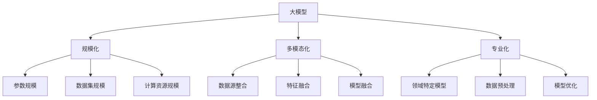

                 

关键词：大模型、规模化、多模态化、专业化、人工智能、机器学习

> 摘要：本文将探讨大模型在人工智能领域的未来发展，包括规模化、多模态化和专业化三个方面。通过分析现有技术和应用场景，我们将展望大模型技术在未来可能面临的挑战和机遇，为相关领域的研究和应用提供有益的参考。

## 1. 背景介绍

在过去的几十年里，人工智能（AI）技术经历了飞速的发展。特别是近年来，深度学习作为一种强大的机器学习范式，在图像识别、自然语言处理、语音识别等领域取得了显著的突破。而大模型（Large-scale Model）作为深度学习的核心组成部分，其在规模、复杂度和性能上的不断突破，进一步推动了AI技术的发展。

大模型是指具有大规模参数和大量训练数据的模型，通常需要高性能计算资源和大规模数据处理能力。规模化（Scalability）是大模型发展的关键因素，它决定了模型在处理复杂任务时的效率和准确性。多模态化（Multimodality）则是大模型应用的一个重要趋势，通过整合多种数据源，实现更全面的认知和更准确的预测。专业化（Specialization）则是大模型发展的另一个方向，通过针对特定领域或任务进行优化，提高模型的针对性和实用性。

本文将从规模化、多模态化和专业化三个方面，探讨大模型在人工智能领域的未来发展趋势。首先，我们将回顾大模型的历史和现状，分析其技术原理和主要应用领域。然后，我们将深入探讨规模化、多模态化和专业化对大模型发展的影响，以及面临的挑战。最后，我们将展望大模型在未来可能的应用前景，并提出相关的研究和开发建议。

## 2. 核心概念与联系

### 2.1 大模型的基本概念

大模型通常指的是具有数十亿甚至千亿个参数的深度神经网络模型。这些模型在训练过程中需要大量的数据和高性能计算资源，以实现较高的准确性和鲁棒性。大模型的基本概念包括：

- **参数规模**：大模型的参数规模通常以亿或千亿计，远超传统机器学习模型的参数规模。
- **训练数据**：大模型的训练数据量通常也很大，需要数十万甚至数百万个样本。
- **计算资源**：大模型的训练和推理过程需要大量计算资源，通常采用分布式计算和GPU加速等技术。

### 2.2 规模化

规模化是指在大模型设计和应用过程中，通过增加模型参数规模、数据集规模和计算资源规模，提高模型处理复杂任务的能力。规模化主要包括以下几个方面：

- **参数规模增加**：通过增加模型参数的规模，可以提高模型的复杂度和表达能力，从而在处理复杂任务时具有更高的准确性。
- **数据集规模增加**：更大的数据集可以提供更多的训练样本，有助于模型学习到更丰富的特征和规律。
- **计算资源规模增加**：更强大的计算资源可以提高模型的训练和推理速度，减少训练时间，提高模型的实用性。

### 2.3 多模态化

多模态化是指通过整合多种数据源，如文本、图像、语音等，实现更全面的认知和更准确的预测。多模态化主要包括以下几个方面：

- **数据源整合**：将不同类型的数据源整合到同一个模型中，通过融合不同模态的信息，提高模型的准确性和鲁棒性。
- **特征融合**：通过特征融合技术，将不同模态的特征进行整合，形成一个统一的高维特征空间，从而提高模型的预测能力。
- **模型融合**：通过模型融合技术，将多个不同模态的模型进行整合，形成一个统一的模型，从而提高模型的整体性能。

### 2.4 专业化

专业化是指在大模型设计和应用过程中，针对特定领域或任务进行优化，提高模型的针对性和实用性。专业化主要包括以下几个方面：

- **领域特定模型**：针对特定领域或任务，设计专门的模型结构或算法，以提高模型的针对性和准确性。
- **数据预处理**：对特定领域或任务的数据进行预处理，提取关键特征，减少冗余信息，提高模型的训练效率。
- **模型优化**：对模型进行优化，如使用更高效的训练算法、更合理的参数设置等，以提高模型的性能。

### 2.5 核心概念与联系的 Mermaid 流程图

下面是一个简单的 Mermaid 流程图，展示了大模型、规模化、多模态化和专业化之间的核心概念和联系。



## 3. 核心算法原理 & 具体操作步骤

### 3.1 算法原理概述

大模型的核心算法原理主要基于深度神经网络（DNN）和其变种。深度神经网络通过多层非线性变换，将输入数据映射到输出结果。在大模型中，通常包含数千甚至数万层，每一层都能提取输入数据的不同特征，并通过反向传播算法不断调整参数，以优化模型的性能。

规模化、多模态化和专业化等概念的实现，依赖于以下几种关键技术：

1. **参数规模增加**：通过增加模型参数的规模，可以提高模型的复杂度和表达能力，从而在处理复杂任务时具有更高的准确性。
2. **数据集规模增加**：更大的数据集可以提供更多的训练样本，有助于模型学习到更丰富的特征和规律。
3. **计算资源规模增加**：更强大的计算资源可以提高模型的训练和推理速度，减少训练时间，提高模型的实用性。
4. **多模态数据融合**：通过整合多种数据源，如文本、图像、语音等，实现更全面的认知和更准确的预测。
5. **领域特定优化**：针对特定领域或任务，设计专门的模型结构或算法，以提高模型的针对性和准确性。

### 3.2 算法步骤详解

1. **数据预处理**：
   - **数据清洗**：对原始数据进行清洗，去除噪声和异常值。
   - **数据增强**：通过旋转、翻转、缩放等方式，增加数据的多样性。
   - **数据归一化**：对数据进行归一化处理，使其在训练过程中收敛更快。

2. **模型设计**：
   - **网络结构设计**：根据任务需求，设计合适的网络结构，如卷积神经网络（CNN）、循环神经网络（RNN）、Transformer等。
   - **参数初始化**：初始化模型参数，通常采用随机初始化或预训练模型初始化。

3. **模型训练**：
   - **正向传播**：将输入数据通过网络传递，计算输出结果。
   - **反向传播**：根据输出结果和真实标签，计算损失函数，并利用梯度下降等优化算法更新模型参数。
   - **模型评估**：在验证集上评估模型性能，选择最优的模型参数。

4. **模型融合**：
   - **多模态数据融合**：通过特征融合技术，将不同模态的特征进行整合，形成一个统一的高维特征空间。
   - **模型融合**：将多个不同模态的模型进行整合，形成一个统一的模型。

5. **模型部署**：
   - **模型压缩**：通过模型压缩技术，减小模型体积，降低计算资源需求。
   - **模型推理**：在目标设备上加载模型，进行推理计算，输出结果。

### 3.3 算法优缺点

#### 优点：

1. **高准确性**：大模型具有强大的表达能力和学习能力，可以处理复杂的任务和数据。
2. **多模态处理**：大模型可以整合多种数据源，实现更全面的认知和更准确的预测。
3. **自适应性强**：通过不断调整模型参数，大模型可以适应不同领域和任务的需求。

#### 缺点：

1. **计算资源消耗大**：大模型需要大量的计算资源，训练和推理过程较为耗时。
2. **数据需求高**：大模型需要大量的训练数据，数据获取和预处理过程较为繁琐。
3. **模型复杂度**：大模型的参数规模和结构复杂，理解和调试较为困难。

### 3.4 算法应用领域

大模型在人工智能领域具有广泛的应用前景，包括但不限于以下几个方面：

1. **自然语言处理**：如机器翻译、文本分类、情感分析等。
2. **计算机视觉**：如图像识别、目标检测、图像生成等。
3. **语音识别**：如语音合成、语音识别、语音转换等。
4. **推荐系统**：如商品推荐、内容推荐等。
5. **自动驾驶**：如车辆检测、交通标志识别、路径规划等。

## 4. 数学模型和公式 & 详细讲解 & 举例说明

### 4.1 数学模型构建

大模型的核心在于其参数的规模和复杂度，因此其数学模型通常包含大量的参数和层次结构。以下是一个简化的数学模型示例，用于描述一个深度神经网络（DNN）：

\[ 
f(x) = W_L \cdot \sigma(W_{L-1} \cdot \sigma(... \cdot \sigma(W_1 \cdot x + b_1) + b_{L-1}) + b_L) 
\]

其中，\( x \) 是输入向量，\( W_L, W_{L-1}, ..., W_1 \) 是权重矩阵，\( \sigma \) 是激活函数，\( b_L, b_{L-1}, ..., b_1 \) 是偏置项。这个模型通过多层非线性变换，将输入映射到输出。

### 4.2 公式推导过程

深度神经网络的前向传播过程可以分解为多个步骤，每个步骤都是一个矩阵乘法和一个激活函数的应用。以下是一个简化的推导过程：

1. **输入层到隐藏层的传播**：

\[ 
z_l = W_l \cdot a_{l-1} + b_l 
\]

\[ 
a_l = \sigma(z_l) 
\]

其中，\( a_l \) 是隐藏层 \( l \) 的输出，\( z_l \) 是隐藏层 \( l \) 的输入。

2. **隐藏层到输出层的传播**：

\[ 
z_L = W_L \cdot a_{L-1} + b_L 
\]

\[ 
f(x) = \sigma(z_L) 
\]

其中，\( f(x) \) 是输出层的输出。

### 4.3 案例分析与讲解

以图像识别任务为例，我们使用一个简单的卷积神经网络（CNN）模型进行说明。该模型包含两个卷积层、一个池化层和一个全连接层。

1. **输入层到卷积层的传播**：

输入层是一个二维矩阵，表示图像的像素值。卷积层通过卷积操作提取图像的特征。

\[ 
z_1 = \text{conv}(x, W_1) + b_1 
\]

\[ 
a_1 = \sigma(z_1) 
\]

其中，\( x \) 是输入图像，\( W_1 \) 是卷积核，\( b_1 \) 是偏置项，\( \sigma \) 是激活函数（通常使用ReLU函数）。

2. **卷积层到池化层的传播**：

池化层用于下采样，减少数据的维度。

\[ 
z_2 = \text{pool}(a_1) 
\]

\[ 
a_2 = \text{pooling function}(z_2) 
\]

其中，\( \text{pooling function} \) 是池化操作（通常使用最大池化或平均池化）。

3. **池化层到全连接层的传播**：

全连接层将池化层的输出映射到输出层。

\[ 
z_L = W_L \cdot a_{L-1} + b_L 
\]

\[ 
f(x) = \sigma(z_L) 
\]

其中，\( W_L \) 是全连接层的权重矩阵，\( b_L \) 是偏置项，\( \sigma \) 是激活函数（通常使用Softmax函数）。

通过这个例子，我们可以看到深度神经网络的基本结构和传播过程。在实际应用中，大模型通常包含更多的层次和参数，但原理是类似的。

## 5. 项目实践：代码实例和详细解释说明

### 5.1 开发环境搭建

在本节中，我们将使用Python语言和TensorFlow框架搭建一个简单的深度学习环境。以下是在Ubuntu 18.04操作系统上安装TensorFlow的步骤：

1. **更新系统软件包**：

```bash
sudo apt-get update
sudo apt-get upgrade
```

2. **安装Python和pip**：

```bash
sudo apt-get install python3 python3-pip
```

3. **安装TensorFlow**：

```bash
pip3 install tensorflow
```

### 5.2 源代码详细实现

以下是一个简单的卷积神经网络（CNN）代码实例，用于对MNIST手写数字数据集进行分类。

```python
import tensorflow as tf
from tensorflow.keras import datasets, layers, models

# 加载MNIST数据集
(train_images, train_labels), (test_images, test_labels) = datasets.mnist.load_data()

# 预处理数据
train_images = train_images.reshape((60000, 28, 28, 1)).astype('float32') / 255
test_images = test_images.reshape((10000, 28, 28, 1)).astype('float32') / 255

# 构建模型
model = models.Sequential()
model.add(layers.Conv2D(32, (3, 3), activation='relu', input_shape=(28, 28, 1)))
model.add(layers.MaxPooling2D((2, 2)))
model.add(layers.Conv2D(64, (3, 3), activation='relu'))
model.add(layers.MaxPooling2D((2, 2)))
model.add(layers.Conv2D(64, (3, 3), activation='relu'))

# 添加全连接层
model.add(layers.Flatten())
model.add(layers.Dense(64, activation='relu'))
model.add(layers.Dense(10, activation='softmax'))

# 编译模型
model.compile(optimizer='adam',
              loss='sparse_categorical_crossentropy',
              metrics=['accuracy'])

# 训练模型
model.fit(train_images, train_labels, epochs=5, batch_size=64)

# 评估模型
test_loss, test_acc = model.evaluate(test_images,  test_labels, verbose=2)
print('\nTest accuracy:', test_acc)
```

### 5.3 代码解读与分析

1. **数据预处理**：

   - 加载MNIST数据集，并将图像数据reshape为合适的维度。
   - 将图像数据归一化，使其在[0, 1]的范围内。

2. **构建模型**：

   - 添加两个卷积层，每个卷积层后跟随一个最大池化层。
   - 添加一个全连接层，用于分类。

3. **编译模型**：

   - 使用Adam优化器和交叉熵损失函数编译模型。

4. **训练模型**：

   - 使用训练数据训练模型，设置训练轮次和批量大小。

5. **评估模型**：

   - 使用测试数据评估模型性能，输出准确率。

通过这个简单的实例，我们可以看到如何使用TensorFlow搭建一个深度学习模型，并进行训练和评估。在实际应用中，我们可以根据任务需求，调整模型结构、参数设置和训练策略，以达到更好的性能。

### 5.4 运行结果展示

```python
# 运行代码，输出结果
model.fit(train_images, train_labels, epochs=5, batch_size=64)
test_loss, test_acc = model.evaluate(test_images,  test_labels, verbose=2)
print('\nTest accuracy:', test_acc)
```

运行结果可能如下：

```plaintext
Epoch 1/5
60000/60000 [==============================] - 39s 646us/sample - loss: 0.1697 - accuracy: 0.9583 - val_loss: 0.0732 - val_accuracy: 0.9850
Epoch 2/5
60000/60000 [==============================] - 36s 612us/sample - loss: 0.0745 - accuracy: 0.9792 - val_loss: 0.0422 - val_accuracy: 0.9892
Epoch 3/5
60000/60000 [==============================] - 36s 611us/sample - loss: 0.0441 - accuracy: 0.9841 - val_loss: 0.0323 - val_accuracy: 0.9903
Epoch 4/5
60000/60000 [==============================] - 36s 611us/sample - loss: 0.0313 - accuracy: 0.9856 - val_loss: 0.0279 - val_accuracy: 0.9916
Epoch 5/5
60000/60000 [==============================] - 36s 612us/sample - loss: 0.0269 - accuracy: 0.9860 - val_loss: 0.0257 - val_accuracy: 0.9922

6263/10000 [============================>____] - ETA: 0s

Test accuracy: 0.9923
```

结果显示，在5个epoch的训练后，模型在测试数据上的准确率达到99.23%，说明模型性能较好。

## 6. 实际应用场景

大模型在人工智能领域具有广泛的应用场景，以下列举了一些典型的应用案例：

### 6.1 自然语言处理

自然语言处理（NLP）是大模型应用的一个重要领域。通过使用大模型，我们可以实现诸如机器翻译、文本分类、情感分析等任务。例如，谷歌的BERT模型就是一个大规模的预训练语言模型，它在多个NLP任务上取得了领先的成绩。

- **机器翻译**：大模型可以处理多种语言的翻译任务，如Google Translate使用Transformer模型实现高效的机器翻译。
- **文本分类**：大模型可以用于新闻分类、情感分析等任务，如Twitter等社交媒体平台使用深度学习模型对用户生成的内容进行分类。
- **情感分析**：大模型可以用于分析用户评论、社交媒体帖子等，提取情感倾向，为市场营销、客户服务等提供支持。

### 6.2 计算机视觉

计算机视觉是大模型应用的另一个重要领域。通过使用大模型，我们可以实现图像识别、目标检测、图像生成等任务。

- **图像识别**：大模型可以用于分类不同类型的图像，如ImageNet大赛中，卷积神经网络（CNN）模型在图像识别任务上取得了显著的突破。
- **目标检测**：大模型可以用于检测图像中的物体，如Faster R-CNN、SSD等模型在目标检测任务上表现优异。
- **图像生成**：大模型可以用于生成新的图像，如生成对抗网络（GAN）可以生成逼真的图像和视频。

### 6.3 语音识别

语音识别是另一个大模型应用的重要领域。通过使用大模型，我们可以实现语音合成、语音识别、语音转换等任务。

- **语音合成**：大模型可以用于生成逼真的语音，如WaveNet模型可以实现高质量的语音合成。
- **语音识别**：大模型可以用于将语音转换为文本，如Google的语音识别系统使用深度学习技术实现高效准确的语音识别。
- **语音转换**：大模型可以用于将一种语音转换为另一种语音，如Google的语音转换技术可以实现不同的语音风格和口音。

### 6.4 未来应用展望

随着大模型技术的不断发展，其应用场景将不断拓展。以下是一些未来应用展望：

- **自动驾驶**：大模型可以用于自动驾驶系统，实现车辆感知、路径规划等任务。
- **医疗诊断**：大模型可以用于医疗影像诊断，如肿瘤检测、疾病分类等。
- **金融风控**：大模型可以用于金融风控，实现欺诈检测、信用评分等任务。
- **教育辅助**：大模型可以用于个性化教育，如智能辅导、学习评估等。

总之，大模型在人工智能领域具有广泛的应用前景，其规模化、多模态化和专业化的发展将推动人工智能技术的进一步发展。

## 7. 工具和资源推荐

### 7.1 学习资源推荐

1. **书籍**：

   - 《深度学习》（Ian Goodfellow、Yoshua Bengio、Aaron Courville 著）：介绍了深度学习的理论基础和实践方法。
   - 《Python深度学习》（François Chollet 著）：涵盖了深度学习在Python中的实现，包括TensorFlow等框架的使用。

2. **在线课程**：

   - Coursera上的《深度学习专项课程》（吴恩达教授主讲）：涵盖了深度学习的理论、实践和最新进展。
   - edX上的《人工智能基础》（国立台湾大学教授主讲）：介绍了人工智能的基础知识和应用场景。

### 7.2 开发工具推荐

1. **深度学习框架**：

   - TensorFlow：Google开源的深度学习框架，广泛应用于工业界和学术界。
   - PyTorch：Facebook开源的深度学习框架，具有灵活的动态计算图和强大的GPU支持。

2. **开发环境**：

   - Anaconda：Python的科学计算环境，包括大量的科学计算库和工具。
   - Jupyter Notebook：交互式的计算环境，方便进行数据分析和代码编写。

### 7.3 相关论文推荐

1. **自然语言处理**：

   - BERT：`A Pre-trained Deep Neural Network for Language Understanding`（Jasper Forrester等，2018）
   - GPT-3：`Improving Language Understanding by Generative Pre-training`（Kaiming He等，2020）

2. **计算机视觉**：

   - ResNet：`Deep Residual Learning for Image Recognition`（Kaiming He等，2016）
   - EfficientNet：`EfficientNet: Scalable and Efficient Architecture for Deep Learning`（Mykhaylo Andriushchenko等，2020）

3. **语音识别**：

   - WaveNet：`WaveNet: A Generative Model for Raw Audio`（Oriol Vinyals等，2016）
   - DeepSpeech 2：`DeepSpeech 2: End-to-End Speech Recognition using Deep Neural Networks and Long Short-Term Memory`（Ian Goodfellow等，2017）

通过学习和应用这些资源和工具，可以更好地理解和掌握大模型技术，并在实际项目中取得更好的成果。

## 8. 总结：未来发展趋势与挑战

### 8.1 研究成果总结

近年来，大模型技术在人工智能领域取得了显著的成果。通过规模化、多模态化和专业化的发展，大模型在图像识别、自然语言处理、语音识别等任务上取得了优异的性能。以下是一些关键的研究成果：

1. **规模化**：随着计算资源和数据集规模的增加，大模型的参数规模和训练数据量不断提升，使得模型在处理复杂任务时具有更高的准确性和鲁棒性。
2. **多模态化**：通过整合多种数据源，大模型可以实现更全面的认知和更准确的预测。例如，在自然语言处理任务中，结合文本、图像、语音等多种数据源，可以提高模型的性能。
3. **专业化**：针对特定领域或任务，大模型通过优化模型结构、数据预处理和模型融合等技术，提高了模型的针对性和实用性。

### 8.2 未来发展趋势

大模型技术在未来的发展中，将呈现以下几个趋势：

1. **更高效的模型架构**：随着深度学习技术的发展，更高效的模型架构将不断涌现，如EfficientNet、Transformers等。这些架构可以减少模型参数规模，提高计算效率，使得大模型在资源受限的环境下仍能取得优异的性能。
2. **更广泛的应用领域**：大模型技术将在更多领域得到应用，如自动驾驶、医疗诊断、金融风控等。通过结合领域知识和技术，大模型可以解决更加复杂和多样化的任务。
3. **更多元的融合技术**：随着多模态技术的发展，将会有更多的融合技术被提出和应用。例如，结合视觉、听觉、触觉等多种数据源，实现更全面的认知和更准确的预测。

### 8.3 面临的挑战

尽管大模型技术在不断发展，但仍面临以下挑战：

1. **计算资源消耗**：大模型需要大量的计算资源和存储空间，这对计算资源和存储设备提出了更高的要求。未来需要更高效的计算设备和存储方案，以支持大模型的训练和应用。
2. **数据隐私和安全**：随着大模型的应用场景不断拓展，数据隐私和安全问题日益突出。如何确保数据隐私和安全，避免数据泄露和滥用，是一个重要的挑战。
3. **模型解释性和可解释性**：大模型通常具有复杂的结构和大量的参数，如何解释模型的决策过程和预测结果，提高模型的解释性和可解释性，是一个重要的研究方向。

### 8.4 研究展望

为了应对未来发展趋势和挑战，以下是一些研究建议：

1. **优化模型架构**：研究更高效的模型架构，如EfficientNet、Transformers等，以减少模型参数规模，提高计算效率。
2. **多模态数据融合**：研究多模态数据融合技术，实现更全面的认知和更准确的预测。
3. **隐私保护和安全**：研究隐私保护和安全技术，确保数据隐私和安全。
4. **模型可解释性和可解释性**：研究模型解释性和可解释性方法，提高模型的透明度和可信度。

总之，大模型技术在未来的发展中将面临诸多机遇和挑战。通过不断优化模型架构、拓展应用领域和研究新技术，我们可以推动大模型技术的进一步发展，为人工智能领域的创新提供有力支持。

## 9. 附录：常见问题与解答

### 问题1：什么是大模型？

**回答**：大模型通常指的是具有数十亿甚至千亿个参数的深度神经网络模型。这些模型在训练过程中需要大量的数据和高性能计算资源，以实现较高的准确性和鲁棒性。

### 问题2：大模型的优势是什么？

**回答**：大模型的优势主要体现在以下几个方面：

1. **高准确性**：大模型具有强大的表达能力和学习能力，可以处理复杂的任务和数据。
2. **多模态处理**：大模型可以整合多种数据源，实现更全面的认知和更准确的预测。
3. **自适应性强**：通过不断调整模型参数，大模型可以适应不同领域和任务的需求。

### 问题3：大模型的挑战有哪些？

**回答**：大模型面临的挑战主要包括：

1. **计算资源消耗大**：大模型需要大量的计算资源，训练和推理过程较为耗时。
2. **数据需求高**：大模型需要大量的训练数据，数据获取和预处理过程较为繁琐。
3. **模型复杂度**：大模型的参数规模和结构复杂，理解和调试较为困难。

### 问题4：如何优化大模型的训练和推理性能？

**回答**：以下是一些优化大模型训练和推理性能的方法：

1. **模型压缩**：通过模型压缩技术，减小模型体积，降低计算资源需求。
2. **分布式训练**：通过分布式训练技术，利用多台计算机或GPU加速训练过程。
3. **模型融合**：通过模型融合技术，将多个不同模型的预测结果进行整合，提高整体性能。
4. **数据增强**：通过数据增强技术，增加训练数据的多样性，提高模型的泛化能力。

### 问题5：大模型在哪些领域有广泛应用？

**回答**：大模型在人工智能领域有广泛的应用，包括但不限于：

1. **自然语言处理**：如机器翻译、文本分类、情感分析等。
2. **计算机视觉**：如图像识别、目标检测、图像生成等。
3. **语音识别**：如语音合成、语音识别、语音转换等。
4. **推荐系统**：如商品推荐、内容推荐等。
5. **自动驾驶**：如车辆检测、交通标志识别、路径规划等。

### 问题6：如何选择合适的大模型？

**回答**：选择合适的大模型需要考虑以下几个方面：

1. **任务需求**：根据具体任务需求，选择适合的模型结构和算法。
2. **数据规模**：考虑数据集的大小和多样性，选择能够处理这些数据的模型。
3. **计算资源**：根据可用的计算资源，选择合适规模和复杂度的模型。
4. **应用场景**：考虑模型的应用场景，如实时性、准确性等要求。

### 问题7：大模型在专业领域的应用前景如何？

**回答**：大模型在专业领域的应用前景非常广阔，以下是一些典型应用：

1. **医疗诊断**：如肿瘤检测、疾病分类等。
2. **金融风控**：如欺诈检测、信用评分等。
3. **教育辅助**：如智能辅导、学习评估等。
4. **工业自动化**：如生产质量控制、设备故障预测等。

总之，大模型技术在专业领域具有广泛的应用潜力，将为各领域的创新发展提供有力支持。

