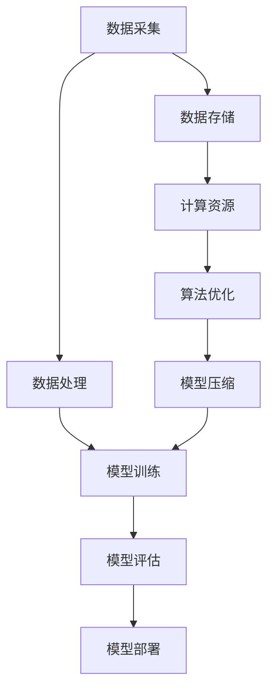

                 

关键词：大模型训练、基础设施、算法、数据处理、技术挑战、人工智能

摘要：本文旨在探讨大模型训练过程中所面临的基础设施、算法和数据处理等方面的技术挑战。通过对这些挑战的深入分析，本文将为业界提供有益的参考，帮助解决实际应用中遇到的问题，推动人工智能技术的持续发展。

## 1. 背景介绍

随着人工智能技术的不断发展，大模型训练逐渐成为研究热点。大模型，通常指的是参数规模超过数十亿甚至千亿级的神经网络模型。这些模型在语音识别、图像识别、自然语言处理等领域表现出色，推动了人工智能应用的广泛普及。然而，大模型训练过程中面临诸多技术挑战，如大规模数据处理、高效算法设计、高效计算基础设施构建等。

本文将从基础设施、算法和数据处理三个方面，详细分析大模型训练的技术挑战，探讨应对策略，为人工智能领域的研究者和开发者提供有价值的参考。

## 2. 核心概念与联系

在深入探讨大模型训练的技术挑战之前，有必要了解一些核心概念和它们之间的联系。以下是一个使用Mermaid绘制的流程图，展示了大模型训练过程中涉及的主要概念和它们的相互关系。



### 2.1 数据采集与存储

数据采集是指从各种来源获取原始数据，如图像、文本、语音等。这些数据经过预处理后存储到数据存储系统中，为后续的模型训练提供数据支持。

### 2.2 数据处理

数据处理包括数据清洗、数据增强、数据归一化等步骤。这些步骤有助于提高数据质量，为模型训练提供更好的输入。

### 2.3 模型训练

模型训练是指利用处理后的数据，通过优化算法调整模型参数，使模型能够对输入数据进行准确预测。训练过程通常涉及大量计算资源，对算法和基础设施提出了高要求。

### 2.4 模型评估

模型评估是指通过测试集对训练完成的模型进行性能评估，以确定模型是否满足预期效果。评估结果可用于指导后续的模型优化和调整。

### 2.5 模型部署

模型部署是指将训练完成的模型部署到实际应用场景中，如智能音箱、自动驾驶车辆等。部署过程中，需要考虑模型的实时性、可靠性和可扩展性。

### 2.6 计算资源

计算资源是指用于大模型训练的硬件设备，如GPU、TPU等。高效计算资源能够显著提高模型训练速度，降低训练成本。

### 2.7 算法优化

算法优化是指通过对训练算法进行调整和改进，提高模型训练效率和性能。算法优化是解决大模型训练技术挑战的关键之一。

### 2.8 模型压缩

模型压缩是指通过压缩模型参数，减小模型体积，提高模型部署的可行性。模型压缩有助于降低部署成本，提高模型运行效率。

## 3. 核心算法原理 & 具体操作步骤

### 3.1 算法原理概述

大模型训练的核心算法主要包括深度学习算法和强化学习算法。深度学习算法通过多层神经网络对数据进行特征提取和分类，而强化学习算法则通过试错和反馈机制，使模型在特定环境中找到最优策略。

### 3.2 算法步骤详解

#### 3.2.1 数据采集

1. 确定数据来源：根据应用场景，选择合适的图像、文本、语音等数据集。
2. 数据预处理：对采集到的数据进行清洗、增强和归一化处理。

#### 3.2.2 数据处理

1. 数据清洗：去除噪声数据、异常数据和重复数据。
2. 数据增强：通过旋转、缩放、裁剪等操作，增加数据多样性。
3. 数据归一化：将数据缩放到同一尺度，便于模型训练。

#### 3.2.3 模型训练

1. 确定神经网络结构：根据任务需求，选择合适的神经网络结构。
2. 初始化模型参数：随机初始化模型参数。
3. 训练过程：通过梯度下降等优化算法，不断调整模型参数，使模型在训练集上性能逐渐提升。

#### 3.2.4 模型评估

1. 准备测试集：从原始数据中划分出一部分数据作为测试集。
2. 模型评估：通过测试集评估模型性能，如准确率、召回率、F1值等。

#### 3.2.5 模型部署

1. 确定部署环境：根据应用场景，选择合适的部署环境。
2. 模型压缩：对模型进行压缩，减小模型体积。
3. 部署模型：将压缩后的模型部署到目标设备上。

### 3.3 算法优缺点

#### 3.3.1 优点

1. 深度学习算法：能够自动提取数据特征，提高模型泛化能力。
2. 强化学习算法：能够通过试错和反馈，找到最优策略。

#### 3.3.2 缺点

1. 深度学习算法：对数据质量和计算资源要求较高，训练过程耗时较长。
2. 强化学习算法：训练过程可能陷入局部最优，需要大量时间和数据。

### 3.4 算法应用领域

大模型训练算法在多个领域取得了显著成果，如：

1. 语音识别：利用深度学习算法实现高效的语音识别。
2. 图像识别：利用卷积神经网络实现图像分类、目标检测等任务。
3. 自然语言处理：利用自然语言处理模型实现文本分类、机器翻译等任务。
4. 游戏智能：利用强化学习算法实现游戏AI，提高游戏体验。

## 4. 数学模型和公式 & 详细讲解 & 举例说明

### 4.1 数学模型构建

大模型训练中的数学模型主要涉及神经网络和强化学习算法。以下是一个简单的神经网络模型，用于图像分类任务。

$$
y_{\hat{i}} = \sigma(\sum_{j=1}^{n} w_{ji}x_j + b)
$$

其中，$y_{\hat{i}}$ 表示输出值，$x_j$ 表示输入特征，$w_{ji}$ 表示权重，$b$ 表示偏置，$\sigma$ 表示激活函数。

### 4.2 公式推导过程

以神经网络中的反向传播算法为例，介绍公式推导过程。

#### 4.2.1 前向传播

假设输入特征为 $x_1, x_2, ..., x_n$，输出值为 $y_1, y_2, ..., y_m$，模型损失函数为 $L(y, y_{\hat{i}})$。

前向传播过程如下：

$$
z_j = \sum_{i=1}^{m} w_{ji}y_i + b_j
$$

$$
y_{\hat{i}} = \sigma(z_j)
$$

#### 4.2.2 反向传播

反向传播过程旨在计算损失函数关于模型参数的梯度，用于更新模型参数。

$$
\delta_j = \frac{\partial L}{\partial z_j}
$$

$$
\frac{\partial z_j}{\partial w_{ji}} = y_i
$$

$$
\frac{\partial z_j}{\partial b_j} = 1
$$

通过链式法则，可以得到：

$$
\frac{\partial L}{\partial w_{ji}} = \delta_j y_i
$$

$$
\frac{\partial L}{\partial b_j} = \delta_j
$$

### 4.3 案例分析与讲解

以下以图像分类任务为例，讲解大模型训练过程中的数学模型和公式。

假设我们要训练一个神经网络模型，对图像进行分类。输入特征为图像的像素值，输出值为图像的类别。

1. 数据预处理：对图像像素值进行归一化处理，将像素值缩放到[0, 1]区间。

2. 确定神经网络结构：选择一个三层神经网络，包括输入层、隐藏层和输出层。

3. 初始化模型参数：随机初始化权重和偏置。

4. 模型训练：利用反向传播算法，不断更新模型参数，使模型在训练集上性能逐渐提升。

5. 模型评估：在测试集上评估模型性能，如准确率、召回率等。

6. 模型部署：将训练完成的模型部署到实际应用场景中，如智能安防系统。

## 5. 项目实践：代码实例和详细解释说明

### 5.1 开发环境搭建

在本项目中，我们使用 Python 作为编程语言，TensorFlow 作为深度学习框架。首先，需要在本地计算机上安装 Python 和 TensorFlow。具体步骤如下：

1. 安装 Python：下载并安装 Python 3.x 版本，配置环境变量。

2. 安装 TensorFlow：在命令行中运行以下命令：

```bash
pip install tensorflow
```

### 5.2 源代码详细实现

以下是一个简单的图像分类项目，实现步骤如下：

1. 数据预处理：

```python
import tensorflow as tf
from tensorflow.keras.preprocessing.image import ImageDataGenerator

# 定义数据增强器
train_datagen = ImageDataGenerator(
    rescale=1./255,
    rotation_range=40,
    width_shift_range=0.2,
    height_shift_range=0.2,
    shear_range=0.2,
    zoom_range=0.2,
    horizontal_flip=True,
    fill_mode='nearest'
)

# 加载数据集
train_data = train_datagen.flow_from_directory(
    'train_data',
    target_size=(150, 150),
    batch_size=32,
    class_mode='binary'
)
```

2. 构建模型：

```python
from tensorflow.keras.models import Sequential
from tensorflow.keras.layers import Conv2D, MaxPooling2D, Flatten, Dense

# 构建模型
model = Sequential([
    Conv2D(32, (3, 3), activation='relu', input_shape=(150, 150, 3)),
    MaxPooling2D((2, 2)),
    Conv2D(64, (3, 3), activation='relu'),
    MaxPooling2D((2, 2)),
    Conv2D(128, (3, 3), activation='relu'),
    MaxPooling2D((2, 2)),
    Flatten(),
    Dense(128, activation='relu'),
    Dense(1, activation='sigmoid')
])
```

3. 模型训练：

```python
# 编译模型
model.compile(optimizer='adam',
              loss='binary_crossentropy',
              metrics=['accuracy'])

# 训练模型
model.fit(train_data, epochs=10)
```

4. 模型评估：

```python
from tensorflow.keras.preprocessing.image import load_img, img_to_array
import numpy as np

# 加载测试图像
test_image = load_img('test_image.jpg', target_size=(150, 150))
test_image = img_to_array(test_image)
test_image = np.expand_dims(test_image, axis=0)
test_image = np.float32(test_image)

# 预测类别
predictions = model.predict(test_image)
predicted_class = np.argmax(predictions, axis=1)

# 输出预测结果
print(f'Predicted class: {predicted_class}')
```

### 5.3 代码解读与分析

在本项目中，我们首先进行了数据预处理，通过数据增强器对图像进行旋转、缩放、裁剪等操作，提高模型对数据的泛化能力。然后，我们构建了一个三层神经网络，包括卷积层、池化层、全连接层等，用于图像分类任务。在模型训练过程中，我们使用反向传播算法，不断调整模型参数，使模型在训练集上性能逐渐提升。最后，我们使用训练完成的模型对测试图像进行预测，输出预测结果。

## 6. 实际应用场景

大模型训练技术已经在多个实际应用场景中取得了显著成果，如：

1. 语音识别：利用深度学习算法实现高效的语音识别，提高语音识别准确率。
2. 图像识别：利用卷积神经网络实现图像分类、目标检测等任务，提高图像识别能力。
3. 自然语言处理：利用自然语言处理模型实现文本分类、机器翻译等任务，提高语言理解能力。
4. 游戏智能：利用强化学习算法实现游戏AI，提高游戏体验。

未来，大模型训练技术将在更多领域发挥重要作用，如医疗健康、金融、智能交通等。

### 6.4 未来应用展望

随着人工智能技术的不断发展，大模型训练技术将在未来面临以下挑战：

1. 数据量持续增长：随着数据量的持续增长，如何高效地处理大规模数据将成为关键挑战。
2. 计算资源需求：大模型训练对计算资源的需求越来越大，如何高效利用计算资源，降低训练成本成为重要问题。
3. 模型压缩：如何在不损失性能的情况下，对模型进行压缩，提高模型部署的可行性。
4. 隐私和安全：如何在保障用户隐私和安全的前提下，进行大规模数据训练。

未来，大模型训练技术将朝着以下方向发展：

1. 模型压缩和优化：通过模型压缩和优化技术，提高模型部署的可行性，降低训练成本。
2. 多样化的应用场景：大模型训练技术将在更多领域发挥重要作用，如医疗健康、金融、智能交通等。
3. 跨领域合作：大模型训练技术与其他领域的结合，将推动人工智能技术的创新和发展。
4. 开放和共享：大模型训练技术将更加开放和共享，促进学术界和工业界之间的交流和合作。

## 7. 工具和资源推荐

### 7.1 学习资源推荐

1. 《深度学习》（Goodfellow, Bengio, Courville著）：深度学习的经典教材，适合初学者和进阶者阅读。
2. 《Python深度学习》（François Chollet著）：介绍如何使用Python和TensorFlow进行深度学习的实践指南。

### 7.2 开发工具推荐

1. TensorFlow：广泛使用的深度学习框架，支持多种深度学习算法和模型。
2. PyTorch：流行的深度学习框架，易于使用和调试。

### 7.3 相关论文推荐

1. "Deep Learning for Speech Recognition"（深度学习在语音识别中的应用）
2. "Convolutional Neural Networks for Visual Recognition"（卷积神经网络在视觉识别中的应用）
3. "Reinforcement Learning: An Introduction"（强化学习导论）

## 8. 总结：未来发展趋势与挑战

### 8.1 研究成果总结

大模型训练技术在过去几年取得了显著成果，已经在语音识别、图像识别、自然语言处理等领域发挥了重要作用。未来，大模型训练技术将继续发展，为人工智能应用提供更强有力的支持。

### 8.2 未来发展趋势

1. 模型压缩和优化：通过模型压缩和优化技术，提高模型部署的可行性，降低训练成本。
2. 多样化的应用场景：大模型训练技术将在更多领域发挥重要作用，如医疗健康、金融、智能交通等。
3. 跨领域合作：大模型训练技术与其他领域的结合，将推动人工智能技术的创新和发展。
4. 开放和共享：大模型训练技术将更加开放和共享，促进学术界和工业界之间的交流和合作。

### 8.3 面临的挑战

1. 数据量持续增长：随着数据量的持续增长，如何高效地处理大规模数据将成为关键挑战。
2. 计算资源需求：大模型训练对计算资源的需求越来越大，如何高效利用计算资源，降低训练成本成为重要问题。
3. 模型压缩：如何在不损失性能的情况下，对模型进行压缩，提高模型部署的可行性。
4. 隐私和安全：如何在保障用户隐私和安全的前提下，进行大规模数据训练。

### 8.4 研究展望

未来，大模型训练技术将朝着以下方向发展：

1. 模型压缩和优化：通过模型压缩和优化技术，提高模型部署的可行性，降低训练成本。
2. 多样化的应用场景：大模型训练技术将在更多领域发挥重要作用，如医疗健康、金融、智能交通等。
3. 跨领域合作：大模型训练技术与其他领域的结合，将推动人工智能技术的创新和发展。
4. 开放和共享：大模型训练技术将更加开放和共享，促进学术界和工业界之间的交流和合作。

## 9. 附录：常见问题与解答

### 9.1 什么是大模型训练？

大模型训练是指使用大规模数据集训练具有数亿甚至千亿参数的神经网络模型。这些模型在语音识别、图像识别、自然语言处理等领域表现出色。

### 9.2 大模型训练需要哪些硬件资源？

大模型训练需要高性能计算硬件，如GPU、TPU等。这些硬件能够提供强大的计算能力，满足大模型训练的需求。

### 9.3 如何处理大规模数据？

处理大规模数据通常涉及数据预处理、数据增强、数据归一化等步骤。这些步骤有助于提高数据质量，为模型训练提供更好的输入。

### 9.4 大模型训练有哪些算法？

大模型训练常用的算法包括深度学习算法和强化学习算法。深度学习算法如卷积神经网络（CNN）、循环神经网络（RNN）等，而强化学习算法如Q学习、SARSA等。

### 9.5 大模型训练中如何优化算法？

大模型训练中，可以通过调整学习率、批量大小、优化器等参数来优化算法。此外，还可以采用分布式训练、数据并行、模型并行等技术，提高训练效率。

---

作者：禅与计算机程序设计艺术 / Zen and the Art of Computer Programming
----------------------------------------------------------------


