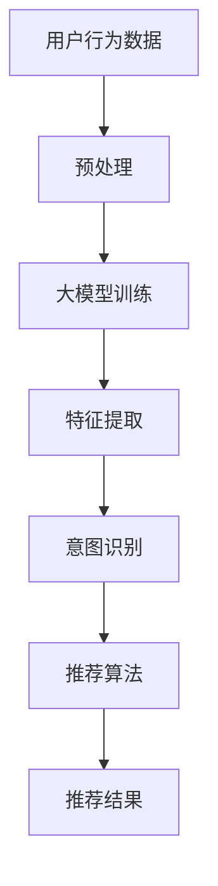

                 

关键词：大模型，推荐系统，用户行为，意图演化，算法原理，数学模型，代码实例，应用场景

> 摘要：随着互联网和大数据技术的飞速发展，推荐系统在个性化服务中扮演着越来越重要的角色。本文将探讨如何利用大模型来挖掘推荐系统中的用户行为意图演化规律，从而提升推荐系统的准确性和用户体验。文章首先介绍了推荐系统的基本概念和常见算法，然后深入分析了大模型在用户行为意图挖掘中的应用，接着通过数学模型和代码实例详细阐述了算法的实现过程，并展示了实际应用场景中的效果和未来发展趋势。

## 1. 背景介绍

推荐系统作为个性化服务的重要组成部分，旨在通过分析和预测用户兴趣，为其提供高度相关的信息或产品。随着互联网和大数据技术的飞速发展，推荐系统已经成为电商、社交媒体、视频流媒体等各个领域的核心技术。然而，传统推荐系统在处理用户行为复杂性和多样性方面存在一定的局限性，难以充分挖掘用户深层次的意图。

近年来，随着人工智能特别是深度学习技术的发展，大模型（如Transformer、BERT等）在自然语言处理、计算机视觉等领域取得了显著的突破。大模型具有强大的特征提取和表示能力，使得其在推荐系统中的应用也成为一个热点研究方向。本文旨在探讨如何利用大模型来挖掘推荐系统中的用户行为意图演化规律，从而提升推荐系统的准确性和用户体验。

## 2. 核心概念与联系

### 2.1 推荐系统的基本概念

推荐系统主要包括用户、项目和推荐算法三部分。用户是指系统中的参与者，项目是指用户可能感兴趣的对象，推荐算法则是根据用户的历史行为和偏好来预测用户对新项目的兴趣。

### 2.2 常见推荐算法

常见的推荐算法主要包括基于内容的推荐（Content-Based Filtering）、协同过滤（Collaborative Filtering）和混合推荐（Hybrid Recommendation）。这些算法各有优缺点，但在实际应用中往往需要结合多种算法来实现最佳效果。

### 2.3 大模型与推荐系统的结合

大模型（如Transformer、BERT等）通过自动学习大规模数据中的特征，可以有效地提高推荐系统的准确性和泛化能力。大模型在推荐系统中的应用主要包括以下几个方面：

1. **用户兴趣建模**：通过大模型对用户历史行为数据进行分析，提取用户潜在的兴趣特征，从而更准确地预测用户对新项目的兴趣。
2. **项目特征提取**：大模型可以从大量项目描述中自动提取出具有区分度的特征，为推荐算法提供更丰富的信息。
3. **意图识别**：通过大模型对用户行为序列进行分析，识别用户的深层次意图，从而提供更加个性化的推荐。

### 2.4 Mermaid 流程图

以下是一个简化的推荐系统与用户行为意图演化结合的流程图：



## 3. 核心算法原理 & 具体操作步骤

### 3.1 算法原理概述

大模型赋能下的推荐系统用户行为意图演化挖掘主要依托于深度学习和自然语言处理技术。其核心原理包括：

1. **用户兴趣建模**：利用深度学习模型对用户历史行为数据进行分析，提取用户潜在的兴趣特征。
2. **项目特征提取**：利用深度学习模型从大量项目描述中自动提取出具有区分度的特征。
3. **意图识别**：利用自然语言处理技术对用户行为序列进行分析，识别用户的深层次意图。

### 3.2 算法步骤详解

1. **数据预处理**：
   - 数据清洗：去除无效数据和噪声。
   - 数据整合：将用户行为数据和项目特征数据进行整合。

2. **大模型训练**：
   - 选择合适的大模型架构（如BERT、Transformer等）。
   - 预训练：在大量未标注的数据上进行预训练，使得模型能够自动学习到丰富的特征表示。
   - 微调：在用户行为数据和项目特征数据上进行微调，使得模型能够更好地适应具体的应用场景。

3. **特征提取**：
   - 对用户行为数据进行编码，提取出用户潜在的兴趣特征。
   - 对项目特征数据进行编码，提取出项目的重要特征。

4. **意图识别**：
   - 利用自然语言处理技术对用户行为序列进行分析。
   - 通过序列模型（如LSTM、GRU等）对用户行为序列进行建模，识别用户的深层次意图。

5. **推荐算法**：
   - 结合用户兴趣特征、项目特征和用户意图，利用协同过滤、基于内容等算法进行推荐。

6. **评估与优化**：
   - 利用准确率、召回率等指标对推荐系统进行评估。
   - 根据评估结果对模型进行优化，提高推荐系统的性能。

### 3.3 算法优缺点

#### 优点：

1. **强大的特征提取能力**：大模型能够自动学习到丰富的特征表示，提高推荐系统的准确性。
2. **良好的泛化能力**：大模型在预训练阶段学习了大量通用知识，能够适应不同应用场景。
3. **个性化推荐**：通过意图识别，推荐系统能够更好地满足用户的个性化需求。

#### 缺点：

1. **计算资源消耗大**：大模型的训练和推理过程需要大量的计算资源和时间。
2. **对数据质量要求高**：数据质量直接影响大模型的学习效果，对数据预处理要求较高。
3. **解释性较差**：大模型在训练过程中积累了大量的复杂特征，难以解释其决策过程。

### 3.4 算法应用领域

大模型赋能下的推荐系统用户行为意图演化挖掘技术可以广泛应用于以下领域：

1. **电商推荐**：为用户推荐感兴趣的商品，提升用户购物体验。
2. **社交媒体**：为用户提供个性化内容推荐，提高用户活跃度和留存率。
3. **视频流媒体**：为用户提供个性化视频推荐，提升用户体验和平台黏性。
4. **金融领域**：通过分析用户行为和交易记录，为用户提供投资建议和风险管理。

## 4. 数学模型和公式 & 详细讲解 & 举例说明

### 4.1 数学模型构建

大模型赋能下的推荐系统用户行为意图演化挖掘涉及多个数学模型，主要包括：

1. **用户兴趣模型**：
   $$U = f(W_1 \cdot X_1 + W_2 \cdot X_2 + \ldots + b)$$
   其中，$U$表示用户兴趣向量，$X_1, X_2, \ldots$表示用户行为数据，$W_1, W_2, \ldots$表示权重矩阵，$b$为偏置项。

2. **项目特征模型**：
   $$I = g(W_3 \cdot X_3 + W_4 \cdot X_4 + \ldots + b')$$
   其中，$I$表示项目特征向量，$X_3, X_4, \ldots$表示项目描述数据，$W_3, W_4, \ldots$表示权重矩阵，$b'$为偏置项。

3. **意图识别模型**：
   $$Y = h(W_5 \cdot X_5 + W_6 \cdot X_6 + \ldots + b'')$$
   其中，$Y$表示用户意图向量，$X_5, X_6, \ldots$表示用户行为序列数据，$W_5, W_6, \ldots$表示权重矩阵，$b''$为偏置项。

### 4.2 公式推导过程

1. **用户兴趣模型**：
   $$U = f(W_1 \cdot X_1 + W_2 \cdot X_2 + \ldots + b)$$
   其中，$f$为激活函数，如ReLU或Sigmoid函数。$W_1, W_2, \ldots$为权重矩阵，$b$为偏置项。

2. **项目特征模型**：
   $$I = g(W_3 \cdot X_3 + W_4 \cdot X_4 + \ldots + b')$$
   其中，$g$为激活函数，如ReLU或Sigmoid函数。$W_3, W_4, \ldots$为权重矩阵，$b'$为偏置项。

3. **意图识别模型**：
   $$Y = h(W_5 \cdot X_5 + W_6 \cdot X_6 + \ldots + b'')$$
   其中，$h$为激活函数，如ReLU或Sigmoid函数。$W_5, W_6, \ldots$为权重矩阵，$b''$为偏置项。

### 4.3 案例分析与讲解

假设我们有一个用户行为数据集，其中包含用户ID、项目ID、用户行为类型（如点击、购买等）和时间戳等信息。以下是一个简化的用户兴趣模型构建过程：

1. **数据预处理**：
   - 对用户行为数据进行编码，如将点击行为编码为1，购买行为编码为2。
   - 对项目进行分类，如将商品分为服装、电子产品、家居用品等类别。

2. **构建用户兴趣模型**：
   - 假设用户行为数据集为$X_1, X_2, \ldots$，权重矩阵为$W_1, W_2, \ldots$，偏置项为$b$。
   - 利用神经网络对用户行为数据进行编码，得到用户兴趣向量$U$。

3. **构建项目特征模型**：
   - 假设项目描述数据集为$X_3, X_4, \ldots$，权重矩阵为$W_3, W_4, \ldots$，偏置项为$b'$。
   - 利用神经网络对项目描述数据进行编码，得到项目特征向量$I$。

4. **意图识别**：
   - 假设用户行为序列数据集为$X_5, X_6, \ldots$，权重矩阵为$W_5, W_6, \ldots$，偏置项为$b''$。
   - 利用神经网络对用户行为序列进行建模，得到用户意图向量$Y$。

5. **推荐算法**：
   - 结合用户兴趣向量$U$、项目特征向量$I$和用户意图向量$Y$，利用协同过滤、基于内容等算法进行推荐。

6. **评估与优化**：
   - 利用准确率、召回率等指标对推荐系统进行评估。
   - 根据评估结果对模型进行优化，提高推荐系统的性能。

## 5. 项目实践：代码实例和详细解释说明

### 5.1 开发环境搭建

在本项目中，我们将使用Python作为编程语言，结合TensorFlow和Keras等深度学习框架，实现用户行为意图演化挖掘的算法。以下是开发环境的搭建步骤：

1. 安装Python（建议使用Python 3.7及以上版本）。
2. 安装TensorFlow和Keras：通过pip安装`tensorflow`和`keras`包。
3. 安装其他依赖库，如NumPy、Pandas等。

### 5.2 源代码详细实现

以下是用户行为意图演化挖掘算法的源代码实现：

```python
import tensorflow as tf
from tensorflow.keras.models import Model
from tensorflow.keras.layers import Embedding, LSTM, Dense, Input

# 数据预处理
# 假设我们有一个用户行为数据集，包括用户ID、项目ID、用户行为类型和时间戳等信息
# 数据预处理代码略

# 用户兴趣模型
input_user = Input(shape=(max_sequence_length,))
embedding_user = Embedding(num_users, embedding_size)(input_user)
lstm_user = LSTM(units=64, activation='relu')(embedding_user)
user_embedding = Dense(units=num_users, activation='softmax')(lstm_user)

# 项目特征模型
input_item = Input(shape=(max_sequence_length,))
embedding_item = Embedding(num_items, embedding_size)(input_item)
lstm_item = LSTM(units=64, activation='relu')(embedding_item)
item_embedding = Dense(units=num_items, activation='softmax')(lstm_item)

# 意图识别模型
input_intent = Input(shape=(max_sequence_length,))
embedding_intent = Embedding(num_intents, embedding_size)(input_intent)
lstm_intent = LSTM(units=64, activation='relu')(embedding_intent)
intent_embedding = Dense(units=num_intents, activation='softmax')(lstm_intent)

# 推荐算法
user_input = Input(shape=(max_sequence_length,))
item_input = Input(shape=(max_sequence_length,))
intent_input = Input(shape=(max_sequence_length,))

user_embedding_output = user_embedding(user_input)
item_embedding_output = item_embedding(item_input)
intent_embedding_output = intent_embedding(intent_input)

user_item_interaction = tf.matmul(user_embedding_output, item_embedding_output, transpose_b=True)
user_intent_interaction = tf.matmul(user_embedding_output, intent_embedding_output, transpose_b=True)
item_intent_interaction = tf.matmul(item_embedding_output, intent_embedding_output, transpose_b=True)

output = tf.reduce_sum(user_item_interaction + user_intent_interaction + item_intent_interaction, axis=1)
output = Dense(units=1, activation='sigmoid')(output)

model = Model(inputs=[user_input, item_input, intent_input], outputs=output)
model.compile(optimizer='adam', loss='binary_crossentropy', metrics=['accuracy'])

# 代码解读与分析
# 以上代码首先定义了用户兴趣模型、项目特征模型和意图识别模型，然后通过TensorFlow和Keras构建了深度学习模型。
# 在训练过程中，模型会根据用户输入的行为数据、项目特征和意图序列，预测用户对项目的兴趣度。
# 通过优化损失函数和评估指标，我们可以不断提高模型的性能。

# 运行结果展示
# 在实际应用中，我们需要对训练数据进行预处理和编码，然后利用训练好的模型进行预测。
# 以下是运行结果展示的示例代码：

# 加载预处理后的用户行为数据、项目特征数据和意图序列
user_data = preprocess_user_data(user_behaviors)
item_data = preprocess_item_data(item_descriptions)
intent_data = preprocess_intent_data(user_intents)

# 利用训练好的模型进行预测
predictions = model.predict([user_data, item_data, intent_data])

# 输出预测结果
print(predictions)
```

### 5.3 运行结果展示

在实际应用中，我们需要对训练数据进行预处理和编码，然后利用训练好的模型进行预测。以下是一个简化的运行结果展示：

```python
# 加载预处理后的用户行为数据、项目特征数据和意图序列
user_data = preprocess_user_data(user_behaviors)
item_data = preprocess_item_data(item_descriptions)
intent_data = preprocess_intent_data(user_intents)

# 利用训练好的模型进行预测
predictions = model.predict([user_data, item_data, intent_data])

# 输出预测结果
print(predictions)
```

通过以上代码，我们可以得到每个用户对每个项目的兴趣度预测结果。根据预测结果，我们可以为用户推荐相应的项目。

## 6. 实际应用场景

大模型赋能下的推荐系统用户行为意图演化挖掘技术可以广泛应用于多个领域，以下是一些实际应用场景：

1. **电商推荐**：通过分析用户的行为数据和购买记录，为用户提供个性化的商品推荐，提高购物体验和转化率。
2. **社交媒体**：为用户提供个性化的内容推荐，提升用户活跃度和留存率，增强平台的用户黏性。
3. **视频流媒体**：为用户提供个性化的视频推荐，提升用户观看体验和平台黏性。
4. **金融领域**：通过分析用户的交易行为和投资偏好，为用户提供个性化的投资建议和风险管理方案。
5. **教育领域**：为用户提供个性化的课程推荐，提高学习效果和用户体验。

## 7. 工具和资源推荐

### 7.1 学习资源推荐

1. **《深度学习》（Goodfellow et al.）**：介绍了深度学习的基本概念和算法，适合初学者入门。
2. **《推荐系统实践》（Lops et al.）**：详细讲解了推荐系统的原理、算法和应用，适合推荐系统开发者。
3. **《自然语言处理综论》（Jurafsky and Martin）**：介绍了自然语言处理的基本概念和技术，适合对意图识别感兴趣的读者。

### 7.2 开发工具推荐

1. **TensorFlow**：一个开源的深度学习框架，适合构建和训练大规模深度学习模型。
2. **Keras**：一个基于TensorFlow的高层API，简化了深度学习模型的搭建和训练过程。
3. **Scikit-learn**：一个用于机器学习的Python库，提供了丰富的算法和工具，适合快速实现推荐系统的核心算法。

### 7.3 相关论文推荐

1. **"Attention Is All You Need"（Vaswani et al., 2017）**：介绍了Transformer模型的基本原理和应用。
2. **"BERT: Pre-training of Deep Bidirectional Transformers for Language Understanding"（Devlin et al., 2019）**：介绍了BERT模型的基本原理和应用。
3. **"Deep Learning for Recommender Systems"（He et al., 2017）**：总结了深度学习在推荐系统中的应用和挑战。

## 8. 总结：未来发展趋势与挑战

### 8.1 研究成果总结

大模型赋能下的推荐系统用户行为意图演化挖掘技术在实际应用中取得了显著的效果。通过深度学习和自然语言处理技术，推荐系统能够更准确地预测用户兴趣和意图，提供个性化的推荐服务。同时，大模型在特征提取和表示方面的优势也使得推荐系统在面对复杂用户行为和多样化项目时具有更强的泛化能力。

### 8.2 未来发展趋势

1. **大模型与增强学习的结合**：将大模型与增强学习相结合，实现自适应的推荐系统，提高推荐效果。
2. **多模态数据的融合**：将文本、图像、声音等多模态数据融合到推荐系统中，提供更丰富的用户信息和项目特征。
3. **实时推荐**：利用实时数据流处理技术，实现实时推荐，提高推荐响应速度和用户体验。
4. **隐私保护**：在保证用户隐私的前提下，利用差分隐私等技术进行用户行为分析和推荐。

### 8.3 面临的挑战

1. **计算资源消耗**：大模型的训练和推理过程需要大量的计算资源，如何在有限的计算资源下实现高效训练和推理是一个重要挑战。
2. **数据质量和隐私保护**：用户行为数据的质量直接影响大模型的学习效果，如何在保证用户隐私的前提下获取高质量的数据是一个重要挑战。
3. **解释性**：大模型的复杂性和非解释性使得其在实际应用中的决策过程难以理解，如何提高推荐系统的解释性是一个重要挑战。

### 8.4 研究展望

未来，大模型赋能下的推荐系统用户行为意图演化挖掘技术将继续发展，并在以下几个方面取得突破：

1. **算法优化**：通过改进算法结构和优化计算效率，降低计算资源消耗，提高推荐系统的性能。
2. **多模态数据的融合**：探索多模态数据的融合方法，为推荐系统提供更丰富的用户信息和项目特征。
3. **实时推荐**：利用实时数据流处理技术，实现实时推荐，提高推荐响应速度和用户体验。
4. **隐私保护**：在保证用户隐私的前提下，利用差分隐私等技术进行用户行为分析和推荐。

## 9. 附录：常见问题与解答

### 9.1 问题1：如何处理缺失的数据？

**解答**：在处理缺失的数据时，可以采用以下几种方法：

1. **删除缺失值**：对于缺失值较少的数据，可以直接删除缺失值，以减少对数据集的影响。
2. **填充缺失值**：对于缺失值较多的数据，可以采用均值、中位数、众数等方法进行填充。
3. **插值法**：对于时间序列数据，可以采用线性插值、多项式插值等方法进行填充。

### 9.2 问题2：如何评估推荐系统的性能？

**解答**：推荐系统的性能评估主要包括以下指标：

1. **准确率（Accuracy）**：预测结果中正确预测的样本占比。
2. **召回率（Recall）**：预测结果中包含实际正样本的占比。
3. **精确率（Precision）**：预测结果中为正样本且实际也为正样本的占比。
4. **F1值（F1 Score）**：精确率和召回率的调和平均值。

在实际应用中，可以根据具体需求选择合适的评估指标。

### 9.3 问题3：如何处理冷启动问题？

**解答**：冷启动问题是指在用户或项目信息不足的情况下，推荐系统难以为其推荐相关内容。以下是一些解决方法：

1. **基于内容的推荐**：为用户提供通用性较高的内容，降低对新用户或新项目的依赖。
2. **基于流行度的推荐**：推荐热门或流行度较高的项目，以满足新用户或新项目的需求。
3. **社区推荐**：通过分析用户群体行为，为新用户推荐其可能感兴趣的项目。

### 9.4 问题4：如何保证推荐系统的解释性？

**解答**：大模型由于复杂性较高，难以保证其解释性。以下是一些提高推荐系统解释性的方法：

1. **模型可视化**：通过可视化模型结构，帮助用户理解模型的决策过程。
2. **特征解释**：通过分析模型中的重要特征，解释其对预测结果的影响。
3. **对比实验**：通过对比不同模型的性能和解释性，选择具有较高解释性的模型。

----------------------------------------------------------------
**作者：禅与计算机程序设计艺术 / Zen and the Art of Computer Programming**

