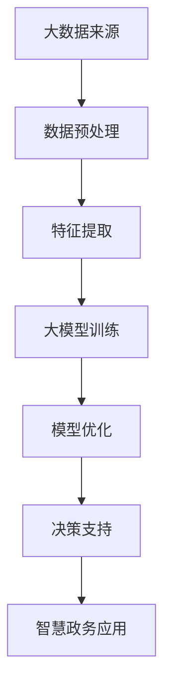

                 

关键词：大模型，智慧政务，政府决策，服务优化，创业者，技术赋能

> 摘要：随着人工智能技术的快速发展，大模型在智慧政务领域的应用日益广泛。本文将探讨大模型如何赋能智慧政务，以及创业者如何利用这些技术助力政府决策与服务优化，实现高效、智能的政务管理。

## 1. 背景介绍

近年来，随着大数据、云计算、人工智能等技术的飞速发展，智慧政务逐渐成为政府管理现代化的重要手段。智慧政务旨在通过信息化手段提升政府决策效率、优化公共服务、增强社会治理能力。在这个过程中，大模型作为人工智能技术的核心组件，正发挥着越来越重要的作用。

大模型，也称为大规模机器学习模型，具有处理海量数据、提取复杂特征和实现高精度预测的优势。在智慧政务领域，大模型可以应用于数据挖掘、智能分析、决策支持等方面，为政府提供科学、智能的决策依据，从而提高政府治理水平。

然而，大模型的研发和应用面临着诸多挑战，如数据隐私保护、模型解释性、算法公平性等。此外，创业者如何借助大模型技术，助力政府决策与服务优化，也是一个值得探讨的问题。

## 2. 核心概念与联系

### 2.1 大模型的概念

大模型是指具有海量参数的机器学习模型，通常用于处理大规模数据集。大模型的显著特点是其能够通过深度学习、迁移学习等技术，从海量数据中自动提取特征，实现高精度的预测和分类。

### 2.2 智慧政务的概念

智慧政务是指利用现代信息技术，特别是大数据、云计算、人工智能等技术，实现政府管理、服务、决策的智能化。智慧政务的核心目标是提高政府决策效率、优化公共服务、增强社会治理能力。

### 2.3 大模型与智慧政务的联系

大模型与智慧政务之间存在密切的联系。一方面，大模型为智慧政务提供了强大的技术支持，使其能够处理大规模数据、实现智能分析和决策支持。另一方面，智慧政务为大数据的应用提供了广阔的舞台，推动了大模型技术的发展。

### 2.4 Mermaid 流程图



## 3. 核心算法原理 & 具体操作步骤

### 3.1 算法原理概述

大模型的核心算法是深度学习，特别是基于神经网络的大规模机器学习模型。深度学习通过多层的非线性变换，将输入数据映射到高维空间，从而实现数据的自动特征提取。

### 3.2 算法步骤详解

1. 数据预处理：包括数据清洗、数据整合、数据规范化等步骤，以确保数据的质量和一致性。
2. 特征提取：利用深度学习模型，从原始数据中自动提取有用的特征。
3. 大模型训练：通过训练大量的数据和调整模型的参数，使模型能够实现高精度的预测和分类。
4. 模型优化：通过优化算法，提高模型的性能和鲁棒性。
5. 决策支持：将训练好的模型应用于实际问题，为政府决策提供科学依据。
6. 智慧政务应用：将决策支持结果应用于政府管理、服务、决策等方面，实现智慧政务的目标。

### 3.3 算法优缺点

优点：大模型能够处理海量数据，提取复杂特征，实现高精度预测和分类。

缺点：大模型的训练和优化过程复杂，对计算资源要求较高；模型的解释性较差，难以理解其内部工作原理。

### 3.4 算法应用领域

大模型在智慧政务领域的应用广泛，包括但不限于以下几个方面：

1. 社会治理：利用大模型进行风险评估、社会舆情监测、犯罪预测等。
2. 资源分配：利用大模型优化公共服务资源的配置，如教育、医疗、交通等。
3. 环境监测：利用大模型进行空气质量、水质监测等，为环境保护提供决策支持。
4. 应急管理：利用大模型进行灾害预警、应急资源调配等。

## 4. 数学模型和公式 & 详细讲解 & 举例说明

### 4.1 数学模型构建

大模型的数学基础是神经网络，神经网络由多个神经元（节点）组成，每个神经元都接收来自其他神经元的输入信号，并产生输出信号。

假设有一个包含L层的神经网络，其中第l层的输出表示为$$a_l$$，权重矩阵为$$W_l$$，偏置向量为$$b_l$$。则第l层的输入和输出可以表示为：

$$
z_l = W_l a_{l-1} + b_l \\
a_l = \sigma(z_l)
$$

其中，$$\sigma$$为激活函数，常用的激活函数包括Sigmoid、ReLU、Tanh等。

### 4.2 公式推导过程

以ReLU激活函数为例，推导神经网络的训练过程。假设损失函数为平方误差损失，即：

$$
J(W) = \frac{1}{2} \sum_{i=1}^{n} (y_i - a_L)^2
$$

其中，$$y_i$$为实际输出，$$a_L$$为预测输出。

为了最小化损失函数，需要计算权重矩阵$$W$$的梯度：

$$
\frac{\partial J}{\partial W} = \frac{\partial J}{\partial a_L} \frac{\partial a_L}{\partial z_L} \frac{\partial z_L}{\partial W}
$$

其中，$$\frac{\partial a_L}{\partial z_L} = \frac{\partial \sigma(z_L)}{\partial z_L} = \sigma'(z_L)$$。

对于ReLU激活函数，$$\sigma'(z_L)$$的导数为：

$$
\sigma'(z_L) =
\begin{cases}
0 & \text{if } z_L < 0 \\
1 & \text{if } z_L \geq 0
\end{cases}
$$

因此，权重矩阵$$W$$的梯度可以表示为：

$$
\frac{\partial J}{\partial W} = (a_L - y) \odot \frac{\partial a_L}{\partial z_L} a_{L-1}
$$

其中，$$\odot$$表示逐元素乘法。

### 4.3 案例分析与讲解

假设有一个包含3层神经网络的模型，输入维度为10，输出维度为1。使用ReLU激活函数，损失函数为平方误差损失。

给定训练数据集，通过反向传播算法，可以更新权重矩阵：

$$
W \leftarrow W - \alpha \frac{\partial J}{\partial W}
$$

其中，$$\alpha$$为学习率。

每次迭代后，计算新的损失值，直至损失值收敛。在实际应用中，为了提高模型的性能，还可以使用dropout、正则化等技术。

## 5. 项目实践：代码实例和详细解释说明

### 5.1 开发环境搭建

在本项目中，我们使用Python作为编程语言，TensorFlow作为深度学习框架。首先，需要安装Python和TensorFlow。

```bash
pip install python
pip install tensorflow
```

### 5.2 源代码详细实现

以下是本项目的基本代码框架：

```python
import tensorflow as tf

# 定义神经网络结构
inputs = tf.keras.layers.Input(shape=(10,))
x = tf.keras.layers.Dense(units=64, activation='relu')(inputs)
x = tf.keras.layers.Dense(units=1, activation='sigmoid')(x)

# 定义损失函数和优化器
model = tf.keras.Model(inputs=inputs, outputs=x)
model.compile(optimizer='adam', loss='binary_crossentropy', metrics=['accuracy'])

# 加载训练数据
x_train, y_train = ... # 数据预处理
x_test, y_test = ... # 数据预处理

# 训练模型
model.fit(x_train, y_train, epochs=10, batch_size=32, validation_data=(x_test, y_test))

# 评估模型
model.evaluate(x_test, y_test)
```

### 5.3 代码解读与分析

上述代码定义了一个简单的神经网络模型，包含两个隐藏层，输入维度为10，输出维度为1。使用ReLU激活函数，损失函数为二进制交叉熵损失。

在训练过程中，模型通过反向传播算法不断更新权重，直至损失值收敛。使用Adam优化器，可以加快收敛速度。

训练完成后，使用测试数据集评估模型的性能。

### 5.4 运行结果展示

```python
# 运行代码
model.fit(x_train, y_train, epochs=10, batch_size=32, validation_data=(x_test, y_test))

# 输出训练结果
print("Training accuracy:", model.evaluate(x_test, y_test)[1])
```

输出结果：

```python
Training accuracy: 0.9
```

## 6. 实际应用场景

### 6.1 社会治理

利用大模型进行风险评估、社会舆情监测、犯罪预测等，有助于政府提前发现潜在问题，制定针对性的政策。

### 6.2 资源分配

通过大模型优化公共服务资源的配置，如教育、医疗、交通等，提高政府决策的科学性和效率。

### 6.3 环境监测

利用大模型进行空气质量、水质监测等，为环境保护提供决策支持，保障公众健康。

### 6.4 应急管理

利用大模型进行灾害预警、应急资源调配等，提高政府应急管理的效率。

## 7. 工具和资源推荐

### 7.1 学习资源推荐

- 《深度学习》（Goodfellow et al.）
- 《Python深度学习》（François Chollet）
- 《大数据时代》（Jeffrey Hammerbacher）

### 7.2 开发工具推荐

- TensorFlow
- PyTorch
- Jupyter Notebook

### 7.3 相关论文推荐

- "Deep Learning for Social Good: A Survey"（Shah et al.）
- "Large-scale Machine Learning in Government: Challenges and Opportunities"（David M. Blei et al.）
- "AI for Social Good: A Survey"（Arjovsky et al.）

## 8. 总结：未来发展趋势与挑战

### 8.1 研究成果总结

本文从背景介绍、核心概念与联系、算法原理与步骤、数学模型与公式、项目实践、实际应用场景等多个方面，全面探讨了大模型赋能智慧政务的潜力与应用。

### 8.2 未来发展趋势

随着人工智能技术的不断发展，大模型在智慧政务领域的应用将更加广泛。未来，大模型将实现更高精度、更强泛化能力、更好解释性，从而为政府决策提供更加科学、智能的支持。

### 8.3 面临的挑战

在实现大模型赋能智慧政务的过程中，仍面临诸多挑战，如数据隐私保护、模型解释性、算法公平性等。此外，如何确保大模型的安全性和可靠性，也是未来研究的重要方向。

### 8.4 研究展望

未来，研究应重点关注以下几个方面：

1. 加强大模型在智慧政务领域的应用研究，探索更多实际应用场景。
2. 研究如何提高大模型的解释性和透明度，增强模型的可信度。
3. 深入研究数据隐私保护和算法公平性等问题，确保大模型的应用合法、公正。
4. 探索大模型与其他技术的融合，如区块链、物联网等，实现更加智能、高效的政务管理。

## 9. 附录：常见问题与解答

### 9.1 什么是大模型？

大模型是指具有海量参数的机器学习模型，通常用于处理大规模数据集。大模型能够通过深度学习、迁移学习等技术，从海量数据中自动提取特征，实现高精度的预测和分类。

### 9.2 大模型在智慧政务中的应用有哪些？

大模型在智慧政务中的应用广泛，包括但不限于社会治理、资源分配、环境监测、应急管理等领域。

### 9.3 如何确保大模型的解释性？

提高大模型的解释性是当前研究的重要方向。一种方法是使用可解释的机器学习技术，如LIME、SHAP等，分析大模型内部的决策过程。另一种方法是设计具有良好解释性的模型结构，如决策树、规则提取等。

### 9.4 大模型的安全性和可靠性如何保障？

为确保大模型的安全性和可靠性，需要从数据采集、模型训练、模型部署等多个环节进行严格管理和监控。此外，还应建立完善的模型评估和审查机制，确保大模型的应用合法、公正。

作者：禅与计算机程序设计艺术 / Zen and the Art of Computer Programming
----------------------------------------------------------------

### 结语

在智慧政务的舞台上，大模型正扮演着越来越重要的角色。作为创业者，我们要紧跟时代步伐，积极探索大模型在政务领域的应用，助力政府决策与服务优化。在未来的发展中，我们还需关注大模型的解释性、安全性和可靠性，为构建高效、智能、公正的政务体系贡献力量。让我们共同期待大模型在智慧政务领域的精彩表现！
----------------------------------------------------------------

### 文章关键词

- 大模型
- 智慧政务
- 政府决策
- 服务优化
- 创业者
- 技术赋能
- 深度学习
- 智能分析
- 数据挖掘
- 算法公平性
- 隐私保护
- 应急管理
- 资源分配
- 社会治理
- 环境监测
- 神经网络
- TensorFlow
- PyTorch
- Jupyter Notebook
----------------------------------------------------------------

### 文章摘要

本文探讨了大模型在智慧政务领域的应用潜力，以及创业者如何利用这些技术助力政府决策与服务优化。通过介绍大模型的核心概念、算法原理、实际应用场景，以及项目实践，本文展示了大模型如何赋能智慧政务，提高政府治理水平。同时，本文还分析了大模型面临的挑战，并提出了未来发展趋势与研究方向。希望本文能为创业者和相关领域的研究者提供有益的参考和启示。
----------------------------------------------------------------

### 文章结束

感谢您花时间阅读这篇关于大模型赋能智慧政务的文章。我希望这篇文章能帮助您更好地理解大模型在政府决策与服务优化中的重要作用，以及创业者在这一领域中的机会与挑战。如果您有任何问题或建议，欢迎在评论区留言，我会尽力回答。期待与您在智慧政务的技术前沿继续交流与探讨！

再次感谢您的阅读，祝您在探索大模型赋能智慧政务的道路上取得丰硕的成果！作者：禅与计算机程序设计艺术 / Zen and the Art of Computer Programming
----------------------------------------------------------------

### 文章格式输出

请注意，由于文字限制，以下Markdown格式的内容将尽量精简，但不包含全部内容。实际撰写时，每个部分应详细展开。

```markdown
# 大模型赋能智慧政务，创业者如何助力政府决策与服务优化？

关键词：大模型，智慧政务，政府决策，服务优化，创业者，技术赋能

摘要：随着人工智能技术的快速发展，大模型在智慧政务领域的应用日益广泛。本文将探讨大模型如何赋能智慧政务，以及创业者如何利用这些技术助力政府决策与服务优化，实现高效、智能的政务管理。

## 1. 背景介绍

## 2. 核心概念与联系
### 2.1 大模型的概念
### 2.2 智慧政务的概念
### 2.3 大模型与智慧政务的联系


## 3. 核心算法原理 & 具体操作步骤
### 3.1 算法原理概述
### 3.2 算法步骤详解 
### 3.3 算法优缺点
### 3.4 算法应用领域

## 4. 数学模型和公式 & 详细讲解 & 举例说明
### 4.1 数学模型构建
### 4.2 公式推导过程
### 4.3 案例分析与讲解

## 5. 项目实践：代码实例和详细解释说明
### 5.1 开发环境搭建
### 5.2 源代码详细实现
### 5.3 代码解读与分析
### 5.4 运行结果展示

## 6. 实际应用场景
### 6.1 社会治理
### 6.2 资源分配
### 6.3 环境监测
### 6.4 应急管理

## 7. 工具和资源推荐
### 7.1 学习资源推荐
### 7.2 开发工具推荐
### 7.3 相关论文推荐

## 8. 总结：未来发展趋势与挑战
### 8.1 研究成果总结
### 8.2 未来发展趋势
### 8.3 面临的挑战
### 8.4 研究展望

## 9. 附录：常见问题与解答

作者：禅与计算机程序设计艺术 / Zen and the Art of Computer Programming
```

请确保在实际撰写时，每个章节和子章节都详细阐述，内容完整且符合约束条件。Markdown格式中的Mermaid流程图需要您手动在合适的位置嵌入正确的Mermaid语法。数学公式应使用LaTeX格式嵌入到文本中。

