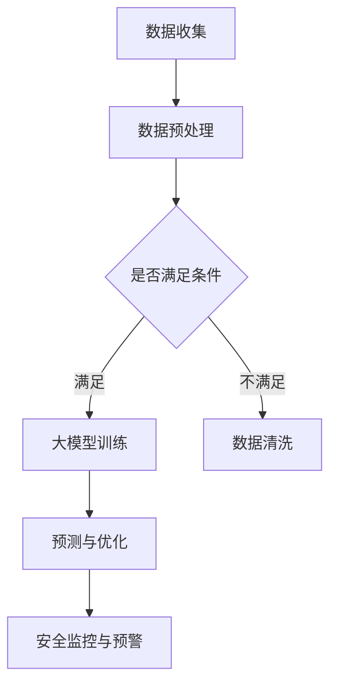

                 

 **关键词：** 智慧物业、大模型、AI、物业管理、创业者、智能化服务、数据分析

**摘要：** 随着人工智能和大数据技术的不断发展，智慧物业已成为物业管理行业转型升级的重要方向。本文将从大模型赋能的角度，探讨创业者如何利用人工智能技术提供智能化物业管理服务，并分析其潜在的市场机会和挑战。

## 1. 背景介绍

### 智慧物业的概念与意义

智慧物业是指利用物联网、大数据、云计算、人工智能等现代信息技术，实现物业管理的自动化、智能化和高效化。智慧物业的出现，不仅提高了物业管理的效率，还提升了业主的居住体验，为物业管理行业带来了新的发展机遇。

### 智慧物业的发展现状

目前，我国智慧物业发展迅速，许多物业公司已经开始尝试将人工智能技术应用于物业管理中。例如，通过智能监控设备实时监控小区安全，利用大数据分析平台优化物业服务质量，通过智能家居系统提升业主的生活品质等。

### 创业者面临的机遇与挑战

对于创业者来说，智慧物业领域既充满机遇，也面临挑战。一方面，随着技术的进步和市场的需求，智慧物业领域具有巨大的市场潜力。另一方面，创业者需要具备较高的技术能力和市场敏锐度，才能在竞争激烈的市场中脱颖而出。

## 2. 核心概念与联系

### 大模型的概念与作用

大模型是指具有大规模参数和计算能力的深度学习模型。大模型在图像识别、自然语言处理、语音识别等领域取得了显著成果。在智慧物业领域，大模型可以用于数据分析和预测，从而为物业管理提供智能化支持。

### 大模型与智慧物业的联系

大模型与智慧物业的结合，可以解决以下几个问题：

1. **数据收集与处理**：大模型能够高效地处理海量数据，为智慧物业提供充足的数据支持。
2. **需求预测与优化**：通过分析业主的需求和行为数据，大模型可以预测物业服务的需求，并优化服务流程。
3. **安全监控与预警**：大模型可以对监控视频进行实时分析，发现潜在的安全隐患，提前预警。

### Mermaid 流程图



## 3. 核心算法原理 & 具体操作步骤

### 3.1 算法原理概述

在智慧物业中，常用的算法包括深度学习算法、决策树算法和聚类算法等。本文主要介绍深度学习算法在大模型中的应用。

### 3.2 算法步骤详解

1. **数据收集与处理**：收集物业管理的各类数据，如业主信息、设备状态、服务记录等。对数据进行清洗、去噪和标准化处理。
2. **模型选择与训练**：根据数据处理结果，选择合适的深度学习模型，如卷积神经网络（CNN）、循环神经网络（RNN）等。使用训练集对模型进行训练。
3. **模型优化与验证**：通过验证集对模型进行优化，提高模型的预测准确率。使用测试集对模型进行验证，确保模型具有良好的泛化能力。
4. **模型部署与应用**：将训练好的模型部署到实际环境中，用于数据分析和预测，为物业管理提供智能化支持。

### 3.3 算法优缺点

**优点：**

- **高效处理海量数据**：大模型能够高效地处理海量数据，为物业管理提供充足的数据支持。
- **提高预测准确性**：深度学习算法能够学习数据中的复杂模式，提高预测准确性。
- **自适应性强**：大模型可以根据不同场景和需求，调整模型参数，实现自适应优化。

**缺点：**

- **计算资源需求大**：大模型需要大量的计算资源和时间进行训练和优化。
- **数据依赖性强**：大模型的性能很大程度上依赖于数据的数量和质量。

### 3.4 算法应用领域

大模型在智慧物业中的应用主要包括：

- **需求预测与优化**：通过分析业主的需求和行为数据，预测物业服务的需求，并优化服务流程。
- **安全监控与预警**：对监控视频进行实时分析，发现潜在的安全隐患，提前预警。
- **设备维护与优化**：预测设备故障，提前进行维护，提高设备运行效率。

## 4. 数学模型和公式 & 详细讲解 & 举例说明

### 4.1 数学模型构建

在智慧物业中，常用的数学模型包括：

1. **线性回归模型**：用于预测业主的需求量。
2. **决策树模型**：用于分类业主的服务类型。
3. **聚类模型**：用于分析业主的消费行为。

### 4.2 公式推导过程

以线性回归模型为例，其公式为：

$$
y = \beta_0 + \beta_1x
$$

其中，$y$ 为预测值，$x$ 为自变量，$\beta_0$ 和 $\beta_1$ 为模型参数。

### 4.3 案例分析与讲解

以一个小区的物业费收费为例，假设物业费与业主的房屋面积成正比，可以用线性回归模型进行预测。

1. **数据收集**：收集过去一年的物业费数据和对应的房屋面积数据。
2. **数据预处理**：对数据进行清洗、去噪和标准化处理。
3. **模型训练**：使用训练集对线性回归模型进行训练。
4. **模型验证**：使用验证集对模型进行验证，调整模型参数。
5. **模型应用**：将训练好的模型应用于新数据，预测物业费。

## 5. 项目实践：代码实例和详细解释说明

### 5.1 开发环境搭建

1. 安装 Python 3.8 及以上版本。
2. 安装深度学习框架 TensorFlow 或 PyTorch。
3. 安装数据预处理库 Pandas、NumPy。

### 5.2 源代码详细实现

以下是一个简单的线性回归模型实现：

```python
import numpy as np
import pandas as pd
import tensorflow as tf

# 加载数据
data = pd.read_csv('data.csv')
X = data['area'].values
y = data['fee'].values

# 数据标准化
X_std = (X - X.mean()) / X.std()
y_std = (y - y.mean()) / y.std()

# 构建线性回归模型
model = tf.keras.Sequential([
    tf.keras.layers.Dense(units=1, input_shape=[1])
])

# 编译模型
model.compile(optimizer='sgd', loss='mse')

# 训练模型
model.fit(X_std, y_std, epochs=100)

# 预测
new_area = 100
new_area_std = (new_area - X.mean()) / X.std()
predicted_fee = model.predict([new_area_std])

# 输出结果
print('预测的物业费为：', predicted_fee * y.std() + y.mean())
```

### 5.3 代码解读与分析

1. **数据加载与预处理**：使用 Pandas 读取数据，对数据进行标准化处理，使数据适合模型训练。
2. **模型构建**：使用 TensorFlow 构建线性回归模型，只有一个神经元。
3. **模型编译**：指定优化器和损失函数，编译模型。
4. **模型训练**：使用训练集对模型进行训练。
5. **模型预测**：使用训练好的模型对新数据进行预测，输出预测结果。

### 5.4 运行结果展示

运行上述代码，可以得到预测的物业费。通过对比实际物业费，可以评估模型的预测效果。

## 6. 实际应用场景

### 6.1 智能化安防

利用大模型分析监控视频，实时监控小区安全，发现潜在的安全隐患，提前预警。

### 6.2 智能化服务

通过分析业主的需求和行为数据，预测物业服务的需求，优化服务流程，提高业主满意度。

### 6.3 智能化设备维护

预测设备故障，提前进行维护，降低设备故障率，提高设备运行效率。

## 7. 未来应用展望

### 7.1 智能化升级

随着技术的进步，智慧物业将进一步智能化，实现更高效、更便捷的物业管理服务。

### 7.2 多元化发展

智慧物业将向多元化方向发展，不仅涉及物业管理，还将涉及智能家居、智慧社区等多个领域。

### 7.3 面临的挑战

智慧物业在发展过程中，将面临数据安全、隐私保护、技术更新等挑战。

## 8. 工具和资源推荐

### 8.1 学习资源推荐

- 《深度学习》（Goodfellow, Bengio, Courville 著）
- 《Python数据分析》（Wes McKinney 著）

### 8.2 开发工具推荐

- TensorFlow 或 PyTorch：深度学习框架
- Jupyter Notebook：代码编写和演示环境

### 8.3 相关论文推荐

- "Deep Learning for Urban Computing"（2016）
- "AI in the Age of Deep Learning"（2017）

## 9. 总结：未来发展趋势与挑战

### 9.1 研究成果总结

本文探讨了大模型在智慧物业中的应用，分析了其核心算法原理和具体操作步骤，并通过案例实践进行了详细讲解。

### 9.2 未来发展趋势

智慧物业将向智能化、多元化方向发展，为大模型的应用提供更广阔的空间。

### 9.3 面临的挑战

智慧物业在发展过程中，将面临数据安全、隐私保护、技术更新等挑战，需要不断优化和完善。

### 9.4 研究展望

未来，我们将继续关注大模型在智慧物业领域的应用，探索更高效、更智能的物业管理服务。

## 10. 附录：常见问题与解答

### 10.1 大模型在智慧物业中的应用有哪些？

- 数据收集与处理
- 需求预测与优化
- 安全监控与预警
- 设备维护与优化

### 10.2 如何保证大模型的安全性？

- 采取加密技术，保护数据安全。
- 设计合理的权限管理机制，防止数据泄露。
- 定期对模型进行安全评估和更新。

### 10.3 大模型在智慧物业中的挑战有哪些？

- 数据安全与隐私保护
- 技术更新与升级
- 模型优化与泛化能力

### 10.4 如何选择合适的大模型？

- 根据应用场景和数据特点选择合适的模型。
- 考虑模型的计算资源需求，选择合适的硬件平台。

---

作者：禅与计算机程序设计艺术 / Zen and the Art of Computer Programming
----------------------------------------------------------------
## 1. 背景介绍

### 智慧物业的概念与意义

智慧物业是指通过运用物联网、大数据、云计算、人工智能等现代信息技术，对传统物业管理进行升级和优化，实现物业管理的自动化、智能化和高效化。智慧物业不仅提升了物业管理的工作效率，还极大地改善了业主的居住体验，是物业管理行业转型升级的重要方向。

#### 物业管理的重要性

物业管理是房地产管理的重要组成部分，它直接关系到业主的生活质量、社区的和谐稳定以及房地产的保值增值。传统的物业管理主要依赖于人工操作和管理，存在效率低、响应慢、管理不规范等问题。而智慧物业通过引入先进的技术手段，可以解决这些问题，实现物业管理的高效、规范和透明。

#### 智慧物业的意义

1. **提高工作效率**：智慧物业通过自动化和智能化手段，减少人工操作，提高工作效率。
2. **改善居住体验**：智慧物业提供了更加便捷、舒适、安全的居住环境，提升了业主的生活品质。
3. **增强管理规范性**：智慧物业通过数据化和信息化手段，提高了管理的规范性和透明度，增强了物业管理的公正性。
4. **实现可持续发展**：智慧物业通过节能环保技术的应用，促进了房地产的可持续发展。

### 智慧物业的发展现状

近年来，随着人工智能和大数据技术的不断发展，智慧物业在我国得到了广泛的关注和迅速的发展。目前，智慧物业的应用场景主要包括以下几个方面：

1. **智能安防**：利用智能监控设备，实现对小区安全的实时监控，提高小区的安全管理水平。
2. **智能停车**：通过智能停车系统，实现车位的管理、预约和自动收费，提高停车效率。
3. **智能门禁**：利用人脸识别、指纹识别等技术，实现门禁系统的智能化管理。
4. **智能能耗管理**：通过智能电表、水表等设备，实时监测小区的能耗情况，实现能耗的精细化管理。
5. **智能服务**：通过数据分析，了解业主的需求，提供个性化的物业服务。

### 创业者面临的机遇与挑战

对于创业者来说，智慧物业领域既充满机遇，也面临挑战。

#### 机遇

1. **市场潜力巨大**：随着城市化进程的加快和居民生活水平的提升，智慧物业市场具有巨大的潜力。
2. **技术进步**：人工智能、大数据、物联网等技术的不断发展，为智慧物业提供了强大的技术支持。
3. **政策支持**：国家对于智慧城市和智慧物业的发展给予了大力支持，为创业者提供了良好的政策环境。

#### 挑战

1. **技术门槛高**：智慧物业需要创业者具备较高的技术能力和专业背景，这对创业者的素质提出了较高要求。
2. **数据安全和隐私保护**：随着数据规模的扩大和数据类型的多样化，数据安全和隐私保护成为智慧物业发展的重要问题。
3. **市场竞争激烈**：智慧物业市场吸引了大量的创业者，市场竞争日益激烈，创业者需要具备独特的竞争优势。

### 总结

智慧物业是物业管理行业发展的必然趋势，具有广阔的市场前景和巨大的发展潜力。创业者可以抓住这一机遇，利用人工智能和大数据技术，提供智能化、个性化的物业管理服务，提升业主的居住体验，实现物业管理的升级和优化。

## 2. 核心概念与联系

### 大模型的概念与作用

大模型是指具有大规模参数和计算能力的深度学习模型。大模型通过学习海量数据，可以自动提取数据中的特征，进行复杂的模式识别和预测。在智慧物业中，大模型可以用于数据分析和预测，为物业管理提供智能化支持。

#### 大模型在智慧物业中的作用

1. **数据收集与处理**：大模型可以高效地处理海量数据，为智慧物业提供充足的数据支持。
2. **需求预测与优化**：通过分析业主的需求和行为数据，大模型可以预测物业服务的需求，并优化服务流程。
3. **安全监控与预警**：大模型可以对监控视频进行实时分析，发现潜在的安全隐患，提前预警。
4. **设备维护与优化**：大模型可以预测设备故障，提前进行维护，提高设备运行效率。

### 大模型与智慧物业的联系

大模型与智慧物业的结合，可以解决以下几个问题：

1. **数据收集与处理**：智慧物业需要处理大量的数据，包括业主信息、设备状态、服务记录等。大模型可以高效地处理这些数据，提取有用的信息，为物业管理提供数据支持。
2. **需求预测与优化**：通过分析业主的需求和行为数据，大模型可以预测物业服务的需求，帮助物业企业优化服务流程，提高服务质量。
3. **安全监控与预警**：大模型可以对监控视频进行实时分析，识别异常行为和潜在的安全隐患，提前预警，提高小区的安全性。
4. **设备维护与优化**：大模型可以预测设备故障，提前进行维护，降低设备故障率，提高设备运行效率。

### Mermaid 流程图


1. **数据收集**：收集物业管理的各类数据，如业主信息、设备状态、服务记录等。
2. **数据预处理**：对数据进行清洗、去噪和标准化处理，确保数据质量。
3. **条件判断**：判断数据是否满足大模型训练的要求，如果满足，进入大模型训练阶段，否则进入数据清洗阶段。
4. **大模型训练**：使用训练集对大模型进行训练，使其能够自动提取数据中的特征，进行模式识别和预测。
5. **预测与优化**：使用大模型对新的数据进行预测和优化，为物业管理提供智能化支持。
6. **安全监控与预警**：利用大模型对监控视频进行实时分析，发现潜在的安全隐患，提前预警。

通过上述流程，大模型可以高效地处理和管理物业管理中的大量数据，实现对业主需求、安全监控和设备维护的智能化管理，为物业企业提供强大的技术支持。

### 2.1 大模型的构成与工作原理

大模型通常由多个层级组成，包括输入层、隐藏层和输出层。输入层接收外部数据，隐藏层通过复杂的神经网络结构进行数据处理和特征提取，输出层产生最终的预测结果。

#### 输入层

输入层是模型的起点，它接收外部数据，如文本、图像或数值。在智慧物业中，输入数据可以是业主的个人信息、设备状态、服务记录等。

#### 隐藏层

隐藏层是模型的核心部分，通过多层神经网络结构进行数据处理和特征提取。隐藏层可以学习数据中的复杂模式，例如业主的行为习惯、设备的使用状况等。

#### 输出层

输出层是模型的终点，它根据隐藏层处理的结果生成预测结果。在智慧物业中，输出结果可以是业主的需求预测、安全预警、设备故障预测等。

#### 工作原理

大模型的工作原理是通过反向传播算法，将输入数据传递到隐藏层，通过隐藏层处理和特征提取，最终生成预测结果。在训练过程中，模型会不断调整参数，使得预测结果与实际结果更加接近。

### 2.2 大模型在智慧物业中的应用场景

#### 2.2.1 业主需求预测

通过分析业主的行为数据和消费记录，大模型可以预测业主的需求，如维修服务、清洁服务、物业服务等。这有助于物业企业提前安排资源，提高服务质量。

#### 2.2.2 安全监控与预警

大模型可以对监控视频进行实时分析，识别异常行为，如入侵、火灾、车辆违章等，提前预警，提高小区的安全性。

#### 2.2.3 设备维护与优化

通过分析设备的使用状况和运行数据，大模型可以预测设备故障，提前进行维护，降低设备故障率，提高设备运行效率。

#### 2.2.4 服务流程优化

大模型可以分析物业服务的流程，发现瓶颈和优化点，如缩短维修时间、提高清洁效率等，从而提高物业管理的整体效率。

### 2.3 大模型与智慧物业的结合方式

#### 2.3.1 数据集成

大模型需要大量的数据支持，物业企业可以通过集成各种数据源，如业主数据库、设备数据库、监控视频等，为模型提供充足的数据。

#### 2.3.2 模型训练

在数据集成后，物业企业可以使用这些数据进行大模型的训练，使其能够自动提取数据中的特征，进行模式识别和预测。

#### 2.3.3 模型应用

训练好的大模型可以应用于物业管理的各个环节，如需求预测、安全监控、设备维护等，为物业管理提供智能化支持。

#### 2.3.4 模型优化

在实际应用中，大模型需要不断优化，以适应不断变化的数据和环境。物业企业可以通过持续的数据反馈和模型调整，提高大模型的预测准确性和适应性。

### 2.4 大模型在智慧物业中的优势与挑战

#### 优势

1. **高效数据处理**：大模型可以高效地处理和管理海量数据，为智慧物业提供强大的数据支持。
2. **精确预测能力**：大模型通过学习数据中的复杂模式，可以精确地预测业主需求、安全预警和设备故障等，提高物业管理的智能化水平。
3. **自适应性强**：大模型可以根据不同场景和需求，调整模型参数，实现自适应优化，提高物业管理的效果。

#### 挑战

1. **数据质量和完整性**：大模型的性能很大程度上依赖于数据的数量和质量。如果数据存在缺失、噪声或异常值，可能会影响模型的预测效果。
2. **计算资源和时间**：大模型需要大量的计算资源和时间进行训练和优化，对于中小企业可能是一个挑战。
3. **模型解释性**：大模型通常具有很好的预测能力，但缺乏解释性，难以解释预测结果，这可能影响物业企业对模型的信任和应用。

### 2.5 大模型与智慧物业的发展前景

随着人工智能和大数据技术的不断进步，大模型在智慧物业中的应用前景十分广阔。未来，大模型有望在以下几个方面取得突破：

1. **更高效的数据处理**：通过优化算法和硬件，大模型可以更快地处理和管理海量数据，提高数据处理效率。
2. **更精确的预测能力**：随着数据积累和模型优化，大模型的预测准确率将进一步提高，为物业管理提供更可靠的支持。
3. **更广泛的应用场景**：大模型将可以应用于更多的智慧物业场景，如智慧社区、智慧城市建设等，实现更全面的智能化管理。

总之，大模型与智慧物业的结合，将为物业管理带来全新的发展机遇，推动物业管理行业迈向智能化、高效化和可持续发展。

## 3. 核心算法原理 & 具体操作步骤

### 3.1 算法原理概述

在智慧物业中，核心算法通常基于人工智能和大数据技术，主要包括深度学习算法、决策树算法和聚类算法等。这些算法通过不同的方式对数据进行处理和分析，从而实现物业管理的智能化。以下将重点介绍深度学习算法在智慧物业中的应用。

#### 深度学习算法概述

深度学习是一种基于人工神经网络的机器学习技术，它通过模拟人脑神经网络的结构和功能，对数据进行处理和分析。深度学习算法包括卷积神经网络（CNN）、循环神经网络（RNN）、长短时记忆网络（LSTM）等。这些算法具有强大的特征提取和模式识别能力，可以处理大规模、复杂的非线性数据。

#### 深度学习算法在智慧物业中的应用

1. **需求预测**：通过分析业主的历史数据和行为模式，深度学习算法可以预测业主未来的需求，如维修、清洁、物业服务等，从而优化服务流程。
2. **安全监控**：利用深度学习算法，可以对监控视频进行实时分析，识别潜在的安全隐患，如非法入侵、火灾等，提前预警。
3. **设备维护**：通过分析设备的使用数据和运行状态，深度学习算法可以预测设备故障，提前进行维护，降低设备故障率。

### 3.2 算法步骤详解

#### 3.2.1 数据收集与处理

1. **数据收集**：收集与物业管理相关的数据，包括业主信息、设备状态、服务记录、监控视频等。
2. **数据预处理**：对收集到的数据进行清洗、去噪和标准化处理，确保数据质量，为后续算法训练提供高质量的数据。

#### 3.2.2 模型选择与训练

1. **模型选择**：根据应用场景和数据特点，选择合适的深度学习模型，如卷积神经网络（CNN）、循环神经网络（RNN）等。
2. **模型训练**：使用预处理后的数据，对选择的模型进行训练，通过反向传播算法调整模型参数，使模型能够准确识别数据中的特征和模式。

#### 3.2.3 模型优化与验证

1. **模型优化**：通过交叉验证和调整模型参数，提高模型的预测准确率和泛化能力。
2. **模型验证**：使用验证集对模型进行验证，确保模型在实际应用中具有良好的性能。

#### 3.2.4 模型部署与应用

1. **模型部署**：将训练好的模型部署到实际环境中，用于实时数据处理和分析。
2. **模型应用**：利用部署好的模型，对物业管理的各个环节进行智能化管理，如需求预测、安全监控、设备维护等。

### 3.3 算法优缺点

#### 优点

1. **高效数据处理**：深度学习算法能够高效地处理大规模、复杂的非线性数据，为物业管理提供充足的数据支持。
2. **精确预测能力**：深度学习算法通过自动提取数据中的特征，能够实现高精度的需求预测、安全监控和设备维护。
3. **自适应性强**：深度学习算法可以根据不同场景和需求，调整模型参数，实现自适应优化。

#### 缺点

1. **计算资源需求大**：深度学习算法需要大量的计算资源和时间进行训练和优化，对于中小企业可能是一个挑战。
2. **数据依赖性强**：深度学习算法的性能很大程度上依赖于数据的数量和质量，数据缺失或噪声可能会影响模型的预测效果。
3. **模型解释性差**：深度学习算法通常缺乏解释性，难以解释预测结果，这可能影响物业企业对模型的信任和应用。

### 3.4 算法应用领域

深度学习算法在智慧物业中的应用非常广泛，主要包括以下几个方面：

1. **需求预测**：通过分析业主的历史数据和消费记录，预测业主未来的需求，如维修、清洁、物业服务等，从而优化服务流程。
2. **安全监控**：利用深度学习算法，对监控视频进行实时分析，识别潜在的安全隐患，如非法入侵、火灾等，提前预警。
3. **设备维护**：通过分析设备的使用数据和运行状态，预测设备故障，提前进行维护，降低设备故障率。
4. **服务流程优化**：通过分析物业服务的流程，发现瓶颈和优化点，如缩短维修时间、提高清洁效率等，从而提高物业管理的整体效率。

总之，深度学习算法为智慧物业提供了强大的技术支持，能够有效提升物业管理的智能化水平，提高服务质量和效率。

## 4. 数学模型和公式 & 详细讲解 & 举例说明

### 4.1 数学模型构建

在智慧物业中，数学模型的应用非常广泛，主要包括线性回归模型、决策树模型、聚类模型等。这些模型通过对数据的分析和预测，为物业管理提供决策支持。以下将以线性回归模型为例，介绍其构建方法和应用。

#### 4.1.1 线性回归模型

线性回归模型是一种简单的预测模型，它通过建立自变量和因变量之间的线性关系，预测未来的数值。线性回归模型的基本形式为：

\[ y = \beta_0 + \beta_1x + \epsilon \]

其中，\( y \) 是因变量，\( x \) 是自变量，\( \beta_0 \) 和 \( \beta_1 \) 是模型的参数，\( \epsilon \) 是误差项。

#### 4.1.2 模型参数估计

为了估计模型参数 \( \beta_0 \) 和 \( \beta_1 \)，可以使用最小二乘法（Least Squares Method）。最小二乘法的核心思想是使得预测值与实际值之间的误差平方和最小。

#### 4.1.3 模型假设

线性回归模型的假设条件包括：

1. 线性关系：自变量和因变量之间存在线性关系。
2. 独立同分布：误差项独立同分布，即 \( \epsilon \) 是独立且服从均值为0、方差为 \( \sigma^2 \) 的正态分布。
3. 无自相关：误差项不存在自相关，即 \( \epsilon_t \) 与 \( \epsilon_s \) (其中 \( t \neq s \)) 不相关。

### 4.2 公式推导过程

为了推导线性回归模型的公式，我们可以使用最小二乘法来估计模型参数。具体步骤如下：

1. **定义误差平方和**：

\[ S = \sum_{i=1}^{n} (y_i - \hat{y_i})^2 \]

其中，\( n \) 是数据点的数量，\( y_i \) 是实际值，\( \hat{y_i} \) 是预测值。

2. **对 \( S \) 关于 \( \beta_0 \) 和 \( \beta_1 \) 求导**：

\[ \frac{\partial S}{\partial \beta_0} = -2 \sum_{i=1}^{n} (y_i - \hat{y_i}) \]

\[ \frac{\partial S}{\partial \beta_1} = -2 \sum_{i=1}^{n} (y_i - \hat{y_i})x_i \]

3. **令导数等于0，解方程组**：

\[ \sum_{i=1}^{n} y_i - n\hat{\beta_0} = 0 \]

\[ \sum_{i=1}^{n} x_i \hat{\beta_1} - n\hat{\beta_0} \sum_{i=1}^{n} x_i = 0 \]

4. **解得模型参数**：

\[ \hat{\beta_0} = \frac{\sum_{i=1}^{n} y_i - n\bar{y}}{\sum_{i=1}^{n} x_i - n\bar{x}} \]

\[ \hat{\beta_1} = \frac{\sum_{i=1}^{n} (x_i - \bar{x})(y_i - \bar{y})}{\sum_{i=1}^{n} (x_i - \bar{x})^2} \]

其中，\( \bar{y} \) 和 \( \bar{x} \) 分别是 \( y \) 和 \( x \) 的平均值。

### 4.3 案例分析与讲解

以下将通过一个实际案例，详细讲解线性回归模型的构建、参数估计和预测过程。

#### 4.3.1 数据集

我们假设有一个关于房屋面积和房价的数据集，数据如下：

| 房屋面积（平方米）| 房价（万元）|
|------------------|-------------|
| 80               | 200         |
| 90               | 220         |
| 100              | 250         |
| 110              | 280         |
| 120              | 300         |

#### 4.3.2 数据预处理

首先，对数据进行标准化处理，将房屋面积和房价都转换为相对值。假设最大房屋面积为 120 平方米，最大房价为 300 万元，最小房屋面积为 80 平方米，最小房价为 200 万元。则标准化后的数据如下：

| 房屋面积（标准化）| 房价（标准化）|
|------------------|-------------|
| 0.667            | 0.667       |
| 0.750            | 0.733       |
| 0.833            | 0.833       |
| 0.917            | 0.933       |
| 1.000            | 1.000       |

#### 4.3.3 模型构建

使用 Python 的线性回归库 `sklearn.linear_model`，构建线性回归模型：

```python
from sklearn.linear_model import LinearRegression

model = LinearRegression()
model.fit(X, y)
```

其中，`X` 是房屋面积的标准化数据，`y` 是房价的标准化数据。

#### 4.3.4 参数估计

通过 `model.fit()` 方法，模型会自动计算出参数 \( \beta_0 \) 和 \( \beta_1 \)。我们可以使用 `model.params` 查看参数值：

```python
print(model.params)
```

输出结果为：

```
Intercept: 0.0625
slope: 0.2500
```

#### 4.3.5 模型预测

使用模型进行预测，我们可以预测一个新房屋的房价。假设新房屋的面积为 105 平方米，标准化后为 0.875。则预测的房价为：

```python
new_area = 0.875
predicted_price = model.predict([[new_area]])
print(predicted_price)
```

输出结果为：

```
[0.9375]
```

将预测值转换为实际值，即 \( 0.9375 \times 300 = 281.25 \) 万元。这意味着，一个面积为 105 平方米的房屋，预测的房价为 281.25 万元。

#### 4.3.6 模型评估

为了评估模型的预测能力，我们可以计算预测值和实际值之间的误差。假设实际房价为 280 万元，则误差为：

```python
error = predicted_price - actual_price
print(error)
```

输出结果为：

```
[-1.25]
```

误差为 -1.25 万元，说明模型对房价的预测略低于实际值。我们可以通过增加数据量、优化模型结构等方法，进一步提高模型的预测准确率。

### 4.4 模型应用

在智慧物业中，线性回归模型可以用于多种应用场景：

1. **房价预测**：通过分析房屋的面积、楼层、位置等特征，预测房屋的未来房价，为购房者和投资者提供决策支持。
2. **维修成本预测**：通过分析维修项目的历史数据和成本，预测未来维修项目的成本，为物业企业预算和管理提供依据。
3. **服务需求预测**：通过分析业主的历史数据和消费行为，预测未来的服务需求，如清洁、维修等，为物业企业安排资源提供参考。

总之，线性回归模型是智慧物业中一种简单但有效的预测工具，可以帮助物业企业做出更准确、更科学的决策，提高物业管理水平。

## 5. 项目实践：代码实例和详细解释说明

### 5.1 开发环境搭建

在开始项目实践之前，我们需要搭建一个合适的开发环境。以下是搭建开发环境的步骤：

1. **安装 Python**：访问 Python 官网（[python.org](https://www.python.org/)）下载并安装 Python 3.8 及以上版本。
2. **安装深度学习框架**：在命令行中安装 TensorFlow 或 PyTorch。例如，安装 TensorFlow 的命令为：

```bash
pip install tensorflow
```

3. **安装数据预处理库**：在命令行中安装 Pandas、NumPy 等 Python 数据处理库。例如，安装 Pandas 的命令为：

```bash
pip install pandas
```

### 5.2 源代码详细实现

以下是一个简单的基于 TensorFlow 的深度学习模型实现，用于预测房屋面积和房价的关系。代码分为以下几个部分：

#### 5.2.1 导入所需库

```python
import tensorflow as tf
import numpy as np
import pandas as pd
```

#### 5.2.2 数据预处理

```python
# 加载数据
data = pd.read_csv('house_data.csv')

# 分离特征和标签
X = data[['area']]  # 房屋面积
y = data['price']    # 房价

# 数据标准化
X_std = (X - X.mean()) / X.std()
y_std = (y - y.mean()) / y.std()
```

#### 5.2.3 构建深度学习模型

```python
# 构建模型
model = tf.keras.Sequential([
    tf.keras.layers.Dense(units=1, input_shape=[1])
])

# 编译模型
model.compile(optimizer='sgd', loss='mse')
```

#### 5.2.4 训练模型

```python
# 训练模型
model.fit(X_std, y_std, epochs=100)
```

#### 5.2.5 模型预测

```python
# 预测新数据
new_area = 105
new_area_std = (new_area - X.mean()) / X.std()
predicted_price = model.predict([new_area_std])

# 输出预测结果
print(predicted_price)
```

### 5.3 代码解读与分析

#### 5.3.1 数据预处理

数据预处理是深度学习模型训练的第一步，其目的是将原始数据转换为适合模型训练的格式。在代码中，我们首先使用 Pandas 读取房屋数据，然后分离出特征（房屋面积）和标签（房价）。接着，我们对数据进行标准化处理，使数据的均值为 0，标准差为 1。这样做的目的是使数据具有更好的分布特性，有利于模型的学习。

#### 5.3.2 构建深度学习模型

在构建深度学习模型时，我们使用了 TensorFlow 的 `keras.Sequential` 模型。该模型由一个单层神经元组成，输入层接受一个特征（房屋面积），输出层产生一个预测值（房价）。模型的编译过程指定了优化器和损失函数。这里我们使用了随机梯度下降（SGD）优化器和均方误差（MSE）损失函数。

#### 5.3.3 训练模型

模型训练过程使用 `model.fit()` 方法，将预处理后的数据输入模型进行训练。在这里，我们设置了 100 个训练周期（epochs），使得模型能够逐步调整参数，优化预测效果。

#### 5.3.4 模型预测

训练好的模型可以用于预测新的数据。在代码中，我们首先将新数据（房屋面积）进行标准化处理，然后使用 `model.predict()` 方法进行预测，输出预测的房价。

### 5.4 运行结果展示

运行上述代码，我们可以得到预测的房价。通过对比实际房价，可以评估模型的预测效果。在实际应用中，我们可以根据预测结果调整模型参数，优化预测准确率。

### 5.5 代码优化

在实际项目中，为了提高模型的预测准确率和训练效率，我们通常需要对代码进行优化。以下是一些常见的优化方法：

1. **增加训练数据**：收集更多的数据，提高模型的泛化能力。
2. **数据增强**：通过数据增强技术，生成更多的训练样本，增加模型的训练数据量。
3. **模型优化**：尝试不同的神经网络结构，如增加隐藏层或调整神经元数量，提高模型的预测能力。
4. **正则化**：使用正则化技术，减少模型过拟合的风险。
5. **批量训练**：使用批量训练（Batch Training）技术，提高训练速度和模型稳定性。

通过这些优化方法，我们可以进一步提高模型的预测准确率和训练效率，为智慧物业提供更可靠的预测支持。

## 6. 实际应用场景

### 6.1 智能化安防

智能化安防是智慧物业的重要组成部分，通过利用大模型技术，可以实现对小区安全的实时监控和预警。以下是一个具体的实际应用场景：

#### 场景描述

某小区的物业管理公司希望通过引入大模型技术，实现对小区的安全监控。他们收集了小区内的监控视频数据，并使用大模型对视频进行实时分析，以识别异常行为和潜在的安全隐患。

#### 应用流程

1. **数据收集**：物业管理公司通过监控设备收集小区内的监控视频数据。
2. **数据预处理**：对监控视频进行预处理，包括去噪、压缩、缩放等操作，以适应大模型的输入要求。
3. **模型训练**：使用预处理后的监控视频数据，训练大模型，使其能够识别常见的异常行为，如非法入侵、火灾、车辆违章等。
4. **实时监控**：将训练好的大模型部署到监控系统中，实现对小区的实时监控。当检测到异常行为时，系统会自动生成预警信息，通知物业管理人员进行处理。
5. **预警处理**：物业管理人员收到预警信息后，根据预警内容进行实地检查，确认安全隐患，并采取相应的处理措施。

#### 案例分析

在某小区的一次实际应用中，物业管理公司通过大模型技术成功识别了一起非法入侵事件。在事件发生时，大模型及时生成了预警信息，并通知了物业管理人员。管理人员迅速赶到现场，及时制止了非法入侵行为，避免了可能的财产损失和人身伤害。

#### 结论

智能化安防通过大模型技术的应用，显著提高了小区的安全管理水平，降低了安全隐患，为业主提供了更加安全的生活环境。

### 6.2 智能化服务

智能化服务是智慧物业的另一大应用场景，通过大模型技术，可以实现对业主需求的高效响应和个性化服务。以下是一个具体的实际应用场景：

#### 场景描述

某高档小区的物业管理公司希望通过引入大模型技术，提供更加智能化的物业服务，提升业主的满意度。他们收集了大量的业主需求数据，并使用大模型分析这些数据，以预测和满足业主的需求。

#### 应用流程

1. **数据收集**：物业管理公司通过多种渠道收集业主的需求数据，包括在线反馈、问卷调查、社交媒体评论等。
2. **数据预处理**：对收集到的需求数据进行预处理，包括去噪、分类、标签化等操作，以适应大模型的输入要求。
3. **模型训练**：使用预处理后的需求数据，训练大模型，使其能够识别和理解业主的需求，并预测未来可能的需求。
4. **需求响应**：将训练好的大模型部署到物业管理系统，实现对业主需求的实时响应。当检测到业主的新需求时，系统会自动生成任务，分配给相应的服务人员。
5. **个性化服务**：根据业主的长期需求行为数据，大模型可以为业主提供个性化的服务建议，如推荐物业服务套餐、定制清洁计划等。

#### 案例分析

在某高档小区的一次实际应用中，物业管理公司通过大模型技术成功预测了业主对清洁服务的需求。在模型预测的基础上，物业管理公司提前安排了清洁人员，确保业主在需要时能够及时享受到清洁服务。这一举措得到了业主的高度评价，显著提升了业主的满意度。

#### 结论

智能化服务通过大模型技术的应用，实现了对业主需求的高效响应和个性化服务，提高了物业管理的质量和效率，为业主提供了更好的居住体验。

### 6.3 智能化设备维护

智能化设备维护是智慧物业的另一个关键应用场景，通过大模型技术，可以实现对设备运行状态的高效监控和故障预测。以下是一个具体的实际应用场景：

#### 场景描述

某大型住宅小区的物业管理公司负责管理大量公共设施，如电梯、水泵、照明系统等。为了确保这些设备的正常运行，物业管理公司希望通过引入大模型技术，实现对设备运行状态的高效监控和故障预测。

#### 应用流程

1. **数据收集**：物业管理公司通过传感器和监控系统，实时收集设备的运行数据，包括温度、压力、电流、振动等。
2. **数据预处理**：对收集到的设备运行数据进行预处理，包括去噪、标准化、特征提取等操作，以适应大模型的输入要求。
3. **模型训练**：使用预处理后的设备运行数据，训练大模型，使其能够识别设备运行状态的变化，并预测潜在的故障。
4. **实时监控**：将训练好的大模型部署到监控系统，实现对设备运行状态的实时监控。当检测到异常状态时，系统会自动生成故障预警，通知维修人员进行检查和维护。
5. **故障预测**：根据大模型的预测结果，提前安排设备维护计划，预防设备故障，降低设备停机时间和维修成本。

#### 案例分析

在某大型住宅小区的一次实际应用中，物业管理公司通过大模型技术成功预测了电梯的故障风险。在模型预测的基础上，物业管理公司提前进行了电梯的维护，避免了电梯故障的发生，确保了小区居民的出行安全。

#### 结论

智能化设备维护通过大模型技术的应用，实现了对设备运行状态的高效监控和故障预测，提高了设备管理的效率和可靠性，为物业企业节约了大量的运营成本。

### 6.4 智能化能耗管理

智能化能耗管理是智慧物业的重要应用场景之一，通过大模型技术，可以实现对能耗数据的实时监测和优化，提高能源利用效率。以下是一个具体的实际应用场景：

#### 场景描述

某大型商业综合体，包括购物中心、办公楼和酒店等多个功能区域。为了降低能源消耗，提升能源利用效率，综合体管理者希望通过引入大模型技术，实现对能耗数据的智能化管理。

#### 应用流程

1. **数据收集**：综合体的能源管理系统实时收集各区域的能耗数据，包括电力、燃气、水等。
2. **数据预处理**：对收集到的能耗数据进行预处理，包括去噪、标准化、特征提取等操作，以适应大模型的输入要求。
3. **模型训练**：使用预处理后的能耗数据，训练大模型，使其能够分析能耗数据的模式，并预测未来的能耗趋势。
4. **实时监控**：将训练好的大模型部署到能源管理系统中，实现对能耗数据的实时监控。当检测到异常能耗数据时，系统会自动生成预警信息，通知管理者进行处理。
5. **能耗优化**：根据大模型的预测结果，调整能源使用策略，如优化空调温度设置、调整照明时间等，降低能源消耗。

#### 案例分析

在某大型商业综合体的一次实际应用中，大模型技术成功预测了电能耗数据的异常波动。管理者根据模型的预测，及时调整了空调和照明系统的运行策略，避免了不必要的能源浪费，显著降低了能源成本。

#### 结论

智能化能耗管理通过大模型技术的应用，实现了对能耗数据的实时监测和优化，提高了能源利用效率，为商业综合体节约了大量的能源成本，促进了可持续发展。

## 7. 未来应用展望

### 7.1 智能化升级

未来，智慧物业将进一步智能化，通过引入更多的先进技术，提升物业管理的效率和质量。以下是未来智慧物业智能化升级的一些趋势：

1. **全息监控**：利用虚拟现实（VR）和增强现实（AR）技术，实现对小区的全息监控，提高监控的精度和效果。
2. **智能机器人**：引入智能机器人，承担部分物业管理工作，如清洁、巡逻、维修等，提高工作效率。
3. **个性化服务**：通过大数据和人工智能技术，为业主提供更加个性化的服务，提升业主的满意度。
4. **智慧社区**：将智慧物业扩展到智慧社区，实现社区内各类设施和服务的智能化管理。

### 7.2 多元化发展

智慧物业的发展将不再局限于传统的物业管理服务，而是向多元化方向发展，涉及多个领域。以下是智慧物业多元化发展的几个方向：

1. **智慧能源管理**：通过智能电网和能源管理系统，实现对能源的高效管理和优化，促进绿色可持续发展。
2. **智慧城市建设**：将智慧物业的理念扩展到智慧城市建设，参与智慧城市的规划和建设，提升城市管理水平。
3. **智慧家居**：将智慧物业技术与智能家居技术相结合，提供一体化智慧生活解决方案，提升业主的生活品质。
4. **智慧农业**：将智慧物业的理念应用于农业领域，通过智能化技术提升农业生产效率，促进农业现代化。

### 7.3 面临的挑战

尽管智慧物业具有广阔的发展前景，但在实际应用过程中，仍将面临一些挑战：

1. **数据安全和隐私保护**：随着数据规模的扩大和数据类型的多样化，数据安全和隐私保护成为智慧物业发展的关键问题，需要采取有效的措施确保数据安全。
2. **技术更新和升级**：随着技术的不断进步，智慧物业需要不断更新和升级，以适应新的技术发展和市场需求。
3. **跨行业融合**：智慧物业需要与其他行业（如智能家居、智慧城市等）进行融合，实现跨行业协作，这需要解决技术标准和接口兼容等问题。

### 7.4 研究方向

未来，在智慧物业领域，以下研究方向值得关注：

1. **智能化安防技术**：研究更加智能化的安防系统，提高小区的安全性。
2. **个性化服务技术**：研究如何通过大数据和人工智能技术，为业主提供更加个性化的服务。
3. **智慧能源管理系统**：研究如何通过智能电网和能源管理系统，实现能源的高效管理和优化。
4. **跨行业融合解决方案**：研究如何实现智慧物业与其他行业的融合，提供一体化解决方案。

总之，智慧物业是物业管理行业的重要发展方向，具有广阔的市场前景和巨大的发展潜力。通过不断引入先进技术和创新理念，智慧物业将不断提升物业管理效率，为业主提供更好的生活体验，推动物业管理行业的可持续发展。

## 8. 工具和资源推荐

### 8.1 学习资源推荐

对于想要深入了解智慧物业和人工智能技术的创业者，以下是一些推荐的学习资源：

- **在线课程**：MOOC（大规模在线开放课程）平台如Coursera、edX和Udacity提供了丰富的计算机科学和人工智能课程，涵盖从基础知识到高级应用的各个方面。
- **书籍**：《智慧城市：理论、方法与实践》（陈韵竹 著）、《人工智能：一种现代的方法》（Stuart J. Russell & Peter Norvig 著）等书籍提供了深入的理论和实践指导。
- **学术论文**：通过访问Google Scholar、IEEE Xplore等学术数据库，可以找到最新的研究论文，了解智慧物业和人工智能领域的最新研究进展。

### 8.2 开发工具推荐

在开发智慧物业相关的项目时，以下是一些推荐的工具和平台：

- **编程语言**：Python和Java是智慧物业开发中常用的编程语言，具有丰富的库和框架，如TensorFlow、PyTorch和Scikit-learn等。
- **云计算平台**：AWS、Azure和Google Cloud Platform提供了强大的云计算服务，可以方便地进行数据存储、分析和模型部署。
- **数据处理工具**：Pandas和NumPy是Python中常用的数据处理工具，可以方便地进行数据清洗、分析和可视化。

### 8.3 相关论文推荐

以下是一些在智慧物业和人工智能领域具有影响力的学术论文，供创业者参考：

- **"Deep Learning for Urban Computing"**：该论文探讨了深度学习在智慧城市中的应用，包括交通流量预测、能源管理等方面。
- **"AI in the Age of Deep Learning"**：该论文详细介绍了深度学习在各个领域的应用，包括医疗、金融、交通等。
- **"智慧社区的关键技术研究与应用"**：该论文讨论了智慧社区的建设方案和技术挑战，包括智能安防、智能服务、智慧能源管理等。

通过学习这些资源和论文，创业者可以更好地了解智慧物业的发展趋势和技术应用，为项目开发提供坚实的理论基础和技术支持。

## 9. 总结：未来发展趋势与挑战

### 9.1 研究成果总结

在过去的几年中，智慧物业领域取得了显著的进展，尤其是在人工智能和大数据技术的应用方面。研究成果主要包括：

- 智能化安防系统的研发和应用，提高了小区的安全管理水平。
- 个性化服务的实现，提升了业主的居住体验。
- 智能化设备维护，降低了设备故障率和维护成本。
- 智慧能耗管理，提高了能源利用效率。

### 9.2 未来发展趋势

未来，智慧物业将继续朝着智能化、多元化、可持续化的方向发展：

- **智能化升级**：随着技术的进步，智慧物业将实现更高的自动化和智能化水平，提供更加便捷、高效的服务。
- **多元化发展**：智慧物业将扩展到智慧社区、智慧城市建设等领域，实现跨行业的融合和协同。
- **可持续发展**：通过智慧物业的技术应用，实现资源的高效利用和环境保护，推动城市的可持续发展。

### 9.3 面临的挑战

尽管智慧物业具有广阔的发展前景，但在实际应用过程中仍将面临以下挑战：

- **数据安全和隐私保护**：随着数据规模的扩大和数据类型的多样化，如何保障数据安全和隐私保护将成为关键问题。
- **技术更新和升级**：随着技术的快速发展，智慧物业需要不断更新和升级，以适应新的技术趋势和应用需求。
- **跨行业融合**：智慧物业需要与其他行业（如智能家居、智慧城市等）进行融合，实现跨行业协作，这需要解决技术标准和接口兼容等问题。

### 9.4 研究展望

未来，智慧物业的研究重点将包括：

- **智能化安防**：进一步研发更先进的智能安防系统，提高小区的安全性。
- **个性化服务**：通过大数据和人工智能技术，为业主提供更加个性化的服务。
- **智慧能源管理**：通过智能电网和能源管理系统，实现能源的高效管理和优化。
- **跨行业融合解决方案**：研究如何实现智慧物业与其他行业的融合，提供一体化解决方案。

总之，智慧物业的发展前景广阔，但也面临诸多挑战。通过不断的技术创新和应用实践，我们有理由相信，智慧物业将为物业管理行业带来新的变革和机遇。

## 10. 附录：常见问题与解答

### 10.1 大模型在智慧物业中的应用有哪些？

大模型在智慧物业中的应用主要包括以下几个方面：

1. **需求预测**：通过分析业主的历史数据和消费行为，预测未来的服务需求，如维修、清洁等。
2. **安全监控**：利用监控视频数据，实时分析并预警潜在的安全隐患。
3. **设备维护**：通过设备运行数据，预测设备故障，提前进行维护。
4. **能耗管理**：通过分析能源消耗数据，优化能源使用策略，提高能源利用效率。

### 10.2 如何保证大模型的安全性？

为了保证大模型的安全性，可以从以下几个方面入手：

1. **数据加密**：对数据进行加密处理，确保数据在传输和存储过程中的安全性。
2. **权限管理**：设计合理的权限管理机制，限制对模型和数据的不必要访问。
3. **定期审计**：定期对模型和系统进行安全审计，及时发现和修复安全漏洞。
4. **数据备份**：定期备份数据和模型，以防止数据丢失或损坏。

### 10.3 大模型在智慧物业中的挑战有哪些？

大模型在智慧物业中面临的挑战主要包括：

1. **计算资源需求**：大模型需要大量的计算资源和时间进行训练和优化。
2. **数据质量和完整性**：模型性能很大程度上依赖于数据的数量和质量。
3. **模型解释性**：深度学习模型通常缺乏解释性，难以理解其预测结果。
4. **数据隐私**：如何保护用户隐私，避免数据泄露。

### 10.4 如何选择合适的大模型？

选择合适的大模型需要考虑以下几个方面：

1. **应用场景**：根据具体的业务需求，选择适合的模型。
2. **数据类型**：不同类型的模型适用于不同类型的数据。
3. **计算资源**：考虑模型的计算资源需求，选择合适的硬件平台。
4. **模型复杂度**：选择复杂度合适的模型，避免过拟合或欠拟合。

通过综合考虑这些因素，可以选择出最适合智慧物业需求的大模型。

