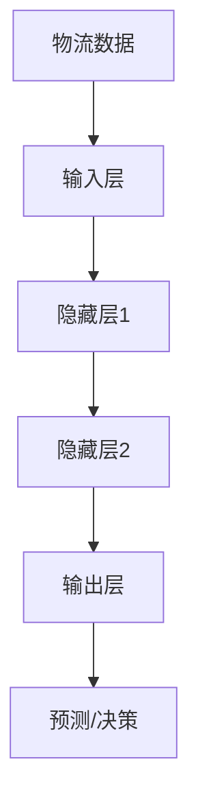

                 

关键词：大模型，智慧物流，供应链管理，AI，数据分析，优化策略

摘要：本文探讨了如何利用大型人工智能模型赋能智慧物流，提高供应链管理效率。通过分析核心概念、算法原理、数学模型以及实际应用案例，本文为创业者提供了优化供应链管理的策略和方法，旨在提升企业在物流行业的竞争力。

## 1. 背景介绍

### 1.1 智慧物流的定义和发展历程

智慧物流是指利用物联网、大数据、人工智能等技术，实现物流全流程的信息化、智能化和自动化。智慧物流的发展历程可以追溯到20世纪末，随着互联网技术的兴起，物流行业逐渐开始引入信息技术，提高运输效率和管理水平。近年来，人工智能技术的突破性进展为智慧物流注入了新的活力，使得物流系统更加智能化和高效化。

### 1.2 供应链管理的重要性

供应链管理是物流管理的重要组成部分，涵盖了从原材料采购到产品交付的全过程。有效的供应链管理能够帮助企业降低成本、提高生产效率、提升客户满意度。随着全球化和市场竞争的加剧，供应链管理的复杂性不断上升，对企业的运营能力提出了更高的要求。

### 1.3 大模型在物流和供应链管理中的应用

大模型是指具有海量参数和强大计算能力的神经网络模型，如深度学习模型。大模型在物流和供应链管理中的应用主要体现在以下几个方面：

- **数据分析**：通过分析海量物流数据，预测需求、优化运输路线和仓储布局。
- **智能决策**：利用大模型进行智能决策，优化库存管理、供应链协调和风险管理。
- **实时监控**：通过实时数据监控，实现物流过程的可视化和自动化。

## 2. 核心概念与联系

### 2.1 物流数据

物流数据是智慧物流的基础，包括运输信息、仓储信息、配送信息等。这些数据涵盖了物流过程的各个环节，是优化供应链管理的重要资源。

### 2.2 供应链网络

供应链网络是指企业内部和外部的物流网络，包括供应商、生产商、分销商和零售商等。优化供应链网络能够提高物流效率，降低运营成本。

### 2.3 大模型架构

大模型架构包括输入层、隐藏层和输出层。输入层接收物流数据，隐藏层通过神经网络处理数据，输出层生成预测结果或决策建议。

### 2.4 Mermaid 流程图



## 3. 核心算法原理 & 具体操作步骤

### 3.1 算法原理概述

大模型在物流和供应链管理中的核心算法原理是深度学习和神经网络。深度学习模型通过多层神经网络处理数据，能够从原始数据中提取有用信息，进行预测和决策。

### 3.2 算法步骤详解

1. **数据收集**：收集物流数据，包括运输、仓储、配送等信息。
2. **数据预处理**：对数据进行清洗、归一化等处理，使其适合输入到神经网络中。
3. **模型构建**：构建深度学习模型，包括输入层、隐藏层和输出层。
4. **模型训练**：使用历史数据对模型进行训练，优化模型参数。
5. **模型评估**：使用验证数据评估模型性能，调整模型参数。
6. **模型应用**：将训练好的模型应用于实际物流和供应链管理中，进行预测和决策。

### 3.3 算法优缺点

**优点**：

- **强大数据处理能力**：大模型能够处理海量数据，提取有用信息。
- **自适应能力**：通过不断训练，模型能够适应新的环境和需求。

**缺点**：

- **计算资源需求高**：大模型需要大量的计算资源，对硬件要求较高。
- **训练时间长**：模型训练需要大量时间，影响实际应用效果。

### 3.4 算法应用领域

大模型在物流和供应链管理中的应用领域广泛，包括：

- **需求预测**：预测客户需求，优化库存管理。
- **运输路线优化**：根据交通状况和货物属性，优化运输路线。
- **仓储布局优化**：根据货物属性和订单量，优化仓储布局。

## 4. 数学模型和公式

### 4.1 数学模型构建

在物流和供应链管理中，常用的数学模型包括线性规划、动态规划、神经网络模型等。以下是神经网络模型的构建过程：

$$
y = \sigma(z) = \frac{1}{1 + e^{-z}}
$$

其中，$y$为输出值，$z$为网络的输出，$\sigma$为激活函数。

### 4.2 公式推导过程

神经网络模型的公式推导过程如下：

1. **输入层到隐藏层**：

$$
z_i = \sum_{j=1}^{n} w_{ij} x_j + b_i
$$

其中，$z_i$为隐藏层第$i$个神经元的输入值，$w_{ij}$为连接权重，$x_j$为输入层第$j$个神经元的输出值，$b_i$为偏置值。

2. **隐藏层到输出层**：

$$
z_o = \sum_{i=1}^{m} w_{io} h_i + b_o
$$

其中，$z_o$为输出层神经元的输入值，$h_i$为隐藏层第$i$个神经元的输出值，$w_{io}$为连接权重，$b_o$为偏置值。

3. **输出值计算**：

$$
y = \sigma(z_o)
$$

### 4.3 案例分析与讲解

假设一个简单的神经网络模型，包含一个输入层、一个隐藏层和一个输出层。输入层有3个神经元，隐藏层有2个神经元，输出层有1个神经元。输入数据为$x_1, x_2, x_3$，连接权重分别为$w_{11}, w_{12}, w_{21}, w_{22}, w_{1o}, w_{2o}$，偏置值分别为$b_1, b_2, b_o$。

1. **计算隐藏层输入**：

$$
z_1 = w_{11} x_1 + w_{12} x_2 + w_{21} x_3 + b_1
$$

$$
z_2 = w_{11} x_1 + w_{12} x_2 + w_{22} x_3 + b_2
$$

2. **计算隐藏层输出**：

$$
h_1 = \sigma(z_1)
$$

$$
h_2 = \sigma(z_2)
$$

3. **计算输出层输入**：

$$
z_o = w_{1o} h_1 + w_{2o} h_2 + b_o
$$

4. **计算输出层输出**：

$$
y = \sigma(z_o)
$$

## 5. 项目实践：代码实例和详细解释说明

### 5.1 开发环境搭建

- **Python**：安装Python 3.7及以上版本。
- **NumPy**：安装NumPy库，用于数学计算。
- **TensorFlow**：安装TensorFlow库，用于构建和训练神经网络模型。

### 5.2 源代码详细实现

以下是一个简单的神经网络模型代码示例：

```python
import numpy as np
import tensorflow as tf

# 定义神经网络模型
model = tf.keras.Sequential([
    tf.keras.layers.Dense(units=2, input_shape=(3,), activation='sigmoid'),
    tf.keras.layers.Dense(units=1, activation='sigmoid')
])

# 编译模型
model.compile(optimizer='adam', loss='binary_crossentropy', metrics=['accuracy'])

# 准备数据
x_train = np.array([[0.5, 0.5, 0.5], [0.6, 0.6, 0.6]])
y_train = np.array([0.9, 0.8])

# 训练模型
model.fit(x_train, y_train, epochs=1000)

# 预测
x_test = np.array([[0.55, 0.55, 0.55]])
y_pred = model.predict(x_test)

print("预测结果：", y_pred)
```

### 5.3 代码解读与分析

1. **模型定义**：使用`tf.keras.Sequential`类定义神经网络模型，包含一个输入层、一个隐藏层和一个输出层。输入层有3个神经元，隐藏层有2个神经元，输出层有1个神经元。
2. **模型编译**：使用`compile`方法编译模型，指定优化器、损失函数和评估指标。
3. **数据准备**：准备训练数据和标签，使用`numpy`库生成随机数据。
4. **模型训练**：使用`fit`方法训练模型，指定训练轮数。
5. **预测**：使用`predict`方法进行预测，输出预测结果。

## 6. 实际应用场景

### 6.1 供应链优化

利用大模型对供应链进行优化，包括需求预测、库存管理和运输路线优化。通过预测市场需求，企业可以合理安排生产和库存，降低成本，提高利润。

### 6.2 物流管理

利用大模型对物流过程进行实时监控和管理，包括运输调度、配送路线优化和仓储管理。通过实时数据分析和智能决策，提高物流效率，降低运营成本。

### 6.3 客户服务

利用大模型分析客户行为数据，预测客户需求，提供个性化服务。通过智能客服系统，提高客户满意度，提升品牌形象。

## 7. 工具和资源推荐

### 7.1 学习资源推荐

- **《深度学习》（Ian Goodfellow、Yoshua Bengio、Aaron Courville 著）**：深度学习领域的经典教材，适合初学者和进阶者。
- **《神经网络与深度学习》（邱锡鹏 著）**：中文深度学习教材，内容全面，适合国内读者。

### 7.2 开发工具推荐

- **TensorFlow**：开源深度学习框架，支持多种编程语言，易于上手。
- **PyTorch**：开源深度学习框架，具有灵活的动态计算图和强大的社区支持。

### 7.3 相关论文推荐

- **《Deep Learning for Supply Chain Management》（2018）**：探讨了深度学习在供应链管理中的应用。
- **《Neural Networks for Supply Chain Optimization》（2020）**：介绍了神经网络在供应链优化中的应用。

## 8. 总结：未来发展趋势与挑战

### 8.1 研究成果总结

本文介绍了大模型在物流和供应链管理中的应用，包括数据分析、智能决策和实时监控等方面。通过实际应用案例，展示了大模型在供应链优化、物流管理和客户服务等方面的应用价值。

### 8.2 未来发展趋势

随着人工智能技术的不断发展，大模型在物流和供应链管理中的应用将更加广泛。未来发展趋势包括：

- **多模态数据融合**：将不同类型的数据（如文本、图像、音频等）进行融合，提高预测和决策的准确性。
- **自适应学习**：利用自适应学习算法，使模型能够自动调整参数，适应新的环境和需求。
- **协同优化**：通过协同优化算法，实现供应链各环节的协同优化，提高整体效率。

### 8.3 面临的挑战

尽管大模型在物流和供应链管理中具有广泛的应用前景，但仍然面临一些挑战：

- **数据隐私和安全**：大量数据的收集和处理涉及到数据隐私和安全问题，需要采取有效的保护措施。
- **计算资源需求**：大模型需要大量的计算资源，对硬件设备的要求较高，需要合理分配资源。
- **算法解释性**：深度学习模型具有一定的黑盒特性，难以解释，需要提高算法的可解释性。

### 8.4 研究展望

未来，大模型在物流和供应链管理中的应用将更加深入。研究重点包括：

- **算法优化**：通过优化算法，提高大模型的计算效率和预测准确性。
- **多领域应用**：将大模型应用于更多领域，如制造业、零售业等，实现跨领域的协同优化。
- **实践与验证**：通过实际应用案例，验证大模型在物流和供应链管理中的效果，为实践提供指导。

## 9. 附录：常见问题与解答

### 9.1 大模型在物流和供应链管理中的优势有哪些？

- **强大的数据处理能力**：大模型能够处理海量数据，提取有用信息，提高预测和决策的准确性。
- **自适应能力**：通过不断训练，模型能够适应新的环境和需求，提高供应链的灵活性。
- **实时监控**：通过实时数据监控，实现物流过程的可视化和自动化，提高管理效率。

### 9.2 大模型在物流和供应链管理中面临的挑战有哪些？

- **数据隐私和安全**：大量数据的收集和处理涉及到数据隐私和安全问题，需要采取有效的保护措施。
- **计算资源需求**：大模型需要大量的计算资源，对硬件设备的要求较高，需要合理分配资源。
- **算法解释性**：深度学习模型具有一定的黑盒特性，难以解释，需要提高算法的可解释性。

## 作者署名

本文作者：禅与计算机程序设计艺术 / Zen and the Art of Computer Programming

----------------------------------------------------------------

以上就是本文的完整内容。希望对您在物流和供应链管理方面的研究和实践有所帮助。如果您有任何疑问或建议，欢迎随时与我交流。

