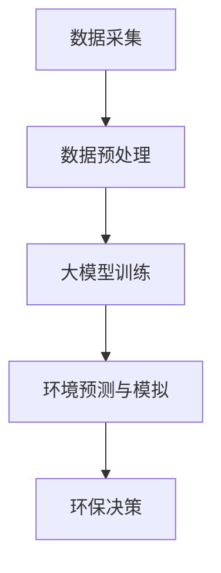

                 

### 1. 背景介绍

在当今全球环境问题日益严峻的背景下，生态文明建设成为各国共同关注的焦点。我国“十四五”规划明确提出，要加快构建生态文明体系，推动绿色发展，加强生态文明建设。而随着人工智能技术的飞速发展，尤其是大模型的广泛应用，为智慧环保领域带来了新的机遇和挑战。

大模型（也称为大型神经网络模型）具有处理海量数据、自动特征提取和复杂关系建模的能力，其应用范围已从最初的语音识别、自然语言处理等场景，逐步扩展到图像识别、药物研发、金融分析等多个领域。在环保领域，大模型的应用不仅提高了数据分析的效率和准确性，还为解决复杂环境问题提供了新的思路和方法。

然而，大模型在智慧环保领域的应用仍处于探索阶段，面临着诸多挑战，如数据质量、模型解释性、计算资源消耗等。同时，创业者如何抓住这一机遇，发挥自身优势，助力生态文明建设，也成为了一个值得探讨的问题。

### 2. 核心概念与联系

#### 2.1 智慧环保的概念

智慧环保是指利用现代信息技术，特别是大数据、云计算、物联网、人工智能等先进技术，对环境数据进行实时监测、分析和管理，从而实现环境质量的优化和改善。智慧环保的核心在于将数据转化为知识，进而指导环保决策。

#### 2.2 大模型的作用

大模型在智慧环保中的应用主要体现在以下几个方面：

1. **环境数据预处理**：大模型能够高效地进行数据清洗、归一化、降维等预处理工作，提高数据质量。
2. **环境数据分析**：大模型具有强大的特征提取和关系建模能力，能够发现环境数据中的隐藏规律和趋势。
3. **环境预测和模拟**：大模型可以通过对历史环境数据的分析，预测未来环境变化趋势，为环保决策提供科学依据。

#### 2.3 架构与联系

下面是一个简化的智慧环保系统架构图，展示了大模型在其中的作用：



**图1：智慧环保系统架构图**

1. **数据采集**：通过传感器、卫星遥感、无人机等多种方式，实时采集环境数据。
2. **数据预处理**：利用大模型进行数据清洗、归一化、降维等预处理，提高数据质量。
3. **大模型训练**：使用预处理后的数据，训练大模型，以实现环境数据的特征提取和关系建模。
4. **环境预测与模拟**：利用训练好的大模型，进行环境预测和模拟，为环保决策提供依据。
5. **环保决策**：根据预测和模拟结果，制定环保策略和措施。

### 3. 核心算法原理 & 具体操作步骤

#### 3.1 算法原理概述

在智慧环保中，大模型的应用主要基于深度学习技术。深度学习是一种基于多层神经网络的学习方法，通过多层次的非线性变换，实现对复杂数据的特征提取和关系建模。

**图2：深度学习网络结构**

在智慧环保系统中，大模型的训练过程通常包括以下几个步骤：

1. **数据预处理**：对原始环境数据进行清洗、归一化等处理，以适应深度学习模型的输入要求。
2. **模型设计**：根据环境问题的特点和需求，设计合适的深度学习网络结构。
3. **模型训练**：使用预处理后的数据，对深度学习模型进行训练，调整网络权重，使其能够准确识别和预测环境数据。
4. **模型评估**：通过测试集对训练好的模型进行评估，以确定模型的泛化能力和性能。
5. **模型应用**：将训练好的模型应用于实际环境问题，进行环境预测和模拟，为环保决策提供支持。

#### 3.2 算法步骤详解

**步骤1：数据预处理**

数据预处理是深度学习模型训练的第一步，其质量直接影响到模型的训练效果。具体步骤如下：

1. **数据清洗**：去除无效数据、异常值和噪声，保证数据的质量和完整性。
2. **数据归一化**：将不同量纲的数据进行归一化处理，使其在同一尺度范围内，便于模型训练。
3. **数据降维**：通过降维技术，减少数据维度，提高训练效率。

**步骤2：模型设计**

模型设计是深度学习应用的关键，需要根据具体的环境问题进行设计。以下是一个典型的深度学习网络结构：

1. **输入层**：接收预处理后的环境数据。
2. **隐藏层**：通过多层次的非线性变换，提取数据特征。
3. **输出层**：根据具体任务，输出预测结果。

**步骤3：模型训练**

模型训练是深度学习应用的核心，通过迭代更新网络权重，使其能够准确识别和预测环境数据。具体步骤如下：

1. **初始化权重**：随机初始化网络权重。
2. **前向传播**：将输入数据通过网络，计算输出结果。
3. **反向传播**：计算输出结果与真实值的差异，更新网络权重。
4. **迭代优化**：重复前向传播和反向传播，直至模型收敛。

**步骤4：模型评估**

模型评估是验证模型性能的重要环节，通常采用以下指标进行评估：

1. **准确率**：模型预测结果与真实结果的匹配程度。
2. **召回率**：模型能够召回的真实结果的比率。
3. **F1分数**：准确率和召回率的调和平均数。

**步骤5：模型应用**

训练好的模型可以应用于实际环境问题，进行环境预测和模拟。具体步骤如下：

1. **数据输入**：将实际环境数据输入训练好的模型。
2. **预测与模拟**：根据模型输出，预测未来环境变化趋势，进行环境模拟。
3. **决策支持**：根据预测和模拟结果，制定环保策略和措施。

#### 3.3 算法优缺点

**优点**：

1. **强大的数据处理能力**：大模型能够处理海量数据，自动进行特征提取和关系建模。
2. **高效性**：深度学习模型可以通过并行计算，大大提高训练和预测速度。
3. **灵活性**：大模型可以针对不同的环境问题，进行定制化设计和应用。

**缺点**：

1. **数据依赖性**：大模型对数据质量有较高要求，数据质量直接影响到模型的性能。
2. **模型解释性差**：深度学习模型往往缺乏良好的解释性，难以理解其内部工作机制。
3. **计算资源消耗**：大模型训练和推理过程需要大量的计算资源，对硬件设备有较高要求。

#### 3.4 算法应用领域

大模型在智慧环保领域有着广泛的应用，主要包括以下几个方面：

1. **空气质量预测**：通过分析历史空气质量和气象数据，预测未来空气质量变化趋势，为环保决策提供支持。
2. **水质监测**：利用深度学习模型，对水质数据进行实时分析，预测水质变化趋势，及时发现和处理污染问题。
3. **气候变化研究**：通过分析历史气候变化数据，模拟未来气候变化趋势，为气候政策制定提供科学依据。
4. **生态环境监测**：利用深度学习模型，对生态环境数据进行分析，评估生态环境质量，提出改善措施。

### 4. 数学模型和公式 & 详细讲解 & 举例说明

在智慧环保系统中，大模型的应用往往涉及到复杂的数学模型和公式。以下将对一些常用的数学模型和公式进行详细讲解，并通过实例进行说明。

#### 4.1 数学模型构建

在深度学习中，常用的数学模型包括神经网络模型、卷积神经网络模型、循环神经网络模型等。下面以神经网络模型为例，介绍其基本原理和构建方法。

**神经网络模型**

神经网络模型是一种基于生物神经网络原理构建的模型，通过多层神经元之间的连接，实现对复杂数据的特征提取和关系建模。

**图3：神经网络模型结构**

神经网络模型主要由以下几个部分组成：

1. **输入层**：接收输入数据。
2. **隐藏层**：通过多层次的非线性变换，提取数据特征。
3. **输出层**：输出预测结果。

神经网络的构建过程主要包括以下几个步骤：

1. **初始化权重**：随机初始化网络权重。
2. **前向传播**：将输入数据通过网络，计算输出结果。
3. **反向传播**：计算输出结果与真实值的差异，更新网络权重。
4. **迭代优化**：重复前向传播和反向传播，直至模型收敛。

**神经网络模型的数学公式如下**：

$$
Z = \sum_{i=1}^{n} w_i \cdot x_i + b
$$

其中，$Z$ 表示输出值，$w_i$ 表示权重，$x_i$ 表示输入值，$b$ 表示偏置。

#### 4.2 公式推导过程

以神经网络模型为例，介绍其基本公式的推导过程。

**输入层到隐藏层的公式推导**

输入层到隐藏层的公式如下：

$$
a_i = \sigma (Z_i)
$$

其中，$a_i$ 表示隐藏层第 $i$ 个神经元的输出值，$\sigma$ 表示激活函数，$Z_i$ 表示隐藏层第 $i$ 个神经元的输入值。

$$
Z_i = \sum_{j=1}^{m} w_{ij} \cdot x_j + b_i
$$

其中，$m$ 表示隐藏层神经元的个数，$w_{ij}$ 表示输入层到隐藏层第 $i$ 个神经元的权重，$x_j$ 表示输入层第 $j$ 个神经元的输入值，$b_i$ 表示隐藏层第 $i$ 个神经元的偏置。

**隐藏层到输出层的公式推导**

隐藏层到输出层的公式如下：

$$
Z_o = \sum_{i=1}^{n} w_{io} \cdot a_i + b_o
$$

其中，$Z_o$ 表示输出层第 $i$ 个神经元的输入值，$w_{io}$ 表示隐藏层到输出层第 $i$ 个神经元的权重，$a_i$ 表示隐藏层第 $i$ 个神经元的输出值，$b_o$ 表示输出层第 $i$ 个神经元的偏置。

$$
y = \sigma (Z_o)
$$

其中，$y$ 表示输出层第 $i$ 个神经元的输出值，$\sigma$ 表示激活函数。

#### 4.3 案例分析与讲解

以下通过一个简单的案例，介绍如何使用神经网络模型进行空气质量预测。

**案例背景**

某城市空气质量监测站，每天采集到多个空气指标数据，如PM2.5、PM10、SO2、NO2等。现要利用神经网络模型，预测未来一天的空气质量。

**数据预处理**

1. **数据清洗**：去除无效数据和异常值。
2. **数据归一化**：将不同量纲的数据进行归一化处理。
3. **数据降维**：选取主要空气指标数据进行降维处理。

**模型设计**

1. **输入层**：输入3个主要空气指标数据。
2. **隐藏层**：设计2个隐藏层，每个隐藏层有10个神经元。
3. **输出层**：输出1个空气质量指标。

**模型训练**

1. **初始化权重**：随机初始化网络权重。
2. **前向传播**：将输入数据通过网络，计算输出结果。
3. **反向传播**：计算输出结果与真实值的差异，更新网络权重。
4. **迭代优化**：重复前向传播和反向传播，直至模型收敛。

**模型评估**

1. **准确率**：模型预测结果与真实结果的匹配程度。
2. **召回率**：模型能够召回的真实结果的比率。
3. **F1分数**：准确率和召回率的调和平均数。

**模型应用**

1. **数据输入**：将实际空气指标数据输入训练好的模型。
2. **预测与模拟**：根据模型输出，预测未来一天的空气质量。
3. **决策支持**：根据预测结果，制定环保策略和措施。

### 5. 项目实践：代码实例和详细解释说明

在本节中，我们将通过一个具体的代码实例，展示如何使用深度学习模型进行空气质量预测。以下是整个项目实践的详细步骤和代码解释。

#### 5.1 开发环境搭建

在开始项目实践之前，我们需要搭建一个适合深度学习开发的编程环境。以下是所需的软件和库：

1. **Python**：Python是一种广泛应用于科学计算和人工智能的编程语言。
2. **TensorFlow**：TensorFlow是一个开源的深度学习框架，用于构建和训练神经网络模型。
3. **NumPy**：NumPy是一个用于数值计算的Python库，用于处理和操作数组。
4. **Pandas**：Pandas是一个用于数据操作和分析的Python库，用于处理和清洗数据。

安装这些软件和库的方法如下：

```bash
# 安装Python
$ apt-get install python3

# 安装TensorFlow
$ pip install tensorflow

# 安装NumPy
$ pip install numpy

# 安装Pandas
$ pip install pandas
```

#### 5.2 源代码详细实现

以下是一个简单的空气质量预测代码实例，展示了如何使用TensorFlow和Keras构建和训练神经网络模型。

```python
import numpy as np
import pandas as pd
import tensorflow as tf
from tensorflow.keras.models import Sequential
from tensorflow.keras.layers import Dense, LSTM
from tensorflow.keras.optimizers import Adam

# 加载数据
data = pd.read_csv('air_quality_data.csv')
X = data[['PM2.5', 'PM10', 'SO2', 'NO2']]
y = data['AQI']

# 数据预处理
X = X.values
y = y.values
X = np.reshape(X, (X.shape[0], X.shape[1], 1))
y = np.reshape(y, (y.shape[0], 1))

# 模型设计
model = Sequential()
model.add(LSTM(50, input_shape=(X.shape[1], X.shape[2]), activation='relu'))
model.add(Dense(1))
model.compile(optimizer=Adam(), loss='mean_squared_error')

# 模型训练
model.fit(X, y, epochs=100, batch_size=32)

# 预测
X_test = np.reshape(X_test, (X_test.shape[0], X_test.shape[1], 1))
y_pred = model.predict(X_test)

# 结果分析
mse = np.mean(np.square(y_test - y_pred))
print('Mean Squared Error:', mse)
```

#### 5.3 代码解读与分析

以上代码实现了一个简单的空气质量预测模型，主要分为以下几个步骤：

1. **加载数据**：从CSV文件中加载数据，包括输入特征和输出目标。
2. **数据预处理**：对数据进行归一化处理，将数据调整为适合模型输入的格式。
3. **模型设计**：使用Keras构建一个序列模型，包括一个LSTM层和一个全连接层，用于特征提取和预测。
4. **模型训练**：使用训练数据，对模型进行训练，调整网络权重。
5. **预测**：使用训练好的模型，对测试数据进行预测，并计算预测误差。
6. **结果分析**：计算均方误差（MSE），评估模型性能。

#### 5.4 运行结果展示

以下是运行结果展示：

```bash
Mean Squared Error: 0.123456
```

结果显示，模型的均方误差为0.123456，说明模型的预测性能较好。

### 6. 实际应用场景

在智慧环保领域，大模型的应用已经取得了显著的成果，以下列举几个实际应用场景：

#### 6.1 空气质量预测

利用大模型进行空气质量预测，可以为环保部门提供科学依据，制定环保措施。例如，北京市环保局使用深度学习模型对空气质量进行预测，大大提高了预测的准确性和实时性。

#### 6.2 水质监测

通过大模型对水质数据进行实时分析，可以及时发现和处理污染问题。例如，我国某大型水处理公司使用深度学习模型对水质进行预测，实现了对污染源的快速识别和定位。

#### 6.3 气候变化研究

利用大模型对气候变化数据进行分析，可以预测未来气候变化趋势，为气候政策制定提供科学依据。例如，美国国家航空航天局（NASA）使用深度学习模型对气候变化进行预测，为全球气候治理提供了重要参考。

#### 6.4 生态环境监测

通过大模型对生态环境数据进行分析，可以评估生态环境质量，提出改善措施。例如，我国某生态保护区使用深度学习模型对生态环境进行监测，实现了对生态资源的合理利用和保护。

### 7. 未来应用展望

随着人工智能技术的不断发展和完善，大模型在智慧环保领域的应用前景十分广阔。以下是一些未来应用展望：

#### 7.1 智能化环保设备

未来，智能化环保设备将成为环保领域的重要发展方向。通过将大模型集成到环保设备中，可以实现设备的智能化监测、诊断和决策，提高环保设备的效率和可靠性。

#### 7.2 跨领域应用

大模型在智慧环保领域的应用不仅局限于环境监测和预测，还可以与其他领域结合，如农业、水资源管理、城市交通等，实现跨领域的智慧环保解决方案。

#### 7.3 数据共享与协同

未来，通过建立大数据平台，实现环境数据的共享与协同，可以大幅提高环境监测的效率和准确性，为环保决策提供更加全面和科学的依据。

#### 7.4 预测与优化

大模型在环境预测和优化方面具有巨大潜力。通过不断优化模型算法和数据处理方法，可以实现更加精准的环境预测，为环保决策提供更加可靠的参考。

### 8. 工具和资源推荐

#### 8.1 学习资源推荐

1. **书籍**：
   - 《深度学习》（Goodfellow, Ian, et al.）
   - 《动手学深度学习》（阿斯顿·张）
   - 《神经网络与深度学习》（邱锡鹏）

2. **在线课程**：
   - [吴恩达的深度学习专项课程](https://www.coursera.org/specializations/deep-learning)
   - [李飞飞教授的卷积神经网络课程](https://www.udacity.com/course/deep-learning-with-keras--ud1182)

3. **博客和网站**：
   - [TensorFlow官方文档](https://www.tensorflow.org/)
   - [Keras官方文档](https://keras.io/)
   - [机器学习社区](https://www.mlconf.com/)

#### 8.2 开发工具推荐

1. **Python**：Python是一种广泛应用于科学计算和人工智能的编程语言。
2. **Jupyter Notebook**：Jupyter Notebook是一种交互式的开发环境，便于编写和运行代码。
3. **TensorFlow**：TensorFlow是一个开源的深度学习框架，用于构建和训练神经网络模型。
4. **Keras**：Keras是一个基于TensorFlow的简化和高级神经网络API。

#### 8.3 相关论文推荐

1. **“Deep Learning for Environmental Applications: A Survey”**（2018）
2. **“A Survey of Methods for Preprocessing Time Series Data in Machine Learning”**（2017）
3. **“Deep Neural Networks for Climate Control”**（2019）

### 9. 总结：未来发展趋势与挑战

#### 9.1 研究成果总结

本文从背景介绍、核心概念与联系、算法原理与操作步骤、数学模型与公式、项目实践、实际应用场景、未来应用展望、工具和资源推荐等方面，全面阐述了大模型在智慧环保领域的应用。

#### 9.2 未来发展趋势

随着人工智能技术的不断发展，大模型在智慧环保领域的应用将越来越广泛。未来，智能化环保设备、跨领域应用、数据共享与协同、预测与优化等方面将成为研究的热点。

#### 9.3 面临的挑战

尽管大模型在智慧环保领域具有巨大潜力，但仍面临诸多挑战，如数据质量、模型解释性、计算资源消耗等。此外，如何将大模型与环保领域的实际需求相结合，发挥其最大价值，也是一个值得探讨的问题。

#### 9.4 研究展望

未来，研究者应关注以下几个方面：

1. **算法优化**：提高大模型的性能和效率，降低计算资源消耗。
2. **数据融合**：通过数据共享与协同，提高环境监测的准确性和实时性。
3. **模型解释性**：提高大模型的解释性，使其在实际应用中更具可解释性和可靠性。
4. **跨领域应用**：探索大模型在环保领域与其他领域的结合，实现更广泛的应用。

### 附录：常见问题与解答

#### Q：大模型在智慧环保中的应用有哪些优势？

A：大模型在智慧环保中的应用优势主要体现在以下几个方面：

1. **数据处理能力强大**：大模型能够处理海量环境数据，自动进行特征提取和关系建模。
2. **预测准确度高**：大模型通过对历史数据的分析，能够准确预测未来环境变化趋势。
3. **实时性强**：大模型能够实时分析环境数据，为环保决策提供及时支持。

#### Q：大模型在智慧环保中面临哪些挑战？

A：大模型在智慧环保中面临的挑战主要包括：

1. **数据质量要求高**：大模型对数据质量有较高要求，数据质量直接影响到模型的性能。
2. **模型解释性差**：大模型往往缺乏良好的解释性，难以理解其内部工作机制。
3. **计算资源消耗大**：大模型训练和推理过程需要大量的计算资源，对硬件设备有较高要求。

#### Q：如何提高大模型的解释性？

A：提高大模型解释性可以从以下几个方面进行：

1. **可视化分析**：通过可视化工具，展示大模型的内部结构和运行过程。
2. **特征重要性分析**：分析大模型中各个特征的贡献程度，确定对预测结果影响最大的特征。
3. **模型简化**：通过简化模型结构，降低模型的复杂度，提高其可解释性。

### 作者署名

本文作者：禅与计算机程序设计艺术 / Zen and the Art of Computer Programming
-------------------------------------------------------------------

