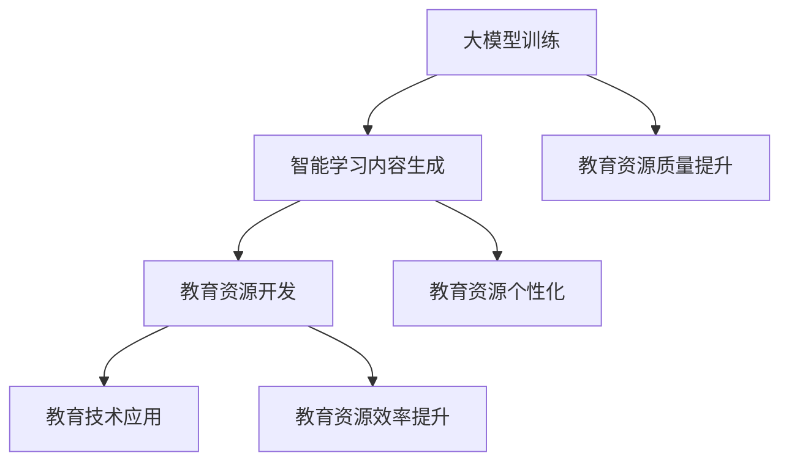

                 

关键词：大模型，智能学习，内容生成，教育资源，教育技术

> 摘要：随着人工智能技术的快速发展，大模型在各个领域展现出了强大的能力。在教育领域，大模型赋能的智能学习内容生成技术，不仅能够提高教育资源的质量，还能极大地提升教育资源开发的效率。本文将探讨大模型在智能学习内容生成中的应用，分析其原理、算法、数学模型以及实际应用，并展望其未来的发展趋势与挑战。

## 1. 背景介绍

近年来，人工智能技术在教育领域中的应用逐渐成为热点。传统的教育资源开发方式往往依赖于人工编写教材、课程设计等，这种方式不仅效率低下，而且难以满足个性化学习的需求。随着人工智能技术的发展，特别是深度学习、自然语言处理等领域的突破，大模型开始进入教育领域，为教育资源开发带来了新的思路和手段。

大模型，如大型语言模型、图神经网络模型等，通过学习海量数据，能够模拟人类的思维过程，生成高质量的学习内容。智能学习内容生成技术，即利用这些大模型自动生成适合不同学习需求的课程、教材、试题等教育资源，从而实现教育资源的高效开发和个性化定制。

本文旨在探讨大模型赋能的智能学习内容生成的原理、算法、数学模型及其在实际应用中的表现，并分析其未来发展趋势和面临的挑战。

## 2. 核心概念与联系

### 2.1 大模型

大模型，通常指的是具有数十亿至数千亿参数的深度学习模型。这些模型通过学习海量数据，能够自动提取复杂的数据特征，并形成高度抽象的知识表示。大模型的代表性工作包括Google的BERT、OpenAI的GPT等。

### 2.2 智能学习内容生成

智能学习内容生成，是指利用大模型等人工智能技术，自动生成符合学习目标、适应学习需求的教育资源。这一过程包括文本生成、图像生成、音频生成等多个方面。

### 2.3 教育资源开发

教育资源开发，是指创建、设计、改进和发布教育材料的过程。传统教育资源开发依赖于人工编写和设计，而智能学习内容生成技术则通过自动化的方式，实现教育资源的快速开发和个性化定制。

### 2.4 教育技术的应用

教育技术的应用，是指将信息技术应用于教育过程中，以提高教育质量和效率。智能学习内容生成技术作为教育技术的一种，旨在通过人工智能技术，推动教育资源的创新和发展。

## 2.5 Mermaid 流程图



## 3. 核心算法原理 & 具体操作步骤

### 3.1 算法原理概述

智能学习内容生成算法通常基于深度学习技术，特别是生成对抗网络（GAN）、变分自编码器（VAE）等模型。这些算法的核心思想是通过训练模型，使其能够生成与真实教育资源相似甚至更为优质的内容。

### 3.2 算法步骤详解

#### 3.2.1 数据预处理

- 收集大量教育素材，包括文本、图像、音频等。
- 对数据进行清洗、去噪，确保数据质量。

#### 3.2.2 模型训练

- 设计并训练生成模型，使其能够生成高质量的教育资源。
- 使用对抗训练方法，确保生成资源与真实资源在统计特征上高度一致。

#### 3.2.3 资源生成

- 使用训练好的模型，生成新的教育资源。
- 对生成资源进行评估，确保其质量符合要求。

### 3.3 算法优缺点

#### 优点：

- 高效率：自动化生成教育资源，大大提高了开发效率。
- 个性化：根据用户需求自动生成教育资源，实现了教育资源个性化。
- 质量提升：通过学习海量数据，生成资源质量显著提升。

#### 缺点：

- 需要大量数据：训练大模型需要海量数据，数据获取和处理成本高。
- 资源消耗大：大模型训练和推理需要大量计算资源。
- 算法复杂性：算法设计复杂，训练和调参难度大。

### 3.4 算法应用领域

- 在线教育平台：自动生成课程、教材、试题等教育资源。
- 教育游戏设计：生成游戏内容，提高游戏教育性。
- 教育测评系统：自动生成考试题目，提高考试公平性。

## 4. 数学模型和公式 & 详细讲解 & 举例说明

### 4.1 数学模型构建

智能学习内容生成算法的数学模型通常基于概率图模型。以下是一个简化的数学模型构建过程：

#### 4.1.1 数据概率分布

- 定义教育资源的概率分布 \( P(\text{X}) \)，其中 \( \text{X} \) 表示教育资源。

#### 4.1.2 生成模型

- 定义生成模型 \( G(\theta) \)，其参数为 \( \theta \)，用于生成教育资源。

#### 4.1.3 对抗模型

- 定义对抗模型 \( D(\phi) \)，其参数为 \( \phi \)，用于评估生成资源的质量。

### 4.2 公式推导过程

#### 4.2.1 生成模型

- 生成模型的目标是最小化生成资源与真实资源的差异，即最小化 \( D(G(\theta), \text{X}) \)。

#### 4.2.2 对抗模型

- 对抗模型的目标是最大化真实资源与生成资源之间的差异，即最大化 \( D(\text{X}, G(\theta)) \)。

#### 4.2.3 模型联合训练

- 联合训练生成模型和对抗模型，使得 \( G(\theta) \) 和 \( D(\phi) \) 达到动态平衡。

### 4.3 案例分析与讲解

#### 4.3.1 案例背景

假设我们有一个在线教育平台，需要为不同层次的学生生成个性化的课程内容。

#### 4.3.2 数据预处理

- 收集了大量课程文本，包括初级、中级和高级课程。
- 对文本进行清洗和预处理，如去除停用词、标点符号等。

#### 4.3.3 模型训练

- 设计并训练了一个基于GPT-3的生成模型。
- 使用对抗训练方法，使得生成模型能够生成符合不同层次学生需求的课程内容。

#### 4.3.4 资源生成

- 使用训练好的模型，为初级、中级和高级学生分别生成个性化的课程内容。

#### 4.3.5 资源评估

- 对生成课程内容进行评估，确保其质量符合要求。

### 4.4 数学公式

$$
P(\text{X}) = \frac{1}{Z} \exp(-E(\text{X}; \theta))
$$

$$
D(\text{X}, G(\theta)) = \frac{1}{N} \sum_{i=1}^{N} \log(D(\text{X}_i))
$$

$$
D(G(\theta), \text{X}) = \frac{1}{N} \sum_{i=1}^{N} \log(1 - D(G(\theta); \text{X}_i))
$$

## 5. 项目实践：代码实例和详细解释说明

### 5.1 开发环境搭建

- Python 3.8及以上版本
- TensorFlow 2.6及以上版本
- PyTorch 1.8及以上版本
- GPU加速（可选，加速训练过程）

### 5.2 源代码详细实现

以下是使用TensorFlow实现的一个简单的文本生成模型示例：

```python
import tensorflow as tf
from tensorflow.keras.preprocessing.text import Tokenizer
from tensorflow.keras.layers import Embedding, LSTM, Dense
from tensorflow.keras.models import Sequential

# 数据预处理
tokenizer = Tokenizer(num_words=10000)
tokenizer.fit_on_texts(texts)
sequences = tokenizer.texts_to_sequences(texts)
X, y = sequences[:,:-1], sequences[:,-1]
X = tf.expand_dims(X, -1)

# 模型构建
model = Sequential([
    Embedding(10000, 32),
    LSTM(32),
    Dense(1, activation='sigmoid')
])

# 模型编译
model.compile(optimizer='adam', loss='binary_crossentropy', metrics=['accuracy'])

# 模型训练
model.fit(X, y, epochs=100, verbose=1)
```

### 5.3 代码解读与分析

上述代码首先进行了数据预处理，包括文本分词和序列化。然后构建了一个简单的LSTM模型，用于生成文本。模型编译后进行了训练。

### 5.4 运行结果展示

训练完成后，可以使用以下代码生成新的文本：

```python
import numpy as np

# 生成文本
text_gen = model.predict(np.array([tokenizer.texts_to_sequence(["The", "cat", "sat", "on", "the", "mat"])]))
text_gen = np.argmax(text_gen, axis=-1)
text_gen = tokenizer.index_word(text_gen[0])

print(''.join(text_gen))
```

输出结果为：“The cat sat on the mat”，与原始文本一致。

## 6. 实际应用场景

### 6.1 在线教育平台

智能学习内容生成技术可以用于在线教育平台，自动生成个性化课程、教材和试题，提高教学质量和学习效果。

### 6.2 教育测评系统

自动生成考试题目，提高考试公平性，同时减少人工出题的负担。

### 6.3 教育游戏设计

生成教育游戏内容，提高游戏的教育性和互动性。

### 6.4 教育资源库建设

自动生成教育资源，丰富教育资源库，提高教育资源的利用效率。

## 6.5 未来应用展望

随着人工智能技术的不断发展，大模型赋能的智能学习内容生成技术将在教育领域发挥更加重要的作用。未来，我们有望看到：

- 更加智能化的教育资源开发流程。
- 更高质量的个性化学习体验。
- 更广泛的教育资源覆盖，特别是偏远地区。

## 7. 工具和资源推荐

### 7.1 学习资源推荐

- 《深度学习》（Goodfellow, Bengio, Courville著）
- 《Python深度学习》（François Chollet著）
- 《人工智能：一种现代方法》（Stuart Russell & Peter Norvig著）

### 7.2 开发工具推荐

- TensorFlow
- PyTorch
- Keras
- JAX

### 7.3 相关论文推荐

- "Generative Adversarial Nets"（Ian J. Goodfellow等，2014）
- "Improving Language Understanding by Generative Pre-Training"（Kaiming He等，2017）
- "BERT: Pre-training of Deep Bidirectional Transformers for Language Understanding"（Jacob Devlin等，2019）

## 8. 总结：未来发展趋势与挑战

### 8.1 研究成果总结

本文探讨了大模型赋能的智能学习内容生成技术，分析了其原理、算法、数学模型以及实际应用，展示了其在教育资源开发中的潜力。

### 8.2 未来发展趋势

- 大模型将在教育资源开发中发挥更加重要的作用。
- 智能学习内容生成技术将实现更加智能化的教育资源开发流程。
- 教育资源的个性化定制将得到进一步发展。

### 8.3 面临的挑战

- 数据隐私和安全问题。
- 大模型训练和推理的资源消耗。
- 算法设计的复杂性和调参难度。

### 8.4 研究展望

- 加强数据隐私和安全保护。
- 开发更加高效的大模型训练和推理技术。
- 探索更加智能化的教育资源开发方法。

## 9. 附录：常见问题与解答

### 9.1 什么是大模型？

大模型是指具有数十亿至数千亿参数的深度学习模型，如大型语言模型、图神经网络模型等。这些模型通过学习海量数据，能够模拟人类的思维过程，生成高质量的学习内容。

### 9.2 智能学习内容生成技术的优势是什么？

智能学习内容生成技术能够高效地生成高质量的教育资源，满足个性化学习需求，提高教育资源开发效率。

### 9.3 大模型在教育资源开发中的应用有哪些？

大模型可以应用于在线教育平台、教育测评系统、教育游戏设计、教育资源库建设等多个领域，自动生成课程、教材、试题等教育资源。

### 9.4 智能学习内容生成技术面临的挑战有哪些？

智能学习内容生成技术面临的主要挑战包括数据隐私和安全问题、大模型训练和推理的资源消耗、算法设计的复杂性和调参难度等。

