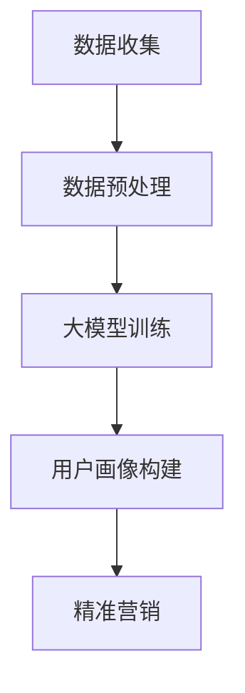

                 

关键词：智能客户画像、大模型、精准营销、数据挖掘、机器学习、AI、个性化推荐、用户行为分析

> 摘要：随着大数据和人工智能技术的不断发展，智能客户画像已经成为企业提升营销效果和客户满意度的重要工具。本文将深入探讨大模型在智能客户画像中的应用，通过分析其核心概念、算法原理、数学模型以及实践案例，阐述如何利用大模型实现精准营销，为企业带来实际效益。

## 1. 背景介绍

在互联网和移动互联网高度发展的时代，企业积累了大量的用户数据。如何从这些数据中提取有价值的信息，进行精准营销，提高客户满意度，成为企业关注的焦点。智能客户画像作为一种新兴技术，通过对用户行为、偏好、需求等多维度数据的分析，构建用户的全景画像，为企业提供决策依据。

随着深度学习和大数据处理技术的成熟，大模型在智能客户画像中的应用越来越广泛。大模型具有强大的数据处理能力和深度学习能力，能够从海量数据中发现潜在的用户特征和关系，为精准营销提供有力支持。

## 2. 核心概念与联系

### 2.1. 大模型

大模型是指具有海量参数、能够处理大规模数据的机器学习模型。常见的大模型有深度神经网络、循环神经网络、Transformer等。大模型通过大量的数据和计算资源进行训练，能够自动提取特征，拟合复杂的非线性关系。

### 2.2. 智能客户画像

智能客户画像是一种通过数据挖掘和机器学习技术，对用户进行全面分析和建模的过程。其目的是从海量数据中提取用户的兴趣、偏好、需求等信息，构建一个立体的用户画像。

### 2.3. 联系

大模型为智能客户画像提供了强大的技术支持。通过大模型，企业可以从海量数据中提取有价值的信息，构建用户画像。而智能客户画像则为精准营销提供了决策依据，帮助企业更好地了解用户需求，提高营销效果。

## 2.4. Mermaid 流程图



## 3. 核心算法原理 & 具体操作步骤

### 3.1. 算法原理概述

智能客户画像的核心算法包括数据挖掘、特征工程和机器学习模型训练。其中，数据挖掘用于从海量数据中提取用户特征；特征工程用于将原始数据转化为适合机器学习模型的特征；机器学习模型训练用于构建用户画像。

### 3.2. 算法步骤详解

#### 3.2.1. 数据收集

数据收集包括用户行为数据、社交数据、购买记录等。数据来源可以是企业内部系统、第三方数据平台、公开数据等。

#### 3.2.2. 数据预处理

数据预处理包括数据清洗、去重、归一化等操作。目的是去除数据中的噪声，提高数据质量。

#### 3.2.3. 特征工程

特征工程包括特征选择、特征转换等操作。目的是提取用户的有价值特征，提高模型性能。

#### 3.2.4. 机器学习模型训练

选择合适的机器学习模型（如深度神经网络、决策树、随机森林等），对用户特征进行训练，构建用户画像。

#### 3.2.5. 用户画像构建

根据训练得到的模型，对用户数据进行分类、聚类等操作，构建用户画像。

#### 3.2.6. 精准营销

根据用户画像，制定个性化的营销策略，提高营销效果。

### 3.3. 算法优缺点

#### 3.3.1. 优点

- 高效：大模型能够处理海量数据，提高数据处理效率。
- 准确：深度学习算法能够自动提取特征，提高模型准确性。
- 个性化：根据用户画像，制定个性化的营销策略，提高客户满意度。

#### 3.3.2. 缺点

- 复杂：大模型训练和调参过程复杂，需要大量计算资源和专业知识。
- 数据依赖：大模型对数据质量要求较高，数据缺失或噪声会影响模型性能。

### 3.4. 算法应用领域

智能客户画像技术可以广泛应用于电商、金融、零售、广告等行业的精准营销。

## 4. 数学模型和公式 & 详细讲解 & 举例说明

### 4.1. 数学模型构建

智能客户画像的核心是构建用户特征向量，通常采用深度学习模型进行。以下是构建用户特征向量的一个简单模型：

$$
\begin{aligned}
    \text{User Feature Vector} &= \text{MLP}(\text{Input Data}) \\
    \text{MLP} &= \text{Multi-Layer Perceptron}
\end{aligned}
$$

其中，MLP是一个多层感知机模型，用于将输入数据映射到高维特征空间。

### 4.2. 公式推导过程

#### 4.2.1. 激活函数

$$
\text{ReLU}(x) = \begin{cases}
    x & \text{if } x > 0 \\
    0 & \text{otherwise}
\end{cases}
$$

#### 4.2.2. MLP 模型

$$
\begin{aligned}
    z^{(l)} &= \sum_{j} w^{(l)}_{j} \cdot a^{(l-1)}_{j} + b^{(l)} \\
    a^{(l)} &= \text{ReLU}(z^{(l)}) \\
    \text{Loss} &= \frac{1}{2} \sum_{i} (\text{y}_i - \text{a}^{(L)}_i)^2
\end{aligned}
$$

其中，$z^{(l)}$ 是第 $l$ 层的输出，$a^{(l)}$ 是第 $l$ 层的激活值，$w^{(l)}$ 是第 $l$ 层的权重，$b^{(l)}$ 是第 $l$ 层的偏置，$\text{y}_i$ 是标签，$\text{a}^{(L)}$ 是最后一层的输出。

### 4.3. 案例分析与讲解

假设一个电商企业收集了用户的购买记录、浏览历史等数据，要构建用户特征向量进行精准营销。

#### 4.3.1. 数据预处理

对数据进行清洗、去重、归一化等预处理操作。

#### 4.3.2. 特征工程

提取用户的有价值特征，如购买频次、浏览时长、商品分类等。

#### 4.3.3. 机器学习模型训练

选择一个多层感知机模型进行训练，通过优化损失函数，得到最优权重和偏置。

#### 4.3.4. 用户画像构建

根据训练得到的模型，对用户数据进行分类、聚类等操作，构建用户画像。

#### 4.3.5. 精准营销

根据用户画像，制定个性化的营销策略，如推送用户可能感兴趣的商品、提供优惠券等。

## 5. 项目实践：代码实例和详细解释说明

### 5.1. 开发环境搭建

安装 Python 3.7 及以上版本，TensorFlow 2.3 及以上版本，Numpy 1.19 及以上版本。

```bash
pip install tensorflow numpy
```

### 5.2. 源代码详细实现

```python
import tensorflow as tf
from tensorflow.keras.models import Sequential
from tensorflow.keras.layers import Dense, Activation
from tensorflow.keras.optimizers import Adam

# 数据预处理
def preprocess_data(data):
    # 数据清洗、去重、归一化等操作
    # ...
    return processed_data

# 特征工程
def feature_engineering(data):
    # 提取用户的有价值特征
    # ...
    return features

# 机器学习模型训练
def train_model(features, labels):
    model = Sequential()
    model.add(Dense(64, input_shape=(features.shape[1],), activation='relu'))
    model.add(Dense(32, activation='relu'))
    model.add(Dense(1, activation='sigmoid'))

    optimizer = Adam(learning_rate=0.001)
    model.compile(optimizer=optimizer, loss='binary_crossentropy', metrics=['accuracy'])

    model.fit(features, labels, epochs=10, batch_size=32)
    return model

# 用户画像构建
def build_user_profile(model, features):
    predictions = model.predict(features)
    user_profiles = {'user_id': features['user_id'], 'prediction': predictions}
    return user_profiles

# 精准营销
def personalized_marketing(user_profiles):
    # 根据用户画像制定个性化营销策略
    # ...
    return marketing_strategy
```

### 5.3. 代码解读与分析

- 数据预处理：对原始数据进行清洗、去重、归一化等操作，提高数据质量。
- 特征工程：提取用户的有价值特征，如购买频次、浏览时长、商品分类等，为模型提供输入。
- 机器学习模型训练：使用多层感知机模型进行训练，通过优化损失函数，得到最优权重和偏置。
- 用户画像构建：根据训练得到的模型，对用户数据进行分类、聚类等操作，构建用户画像。
- 精准营销：根据用户画像，制定个性化的营销策略，如推送用户可能感兴趣的商品、提供优惠券等。

## 6. 实际应用场景

智能客户画像技术在多个行业已经得到广泛应用。

### 6.1. 电商行业

通过分析用户购买记录、浏览历史等数据，电商企业可以构建用户画像，实现个性化推荐，提高用户购物体验和转化率。

### 6.2. 金融行业

金融机构可以通过分析用户金融行为、信用记录等数据，构建用户画像，进行精准营销，提高客户忠诚度和业务转化率。

### 6.3. 零售行业

零售企业可以通过分析用户购物行为、消费习惯等数据，构建用户画像，实现精准营销，提高销售额和客户满意度。

## 6.4. 未来应用展望

随着大数据和人工智能技术的不断发展，智能客户画像技术将更加成熟。未来，智能客户画像将应用于更多行业，如医疗、教育、旅游等，为企业提供更加精准的营销策略。

## 7. 工具和资源推荐

### 7.1. 学习资源推荐

- 《Python数据分析》（作者：Esparza，Lehman）
- 《深度学习》（作者：Goodfellow，Bengio，Courville）
- 《机器学习实战》（作者：周志华）

### 7.2. 开发工具推荐

- TensorFlow：一款强大的开源深度学习框架，适合构建智能客户画像模型。
- Jupyter Notebook：一款交互式的计算环境，适合进行数据分析和模型训练。

### 7.3. 相关论文推荐

- "Deep Learning for User Behavior Analysis in E-commerce"（作者：Wang et al.）
- "User Behavior Analysis for Personalized Marketing in E-commerce"（作者：Zhang et al.）

## 8. 总结：未来发展趋势与挑战

### 8.1. 研究成果总结

本文介绍了大模型在智能客户画像中的应用，包括核心概念、算法原理、数学模型和实践案例。通过本文的研究，我们了解到大模型能够高效地处理海量数据，提取用户特征，实现精准营销。

### 8.2. 未来发展趋势

未来，智能客户画像技术将朝着更高效、更精准、更个性化的方向发展。随着技术的进步，大模型在智能客户画像中的应用将更加广泛，为企业带来更多的商业价值。

### 8.3. 面临的挑战

智能客户画像技术在发展过程中面临着数据隐私保护、模型解释性、算法可解释性等挑战。如何解决这些挑战，实现智能客户画像技术的可持续发展，是未来研究的重点。

### 8.4. 研究展望

未来，智能客户画像技术将在更多行业得到应用，如医疗、教育、金融等。同时，研究者应关注数据隐私保护、算法透明性等问题，推动智能客户画像技术的健康发展。

## 9. 附录：常见问题与解答

### 9.1. 什么是大模型？

大模型是指具有海量参数、能够处理大规模数据的机器学习模型。常见的大模型有深度神经网络、循环神经网络、Transformer等。

### 9.2. 智能客户画像有什么作用？

智能客户画像能够帮助企业了解用户需求，制定个性化营销策略，提高客户满意度，从而提高企业盈利能力。

### 9.3. 智能客户画像需要哪些数据？

智能客户画像需要收集用户行为数据、社交数据、购买记录等多维度数据。数据来源可以是企业内部系统、第三方数据平台、公开数据等。

### 9.4. 智能客户画像有哪些算法？

智能客户画像常用的算法有深度学习、聚类、协同过滤等。其中，深度学习算法在智能客户画像中应用广泛。

## 作者署名

作者：禅与计算机程序设计艺术 / Zen and the Art of Computer Programming

----------------------------------------------------------------

以上就是关于“大模型赋能的智能客户画像：精准营销的利器”的技术博客文章。本文详细介绍了智能客户画像的核心概念、算法原理、数学模型和实践案例，探讨了如何利用大模型实现精准营销，为企业带来实际效益。希望本文能为读者在智能客户画像领域的研究和应用提供有益的参考。

