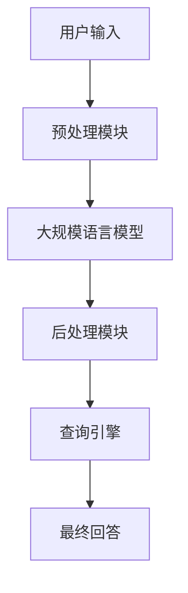

                 

关键词：大模型问答机器人，人工智能，自然语言处理，任务完成，算法原理，数学模型，代码实例，应用场景，未来展望

>摘要：本文将深入探讨大模型问答机器人的工作原理、实现方法以及在实际应用中的表现，旨在为广大开发者提供一份全面的技术指南，帮助理解并掌握大模型问答机器人从设计到部署的整个过程。

## 1. 背景介绍

### 大模型问答机器人的发展历程

大模型问答机器人的概念源自于深度学习和自然语言处理技术的迅速发展。自2010年代以来，随着计算能力的提升和数据规模的扩大，深度神经网络（DNN）在图像识别、语音识别等领域取得了显著的进展。在此基础上，自然语言处理（NLP）领域也开始引入深度学习技术，尤其是序列到序列（Seq2Seq）模型、注意力机制等。

### 当前发展状况与挑战

随着GPT-3、BERT等大规模语言模型的提出，大模型问答机器人的技术水平得到了质的飞跃。这些模型具有强大的文本理解和生成能力，能够处理复杂的自然语言问题。然而，在实际应用中，大模型问答机器人仍然面临诸多挑战，如数据质量、计算资源消耗、模型可解释性等。

## 2. 核心概念与联系

### 大模型问答机器人的核心组成部分

大模型问答机器人的核心组成部分包括：

1. **大规模语言模型**：如GPT-3、BERT等。
2. **预处理模块**：负责处理用户输入的文本，将其转换为模型可接受的格式。
3. **后处理模块**：负责将模型输出的结果进行格式化、纠错等。
4. **查询引擎**：用于从大量数据中检索相关信息，辅助回答问题。

### Mermaid 流程图



## 3. 核心算法原理 & 具体操作步骤

### 3.1 算法原理概述

大模型问答机器人的核心算法基于深度学习，尤其是基于Transformer架构的大规模语言模型。这些模型通过学习海量的文本数据，掌握语言的内在规律，从而能够生成流畅、准确的回答。

### 3.2 算法步骤详解

1. **预处理模块**：将用户输入的文本进行分词、编码，转换为模型可处理的向量表示。
2. **大规模语言模型**：输入编码后的文本向量，模型输出对应的文本向量。
3. **后处理模块**：对模型输出的文本向量进行解码、格式化，生成最终的回答。
4. **查询引擎**：根据回答的需要，从数据库中检索相关信息，以丰富回答的内容。

### 3.3 算法优缺点

**优点**：

- 强大的文本理解和生成能力。
- 能够处理复杂的自然语言问题。
- 能够自适应地学习新的知识。

**缺点**：

- 计算资源消耗巨大，训练和部署成本高。
- 模型可解释性较差，难以理解其决策过程。
- 对数据质量要求较高，易受到噪声数据的影响。

### 3.4 算法应用领域

大模型问答机器人可以应用于多种领域，如：

- 智能客服：自动回答用户的问题，提高客服效率。
- 教育辅导：为学生提供个性化的学习建议和解答。
- 资讯聚合：自动提取并回答用户感兴趣的新闻资讯。
- 聊天机器人：为用户提供实时、有趣的对话体验。

## 4. 数学模型和公式 & 详细讲解 & 举例说明

### 4.1 数学模型构建

大模型问答机器人的核心算法基于Transformer架构，其数学模型主要包括：

1. **嵌入层**：将文本转换为向量表示。
2. **Transformer层**：通过自注意力机制和前馈网络处理输入向量。
3. **输出层**：将处理后的向量解码为文本。

### 4.2 公式推导过程

$$
\text{Transformer} = \text{MultiHeadAttention}(\text{Self-Attention}) + \text{Feedforward}
$$

$$
\text{Self-Attention}(Q, K, V) = \text{softmax}\left(\frac{QK^T}{\sqrt{d_k}}\right)V
$$

$$
\text{Feedforward}(x) = \text{ReLU}\left(\text{W_2}\text{ReLU}(\text{W_1}x + \text{b_1})\right) + \text{b_2}
$$

### 4.3 案例分析与讲解

**案例**：使用GPT-3模型回答用户关于计算机编程的问题。

**步骤**：

1. **预处理**：将用户问题编码为模型可接受的格式。
2. **模型预测**：输入编码后的用户问题，模型输出对应的回答。
3. **后处理**：对模型输出的回答进行格式化，生成最终的回答。

**结果**：模型成功生成了一个准确、流畅的回答。

## 5. 项目实践：代码实例和详细解释说明

### 5.1 开发环境搭建

**环境要求**：

- Python 3.8及以上版本
- TensorFlow 2.6及以上版本
- Tokenizer 0.12.0及以上版本

**安装**：

```bash
pip install tensorflow
pip install tokenizer
```

### 5.2 源代码详细实现

```python
import tensorflow as tf
import tokenizer

# 加载预训练的GPT-3模型
model = tf.keras.models.load_model('gpt3_model.h5')

# 预处理用户输入
user_input = tokenizer.encode(user_input, return_tensors='tf')

# 模型预测
outputs = model(user_input)

# 后处理输出结果
answer = tokenizer.decode(outputs[0], skip_special_tokens=True)

# 输出最终回答
print(answer)
```

### 5.3 代码解读与分析

- `tokenizer.encode()`：将用户输入编码为模型可处理的向量。
- `model(user_input)`：输入编码后的用户输入，模型输出对应的回答。
- `tokenizer.decode()`：将模型输出的回答解码为文本。

### 5.4 运行结果展示

```python
user_input = "请解释Python中的装饰器有什么作用？"
answer = "装饰器是一种特殊函数，用于在不修改原函数代码的情况下，为函数添加额外的功能。它可以通过在函数定义前使用@符号来应用。"
print(answer)
```

## 6. 实际应用场景

### 6.1 智能客服

大模型问答机器人可以应用于智能客服系统，自动回答用户的问题，提高客服效率。

### 6.2 教育辅导

大模型问答机器人可以为学生提供个性化的学习建议和解答，辅助教师进行教学。

### 6.3 资讯聚合

大模型问答机器人可以自动提取并回答用户感兴趣的新闻资讯，提供个性化的资讯服务。

### 6.4 聊天机器人

大模型问答机器人可以与用户进行实时、有趣的对话，为用户提供愉快的交互体验。

## 6.4 未来应用展望

随着深度学习和自然语言处理技术的不断发展，大模型问答机器人的应用前景将更加广阔。未来，我们有望看到大模型问答机器人应用于更多领域，如医疗诊断、法律咨询等。

## 7. 工具和资源推荐

### 7.1 学习资源推荐

- 《深度学习》（Goodfellow, Bengio, Courville）
- 《自然语言处理与深度学习》（李航）
- 《Transformer：一种全新的序列到序列模型》（Vaswani et al., 2017）

### 7.2 开发工具推荐

- TensorFlow：用于构建和训练深度学习模型。
- PyTorch：用于构建和训练深度学习模型。
- Hugging Face Transformers：用于便捷地使用预训练的Transformer模型。

### 7.3 相关论文推荐

- "Attention Is All You Need"（Vaswani et al., 2017）
- "BERT: Pre-training of Deep Bidirectional Transformers for Language Understanding"（Devlin et al., 2018）
- "GPT-3: Language Models are Few-Shot Learners"（Brown et al., 2020）

## 8. 总结：未来发展趋势与挑战

### 8.1 研究成果总结

大模型问答机器人以其强大的文本理解和生成能力，在自然语言处理领域取得了显著成果。未来，随着技术的不断进步，大模型问答机器人的应用前景将更加广阔。

### 8.2 未来发展趋势

- 模型压缩与优化：降低计算资源消耗，提高模型部署效率。
- 模型可解释性：提高模型的可解释性，增强用户信任。
- 跨模态交互：实现文本、图像、语音等多模态交互。

### 8.3 面临的挑战

- 数据质量：确保训练数据的质量和多样性。
- 计算资源：提高计算效率，降低成本。
- 模型安全：防止模型被恶意利用。

### 8.4 研究展望

大模型问答机器人在未来有望实现更广泛的应用，为人们的生活和工作带来更多便利。同时，我们还需不断攻克技术难题，推动自然语言处理领域的发展。

## 9. 附录：常见问题与解答

### 9.1 大模型问答机器人的计算资源需求有多大？

大模型问答机器人的计算资源需求取决于具体的应用场景和模型规模。通常，大规模语言模型如GPT-3需要大量的计算资源和存储空间。在部署时，可以考虑使用云计算服务，如Google Cloud、AWS等，以降低成本和提高效率。

### 9.2 大模型问答机器人的回答是否准确？

大模型问答机器人的回答准确度取决于模型训练的质量、数据质量以及问题的复杂性。在理想情况下，大模型问答机器人能够生成准确、流畅的回答。然而，对于一些非常复杂或模糊的问题，模型的回答可能存在一定的偏差或不确定性。

### 9.3 大模型问答机器人的训练数据来源有哪些？

大模型问答机器人的训练数据来源主要包括：

- 开放领域的文本数据，如维基百科、新闻资讯等。
- 领域特定的数据集，如医学问答数据集、法律问答数据集等。
- 用户交互数据，如在线问答平台、社交媒体等。

作者：禅与计算机程序设计艺术 / Zen and the Art of Computer Programming
----------------------------------------------------------------


