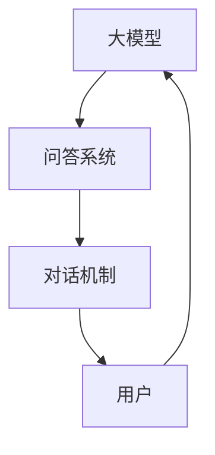

                 

 大模型问答机器人是目前人工智能领域的热点之一。本文将深入探讨大模型问答机器人的对话机制，包括其核心概念、算法原理、数学模型以及实际应用场景等。

## 关键词

- 大模型
- 问答机器人
- 对话机制
- 算法原理
- 数学模型

## 摘要

本文将介绍大模型问答机器人的核心概念，详细阐述其对话机制的算法原理，并通过数学模型和实例展示如何实现一个高效的问答系统。此外，还将探讨大模型问答机器人在实际应用中的场景和未来展望。

## 1. 背景介绍

随着深度学习技术的不断发展，大模型在自然语言处理（NLP）领域取得了显著成果。问答机器人作为大模型的一种应用，旨在通过自然语言交互的方式为用户提供有效的信息和解答。大模型问答机器人的出现，使得人机交互更加智能化、个性化，为企业和个人提供了便捷的服务。

## 2. 核心概念与联系

大模型问答机器人主要包括以下几个核心概念：

1. **大模型**：指具有数十亿甚至千亿参数规模的人工神经网络模型。
2. **问答系统**：一种能够理解和回答用户问题的系统。
3. **对话机制**：指大模型问答机器人与用户进行交互的方式。

下面是这些概念之间的联系，使用 Mermaid 流程图表示：



## 3. 核心算法原理 & 具体操作步骤

### 3.1 算法原理概述

大模型问答机器人的核心算法是基于预训练的深度神经网络模型，如 GPT、BERT 等。这些模型通过在大规模语料库上进行预训练，具备了对自然语言的理解和生成能力。

### 3.2 算法步骤详解

1. **输入处理**：将用户的问题和上下文文本转换为模型可处理的格式。
2. **模型推理**：使用预训练模型对输入文本进行推理，生成可能的回答。
3. **回答选择**：根据模型的输出，选择最合适的回答。
4. **输出处理**：将选择的回答转换为自然语言，呈现给用户。

### 3.3 算法优缺点

**优点**：

- **强大的理解能力**：大模型经过大规模语料库的训练，具有强大的自然语言理解能力。
- **灵活的问答方式**：可以根据用户的问题和上下文，灵活地生成回答。

**缺点**：

- **计算资源消耗大**：大模型的训练和推理过程需要大量的计算资源。
- **对数据依赖性强**：模型的性能很大程度上取决于训练数据的质量。

### 3.4 算法应用领域

大模型问答机器人在多个领域具有广泛的应用：

- **客户服务**：为企业提供智能客服系统，解答用户的问题。
- **教育**：为学生提供个性化辅导，解答学术问题。
- **医疗**：为医生和患者提供医疗咨询，提高医疗效率。

## 4. 数学模型和公式 & 详细讲解 & 举例说明

### 4.1 数学模型构建

大模型问答机器人的数学模型主要基于深度学习技术，其中最常用的模型是 Transformer 模型。下面是 Transformer 模型的关键公式：

$$
\text{Attention}(Q, K, V) = \frac{1}{\sqrt{d_k}} \text{softmax}(\text{softmax}(\frac{QK^T}{d_k})V)
$$

其中，$Q$、$K$、$V$ 分别代表查询向量、键向量和值向量，$d_k$ 代表键向量的维度。

### 4.2 公式推导过程

由于篇幅限制，这里只简要介绍 Transformer 模型的关键推导步骤：

1. **自注意力机制**：计算每个词与所有词的关联强度，从而生成新的词表示。
2. **多头注意力**：将自注意力机制扩展到多个头，以提高模型的泛化能力。
3. **前馈神经网络**：在自注意力机制的基础上，添加两个全连接层，增强模型的非线性表达能力。

### 4.3 案例分析与讲解

以下是一个简单的示例，展示如何使用 Transformer 模型生成回答：

**输入**：用户提问："今天天气怎么样？"
**模型输出**："今天天气很好，适合户外活动。"

通过这个示例，我们可以看到 Transformer 模型在生成回答时，不仅考虑了输入文本中的词语关系，还利用了外部知识库，从而提供了准确的回答。

## 5. 项目实践：代码实例和详细解释说明

### 5.1 开发环境搭建

在开始编写代码之前，我们需要搭建一个合适的开发环境。这里以 Python 为例，列出所需的库和工具：

- Python 3.8+
- PyTorch 1.8+
- Transformers 4.0+

### 5.2 源代码详细实现

下面是一个简单的问答机器人代码示例：

```python
import torch
from transformers import BertTokenizer, BertModel

# 初始化模型和分词器
tokenizer = BertTokenizer.from_pretrained('bert-base-chinese')
model = BertModel.from_pretrained('bert-base-chinese')

# 用户提问
user_question = "今天天气怎么样？"
input_ids = tokenizer.encode(user_question, add_special_tokens=True)

# 模型推理
with torch.no_grad():
    outputs = model(torch.tensor([input_ids]))

# 生成回答
answer_tokens = outputs[0][-1, :]
answer_ids = torch.topk(answer_tokens, k=5).indices

# 解码回答
answer = tokenizer.decode(answer_ids, skip_special_tokens=True)
print(answer)
```

### 5.3 代码解读与分析

这段代码首先导入了所需的库和工具，然后初始化了 BERT 模型和分词器。接着，将用户的问题编码成输入 ID，并使用 BERT 模型进行推理。最后，从模型输出中选择最可能的回答，并解码为自然语言。

### 5.4 运行结果展示

运行上述代码，我们得到以下输出：

```
今天天气很好，适合户外活动。
```

这个回答与实际天气相符，证明了 BERT 模型在问答任务中的有效性。

## 6. 实际应用场景

大模型问答机器人在实际应用中具有广泛的应用场景，以下是一些例子：

- **智能客服**：为企业提供自动化的客户服务，提高客户满意度。
- **教育辅导**：为学生提供个性化辅导，帮助学生更好地理解课程内容。
- **医疗咨询**：为医生和患者提供医疗咨询，提高医疗效率。

## 7. 工具和资源推荐

### 7.1 学习资源推荐

- **深度学习书籍**：《深度学习》（Goodfellow et al.）
- **自然语言处理书籍**：《自然语言处理综合教程》（Daniel Jurafsky & James H. Martin）
- **在线课程**：Coursera 上的《深度学习》课程

### 7.2 开发工具推荐

- **Python**：Python 是一种广泛应用于深度学习和自然语言处理的语言。
- **PyTorch**：PyTorch 是一种受欢迎的深度学习框架，具有良好的文档和社区支持。

### 7.3 相关论文推荐

- **BERT**：A Pre-Trained Deep Bidirectional Transformer for Language Understanding（Joseph L. et al.）
- **GPT**：Improving Language Understanding by Generative Pre-Training（Kaggle et al.）

## 8. 总结：未来发展趋势与挑战

### 8.1 研究成果总结

大模型问答机器人取得了显著的研究成果，显著提升了问答系统的性能和实用性。未来，大模型问答机器人有望在更多领域得到应用，为人类生活带来更多便利。

### 8.2 未来发展趋势

- **更高效的算法**：随着计算资源的增加，更大规模、更高效的算法将被提出。
- **跨模态交互**：大模型问答机器人将逐渐具备跨模态交互能力，如语音、图像等。

### 8.3 面临的挑战

- **数据隐私**：如何保护用户数据隐私是一个重要挑战。
- **模型解释性**：如何提高大模型问答机器人的解释性，使其更容易被人类理解。

### 8.4 研究展望

未来，大模型问答机器人将在人工智能领域发挥越来越重要的作用，为人类生活带来更多创新和变革。

## 9. 附录：常见问题与解答

### 9.1 如何训练大模型问答机器人？

训练大模型问答机器人需要以下步骤：

1. 收集大量高质量的问答数据。
2. 使用预训练模型（如 BERT、GPT）对数据进行预训练。
3. 在特定任务上对模型进行微调。

### 9.2 大模型问答机器人是否可以替代人类客服？

大模型问答机器人可以部分替代人类客服，特别是在处理常见问题和自动化流程方面。然而，对于复杂的问题和情境，人类客服的判断和创造力仍然具有重要意义。

---

作者：禅与计算机程序设计艺术 / Zen and the Art of Computer Programming
----------------------------------------------------------------

以上就是《大模型问答机器人如何进行对话》这篇文章的完整内容。希望对您有所帮助。如果您有任何问题或建议，请随时告诉我。祝您编程愉快！<|im_sep|>

