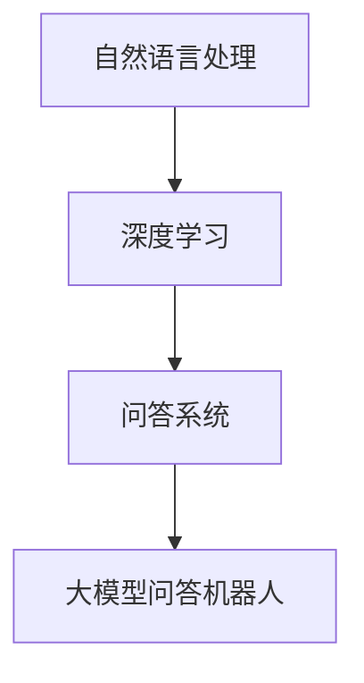

                 

关键词：大模型，问答机器人，任务执行，算法原理，数学模型，项目实践，应用场景，未来展望。

> 摘要：本文将深入探讨大模型问答机器人的任务执行过程，包括其核心概念、算法原理、数学模型、项目实践及未来应用前景。通过详尽的解释和案例分析，旨在为读者提供全面的了解和指导。

## 1. 背景介绍

随着人工智能技术的飞速发展，大模型问答机器人已经成为自然语言处理领域的重要应用。这类机器人通过深度学习技术和海量数据训练，能够实现对自然语言文本的智能理解和回答。它们的广泛应用不仅提升了工作效率，还极大地丰富了人类与机器之间的互动方式。

大模型问答机器人的发展历程可以追溯到上世纪80年代的专家系统。然而，随着数据量的增加和计算能力的提升，深度学习技术的应用使得大模型问答机器人得到了极大的发展和改进。当前，大模型问答机器人已经能够在多个领域，如客服、教育、医疗等，提供高效、精准的问答服务。

## 2. 核心概念与联系

大模型问答机器人的核心概念包括自然语言处理（NLP）、深度学习和问答系统。以下是一个简单的 Mermaid 流程图，展示了这些核心概念之间的关系：



### 2.1 自然语言处理

自然语言处理是人工智能的一个重要分支，它旨在让计算机理解和生成人类语言。NLP 包括词法分析、句法分析、语义分析等多个层次，是构建大模型问答机器人的基础。

### 2.2 深度学习

深度学习是一种基于神经网络的学习方法，它在处理大规模数据时表现出色。大模型问答机器人的训练过程通常依赖于深度学习技术，通过多层神经网络来捕捉数据中的复杂模式和特征。

### 2.3 问答系统

问答系统是一种人机交互的应用，它能够根据用户的提问生成合适的回答。问答系统可以分为基于规则的和基于机器学习的两大类。大模型问答机器人通常采用基于机器学习的方法，通过训练模型来生成回答。

### 2.4 大模型问答机器人

大模型问答机器人是集成了自然语言处理、深度学习和问答系统技术的高级智能系统。它能够处理自然语言文本，理解用户的意图，并生成高质量的回答。

## 3. 核心算法原理 & 具体操作步骤

### 3.1 算法原理概述

大模型问答机器人的核心算法通常是基于转移学习模型的，如BERT（Bidirectional Encoder Representations from Transformers）和GPT（Generative Pre-trained Transformer）。这些模型通过预训练和微调来学习和理解自然语言，从而生成高质量的回答。

### 3.2 算法步骤详解

1. **预训练**：模型在大量的无标注文本上进行预训练，学习语言的基本结构和模式。
2. **微调**：模型使用有标注的问答对进行微调，使其能够针对特定任务进行回答。
3. **回答生成**：模型接收用户提问，生成相应的回答。

### 3.3 算法优缺点

**优点**：
- 高效性：大模型问答机器人能够快速处理大量文本数据。
- 准确性：通过深度学习和转移学习，模型能够生成高质量的回答。

**缺点**：
- 计算成本高：训练大模型需要大量的计算资源和时间。
- 数据依赖性强：模型的性能依赖于训练数据的质量和数量。

### 3.4 算法应用领域

大模型问答机器人可以应用于多个领域，如客服、教育、医疗等。在客服领域，它能够自动回答用户的问题，提高服务效率；在教育领域，它能够为学生提供个性化的学习辅导；在医疗领域，它能够帮助医生诊断疾病。

## 4. 数学模型和公式

### 4.1 数学模型构建

大模型问答机器人的数学模型通常基于转移学习框架。以下是一个简化的模型构建过程：

$$
\text{模型} = \text{BERT} + \text{问答模块}
$$

BERT模型的核心是Transformer架构，它由编码器和解码器组成。编码器用于将输入文本转换为固定长度的向量表示，解码器则用于生成回答。

### 4.2 公式推导过程

BERT模型的训练过程可以简化为以下步骤：

$$
E = \text{BERT}(X) \\
Y = \text{问答模块}(E) \\
L(Y, Z) = \text{损失函数}
$$

其中，$E$ 是编码器输出的向量表示，$Y$ 是问答模块生成的回答，$Z$ 是有标注的答案，$L$ 是损失函数。

### 4.3 案例分析与讲解

以下是一个简单的案例，展示如何使用BERT模型生成回答：

**输入文本**：今天是星期五。

**有标注的答案**：星期五是一周中的第五天。

**回答生成**：BERT模型将输入文本转换为向量表示，并通过问答模块生成回答。

$$
\text{回答} = \text{BERT}(今天是星期五) + \text{问答模块}
$$

生成的回答是：“星期五是一周中的第五天。”

## 5. 项目实践：代码实例

### 5.1 开发环境搭建

搭建大模型问答机器人需要安装以下环境：

- Python 3.6 或以上版本
- PyTorch 或 TensorFlow
- BERT 模型预训练权重

### 5.2 源代码详细实现

以下是一个简单的 Python 代码示例，展示如何使用 PyTorch 和 Hugging Face 的 transformers 库加载 BERT 模型并生成回答：

```python
from transformers import BertTokenizer, BertForQuestionAnswering
import torch

# 加载 BERT 模型和分词器
tokenizer = BertTokenizer.from_pretrained('bert-base-chinese')
model = BertForQuestionAnswering.from_pretrained('bert-base-chinese')

# 输入文本
text = "今天是星期五。"

# 分词
input_ids = tokenizer.encode(text, add_special_tokens=True)

# 转换为 PyTorch 张量
input_ids = torch.tensor([input_ids])

# 生成回答
with torch.no_grad():
    outputs = model(input_ids)

# 提取回答
start_logits, end_logits = outputs.start_logits, outputs.end_logits
start_indices = torch.argmax(start_logits)
end_indices = torch.argmax(end_logits)

# 生成回答
answer = tokenizer.decode(text[start_indices: end_indices+1])

print(answer)
```

### 5.3 代码解读与分析

这段代码首先加载了 BERT 模型和分词器，然后对输入文本进行分词和编码。接着，使用模型生成回答，并提取最可能的开始和结束索引。最后，根据这些索引生成最终的回答。

## 6. 实际应用场景

大模型问答机器人在实际应用中具有广泛的应用场景。以下是一些具体的案例：

- **客服**：客服机器人能够自动回答用户的问题，减少人工客服的工作负担。
- **教育**：教育机器人能够为学生提供个性化的学习辅导，提高学习效率。
- **医疗**：医疗机器人能够帮助医生快速获取相关医学知识，辅助诊断和治疗。

## 6.4 未来应用展望

随着人工智能技术的不断进步，大模型问答机器人的应用前景将更加广阔。未来，它有望在更多领域发挥重要作用，如自动驾驶、智能家居、金融分析等。同时，为了进一步提升其性能和应用价值，研究人员将继续探索更高效的算法、更丰富的数据集和更智能的交互方式。

## 7. 工具和资源推荐

### 7.1 学习资源推荐

- 《深度学习》（Goodfellow et al.）
- 《自然语言处理综论》（Jurafsky & Martin）
- 《动手学深度学习》（Abeywickrama et al.）

### 7.2 开发工具推荐

- PyTorch 或 TensorFlow：用于构建和训练深度学习模型。
- Hugging Face：提供大量的预训练模型和工具，方便开发者快速搭建问答系统。

### 7.3 相关论文推荐

- BERT: Pre-training of Deep Bidirectional Transformers for Language Understanding
- GPT: Improving Language Understanding by Generative Pre-Training

## 8. 总结：未来发展趋势与挑战

大模型问答机器人作为人工智能领域的重要应用，已经取得了显著的发展。然而，在未来，它仍面临诸多挑战，如计算成本、数据质量和交互体验等。随着技术的不断进步，我们有理由相信，大模型问答机器人将在更多领域发挥重要作用，为人类社会带来更多便利。

## 9. 附录：常见问题与解答

**Q：大模型问答机器人的训练需要多长时间？**

A：大模型问答机器人的训练时间取决于模型的规模、数据集的大小和计算资源。例如，训练一个大规模的BERT模型可能需要几天到几周的时间。

**Q：大模型问答机器人能否取代人类工作？**

A：大模型问答机器人能够提高工作效率，但在某些领域，如创造性工作、复杂决策等，人类仍然具有不可替代的作用。

**Q：大模型问答机器人的回答是否总是准确无误？**

A：尽管大模型问答机器人能够生成高质量的回答，但它们仍然可能受到数据质量和模型偏差的影响。因此，在实际应用中，需要结合人类专家的判断来确保回答的准确性。

作者：禅与计算机程序设计艺术 / Zen and the Art of Computer Programming
----------------------------------------------------------------

至此，本文已经完成。希望这篇文章能够为读者提供对大模型问答机器人任务执行的全面了解。在未来的研究和应用中，让我们共同努力，推动人工智能技术的发展，为人类社会创造更多价值。

