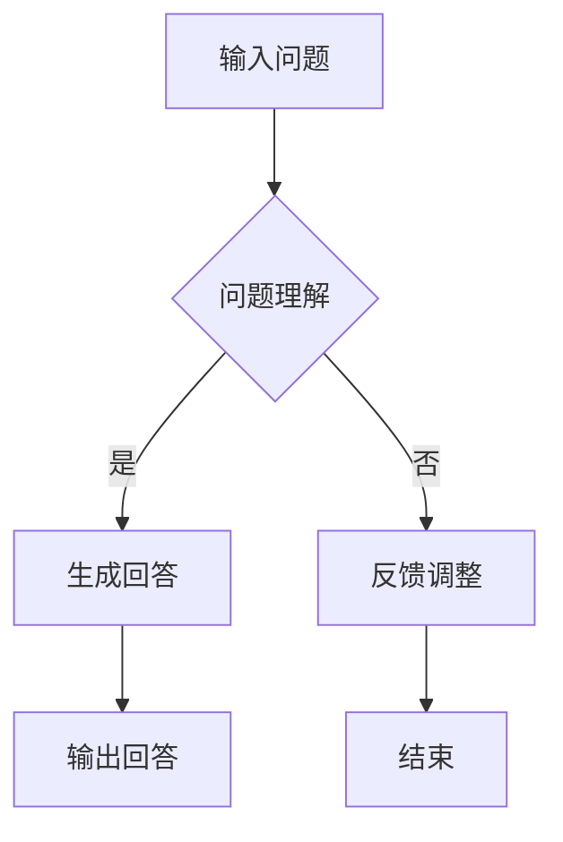

                 

  
> 关键词：大模型，问答机器人，自然语言处理，深度学习，回答生成

> 摘要：本文将探讨大模型问答机器人的回答生成技术，从背景介绍、核心概念与联系、核心算法原理、数学模型和公式、项目实践、实际应用场景、工具和资源推荐以及未来发展趋势与挑战等多个方面进行深入分析，旨在为读者提供全面的技术视角。

## 1. 背景介绍

随着人工智能技术的快速发展，自然语言处理（Natural Language Processing，NLP）已成为一个重要的研究领域。其中，问答系统作为NLP的重要应用之一，旨在理解和回答用户提出的问题。传统问答系统往往依赖于手工设计的规则和模板，而现代问答系统则更多依赖于大规模预训练模型，如BERT、GPT等。

大模型问答机器人是指使用这些大规模预训练模型构建的问答系统，其回答生成能力显著优于传统系统。这类系统通过深度学习技术，能够从海量数据中自动学习语言规律，从而生成更为准确、自然的回答。

## 2. 核心概念与联系

### 2.1 大模型

大模型通常指的是具有数十亿甚至数万亿参数的深度神经网络模型。这些模型通过对海量文本数据进行预训练，能够捕捉到语言中的复杂规律。BERT（Bidirectional Encoder Representations from Transformers）和GPT（Generative Pre-trained Transformer）是其中两种著名的模型。

### 2.2 问答系统

问答系统是一种人工智能应用，旨在理解和回答用户提出的问题。它通常包括两个关键组件：问题理解和回答生成。

### 2.3 问答机器人

问答机器人是具有自主回答能力的问答系统，它可以通过自然语言交互与用户进行沟通。大模型问答机器人则是指使用大模型构建的问答机器人。

### 2.4 Mermaid 流程图

以下是一个关于大模型问答机器人回答生成过程的 Mermaid 流程图：



## 3. 核心算法原理 & 具体操作步骤

### 3.1 算法原理概述

大模型问答机器人的回答生成基于预训练模型和微调技术。预训练模型通过在大量文本数据上训练，学习到通用语言特征。微调则是在预训练模型的基础上，针对特定任务进行进一步训练，以提高回答生成的准确性。

### 3.2 算法步骤详解

1. **问题理解**：输入问题，通过预训练模型对其进行编码，得到表示问题意义的向量。
2. **回答生成**：利用编码后的问题向量，从大量文本数据中检索相关回答，并进行排序。最终选择排名最高的回答作为输出。
3. **反馈调整**：根据用户的反馈，对回答生成过程进行调整，以提高后续回答的准确性。

### 3.3 算法优缺点

**优点**：
- **强大的理解能力**：大模型通过预训练和微调，能够捕捉到复杂的语言规律，从而提高回答生成的准确性。
- **适应性强**：大模型问答机器人可以应对各种类型的问题，具有广泛的适应性。

**缺点**：
- **计算资源消耗大**：大模型训练和推理需要大量的计算资源。
- **解释性不足**：由于模型内部结构复杂，大模型问答机器人的回答生成过程难以解释。

### 3.4 算法应用领域

大模型问答机器人广泛应用于各种场景，如智能客服、智能助手、在线教育等。以下是一个应用案例：

**案例：智能客服**

在智能客服中，大模型问答机器人可以自动回答用户提出的问题，提高客服效率。具体流程如下：

1. 用户提出问题。
2. 智能客服系统将问题输入到大模型问答机器人中。
3. 大模型问答机器人生成回答。
4. 智能客服系统将回答呈现给用户。

## 4. 数学模型和公式

### 4.1 数学模型构建

大模型问答机器人的数学模型通常基于深度学习技术，其中最常用的模型是Transformer。以下是一个简化的Transformer模型结构：

$$
\text{Transformer} = \text{Encoder} \circ \text{Decoder}
$$

其中，Encoder和Decoder分别表示编码器和解码器。

### 4.2 公式推导过程

#### 4.2.1 Encoder

Encoder由多个Transformer层组成，每个Transformer层包含自注意力机制（Self-Attention）和前馈网络（Feedforward Network）。

$$
\text{Encoder} = \text{LayerNorm}(\text{Input} + \text{MultiHeadSelfAttention}(\text{Input})) + \text{LayerNorm}(\text{Input} + \text{PositionalWiseFeedforwardNetwork}(\text{Input}))
$$

#### 4.2.2 Decoder

Decoder也由多个Transformer层组成，与Encoder类似，但还包括 masked multi-head attention。

$$
\text{Decoder} = \text{LayerNorm}(\text{Input} + \text{MaskedMultiHeadAttention}(\text{Input})) + \text{LayerNorm}(\text{Input} + \text{PositionalWiseFeedforwardNetwork}(\text{Input}))
$$

### 4.3 案例分析与讲解

以下是一个基于BERT模型的大模型问答机器人的案例：

1. **问题理解**：输入问题"什么是人工智能？"，通过BERT模型编码，得到表示问题意义的向量。
2. **回答生成**：利用编码后的问题向量，从大量文本数据中检索相关回答，并进行排序。选择排名最高的回答"人工智能是一门研究如何构建智能代理以实现人类智能任务的学科。"作为输出。
3. **反馈调整**：用户对回答表示满意，系统记录反馈，为后续回答生成提供参考。

## 5. 项目实践：代码实例和详细解释说明

### 5.1 开发环境搭建

1. 安装Python环境。
2. 安装transformers库。

```python
!pip install transformers
```

### 5.2 源代码详细实现

```python
from transformers import BertTokenizer, BertModel
import torch

# 加载预训练模型
tokenizer = BertTokenizer.from_pretrained('bert-base-chinese')
model = BertModel.from_pretrained('bert-base-chinese')

# 输入问题
question = "什么是人工智能？"

# 编码问题
encoded_question = tokenizer(question, return_tensors='pt')

# 过滤器
with torch.no_grad():
    outputs = model(**encoded_question)

# 获取编码后的向量
encoded_question_vector = outputs.last_hidden_state[:, 0, :]

# 回答生成
with torch.no_grad():
    outputs = model(encoded_question_vector.unsqueeze(0), output_hidden_states=True)

# 获取回答候选
candidates = outputs.hidden_states[-1][:, 0, :]

# 排序并选择排名最高的回答
top_candidate = candidates.topk(1)[1][0]

# 解码回答
decoded_answer = tokenizer.decode(top_candidate, skip_special_tokens=True)

print(decoded_answer)
```

### 5.3 代码解读与分析

上述代码实现了基于BERT模型的大模型问答机器人。首先，加载预训练模型并编码输入问题。然后，利用编码后的向量在预训练模型中生成回答候选，并选择排名最高的回答作为输出。最后，解码输出回答。

## 6. 实际应用场景

大模型问答机器人在实际应用中具有广泛的应用场景。以下是一些典型案例：

1. **智能客服**：智能客服系统可以自动回答用户提出的问题，提高客服效率。
2. **在线教育**：在线教育平台可以为学生提供智能问答服务，帮助学生解决学习中遇到的问题。
3. **医疗咨询**：医疗咨询平台可以利用大模型问答机器人为用户提供医疗知识查询服务。

## 7. 工具和资源推荐

### 7.1 学习资源推荐

- 《深度学习》（Goodfellow et al.）
- 《自然语言处理编程》（Peter J. Norvig）

### 7.2 开发工具推荐

- PyTorch
- TensorFlow

### 7.3 相关论文推荐

- "Attention Is All You Need"（Vaswani et al.）
- "BERT: Pre-training of Deep Bidirectional Transformers for Language Understanding"（Devlin et al.）

## 8. 总结：未来发展趋势与挑战

### 8.1 研究成果总结

大模型问答机器人的研究取得了显著成果，其回答生成能力显著提高，广泛应用于各种场景。然而，大模型在计算资源消耗和解释性方面仍存在挑战。

### 8.2 未来发展趋势

1. **更高效的大模型**：研究将集中在开发更高效的大模型，以降低计算资源消耗。
2. **可解释性**：提高大模型的可解释性，使其回答生成过程更加透明。

### 8.3 面临的挑战

1. **数据质量**：确保训练数据的质量和多样性，以提高模型泛化能力。
2. **计算资源**：大模型的训练和推理需要大量的计算资源，如何有效利用资源仍是一个挑战。

### 8.4 研究展望

大模型问答机器人在未来有望在更多领域得到广泛应用，如智能写作、智能翻译等。同时，研究将不断探索如何提高模型的可解释性和效率。

## 9. 附录：常见问题与解答

### 9.1 大模型问答机器人的优势是什么？

大模型问答机器人具有以下优势：

1. **强大的理解能力**：能够捕捉到复杂的语言规律，提高回答生成的准确性。
2. **适应性强**：可以应对各种类型的问题，具有广泛的适应性。

### 9.2 大模型问答机器人有哪些应用场景？

大模型问答机器人广泛应用于以下场景：

1. **智能客服**：自动回答用户提出的问题，提高客服效率。
2. **在线教育**：为学生提供智能问答服务，帮助学生解决学习中遇到的问题。
3. **医疗咨询**：为用户提供医疗知识查询服务。

### 9.3 如何提高大模型问答机器人的回答准确性？

以下是一些提高大模型问答机器人回答准确性的方法：

1. **数据增强**：使用数据增强技术，增加训练数据的质量和多样性。
2. **多模型融合**：结合多个模型，以提高回答生成的准确性。

----------------------------------------------------------------

以上就是本文的全部内容。希望本文能为读者提供一个全面的技术视角，对大模型问答机器人的回答生成技术有更深入的理解。感谢您的阅读！作者：禅与计算机程序设计艺术 / Zen and the Art of Computer Programming。

