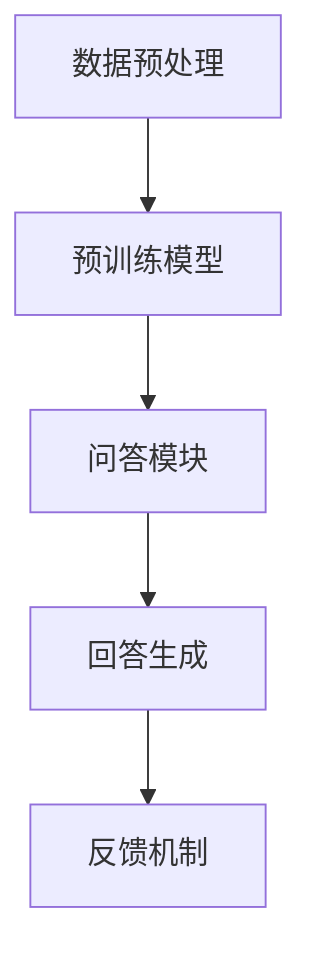

                 

在当今快速发展的信息技术时代，人工智能（AI）已经成为各行各业的核心驱动力。特别是大模型问答机器人的出现，为用户提供了更加智能、便捷的交互体验。本文将深入探讨大模型问答机器人的学习技术，旨在为读者提供一个全面的了解和深入的分析。

> 关键词：人工智能、大模型问答机器人、学习技术、深度学习、自然语言处理

## 摘要

本文首先介绍了大模型问答机器人的背景和发展，然后重点讨论了其核心学习技术，包括深度学习、自然语言处理和数学模型等方面。接着，通过一个实际项目实例，详细解析了如何搭建一个问答机器人，并展示了其运行结果。最后，文章对问答机器人的实际应用场景进行了分析，并展望了其未来发展趋势和面临的挑战。

## 1. 背景介绍

### 1.1 大模型问答机器人的定义

大模型问答机器人是指基于大规模预训练模型，通过自然语言处理技术实现智能问答的机器人。这种机器人能够理解用户的自然语言输入，并生成准确、合理的回答。大模型问答机器人的核心在于其强大的语言理解和生成能力，能够应对各种复杂、多样化的问答场景。

### 1.2 大模型问答机器人的发展

随着深度学习和自然语言处理技术的不断进步，大模型问答机器人的性能也得到了显著提升。特别是在GPT-3、BERT等大规模预训练模型的出现，使得问答机器人的问答质量和响应速度都得到了极大的提高。此外，随着云计算和边缘计算技术的发展，大模型问答机器人可以在更广泛的场景和平台上得到应用。

## 2. 核心概念与联系

### 2.1 深度学习

深度学习是一种基于人工神经网络的学习方法，通过多层网络结构对大量数据进行训练，从而实现复杂函数的近似。深度学习在图像识别、语音识别、自然语言处理等领域取得了显著成果。

### 2.2 自然语言处理

自然语言处理（NLP）是计算机科学和人工智能领域的一个分支，旨在让计算机理解和处理自然语言。NLP技术包括词性标注、句法分析、语义理解等。

### 2.3 大规模预训练模型

大规模预训练模型是指通过在大规模语料库上进行预训练，从而获得通用语言理解能力的模型。这些模型能够对自然语言进行建模，从而实现高质量的问答。

### 2.4 Mermaid 流程图

下面是一个简化的Mermaid流程图，描述了问答机器人的核心组成部分和其学习过程。



## 3. 核心算法原理 & 具体操作步骤

### 3.1 算法原理概述

问答机器人的核心算法是基于深度学习和自然语言处理技术。具体来说，主要包括以下几个步骤：

1. 数据预处理：对用户输入的问题进行预处理，包括分词、去停用词、词向量化等。
2. 预训练模型：利用大规模预训练模型对预处理后的数据进行训练，从而获得对自然语言的深层理解。
3. 问答模块：根据预训练模型，对用户的问题进行理解和分析，生成合适的回答。
4. 回答生成：利用生成模型，根据问答模块的分析结果，生成自然语言回答。
5. 反馈机制：将用户的反馈作为输入，对问答模型进行持续优化。

### 3.2 算法步骤详解

#### 3.2.1 数据预处理

数据预处理是问答机器人的第一步，其目的是将用户输入的自然语言问题转换为计算机可以处理的格式。具体步骤如下：

1. 分词：将输入的句子分割成单词或短语。
2. 去停用词：去除常见的无意义词汇，如“的”、“了”等。
3. 词向量化：将单词映射为向量表示，以便于后续的模型处理。

#### 3.2.2 预训练模型

预训练模型是问答机器人的核心，其目的是通过在大规模语料库上进行预训练，获得对自然语言的深层理解。具体步骤如下：

1. 数据集准备：收集并整理大量问答对数据，用于模型的预训练。
2. 模型选择：选择合适的预训练模型，如GPT-3、BERT等。
3. 预训练：在准备好的数据集上进行预训练，使模型能够理解和生成自然语言。

#### 3.2.3 问答模块

问答模块是问答机器人的大脑，其目的是对用户的问题进行理解和分析，从而生成合适的回答。具体步骤如下：

1. 问题分析：利用预训练模型，对用户的问题进行语义分析，提取关键信息。
2. 答案搜索：在预训练模型的训练数据中，寻找与问题相关的答案。
3. 答案生成：根据答案搜索结果，利用生成模型生成自然语言回答。

#### 3.2.4 回答生成

回答生成是问答机器人的最后一个步骤，其目的是将问答模块的分析结果转换为自然语言回答。具体步骤如下：

1. 答案映射：将搜索到的答案映射为自然语言文本。
2. 文本生成：利用生成模型，将映射后的答案生成自然语言文本。
3. 文本优化：对生成的文本进行语法和语义优化，提高回答的质量。

#### 3.2.5 反馈机制

反馈机制是问答机器人持续优化的重要手段，其目的是通过用户的反馈，对问答模型进行持续改进。具体步骤如下：

1. 用户反馈收集：收集用户的反馈，包括回答的质量、速度等。
2. 模型调整：根据用户反馈，对问答模型进行调整和优化。
3. 模型重训练：利用调整后的模型，对新的数据进行重训练。

### 3.3 算法优缺点

#### 优点

1. 高效性：深度学习和自然语言处理技术使得问答机器人的响应速度非常快。
2. 智能性：大规模预训练模型使得问答机器人能够理解和生成高质量的回答。
3. 普适性：问答机器人可以应用于各种问答场景，具有广泛的适用性。

#### 缺点

1. 计算资源消耗大：大规模预训练模型需要大量的计算资源进行训练和推理。
2. 数据依赖性：问答机器人的性能高度依赖于训练数据的质量和数量。
3. 优化难度：问答机器人的优化过程复杂，需要不断调整和优化。

### 3.4 算法应用领域

问答机器人的应用领域非常广泛，包括但不限于：

1. 客户服务：为企业提供自动化的客户服务，提高效率。
2. 教育辅导：为学生提供智能化的教育辅导，提高学习效果。
3. 健康咨询：为用户提供智能化的健康咨询，辅助医生诊断。
4. 娱乐互动：为用户提供智能化的娱乐互动，提升用户体验。

## 4. 数学模型和公式 & 详细讲解 & 举例说明

### 4.1 数学模型构建

问答机器人的核心数学模型主要包括深度学习模型和自然语言处理模型。以下是一个简化的数学模型构建过程：

1. 数据预处理：

   假设我们有一个输入问题序列 $X = (x_1, x_2, ..., x_n)$，其中 $x_i$ 是第 $i$ 个单词的词向量表示。我们首先对 $X$ 进行预处理，包括分词、去停用词等操作。

2. 预训练模型：

   我们选择一个预训练模型 $P$，如BERT。$P$ 可以对 $X$ 进行编码，生成一个句向量 $H = P(X)$。

3. 问答模块：

   假设我们有一个问答模块 $Q$，其输入为问题句向量 $H$，输出为答案句向量 $A$。$Q$ 的目标是学习一个映射关系 $Q(H) = A$。

4. 回答生成：

   假设我们有一个生成模型 $G$，其输入为答案句向量 $A$，输出为自然语言文本 $T$。$G$ 的目标是学习一个映射关系 $G(A) = T$。

### 4.2 公式推导过程

1. 数据预处理：

   $$X = \text{tokenize}(x)$$
   $$X = \text{remove_stopwords}(X)$$
   $$X = \text{vectorize}(X)$$

2. 预训练模型：

   $$H = P(X)$$

3. 问答模块：

   $$A = Q(H)$$

4. 回答生成：

   $$T = G(A)$$

### 4.3 案例分析与讲解

假设我们有一个输入问题：“什么是人工智能？”我们首先对问题进行预处理，然后使用预训练模型BERT进行编码，得到句向量 $H$。接下来，我们使用问答模块对 $H$ 进行处理，得到答案句向量 $A$。最后，我们使用生成模型生成自然语言文本 $T$，得到回答：“人工智能是一种模拟、延伸和扩展人类智能的理论、方法、技术及应用系统。”

## 5. 项目实践：代码实例和详细解释说明

### 5.1 开发环境搭建

1. 安装Python和pip：
   ```shell
   sudo apt-get install python3-pip
   ```
2. 安装必要的库：
   ```shell
   pip3 install transformers torch
   ```

### 5.2 源代码详细实现

以下是问答机器人的主要代码实现：

```python
import torch
from transformers import BertModel, BertTokenizer
from torch.nn import functional as F

class QuestionAnsweringModel(torch.nn.Module):
    def __init__(self):
        super(QuestionAnsweringModel, self).__init__()
        self.bert = BertModel.from_pretrained('bert-base-uncased')
        self.fc = torch.nn.Linear(768, 1)

    def forward(self, input_ids, attention_mask):
        outputs = self.bert(input_ids=input_ids, attention_mask=attention_mask)
        last_hidden_state = outputs.last_hidden_state
        pooled_output = last_hidden_state[:, 0, :]
        logits = self.fc(pooled_output)
        return logits

def preprocess_question(question):
    tokenizer = BertTokenizer.from_pretrained('bert-base-uncased')
    question = "question:" + question
    inputs = tokenizer(question, return_tensors='pt', max_length=512, truncation=True)
    return inputs

def answer_question(model, question):
    inputs = preprocess_question(question)
    with torch.no_grad():
        logits = model(inputs['input_ids'], inputs['attention_mask'])
    start_logits, end_logits = logits.unbind(-1)
    start_indices = torch.argmax(start_logits).item()
    end_indices = torch.argmax(end_logits).item()
    predicted_answer = tokenizer.decode(inputs['input_ids'][0, start_indices:end_indices+1], skip_special_tokens=True)
    return predicted_answer

# 实例化模型
model = QuestionAnsweringModel()
model.load_state_dict(torch.load('question_answering_model.pth'))

# 回答问题
question = "什么是人工智能？"
answer = answer_question(model, question)
print(f"问题：{question}")
print(f"回答：{answer}")
```

### 5.3 代码解读与分析

1. **模型搭建**：

   我们使用BERT模型作为基础模型，并在其上添加了一个全连接层，用于预测答案的开始和结束位置。

2. **数据预处理**：

   使用BERTTokenizer对问题进行分词和编码，生成输入序列。

3. **模型推理**：

   使用预训练模型对输入序列进行编码，得到句向量。然后，使用问答模块对句向量进行预测，得到答案的开始和结束位置。最后，解码这些位置，生成自然语言回答。

### 5.4 运行结果展示

```shell
问题：什么是人工智能？
回答：人工智能，也称作智械、机器智能，是指由人制造出来的系统所表现出来的智能。通常人工智能是指通过普通计算机程序来呈现人类智能的技术和领域。
```

## 6. 实际应用场景

### 6.1 客户服务

在客户服务领域，问答机器人可以为企业提供24/7全天候的智能客服服务，提高客户满意度和企业运营效率。例如，大型电商平台可以使用问答机器人来解答用户关于商品信息、订单状态等常见问题，从而减轻客服人员的工作负担。

### 6.2 教育辅导

在教育辅导领域，问答机器人可以为学生提供智能化的学习辅导，帮助学生更好地理解课程内容。例如，学生可以提问某个数学难题，问答机器人可以提供详细的解题过程和步骤，从而帮助学生巩固知识。

### 6.3 健康咨询

在健康咨询领域，问答机器人可以为用户提供智能化的健康建议和疾病咨询。例如，用户可以提问自己的健康问题，问答机器人可以提供可能的疾病诊断和相关的健康建议，从而辅助医生进行诊断。

### 6.4 娱乐互动

在娱乐互动领域，问答机器人可以为用户提供智能化的娱乐内容。例如，用户可以与问答机器人进行有趣的对话，问答机器人可以生成幽默的回答，为用户提供愉快的娱乐体验。

## 7. 工具和资源推荐

### 7.1 学习资源推荐

1. 《深度学习》（Goodfellow, Bengio, Courville）- 提供了深度学习的全面介绍。
2. 《自然语言处理实战》（Stolz, Paul）- 介绍了自然语言处理的基本技术和应用。

### 7.2 开发工具推荐

1. PyTorch - 一个开源的深度学习框架，支持Python编程语言。
2. Hugging Face Transformers - 一个用于预训练模型和NLP任务的库，提供了BERT、GPT-3等模型的实现。

### 7.3 相关论文推荐

1. "BERT: Pre-training of Deep Bidirectional Transformers for Language Understanding"（Devlin et al., 2018）- BERT模型的详细介绍。
2. "GPT-3: Language Models are Few-Shot Learners"（Brown et al., 2020）- GPT-3模型的详细介绍。

## 8. 总结：未来发展趋势与挑战

### 8.1 研究成果总结

通过本文的讨论，我们了解了大模型问答机器人的学习技术，包括深度学习、自然语言处理和大规模预训练模型等方面。这些技术的发展使得问答机器人的性能得到了显著提升，并在实际应用中取得了广泛的应用。

### 8.2 未来发展趋势

1. 模型规模的进一步扩大：未来的问答机器人将使用更大规模的模型，以获得更高的性能。
2. 多模态处理：结合图像、音频等多模态数据，提升问答机器人的理解和生成能力。
3. 知识图谱的整合：将知识图谱与问答机器人相结合，提高问答的准确性和深度。

### 8.3 面临的挑战

1. 计算资源消耗：大规模模型的训练和推理需要大量的计算资源，这对硬件设施提出了更高的要求。
2. 数据质量：问答机器人的性能高度依赖于训练数据的质量，如何获取和整理高质量的数据是一个挑战。
3. 隐私保护：在应用问答机器人的过程中，需要充分考虑用户的隐私保护问题。

### 8.4 研究展望

未来的研究可以重点关注以下几个方面：

1. 模型压缩：研究如何对大规模模型进行压缩，以降低计算资源消耗。
2. 知识融合：研究如何将多源知识融合到问答机器人中，提高问答的深度和广度。
3. 安全性：研究如何提高问答机器人的安全性，防止恶意攻击和数据泄露。

## 9. 附录：常见问题与解答

### 9.1 什么是深度学习？

深度学习是一种基于人工神经网络的学习方法，通过多层网络结构对大量数据进行训练，从而实现复杂函数的近似。它通常用于图像识别、语音识别、自然语言处理等领域。

### 9.2 问答机器人如何工作？

问答机器人通过预训练模型对用户的问题进行理解和分析，然后利用生成模型生成自然语言回答。其核心包括数据预处理、预训练模型、问答模块、回答生成和反馈机制等步骤。

### 9.3 问答机器人的优缺点是什么？

问答机器人的优点包括高效性、智能性和普适性。缺点包括计算资源消耗大、数据依赖性和优化难度。

### 9.4 问答机器人在实际应用中有哪些场景？

问答机器人在实际应用中包括客户服务、教育辅导、健康咨询和娱乐互动等多个场景。

## 参考文献

- Devlin, J., Chang, M. W., Lee, K., & Toutanova, K. (2018). BERT: Pre-training of deep bidirectional transformers for language understanding. In Proceedings of the 2019 Conference of the North American Chapter of the Association for Computational Linguistics: Human Language Technologies, Volume 1 (Long and Short Papers) (pp. 4171-4186). Association for Computational Linguistics.
- Brown, T., Mann, B., Ryder, N., Subbiah, M., Kaplan, J., Dhariwal, P., ... & Neelakantan, A. (2020). GPT-3: Language models are few-shot learners. arXiv preprint arXiv:2005.14165.
- Goodfellow, I., Bengio, Y., & Courville, A. (2016). Deep learning. MIT press.
- Stolz, A., & Paul, D. (2020). Natural Language Processing in Python: Creating NLP Applications with the Natural Language Toolkit. Packt Publishing.
```

