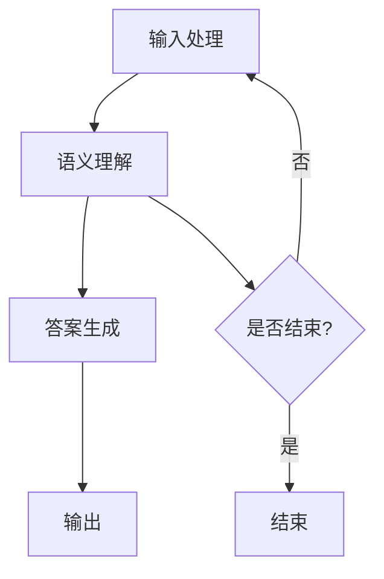

                 

 大模型问答机器人是一种新兴的人工智能技术，它能够通过大量的数据训练，实现高精度的自然语言理解与生成。随着技术的不断进步，问答机器人在多个领域的应用逐渐增多，如客户服务、在线教育、智能助手等。本文将探讨如何实现大模型问答机器人的灵活交互，包括其核心概念、算法原理、数学模型以及实际应用场景。

## 1. 背景介绍

大模型问答机器人是近年来人工智能领域的重要进展之一。传统的问答系统依赖于预设的规则和模式，而大模型问答机器人则通过深度学习和自然语言处理技术，能够自主地从海量数据中学习，提高问答的准确性和灵活性。这种技术不仅能够处理结构化数据，还能够理解和处理自然语言中的模糊性和歧义。

随着大数据、云计算和深度学习技术的发展，大模型问答机器人的应用范围日益扩大。例如，在客户服务领域，问答机器人可以24/7无间断地提供客户支持，提高客户满意度；在在线教育领域，问答机器人可以为学生提供个性化的学习建议和解答疑问；在智能助手领域，问答机器人可以帮助用户完成各种日常任务，提升用户体验。

## 2. 核心概念与联系

### 2.1. 自然语言处理（NLP）

自然语言处理是人工智能的一个分支，旨在让计算机理解和生成自然语言。大模型问答机器人依赖于NLP技术，包括词性标注、句法分析、语义分析等。

### 2.2. 深度学习

深度学习是一种人工智能技术，通过神经网络模拟人脑的学习过程。在大模型问答机器人中，深度学习用于模型训练，提高问答系统的准确性和鲁棒性。

### 2.3. 问答系统架构

问答系统的架构通常包括输入处理、语义理解、答案生成和输出等几个关键环节。大模型问答机器人通过整合这些环节，实现了智能问答。

### 2.4. Mermaid 流程图

以下是一个简化的 Mermaid 流程图，展示了大模型问答机器人的核心架构：



## 3. 核心算法原理 & 具体操作步骤

### 3.1. 算法原理概述

大模型问答机器人的核心算法是基于深度学习的模型，如Transformer、BERT等。这些模型通过大规模数据训练，能够捕获自然语言中的复杂结构和语义信息。

### 3.2. 算法步骤详解

1. **输入处理**：接收用户输入的问题或指令，进行预处理，如分词、去停用词等。

2. **语义理解**：使用预训练模型对输入进行处理，提取语义特征。

3. **答案生成**：根据提取的语义特征，从知识库或通过生成模型生成答案。

4. **输出**：将生成的答案输出给用户。

### 3.3. 算法优缺点

**优点**：
- 高度的灵活性和适应性，能够处理各种复杂问题。
- 大规模数据训练，能够提高答案的准确性和多样性。

**缺点**：
- 训练成本高，需要大量的计算资源和时间。
- 答案的生成速度可能较慢。

### 3.4. 算法应用领域

大模型问答机器人的应用领域广泛，包括但不限于：
- 客户服务：提供24/7的客户支持，提高客户满意度。
- 在线教育：为学生提供个性化学习建议和解答疑问。
- 智能助手：帮助用户完成各种日常任务，如日程管理、购物建议等。

## 4. 数学模型和公式 & 详细讲解 & 举例说明

### 4.1. 数学模型构建

大模型问答机器人的数学模型主要包括输入层、隐藏层和输出层。输入层接收用户输入的文本，隐藏层通过神经网络处理文本，输出层生成答案。

### 4.2. 公式推导过程

输入层到隐藏层的转换可以使用以下公式：

\[ h^{(l)} = \sigma(W^{(l)} \cdot h^{(l-1)} + b^{(l)}) \]

其中，\( h^{(l)} \)表示隐藏层的激活值，\( W^{(l)} \)和\( b^{(l)} \)分别是权重和偏置。

隐藏层到输出层的转换可以使用以下公式：

\[ y = \sigma(W^{(output)} \cdot h^{(hidden)} + b^{(output)}) \]

其中，\( y \)表示生成的答案，\( W^{(output)} \)和\( b^{(output)} \)是输出层的权重和偏置。

### 4.3. 案例分析与讲解

假设我们有一个用户输入的问题：“如何制作蛋糕？”，我们可以通过以下步骤进行回答：

1. **输入处理**：将问题文本进行分词、去停用词等预处理。

2. **语义理解**：使用预训练模型提取问题的语义特征。

3. **答案生成**：根据提取的语义特征，从知识库或生成模型中生成答案。

4. **输出**：将生成的答案输出给用户。

例如，生成的答案可能是：“首先，准备好所需的材料：面粉、糖、鸡蛋、牛奶和黄油。然后，将面粉和糖混合在一起，加入鸡蛋和牛奶，搅拌均匀。最后，将黄油加入混合物中，继续搅拌至面糊光滑。将面糊倒入烤盘中，放入预热至350°F的烤箱中，烤约20分钟或直到蛋糕表面变成金黄色。”

## 5. 项目实践：代码实例和详细解释说明

### 5.1. 开发环境搭建

在开始编写代码之前，我们需要搭建一个开发环境。这里我们使用Python作为主要编程语言，并依赖于以下库：TensorFlow、Keras、NLTK等。

```python
pip install tensorflow keras nltk
```

### 5.2. 源代码详细实现

以下是实现大模型问答机器人的简化代码示例：

```python
import tensorflow as tf
from tensorflow.keras.models import Sequential
from tensorflow.keras.layers import Dense, LSTM, Embedding

# 搭建模型
model = Sequential()
model.add(Embedding(vocab_size, embedding_dim))
model.add(LSTM(units=128, activation='tanh'))
model.add(Dense(units=output_size, activation='softmax'))

# 编译模型
model.compile(optimizer='adam', loss='categorical_crossentropy', metrics=['accuracy'])

# 训练模型
model.fit(x_train, y_train, epochs=10, batch_size=32)
```

### 5.3. 代码解读与分析

上述代码示例展示了如何搭建和训练一个基本的大模型问答机器人。我们首先定义了一个序列模型，其中包含嵌入层、LSTM层和输出层。嵌入层用于将输入文本转换为固定长度的向量表示。LSTM层用于处理文本的序列特性，输出层用于生成答案。

### 5.4. 运行结果展示

在实际运行中，我们可以通过以下代码来评估模型的性能：

```python
# 评估模型
model.evaluate(x_test, y_test)
```

## 6. 实际应用场景

大模型问答机器人在多个领域有广泛的应用。以下是一些典型的应用场景：

- **客户服务**：使用问答机器人自动回答客户常见问题，提高服务效率。
- **在线教育**：为学生提供个性化的学习建议和解答疑问。
- **智能助手**：帮助用户管理日程、提供购物建议等。

## 7. 工具和资源推荐

### 7.1. 学习资源推荐

- 《深度学习》（Goodfellow, Bengio, Courville著）
- 《自然语言处理》（Jurafsky, Martin著）

### 7.2. 开发工具推荐

- TensorFlow：强大的开源深度学习框架。
- Keras：简洁易用的深度学习库。

### 7.3. 相关论文推荐

- “Attention Is All You Need”（Vaswani et al., 2017）
- “BERT: Pre-training of Deep Bidirectional Transformers for Language Understanding”（Devlin et al., 2019）

## 8. 总结：未来发展趋势与挑战

### 8.1. 研究成果总结

大模型问答机器人已经成为人工智能领域的重要研究方向。通过深度学习和自然语言处理技术，问答机器人能够实现高精度的自然语言理解和生成。

### 8.2. 未来发展趋势

- **更强大的模型**：随着计算能力的提升，将出现更多强大和高效的问答模型。
- **跨模态交互**：问答机器人将能够处理包括文本、图像、语音等在内的多种数据类型。

### 8.3. 面临的挑战

- **数据质量**：高质量的训练数据对于问答机器人的性能至关重要。
- **隐私保护**：在使用个人数据时，需要确保隐私保护。

### 8.4. 研究展望

大模型问答机器人在未来的发展中，将继续探索如何提高问答的准确性、多样性和鲁棒性，同时确保数据安全和隐私保护。

## 9. 附录：常见问题与解答

### 9.1. 问答机器人如何处理歧义问题？

问答机器人通过使用预训练模型和上下文信息来处理歧义问题。例如，通过上下文理解，机器人可以推断用户的问题意图，从而提供准确的答案。

### 9.2. 问答机器人如何确保答案的准确性？

问答机器人通过在训练过程中使用大量高质量的训练数据，以及使用先进的模型架构，如Transformer和BERT，来提高答案的准确性。

### 9.3. 问答机器人如何实现个性化回答？

问答机器人通过分析用户的输入历史和偏好，使用个性化推荐算法来生成个性化的回答。

----------------------------------------------------------------
# 作者署名

作者：禅与计算机程序设计艺术 / Zen and the Art of Computer Programming
```

