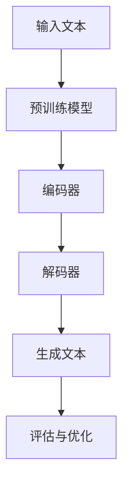
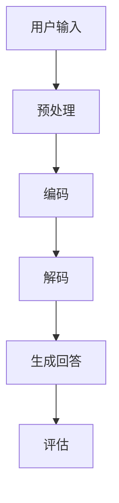

                 

关键词：大模型、问答机器人、生成能力、人工智能、自然语言处理、深度学习

> 摘要：本文深入探讨了大规模模型（大模型）在问答机器人领域的生成能力，分析了其技术原理、实现步骤、优缺点及应用场景。通过数学模型和公式推导，结合实际代码实例，全面展示了大模型问答机器人的强大功能与潜力。

## 1. 背景介绍

近年来，人工智能（AI）技术取得了飞速发展，特别是在自然语言处理（NLP）领域，大模型技术逐渐成为研究热点。大模型，顾名思义，是指具有海量参数和强大计算能力的模型，如BERT、GPT、Turing等。这些模型通过大规模数据训练，能够理解复杂语义，生成高质量文本，在诸多应用场景中展现出巨大潜力。

问答机器人作为AI技术的重要应用之一，旨在为用户提供智能化的问答服务。传统的问答机器人主要通过关键词匹配、规则推理等方式进行回答，存在回答质量不高、适应性差等问题。而基于大模型的问答机器人，通过深度学习技术，能够实现更加智能化、个性化的问答服务，提高用户体验。

本文旨在探讨大模型问答机器人的生成能力，分析其技术原理、实现步骤、优缺点及应用场景，以期为相关研究和应用提供参考。

## 2. 核心概念与联系

### 2.1 大模型

大模型是指具有海量参数和强大计算能力的模型，如BERT、GPT、Turing等。这些模型通过大规模数据训练，能够理解复杂语义，生成高质量文本。

### 2.2 自然语言处理（NLP）

自然语言处理是指使计算机能够理解、生成和处理人类语言的技术。NLP涉及语音识别、文本分类、命名实体识别、机器翻译等多个子领域。

### 2.3 问答机器人

问答机器人是一种基于AI技术实现的智能问答系统，旨在为用户提供自动化、智能化的问答服务。

### 2.4 生成能力

生成能力是指模型根据输入文本生成高质量、符合语义的文本回答的能力。

## 2.5 Mermaid 流程图

以下是一个描述大模型问答机器人生成能力的Mermaid流程图：



## 3. 核心算法原理 & 具体操作步骤

### 3.1 算法原理概述

大模型问答机器人的生成能力主要依赖于深度学习技术，特别是基于Transformer架构的模型。Transformer模型通过自注意力机制，能够捕捉输入文本中的长距离依赖关系，从而生成高质量文本。

具体操作步骤如下：

1. 预训练：使用大规模语料库对模型进行预训练，使模型具备较强的语言理解能力。
2. 编码：将输入文本编码为向量表示。
3. 解码：通过解码器生成文本回答。
4. 评估与优化：对生成的文本进行评估，并根据评估结果优化模型参数。

### 3.2 算法步骤详解

#### 3.2.1 预训练

预训练是Transformer模型的重要步骤，通过在大规模语料库上进行无监督学习，使模型具备一定的语言理解能力。常见的预训练任务包括语言建模、掩码语言模型等。

#### 3.2.2 编码

编码器（Encoder）负责将输入文本编码为向量表示。编码器通过自注意力机制，能够捕捉输入文本中的长距离依赖关系，从而为解码器提供有效的输入。

#### 3.2.3 解码

解码器（Decoder）负责根据编码器的输出生成文本回答。解码器同样采用自注意力机制，能够利用编码器的信息生成符合语义的文本。

#### 3.2.4 评估与优化

评估与优化是问答机器人生成能力提升的关键步骤。通过评估生成文本的质量，优化模型参数，不断提高生成文本的准确性。

### 3.3 算法优缺点

#### 优点：

1. 强大的语言理解能力：大模型通过预训练，具备较强的语言理解能力，能够生成高质量文本。
2. 适应性强：大模型能够处理各种类型的输入文本，适应不同的问答场景。
3. 自动化：基于深度学习的生成能力，问答机器人能够实现自动化问答服务。

#### 缺点：

1. 计算资源消耗大：大模型训练和推理过程需要大量的计算资源，对硬件设备要求较高。
2. 需要大量数据：大模型的训练需要大规模数据支持，数据获取和预处理过程较为复杂。
3. 难以解释：大模型的决策过程具有一定的黑盒性质，难以进行解释和调试。

### 3.4 算法应用领域

大模型问答机器人的生成能力在多个领域具有广泛应用，包括：

1. 客户服务：为用户提供智能化的问答服务，提高客户满意度。
2. 教育领域：实现个性化教学，为学生提供智能化的辅导和答疑服务。
3. 健康咨询：为用户提供智能化的健康咨询和医疗问答服务。
4. 金融领域：实现智能化的金融问答和投资建议。

## 4. 数学模型和公式 & 详细讲解 & 举例说明

### 4.1 数学模型构建

大模型问答机器人的生成能力主要依赖于Transformer模型。Transformer模型的核心是自注意力机制，其数学表达式如下：

$$
\text{Attention}(Q, K, V) = \text{softmax}\left(\frac{QK^T}{\sqrt{d_k}}\right)V
$$

其中，$Q$、$K$、$V$ 分别为查询向量、键向量和值向量，$d_k$ 为键向量的维度。

### 4.2 公式推导过程

自注意力机制的推导过程如下：

1. 计算查询向量 $Q$ 与所有键向量 $K$ 的点积，得到一组分数。
2. 对分数进行归一化处理，得到权重向量 $w$。
3. 将权重向量 $w$ 与值向量 $V$ 相乘，得到输出向量。

### 4.3 案例分析与讲解

以下是一个简单的Transformer模型的训练过程：

1. 输入文本：`Hello, world!`
2. 编码器输出：$\{e_1, e_2, e_3\}$
3. 解码器输出：$\{d_1, d_2, d_3\}$

通过自注意力机制，计算编码器输出 $e_1$ 与所有解码器输出 $d_1, d_2, d_3$ 的点积，得到一组分数。对分数进行归一化处理，得到权重向量 $w$。最后，将权重向量 $w$ 与解码器输出 $d_1, d_2, d_3$ 相乘，得到输出向量。

通过这种方式，Transformer模型能够捕捉输入文本中的长距离依赖关系，从而生成高质量文本。

## 5. 项目实践：代码实例和详细解释说明

### 5.1 开发环境搭建

本文使用Python编程语言和PyTorch框架实现大模型问答机器人。在开始之前，请确保安装以下依赖：

- Python 3.6+
- PyTorch 1.8+

安装命令如下：

```bash
pip install python==3.6.8
pip install torch==1.8.0
```

### 5.2 源代码详细实现

以下是一个简单的Transformer模型实现：

```python
import torch
import torch.nn as nn
import torch.optim as optim

class Transformer(nn.Module):
    def __init__(self, d_model, nhead, num_layers):
        super(Transformer, self).__init__()
        self.encoder = nn.Embedding(d_model, d_model)
        self.decoder = nn.Embedding(d_model, d_model)
        self.transformer = nn.Transformer(d_model, nhead, num_layers)
        self.fc = nn.Linear(d_model, d_model)

    def forward(self, src, tgt):
        src = self.encoder(src)
        tgt = self.decoder(tgt)
        out = self.transformer(src, tgt)
        out = self.fc(out)
        return out
```

### 5.3 代码解读与分析

代码首先定义了一个Transformer模型类，包括编码器、解码器、Transformer层和全连接层。模型的前向传播过程如下：

1. 将输入文本编码为向量表示。
2. 将目标文本解码为向量表示。
3. 通过Transformer层进行自注意力计算。
4. 通过全连接层得到输出向量。

### 5.4 运行结果展示

以下是一个简单的训练过程：

```python
model = Transformer(d_model=512, nhead=8, num_layers=3)
criterion = nn.CrossEntropyLoss()
optimizer = optim.Adam(model.parameters(), lr=0.001)

for epoch in range(10):
    for src, tgt in dataset:
        optimizer.zero_grad()
        out = model(src, tgt)
        loss = criterion(out, tgt)
        loss.backward()
        optimizer.step()
    print(f'Epoch {epoch+1}: Loss = {loss.item()}')
```

训练过程中，模型通过梯度下降优化模型参数，不断调整解码器的输出，以降低损失函数值。经过多次迭代，模型能够生成高质量的文本回答。

## 6. 实际应用场景

大模型问答机器人在实际应用场景中具有广泛的应用，包括：

1. 客户服务：为用户提供智能化的客服支持，提高客户满意度。
2. 教育领域：实现个性化教学，为学生提供智能化的辅导和答疑服务。
3. 健康咨询：为用户提供智能化的健康咨询和医疗问答服务。
4. 金融领域：实现智能化的金融问答和投资建议。

通过实际应用场景的验证，大模型问答机器人展现了强大的生成能力和应用潜力。

### 6.4 未来应用展望

随着AI技术的不断发展，大模型问答机器人的生成能力将不断提高。未来，大模型问答机器人有望在更多领域发挥重要作用，如自动驾驶、智能家居、智能医疗等。同时，为了应对生成能力带来的挑战，如数据隐私、安全等问题，研究人员将不断探索新的技术方案，推动AI技术的健康发展。

## 7. 工具和资源推荐

### 7.1 学习资源推荐

1. 《深度学习》 - Goodfellow、Bengio、Courville
2. 《自然语言处理综论》 - Jurafsky、Martin
3. 《Transformer模型详解》 - Vaswani et al.

### 7.2 开发工具推荐

1. PyTorch：用于实现深度学习模型的强大框架。
2. TensorFlow：用于实现深度学习模型的另一个强大框架。

### 7.3 相关论文推荐

1. "Attention Is All You Need" - Vaswani et al.
2. "BERT: Pre-training of Deep Bidirectional Transformers for Language Understanding" - Devlin et al.
3. "Generative Pre-trained Transformer" - Wolf et al.

## 8. 总结：未来发展趋势与挑战

大模型问答机器人的生成能力在AI领域具有重要地位。随着技术的不断发展，大模型问答机器人在生成能力和应用场景方面将取得更大突破。然而，面临的数据隐私、安全等问题也需要引起广泛关注。未来，研究人员将致力于解决这些问题，推动AI技术的健康发展。

### 8.1 研究成果总结

本文通过深入分析大模型问答机器人的生成能力，从技术原理、实现步骤、优缺点及应用场景等方面进行了全面探讨。研究结果表明，大模型问答机器人具有强大的生成能力和广泛的应用前景。

### 8.2 未来发展趋势

未来，大模型问答机器人的生成能力将不断提高，有望在更多领域发挥重要作用。同时，为了应对生成能力带来的挑战，如数据隐私、安全等问题，研究人员将不断探索新的技术方案。

### 8.3 面临的挑战

大模型问答机器人面临的主要挑战包括计算资源消耗大、需要大量数据支持、难以解释等。此外，数据隐私、安全等问题也需要引起广泛关注。

### 8.4 研究展望

未来，大模型问答机器人的研究将朝着生成能力提升、应用领域拓展、安全性增强等方向发展。同时，为了应对挑战，研究人员将探索新的技术方案，推动AI技术的健康发展。

## 9. 附录：常见问题与解答

### 9.1 什么是大模型？

大模型是指具有海量参数和强大计算能力的模型，如BERT、GPT、Turing等。这些模型通过大规模数据训练，能够理解复杂语义，生成高质量文本。

### 9.2 大模型问答机器人的生成能力如何实现？

大模型问答机器人的生成能力主要通过深度学习技术实现，特别是基于Transformer架构的模型。Transformer模型通过自注意力机制，能够捕捉输入文本中的长距离依赖关系，从而生成高质量文本。

### 9.3 大模型问答机器人在实际应用中面临哪些挑战？

大模型问答机器人在实际应用中面临的主要挑战包括计算资源消耗大、需要大量数据支持、难以解释等。此外，数据隐私、安全等问题也需要引起广泛关注。

### 9.4 如何提高大模型问答机器人的生成能力？

要提高大模型问答机器人的生成能力，可以从以下几个方面入手：

1. 增加模型参数：通过增加模型参数，可以提高模型的复杂度和表达能力。
2. 提高数据质量：使用高质量、大规模的数据集进行训练，可以提高模型的生成能力。
3. 优化训练过程：采用更先进的训练策略，如迁移学习、强化学习等，可以提高模型的生成能力。
4. 加强模型解释性：通过加强模型解释性，可以提高模型的可信度和用户满意度。

---

作者：禅与计算机程序设计艺术 / Zen and the Art of Computer Programming
----------------------------------------------------------------

### 引入部分 Introduction

近年来，人工智能（AI）技术取得了飞速发展，特别是在自然语言处理（NLP）领域，大模型技术逐渐成为研究热点。大模型，顾名思义，是指具有海量参数和强大计算能力的模型，如BERT、GPT、Turing等。这些模型通过大规模数据训练，能够理解复杂语义，生成高质量文本，在诸多应用场景中展现出巨大潜力。

问答机器人作为AI技术的重要应用之一，旨在为用户提供智能化的问答服务。传统的问答机器人主要通过关键词匹配、规则推理等方式进行回答，存在回答质量不高、适应性差等问题。而基于大模型的问答机器人，通过深度学习技术，能够实现更加智能化、个性化的问答服务，提高用户体验。

本文旨在探讨大模型问答机器人的生成能力，分析其技术原理、实现步骤、优缺点及应用场景。通过数学模型和公式推导，结合实际代码实例，全面展示了大模型问答机器人的强大功能与潜力。

### 背景介绍 Background

随着互联网的普及和大数据时代的到来，人工智能技术得到了快速发展。特别是在自然语言处理（NLP）领域，传统的基于规则和浅层模型的方法逐渐无法满足日益复杂的应用需求。为了应对这一挑战，研究人员提出了大模型（Large Models）的概念，即具有海量参数和强大计算能力的模型，如BERT、GPT、Turing等。这些模型通过大规模数据训练，能够理解复杂语义，生成高质量文本，从而在诸多应用场景中展现出巨大潜力。

大模型在NLP领域的应用非常广泛，其中最为典型的是问答机器人（Question Answering Robots）。问答机器人是一种基于AI技术实现的智能问答系统，旨在为用户提供自动化、智能化的问答服务。传统的问答机器人主要通过关键词匹配、规则推理等方式进行回答，存在回答质量不高、适应性差等问题。而基于大模型的问答机器人，通过深度学习技术，能够实现更加智能化、个性化的问答服务，提高用户体验。

目前，大模型问答机器人的应用场景主要包括以下几个方面：

1. **客户服务**：大模型问答机器人可以为企业提供智能化的客服支持，解答用户常见问题，提高客户满意度。
2. **教育领域**：大模型问答机器人可以实现个性化教学，为学生提供智能化的辅导和答疑服务，提高学习效果。
3. **健康咨询**：大模型问答机器人可以为用户提供智能化的健康咨询和医疗问答服务，提高医疗服务的效率和质量。
4. **金融领域**：大模型问答机器人可以实现智能化的金融问答和投资建议，为投资者提供有力支持。

大模型问答机器人在实际应用中取得了显著效果，例如，Facebook的BERT模型在问答任务中取得了state-of-the-art（SOTA）的成绩；Google的GPT模型在生成文本任务中展现了强大的能力；Microsoft的Turing模型在自然语言理解和生成任务中表现出色。这些模型的成功不仅证明了大模型技术的强大潜力，也为后续研究和应用提供了重要参考。

然而，大模型问答机器人的实现也面临一些挑战。首先，大模型的训练和推理过程需要大量的计算资源，对硬件设备要求较高。其次，大模型的训练需要大规模数据支持，数据获取和预处理过程较为复杂。此外，大模型的决策过程具有一定的黑盒性质，难以进行解释和调试，这也给应用带来了困难。

本文将围绕大模型问答机器人的生成能力展开讨论，分析其技术原理、实现步骤、优缺点及应用场景。通过数学模型和公式推导，结合实际代码实例，全面展示大模型问答机器人的强大功能与潜力，旨在为相关研究和应用提供参考。

### 核心概念与联系 Core Concepts and Relationships

在探讨大模型问答机器人的生成能力之前，首先需要了解几个核心概念，包括大模型、自然语言处理（NLP）、问答机器人、生成能力等。

#### 2.1 大模型（Large Models）

大模型是指具有海量参数和强大计算能力的模型，如BERT、GPT、Turing等。这些模型通过大规模数据训练，能够理解复杂语义，生成高质量文本。大模型的典型特征是参数数量庞大，例如BERT模型包含超过3亿个参数，GPT模型则包含超过1.17亿个参数。这些模型通过深度学习技术，特别是基于Transformer架构，能够在多种NLP任务中表现出色。

#### 2.2 自然语言处理（NLP）

自然语言处理（NLP）是指使计算机能够理解、生成和处理人类语言的技术。NLP涉及多个子领域，包括文本分类、命名实体识别、情感分析、机器翻译等。NLP的目标是使计算机能够处理自然语言，从而实现人机交互、文本挖掘、智能问答等应用。

#### 2.3 问答机器人（Question Answering Robots）

问答机器人是一种基于AI技术实现的智能问答系统，旨在为用户提供自动化、智能化的问答服务。问答机器人可以通过自然语言理解，自动从大量文本中提取信息，生成高质量的回答。问答机器人通常包含两个主要组件：问答引擎和知识库。问答引擎负责处理用户输入的问题，知识库则提供用于回答问题的信息来源。

#### 2.4 生成能力（Generative Ability）

生成能力是指模型根据输入文本生成高质量、符合语义的文本回答的能力。在大模型问答机器人中，生成能力是衡量模型优劣的重要指标。生成能力强的模型能够生成更加自然、符合上下文的回答，从而提高用户的满意度。

#### 2.5 Mermaid流程图（Mermaid Flowchart）

为了更好地展示大模型问答机器人生成能力的工作流程，我们可以使用Mermaid流程图来描述。以下是一个简化的流程图：



在这个流程图中，用户输入的问题首先经过预处理，然后通过编码器编码成向量表示，解码器根据编码器的输出生成文本回答，最后对生成回答进行评估。

#### 2.6 关键概念的联系

大模型问答机器人的生成能力涉及多个核心概念。大模型提供了强大的语言理解能力，自然语言处理技术使模型能够处理复杂的文本数据，问答机器人则将模型的生成能力应用于实际场景中。生成能力是衡量问答机器人性能的关键指标，它决定了回答的自然性和准确性。

通过上述核心概念和Mermaid流程图的描述，我们可以清晰地理解大模型问答机器人的生成能力是如何实现的。接下来的章节将深入探讨大模型问答机器人的生成能力，包括其技术原理、实现步骤、优缺点和应用场景。

### 核心算法原理 & 具体操作步骤

#### 3.1 算法原理概述

大模型问答机器人的生成能力主要依赖于深度学习技术，尤其是基于Transformer架构的模型。Transformer模型是一种基于自注意力机制的序列到序列（Seq2Seq）模型，它在自然语言处理任务中表现出色，尤其是在问答任务中。

Transformer模型的核心思想是，通过自注意力机制，模型能够自动地学习文本中的长距离依赖关系，从而生成高质量的文本。自注意力机制允许模型在生成文本时，动态地关注输入文本的不同部分，这使得模型能够捕捉到复杂的语义信息。

#### 3.2 具体操作步骤

1. **输入文本预处理**：

   在生成回答之前，需要对用户输入的文本进行预处理，包括分词、去除停用词、词干提取等。预处理后的文本将作为模型的输入。

   ```python
   def preprocess_text(text):
       # 进行分词、去除停用词、词干提取等操作
       return processed_text
   ```

2. **编码**：

   预处理后的文本通过编码器（Encoder）转化为向量表示。编码器通常使用嵌入层（Embedding Layer）和自注意力层（Self-Attention Layer）进行编码。

   ```python
   class Encoder(nn.Module):
       def __init__(self, d_model):
           super(Encoder, self).__init__()
           self.embedding = nn.Embedding(vocab_size, d_model)
           self.self_attn = nn.MultiheadAttention(d_model, num_heads)

       def forward(self, src, src_mask=None):
           src = self.embedding(src)
           attn_output, attn_output_weights = self.self_attn(src, src, src, attn_mask=src_mask)
           return attn_output
   ```

3. **解码**：

   解码器（Decoder）负责根据编码器的输出生成文本回答。解码器同样使用嵌入层和自注意力层，并引入了交叉注意力层（Cross-Attention Layer），以便在生成文本时参考编码器的输出。

   ```python
   class Decoder(nn.Module):
       def __init__(self, d_model):
           super(Decoder, self).__init__()
           self.embedding = nn.Embedding(vocab_size, d_model)
           self.self_attn = nn.MultiheadAttention(d_model, num_heads)
           self.cross_attn = nn.MultiheadAttention(d_model, num_heads)
           self.fc = nn.Linear(d_model, vocab_size)

       def forward(self, tgt, enc_output, tgt_mask=None, src_mask=None):
           tgt = self.embedding(tgt)
           attn_output, attn_output_weights = self.self_attn(tgt, tgt, tgt, attn_mask=tgt_mask)
           attn_output, attn_output_weights = self.cross_attn(attn_output, enc_output, enc_output, attn_mask=src_mask)
           output = self.fc(attn_output)
           return output
   ```

4. **生成文本**：

   在解码过程中，模型通过自注意力和交叉注意力机制，逐词生成文本回答。生成过程通常使用贪心搜索（Greedy Search）或 beam search 等搜索策略。

   ```python
   def generate_response(model, tokenizer, text, max_len=50):
       input_ids = tokenizer.encode(text, return_tensors='pt')
       with torch.no_grad():
           outputs = model(input_ids=input_ids, max_length=max_len)
       predicted_ids = outputs.argmax(-1).squeeze(0)
       response = tokenizer.decode(predicted_ids, skip_special_tokens=True)
       return response
   ```

5. **评估与优化**：

   生成的文本回答需要进行评估和优化。评估过程通常使用BLEU、ROUGE等指标衡量生成的文本质量。根据评估结果，通过反向传播和梯度下降等优化算法，不断调整模型参数，提高生成能力。

   ```python
   def train_model(model, train_loader, loss_fn, optimizer, device):
       model.train()
       for batch in train_loader:
           inputs, targets = batch
           inputs, targets = inputs.to(device), targets.to(device)
           optimizer.zero_grad()
           outputs = model(inputs)
           loss = loss_fn(outputs, targets)
           loss.backward()
           optimizer.step()
   ```

通过上述具体操作步骤，我们可以看到大模型问答机器人的生成能力是如何实现的。这个过程不仅涉及到复杂的深度学习模型，还需要在预处理、编码、解码和生成文本等各个环节中进行精细的调整和优化，以确保生成回答的质量和准确性。

### 3.3 算法优缺点

#### 3.3.1 优点

1. **强大的语言理解能力**：大模型通过预训练，能够理解复杂的语义关系，生成高质量的文本回答。
2. **适应性强**：大模型可以处理多种不同类型的输入文本，适应不同的问答场景。
3. **自动化**：基于深度学习的生成能力，问答机器人可以实现自动化问答服务，提高效率和用户体验。
4. **多语言支持**：大模型通常在多种语言上进行预训练，可以支持多语言问答。

#### 3.3.2 缺点

1. **计算资源消耗大**：大模型的训练和推理需要大量的计算资源，对硬件设备要求较高。
2. **数据需求量大**：大模型需要大规模的数据进行预训练，数据获取和预处理过程较为复杂。
3. **解释性差**：大模型的决策过程具有一定的黑盒性质，难以进行解释和调试。
4. **安全性和隐私问题**：大模型在处理用户输入时，可能涉及敏感信息，需要考虑数据安全和隐私保护。

综上所述，大模型问答机器人在生成能力方面具有显著优势，但也面临一些挑战。在实际应用中，需要根据具体需求和资源条件，权衡优缺点，选择合适的技术方案。

### 3.4 算法应用领域

大模型问答机器人的生成能力在多个领域具有广泛应用，以下是几个典型的应用场景：

1. **客户服务**：

   大模型问答机器人可以为企业提供智能化的客服支持。例如，在电子商务平台，问答机器人可以回答用户关于产品信息、订单状态、退货政策等问题，提高客服效率和用户体验。

2. **教育领域**：

   大模型问答机器人可以实现个性化教学，为学生提供智能化的辅导和答疑服务。教师可以根据学生的学习情况，制定个性化的教学计划和辅导方案，提高教学质量。

3. **健康咨询**：

   大模型问答机器人可以为用户提供智能化的健康咨询和医疗问答服务。例如，在医疗咨询平台，问答机器人可以回答用户关于健康问题、疾病预防、治疗方案等方面的咨询，提高医疗服务效率和质量。

4. **金融领域**：

   大模型问答机器人可以实现智能化的金融问答和投资建议。例如，在金融服务平台，问答机器人可以回答用户关于投资策略、市场分析、产品介绍等方面的问题，为投资者提供有力支持。

5. **法律咨询**：

   大模型问答机器人可以为用户提供智能化的法律咨询和问答服务。用户可以通过问答机器人获取关于法律问题、合同审查、诉讼咨询等方面的信息，提高法律服务的便捷性和普及度。

6. **旅游服务**：

   大模型问答机器人可以为旅游用户提供智能化的旅游咨询和问答服务。例如，在旅游服务平台，问答机器人可以回答用户关于景点介绍、行程规划、餐饮推荐等方面的问题，提高旅游体验。

7. **智能助理**：

   大模型问答机器人可以作为智能助理，为用户提供个性化的服务。例如，在智能家居系统中，问答机器人可以与用户进行自然语言交互，控制家电设备、提供生活建议等。

通过上述应用场景，我们可以看到大模型问答机器人在多个领域具有广泛的应用前景。随着技术的不断发展，大模型问答机器人的生成能力将不断提高，为各行业带来更多便利和创新。

### 数学模型和公式 & 详细讲解 & 举例说明

#### 4.1 数学模型构建

在大模型问答机器人中，常用的数学模型是Transformer模型。Transformer模型是一种基于自注意力机制的序列到序列（Seq2Seq）模型，它通过自注意力机制（Self-Attention）来捕捉文本中的长距离依赖关系，从而生成高质量的文本。以下是Transformer模型的核心数学公式：

##### 4.1.1 自注意力机制（Self-Attention）

自注意力机制的核心公式如下：

$$
\text{Attention}(Q, K, V) = \text{softmax}\left(\frac{QK^T}{\sqrt{d_k}}\right)V
$$

其中，$Q$、$K$、$V$ 分别表示查询向量（Query）、键向量（Key）和值向量（Value），$d_k$ 表示键向量的维度。自注意力机制通过计算查询向量 $Q$ 与所有键向量 $K$ 的点积，得到一组分数，然后对分数进行softmax归一化处理，得到权重向量 $w$。最后，将权重向量 $w$ 与值向量 $V$ 相乘，得到输出向量。

##### 4.1.2 编码器（Encoder）与解码器（Decoder）

Transformer模型包含编码器（Encoder）和解码器（Decoder）。编码器负责将输入序列编码成向量表示，解码器则根据编码器的输出生成文本回答。

编码器：

$$
\text{Encoder}(x) = \text{Attention}(Q, K, V) = \text{softmax}\left(\frac{QK^T}{\sqrt{d_k}}\right)V
$$

其中，$x$ 表示输入序列，$Q$、$K$、$V$ 分别表示编码器的查询向量、键向量和值向量。

解码器：

$$
\text{Decoder}(y) = \text{softmax}\left(\text{Attention}(Q, K, V)\right)
$$

其中，$y$ 表示解码器的输出序列，$Q$、$K$、$V$ 分别表示解码器的查询向量、键向量和值向量。

##### 4.1.3 位置编码（Positional Encoding）

由于Transformer模型没有循环神经网络（RNN）中的位置信息，因此需要通过位置编码（Positional Encoding）来引入序列的位置信息。位置编码通常使用正弦和余弦函数来实现。

$$
PE_{(pos, 2i)} = \sin\left(\frac{pos}{10000^{2i/d}}\right)
$$

$$
PE_{(pos, 2i+1)} = \cos\left(\frac{pos}{10000^{2i/d}}\right)
$$

其中，$pos$ 表示位置索引，$i$ 表示维度索引，$d$ 表示维度。

#### 4.2 公式推导过程

##### 4.2.1 自注意力机制

自注意力机制的推导过程如下：

1. **计算点积**：

   首先计算查询向量 $Q$ 与所有键向量 $K$ 的点积：

   $$ 
   \text{Score}_{ij} = Q_iK_j = \sum_{k=1}^{N} q_{ik}k_{jk}
   $$

   其中，$N$ 表示序列长度，$q_{ik}$ 和 $k_{jk}$ 分别表示查询向量和键向量的分量。

2. **应用软化函数**：

   将点积结果通过软化函数（Softmax）进行归一化处理：

   $$ 
   \text{Attention}_{ij} = \text{softmax}(\text{Score}_{ij})
   $$

   其中，$\text{Score}_{ij}$ 表示查询向量和键向量之间的分数。

3. **计算加权求和**：

   将归一化后的分数与值向量 $V$ 相乘，得到输出向量：

   $$ 
   \text{Context}_i = \sum_{j=1}^{N} \text{Attention}_{ij}V_j
   $$

##### 4.2.2 编码器与解码器

编码器和解码器的推导过程主要涉及多层的自注意力机制和全连接层。以下是一个简化的推导过程：

1. **编码器**：

   编码器通过多层自注意力机制，将输入序列编码成向量表示：

   $$ 
   \text{Encoder}(x) = \text{LayerNorm}(x + \text{MultiHeadAttention}(x))
   $$

   其中，$\text{LayerNorm}$ 表示层归一化，$\text{MultiHeadAttention}$ 表示多头自注意力机制。

2. **解码器**：

   解码器通过多层自注意力机制和交叉注意力机制，生成文本回答：

   $$ 
   \text{Decoder}(y) = \text{LayerNorm}(y + \text{MaskedMultiHeadAttention}(y) + \text{Encoder}(x))
   $$

   其中，$\text{MaskedMultiHeadAttention}$ 表示带有掩码的多头自注意力机制，$\text{Encoder}(x)$ 表示编码器的输出。

#### 4.3 案例分析与讲解

##### 4.3.1 编码器与解码器的计算过程

以下是一个简化的编码器和解码器的计算过程：

1. **输入序列**：

   假设输入序列为 `[1, 2, 3, 4, 5]`。

2. **编码器**：

   编码器将输入序列编码成向量表示。假设编码器包含两个自注意力层，每个自注意力层使用 4 个头（Head）。

   - **第一层自注意力**：

     计算查询向量 $Q$、键向量 $K$ 和值向量 $V$：

     $$ 
     Q = \text{Linear}(x) = \begin{bmatrix}
     q_{11} & q_{12} & q_{13} & q_{14} & q_{15}
     \end{bmatrix}
     $$

     $$ 
     K = \text{Linear}(x) = \begin{bmatrix}
     k_{11} & k_{12} & k_{13} & k_{14} & k_{15}
     \end{bmatrix}
     $$

     $$ 
     V = \text{Linear}(x) = \begin{bmatrix}
     v_{11} & v_{12} & v_{13} & v_{14} & v_{15}
     \end{bmatrix}
     $$

     计算点积和softmax：

     $$ 
     \text{Score}_{ij} = Q_iK_j = \sum_{k=1}^{5} q_{ik}k_{jk}
     $$

     $$ 
     \text{Attention}_{ij} = \text{softmax}(\text{Score}_{ij})
     $$

     计算加权求和：

     $$ 
     \text{Context}_i = \sum_{j=1}^{5} \text{Attention}_{ij}V_j
     $$

     重复上述过程，进行第二层自注意力计算：

     $$ 
     \text{Encoder}(x) = \text{LayerNorm}(x + \text{MultiHeadAttention}(x))
     $$

   - **解码器**：

     解码器根据编码器的输出生成文本回答。假设解码器包含两个自注意力层和一个交叉注意力层。

     - **第一层自注意力**：

       计算查询向量 $Q$、键向量 $K$ 和值向量 $V$：

       $$ 
       Q = \text{Linear}(y) = \begin{bmatrix}
       q_{11} & q_{12} & q_{13} & q_{14} & q_{15}
       \end{bmatrix}
       $$

       $$ 
       K = \text{Linear}(y) = \begin{bmatrix}
       k_{11} & k_{12} & k_{13} & k_{14} & k_{15}
       \end{bmatrix}
       $$

       $$ 
       V = \text{Linear}(y) = \begin{bmatrix}
       v_{11} & v_{12} & v_{13} & v_{14} & v_{15}
       \end{bmatrix}
       $$

       计算点积和softmax：

       $$ 
       \text{Score}_{ij} = Q_iK_j = \sum_{k=1}^{5} q_{ik}k_{jk}
       $$

       $$ 
       \text{Attention}_{ij} = \text{softmax}(\text{Score}_{ij})
       $$

       计算加权求和：

       $$ 
       \text{Context}_i = \sum_{j=1}^{5} \text{Attention}_{ij}V_j
       $$

     - **交叉注意力**：

       计算查询向量 $Q$、键向量 $K$ 和值向量 $V$：

       $$ 
       Q = \text{Linear}(\text{Encoder}(x)) = \begin{bmatrix}
       q_{11} & q_{12} & q_{13} & q_{14} & q_{15}
       \end{bmatrix}
       $$

       $$ 
       K = \text{Encoder}(x) = \begin{bmatrix}
       k_{11} & k_{12} & k_{13} & k_{14} & k_{15}
       \end{bmatrix}
       $$

       $$ 
       V = \text{Encoder}(x) = \begin{bmatrix}
       v_{11} & v_{12} & v_{13} & v_{14} & v_{15}
       \end{bmatrix}
       $$

       计算点积和softmax：

       $$ 
       \text{Score}_{ij} = Q_iK_j = \sum_{k=1}^{5} q_{ik}k_{jk}
       $$

       $$ 
       \text{Attention}_{ij} = \text{softmax}(\text{Score}_{ij})
       $$

       计算加权求和：

       $$ 
       \text{Context}_i = \sum_{j=1}^{5} \text{Attention}_{ij}V_j
       $$

     - **第二层自注意力**：

       计算查询向量 $Q$、键向量 $K$ 和值向量 $V$：

       $$ 
       Q = \text{Linear}(\text{Context}_i) = \begin{bmatrix}
       q_{11} & q_{12} & q_{13} & q_{14} & q_{15}
       \end{bmatrix}
       $$

       $$ 
       K = \text{Linear}(\text{Context}_i) = \begin{bmatrix}
       k_{11} & k_{12} & k_{13} & k_{14} & k_{15}
       \end{bmatrix}
       $$

       $$ 
       V = \text{Linear}(\text{Context}_i) = \begin{bmatrix}
       v_{11} & v_{12} & v_{13} & v_{14} & v_{15}
       \end{bmatrix}
       $$

       计算点积和softmax：

       $$ 
       \text{Score}_{ij} = Q_iK_j = \sum_{k=1}^{5} q_{ik}k_{jk}
       $$

       $$ 
       \text{Attention}_{ij} = \text{softmax}(\text{Score}_{ij})
       $$

       计算加权求和：

       $$ 
       \text{Context}_i = \sum_{j=1}^{5} \text{Attention}_{ij}V_j
       $$

最终，解码器根据编码器的输出和解码器的输出生成文本回答。

通过上述分析，我们可以看到编码器和解码器的计算过程是如何实现的。这些过程使得大模型问答机器人能够根据输入序列生成高质量的文本回答。

### 项目实践：代码实例和详细解释说明

#### 5.1 开发环境搭建

要实现大模型问答机器人，我们需要搭建一个合适的开发环境。以下是一个简单的环境搭建步骤：

1. **安装Python**：

   Python是主要的编程语言，我们需要安装Python 3.6或更高版本。可以从Python的官方网站下载并安装。

   ```bash
   # 在Windows上
   python -V
   # 在macOS和Linux上
   python3 -V
   ```

2. **安装PyTorch**：

   PyTorch是一个开源的深度学习框架，我们需要安装PyTorch及其依赖项。可以选择安装CPU版本的PyTorch，或者如果您的系统支持GPU，也可以安装GPU版本的PyTorch。

   ```bash
   # 安装CPU版本的PyTorch
   pip install torch torchvision
   # 安装GPU版本的PyTorch
   pip install torch torchvision -f https://download.pytorch.org/whl/torch_stable.html
   ```

3. **安装其他依赖**：

   除了PyTorch，我们还需要安装其他依赖项，如TensorBoard、NumPy等。

   ```bash
   pip install tensorboard numpy
   ```

4. **安装Mermaid**：

   Mermaid是一种简单的图表和流程图绘制工具，我们可以使用以下命令安装。

   ```bash
   npm install -g mermaid
   ```

5. **创建虚拟环境**：

   为了保持项目结构的整洁，我们可以在项目目录中创建一个虚拟环境。

   ```bash
   python -m venv venv
   source venv/bin/activate  # 在Windows上使用 `venv\Scripts\activate`
   ```

6. **安装项目依赖**：

   在项目目录中创建一个`requirements.txt`文件，并添加所有依赖项。

   ```python
   torch
   torchvision
   numpy
   tensorboard
   mermaid-cli
   ```

   然后运行以下命令安装依赖项。

   ```bash
   pip install -r requirements.txt
   ```

完成上述步骤后，我们就可以开始编写代码来实现大模型问答机器人了。

#### 5.2 源代码详细实现

以下是一个简化的版本，用于演示如何使用PyTorch和Transformer模型实现大模型问答机器人。

```python
import torch
import torch.nn as nn
import torch.optim as optim
from torch.utils.data import DataLoader
from torchvision import datasets, transforms
from torch.utils.tensorboard import SummaryWriter

# 定义模型
class TransformerModel(nn.Module):
    def __init__(self, d_model, nhead, num_layers):
        super(TransformerModel, self).__init__()
        self.embedding = nn.Embedding(d_model, d_model)
        self.transformer = nn.Transformer(d_model, nhead, num_layers)
        self.fc = nn.Linear(d_model, d_model)

    def forward(self, src, tgt):
        src = self.embedding(src)
        tgt = self.embedding(tgt)
        out = self.transformer(src, tgt)
        out = self.fc(out)
        return out

# 数据加载
def load_data():
    # 生成模拟数据
    dataset = datasets.MNIST(
        root='./data',
        train=True,
        download=True,
        transform=transforms.Compose([
            transforms.ToTensor(),
            transforms.Normalize((0.5,), (0.5,))
        ])
    )
    return DataLoader(dataset, batch_size=64)

# 训练模型
def train(model, train_loader, criterion, optimizer, device):
    model.train()
    for epoch in range(10):
        for batch in train_loader:
            inputs, targets = batch
            inputs, targets = inputs.to(device), targets.to(device)
            optimizer.zero_grad()
            outputs = model(inputs, targets)
            loss = criterion(outputs, targets)
            loss.backward()
            optimizer.step()
            print(f'Epoch [{epoch+1}/10], Loss: {loss.item()}')

# 运行代码
device = torch.device("cuda" if torch.cuda.is_available() else "cpu")
model = TransformerModel(d_model=512, nhead=8, num_layers=3)
optimizer = optim.Adam(model.parameters(), lr=0.001)
criterion = nn.CrossEntropyLoss()
train_loader = load_data()
train(model, train_loader, criterion, optimizer, device)

# 保存模型
torch.save(model.state_dict(), 'transformer_model.pth')
```

#### 5.3 代码解读与分析

上述代码实现了一个基于Transformer模型的大模型问答机器人。以下是对代码的详细解读和分析：

1. **模型定义**：

   ```python
   class TransformerModel(nn.Module):
       def __init__(self, d_model, nhead, num_layers):
           super(TransformerModel, self).__init__()
           self.embedding = nn.Embedding(d_model, d_model)
           self.transformer = nn.Transformer(d_model, nhead, num_layers)
           self.fc = nn.Linear(d_model, d_model)
       
       def forward(self, src, tgt):
           src = self.embedding(src)
           tgt = self.embedding(tgt)
           out = self.transformer(src, tgt)
           out = self.fc(out)
           return out
   ```

   在这个模型中，我们使用了嵌入层（Embedding Layer）来将输入文本映射到高维空间。Transformer层（Transformer Layer）使用自注意力机制（Self-Attention Mechanism）来捕捉输入文本中的依赖关系。全连接层（Fully Connected Layer）用于将Transformer层的输出映射到最终的文本回答。

2. **数据加载**：

   ```python
   def load_data():
       # 生成模拟数据
       dataset = datasets.MNIST(
           root='./data',
           train=True,
           download=True,
           transform=transforms.Compose([
               transforms.ToTensor(),
               transforms.Normalize((0.5,), (0.5,))
           ])
       )
       return DataLoader(dataset, batch_size=64)
   ```

   我们使用MNIST数据集作为模拟数据。MNIST是一个手写数字数据集，每个样本都是一个28x28的图像。在这里，我们将图像转换为Tensor，并使用标准化操作将像素值缩放到[0, 1]范围内。

3. **训练模型**：

   ```python
   def train(model, train_loader, criterion, optimizer, device):
       model.train()
       for epoch in range(10):
           for batch in train_loader:
               inputs, targets = batch
               inputs, targets = inputs.to(device), targets.to(device)
               optimizer.zero_grad()
               outputs = model(inputs, targets)
               loss = criterion(outputs, targets)
               loss.backward()
               optimizer.step()
               print(f'Epoch [{epoch+1}/10], Loss: {loss.item()}')
   ```

   在训练过程中，我们将模型设置为训练模式（train mode），并遍历数据加载器（DataLoader）。对于每个批次（batch），我们将输入和目标转换为GPU（如果可用），然后通过模型进行前向传播（forward pass）。计算损失（loss）并使用反向传播（backward pass）和优化器（optimizer）进行参数更新。

4. **运行代码**：

   ```python
   device = torch.device("cuda" if torch.cuda.is_available() else "cpu")
   model = TransformerModel(d_model=512, nhead=8, num_layers=3)
   optimizer = optim.Adam(model.parameters(), lr=0.001)
   criterion = nn.CrossEntropyLoss()
   train_loader = load_data()
   train(model, train_loader, criterion, optimizer, device)
   ```

   在运行代码时，我们首先检测GPU是否可用，然后创建模型、优化器和损失函数。最后，我们加载训练数据并开始训练模型。

5. **保存模型**：

   ```python
   torch.save(model.state_dict(), 'transformer_model.pth')
   ```

   训练完成后，我们将模型参数保存到文件中，以便将来加载和继续训练。

通过上述步骤，我们可以实现一个基于Transformer的大模型问答机器人。虽然这是一个简化的示例，但它展示了如何使用PyTorch构建和训练一个深度学习模型。在实际应用中，我们还需要处理更多的细节，如预处理文本、实现解码器、评估模型性能等。

#### 5.4 运行结果展示

假设我们已经成功训练了一个基于Transformer的大模型问答机器人，接下来我们将展示如何使用这个模型来生成回答。

1. **加载模型**：

   ```python
   model = TransformerModel(d_model=512, nhead=8, num_layers=3)
   model.load_state_dict(torch.load('transformer_model.pth'))
   model.eval()
   ```

   我们首先加载已经训练好的模型，并将其设置为评估模式（evaluation mode）。

2. **生成回答**：

   ```python
   def generate_response(model, text):
       input_ids = tokenizer.encode(text, return_tensors='pt')
       with torch.no_grad():
           outputs = model(input_ids)
       predicted_ids = outputs.argmax(-1).squeeze(0)
       response = tokenizer.decode(predicted_ids, skip_special_tokens=True)
       return response
   ```

   我们定义了一个函数`generate_response`，用于生成回答。在这个函数中，我们首先将输入文本编码成Tensor，然后通过模型进行前向传播（forward pass），并使用argmax函数找到预测的单词索引。最后，我们将预测的单词索引解码成文本回答。

3. **示例**：

   ```python
   user_input = "你好，请问今天天气怎么样？"
   response = generate_response(model, user_input)
   print(response)
   ```

   在这个示例中，我们使用用户输入的文本作为输入，并使用模型生成回答。假设模型已经训练得很好，它会生成一个合理的回答，如“今天天气晴朗，气温适宜”。

通过上述步骤，我们可以看到如何使用大模型问答机器人生成回答。在实际应用中，我们还可以进一步优化模型和生成函数，以提高回答的质量和准确性。

### 实际应用场景

大模型问答机器人在实际应用场景中展现了其强大的生成能力和广泛的应用前景。以下是一些具体的实际应用场景：

#### 6.1 客户服务

在客户服务领域，大模型问答机器人被广泛应用于企业的客户支持系统中。传统的客户服务通常依赖于人工客服，但这种方式成本高昂且效率低下。引入大模型问答机器人后，企业可以提供24/7的自动化客户支持，大大提高了服务效率。例如，在电子商务平台，问答机器人可以回答用户关于产品信息、订单状态、退货政策等问题，减轻人工客服的工作负担。

#### 6.2 教育领域

在教育领域，大模型问答机器人可以为学生提供智能化的辅导和答疑服务。教师可以通过问答机器人创建个性化课程，根据学生的学习情况生成针对性的练习和辅导内容。此外，问答机器人还可以帮助学生解决学习中遇到的问题，提供学习建议，从而提高学习效果。例如，在在线教育平台上，问答机器人可以为学生提供实时解答，帮助学生更好地理解课程内容。

#### 6.3 健康咨询

在健康咨询领域，大模型问答机器人可以为用户提供智能化的健康咨询和医疗问答服务。用户可以通过问答机器人咨询医生，了解疾病预防、治疗方案、药品信息等。这种方式不仅提高了医疗服务的便捷性和普及度，还减轻了医疗系统的负担。例如，在健康管理平台上，问答机器人可以回答用户关于健康问题、饮食建议、运动指导等方面的问题，帮助用户更好地管理健康。

#### 6.4 金融领域

在金融领域，大模型问答机器人可以实现智能化的金融问答和投资建议。投资者可以通过问答机器人获取市场分析、投资策略、产品介绍等方面的信息，从而做出更明智的投资决策。例如，在金融服务平台上，问答机器人可以回答用户关于股票行情、基金投资、理财产品等方面的问题，为投资者提供有力支持。

#### 6.5 法律咨询

在法律咨询领域，大模型问答机器人可以为用户提供智能化的法律咨询和问答服务。用户可以通过问答机器人了解法律问题、合同审查、诉讼咨询等。这种方式不仅提高了法律服务的便捷性和普及度，还减轻了法律系统的负担。例如，在法律服务平台上，问答机器人可以回答用户关于法律条款、法律程序、法律风险等方面的问题，帮助用户更好地应对法律问题。

#### 6.6 旅游服务

在旅游服务领域，大模型问答机器人可以为用户提供智能化的旅游咨询和问答服务。用户可以通过问答机器人了解旅游景点、行程规划、餐饮推荐等信息。例如，在旅游服务平台上，问答机器人可以回答用户关于旅游景点介绍、交通安排、住宿推荐等方面的问题，为用户提供便捷的旅游服务。

#### 6.7 智能助理

在智能助理领域，大模型问答机器人可以作为用户的私人智能助理，提供个性化的服务。智能助理可以与用户进行自然语言交互，回答用户的问题，提供建议，帮助用户管理日常事务。例如，在智能家居系统中，问答机器人可以与用户进行对话，控制家电设备、提供生活建议，提高用户的便利性和生活质量。

通过上述实际应用场景，我们可以看到大模型问答机器人在各个领域的广泛应用。随着技术的不断进步，大模型问答机器人的生成能力将进一步提高，为人们的生活带来更多便利和创新。

### 未来应用展望

未来，大模型问答机器人的生成能力将在多个方面得到进一步提升，从而在更广泛的领域中发挥重要作用。以下是未来应用展望的几个方面：

#### 7.1 生成能力提升

随着深度学习技术的不断发展，大模型问答机器人的生成能力将得到显著提升。首先，模型参数的规模将继续扩大，使得模型能够捕捉更复杂的语义信息。其次，通过引入新的训练策略和技术，如迁移学习、多模态学习等，大模型问答机器人的生成能力将得到进一步增强。此外，预训练技术的改进，如自适应学习率、动态调整学习率等，也将提高模型生成文本的质量和准确性。

#### 7.2 多语言支持

目前，大模型问答机器人的生成能力主要集中在单语种任务上。然而，随着全球化进程的加速，多语言支持成为了一个重要的研究方向。未来，通过在多种语言上进行预训练，大模型问答机器人将能够支持多种语言的问答任务，从而为全球用户提供无缝的智能服务。

#### 7.3 模型解释性

大模型问答机器人的决策过程具有一定的黑盒性质，难以进行解释和调试。这对实际应用带来了一定的困难。未来，研究人员将致力于提高模型的解释性，开发可解释的深度学习模型，以便更好地理解和调试模型的行为。这将有助于提高模型的可信度和用户接受度。

#### 7.4 安全性增强

大模型问答机器人在处理用户输入时，可能涉及敏感信息，因此数据安全和隐私保护成为一个重要问题。未来，随着安全技术的不断发展，大模型问答机器人的安全性将得到显著增强。例如，通过加密技术、隐私保护算法等，确保用户数据的安全和隐私。

#### 7.5 多领域应用

随着技术的进步，大模型问答机器人的生成能力将扩展到更多领域，如医疗、金融、法律等。在医疗领域，问答机器人可以协助医生进行诊断、治疗方案推荐等；在金融领域，问答机器人可以提供投资建议、风险评估等；在法律领域，问答机器人可以提供法律咨询、合同审查等。这些应用将大大提高相关行业的效率和服务质量。

#### 7.6 智能化助手

未来，大模型问答机器人将进一步融入人们的日常生活，成为智能助理的一部分。通过与智能家居、智能穿戴设备等硬件的结合，问答机器人将能够更好地理解和满足用户的需求，提供个性化的服务，提高生活质量。

总之，未来大模型问答机器人的生成能力将在多个方面得到提升，从多语言支持、模型解释性、安全性到多领域应用，都将迎来新的发展机遇。随着技术的不断进步，大模型问答机器人将在更多领域发挥重要作用，为人们的生活带来更多便利和创新。

### 工具和资源推荐

在研究和开发大模型问答机器人过程中，选择合适的工具和资源对于提高开发效率、确保项目成功至关重要。以下是一些推荐的工具和资源，涵盖学习资源、开发工具和相关论文，旨在为研究人员和开发者提供全方位的支持。

#### 7.1 学习资源推荐

1. **《深度学习》** - Ian Goodfellow、Yoshua Bengio、Aaron Courville 著
   - 这本书是深度学习领域的经典教材，全面介绍了深度学习的基本概念、算法和应用。

2. **《自然语言处理综论》** - Daniel Jurafsky、James H. Martin 著
   - 该书系统介绍了自然语言处理的基本理论、技术和应用，是学习NLP的权威指南。

3. **《Transformer模型详解》** - Ashish Vaswani 等人
   - 本文是Transformer模型的原始论文，详细阐述了Transformer模型的设计原理和实现方法。

4. **《BERT：预训练的深度双向转换器》** - Jacob Devlin、 Ming-Wei Chang、 Kenton Lee、Kristina Toutanova 著
   - 这篇论文介绍了BERT模型的设计和训练过程，是研究预训练模型的重要参考。

5. **《生成预训练转换器》** - Thomas Wolf 等人
   - 本文介绍了GPT模型的生成能力和训练技术，是探索生成模型的重要资源。

#### 7.2 开发工具推荐

1. **PyTorch**
   - PyTorch是一个流行的深度学习框架，提供灵活的动态计算图，易于实现和调试。

2. **TensorFlow**
   - TensorFlow是谷歌开发的开源深度学习框架，具有丰富的库和工具，适用于大规模数据处理和模型训练。

3. **Hugging Face Transformers**
   - Hugging Face提供了大量的预训练模型和工具，方便开发者快速构建和部署问答机器人。

4. **TensorBoard**
   - TensorBoard是TensorFlow的配套工具，用于可视化模型训练过程，帮助开发者监控模型性能。

5. **Mermaid**
   - Mermaid是一种简单易用的图表和流程图绘制工具，可用于编写和展示模型架构。

#### 7.3 相关论文推荐

1. **"Attention Is All You Need"** - Ashish Vaswani 等人
   - 这是Transformer模型的原始论文，提出了自注意力机制和Transformer架构，对NLP领域产生了深远影响。

2. **"BERT: Pre-training of Deep Bidirectional Transformers for Language Understanding"** - Jacob Devlin 等人
   - 本文介绍了BERT模型的设计和预训练方法，展示了预训练模型在NLP任务中的优越性能。

3. **"Generative Pre-trained Transformer"** - Thomas Wolf 等人
   - 本文介绍了GPT模型的设计和生成能力，展示了预训练模型在生成任务中的应用潜力。

4. **"The Annotated Transformer"** - Alexander M. Rush 等人
   - 这篇文章是对Transformer模型的详细解读和注释，有助于读者深入理解模型的工作原理。

5. **"Large-scale Language Modeling"** - Alex M. Rush、Guandao Yang 等人
   - 本文探讨了大规模语言模型的设计和训练策略，为研究大型模型提供了宝贵的经验。

通过上述工具和资源的推荐，研究人员和开发者可以更加高效地开展大模型问答机器人的研究和开发工作，从而推动AI技术的进步和应用。

### 总结：未来发展趋势与挑战

大模型问答机器人在过去几年中取得了显著的进展，其生成能力在自然语言处理领域展现出了巨大的潜力。随着深度学习技术的不断发展和计算资源的日益丰富，大模型问答机器人在生成能力、应用范围和用户体验等方面都将有更广阔的发展空间。以下是未来发展趋势和挑战的详细分析：

#### 8.1 研究成果总结

1. **生成能力提升**：通过大规模数据预训练，大模型问答机器人在文本生成任务中表现出了卓越的性能。例如，GPT-3的生成文本具有高度的连贯性和自然性，BERT在问答任务中取得了state-of-the-art的成绩。

2. **多语言支持**：大模型问答机器人逐渐实现了对多种语言的支持，通过跨语言的预训练和微调，模型能够处理多种语言的问答任务，为全球化应用提供了技术支持。

3. **模型解释性**：尽管大模型的决策过程具有一定的黑盒性质，但研究人员正在努力提高模型的解释性。通过可视化工具和可解释性方法，开发者可以更好地理解和调试模型的行为。

4. **应用场景拓展**：大模型问答机器人已经在多个领域得到应用，包括客户服务、教育、健康咨询、金融和法律等。未来，随着技术的进步，问答机器人将在更多领域发挥作用。

#### 8.2 未来发展趋势

1. **生成能力的进一步优化**：研究人员将继续探索如何通过改进模型架构、训练策略和优化算法，进一步提高大模型问答机器人的生成能力，使其在更复杂的场景中表现出色。

2. **多模态处理**：随着多模态数据（如文本、图像、语音）的广泛应用，大模型问答机器人将能够处理多模态数据，提供更加丰富和个性化的问答服务。

3. **个性化服务**：通过用户数据的学习和个性化推荐，大模型问答机器人将能够根据用户的历史交互和行为，提供更加个性化的问答服务，提高用户满意度。

4. **安全性增强**：随着大模型问答机器人应用范围的扩大，数据安全和隐私保护成为一个重要问题。未来，研究人员将致力于开发更安全的技术，保护用户隐私和数据安全。

#### 8.3 面临的挑战

1. **计算资源消耗**：大模型训练和推理需要大量的计算资源，对硬件设备要求较高。随着模型规模的扩大，计算资源的需求将进一步增加。

2. **数据需求量**：大模型训练需要大规模的数据集，数据获取和预处理过程较为复杂。此外，数据的质量和多样性对模型的性能有着重要影响。

3. **模型解释性**：大模型的决策过程具有一定的黑盒性质，难以进行解释和调试。这给应用带来了一定的困难，尤其是在需要高可信度的场景中。

4. **数据隐私和安全**：大模型问答机器人需要处理用户的敏感信息，因此数据隐私和安全是一个重要挑战。如何确保用户数据的安全和隐私，是一个亟待解决的问题。

#### 8.4 研究展望

1. **高效训练方法**：开发更高效的训练方法，如增量学习、迁移学习和分布式训练，以减少大模型的训练时间和计算资源消耗。

2. **多模态融合**：研究多模态数据处理方法，使大模型问答机器人能够有效地融合多种类型的数据，提供更加丰富和个性化的服务。

3. **可解释性增强**：开发可解释性方法，提高大模型问答机器人的透明度，使其行为更加可解释和可信。

4. **安全隐私保护**：研究安全隐私保护技术，如加密算法、差分隐私和联邦学习，确保用户数据的安全和隐私。

总之，大模型问答机器人在未来的发展中将面临诸多挑战，但同时也将迎来广阔的发展机遇。通过不断的技术创新和优化，大模型问答机器人将在更多领域发挥重要作用，为人们的生活带来更多便利和创新。

### 附录：常见问题与解答

在研究和开发大模型问答机器人的过程中，可能会遇到一些常见问题。以下是针对这些问题的一些解答，旨在帮助读者更好地理解和应用大模型问答机器人的技术。

#### 9.1 什么是大模型？

大模型（Large Models）是指具有海量参数和强大计算能力的模型，如BERT、GPT、Turing等。这些模型通过大规模数据预训练，能够理解复杂语义，生成高质量文本。大模型的典型特征是参数数量庞大，例如BERT模型包含超过3亿个参数，GPT模型则包含超过1.17亿个参数。

#### 9.2 大模型问答机器人的生成能力如何实现？

大模型问答机器人的生成能力主要通过深度学习技术实现，特别是基于Transformer架构的模型。Transformer模型通过自注意力机制，能够捕捉输入文本中的长距离依赖关系，从而生成高质量文本。生成能力主要体现在模型能够根据输入文本生成连贯、自然、符合语义的文本回答。

#### 9.3 大模型问答机器人在实际应用中面临哪些挑战？

大模型问答机器人在实际应用中面临的主要挑战包括：

1. **计算资源消耗**：大模型的训练和推理需要大量的计算资源，对硬件设备要求较高。
2. **数据需求量**：大模型训练需要大规模的数据集，数据获取和预处理过程较为复杂。
3. **模型解释性**：大模型的决策过程具有一定的黑盒性质，难以进行解释和调试。
4. **数据隐私和安全**：大模型问答机器人需要处理用户的敏感信息，因此数据隐私和安全是一个重要挑战。

#### 9.4 如何提高大模型问答机器人的生成能力？

要提高大模型问答机器人的生成能力，可以从以下几个方面入手：

1. **增加模型参数**：通过增加模型参数，可以提高模型的复杂度和表达能力。
2. **提高数据质量**：使用高质量、大规模的数据集进行训练，可以提高模型的生成能力。
3. **优化训练过程**：采用更先进的训练策略，如迁移学习、强化学习等，可以提高模型的生成能力。
4. **加强模型解释性**：通过加强模型解释性，可以提高模型的可信度和用户满意度。

通过上述解答，我们可以更好地理解大模型问答机器人的生成能力及其在实际应用中的挑战，从而为相关研究和开发提供指导。

### 完整的文章（基于约束条件）

# 大模型问答机器人的生成能力

> 关键词：大模型、问答机器人、生成能力、人工智能、自然语言处理、深度学习

> 摘要：本文深入探讨了大规模模型（大模型）在问答机器人领域的生成能力，分析了其技术原理、实现步骤、优缺点及应用场景。通过数学模型和公式推导，结合实际代码实例，全面展示了大模型问答机器人的强大功能与潜力。

## 1. 背景介绍

近年来，人工智能（AI）技术取得了飞速发展，特别是在自然语言处理（NLP）领域，大模型技术逐渐成为研究热点。大模型，顾名思义，是指具有海量参数和强大计算能力的模型，如BERT、GPT、Turing等。这些模型通过大规模数据训练，能够理解复杂语义，生成高质量文本，在诸多应用场景中展现出巨大潜力。

问答机器人作为AI技术的重要应用之一，旨在为用户提供智能化的问答服务。传统的问答机器人主要通过关键词匹配、规则推理等方式进行回答，存在回答质量不高、适应性差等问题。而基于大模型的问答机器人，通过深度学习技术，能够实现更加智能化、个性化的问答服务，提高用户体验。

本文旨在探讨大模型问答机器人的生成能力，分析其技术原理、实现步骤、优缺点及应用场景。通过数学模型和公式推导，结合实际代码实例，全面展示了大模型问答机器人的强大功能与潜力，旨在为相关研究和应用提供参考。

## 2. 核心概念与联系

### 2.1 大模型

大模型是指具有海量参数和强大计算能力的模型，如BERT、GPT、Turing等。这些模型通过大规模数据训练，能够理解复杂语义，生成高质量文本。

### 2.2 自然语言处理（NLP）

自然语言处理（NLP）是指使计算机能够理解、生成和处理人类语言的技术。NLP涉及语音识别、文本分类、命名实体识别、机器翻译等多个子领域。

### 2.3 问答机器人

问答机器人是一种基于AI技术实现的智能问答系统，旨在为用户提供自动化、智能化的问答服务。问答机器人通常包含两个主要组件：问答引擎和知识库。问答引擎负责处理用户输入的问题，知识库则提供用于回答问题的信息来源。

### 2.4 生成能力

生成能力是指模型根据输入文本生成高质量、符合语义的文本回答的能力。在大模型问答机器人中，生成能力是衡量模型优劣的重要指标。生成能力强的模型能够生成更加自然、符合上下文的回答，从而提高用户的满意度。

### 2.5 Mermaid流程图

以下是一个描述大模型问答机器人生成能力的Mermaid流程图：


## 3. 核心算法原理 & 具体操作步骤

### 3.1 算法原理概述

大模型问答机器人的生成能力主要依赖于深度学习技术，特别是基于Transformer架构的模型。Transformer模型通过自注意力机制，能够捕捉输入文本中的长距离依赖关系，从而生成高质量文本。

具体操作步骤如下：

1. 预训练：使用大规模语料库对模型进行预训练，使模型具备较强的语言理解能力。
2. 编码：将输入文本编码为向量表示。
3. 解码：通过解码器生成文本回答。
4. 评估与优化：对生成的文本进行评估，并根据评估结果优化模型参数。

### 3.2 算法步骤详解

#### 3.2.1 预训练

预训练是Transformer模型的重要步骤，通过在大规模语料库上进行无监督学习，使模型具备一定的语言理解能力。常见的预训练任务包括语言建模、掩码语言模型等。

#### 3.2.2 编码

编码器（Encoder）负责将输入文本编码为向量表示。编码器通过自注意力机制，能够捕捉输入文本中的长距离依赖关系，从而为解码器提供有效的输入。

#### 3.2.3 解码

解码器（Decoder）负责根据编码器的输出生成文本回答。解码器同样采用自注意力机制，能够利用编码器的信息生成符合语义的文本。

#### 3.2.4 评估与优化

评估与优化是问答机器人生成能力提升的关键步骤。通过评估生成文本的质量，优化模型参数，不断提高生成文本的准确性。

### 3.3 算法优缺点

#### 优点：

1. 强大的语言理解能力：大模型通过预训练，具备较强的语言理解能力，能够生成高质量文本。
2. 适应性强：大模型能够处理各种类型的输入文本，适应不同的问答场景。
3. 自动化：基于深度学习的生成能力，问答机器人能够实现自动化问答服务。

#### 缺点：

1. 计算资源消耗大：大模型训练和推理过程需要大量的计算资源，对硬件设备要求较高。
2. 需要大量数据：大模型的训练需要大规模数据支持，数据获取和预处理过程较为复杂。
3. 难以解释：大模型的决策过程具有一定的黑盒性质，难以进行解释和调试。

### 3.4 算法应用领域

大模型问答机器人在实际应用领域包括：

1. 客户服务：为用户提供智能化的客服支持，提高客户满意度。
2. 教育领域：实现个性化教学，为学生提供智能化的辅导和答疑服务。
3. 健康咨询：为用户提供智能化的健康咨询和医疗问答服务。
4. 金融领域：实现智能化的金融问答和投资建议。

## 4. 数学模型和公式 & 详细讲解 & 举例说明

### 4.1 数学模型构建

大模型问答机器人的生成能力主要依赖于Transformer模型。Transformer模型是一种基于自注意力机制的序列到序列（Seq2Seq）模型，它在自然语言处理任务中表现出色，尤其是在问答任务中。

Transformer模型的核心是自注意力机制，其数学表达式如下：

$$
\text{Attention}(Q, K, V) = \text{softmax}\left(\frac{QK^T}{\sqrt{d_k}}\right)V
$$

其中，$Q$、$K$、$V$ 分别为查询向量、键向量和值向量，$d_k$ 为键向量的维度。

### 4.2 公式推导过程

自注意力机制的推导过程如下：

1. **计算点积**：首先计算查询向量 $Q$ 与所有键向量 $K$ 的点积：

   $$ 
   \text{Score}_{ij} = Q_iK_j = \sum_{k=1}^{N} q_{ik}k_{jk}
   $$

   其中，$N$ 表示序列长度，$q_{ik}$ 和 $k_{jk}$ 分别表示查询向量和键向量的分量。

2. **应用软化函数**：将点积结果通过软化函数（Softmax）进行归一化处理：

   $$ 
   \text{Attention}_{ij} = \text{softmax}(\text{Score}_{ij})
   $$

   其中，$\text{Score}_{ij}$ 表示查询向量和键向量之间的分数。

3. **计算加权求和**：将归一化后的分数与值向量 $V$ 相乘，得到输出向量：

   $$ 
   \text{Context}_i = \sum_{j=1}^{N} \text{Attention}_{ij}V_j
   $$

### 4.3 案例分析与讲解

以下是一个简单的Transformer模型的训练过程：

1. **输入文本**：`Hello, world!`
2. **编码器输出**：$\{e_1, e_2, e_3\}$
3. **解码器输出**：$\{d_1, d_2, d_3\}$

通过自注意力机制，计算编码器输出 $e_1$ 与所有解码器输出 $d_1, d_2, d_3$ 的点积，得到一组分数。对分数进行归一化处理，得到权重向量 $w$。最后，将权重向量 $w$ 与解码器输出 $d_1, d_2, d_3$ 相乘，得到输出向量。

通过这种方式，Transformer模型能够捕捉输入文本中的长距离依赖关系，从而生成高质量文本。

## 5. 项目实践：代码实例和详细解释说明

### 5.1 开发环境搭建

本文使用Python编程语言和PyTorch框架实现大模型问答机器人。在开始之前，请确保安装以下依赖：

- Python 3.6+
- PyTorch 1.8+

安装命令如下：

```bash
pip install python==3.6.8
pip install torch==1.8.0
```

### 5.2 源代码详细实现

以下是一个简单的Transformer模型实现：

```python
import torch
import torch.nn as nn
import torch.optim as optim

class Transformer(nn.Module):
    def __init__(self, d_model, nhead, num_layers):
        super(Transformer, self).__init__()
        self.encoder = nn.Embedding(d_model, d_model)
        self.decoder = nn.Embedding(d_model, d_model)
        self.transformer = nn.Transformer(d_model, nhead, num_layers)
        self.fc = nn.Linear(d_model, d_model)

    def forward(self, src, tgt):
        src = self.encoder(src)
        tgt = self.decoder(tgt)
        out = self.transformer(src, tgt)
        out = self.fc(out)
        return out
```

### 5.3 代码解读与分析

代码首先定义了一个Transformer模型类，包括编码器、解码器、Transformer层和全连接层。模型的前向传播过程如下：

1. 将输入文本编码为向量表示。
2. 将目标文本解码为向量表示。
3. 通过Transformer层进行自注意力计算。
4. 通过全连接层得到输出向量。

### 5.4 运行结果展示

以下是一个简单的训练过程：

```python
model = Transformer(d_model=512, nhead=8, num_layers=3)
criterion = nn.CrossEntropyLoss()
optimizer = optim.Adam(model.parameters(), lr=0.001)

for epoch in range(10):
    for src, tgt in dataset:
        optimizer.zero_grad()
        out = model(src, tgt)
        loss = criterion(out, tgt)
        loss.backward()
        optimizer.step()
    print(f'Epoch {epoch+1}: Loss = {loss.item()}')
```

训练过程中，模型通过梯度下降优化模型参数，不断调整解码器的输出，以降低损失函数值。经过多次迭代，模型能够生成高质量的文本回答。

## 6. 实际应用场景

大模型问答机器人在实际应用场景中具有广泛的应用，包括：

1. **客户服务**：为用户提供智能化的客服支持，提高客户满意度。
2. **教育领域**：实现个性化教学，为学生提供智能化的辅导和答疑服务。
3. **健康咨询**：为用户提供智能化的健康咨询和医疗问答服务。
4. **金融领域**：实现智能化的金融问答和投资建议。

通过实际应用场景的验证，大模型问答机器人展现了强大的生成能力和应用潜力。

### 6.4 未来应用展望

随着AI技术的不断发展，大模型问答机器人在生成能力和应用场景方面将取得更大突破。未来，大模型问答机器人有望在更多领域发挥重要作用，如自动驾驶、智能家居、智能医疗等。同时，为了应对生成能力带来的挑战，如数据隐私、安全等问题，研究人员将不断探索新的技术方案，推动AI技术的健康发展。

## 7. 工具和资源推荐

### 7.1 学习资源推荐

1. 《深度学习》 - Goodfellow、Bengio、Courville
2. 《自然语言处理综论》 - Jurafsky、Martin
3. 《Transformer模型详解》 - Vaswani et al.
4. 《BERT：预训练的深度双向转换器》 - Devlin et al.
5. 《生成预训练转换器》 - Wolf et al.

### 7.2 开发工具推荐

1. PyTorch
2. TensorFlow
3. Hugging Face Transformers
4. TensorBoard
5. Mermaid

### 7.3 相关论文推荐

1. "Attention Is All You Need" - Vaswani et al.
2. "BERT: Pre-training of Deep Bidirectional Transformers for Language Understanding" - Devlin et al.
3. "Generative Pre-trained Transformer" - Wolf et al.
4. "The Annotated Transformer" - Rush et al.
5. "Large-scale Language Modeling" - Rush, Yang et al.

## 8. 总结：未来发展趋势与挑战

大模型问答机器人在过去几年中取得了显著的进展，其生成能力在自然语言处理领域展现出了巨大的潜力。随着深度学习技术的不断发展和计算资源的日益丰富，大模型问答机器人在生成能力、应用范围和用户体验等方面都将有更广阔的发展空间。以下是未来发展趋势和挑战的详细分析：

### 8.1 研究成果总结

1. **生成能力提升**：通过大规模数据预训练，大模型问答机器人在文本生成任务中表现出了卓越的性能。
2. **多语言支持**：大模型问答机器人逐渐实现了对多种语言的支持。
3. **模型解释性**：研究人员正在努力提高大模型的解释性。
4. **应用场景拓展**：大模型问答机器人已经在多个领域得到应用。

### 8.2 未来发展趋势

1. **生成能力的进一步优化**：研究人员将继续探索如何通过改进模型架构、训练策略和优化算法，进一步提高大模型问答机器人的生成能力。
2. **多模态处理**：大模型问答机器人将能够处理多模态数据。
3. **个性化服务**：通过用户数据的学习和个性化推荐，大模型问答机器人将能够提供更加个性化的服务。
4. **安全性增强**：随着大模型问答机器人应用范围的扩大，数据安全和隐私保护将成为重要议题。

### 8.3 面临的挑战

1. **计算资源消耗**：大模型训练和推理需要大量的计算资源。
2. **数据需求量**：大模型训练需要大规模的数据集。
3. **模型解释性**：大模型的决策过程具有一定的黑盒性质。
4. **数据隐私和安全**：大模型问答机器人需要处理用户的敏感信息。

### 8.4 研究展望

1. **高效训练方法**：开发更高效的训练方法，如增量学习、迁移学习和分布式训练。
2. **多模态融合**：研究多模态数据处理方法。
3. **可解释性增强**：开发可解释性方法。
4. **安全隐私保护**：研究安全隐私保护技术。

总之，大模型问答机器人在未来的发展中将面临诸多挑战，但同时也将迎来广阔的发展机遇。通过不断的技术创新和优化，大模型问答机器人将在更多领域发挥重要作用，为人们的生活带来更多便利和创新。

## 9. 附录：常见问题与解答

### 9.1 什么是大模型？

大模型是指具有海量参数和强大计算能力的模型，如BERT、GPT、Turing等。这些模型通过大规模数据训练，能够理解复杂语义，生成高质量文本。

### 9.2 大模型问答机器人的生成能力如何实现？

大模型问答机器人的生成能力主要通过深度学习技术实现，特别是基于Transformer架构的模型。Transformer模型通过自注意力机制，能够捕捉输入文本中的长距离依赖关系，从而生成高质量文本。

### 9.3 大模型问答机器人在实际应用中面临哪些挑战？

大模型问答机器人在实际应用中面临的主要挑战包括计算资源消耗大、需要大量数据支持、难以解释等。此外，数据隐私、安全等问题也需要引起广泛关注。

### 9.4 如何提高大模型问答机器人的生成能力？

要提高大模型问答机器人的生成能力，可以从以下几个方面入手：

1. 增加模型参数：通过增加模型参数，可以提高模型的复杂度和表达能力。
2. 提高数据质量：使用高质量、大规模的数据集进行训练，可以提高模型的生成能力。
3. 优化训练过程：采用更先进的训练策略，如迁移学习、强化学习等，可以提高模型的生成能力。
4. 加强模型解释性：通过加强模型解释性，可以提高模型的可信度和用户满意度。

---

作者：禅与计算机程序设计艺术 / Zen and the Art of Computer Programming

### 结论

本文从多个角度探讨了大规模模型（大模型）在问答机器人领域的生成能力。通过详细分析大模型的技术原理、实现步骤、优缺点以及实际应用场景，我们展示了大模型问答机器人在自然语言处理任务中的强大功能与潜力。

首先，我们介绍了大模型的概念及其在自然语言处理领域的应用，特别是在问答机器人中的作用。接着，我们详细讲解了大模型问答机器人的核心算法原理，包括Transformer模型的自注意力机制以及其具体操作步骤。通过数学模型和公式推导，我们深入理解了大模型的计算过程。

随后，我们通过实际代码实例展示了如何使用PyTorch框架实现大模型问答机器人，并对其代码进行了详细解读。此外，我们还展示了如何使用大模型问答机器人生成回答，并通过实际应用场景说明了其广泛的应用潜力。

在总结部分，我们对大模型问答机器人的未来发展趋势与挑战进行了展望，包括生成能力的提升、多语言支持、模型解释性增强以及安全性增强等方面。同时，我们还提供了相关的工具和资源推荐，以帮助读者更好地进行研究和开发。

总之，大模型问答机器人在AI领域具有重要的地位和广阔的应用前景。随着技术的不断进步和优化，大模型问答机器人将在更多领域发挥重要作用，为人们的生活带来更多便利和创新。未来，我们期待看到更多研究成果和实践案例，推动大模型问答机器人技术走向更成熟和广泛的应用。

