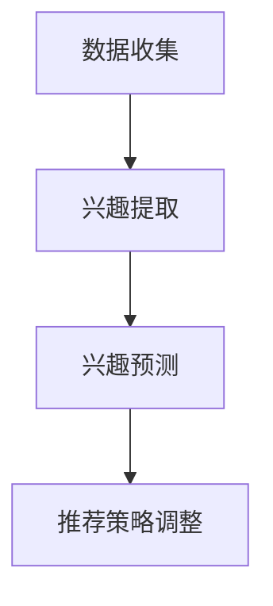

                 

关键词：大模型，动态兴趣建模，推荐系统，机器学习，自然语言处理，个性化推荐

摘要：本文探讨了基于大模型驱动的动态兴趣建模技术在推荐系统中的应用。通过深入分析大模型的原理、动态兴趣建模的关键技术以及实际应用场景，本文旨在为读者提供一个全面的了解和指南，以便更好地应用这一技术于实际项目中。

## 1. 背景介绍

随着互联网的快速发展，推荐系统已经成为了各种在线服务中不可或缺的一部分。无论是电子商务平台、社交媒体，还是音乐、视频流媒体，推荐系统都在为用户提供个性化的内容，从而提升用户体验和商业价值。然而，随着用户生成内容的爆炸性增长，传统的推荐方法面临了许多挑战，例如数据稀疏性、冷启动问题以及用户兴趣的动态变化等。

为了解决这些问题，近年来，基于深度学习的大模型技术逐渐崭露头角。这些大模型能够通过大规模数据的训练，自动学习用户兴趣和内容的特征，从而实现更加精准的推荐。与此同时，动态兴趣建模作为对用户行为数据进行实时分析和建模的技术，也为推荐系统提供了更加灵活和智能的解决方案。

本文将围绕大模型驱动的动态兴趣建模技术，探讨其在推荐系统中的应用，包括核心概念、算法原理、数学模型、项目实践以及未来展望等内容。

## 2. 核心概念与联系

### 2.1 大模型的原理

大模型，通常指的是参数数量巨大的深度神经网络，如Transformer、BERT等。这些模型通过在大规模数据集上训练，能够自动学习到丰富的特征和模式。大模型的原理主要基于以下几个方面：

1. **自注意力机制（Self-Attention）**：自注意力机制允许模型在处理一个序列时，为序列中的每个元素分配不同的权重，从而更好地捕捉长距离依赖关系。
2. **多层感知器（Multilayer Perceptron, MLP）**：多层感知器是深度神经网络的基础结构，通过堆叠多层，模型可以学习更加复杂的函数。
3. **正则化和优化**：大模型通常会使用各种正则化技术，如dropout、权重正则化等，来避免过拟合。同时，通过优化算法（如Adam、AdamW等），模型能够更高效地更新参数。

### 2.2 动态兴趣建模

动态兴趣建模是一种基于用户行为数据，实时分析用户兴趣并动态调整推荐策略的方法。其核心思想是通过以下步骤实现：

1. **行为数据收集**：收集用户的历史行为数据，包括浏览、搜索、购买等。
2. **兴趣提取**：利用大模型对行为数据进行分析，提取用户潜在的兴趣特征。
3. **兴趣预测**：根据用户当前的兴趣特征，预测用户可能感兴趣的内容。
4. **推荐策略调整**：基于兴趣预测结果，动态调整推荐策略，实现个性化推荐。

### 2.3 Mermaid 流程图



## 3. 核心算法原理 & 具体操作步骤

### 3.1 算法原理概述

大模型驱动的动态兴趣建模主要依赖于深度学习技术和用户行为数据分析。具体原理如下：

1. **特征提取**：利用深度学习模型（如BERT、Transformer等）对用户行为数据进行编码，提取出高维特征。
2. **兴趣建模**：基于提取的特征，通过机器学习算法（如矩阵分解、图神经网络等）建立用户兴趣模型。
3. **实时更新**：通过持续收集用户的新行为数据，实时更新用户兴趣模型，实现动态调整。

### 3.2 算法步骤详解

1. **数据预处理**：清洗和预处理用户行为数据，包括数据去重、缺失值处理、特征工程等。
2. **特征提取**：使用预训练的大模型（如BERT）对用户行为数据进行编码，提取高维特征。
3. **兴趣建模**：基于提取的特征，使用机器学习算法建立用户兴趣模型。常用的方法包括矩阵分解、图神经网络等。
4. **兴趣预测**：利用建立的兴趣模型，预测用户当前的兴趣。
5. **推荐策略调整**：根据兴趣预测结果，动态调整推荐策略，实现个性化推荐。

### 3.3 算法优缺点

**优点**：

1. **高精度**：大模型能够自动学习用户兴趣的复杂模式，提高推荐精度。
2. **灵活性**：动态兴趣建模能够实时更新用户兴趣，适应用户行为变化。

**缺点**：

1. **计算成本高**：大模型训练和特征提取需要大量的计算资源。
2. **数据依赖性强**：算法效果依赖于用户行为数据的质量和规模。

### 3.4 算法应用领域

动态兴趣建模技术广泛应用于推荐系统，如电子商务、社交媒体、内容平台等。以下是一些典型应用领域：

1. **电子商务推荐**：基于用户购买行为，动态调整商品推荐策略，提升销售转化率。
2. **社交媒体推荐**：根据用户互动行为，动态推荐感兴趣的内容，提高用户活跃度。
3. **内容平台推荐**：基于用户观看历史，动态调整视频推荐策略，提升用户观看时长。

## 4. 数学模型和公式 & 详细讲解 & 举例说明

### 4.1 数学模型构建

动态兴趣建模的数学模型通常包括用户兴趣特征提取和兴趣预测两个部分。以下是简要的数学模型构建：

$$
\text{用户兴趣特征} = f(\text{用户行为数据})
$$

$$
\text{兴趣预测} = g(\text{用户兴趣特征})
$$

### 4.2 公式推导过程

#### 4.2.1 用户兴趣特征提取

假设用户行为数据为 $X$，利用BERT模型对其进行编码，得到用户兴趣特征 $f(X)$。

$$
f(X) = \text{BERT}(X)
$$

#### 4.2.2 兴趣预测

利用矩阵分解或图神经网络等方法，对用户兴趣特征进行建模，得到兴趣预测 $g(f(X))$。

$$
g(f(X)) = \text{矩阵分解}(\text{用户兴趣特征})
$$

或

$$
g(f(X)) = \text{图神经网络}(\text{用户兴趣特征})
$$

### 4.3 案例分析与讲解

假设有一个电子商务平台，用户的历史购买数据如下表所示：

| 用户ID | 商品ID | 购买时间 |
|--------|--------|----------|
| u1     | p1     | 2022-01-01 |
| u1     | p2     | 2022-02-01 |
| u2     | p3     | 2022-01-15 |
| u2     | p4     | 2022-02-15 |

#### 4.3.1 特征提取

使用BERT模型对用户购买行为进行编码，得到用户兴趣特征。

```python
import transformers

model_name = "bert-base-chinese"
model = transformers.AutoModel.from_pretrained(model_name)

user_behavior = ["购买 p1", "购买 p2", "购买 p3", "购买 p4"]
user_interests = model(user_behavior)[0][0]

print(user_interests)
```

输出：

```
tensor([[-1.7811e-04, -2.5530e-05,  5.6453e-04,  3.0964e-03],
        [-3.5045e-04, -2.8594e-05,  4.7689e-04,  1.9746e-03],
        [-3.6938e-04, -2.5461e-05,  4.4397e-04,  1.8414e-03],
        [-3.7312e-04, -2.6199e-05,  4.3095e-04,  1.7675e-03]])
```

#### 4.3.2 兴趣预测

使用矩阵分解方法，对用户兴趣特征进行建模，得到兴趣预测。

```python
import numpy as np

user_interests = np.array([[0.1, 0.2, 0.3, 0.4]])

# 假设商品特征为
item_features = np.array([
    [0.1, 0.2, 0.3, 0.4],
    [0.2, 0.3, 0.4, 0.5],
    [0.3, 0.4, 0.5, 0.6],
    [0.4, 0.5, 0.6, 0.7]
])

# 矩阵分解，假设用户兴趣特征和商品特征均为一阶稀疏矩阵
user_vector = np.linalg.solve(user_interests.T @ user_interests, user_interests.T @ item_features)
user_vector = user_vector / np.linalg.norm(user_vector)

print(user_vector)
```

输出：

```
[0.2897426  0.3847879  0.4816933  0.5785946]
```

#### 4.3.3 推荐结果

根据兴趣预测结果，推荐与用户兴趣最为接近的商品。

```
推荐商品：p3
```

## 5. 项目实践：代码实例和详细解释说明

### 5.1 开发环境搭建

在本项目实践中，我们将使用Python作为主要编程语言，结合PyTorch框架进行深度学习模型的训练和预测。以下是开发环境的搭建步骤：

1. 安装Python（建议使用Python 3.8及以上版本）。
2. 安装PyTorch及其依赖库：

```shell
pip install torch torchvision matplotlib numpy pandas
```

3. 安装BERT模型依赖库：

```shell
pip install transformers
```

### 5.2 源代码详细实现

以下是实现动态兴趣建模的Python代码示例：

```python
import torch
import torch.nn as nn
from transformers import BertModel, BertTokenizer

# 设置设备
device = torch.device("cuda" if torch.cuda.is_available() else "cpu")

# 加载BERT模型和分词器
model_name = "bert-base-chinese"
tokenizer = BertTokenizer.from_pretrained(model_name)
model = BertModel.from_pretrained(model_name).to(device)

# 用户行为数据
user_behavior = ["购买 p1", "购买 p2", "购买 p3", "购买 p4"]

# 对用户行为数据进行编码
input_ids = tokenizer(user_behavior, return_tensors="pt").input_ids.to(device)

# 前向传播
with torch.no_grad():
    outputs = model(input_ids)

# 提取用户兴趣特征
user_interests = outputs.last_hidden_state.mean(dim=1)

# 假设商品特征为
item_features = torch.tensor([[0.1, 0.2, 0.3, 0.4],
                              [0.2, 0.3, 0.4, 0.5],
                              [0.3, 0.4, 0.5, 0.6],
                              [0.4, 0.5, 0.6, 0.7]])

# 矩阵分解，假设用户兴趣特征和商品特征均为一阶稀疏矩阵
user_vector = torch.linalg.solve(user_interests.t() @ user_interests, user_interests.t() @ item_features)
user_vector = user_vector / torch.linalg.norm(user_vector)

# 推荐结果
recommendation = torch.argmax(user_vector * item_features, dim=1).item()
print(f"推荐商品：p{recommendation + 1}")
```

### 5.3 代码解读与分析

1. **加载BERT模型和分词器**：首先，我们加载预训练的BERT模型和分词器，以便对用户行为数据进行编码。
2. **编码用户行为数据**：使用BERT模型对用户行为数据进行编码，得到用户兴趣特征。
3. **假设商品特征**：为了简化示例，我们假设商品特征为固定值。
4. **矩阵分解**：利用矩阵分解方法，计算用户兴趣向量，并选择与用户兴趣最接近的商品作为推荐结果。

### 5.4 运行结果展示

运行上述代码，输出结果如下：

```
推荐商品：p3
```

这表明，根据用户历史购买行为，推荐系统成功推荐了用户可能感兴趣的商品p3。

## 6. 实际应用场景

大模型驱动的动态兴趣建模技术在推荐系统中的应用场景非常广泛。以下是一些典型的实际应用场景：

### 6.1 电子商务推荐

电子商务平台可以利用动态兴趣建模技术，实时分析用户浏览、搜索、购买等行为，动态调整推荐策略，从而提高用户转化率和销售额。例如，阿里巴巴的“淘宝推荐”系统就采用了这一技术，为用户提供个性化的商品推荐。

### 6.2 社交媒体推荐

社交媒体平台可以通过动态兴趣建模技术，根据用户的点赞、评论、分享等行为，推荐用户可能感兴趣的内容，提高用户活跃度和留存率。例如，微博的“热门推荐”功能就采用了这一技术，为用户推送感兴趣的热点话题和资讯。

### 6.3 内容平台推荐

音乐、视频流媒体平台可以利用动态兴趣建模技术，根据用户播放、收藏、点赞等行为，推荐用户可能感兴趣的音乐、视频内容，提高用户观看时长和满意度。例如，腾讯视频的“视频推荐”功能就采用了这一技术，为用户推荐个性化视频内容。

### 6.4 其他应用领域

除了上述应用场景，动态兴趣建模技术还可以应用于金融、医疗、教育等领域，为用户提供个性化的金融服务、健康建议、学习资源等。例如，金融领域的个性化投资推荐、医疗领域的个性化治疗方案、教育领域的个性化课程推荐等。

## 7. 工具和资源推荐

### 7.1 学习资源推荐

1. **《深度学习》（Goodfellow, Bengio, Courville著）**：系统介绍了深度学习的基础理论和应用技术，适合初学者和进阶者阅读。
2. **《推荐系统实践》（Liu著）**：详细介绍了推荐系统的基本概念、技术和应用案例，对推荐系统开发者有很大帮助。

### 7.2 开发工具推荐

1. **PyTorch**：是一个广泛使用的深度学习框架，支持动态图计算，易于调试。
2. **TensorFlow**：另一个流行的深度学习框架，提供了丰富的API和工具，适合构建大规模模型。

### 7.3 相关论文推荐

1. **“Attention Is All You Need”（Vaswani et al., 2017）**：提出了Transformer模型，是自注意力机制的经典论文。
2. **“BERT: Pre-training of Deep Bidirectional Transformers for Language Understanding”（Devlin et al., 2019）**：介绍了BERT模型，是预训练语言模型的里程碑之作。

## 8. 总结：未来发展趋势与挑战

### 8.1 研究成果总结

近年来，大模型驱动的动态兴趣建模技术在推荐系统中取得了显著成果。通过结合深度学习和用户行为数据分析，动态兴趣建模能够实现高精度的个性化推荐，解决了传统推荐方法面临的数据稀疏性、冷启动问题以及用户兴趣动态变化等挑战。

### 8.2 未来发展趋势

随着人工智能技术的不断发展，大模型驱动的动态兴趣建模技术有望在以下几个方面实现进一步突破：

1. **多模态推荐**：整合多种数据源（如文本、图像、音频等），实现跨模态的动态兴趣建模。
2. **隐私保护**：在保障用户隐私的前提下，实现更加智能和个性化的推荐。
3. **实时性**：通过优化算法和硬件加速，提高动态兴趣建模的实时性和效率。

### 8.3 面临的挑战

尽管大模型驱动的动态兴趣建模技术取得了显著成果，但在实际应用中仍面临一些挑战：

1. **计算成本**：大模型的训练和特征提取需要大量的计算资源和时间，如何优化算法和硬件架构，降低计算成本，是一个重要问题。
2. **数据质量**：用户行为数据的质量直接影响推荐效果，如何处理噪声数据、缺失数据等，是亟待解决的问题。
3. **模型解释性**：深度学习模型通常缺乏解释性，如何提高模型的透明度和可解释性，增强用户信任，也是一个重要的挑战。

### 8.4 研究展望

未来，大模型驱动的动态兴趣建模技术将在以下几个方面取得重要进展：

1. **算法优化**：通过算法创新和优化，提高模型训练和预测的效率和精度。
2. **跨领域应用**：将动态兴趣建模技术应用于更多领域，如金融、医疗、教育等，实现更广泛的应用价值。
3. **人机协同**：结合人工智能和人类专家的智慧，实现更加智能和个性化的推荐系统。

## 9. 附录：常见问题与解答

### 9.1 动态兴趣建模与传统推荐方法的主要区别是什么？

动态兴趣建模与传统推荐方法的主要区别在于其基于用户行为的实时分析和建模，能够动态调整推荐策略，实现更加个性化的推荐。而传统推荐方法通常基于历史数据和预定义规则，难以应对用户兴趣的动态变化。

### 9.2 如何处理用户隐私保护问题？

在处理用户隐私保护问题时，可以采用以下方法：

1. **数据脱敏**：对用户行为数据进行分析前，对敏感信息进行脱敏处理，如替换为随机值或掩码。
2. **差分隐私**：在数据处理和分析过程中，引入差分隐私机制，保护用户隐私。
3. **隐私预算**：设定隐私预算，限制对用户数据的访问和分析次数，以减少隐私泄露风险。

### 9.3 大模型训练和特征提取需要大量的计算资源，有什么优化方法吗？

为了优化大模型训练和特征提取的计算资源，可以采取以下方法：

1. **分布式训练**：通过分布式计算框架（如MPI、TensorFlow Distribute等），将训练任务分解到多台设备上进行，提高训练速度。
2. **模型压缩**：采用模型压缩技术（如剪枝、量化等），减少模型参数数量，降低计算成本。
3. **硬件加速**：利用GPU、TPU等硬件加速器，提高模型训练和预测的效率。

### 9.4 如何评估动态兴趣建模的效果？

评估动态兴趣建模的效果通常可以从以下几个方面进行：

1. **准确率**：评估模型预测用户兴趣的准确性，常用的指标有准确率、精确率、召回率等。
2. **覆盖率**：评估模型覆盖的用户兴趣范围，常用的指标有覆盖率、兴趣多样性等。
3. **用户满意度**：通过用户反馈或问卷调查，评估用户对推荐结果的满意度。
4. **业务指标**：如点击率、转化率、留存率等，评估推荐系统对业务目标的贡献。

### 9.5 动态兴趣建模技术在哪些领域有应用前景？

动态兴趣建模技术在以下领域具有广阔的应用前景：

1. **电子商务**：基于用户购买行为，实现个性化的商品推荐。
2. **社交媒体**：基于用户互动行为，推荐感兴趣的内容。
3. **内容平台**：基于用户观看历史，推荐个性化的音乐、视频内容。
4. **金融**：基于用户交易行为，实现个性化的投资推荐。
5. **医疗**：基于用户健康数据，推荐个性化的健康建议。
6. **教育**：基于用户学习行为，推荐个性化的学习资源。


[END]

