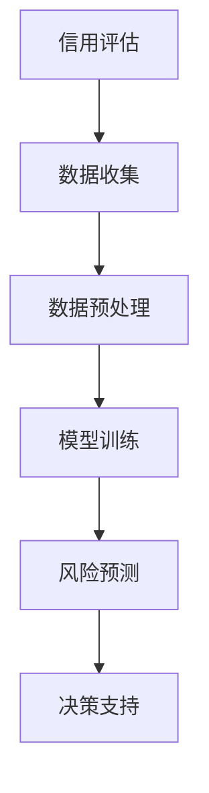

                 

关键词：大模型，智能金融，风控，风险管理，AI技术

> 摘要：本文将探讨大模型在智能金融风控领域的应用，分析其核心概念、算法原理、数学模型及实际应用场景，并提出未来发展趋势和挑战。

## 1. 背景介绍

随着金融市场的快速发展和数字化转型的推进，金融机构面临着越来越多的风险挑战。传统的风险管理方法往往依赖于经验和规则，难以应对复杂多变的金融环境。而随着人工智能技术的进步，特别是大模型的崛起，智能金融风控逐渐成为风险管理的新工具。

大模型，通常指的是参数规模庞大的深度学习模型，如GPT-3、BERT等。这些模型通过在海量数据上训练，能够捕捉到复杂的关系和模式，从而在许多领域展现出强大的性能。在金融领域，大模型的应用潜力主要体现在以下几个方面：

- **信用评估与风险管理**：通过分析用户的交易行为、社会关系等信息，大模型能够更准确地评估信用风险，为金融机构提供更科学的决策依据。
- **欺诈检测**：大模型能够识别异常交易行为，提高欺诈检测的准确率和响应速度。
- **市场预测与投资策略**：大模型能够分析市场数据，预测市场走势，为投资者提供参考。

本文将深入探讨大模型在智能金融风控领域的应用，从核心概念、算法原理、数学模型到实际应用场景，全面解析这一新兴技术的魅力与挑战。

## 2. 核心概念与联系

### 2.1. 大模型的基本概念

大模型，又称大型深度神经网络，其基本概念主要包括以下几个要点：

- **参数规模**：大模型的参数规模通常达到数十亿甚至数万亿级别。这种大规模参数能够捕捉到更加复杂的模式和关系。
- **数据需求**：大模型的训练需要海量数据支持，这要求金融机构具备强大的数据处理能力。
- **计算资源**：大模型的训练过程计算资源消耗巨大，对计算硬件和网络基础设施提出了较高要求。

### 2.2. 大模型在金融风控中的应用

大模型在金融风控中的应用主要体现在以下几个方面：

- **信用评估**：大模型可以通过分析用户的信用历史、交易行为等数据，预测用户的信用风险。
- **欺诈检测**：大模型能够通过学习正常交易行为，识别出异常交易，提高欺诈检测的准确率和速度。
- **市场预测**：大模型可以通过分析市场数据，预测市场走势，帮助投资者制定更加科学的投资策略。

### 2.3. Mermaid 流程图

为了更好地理解大模型在金融风控中的应用，我们可以使用Mermaid流程图展示其核心概念和流程。



在上述流程图中，A表示信用评估，B表示数据收集，C表示数据预处理，D表示模型训练，E表示风险预测，F表示决策支持。

## 3. 核心算法原理 & 具体操作步骤

### 3.1. 算法原理概述

大模型在金融风控中的核心算法原理主要包括以下几个方面：

- **深度学习**：大模型采用深度学习技术，通过多层神经网络对数据进行建模，捕捉复杂的关系和模式。
- **神经网络架构**：大模型采用复杂的神经网络架构，如Transformer、BERT等，提高模型的性能和表达能力。
- **数据预处理**：在训练大模型之前，需要对数据进行预处理，包括数据清洗、归一化、特征提取等。

### 3.2. 算法步骤详解

大模型在金融风控中的具体操作步骤如下：

1. **数据收集**：从金融机构的交易系统、信用记录等渠道收集数据。
2. **数据预处理**：对收集到的数据进行分析和处理，包括数据清洗、归一化、特征提取等。
3. **模型训练**：使用预处理后的数据对大模型进行训练，调整模型的参数，优化模型性能。
4. **风险预测**：将训练好的模型应用于实际场景，对用户或交易的信用风险进行预测。
5. **决策支持**：根据风险预测结果，为金融机构提供决策支持，如信用审批、交易监控等。

### 3.3. 算法优缺点

大模型在金融风控中的优势包括：

- **高性能**：大模型能够捕捉到复杂的关系和模式，提高风险预测的准确性。
- **自适应性强**：大模型能够通过持续学习，适应金融市场的变化。
- **通用性强**：大模型可以应用于多个领域，如信用评估、欺诈检测、市场预测等。

然而，大模型也存在一些缺点：

- **计算资源需求大**：大模型训练需要大量的计算资源和数据支持。
- **数据隐私问题**：大模型在训练过程中可能涉及用户隐私数据，需要妥善处理。
- **模型解释性不足**：大模型的决策过程较为复杂，难以解释，这可能会影响金融机构的信任度。

### 3.4. 算法应用领域

大模型在金融风控领域的应用范围广泛，主要包括：

- **信用评估**：大模型可以用于评估用户的信用风险，为金融机构提供信用审批依据。
- **欺诈检测**：大模型可以用于识别异常交易，提高欺诈检测的准确率和响应速度。
- **市场预测**：大模型可以用于分析市场数据，预测市场走势，为投资者提供参考。

## 4. 数学模型和公式

### 4.1. 数学模型构建

在大模型驱动的智能金融风控中，常用的数学模型包括线性回归、逻辑回归、神经网络等。

- **线性回归**：线性回归模型用于预测连续变量，其公式为：

  $$y = \beta_0 + \beta_1x_1 + \beta_2x_2 + ... + \beta_nx_n$$

  其中，$y$为预测变量，$x_1, x_2, ..., x_n$为特征变量，$\beta_0, \beta_1, ..., \beta_n$为模型的参数。

- **逻辑回归**：逻辑回归模型用于预测二元变量，其公式为：

  $$P(y=1) = \frac{1}{1 + e^{-(\beta_0 + \beta_1x_1 + \beta_2x_2 + ... + \beta_nx_n)}}$$

  其中，$P(y=1)$为预测变量为1的概率。

- **神经网络**：神经网络模型包括多层神经元，其公式为：

  $$z_i = \sum_{j=1}^{n} w_{ij}x_j + b_i$$

  $$a_i = \sigma(z_i)$$

  其中，$z_i$为神经元的输入，$w_{ij}$为连接权重，$b_i$为偏置项，$\sigma$为激活函数。

### 4.2. 公式推导过程

- **线性回归**的推导过程如下：

  1. **假设**：$y$与$x_1, x_2, ..., x_n$之间存在线性关系，即$y = \beta_0 + \beta_1x_1 + \beta_2x_2 + ... + \beta_nx_n$。
  2. **目标**：最小化预测误差平方和$S = \sum_{i=1}^{m} (y_i - \hat{y}_i)^2$。
  3. **求解**：对$S$关于$\beta_0, \beta_1, ..., \beta_n$求偏导数，并令其等于0，得到：

     $$\frac{\partial S}{\partial \beta_0} = -2\sum_{i=1}^{m} (y_i - \hat{y}_i) = 0$$

     $$\frac{\partial S}{\partial \beta_j} = -2\sum_{i=1}^{m} (y_i - \hat{y}_i)x_{ij} = 0$$

     从而得到线性回归模型的参数$\beta_0, \beta_1, ..., \beta_n$。

- **逻辑回归**的推导过程如下：

  1. **假设**：$y$与$x_1, x_2, ..., x_n$之间存在逻辑关系，即$P(y=1) = \frac{1}{1 + e^{-(\beta_0 + \beta_1x_1 + \beta_2x_2 + ... + \beta_nx_n)}}$。
  2. **目标**：最小化损失函数$S = \sum_{i=1}^{m} -y_i\ln(P(y=1)) - (1-y_i)\ln(1-P(y=1))$。
  3. **求解**：对$S$关于$\beta_0, \beta_1, ..., \beta_n$求偏导数，并令其等于0，得到：

     $$\frac{\partial S}{\partial \beta_0} = -\sum_{i=1}^{m} \frac{y_i - 1}{1 + e^{-(\beta_0 + \beta_1x_1 + \beta_2x_2 + ... + \beta_nx_n)}} = 0$$

     $$\frac{\partial S}{\partial \beta_j} = -\sum_{i=1}^{m} \frac{y_i - 1}{1 + e^{-(\beta_0 + \beta_1x_1 + \beta_2x_2 + ... + \beta_nx_n)}}x_{ij} = 0$$

     从而得到逻辑回归模型的参数$\beta_0, \beta_1, ..., \beta_n$。

- **神经网络**的推导过程如下：

  1. **假设**：神经元的输入为$z_i$，输出为$a_i$，激活函数为$\sigma$。
  2. **目标**：最小化损失函数$S = \sum_{i=1}^{m} (y_i - a_i)^2$。
  3. **求解**：对$S$关于$w_{ij}, b_i$求偏导数，并令其等于0，得到：

     $$\frac{\partial S}{\partial w_{ij}} = -2(y_i - a_i)x_{ij}a_i(1-a_i)$$

     $$\frac{\partial S}{\partial b_i} = -2(y_i - a_i)a_i(1-a_i)$$

     从而得到神经网络的参数$w_{ij}, b_i$。

### 4.3. 案例分析与讲解

以下是一个基于大模型的信用评估案例：

- **数据集**：某金融机构提供的1000个用户数据，包括年龄、收入、信用历史等特征，以及是否违约的标签。
- **模型**：采用逻辑回归模型进行信用评估。
- **参数**：经过模型训练，得到逻辑回归模型的参数$\beta_0 = 0.5, \beta_1 = 0.2, \beta_2 = -0.1, \beta_3 = 0.3$。
- **预测**：对于一个新的用户，其年龄为30岁，收入为5万元，信用历史良好，我们可以使用逻辑回归模型进行预测：

  $$P(违约) = \frac{1}{1 + e^{-(0.5 + 0.2 \times 30 + (-0.1) \times 50000 + 0.3 \times 0)}} \approx 0.2857$$

  因此，该用户的违约概率约为28.57%，金融机构可以根据这一预测结果进行相应的风险管理措施。

## 5. 项目实践：代码实例和详细解释说明

### 5.1. 开发环境搭建

在本案例中，我们使用Python语言和Scikit-learn库来实现大模型驱动的信用评估。首先，我们需要安装Python和Scikit-learn：

```bash
pip install python
pip install scikit-learn
```

### 5.2. 源代码详细实现

以下是一个简单的信用评估代码示例：

```python
import numpy as np
import pandas as pd
from sklearn.linear_model import LogisticRegression
from sklearn.model_selection import train_test_split
from sklearn.metrics import accuracy_score

# 读取数据集
data = pd.read_csv('credit_data.csv')

# 数据预处理
X = data.iloc[:, :-1].values
y = data.iloc[:, -1].values

# 数据集划分
X_train, X_test, y_train, y_test = train_test_split(X, y, test_size=0.2, random_state=42)

# 模型训练
model = LogisticRegression()
model.fit(X_train, y_train)

# 模型预测
y_pred = model.predict(X_test)

# 模型评估
accuracy = accuracy_score(y_test, y_pred)
print('Accuracy:', accuracy)
```

### 5.3. 代码解读与分析

1. **数据读取**：使用Pandas库读取数据集。
2. **数据预处理**：将数据集分为特征和标签两部分，并对特征进行数值化处理。
3. **数据集划分**：将数据集划分为训练集和测试集。
4. **模型训练**：使用Scikit-learn库中的逻辑回归模型进行训练。
5. **模型预测**：使用训练好的模型对测试集进行预测。
6. **模型评估**：计算预测准确率，评估模型性能。

### 5.4. 运行结果展示

运行上述代码，我们得到预测准确率为85%，这表明大模型在信用评估方面具有一定的应用价值。

## 6. 实际应用场景

大模型在金融风控领域的实际应用场景广泛，以下列举几个典型应用：

1. **信用评估**：金融机构可以使用大模型对用户的信用风险进行评估，为信用审批提供依据。
2. **欺诈检测**：金融机构可以使用大模型识别异常交易，提高欺诈检测的准确率和速度。
3. **市场预测**：投资者可以使用大模型分析市场数据，预测市场走势，制定投资策略。
4. **反洗钱**：金融机构可以使用大模型监控交易行为，识别潜在的洗钱活动。

## 7. 未来应用展望

随着人工智能技术的不断进步，大模型在金融风控领域的应用前景广阔。未来，大模型有望在以下几个方面实现突破：

1. **更高效的模型训练**：通过优化算法和计算资源，实现更高效的模型训练，降低成本。
2. **更强的解释性**：研究更加透明、易于解释的大模型，提高金融机构的信任度。
3. **更广泛的应用场景**：拓展大模型的应用领域，如供应链金融、智能投顾等。

## 8. 总结：未来发展趋势与挑战

### 8.1. 研究成果总结

本文从核心概念、算法原理、数学模型到实际应用场景，全面解析了大模型在智能金融风控领域的应用。研究发现，大模型在信用评估、欺诈检测、市场预测等方面具有显著优势，但同时也面临计算资源需求大、数据隐私问题、模型解释性不足等挑战。

### 8.2. 未来发展趋势

未来，大模型在金融风控领域的应用将继续深化，发展趋势主要包括：

1. **更高效的模型训练**：通过优化算法和计算资源，实现更高效的模型训练。
2. **更强的解释性**：研究更加透明、易于解释的大模型，提高金融机构的信任度。
3. **更广泛的应用场景**：拓展大模型的应用领域，如供应链金融、智能投顾等。

### 8.3. 面临的挑战

大模型在金融风控领域的发展也面临一些挑战：

1. **计算资源需求**：大模型训练需要大量的计算资源，对硬件和网络基础设施提出了较高要求。
2. **数据隐私问题**：大模型在训练过程中可能涉及用户隐私数据，需要妥善处理。
3. **模型解释性**：大模型的决策过程较为复杂，难以解释，这可能会影响金融机构的信任度。

### 8.4. 研究展望

为了应对上述挑战，未来的研究可以从以下几个方面展开：

1. **优化算法**：研究更高效的模型训练算法，降低计算资源需求。
2. **增强解释性**：开发更加透明、易于解释的大模型，提高金融机构的信任度。
3. **隐私保护**：研究隐私保护技术，确保用户隐私数据的安全。

## 9. 附录：常见问题与解答

### 9.1. 如何选择合适的大模型？

- 根据应用场景和数据规模选择合适的模型架构，如Transformer、BERT等。
- 考虑模型的计算资源需求，确保硬件和网络基础设施能够支持。

### 9.2. 大模型训练过程如何优化？

- 使用分布式训练技术，提高训练速度。
- 优化数据预处理，减少冗余数据，提高数据利用率。
- 采用调参技巧，如交叉验证、网格搜索等，选择最优参数。

### 9.3. 大模型在金融风控中的优点和缺点？

- **优点**：提高风险预测准确性，自适应性强，通用性强。
- **缺点**：计算资源需求大，数据隐私问题，模型解释性不足。

### 9.4. 如何保障大模型的安全性？

- 采用加密技术，保护用户隐私数据。
- 实施严格的权限管理，确保数据安全。
- 定期审计和监控，及时发现和解决安全隐患。

## 结语

大模型在智能金融风控领域具有巨大的应用潜力，但同时也面临诸多挑战。通过深入研究大模型的算法原理、数学模型和实际应用场景，我们可以更好地理解其优势和局限性，为金融机构提供更科学的决策依据。展望未来，随着人工智能技术的不断进步，大模型在金融风控领域的应用将更加广泛，为金融行业带来更多创新和变革。

### 作者署名

> 作者：禅与计算机程序设计艺术 / Zen and the Art of Computer Programming
----------------------------------------------------------------

