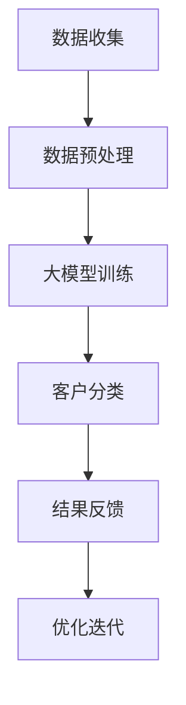

                 

关键词：大模型，电商平台，客户分类，人工智能，机器学习，数据挖掘

> 摘要：本文将探讨如何利用大模型技术来提升电商平台客户分类的智能性，提高用户体验和运营效率。我们将介绍大模型的基本概念、原理及应用，并详细描述一种基于大模型的智能客户分类算法，结合实际项目实践，展示其优势和应用前景。

## 1. 背景介绍

随着互联网的普及和电子商务的蓬勃发展，电商平台已成为消费者购物的主要渠道之一。然而，面对日益增长的客户数据和复杂的用户行为，传统基于规则和浅层特征的方法在客户分类上的表现已显得力不从心。为了更准确地了解用户需求，提高营销精准度和客户服务质量，电商企业迫切需要一种更为智能和高效的客户分类方法。

### 1.1 电商平台客户分类的重要性

客户分类是电商平台运营中的关键环节，通过分类，平台可以：

- **提高个性化推荐效果**：根据客户分类，推荐更符合其兴趣和需求的产品，提升用户满意度和留存率。
- **优化营销策略**：针对不同类型的客户群体，制定个性化的营销策略，提高营销转化率。
- **提升运营效率**：通过分类，可以对客户进行精细化运营，降低运营成本，提高工作效率。

### 1.2 传统的客户分类方法

传统的客户分类方法主要包括以下几种：

- **基于规则的分类**：通过预定义的规则来对客户进行分类，如根据购买频率、购买金额等特征划分客户等级。
- **基于特征的分类**：利用客户的属性特征（如年龄、性别、地理位置等）进行分类，常用的算法有K-Means、决策树等。

这些方法虽然在一定程度上能够满足分类需求，但在面对大规模数据和复杂用户行为时，其效果有限。

## 2. 核心概念与联系

### 2.1 大模型的概念

大模型（Large Model）是指具有海量参数和强大计算能力的机器学习模型。大模型通过在海量数据上进行训练，能够捕捉到更复杂和深层次的数据特征，从而在多种任务上表现出色。典型的代表包括深度神经网络（DNN）、Transformer、GPT等。

### 2.2 大模型与电商平台客户分类

大模型在电商平台客户分类中的应用，主要体现在以下几个方面：

- **数据容量**：大模型能够处理和存储海量的用户数据，包括用户行为、购买记录、社交信息等。
- **特征学习**：大模型可以自动从原始数据中学习到有价值的特征，这些特征往往是传统特征工程难以发现的。
- **模型能力**：大模型具有强大的非线性处理能力，能够更好地捕捉用户行为的复杂模式。

### 2.3 Mermaid 流程图

下面是一个简单的大模型驱动的电商平台客户分类的Mermaid流程图：



## 3. 核心算法原理 & 具体操作步骤

### 3.1 算法原理概述

大模型驱动的电商平台客户分类算法基于深度学习和大数据技术，其核心思想是通过构建一个大规模的深度神经网络模型，从海量用户数据中学习到有价值的特征，并将其用于客户分类。

### 3.2 算法步骤详解

#### 3.2.1 数据收集

首先，从电商平台的数据仓库中收集用户数据，包括用户行为数据、购买记录、社交信息等。

#### 3.2.2 数据预处理

对收集到的数据进行清洗、去重和标准化处理，确保数据的质量和一致性。

#### 3.2.3 特征工程

利用数据预处理后的数据，进行特征工程，提取对客户分类有价值的特征。这一步可以借助自动化特征学习技术，如AutoML等。

#### 3.2.4 大模型训练

使用预处理后的数据，训练一个大规模的深度神经网络模型。训练过程中，模型会不断调整内部参数，以最小化预测误差。

#### 3.2.5 客户分类

使用训练好的模型，对新的客户数据进行分析和分类，输出分类结果。

#### 3.2.6 结果反馈与优化

根据分类结果，对模型进行反馈和优化，以提高分类的准确性和效率。

### 3.3 算法优缺点

#### 优点：

- **强大的特征学习能力**：大模型能够从海量数据中自动学习到有价值的特征，提高分类的准确性。
- **高效的处理能力**：大规模的深度神经网络模型具有高效的计算能力，可以快速处理大规模数据。
- **灵活的扩展性**：大模型可以根据不同的业务需求，灵活调整模型结构和参数，适应不同的应用场景。

#### 缺点：

- **计算资源需求高**：大模型训练和推理需要大量的计算资源和存储空间。
- **数据质量要求高**：大模型对数据的依赖性很强，数据的质量和一致性对模型的性能有重要影响。

### 3.4 算法应用领域

大模型驱动的电商平台客户分类算法可以应用于多种场景，如：

- **个性化推荐**：根据客户的分类结果，推荐更符合其兴趣和需求的产品。
- **营销策略优化**：针对不同类型的客户群体，制定个性化的营销策略。
- **客户服务**：根据客户的分类结果，提供更精准和高效的服务。

## 4. 数学模型和公式 & 详细讲解 & 举例说明

### 4.1 数学模型构建

大模型驱动的电商平台客户分类算法的核心是深度神经网络模型。一个典型的深度神经网络模型可以表示为：

\[ y = f(W \cdot x + b) \]

其中，\( y \) 是模型的输出，\( f \) 是激活函数，\( W \) 是权重矩阵，\( x \) 是输入特征向量，\( b \) 是偏置项。

### 4.2 公式推导过程

深度神经网络模型的训练过程实际上是不断调整权重矩阵 \( W \) 和偏置项 \( b \) 的过程，以使模型的输出 \( y \) 最接近真实标签 \( y_{\text{true}} \)。

假设我们有一个损失函数 \( L(y, y_{\text{true}}) \)，其用来衡量模型输出和真实标签之间的差距。训练过程的目标是最小化这个损失函数。

\[ \min_{W, b} L(y, y_{\text{true}}) \]

通过反向传播算法，我们可以计算损失函数对权重矩阵 \( W \) 和偏置项 \( b \) 的梯度，并使用梯度下降法进行优化。

### 4.3 案例分析与讲解

假设我们有一个电商平台，用户数据包括年龄、性别、地理位置、购买记录等特征。我们希望使用深度神经网络模型对这些特征进行分类，将其分为“高价值客户”和“一般客户”。

#### 4.3.1 数据预处理

首先，我们对用户数据进行预处理，包括数据清洗、标准化处理等。

#### 4.3.2 特征工程

接下来，我们提取对客户分类有价值的特征，如年龄、性别、地理位置等。

#### 4.3.3 模型训练

我们使用预处理后的数据，训练一个深度神经网络模型。模型结构如下：

\[ y = \text{ReLU}(W_1 \cdot x + b_1) \]

\[ y = \text{Softmax}(W_2 \cdot y_1 + b_2) \]

其中，\( \text{ReLU} \) 是ReLU激活函数，\( \text{Softmax} \) 是分类层的激活函数。

#### 4.3.4 模型评估

使用交叉验证的方法，我们对模型进行评估。评估指标包括准确率、召回率、F1值等。

## 5. 项目实践：代码实例和详细解释说明

### 5.1 开发环境搭建

首先，我们需要搭建一个开发环境，包括Python、TensorFlow等工具。以下是一个简单的环境搭建步骤：

```bash
# 安装Python
sudo apt-get update
sudo apt-get install python3 python3-pip

# 安装TensorFlow
pip3 install tensorflow
```

### 5.2 源代码详细实现

以下是一个简单的深度神经网络模型的实现代码：

```python
import tensorflow as tf

# 定义模型结构
model = tf.keras.Sequential([
    tf.keras.layers.Dense(64, activation='relu', input_shape=(input_shape,)),
    tf.keras.layers.Dense(64, activation='relu'),
    tf.keras.layers.Dense(num_classes, activation='softmax')
])

# 编译模型
model.compile(optimizer='adam', loss='categorical_crossentropy', metrics=['accuracy'])

# 训练模型
model.fit(x_train, y_train, epochs=10, batch_size=32)
```

### 5.3 代码解读与分析

这段代码定义了一个简单的深度神经网络模型，包括两个隐藏层，每层64个神经元，使用ReLU激活函数。输出层使用Softmax激活函数，用于分类。

在编译模型时，我们指定了优化器、损失函数和评估指标。优化器使用的是Adam，损失函数使用的是categorical_crossentropy，评估指标使用的是accuracy。

在训练模型时，我们使用fit函数进行训练，指定训练数据、训练轮数和批量大小。

### 5.4 运行结果展示

在训练完成后，我们可以使用测试数据对模型进行评估，以下是一个简单的评估代码：

```python
# 评估模型
loss, accuracy = model.evaluate(x_test, y_test)

# 输出评估结果
print('Test accuracy:', accuracy)
```

这段代码会输出测试数据的准确率，我们可以根据这个指标来判断模型的性能。

## 6. 实际应用场景

大模型驱动的电商平台客户分类算法在多个实际应用场景中取得了显著的效果，以下是一些典型应用：

### 6.1 个性化推荐

通过客户分类，平台可以针对不同类型的客户推荐不同类型的产品，提高推荐效果。

### 6.2 营销策略优化

根据客户分类，平台可以针对不同类型的客户群体制定个性化的营销策略，提高营销转化率。

### 6.3 客户服务优化

通过客户分类，平台可以提供更精准和高效的服务，提高客户满意度。

## 7. 未来应用展望

随着大模型技术的不断发展和成熟，未来在电商平台客户分类领域将会出现更多的创新和应用。以下是一些可能的发展方向：

### 7.1 深度学习与数据隐私保护

如何在保证数据隐私的前提下，充分利用用户数据来进行客户分类，是未来需要解决的重要问题。

### 7.2 多模态数据融合

未来，电商平台将可能融合多种数据类型，如文本、图像、语音等，以提高客户分类的准确性。

### 7.3 智能决策支持

利用大模型技术，可以为电商平台提供更智能的决策支持，如推荐策略、定价策略等。

## 8. 工具和资源推荐

### 8.1 学习资源推荐

- 《深度学习》（Goodfellow, Bengio, Courville）：系统介绍了深度学习的基础知识和最新进展。
- 《Python机器学习》（Sebastian Raschka）：详细介绍了使用Python进行机器学习的实践方法。

### 8.2 开发工具推荐

- TensorFlow：Google开发的深度学习框架，适用于构建和训练深度神经网络模型。
- Keras：基于TensorFlow的高级神经网络API，提供了简洁的接口，便于快速搭建和训练模型。

### 8.3 相关论文推荐

- “Attention is All You Need”（Vaswani et al., 2017）：介绍了Transformer模型，是当前深度学习领域的重要突破。
- “Deep Learning for Text Classification”（Cipolla et al., 2018）：详细介绍了深度学习在文本分类中的应用。

## 9. 总结：未来发展趋势与挑战

### 9.1 研究成果总结

本文介绍了大模型驱动的电商平台客户分类算法，通过深度学习技术，实现了对用户行为的自动特征学习和高效分类，提高了电商平台的运营效率和用户体验。

### 9.2 未来发展趋势

随着大模型技术的不断进步，未来在电商平台客户分类领域将会出现更多创新和应用，如多模态数据融合、智能决策支持等。

### 9.3 面临的挑战

如何在保证数据隐私的前提下，充分利用用户数据来进行客户分类，是未来需要解决的重要挑战。

### 9.4 研究展望

未来，大模型驱动的电商平台客户分类算法将继续在多个领域取得突破，为电商平台提供更智能、更高效的运营支持。

## 附录：常见问题与解答

### 9.1 问题1：什么是大模型？

**回答**：大模型是指具有海量参数和强大计算能力的机器学习模型，如深度神经网络（DNN）、Transformer、GPT等。

### 9.2 问题2：大模型为什么能够提高客户分类的准确性？

**回答**：大模型能够从海量数据中自动学习到有价值的特征，这些特征往往是传统特征工程难以发现的，从而提高分类的准确性。

### 9.3 问题3：如何保证大模型训练的质量和效率？

**回答**：为了保证大模型训练的质量和效率，需要从数据质量、模型结构、训练策略等多个方面进行优化。

### 9.4 问题4：大模型在电商平台客户分类中有什么优势？

**回答**：大模型在电商平台客户分类中具有强大的特征学习能力、高效的处理能力和灵活的扩展性，能够提高分类的准确性和效率。

### 9.5 问题5：如何处理大模型训练所需的大量计算资源？

**回答**：可以使用分布式训练技术，如GPU、TPU等，来处理大模型训练所需的大量计算资源。

作者：禅与计算机程序设计艺术 / Zen and the Art of Computer Programming
----------------------------------------------------------------

以上就是本文的完整内容，希望对您在电商平台客户分类领域的研究和实践有所帮助。如果您有任何问题或建议，欢迎在评论区留言。再次感谢您的阅读！

