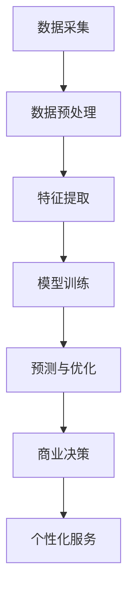

                 

关键词：大模型、商业智能、人工智能、技术趋势、应用场景、未来发展

摘要：本文将深入探讨大模型在商业智能领域的应用，分析其核心概念、算法原理、数学模型以及实际案例，并对未来的发展趋势与挑战进行展望。

## 1. 背景介绍

随着人工智能技术的快速发展，大模型作为机器学习领域的重要成果，正逐渐成为商业智能的下一个前沿。大模型，通常指的是参数规模达到亿级甚至千亿级的深度学习模型，如GPT-3、BERT等。这些模型具有强大的表征能力和推理能力，能够处理复杂的业务场景，为商业决策提供有力的支持。

商业智能（BI）是指使用数据分析技术来帮助企业和组织做出更明智的决策。传统BI主要依赖于数据分析、数据挖掘等技术，而随着大数据、云计算等技术的普及，商业智能的应用范围不断扩大。如今，大模型的出现为商业智能注入了新的活力，使其在处理复杂业务问题和提供个性化服务方面更具优势。

## 2. 核心概念与联系

### 2.1 大模型的概念

大模型，即具有大量参数的深度学习模型，其核心在于对大量数据进行训练，从而学习到数据中的潜在规律和模式。大模型通常采用神经网络架构，通过层层神经网络层对输入数据进行处理，实现数据的分层表示和抽象。

### 2.2 商业智能的概念

商业智能是指利用数据分析、数据挖掘、数据可视化等技术，帮助企业或组织从大量数据中提取有价值的信息，为决策提供支持。商业智能不仅包括传统的数据分析方法，还涵盖了大数据技术、云计算等新兴技术。

### 2.3 大模型与商业智能的联系

大模型在商业智能中的应用主要体现在以下几个方面：

1. **数据预处理**：大模型能够自动进行数据预处理，如数据清洗、归一化等，降低数据处理的难度。

2. **特征提取**：大模型具有强大的特征提取能力，能够从原始数据中自动提取出对业务决策有价值的特征。

3. **预测与优化**：大模型能够进行精准的预测和优化，为商业决策提供支持。

4. **个性化服务**：大模型能够根据用户的历史行为和偏好，提供个性化的推荐和服务。

### 2.4 Mermaid 流程图

以下是一个简化的Mermaid流程图，展示了大模型在商业智能中的应用流程：



## 3. 核心算法原理 & 具体操作步骤

### 3.1 算法原理概述

大模型的算法原理主要基于深度学习和神经网络。深度学习是一种机器学习方法，通过多层神经网络对数据进行学习，实现对数据的分层表征和抽象。神经网络则是一种由多个神经元组成的计算模型，通过调整神经元之间的连接权重，实现对输入数据的分类、回归等操作。

### 3.2 算法步骤详解

1. **数据采集**：首先，从企业内外部数据源收集数据，如用户行为数据、市场数据、财务数据等。

2. **数据预处理**：对采集到的数据进行清洗、归一化等预处理操作，以确保数据质量。

3. **特征提取**：利用大模型的特征提取能力，从预处理后的数据中提取出对业务决策有价值的特征。

4. **模型训练**：使用大量的训练数据，通过反向传播算法，调整神经网络中的连接权重，使得模型能够准确预测和优化业务问题。

5. **预测与优化**：利用训练好的模型，对新的数据进行预测和优化，为商业决策提供支持。

6. **个性化服务**：根据用户的历史行为和偏好，利用大模型提供个性化的推荐和服务。

### 3.3 算法优缺点

**优点**：

1. **强大的表征能力**：大模型能够自动提取数据中的潜在规律和模式，降低人为干预。
2. **高效的预测与优化**：大模型能够对复杂业务问题进行精准预测和优化，提高决策效率。
3. **个性化服务**：大模型能够根据用户的历史行为和偏好，提供个性化的推荐和服务。

**缺点**：

1. **计算资源消耗大**：大模型训练需要大量的计算资源和时间。
2. **数据质量要求高**：数据质量直接影响大模型的性能，对数据清洗和处理要求较高。

### 3.4 算法应用领域

大模型在商业智能领域的应用非常广泛，包括但不限于：

1. **市场营销**：通过分析用户行为数据，预测潜在客户，实现精准营销。
2. **供应链管理**：优化库存管理，预测市场需求，提高供应链效率。
3. **风险控制**：分析金融数据，预测信用风险，降低贷款违约率。
4. **客户服务**：提供个性化服务，提高客户满意度。

## 4. 数学模型和公式 & 详细讲解 & 举例说明

### 4.1 数学模型构建

大模型的数学模型主要基于深度学习和神经网络。以下是一个简化的神经网络模型：

$$
\begin{aligned}
&z^{(l)} = \sigma(W^{(l)} \cdot a^{(l-1)} + b^{(l)}) \\
&a^{(l)} = \sigma(z^{(l)}) \\
\end{aligned}
$$

其中，$z^{(l)}$ 表示第 $l$ 层的输出，$a^{(l-1)}$ 表示第 $l-1$ 层的输入，$W^{(l)}$ 和 $b^{(l)}$ 分别表示第 $l$ 层的权重和偏置，$\sigma$ 表示激活函数。

### 4.2 公式推导过程

以多层感知机（MLP）为例，介绍神经网络的公式推导过程：

1. **输入层到隐藏层**：

$$
\begin{aligned}
&z^{(2)} = W^{(2)} \cdot a^{(1)} + b^{(2)} \\
&a^{(2)} = \sigma(z^{(2)})
\end{aligned}
$$

2. **隐藏层到输出层**：

$$
\begin{aligned}
&z^{(3)} = W^{(3)} \cdot a^{(2)} + b^{(3)} \\
&a^{(3)} = \sigma(z^{(3)})
\end{aligned}
$$

### 4.3 案例分析与讲解

以GPT-3模型为例，分析其数学模型和算法原理。GPT-3模型是一个基于Transformer架构的预训练语言模型，其核心思想是通过对大量文本数据进行预训练，使得模型能够自动学习语言模式和规则。

1. **文本表示**：

GPT-3模型将文本数据表示为序列向量，每个词或字符都对应一个向量。通过嵌入层（Embedding Layer），将输入的词或字符转换为向量表示。

2. **自注意力机制**：

GPT-3模型采用自注意力机制（Self-Attention Mechanism），使得模型在处理文本数据时能够自动关注到文本中的关键信息。自注意力机制通过计算每个词或字符之间的相似度，为每个词或字符分配不同的权重。

3. **编码器和解码器**：

GPT-3模型由编码器（Encoder）和解码器（Decoder）两部分组成。编码器将输入的文本数据编码为一个固定长度的向量，解码器则根据编码器的输出生成文本序列。

4. **预训练和微调**：

GPT-3模型通过大规模的预训练（Pre-training）学习语言模式和规则，然后通过微调（Fine-tuning）适应具体的业务场景。

## 5. 项目实践：代码实例和详细解释说明

### 5.1 开发环境搭建

1. **安装Python**：确保已安装Python 3.7及以上版本。

2. **安装依赖库**：安装TensorFlow、NumPy、Pandas等依赖库。

3. **数据准备**：从公开数据源获取用户行为数据，如淘宝用户行为数据。

### 5.2 源代码详细实现

以下是一个简化的用户行为预测的Python代码示例：

```python
import tensorflow as tf
from tensorflow.keras.models import Sequential
from tensorflow.keras.layers import Dense, Dropout

# 数据预处理
# ...

# 构建模型
model = Sequential([
    Dense(128, activation='relu', input_shape=(num_features,)),
    Dropout(0.2),
    Dense(64, activation='relu'),
    Dropout(0.2),
    Dense(1, activation='sigmoid')
])

# 编译模型
model.compile(optimizer='adam', loss='binary_crossentropy', metrics=['accuracy'])

# 训练模型
model.fit(X_train, y_train, epochs=10, batch_size=32, validation_split=0.2)

# 评估模型
loss, accuracy = model.evaluate(X_test, y_test)
print(f"Test accuracy: {accuracy:.2f}")
```

### 5.3 代码解读与分析

1. **数据预处理**：对用户行为数据进行清洗、归一化等预处理操作，以提高模型训练效果。

2. **构建模型**：使用Sequential模型构建一个简单的全连接神经网络，包括两个隐藏层和一个输出层。

3. **编译模型**：设置优化器、损失函数和评估指标。

4. **训练模型**：使用训练数据进行模型训练，并设置训练轮数、批次大小和验证比例。

5. **评估模型**：使用测试数据评估模型性能，并输出测试准确率。

### 5.4 运行结果展示

假设训练完成后，模型在测试数据上的准确率为0.85，表明模型对用户行为的预测效果较好。

## 6. 实际应用场景

大模型在商业智能领域的实际应用场景非常广泛，以下列举几个典型案例：

1. **精准营销**：利用大模型对用户行为数据进行分析，预测潜在客户，实现精准营销。

2. **供应链优化**：通过大模型优化库存管理，预测市场需求，提高供应链效率。

3. **风险控制**：利用大模型分析金融数据，预测信用风险，降低贷款违约率。

4. **客户服务**：通过大模型提供个性化服务，提高客户满意度。

## 7. 工具和资源推荐

### 7.1 学习资源推荐

1. **《深度学习》**：Goodfellow、Bengio和Courville所著的深度学习经典教材，适合初学者。

2. **《Python机器学习》**：Sebastian Raschka和Vahid Mirhoseini所著的Python机器学习实战书籍，适合有一定编程基础的读者。

### 7.2 开发工具推荐

1. **TensorFlow**：Google开源的深度学习框架，适用于构建和训练大模型。

2. **PyTorch**：Facebook开源的深度学习框架，具有灵活的动态图计算能力。

### 7.3 相关论文推荐

1. **《Attention Is All You Need》**：Vaswani等人提出的Transformer模型，是当前大模型研究的重要进展。

2. **《BERT: Pre-training of Deep Bidirectional Transformers for Language Understanding》**：Google提出的BERT模型，是自然语言处理领域的重要突破。

## 8. 总结：未来发展趋势与挑战

### 8.1 研究成果总结

大模型在商业智能领域的应用取得了显著成果，其在数据预处理、特征提取、预测与优化等方面表现出强大的优势。通过大模型，企业能够更精准地预测市场趋势、优化业务流程、提高客户满意度。

### 8.2 未来发展趋势

1. **算法优化**：随着硬件性能的提升，大模型的训练速度和效果将得到进一步提升。

2. **多模态数据融合**：将文本、图像、音频等多模态数据融合到大模型中，实现更全面的业务洞察。

3. **小样本学习**：研究小样本学习算法，使得大模型在数据稀缺的情况下仍能保持高性能。

### 8.3 面临的挑战

1. **计算资源消耗**：大模型训练需要大量的计算资源和时间，对硬件设施提出了较高要求。

2. **数据质量**：数据质量直接影响大模型的性能，对数据清洗和处理要求较高。

3. **模型解释性**：大模型的内部结构和决策过程较为复杂，提高模型解释性仍是一个挑战。

### 8.4 研究展望

大模型在商业智能领域的应用前景广阔，未来研究将重点关注算法优化、多模态数据融合和小样本学习等方面，以应对面临的挑战，推动商业智能技术的发展。

## 9. 附录：常见问题与解答

### 9.1 什么是大模型？

大模型指的是参数规模达到亿级甚至千亿级的深度学习模型，如GPT-3、BERT等。这些模型具有强大的表征能力和推理能力，能够处理复杂的业务场景。

### 9.2 大模型在商业智能领域有哪些应用？

大模型在商业智能领域的应用包括数据预处理、特征提取、预测与优化、个性化服务等。通过大模型，企业能够更精准地预测市场趋势、优化业务流程、提高客户满意度。

### 9.3 大模型的计算资源消耗如何？

大模型训练需要大量的计算资源和时间，对硬件设施提出了较高要求。通常，大模型训练需要使用GPU或TPU等高性能计算设备。

### 9.4 如何提高大模型的解释性？

提高大模型的解释性是一个挑战，可以采用以下方法：

1. **可视化**：通过可视化技术，展示大模型的内部结构和决策过程。
2. **模型压缩**：通过模型压缩技术，降低模型的复杂度，提高解释性。
3. **可解释性算法**：引入可解释性算法，如决策树、规则提取等，对大模型进行解释。

作者：禅与计算机程序设计艺术 / Zen and the Art of Computer Programming
----------------------------------------------------------------
以上是完整的文章内容，请按照markdown格式进行排版和格式调整。如果您有任何修改意见或需要进一步细化某个部分，请随时告知。

