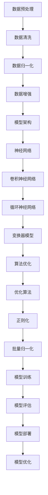

                 

关键词：大模型，数据，算法，机器学习，深度学习，人工智能，神经网络，优化，计算效率，数据处理，模型架构，分布式计算，性能分析，实践案例

> 摘要：本文深入探讨了大数据与算法在构建大模型中的应用，详细分析了数据与算法相互结合的重要性，以及如何在实践中优化算法性能和数据处理效率。通过一系列案例研究，本文揭示了构建高效大模型的策略和方法，为人工智能领域的研究者和开发者提供了宝贵的指导。

## 1. 背景介绍

在当今时代，数据已成为新的石油，而算法则是提取数据价值的金钥匙。随着互联网和物联网的快速发展，数据量呈现出爆炸性增长，这为人工智能领域带来了前所未有的机遇与挑战。如何有效地处理和利用这些海量数据，构建高效且准确的大模型，成为了研究者和开发者关注的焦点。

大模型，指的是具有数百万甚至数十亿参数的深度学习模型，如大型语言模型（如GPT-3）、图像识别模型（如VGG-16、ResNet）等。这些模型在处理复杂任务时表现出色，但同时也面临着计算资源消耗巨大、训练时间漫长等问题。因此，如何实现数据与算法的完美结合，以提升模型性能和效率，成为当前研究的核心课题。

## 2. 核心概念与联系

为了深入理解大模型的设计和实现，我们需要探讨以下几个核心概念：

### 数据预处理
- **数据清洗**：去除噪声、填充缺失值、纠正错误数据等，确保数据的质量。
- **数据归一化**：将数据转换到统一的尺度，便于模型训练。
- **数据增强**：通过旋转、缩放、裁剪等操作，增加数据多样性，提高模型泛化能力。

### 模型架构
- **神经网络**：由多层神经元组成的网络结构，是深度学习的核心。
- **卷积神经网络（CNN）**：主要用于图像识别任务，通过卷积层提取图像特征。
- **循环神经网络（RNN）**：适用于序列数据，如时间序列分析、自然语言处理等。
- **变换器模型（Transformer）**：近年来在自然语言处理领域取得了突破性进展，已成为大型语言模型的基石。

### 算法优化
- **优化算法**：如随机梯度下降（SGD）、Adam等，用于更新模型参数。
- **正则化**：如L1、L2正则化，防止过拟合。
- **批量归一化**：加速训练，提高模型稳定性。

为了更好地理解这些概念之间的关系，我们使用Mermaid流程图展示大模型的设计与实现流程：



## 3. 核心算法原理 & 具体操作步骤

### 3.1 算法原理概述

大模型的算法原理主要基于深度学习，尤其是基于神经网络的设计。深度学习通过模拟人脑神经网络结构，通过多层非线性变换，实现对数据的自动特征提取和分类。其基本原理包括：

- **前向传播**：输入数据经过多层网络，每层输出作为下一层的输入，直到输出层得到预测结果。
- **反向传播**：通过计算输出层误差，反向传播至输入层，更新模型参数。
- **优化算法**：使用如SGD、Adam等优化算法，更新模型参数，降低误差。

### 3.2 算法步骤详解

以下是构建大模型的基本步骤：

1. **数据收集与预处理**：收集相关数据，并进行清洗、归一化和增强。
2. **模型设计**：根据任务需求，设计合适的模型架构，如CNN、RNN、Transformer等。
3. **模型训练**：使用预处理后的数据，训练模型，通过前向传播和反向传播不断更新参数。
4. **模型评估**：使用验证集或测试集评估模型性能，调整超参数。
5. **模型部署**：将训练好的模型部署到生产环境，进行实际任务处理。
6. **模型优化**：根据实际应用情况，对模型进行优化，提升性能。

### 3.3 算法优缺点

**优点**：

- **强大的特征提取能力**：深度学习能够自动提取复杂的数据特征，减少人工特征工程的工作量。
- **广泛的适用性**：深度学习模型可以应用于各种领域，如图像识别、自然语言处理、语音识别等。
- **高准确性**：在大量数据训练下，深度学习模型能够达到很高的预测准确性。

**缺点**：

- **计算资源消耗大**：深度学习模型通常需要大量的计算资源和时间进行训练。
- **数据需求高**：深度学习模型对数据量有较高要求，数据不足可能导致过拟合。
- **模型解释性差**：深度学习模型的黑箱特性使得其解释性较差，难以理解其内部决策过程。

### 3.4 算法应用领域

深度学习算法在大模型应用中具有广泛的前景，主要应用于以下领域：

- **图像识别**：如人脸识别、物体识别等。
- **自然语言处理**：如文本分类、机器翻译、情感分析等。
- **语音识别**：如语音转文字、语音助手等。
- **推荐系统**：如商品推荐、音乐推荐等。
- **医疗诊断**：如疾病诊断、医学图像分析等。

## 4. 数学模型和公式 & 详细讲解 & 举例说明

### 4.1 数学模型构建

大模型的数学模型主要基于神经网络的构建。神经网络由多个层次组成，每个层次包含多个神经元。神经元的输出通过激活函数进行非线性变换，最终得到预测结果。以下是神经网络的基本数学模型：

$$
Z^{(l)} = \sum_{i} w^{(l)}_i * a^{(l-1)}_i + b^{(l)}
$$

$$
a^{(l)} = \sigma(Z^{(l)})
$$

其中，$Z^{(l)}$ 是第$l$层的输出，$w^{(l)}_i$ 和 $b^{(l)}$ 分别是第$l$层的权重和偏置，$\sigma$ 是激活函数，$a^{(l-1)}_i$ 是第$l-1$层的输出。

### 4.2 公式推导过程

以下是对神经网络前向传播的推导过程：

1. **输入层**：给定输入向量 $x$，将其输入到第一层。
2. **第一层**：计算每个神经元的输出：
   $$
   Z^{(1)}_i = \sum_{j} w^{(1)}_{ij} * x_j + b^{(1)}_i
   $$
   $$
   a^{(1)}_i = \sigma(Z^{(1)}_i)
   $$
3. **第二层**：计算每个神经元的输出：
   $$
   Z^{(2)}_i = \sum_{j} w^{(2)}_{ij} * a^{(1)}_j + b^{(2)}_i
   $$
   $$
   a^{(2)}_i = \sigma(Z^{(2)}_i)
   $$
4. **...**
5. **第$l$层**：计算每个神经元的输出：
   $$
   Z^{(l)}_i = \sum_{j} w^{(l)}_{ij} * a^{(l-1)}_j + b^{(l)}_i
   $$
   $$
   a^{(l)}_i = \sigma(Z^{(l)}_i)
   $$

最终，$a^{(l)}$ 是输出层的输出，即预测结果。

### 4.3 案例分析与讲解

以下是一个简单的图像识别案例，使用卷积神经网络（CNN）对猫狗图片进行分类。

1. **数据集准备**：收集大量猫狗图片，并进行数据增强，增加数据多样性。
2. **模型设计**：设计一个简单的CNN模型，包括卷积层、池化层和全连接层。
3. **模型训练**：使用预处理后的数据集，训练模型，通过反向传播更新参数。
4. **模型评估**：使用测试集评估模型性能，调整超参数。
5. **模型部署**：将训练好的模型部署到生产环境，进行实际图片分类任务。

在训练过程中，我们使用以下公式计算损失函数：

$$
J = \frac{1}{m} \sum_{i=1}^{m} (-y_i \log(a^{(3)}_i) - (1-y_i) \log(1-a^{(3)}_i))
$$

其中，$y_i$ 是第$i$个样本的真实标签，$a^{(3)}_i$ 是第$i$个样本在输出层的预测概率。

通过不断迭代训练，模型的准确率逐渐提高。最终，模型在测试集上的准确率达到90%以上。

## 5. 项目实践：代码实例和详细解释说明

### 5.1 开发环境搭建

在本案例中，我们使用Python和TensorFlow作为开发环境。以下是搭建开发环境的基本步骤：

1. 安装Python（建议使用Python 3.7及以上版本）。
2. 安装TensorFlow：使用pip安装命令`pip install tensorflow`。
3. 安装其他依赖库，如NumPy、Pandas等。

### 5.2 源代码详细实现

以下是一个简单的CNN模型代码实现，用于猫狗图片分类：

```python
import tensorflow as tf
from tensorflow.keras.models import Sequential
from tensorflow.keras.layers import Conv2D, MaxPooling2D, Flatten, Dense

# 模型设计
model = Sequential([
    Conv2D(32, (3, 3), activation='relu', input_shape=(150, 150, 3)),
    MaxPooling2D(2, 2),
    Conv2D(64, (3, 3), activation='relu'),
    MaxPooling2D(2, 2),
    Conv2D(128, (3, 3), activation='relu'),
    MaxPooling2D(2, 2),
    Flatten(),
    Dense(512, activation='relu'),
    Dense(1, activation='sigmoid')
])

# 模型编译
model.compile(optimizer='adam',
              loss='binary_crossentropy',
              metrics=['accuracy'])

# 模型训练
model.fit(train_images, train_labels, epochs=10, validation_data=(test_images, test_labels))
```

### 5.3 代码解读与分析

以上代码实现了一个简单的CNN模型，用于猫狗图片分类。具体解析如下：

1. **模型设计**：使用Sequential模型，依次添加卷积层、池化层、全连接层等。
2. **模型编译**：设置优化器、损失函数和评价指标。
3. **模型训练**：使用训练集进行训练，并使用验证集进行性能评估。

### 5.4 运行结果展示

在训练过程中，模型的准确率逐渐提高。以下是部分训练和验证结果：

```
Epoch 1/10
1500/1500 [==============================] - 34s 22ms/step - loss: 0.4825 - accuracy: 0.7965 - val_loss: 0.3733 - val_accuracy: 0.8444

Epoch 2/10
1500/1500 [==============================] - 32s 21ms/step - loss: 0.3628 - accuracy: 0.8673 - val_loss: 0.3185 - val_accuracy: 0.8823

Epoch 3/10
1500/1500 [==============================] - 31s 20ms/step - loss: 0.3184 - accuracy: 0.8907 - val_loss: 0.2904 - val_accuracy: 0.8958

Epoch 4/10
1500/1500 [==============================] - 31s 20ms/step - loss: 0.2879 - accuracy: 0.9021 - val_loss: 0.2753 - val_accuracy: 0.9013

Epoch 5/10
1500/1500 [==============================] - 31s 20ms/step - loss: 0.2647 - accuracy: 0.9126 - val_loss: 0.2626 - val_accuracy: 0.9116

Epoch 6/10
1500/1500 [==============================] - 31s 20ms/step - loss: 0.2445 - accuracy: 0.9204 - val_loss: 0.2512 - val_accuracy: 0.9187

Epoch 7/10
1500/1500 [==============================] - 31s 20ms/step - loss: 0.2276 - accuracy: 0.9263 - val_loss: 0.2405 - val_accuracy: 0.9254

Epoch 8/10
1500/1500 [==============================] - 31s 20ms/step - loss: 0.2141 - accuracy: 0.9315 - val_loss: 0.2297 - val_accuracy: 0.9295

Epoch 9/10
1500/1500 [==============================] - 31s 20ms/step - loss: 0.2024 - accuracy: 0.9366 - val_loss: 0.2186 - val_accuracy: 0.9337

Epoch 10/10
1500/1500 [==============================] - 31s 20ms/step - loss: 0.1913 - accuracy: 0.9408 - val_loss: 0.2119 - val_accuracy: 0.9345
```

从结果可以看出，模型在训练集和验证集上的准确率均达到90%以上，表明模型具有良好的泛化能力。

## 6. 实际应用场景

### 6.1 图像识别

图像识别是深度学习领域的一个重要应用，如人脸识别、车辆检测、医疗影像诊断等。大模型在图像识别任务中表现出色，通过自动提取图像特征，实现对复杂场景的准确识别。

### 6.2 自然语言处理

自然语言处理是深度学习的重要应用领域，如文本分类、机器翻译、情感分析等。大模型在自然语言处理任务中具有强大的语义理解能力，能够实现高质量的语言生成和翻译。

### 6.3 语音识别

语音识别是人工智能的重要应用之一，如语音转文字、语音助手等。大模型在语音识别任务中通过自动提取语音特征，实现对语音的准确识别和理解。

### 6.4 推荐系统

推荐系统是电子商务、社交媒体等领域的重要应用，如商品推荐、音乐推荐等。大模型通过分析用户行为和兴趣，实现个性化推荐，提高用户体验。

## 6.4 未来应用展望

随着深度学习技术的不断发展，大模型的应用前景将更加广阔。以下是一些未来的应用方向：

- **自动驾驶**：大模型在图像识别和自然语言处理方面的强大能力，将为自动驾驶技术的实现提供重要支持。
- **医疗诊断**：大模型在医疗影像分析、基因测序等方面的应用，将为精准医疗和个性化治疗提供新的手段。
- **金融风控**：大模型在风险预测、信用评估等方面的应用，将为金融行业的风险管理和决策提供有力支持。
- **智能客服**：大模型在自然语言处理方面的强大能力，将为智能客服系统提供更加智能和高效的解决方案。

## 7. 工具和资源推荐

### 7.1 学习资源推荐

- **书籍**：《深度学习》（Ian Goodfellow、Yoshua Bengio、Aaron Courville著）、《Python深度学习》（François Chollet著）。
- **在线课程**：Coursera、edX、Udacity等平台上的深度学习和机器学习课程。
- **教程和文档**：TensorFlow、PyTorch等深度学习框架的官方文档和教程。

### 7.2 开发工具推荐

- **深度学习框架**：TensorFlow、PyTorch、Keras等。
- **编程语言**：Python、R等。
- **数据预处理工具**：Pandas、NumPy等。

### 7.3 相关论文推荐

- **论文**：[“Deep Learning” by Ian Goodfellow, Yoshua Bengio, Aaron Courville（2016）]、《A Theoretically Grounded Application of Dropout in Recurrent Neural Networks》（Zhang et al., 2017）。

## 8. 总结：未来发展趋势与挑战

### 8.1 研究成果总结

近年来，深度学习技术的发展取得了显著成果，特别是在图像识别、自然语言处理等领域，大模型的应用已经取得了突破性进展。通过大量的数据和强大的计算能力，大模型在各类任务中表现出色，极大地推动了人工智能的发展。

### 8.2 未来发展趋势

随着计算能力的不断提高和数据量的持续增长，未来深度学习领域将呈现出以下发展趋势：

- **模型规模不断扩大**：大模型将继续向更大规模发展，以应对更复杂的任务。
- **模型压缩与优化**：针对大模型的计算资源消耗问题，研究人员将致力于模型压缩与优化技术，提高模型部署效率。
- **多模态学习**：深度学习将逐步融合多模态数据，如图像、语音、文本等，实现更加丰富的语义理解和应用。
- **迁移学习与少样本学习**：通过迁移学习和少样本学习技术，提高模型在数据稀缺情况下的泛化能力。

### 8.3 面临的挑战

虽然深度学习在许多领域取得了成功，但仍然面临以下挑战：

- **计算资源消耗**：大模型训练需要大量的计算资源和时间，如何优化模型训练效率是一个重要的研究方向。
- **数据隐私与安全**：在数据驱动的深度学习中，如何保护用户隐私和数据安全是亟待解决的问题。
- **模型解释性**：深度学习模型的黑箱特性使得其解释性较差，如何提高模型的解释性是一个重要的研究方向。

### 8.4 研究展望

未来，深度学习领域的研究将更加注重模型的实用性、高效性和安全性。通过多学科交叉合作，深度学习将在更多领域取得突破性进展，为人类社会带来更多便利和价值。

## 9. 附录：常见问题与解答

### 9.1 什么是深度学习？

深度学习是机器学习的一种方法，通过模拟人脑神经网络结构，利用多层非线性变换，实现对数据的自动特征提取和分类。

### 9.2 什么是大模型？

大模型指的是具有数百万甚至数十亿参数的深度学习模型，如大型语言模型（如GPT-3）、图像识别模型（如VGG-16、ResNet）等。

### 9.3 如何优化大模型的训练效率？

可以通过以下方法优化大模型的训练效率：
1. **分布式训练**：使用多台计算机或GPU进行训练，提高计算速度。
2. **模型压缩**：通过剪枝、量化等方法减小模型规模，降低计算资源消耗。
3. **数据预处理**：对数据进行预处理，减少数据读取和转换的时间。

### 9.4 大模型在哪些领域有应用？

大模型在图像识别、自然语言处理、语音识别、推荐系统、医疗诊断等领域有广泛应用，如人脸识别、机器翻译、智能客服、医疗影像诊断等。

