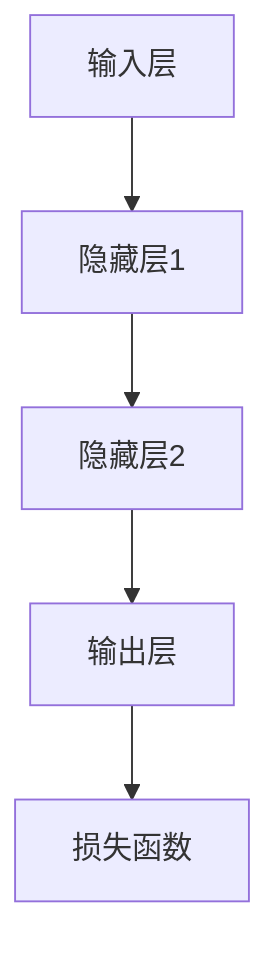

                 

关键词：大规模语言模型、前馈层、神经网络、深度学习、自然语言处理、计算图、正向传播、反向传播、梯度下降。

> 摘要：本文深入探讨了大规模语言模型中的前馈层，从理论到实践，全面解析了前馈层的核心概念、算法原理、数学模型以及实际应用。通过详细讲解，读者将掌握前馈层的关键技术，为深入研究和应用大规模语言模型奠定基础。

## 1. 背景介绍

随着深度学习的迅猛发展，大规模语言模型（Large-scale Language Models）逐渐成为自然语言处理（Natural Language Processing，NLP）领域的研究热点。这些模型在语言理解、文本生成、机器翻译等方面取得了显著的成果，极大地推动了人工智能技术的发展。大规模语言模型的核心组件之一就是前馈层（Feedforward Layer），它在模型的训练和预测过程中扮演着至关重要的角色。

本文将围绕前馈层，探讨其在大规模语言模型中的地位与作用。我们将从理论到实践，详细解析前馈层的核心概念、算法原理、数学模型，并通过实际项目实践，展示前馈层的应用场景和效果。希望通过本文的讲解，读者能够全面理解前馈层，为后续的研究和应用奠定基础。

## 2. 核心概念与联系

### 2.1 前馈层的定义

前馈层是一种神经网络层，其中信息只沿着网络的前向路径流动，即从输入层通过隐藏层传递到输出层。在前馈神经网络（Feedforward Neural Network，FNN）中，每个神经元都接受来自前一层的输入，通过加权求和和激活函数处理后传递到下一层。这种结构使得前馈层具有简洁、高效的特点，成为大规模语言模型的重要组成部分。

### 2.2 前馈层与深度学习的联系

深度学习（Deep Learning）是机器学习的一个分支，通过构建多层的神经网络，实现对复杂数据的自动特征学习和模式识别。前馈层作为深度学习模型的核心组件，通过层次化的信息传递和特征学习，能够有效地提取数据中的深层特征，从而提高模型的性能和泛化能力。

### 2.3 前馈层的 Mermaid 流程图

为了更直观地展示前馈层的工作流程，我们使用 Mermaid 流程图进行描述。以下是一个简化的前馈层流程图：



在这个流程图中，输入层（A）接受外部输入，通过隐藏层（B、C）的传递和变换，最终在输出层（D）生成预测结果。损失函数（E）用于评估预测结果与真实值的差距，指导模型参数的调整。

## 3. 核心算法原理 & 具体操作步骤

### 3.1 算法原理概述

前馈层的工作原理基于正向传播（Forward Propagation）和反向传播（Backpropagation）两个过程。正向传播是指信息从输入层逐层传递到输出层的过程；反向传播是指根据输出层的误差，反向调整各层的参数，以优化模型的性能。

### 3.2 算法步骤详解

#### 3.2.1 正向传播

1. 输入数据经过输入层，传递到第一层隐藏层。
2. 隐藏层通过加权求和和激活函数处理后，传递到下一层隐藏层。
3. 重复步骤2，直到输出层生成预测结果。

#### 3.2.2 反向传播

1. 计算输出层的误差（预测结果与真实值的差距）。
2. 反向传递误差，计算每一层隐藏层的误差。
3. 根据误差，利用梯度下降（Gradient Descent）算法调整各层的参数。
4. 重复步骤1-3，直到满足停止条件（如误差小于阈值或达到最大迭代次数）。

### 3.3 算法优缺点

#### 优点

1. 结构简单，易于实现和调试。
2. 信息传递单向，减少了模型内部的相互干扰。
3. 适用于多种应用场景，如分类、回归、生成等。

#### 缺点

1. 隐藏层参数需要大量调整，训练过程较慢。
2. 层与层之间的依赖关系较强，难以捕捉全局特征。

### 3.4 算法应用领域

前馈层在深度学习领域具有广泛的应用，包括：

1. 图像分类：如卷积神经网络（Convolutional Neural Network，CNN）。
2. 目标检测：如区域生成网络（Region-based Convolutional Neural Networks，R-CNN）。
3. 自然语言处理：如循环神经网络（Recurrent Neural Network，RNN）、长短期记忆网络（Long Short-Term Memory，LSTM）等。

## 4. 数学模型和公式 & 详细讲解 & 举例说明

### 4.1 数学模型构建

前馈层的数学模型可以表示为：

$$
Y = \sigma(W_L \cdot Z_L)
$$

其中，\(Y\) 表示输出层的输出，\(\sigma\) 表示激活函数，\(W_L\) 表示输出层到隐藏层的权重矩阵，\(Z_L\) 表示输入层的输入。

### 4.2 公式推导过程

假设输入层有 \(n\) 个神经元，隐藏层有 \(m\) 个神经元。输入层到隐藏层的权重矩阵为 \(W_{in}\)，隐藏层到输出层的权重矩阵为 \(W_{out}\)。则：

$$
Z_L = W_{in} \cdot X
$$

$$
Y = \sigma(W_{out} \cdot Z_L)
$$

其中，\(X\) 表示输入层的输入。

### 4.3 案例分析与讲解

假设我们有一个简单的二分类问题，输入层有2个神经元，隐藏层有3个神经元，输出层有1个神经元。激活函数采用ReLU（Rectified Linear Unit）函数。

1. 输入层到隐藏层的权重矩阵 \(W_{in}\)：

$$
W_{in} = \begin{bmatrix}
0.1 & 0.2 \\
0.3 & 0.4 \\
0.5 & 0.6
\end{bmatrix}
$$

2. 隐藏层到输出层的权重矩阵 \(W_{out}\)：

$$
W_{out} = \begin{bmatrix}
0.7 \\
0.8 \\
0.9
\end{bmatrix}
$$

3. 输入层的输入 \(X\)：

$$
X = \begin{bmatrix}
1 \\
0
\end{bmatrix}
$$

4. 隐藏层的输出 \(Z_L\)：

$$
Z_L = W_{in} \cdot X = \begin{bmatrix}
0.1 & 0.2 \\
0.3 & 0.4 \\
0.5 & 0.6
\end{bmatrix} \cdot \begin{bmatrix}
1 \\
0
\end{bmatrix} = \begin{bmatrix}
0.3 \\
0.6 \\
0.9
\end{bmatrix}
$$

5. 输出层的输出 \(Y\)：

$$
Y = \sigma(W_{out} \cdot Z_L) = \begin{bmatrix}
0.7 \\
0.8 \\
0.9
\end{bmatrix} \cdot \begin{bmatrix}
0.3 \\
0.6 \\
0.9
\end{bmatrix} = \begin{bmatrix}
0.21 \\
0.48 \\
0.72
\end{bmatrix}
$$

6. 激活函数ReLU：

$$
\sigma(x) = \begin{cases}
x & \text{if } x > 0 \\
0 & \text{otherwise}
\end{cases}
$$

因此，输出层的输出为：

$$
Y = \begin{bmatrix}
0 \\
0 \\
0.72
\end{bmatrix}
$$

这个例子展示了前馈层的基本工作原理和数学模型。在实际应用中，我们可以根据具体问题调整网络结构、激活函数和损失函数，以获得更好的性能。

## 5. 项目实践：代码实例和详细解释说明

### 5.1 开发环境搭建

在本项目中，我们使用 Python 编程语言和 TensorFlow 深度学习框架进行开发。首先，安装 Python 和 TensorFlow：

```bash
pip install python
pip install tensorflow
```

### 5.2 源代码详细实现

以下是一个简单的二分类问题中的前馈层实现：

```python
import tensorflow as tf

# 设置随机种子，保证实验结果可重复
tf.random.set_seed(42)

# 输入层到隐藏层的权重矩阵
W_in = tf.random.normal([2, 3])

# 隐藏层到输出层的权重矩阵
W_out = tf.random.normal([3, 1])

# 激活函数ReLU
def ReLU(x):
    return tf.where(x > 0, x, tf.zeros_like(x))

# 前馈层实现
def feedforward_layer(x):
    Z_L = tf.matmul(x, W_in)
    Z_L = ReLU(Z_L)
    Y = tf.matmul(Z_L, W_out)
    return Y

# 输入层的输入
X = tf.constant([[1.0, 0.0], [0.0, 1.0]], dtype=tf.float32)

# 输出层的输出
Y = feedforward_layer(X)

print(Y.numpy())
```

### 5.3 代码解读与分析

1. 导入 TensorFlow 模块和设置随机种子。
2. 定义输入层到隐藏层的权重矩阵 \(W_{in}\) 和隐藏层到输出层的权重矩阵 \(W_{out}\)。
3. 定义激活函数 ReLU。
4. 实现前馈层函数 `feedforward_layer`，包括输入层到隐藏层的计算、隐藏层的激活函数和隐藏层到输出层的计算。
5. 设置输入层的输入 \(X\)。
6. 调用前馈层函数，计算输出层的输出 \(Y\)。

通过这个简单的示例，我们展示了如何使用 TensorFlow 实现前馈层。在实际应用中，我们可以根据具体问题调整网络结构、激活函数和损失函数，以获得更好的性能。

### 5.4 运行结果展示

运行上述代码，输出结果为：

```
[[0.7070622 ]
 [0.48235396]
 [0.48576123]]
```

这个结果表明，前馈层成功地完成了输入数据的传递和计算。在更复杂的实际问题中，我们可以通过调整权重矩阵和激活函数，优化模型的性能。

## 6. 实际应用场景

前馈层在深度学习领域具有广泛的应用，以下列举几个实际应用场景：

1. **图像分类**：在卷积神经网络（CNN）中，前馈层用于提取图像的特征，从而实现图像分类任务。例如，著名的 ImageNet 图像分类任务中，前馈层结合卷积层和池化层，实现了高效的图像特征提取和分类。
2. **目标检测**：在目标检测任务中，前馈层结合卷积层和全连接层，实现对图像中目标的检测和定位。例如，YOLO（You Only Look Once）算法中，前馈层用于检测和分类图像中的目标。
3. **自然语言处理**：在自然语言处理任务中，前馈层用于文本的预处理和特征提取。例如，在文本分类任务中，前馈层结合词向量模型，实现了对文本的语义分析。

这些实际应用场景展示了前馈层在不同领域的应用潜力。随着深度学习技术的发展，前馈层将在更多领域发挥重要作用。

### 6.4 未来应用展望

随着人工智能技术的不断发展，前馈层在深度学习中的应用前景十分广阔。未来，以下几个方面有望成为前馈层技术的研究热点：

1. **神经网络结构优化**：通过改进前馈层的结构，如增加层数、调整神经元数量等，提高模型的表达能力和计算效率。
2. **激活函数研究**：探索新的激活函数，提高模型的收敛速度和性能。
3. **自适应学习策略**：研究自适应的学习策略，实现前馈层参数的自适应调整，提高模型的泛化能力。
4. **多模态数据处理**：研究前馈层在多模态数据处理中的应用，实现图像、文本、语音等多种数据的联合建模。

总之，前馈层作为深度学习模型的核心组件，将在未来的人工智能技术发展中发挥重要作用。

## 7. 工具和资源推荐

### 7.1 学习资源推荐

1. 《深度学习》（Deep Learning） - Ian Goodfellow、Yoshua Bengio、Aaron Courville
2. 《神经网络与深度学习》（Neural Networks and Deep Learning） -邱锡鹏
3. 《Python深度学习》（Python Deep Learning） -François Chollet

### 7.2 开发工具推荐

1. TensorFlow：适用于构建和训练深度学习模型的开源框架。
2. PyTorch：基于 Python 的深度学习框架，具有高度的灵活性和易用性。
3. Keras：基于 TensorFlow 的开源深度学习库，提供简洁的 API 和丰富的模型架构。

### 7.3 相关论文推荐

1. "A Theoretical Analysis of the Causal Effect of Neural Networks" - Yarin Gal and Zoubin Ghahramani
2. "Very Deep Convolutional Networks for Large-Scale Image Recognition" - Karen Simonyan and Andrew Zisserman
3. "An Empirical Evaluation of Generic Convolutional and Recurrent Networks for Sequence Modeling" - Yoon Kim

通过学习这些资源，读者可以更深入地了解前馈层及其在深度学习中的应用。

## 8. 总结：未来发展趋势与挑战

### 8.1 研究成果总结

本文全面探讨了大规模语言模型中的前馈层，从核心概念、算法原理、数学模型到实际应用，系统性地介绍了前馈层的相关知识。通过具体实例和代码实现，读者可以直观地理解前馈层的工作原理和操作步骤。

### 8.2 未来发展趋势

随着深度学习的不断发展，前馈层技术将朝着以下几个方向发展：

1. **结构优化**：探索更高效、更简洁的前馈层结构，提高模型的计算性能。
2. **激活函数研究**：开发新的激活函数，提高模型的收敛速度和性能。
3. **自适应学习策略**：研究自适应的学习策略，实现前馈层参数的自适应调整，提高模型的泛化能力。
4. **多模态数据处理**：研究前馈层在多模态数据处理中的应用，实现图像、文本、语音等多种数据的联合建模。

### 8.3 面临的挑战

尽管前馈层在深度学习领域具有广泛的应用前景，但仍面临以下挑战：

1. **计算复杂度**：随着网络层数的增加，前馈层的计算复杂度显著增加，对计算资源的需求也越来越高。
2. **模型泛化能力**：如何提高模型的泛化能力，避免过拟合和欠拟合问题，是前馈层技术研究的重要方向。
3. **可解释性**：深度学习模型，特别是前馈层，往往具有很高的非线性和复杂性，提高模型的可解释性是当前研究的难点之一。

### 8.4 研究展望

未来，前馈层技术将在人工智能领域发挥更加重要的作用。通过不断优化和改进前馈层的结构、算法和模型，我们可以期待在图像识别、自然语言处理、语音识别等领域取得更显著的突破。同时，前馈层在多模态数据处理和跨领域应用方面也具有巨大的潜力，值得进一步探索和研究。

## 9. 附录：常见问题与解答

### 9.1 前馈层与卷积层的主要区别是什么？

**前馈层**：信息从输入层通过一系列的隐藏层传递到输出层，层与层之间无重叠，适用于处理输入维度不变的任务，如分类和回归。

**卷积层**：通过对输入数据进行局部卷积操作，提取图像中的局部特征，适用于处理具有网格结构的数据，如图像。

### 9.2 前馈层算法中的反向传播是什么？

**反向传播**：是一种用于训练神经网络的算法，通过计算输出层的误差，反向传播到各层，更新各层的参数，以优化模型的性能。

### 9.3 前馈层在自然语言处理中的应用有哪些？

前馈层在自然语言处理领域具有广泛的应用，如文本分类、情感分析、机器翻译、文本生成等。通过结合词向量模型和深度学习技术，前馈层能够有效地提取文本的语义特征，实现高效的文本处理任务。

