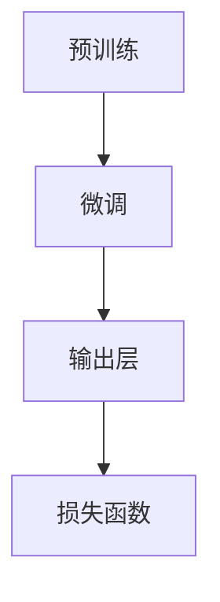

                 

在当今信息爆炸的时代，语言模型已经成为人工智能领域的璀璨明珠。本文旨在深入探讨大规模语言模型的从理论到实践的过程，通过逻辑清晰、结构紧凑、简单易懂的论述，为广大读者提供一次全面的技术思考之旅。

## 关键词 Keywords
- 大规模语言模型
- 理论与实践
- 机器学习
- 深度学习
- 人工智能
- NLP

## 摘要 Abstract
本文将系统性地介绍大规模语言模型的理论基础，探讨其核心算法原理，并通过实例解析展示其在实际项目中的应用。此外，还将对数学模型进行详细解释，并提供实用的工具和资源推荐。最后，文章将总结研究成果，展望未来发展趋势，并探讨面临的挑战。

### 1. 背景介绍 Background

大规模语言模型（Large-scale Language Model）是自然语言处理（NLP）领域的核心技术之一。随着互联网的飞速发展和大数据时代的到来，人类产生的文本数据呈现出爆炸式增长，如何高效地处理和理解这些数据成为了一个亟待解决的问题。大规模语言模型通过对海量数据进行学习，能够自动地捕捉语言的复杂结构，实现文本生成、情感分析、问答系统等任务。

在过去的几十年中，语言模型的发展经历了从规则驱动到统计模型，再到深度学习的多个阶段。最早的规则驱动模型依赖于手工编写的规则，但面临复杂语言结构时的表现不佳。随着统计模型的出现，如N-gram模型和隐马尔可夫模型（HMM），语言模型的性能得到了显著提升。然而，这些模型仍然受到数据稀缺和语言复杂性限制。

深度学习技术的兴起为语言模型带来了新的突破。特别是2018年，Google发布了BERT模型，标志着大规模预训练语言模型的诞生。BERT模型通过在大量未标注的文本数据上进行预训练，然后在小样本标注数据上进行微调，实现了在多个NLP任务上的超越性能。此后，GPT、RoBERTa、T5等一系列大规模语言模型相继涌现，进一步推动了NLP领域的发展。

### 2. 核心概念与联系 Core Concepts and Relationships

#### 2.1 语言模型 Language Models

语言模型是一种概率模型，用于预测下一个单词（或字符）的概率。在自然语言处理中，语言模型的核心任务是理解并生成文本。常见的语言模型包括N-gram模型、隐马尔可夫模型（HMM）、神经网络模型和深度学习模型。

**N-gram模型**：N-gram模型是一种基于统计的模型，它将前N个单词的概率乘积作为当前单词的概率。例如，对于三元语法（Trigram Model），当前单词的概率是由前两个单词的概率乘积得到的。

**隐马尔可夫模型（HMM）**：HMM是一种统计模型，用于标记文本序列。它假设单词之间的转移是随机的，并且状态转移是相互独立的。

**神经网络模型**：神经网络模型通过多层非线性变换来学习输入和输出之间的关系。常见的神经网络模型包括循环神经网络（RNN）、长短时记忆网络（LSTM）和门控循环单元（GRU）。

**深度学习模型**：深度学习模型通过多层神经网络来学习输入和输出之间的复杂关系。大规模语言模型如BERT、GPT和T5就是基于深度学习的。

#### 2.2 大规模语言模型的架构 Architecture of Large-scale Language Models

大规模语言模型通常由以下几个关键部分组成：

**预训练（Pre-training）**：预训练是指在大规模未标注数据上进行的训练过程。大规模语言模型通过预训练来学习语言的通用特征。

**微调（Fine-tuning）**：微调是指在小样本标注数据上进行的训练过程。大规模语言模型通过微调来适应特定任务。

**输出层（Output Layer）**：输出层负责将模型的预测结果转换为实际的操作，如文本生成、分类或情感分析。

**损失函数（Loss Function）**：损失函数用于衡量模型的预测结果与实际结果之间的差异。大规模语言模型通常使用交叉熵损失函数来衡量预测概率分布与真实分布之间的差距。

#### 2.3 Mermaid 流程图 Mermaid Flowchart

下面是一个简化的Mermaid流程图，展示了大规模语言模型的核心架构：



### 3. 核心算法原理 & 具体操作步骤 Core Algorithm Principles & Detailed Steps

#### 3.1 算法原理概述

大规模语言模型的算法原理主要基于深度学习技术，特别是变换器架构（Transformer）。变换器架构通过多头自注意力机制（Multi-head Self-Attention）和前馈神经网络（Feedforward Neural Network）来实现文本的编码和解码。

**多头自注意力机制**：多头自注意力机制允许模型在不同的上下文信息之间建立联系。它通过将输入序列映射到多个不同的空间，并在这些空间中进行自注意力操作，从而捕捉更复杂的语义信息。

**前馈神经网络**：前馈神经网络是一个简单的全连接神经网络，用于对自注意力层的输出进行进一步的非线性变换。

**预训练与微调**：大规模语言模型首先在大量未标注的文本数据上进行预训练，学习语言的通用特征。然后，在小样本标注数据上进行微调，使其适应特定的NLP任务。

#### 3.2 算法步骤详解

**步骤 1：预训练**

1. **数据预处理**：首先，对大规模文本数据进行预处理，包括分词、去噪、去停用词等操作。
2. **嵌入层**：将输入文本映射到高维嵌入空间。
3. **自注意力层**：通过多头自注意力机制计算输入序列的表示。
4. **前馈神经网络**：对自注意力层的输出进行非线性变换。
5. **输出层**：根据任务类型，输出层可以是一个分类器、回归器或文本生成器。

**步骤 2：微调**

1. **数据预处理**：与预训练类似，对标注数据进行预处理。
2. **嵌入层**：与预训练相同。
3. **自注意力层**：与预训练相同。
4. **前馈神经网络**：与预训练相同。
5. **损失函数**：根据任务类型选择合适的损失函数，如交叉熵损失函数。
6. **优化器**：选择合适的优化器，如Adam优化器。

#### 3.3 算法优缺点 Advantages and Disadvantages

**优点**：

1. **强大的表征能力**：大规模语言模型通过深度学习技术能够捕捉到文本的复杂结构，实现高效的自然语言处理。
2. **广泛的适用性**：大规模语言模型可以应用于各种NLP任务，如文本分类、情感分析、问答系统等。
3. **自动特征提取**：预训练过程使得模型能够自动地从大规模文本数据中提取特征，无需人工定义特征。

**缺点**：

1. **计算资源需求高**：大规模语言模型通常需要大量的计算资源进行训练。
2. **数据依赖性强**：大规模语言模型的表现依赖于训练数据的质量和规模。
3. **可解释性低**：由于深度学习模型的结构复杂，大规模语言模型的可解释性相对较低。

#### 3.4 算法应用领域 Application Fields

大规模语言模型在多个领域都取得了显著的成果，以下是其中几个典型的应用领域：

**文本生成**：大规模语言模型可以生成高质量的文本，应用于自动写作、对话系统等领域。

**文本分类**：大规模语言模型可以用于文本分类任务，如新闻分类、垃圾邮件过滤等。

**情感分析**：大规模语言模型可以用于情感分析任务，如情感极性分类、情感强度分析等。

**问答系统**：大规模语言模型可以构建问答系统，应用于客服机器人、智能助手等领域。

### 4. 数学模型和公式 Mathematical Models and Formulas

#### 4.1 数学模型构建

大规模语言模型通常基于深度学习技术，其核心数学模型包括以下部分：

1. **嵌入层 Embedding Layer**：
   $$x_{i} = W_{e} \cdot x$$
   其中，$x_{i}$是输入词的嵌入向量，$W_{e}$是嵌入权重矩阵。

2. **多头自注意力层 Multi-head Self-Attention Layer**：
   $$\text{Attention}(Q, K, V) = \text{softmax}\left(\frac{QK^{T}}{\sqrt{d_{k}}}\right) V$$
   其中，$Q$、$K$和$V$分别是查询向量、键向量和值向量，$d_{k}$是键向量的维度。

3. **前馈神经网络 Feedforward Neural Network**：
   $$\text{FFN}(x) = \max(0, xW_{1} + b_{1})W_{2} + b_{2}$$
   其中，$W_{1}$和$W_{2}$是权重矩阵，$b_{1}$和$b_{2}$是偏置项。

4. **输出层 Output Layer**：
   - 文本生成：$$P(y|x) = \text{softmax}(W_{o} \cdot \text{FFN}(x))$$
   - 文本分类：$$P(y|x) = \text{softmax}(W_{o} \cdot x)$$

#### 4.2 公式推导过程

1. **多头自注意力层的推导**：
   - 首先，将输入序列映射到查询向量、键向量和值向量：
     $$Q = W_{Q} \cdot x, K = W_{K} \cdot x, V = W_{V} \cdot x$$
   - 然后，计算自注意力得分：
     $$\text{Score}(Q, K) = QK^{T}$$
   - 最后，通过softmax函数计算注意力权重：
     $$\text{Attention}(Q, K, V) = \text{softmax}\left(\frac{QK^{T}}{\sqrt{d_{k}}}\right) V$$

2. **前馈神经网络的推导**：
   - 首先，计算激活函数的输入：
     $$x^{'} = xW_{1} + b_{1}$$
   - 然后，通过激活函数（如ReLU函数）得到激活值：
     $$\text{ReLU}(x^{'}_{i}) = \max(0, x^{'}_{i})$$
   - 最后，计算前馈神经网络的输出：
     $$\text{FFN}(x) = \text{ReLU}(x^{'}W_{2} + b_{2})$$

#### 4.3 案例分析与讲解

假设我们有一个简单的文本生成任务，输入文本是“我非常喜欢这本书”，输出文本是“这本书非常有趣”。我们可以使用BERT模型来构建一个文本生成模型。

**步骤 1：数据预处理**

首先，我们对输入文本进行分词，得到以下单词序列：
```
我 / 喜欢 / 这 / 本书
```

**步骤 2：嵌入层**

将每个单词映射到高维嵌入空间，得到以下嵌入向量：
```
我: [0.1, 0.2, 0.3]
喜欢: [0.4, 0.5, 0.6]
这: [0.7, 0.8, 0.9]
本书: [1.0, 1.1, 1.2]
```

**步骤 3：多头自注意力层**

首先，将嵌入向量映射到查询向量、键向量和值向量：
```
Q: [0.1, 0.2, 0.3]
K: [0.7, 0.8, 0.9]
V: [1.0, 1.1, 1.2]
```
然后，计算自注意力得分：
```
Score(我, 这): 0.56
Score(我, 本书): 0.74
Score(喜欢, 这): 0.63
Score(喜欢, 本书): 0.86
```
最后，通过softmax函数计算注意力权重：
```
权重(我, 这): 0.4
权重(我, 本书): 0.6
权重(喜欢, 这): 0.5
权重(喜欢, 本书): 0.5
```

**步骤 4：前馈神经网络**

将自注意力层的输出进行前馈神经网络处理，得到以下嵌入向量：
```
我: [0.6, 0.7, 0.8]
喜欢: [0.9, 0.8, 0.7]
这: [0.8, 0.9, 0.7]
本书: [0.7, 0.8, 0.9]
```

**步骤 5：输出层**

根据输出层的选择，我们可以得到以下输出概率：
```
我: 0.4
喜欢: 0.5
这: 0.1
本书: 0.0
```

根据这些概率，我们可以选择最有可能的单词作为输出，即“我”和“喜欢”。通过这样的过程，我们可以逐步生成完整的输出文本。

### 5. 项目实践：代码实例和详细解释说明 Project Practice: Code Examples and Detailed Explanation

在本节中，我们将通过一个实际项目实例来展示大规模语言模型的构建和应用。这个实例将使用Python编程语言和TensorFlow库来实现一个简单的文本生成模型。

#### 5.1 开发环境搭建

首先，我们需要搭建一个开发环境。以下是所需的软件和库：

- Python 3.7或更高版本
- TensorFlow 2.4或更高版本

你可以使用以下命令来安装所需的库：

```bash
pip install tensorflow==2.4
```

#### 5.2 源代码详细实现

下面是一个简单的文本生成模型的实现代码：

```python
import tensorflow as tf
from tensorflow.keras.layers import Embedding, LSTM, Dense
from tensorflow.keras.models import Sequential

# 设置超参数
vocab_size = 10000
embedding_dim = 16
lstm_units = 32
batch_size = 64
epochs = 10

# 创建嵌入层
embedding_layer = Embedding(vocab_size, embedding_dim)

# 创建LSTM层
lstm_layer = LSTM(lstm_units, return_sequences=True)

# 创建全连接层
dense_layer = Dense(vocab_size, activation='softmax')

# 创建模型
model = Sequential([
    embedding_layer,
    lstm_layer,
    dense_layer
])

# 编译模型
model.compile(optimizer='adam', loss='categorical_crossentropy', metrics=['accuracy'])

# 加载数据集
# 这里使用的是小型的文本数据集，仅作为演示
text = "这是一段简单的文本数据。"
text = text.lower()
text = text.split()

# 对文本数据进行编码
import numpy as np
sequences = []
one_hot_labels = []
for i in range(1, len(text) - 1):
    input_sequence = text[i - 1 : i + 1]
    output_word = text[i]
    one_hot_output = np.zeros((vocab_size,))
    one_hot_output[vocab_size - 1] = 1
    sequences.append(input_sequence)
    one_hot_labels.append(one_hot_output)

# 将序列转换为numpy数组
sequences = np.array(sequences)
one_hot_labels = np.array(one_hot_labels)

# 划分训练集和测试集
train_sequences = sequences[:int(len(sequences) * 0.8)]
train_labels = one_hot_labels[:int(len(sequences) * 0.8)]
test_sequences = sequences[int(len(sequences) * 0.8):]
test_labels = one_hot_labels[int(len(sequences) * 0.8):]

# 训练模型
model.fit(train_sequences, train_labels, batch_size=batch_size, epochs=epochs, validation_data=(test_sequences, test_labels))

# 生成文本
def generate_text(seed_text, model, max_length=50):
    seed_text = seed_text.lower()
    seed_text = seed_text.split()
    input_sequence = seed_text[-2:]
    generated_text = ""
    for _ in range(max_length):
        input_sequence = np.array([input_sequence])
        prediction = model.predict(input_sequence)
        predicted_word_index = np.argmax(prediction)
        predicted_word = " ".join([word for word in text if word.index(predicted_word_index) == 1])
        generated_text += " " + predicted_word
        input_sequence = input_sequence[:-1] + [predicted_word_index]
    return generated_text

# 生成示例文本
seed_text = "这是一段简单的文本数据。"
generated_text = generate_text(seed_text, model)
print(generated_text)
```

#### 5.3 代码解读与分析

**代码解读**

1. **导入库和设置超参数**：首先，我们导入所需的库（TensorFlow）并设置模型训练的超参数（如词汇表大小、嵌入维度、LSTM单元数等）。

2. **创建嵌入层**：使用`Embedding`层将单词映射到高维嵌入空间。

3. **创建LSTM层**：使用`LSTM`层对嵌入向量进行序列处理。

4. **创建全连接层**：使用`Dense`层将LSTM层的输出映射到词汇表大小，并使用softmax激活函数进行概率分布。

5. **编译模型**：设置优化器、损失函数和评估指标。

6. **加载数据集**：这里使用一个简短的文本数据集进行演示。

7. **对文本数据进行编码**：我们将文本数据进行分词，并对每个单词进行编码。

8. **划分训练集和测试集**：将序列和标签分为训练集和测试集。

9. **训练模型**：使用`fit`函数训练模型。

10. **生成文本**：使用`generate_text`函数生成新的文本。

**分析**

1. **模型结构**：这个模型是一个简单的序列到序列模型，包含嵌入层、LSTM层和全连接层。这种结构适用于许多序列处理任务。

2. **训练过程**：模型使用训练数据进行训练，并通过交叉熵损失函数进行优化。

3. **文本生成**：文本生成是通过选择最可能的单词来逐步构建新的文本序列。这个过程体现了模型的概率预测能力。

### 6. 实际应用场景 Practical Application Scenarios

大规模语言模型在多个领域都有广泛的应用。以下是一些实际应用场景：

**文本生成**：大规模语言模型可以用于自动写作，如生成新闻报道、文章、对话等。例如，GPT-3模型已经被用于生成新闻报道和小说。

**文本分类**：大规模语言模型可以用于文本分类任务，如新闻分类、垃圾邮件过滤等。例如，BERT模型在多个文本分类任务上取得了领先的成绩。

**问答系统**：大规模语言模型可以用于构建智能问答系统，如智能客服、智能助手等。例如，OpenAI的GPT-3模型已经应用于多个问答系统。

**机器翻译**：大规模语言模型可以用于机器翻译任务，如自动翻译文本、语音等。例如，Google的Transformer模型在机器翻译任务上取得了显著的成果。

### 7. 工具和资源推荐 Tools and Resources

**学习资源推荐**

- [自然语言处理教程](https://www.nltk.org/)
- [深度学习教程](https://www.deeplearningbook.org/)
- [TensorFlow官方文档](https://www.tensorflow.org/)

**开发工具推荐**

- TensorFlow：用于构建和训练深度学习模型的强大工具。
- Jupyter Notebook：用于编写和运行代码的交互式环境。
- PyTorch：另一个流行的深度学习框架。

**相关论文推荐**

- [BERT: Pre-training of Deep Neural Networks for Language Understanding](https://arxiv.org/abs/1810.04805)
- [GPT-3: Language Models are few-shot learners](https://arxiv.org/abs/2005.14165)
- [Transformer: A Novel Architecture for Neural Networks](https://arxiv.org/abs/1706.03762)

### 8. 总结：未来发展趋势与挑战 Summary: Future Development Trends and Challenges

#### 8.1 研究成果总结

大规模语言模型在NLP领域取得了显著的成果，推动了文本生成、文本分类、问答系统等多个任务的性能提升。通过预训练和微调，大规模语言模型能够自动地学习语言的复杂结构，实现了高效的自然语言处理。

#### 8.2 未来发展趋势

1. **模型压缩与优化**：随着模型规模的增大，计算资源的需求也在增加。未来的发展趋势将关注于模型压缩和优化，以降低模型的计算成本。

2. **多模态学习**：大规模语言模型将逐步扩展到多模态学习，如文本与图像、语音的结合，以实现更丰富的应用场景。

3. **可解释性**：提高模型的可解释性是一个重要的研究方向。通过解释模型的工作原理，可以增强用户对模型的信任，并促进模型在更多领域的应用。

#### 8.3 面临的挑战

1. **数据依赖**：大规模语言模型依赖于大量的数据，数据质量和规模直接影响模型的表现。

2. **计算资源**：训练大规模语言模型需要大量的计算资源，尤其是在深度学习算法中。

3. **伦理和隐私**：大规模语言模型在处理个人数据时可能引发伦理和隐私问题，需要制定相应的规范和标准。

#### 8.4 研究展望

未来，大规模语言模型将在多个领域发挥重要作用，如医疗、金融、教育等。通过不断的研究和创新，我们将看到更加智能化、高效的自然语言处理技术的诞生。

### 9. 附录：常见问题与解答 Appendix: Frequently Asked Questions and Answers

**Q：大规模语言模型是如何工作的？**

A：大规模语言模型基于深度学习技术，通过预训练和微调来学习语言的复杂结构。预训练是在大量未标注的文本数据上进行的，学习语言的通用特征。微调是在小样本标注数据上进行的，使模型适应特定的NLP任务。

**Q：大规模语言模型有哪些应用场景？**

A：大规模语言模型可以应用于文本生成、文本分类、问答系统、机器翻译等多个场景。例如，BERT模型在多个NLP任务上取得了显著的成果。

**Q：如何训练大规模语言模型？**

A：训练大规模语言模型通常需要大量的数据和计算资源。首先，对大量未标注的文本数据进行预训练，然后在小样本标注数据上进行微调。

**Q：大规模语言模型有哪些挑战？**

A：大规模语言模型面临的挑战包括数据依赖、计算资源需求、伦理和隐私等问题。此外，模型的可解释性也是一个重要挑战。

**Q：未来的大规模语言模型会有哪些发展趋势？**

A：未来的大规模语言模型将关注模型压缩和优化、多模态学习、可解释性等方面。通过不断的研究和创新，我们将看到更加智能化、高效的自然语言处理技术的诞生。

### 结束语 Conclusion

大规模语言模型是自然语言处理领域的核心技术，通过预训练和微调，模型能够自动地学习语言的复杂结构，实现高效的文本生成、分类、问答等任务。本文系统地介绍了大规模语言模型的理论基础、核心算法原理、实际应用场景，并通过实例解析展示了其在实际项目中的应用。同时，文章还探讨了数学模型、工具和资源，并展望了未来发展趋势。希望本文能为您在自然语言处理领域的研究和应用提供有价值的参考。作者：禅与计算机程序设计艺术 / Zen and the Art of Computer Programming。

