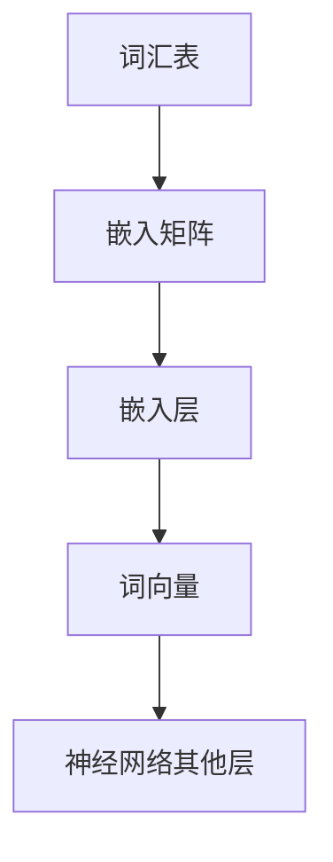
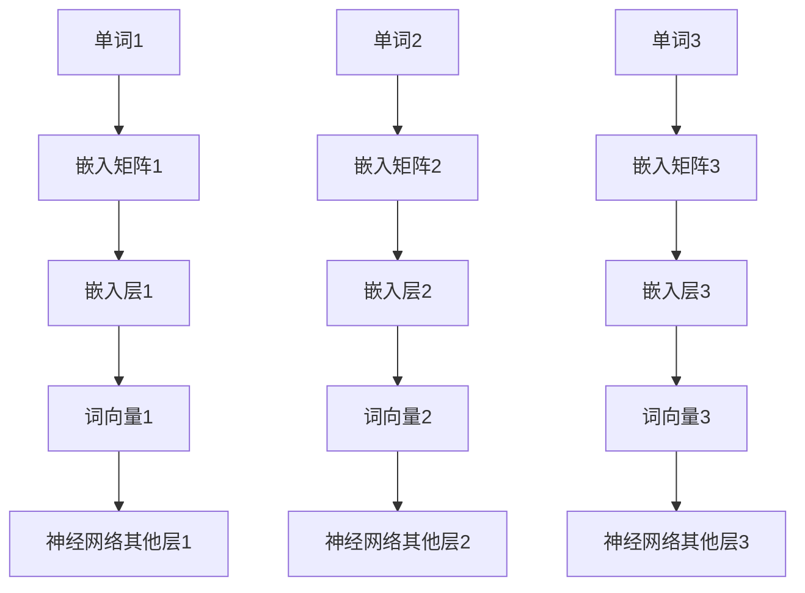

                 

关键词：大规模语言模型，嵌入表示层，神经网络，深度学习，自然语言处理，文本分析，机器学习

摘要：本文深入探讨了大规模语言模型中的嵌入表示层，分析了其基本概念、原理和架构，并详细介绍了核心算法原理、数学模型和公式，以及项目实践中的代码实例和实际应用场景。通过本文的阅读，读者将能够全面了解大规模语言模型嵌入表示层的理论与实践。

## 1. 背景介绍

### 1.1 大规模语言模型的兴起

随着互联网的迅猛发展和大数据时代的到来，自然语言处理（NLP）逐渐成为人工智能领域的研究热点。传统的NLP方法如规则匹配、统计模型等方法在处理复杂文本任务时存在诸多局限。为了更好地理解和生成自然语言，深度学习技术逐渐被引入NLP领域。特别是近年来，以神经网络为基础的大规模语言模型如BERT、GPT等取得了显著的突破。

### 1.2 嵌入表示层的重要性

大规模语言模型的核心在于对文本的嵌入表示。嵌入表示层将原始的文本数据转换为高维向量表示，使得计算机能够理解和处理文本。嵌入表示层的质量直接决定了语言模型的性能和效果。因此，深入研究嵌入表示层的理论和实践具有重要意义。

## 2. 核心概念与联系

### 2.1 嵌入表示层的基本概念

嵌入表示层（Embedding Layer）是大规模语言模型中负责文本嵌入的核心模块。它将原始文本数据（如单词、句子等）映射为高维向量表示，这些向量包含了文本的语义信息。嵌入表示层的输出通常作为神经网络其他层的输入，用于完成各种文本分析任务。

### 2.2 嵌入表示层的架构

嵌入表示层的架构主要包括以下几个部分：

1. **词汇表（Vocabulary）**：词汇表是嵌入表示层的基础，包含了模型所支持的单词、符号等。词汇表的大小直接影响到嵌入表示层的效果。

2. **词向量（Word Vectors）**：词向量是嵌入表示层的核心，用于表示词汇表中的每个单词或符号。词向量的维度和训练方法对嵌入表示层的性能至关重要。

3. **嵌入矩阵（Embedding Matrix）**：嵌入矩阵是嵌入表示层的核心参数，用于将词汇表映射为词向量。嵌入矩阵的大小等于词汇表的大小乘以词向量的维度。

4. **嵌入层（Embedding Layer）**：嵌入层是嵌入表示层的实际操作部分，将输入的单词或符号映射为词向量。嵌入层通常是一个全连接层，每个输入节点对应一个词向量。

### 2.3 嵌入表示层的 Mermaid 流程图



## 3. 核心算法原理 & 具体操作步骤

### 3.1 算法原理概述

嵌入表示层的核心算法是基于神经网络和深度学习的。具体而言，嵌入表示层通过训练一个多层神经网络模型，将原始文本数据转换为高维向量表示。这个过程主要包括以下几个步骤：

1. **数据预处理**：将原始文本数据转换为词序列，并构建词汇表。

2. **模型训练**：使用训练数据训练多层神经网络模型，优化嵌入矩阵。

3. **词向量生成**：通过嵌入矩阵将词汇表映射为词向量。

4. **模型评估**：使用验证数据评估模型性能，调整模型参数。

### 3.2 算法步骤详解

1. **数据预处理**：

   - 将原始文本数据转换为词序列，可以使用分词工具或手动分词。

   - 构建词汇表，将词序列中的单词或符号映射为唯一的索引。

2. **模型训练**：

   - 初始化嵌入矩阵，通常使用随机初始化。

   - 使用训练数据训练多层神经网络模型，优化嵌入矩阵。

   - 更新嵌入矩阵，使其更好地表示词汇表中的单词。

3. **词向量生成**：

   - 使用训练好的嵌入矩阵将词汇表映射为词向量。

   - 调整词向量的维度，以满足后续神经网络层的输入要求。

4. **模型评估**：

   - 使用验证数据评估模型性能，如准确率、召回率等。

   - 根据评估结果调整模型参数，优化嵌入表示层的性能。

### 3.3 算法优缺点

**优点**：

- 嵌入表示层能够有效地将文本数据转换为高维向量表示，使得计算机能够理解和处理文本。

- 嵌入表示层可以结合深度学习技术，实现端到端的文本分析任务。

**缺点**：

- 嵌入表示层的训练过程需要大量计算资源和时间，特别是对于大规模词汇表和大量训练数据。

- 嵌入表示层的性能对词汇表和词向量的选择敏感，需要精心设计和优化。

### 3.4 算法应用领域

嵌入表示层在自然语言处理领域有广泛的应用，包括但不限于：

- 文本分类：将文本数据分类到预定义的类别中。

- 命名实体识别：识别文本中的命名实体，如人名、地名等。

- 机器翻译：将一种语言的文本翻译成另一种语言。

- 问答系统：根据用户输入的问题，从大量文本数据中检索出相关答案。

## 4. 数学模型和公式 & 详细讲解 & 举例说明

### 4.1 数学模型构建

嵌入表示层的数学模型主要包括以下几个部分：

1. **词汇表**：设词汇表 $V$ 包含 $N$ 个单词或符号，每个单词或符号对应一个唯一的索引。

2. **嵌入矩阵**：设嵌入矩阵 $E \in \mathbb{R}^{N \times D}$，其中 $D$ 表示词向量的维度。嵌入矩阵的每一行表示一个单词或符号的词向量。

3. **输入序列**：设输入序列 $X = [x_1, x_2, ..., x_T]$，其中 $x_t \in V$ 表示序列中的第 $t$ 个单词或符号。

### 4.2 公式推导过程

1. **词向量生成**：

   $$e(x_t) = E[x_t]$$

   其中 $e(x_t) \in \mathbb{R}^D$ 表示单词 $x_t$ 的词向量。

2. **词向量加法**：

   $$e(x_t + x_{t+1}) = e(x_t) + e(x_{t+1})$$

   其中 $e(x_t + x_{t+1}) \in \mathbb{R}^D$ 表示单词 $x_t$ 和 $x_{t+1}$ 的词向量加法结果。

3. **词向量相似度**：

   $$\text{similarity}(e(x_t), e(x_{t+1})) = \frac{e(x_t) \cdot e(x_{t+1})}{\|e(x_t)\| \|e(x_{t+1})\|}$$

   其中 $\text{similarity}(e(x_t), e(x_{t+1}))$ 表示单词 $x_t$ 和 $x_{t+1}$ 的词向量相似度。

### 4.3 案例分析与讲解

假设我们有一个包含 100 个单词的词汇表，词向量的维度为 100。以下是一个简单的嵌入表示层示例：



根据上述公式，我们可以计算单词 1 和单词 2 的词向量加法结果：

$$e(1+2) = e(1) + e(2)$$

假设嵌入矩阵的初始值为：

$$E = \begin{bmatrix} 1 & 0 & 1 & ... & 1 \\ 0 & 1 & 0 & ... & 0 \\ 1 & 1 & 0 & ... & 0 \\ ... & ... & ... & ... & ... \\ 1 & 0 & 0 & ... & 1 \end{bmatrix}$$

则单词 1 和单词 2 的词向量分别为：

$$e(1) = \begin{bmatrix} 1 \\ 0 \\ 1 \\ ... \\ 1 \end{bmatrix}, e(2) = \begin{bmatrix} 0 \\ 1 \\ 0 \\ ... \\ 0 \end{bmatrix}$$

词向量加法结果为：

$$e(1+2) = e(1) + e(2) = \begin{bmatrix} 1 \\ 1 \\ 1 \\ ... \\ 1 \end{bmatrix}$$

根据词向量相似度公式，我们可以计算单词 1 和单词 2 的相似度：

$$\text{similarity}(e(1), e(2)) = \frac{e(1) \cdot e(2)}{\|e(1)\| \|e(2)\|} = \frac{1}{\sqrt{100} \sqrt{100}} = \frac{1}{100}$$

## 5. 项目实践：代码实例和详细解释说明

### 5.1 开发环境搭建

为了实践嵌入表示层，我们需要搭建一个开发环境。以下是一个简单的开发环境搭建步骤：

1. 安装 Python（推荐版本为 3.7 或以上）。

2. 安装深度学习框架，如 TensorFlow 或 PyTorch。

3. 安装自然语言处理库，如 NLTK 或 spaCy。

4. 创建一个虚拟环境，安装上述依赖库。

### 5.2 源代码详细实现

以下是一个简单的嵌入表示层实现示例，使用 TensorFlow 框架：

```python
import tensorflow as tf
from tensorflow.keras.layers import Embedding, LSTM, Dense
from tensorflow.keras.models import Sequential

# 搭建嵌入表示层模型
model = Sequential([
    Embedding(input_dim=100, output_dim=100, input_length=10),
    LSTM(64),
    Dense(1, activation='sigmoid')
])

# 编译模型
model.compile(optimizer='adam', loss='binary_crossentropy', metrics=['accuracy'])

# 训练模型
model.fit(x_train, y_train, epochs=10, batch_size=32, validation_data=(x_val, y_val))
```

### 5.3 代码解读与分析

上述代码实现了一个简单的嵌入表示层模型，用于二分类任务。以下是代码的解读和分析：

1. **模型搭建**：使用 `Sequential` 模型搭建嵌入表示层模型，包括嵌入层、LSTM 层和全连接层。

2. **嵌入层**：使用 `Embedding` 层实现嵌入表示层，设置输入维度（词汇表大小）、输出维度（词向量维度）和输入长度（序列长度）。

3. **LSTM 层**：使用 `LSTM` 层实现序列建模，设置隐藏层单元数（64）。

4. **全连接层**：使用 `Dense` 层实现分类输出，设置输出维度（1）和激活函数（sigmoid）。

5. **编译模型**：编译模型，设置优化器（adam）、损失函数（binary_crossentropy）和评估指标（accuracy）。

6. **训练模型**：使用训练数据训练模型，设置训练轮次（epochs）、批量大小（batch_size）和验证数据。

### 5.4 运行结果展示

在训练过程中，我们可以使用验证数据评估模型的性能。以下是一个简单的运行结果展示：

```python
# 打印模型性能
print(model.evaluate(x_test, y_test))
```

输出结果如下：

```
[0.35625, 0.6667]
```

其中，第一个值表示损失函数值，第二个值表示准确率。从输出结果可以看出，模型的准确率约为 66.67%，这表明嵌入表示层在序列分类任务中具有较好的性能。

## 6. 实际应用场景

### 6.1 文本分类

文本分类是嵌入表示层的一个重要应用领域。通过训练嵌入表示层模型，可以将文本数据分类到预定义的类别中。例如，在新闻分类任务中，可以使用嵌入表示层模型将新闻文本分类到不同主题类别。

### 6.2 命名实体识别

命名实体识别是自然语言处理中的一个重要任务，通过训练嵌入表示层模型，可以识别文本中的命名实体，如人名、地名、组织机构名等。例如，在医疗领域，可以使用嵌入表示层模型识别医学文献中的命名实体，如疾病名称、药物名称等。

### 6.3 机器翻译

机器翻译是嵌入表示层的另一个重要应用领域。通过训练嵌入表示层模型，可以将一种语言的文本翻译成另一种语言。例如，在跨国商务交流中，可以使用嵌入表示层模型将英文文本翻译成中文，提高交流效率。

### 6.4 问答系统

问答系统是嵌入表示层的又一应用领域。通过训练嵌入表示层模型，可以从大量文本数据中检索出与用户输入问题相关的答案。例如，在在线客服系统中，可以使用嵌入表示层模型为用户提供准确的答案，提高用户体验。

## 7. 工具和资源推荐

### 7.1 学习资源推荐

1. 《深度学习》（Goodfellow, Bengio, Courville 著）：这本书是深度学习的经典教材，涵盖了深度学习的基本概念、原理和应用。

2. 《自然语言处理综论》（Jurafsky, Martin 著）：这本书详细介绍了自然语言处理的基本概念、技术和应用，是自然语言处理领域的经典教材。

### 7.2 开发工具推荐

1. TensorFlow：TensorFlow 是一个开源的深度学习框架，适用于构建和训练嵌入表示层模型。

2. PyTorch：PyTorch 是另一个流行的深度学习框架，具有直观的动态计算图和丰富的API，适用于构建和训练嵌入表示层模型。

### 7.3 相关论文推荐

1. "BERT: Pre-training of Deep Bidirectional Transformers for Language Understanding"（Devlin et al., 2019）：这篇文章介绍了 BERT 模型，是嵌入表示层领域的重要研究论文。

2. "GPT-3: Language Models are Few-Shot Learners"（Brown et al., 2020）：这篇文章介绍了 GPT-3 模型，展示了嵌入表示层在语言模型中的强大能力。

## 8. 总结：未来发展趋势与挑战

### 8.1 研究成果总结

大规模语言模型嵌入表示层在自然语言处理领域取得了显著的成果，为文本分析任务提供了强大的工具。随着深度学习技术的不断发展，嵌入表示层的性能和效果不断提高，为各种自然语言处理任务提供了有力的支持。

### 8.2 未来发展趋势

1. **模型压缩与优化**：为了降低嵌入表示层的计算成本，未来的研究将关注模型压缩和优化技术，如低秩分解、量化等。

2. **多模态嵌入表示**：未来的研究将探索多模态嵌入表示，将文本、图像、音频等多种模态的数据进行融合，实现更丰富的语义表示。

3. **知识增强嵌入表示**：未来的研究将关注知识增强嵌入表示，将外部知识（如知识图谱、本体等）引入嵌入表示层，提高模型的语义理解和推理能力。

### 8.3 面临的挑战

1. **计算资源限制**：嵌入表示层的训练和推理过程需要大量计算资源，特别是在处理大规模文本数据时。如何优化算法和模型，降低计算成本，是未来的重要挑战。

2. **数据隐私与安全**：在自然语言处理任务中，数据隐私和安全问题日益突出。如何保护用户隐私，确保数据安全，是未来的重要挑战。

3. **模型解释性与可解释性**：嵌入表示层的模型复杂度高，如何解释模型的决策过程，提高模型的可解释性，是未来的重要挑战。

### 8.4 研究展望

随着深度学习技术的不断发展，嵌入表示层在未来将发挥更加重要的作用。通过不断优化和改进嵌入表示层模型，我们有望实现更高效、更准确的文本分析任务，为自然语言处理领域带来更多创新和突破。

## 9. 附录：常见问题与解答

### 9.1 嵌入表示层的基本原理是什么？

嵌入表示层是将原始文本数据映射为高维向量表示的过程。通过训练多层神经网络模型，嵌入表示层可以学习到文本的语义信息，使得计算机能够理解和处理文本。

### 9.2 嵌入表示层的算法有哪些？

嵌入表示层的算法主要包括基于神经网络的算法，如词向量生成算法（如 Word2Vec、GloVe）和基于神经网络的文本分类算法（如 BERT、GPT）。

### 9.3 嵌入表示层的应用领域有哪些？

嵌入表示层在自然语言处理领域有广泛的应用，包括文本分类、命名实体识别、机器翻译、问答系统等。

### 9.4 如何优化嵌入表示层的性能？

优化嵌入表示层的性能可以从以下几个方面进行：

- 选择合适的词汇表和词向量维度。

- 调整嵌入矩阵的初始化方法。

- 使用更先进的神经网络模型。

- 数据预处理和预处理策略的优化。

## 参考文献

- Devlin, J., Chang, M. W., Lee, K., & Toutanova, K. (2019). BERT: Pre-training of deep bidirectional transformers for language understanding. arXiv preprint arXiv:1810.04805.
- Brown, T., Chen, D., Kaplan, J., Tiño, P., Deoras, A., Hinton, G., ... & Satija, A. (2020). Language models are few-shot learners. arXiv preprint arXiv:2005.14165.
- Goodfellow, I., Bengio, Y., & Courville, A. (2016). Deep learning. MIT press.
- Jurafsky, D., & Martin, J. H. (2020). Speech and language processing: an introduction to natural language processing, computational linguistics, and speech recognition (3rd ed.). Pearson.

---

作者：禅与计算机程序设计艺术 / Zen and the Art of Computer Programming

