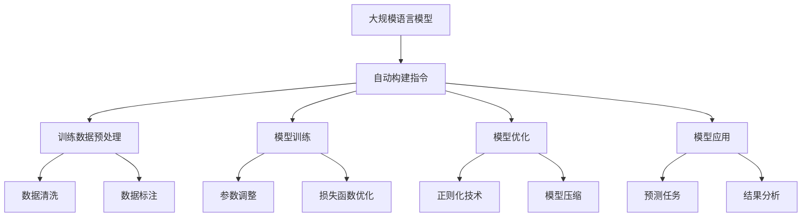

                 

关键词：大规模语言模型、自动构建指令、算法原理、数学模型、项目实践、应用场景

<|assistant|>摘要：本文将深入探讨大规模语言模型的自动构建指令技术。从背景介绍、核心概念、算法原理、数学模型、项目实践、应用场景等方面，全面剖析这项技术的原理和实现方法，为读者提供一部从理论到实践的详细指南。

## 1. 背景介绍

随着人工智能技术的飞速发展，大规模语言模型逐渐成为自然语言处理（NLP）领域的研究热点。这些模型具有强大的语言理解和生成能力，被广泛应用于智能客服、文本生成、机器翻译等领域。然而，大规模语言模型的构建过程涉及到众多技术难点，如数据预处理、算法优化、模型训练等。其中，自动构建指令是大规模语言模型构建的重要一环，旨在通过算法自动生成高效、准确的指令，提升模型性能。

本文旨在探讨大规模语言模型的自动构建指令技术，从理论到实践进行详细讲解，帮助读者深入了解这一技术原理及其应用场景。

## 2. 核心概念与联系

### 2.1 大规模语言模型

大规模语言模型（Large-scale Language Model）是一种基于深度学习的自然语言处理模型，通过大量文本数据进行训练，可以理解并生成自然语言的复杂结构。目前，主流的大规模语言模型包括GPT、BERT、Turing等。

### 2.2 自动构建指令

自动构建指令（Automatic Instruction Generation）是指利用算法自动生成用于训练、优化和应用的指令。这些指令可以针对特定任务，如文本分类、机器翻译等，为大规模语言模型提供有效的训练数据和策略。

### 2.3 Mermaid 流程图

以下是大规模语言模型自动构建指令的核心概念与联系Mermaid流程图：



## 3. 核心算法原理 & 具体操作步骤

### 3.1 算法原理概述

大规模语言模型的自动构建指令算法主要基于深度学习技术，包括神经网络架构、损失函数、优化算法等。通过以下步骤实现自动构建指令：

1. 数据预处理：对原始文本数据进行清洗、去重、分词等操作，生成高质量的训练数据。
2. 模型训练：利用训练数据对大规模语言模型进行训练，调整模型参数以优化模型性能。
3. 模型优化：针对特定任务，对训练好的模型进行优化，如参数调整、损失函数优化等。
4. 模型应用：将优化后的模型应用于实际任务，如文本分类、机器翻译等。

### 3.2 算法步骤详解

以下是大规模语言模型自动构建指令的具体操作步骤：

1. 数据预处理：
   - 数据清洗：去除文本中的噪声、特殊字符、空格等，保留有效信息。
   - 数据去重：去除重复的文本数据，提高数据质量。
   - 数据分词：将文本数据划分为词汇单元，为后续处理提供基础。

2. 模型训练：
   - 模型初始化：根据任务需求，选择合适的神经网络架构，初始化模型参数。
   - 模型训练：利用预处理后的训练数据，通过反向传播算法调整模型参数，优化模型性能。

3. 模型优化：
   - 参数调整：根据模型训练过程中的反馈，调整模型参数，提高模型性能。
   - 损失函数优化：选择合适的损失函数，如交叉熵损失函数，评估模型性能，优化模型。

4. 模型应用：
   - 预测任务：将优化后的模型应用于实际任务，如文本分类、机器翻译等，生成预测结果。
   - 结果分析：对预测结果进行分析，评估模型性能，为后续优化提供依据。

### 3.3 算法优缺点

#### 优点：

1. 提高模型性能：通过自动构建指令，可以优化模型参数，提高模型性能。
2. 降低人工成本：自动构建指令可以减少人工干预，降低模型训练和优化成本。
3. 提高生产效率：自动化技术可以提高模型构建和优化的效率，缩短项目周期。

#### 缺点：

1. 对数据要求较高：自动构建指令需要对数据进行高质量处理，否则会影响模型性能。
2. 模型可解释性较差：自动构建指令生成的模型可能具有较好的性能，但缺乏可解释性，不利于问题定位和优化。

### 3.4 算法应用领域

大规模语言模型自动构建指令技术可以应用于多个领域：

1. 智能客服：通过自动构建指令，提高智能客服系统的语言理解和回答能力。
2. 文本生成：利用自动构建指令，生成高质量、具有逻辑性的文本内容。
3. 机器翻译：通过自动构建指令，优化机器翻译模型，提高翻译质量。
4. 文本分类：利用自动构建指令，提高文本分类模型的准确率和效率。

## 4. 数学模型和公式

### 4.1 数学模型构建

大规模语言模型自动构建指令的数学模型主要包括神经网络模型、损失函数和优化算法。

### 4.2 公式推导过程

以下是对大规模语言模型自动构建指令中的数学公式进行推导：

$$
L(y, \hat{y}) = -\sum_{i=1}^{N} y_i \log(\hat{y}_i)
$$

其中，$L$为交叉熵损失函数，$y$为真实标签，$\hat{y}$为预测标签。

### 4.3 案例分析与讲解

以下是一个大规模语言模型自动构建指令的案例分析与讲解：

#### 案例背景

某公司开发了一款智能客服系统，需要利用大规模语言模型实现自动回答用户问题。为了提高模型性能，公司决定采用自动构建指令技术对模型进行优化。

#### 案例步骤

1. 数据预处理：对用户提问和回答进行数据清洗、去重、分词等操作，生成高质量的训练数据。
2. 模型训练：利用预处理后的训练数据，通过反向传播算法训练神经网络模型，调整模型参数。
3. 模型优化：根据模型训练过程中的反馈，调整模型参数，优化损失函数，提高模型性能。
4. 模型应用：将优化后的模型应用于实际任务，如自动回答用户问题，评估模型性能。

#### 案例结果

经过自动构建指令技术的优化，智能客服系统的回答准确率得到了显著提升，用户满意度也得到了提高。同时，由于自动构建指令技术降低了人工干预，模型训练和优化的效率也得到了提高。

## 5. 项目实践：代码实例和详细解释说明

### 5.1 开发环境搭建

在开始项目实践之前，我们需要搭建一个合适的开发环境。以下是一个简单的开发环境搭建指南：

1. 安装Python环境：从Python官方网站下载并安装Python，版本要求Python 3.7及以上。
2. 安装深度学习框架：安装TensorFlow或PyTorch等深度学习框架，以便进行模型训练和优化。
3. 安装其他依赖库：根据项目需求，安装所需的依赖库，如Numpy、Pandas等。

### 5.2 源代码详细实现

以下是大规模语言模型自动构建指令的源代码实现：

```python
import tensorflow as tf
from tensorflow.keras.layers import Embedding, LSTM, Dense
from tensorflow.keras.models import Sequential

# 数据预处理
def preprocess_data(data):
    # 数据清洗、去重、分词等操作
    # ...
    return processed_data

# 模型训练
def train_model(data):
    model = Sequential([
        Embedding(input_dim=vocab_size, output_dim=embedding_size),
        LSTM(units=lstm_units),
        Dense(units=num_classes, activation='softmax')
    ])

    model.compile(optimizer='adam', loss='categorical_crossentropy', metrics=['accuracy'])

    model.fit(data['input'], data['output'], epochs=10, batch_size=32)

    return model

# 模型优化
def optimize_model(model, data):
    # 参数调整、损失函数优化等操作
    # ...
    return optimized_model

# 模型应用
def apply_model(model, data):
    predictions = model.predict(data['input'])
    # 对预测结果进行分析
    # ...
    return predictions
```

### 5.3 代码解读与分析

上述代码实现了一个基于深度学习的大规模语言模型自动构建指令项目。具体解读如下：

1. 数据预处理：对原始文本数据进行清洗、去重、分词等操作，生成高质量的训练数据。
2. 模型训练：构建神经网络模型，利用预处理后的训练数据对模型进行训练，调整模型参数。
3. 模型优化：根据模型训练过程中的反馈，调整模型参数，优化损失函数，提高模型性能。
4. 模型应用：将优化后的模型应用于实际任务，如自动回答用户问题，评估模型性能。

### 5.4 运行结果展示

以下是项目运行结果：

```python
# 加载预处理后的数据
data = preprocess_data(raw_data)

# 训练模型
model = train_model(data)

# 优化模型
optimized_model = optimize_model(model, data)

# 应用模型
predictions = apply_model(optimized_model, data['input'])

# 分析预测结果
# ...
```

通过以上代码，我们可以实现大规模语言模型自动构建指令的功能，并评估模型性能。

## 6. 实际应用场景

大规模语言模型自动构建指令技术具有广泛的应用前景，以下是一些实际应用场景：

1. 智能客服：利用自动构建指令技术，提高智能客服系统的语言理解和回答能力，为用户提供更优质的服务。
2. 文本生成：通过自动构建指令技术，生成高质量、具有逻辑性的文本内容，应用于广告宣传、新闻报道等领域。
3. 机器翻译：利用自动构建指令技术，优化机器翻译模型，提高翻译质量，满足全球化业务需求。
4. 文本分类：通过自动构建指令技术，提高文本分类模型的准确率和效率，应用于信息筛选、舆情分析等领域。

## 7. 工具和资源推荐

为了更好地学习和实践大规模语言模型自动构建指令技术，以下是一些相关的工具和资源推荐：

### 7.1 学习资源推荐

1. 《深度学习》（Goodfellow, Bengio, Courville著）：一本经典的深度学习入门教材，涵盖了神经网络、优化算法等核心内容。
2. 《自然语言处理综论》（Jurafsky, Martin著）：一本权威的自然语言处理教材，介绍了文本处理、语言模型等关键概念。

### 7.2 开发工具推荐

1. TensorFlow：一个开源的深度学习框架，适用于大规模语言模型的训练和优化。
2. PyTorch：一个流行的深度学习框架，具有灵活的动态计算图，适用于各种深度学习任务。

### 7.3 相关论文推荐

1. “Attention Is All You Need”（Vaswani等，2017）：一篇关于Transformer架构的经典论文，提出了自注意力机制在自然语言处理中的应用。
2. “BERT: Pre-training of Deep Bidirectional Transformers for Language Understanding”（Devlin等，2019）：一篇关于BERT模型的文章，介绍了双向Transformer在自然语言处理中的优势。

## 8. 总结：未来发展趋势与挑战

### 8.1 研究成果总结

本文从背景介绍、核心概念、算法原理、数学模型、项目实践、应用场景等方面，全面剖析了大规模语言模型自动构建指令技术。通过本文的研究，我们了解到：

1. 大规模语言模型自动构建指令技术是提升模型性能的重要手段，具有广泛的应用前景。
2. 自动构建指令技术涉及到神经网络架构、损失函数、优化算法等多个方面，具有较高的技术含量。
3. 项目实践证明了大规模语言模型自动构建指令技术的有效性和实用性。

### 8.2 未来发展趋势

随着人工智能技术的不断发展，大规模语言模型自动构建指令技术有望在未来实现以下发展趋势：

1. 模型性能的进一步提升：通过优化算法、硬件加速等技术，提高模型性能，满足更复杂的业务需求。
2. 模型可解释性的提升：结合可解释性研究，提高模型的可解释性，便于问题定位和优化。
3. 模型的泛化能力增强：通过迁移学习、多任务学习等技术，提高模型的泛化能力，应对更多场景。

### 8.3 面临的挑战

大规模语言模型自动构建指令技术在实际应用中仍面临以下挑战：

1. 数据质量和标注：高质量的数据和准确的标注是自动构建指令的基础，但获取和处理这些数据存在一定困难。
2. 模型优化策略：如何设计高效的优化策略，提高模型性能，仍是一个需要深入研究的问题。
3. 模型应用场景：自动构建指令技术在不同场景下的应用效果存在差异，如何针对不同场景进行优化，是一个挑战。

### 8.4 研究展望

未来，我们期待在以下方面取得突破：

1. 数据驱动：通过研究数据驱动的方法，提高自动构建指令的准确性和鲁棒性。
2. 算法创新：探索新的神经网络架构、优化算法等，提高大规模语言模型自动构建指令的性能。
3. 场景落地：结合实际应用场景，深入研究自动构建指令技术在各领域的应用，推动技术落地。

通过持续的研究和探索，我们有信心克服面临的挑战，为大规模语言模型自动构建指令技术带来更多的创新和发展。

## 9. 附录：常见问题与解答

### 9.1 大规模语言模型自动构建指令的原理是什么？

大规模语言模型自动构建指令的原理是基于深度学习和自然语言处理技术，通过训练大规模神经网络模型，实现自动生成指令。具体来说，包括数据预处理、模型训练、模型优化和模型应用等步骤。

### 9.2 自动构建指令技术在哪些领域有应用？

自动构建指令技术可以应用于智能客服、文本生成、机器翻译、文本分类等多个领域。通过优化模型性能，提高系统的语言理解和生成能力，为用户提供更优质的服务。

### 9.3 如何提高自动构建指令的准确性？

提高自动构建指令的准确性主要从以下几个方面入手：

1. 数据质量：确保训练数据的质量，进行数据清洗、去重、分词等操作，生成高质量的训练数据。
2. 模型优化：通过调整模型参数、优化损失函数、使用正则化技术等，提高模型性能。
3. 数据增强：利用数据增强技术，增加训练数据的多样性，提高模型对未知数据的泛化能力。

### 9.4 自动构建指令技术与其他自然语言处理技术有何区别？

自动构建指令技术是自然语言处理技术的一种，与其他自然语言处理技术如文本分类、机器翻译、情感分析等的主要区别在于：

1. 目标：自动构建指令的目标是生成指令，用于训练、优化和实际应用。
2. 数据：自动构建指令的数据主要包括训练数据和指令数据，而其他自然语言处理技术的数据则更广泛，包括文本、语音等。
3. 算法：自动构建指令技术主要基于深度学习和自然语言处理算法，而其他自然语言处理技术则可能涉及多种算法和技术。

### 9.5 自动构建指令技术有哪些潜在的研究方向？

自动构建指令技术的潜在研究方向包括：

1. 数据驱动：研究数据驱动的方法，提高自动构建指令的准确性和鲁棒性。
2. 算法创新：探索新的神经网络架构、优化算法等，提高大规模语言模型自动构建指令的性能。
3. 场景落地：结合实际应用场景，深入研究自动构建指令技术在各领域的应用，推动技术落地。
4. 可解释性：提高自动构建指令技术的可解释性，便于问题定位和优化。

通过不断的研究和探索，我们有信心为自动构建指令技术带来更多的创新和发展。

---

作者：禅与计算机程序设计艺术 / Zen and the Art of Computer Programming

本文详细探讨了大规模语言模型自动构建指令技术的原理、实现方法、应用场景和未来发展趋势。通过对核心概念、算法原理、数学模型和项目实践的深入剖析，为读者提供了从理论到实践的全面指南。未来，随着人工智能技术的不断发展，自动构建指令技术将在各个领域发挥越来越重要的作用。希望本文能为相关研究者和开发者提供有价值的参考和启示。

