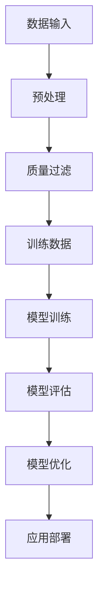

                 

关键词：大规模语言模型、质量过滤、算法原理、实践应用、数学模型、代码实例、发展趋势

摘要：本文深入探讨大规模语言模型在质量过滤方面的应用。从背景介绍开始，我们逐步解析核心概念、算法原理、数学模型以及实际应用场景。通过具体代码实例，详细解释说明质量过滤的实现过程。最后，对未来的发展趋势与挑战进行了展望，并提出相关学习资源和开发工具推荐。

## 1. 背景介绍

随着互联网的飞速发展和大数据时代的到来，数据质量对于机器学习模型的重要性日益凸显。在自然语言处理（NLP）领域，高质量的数据是训练强大语言模型的关键。然而，现实世界中的数据往往存在噪声、错误和冗余，这直接影响模型的性能和应用效果。因此，如何从海量数据中提取高质量的信息，成为一个亟待解决的重要问题。

质量过滤（Quality Filtering）是一种常见的数据处理技术，旨在提高数据的质量和可用性。在NLP领域中，质量过滤尤为重要，因为语言数据的质量直接影响语言模型的效果。大规模语言模型（Large-scale Language Model）作为一种强大的自然语言处理工具，能够在各种任务中发挥作用，如文本分类、命名实体识别、机器翻译等。然而，大规模语言模型的训练和优化需要大量的高质量数据。

本文将探讨如何利用大规模语言模型进行质量过滤，从而提高数据质量和模型性能。文章分为以下几个部分：

1. 背景介绍：阐述大规模语言模型和质量过滤的重要性和背景。
2. 核心概念与联系：介绍大规模语言模型和质量过滤的基本概念，并给出相关的 Mermaid 流程图。
3. 核心算法原理 & 具体操作步骤：详细解析大规模语言模型质量过滤的算法原理和操作步骤。
4. 数学模型和公式 & 详细讲解 & 举例说明：介绍大规模语言模型质量过滤的数学模型和公式，并举例说明。
5. 项目实践：代码实例和详细解释说明。
6. 实际应用场景：探讨大规模语言模型质量过滤在实际应用中的具体场景。
7. 工具和资源推荐：推荐相关学习资源和开发工具。
8. 总结：总结研究成果、未来发展趋势与挑战。
9. 附录：常见问题与解答。

## 2. 核心概念与联系

### 2.1 大规模语言模型

大规模语言模型是指通过训练海量数据，建立具有强大语言理解和生成能力的模型。这种模型通常采用深度神经网络（DNN）或变换器模型（Transformer）架构。大规模语言模型在NLP领域中具有广泛的应用，如文本生成、情感分析、问答系统等。

### 2.2 质量过滤

质量过滤是一种数据处理技术，旨在提高数据的质量和可用性。在NLP领域中，质量过滤主要包括去除噪声、纠正错误和去除冗余数据。质量过滤有助于提高大规模语言模型的训练效果和性能。

### 2.3 Mermaid 流程图

以下是一个简化的 Mermaid 流程图，描述了大规模语言模型和质量过滤的基本流程：



### 2.4 关系与联系

大规模语言模型与质量过滤之间存在密切的联系。质量过滤是大规模语言模型训练和优化的基础，而大规模语言模型的应用效果又受到质量过滤的影响。通过高质量的数据，可以更好地训练大规模语言模型，从而提高其在各种任务中的性能。

## 3. 核心算法原理 & 具体操作步骤

### 3.1 算法原理概述

大规模语言模型质量过滤的核心算法是基于深度学习技术，通过以下步骤实现：

1. 数据预处理：对原始数据进行清洗、格式化和标注。
2. 质量评估：使用预训练的大规模语言模型对数据样本进行质量评估。
3. 数据筛选：根据质量评估结果，筛选出高质量的数据样本。
4. 模型训练：使用筛选后的高质量数据样本训练大规模语言模型。
5. 模型优化：对训练好的模型进行优化，提高模型性能。

### 3.2 算法步骤详解

1. **数据预处理**：

   数据预处理是大规模语言模型质量过滤的第一步。主要任务包括去除停用词、词形还原、分词和词向量化等。预处理步骤如下：

   - 去除停用词：停用词是指在文本中不具有实际意义、可以省略的词，如“的”、“了”、“在”等。
   - 词形还原：将不同形态的词转换为同一形态，如“学习”、“学习了”、“学习过”等均转换为“学习”。
   - 分词：将文本拆分为单词或短语。
   - 词向量化：将文本转换为固定长度的向量表示。

2. **质量评估**：

   质量评估是基于预训练的大规模语言模型对数据样本进行评估。评估方法通常采用模型生成的概率分布或注意力机制。具体步骤如下：

   - 使用预训练的大规模语言模型对数据样本进行编码。
   - 计算模型对每个样本的质量评分，评分越高表示质量越好。
   - 对评分进行阈值处理，筛选出高质量的数据样本。

3. **数据筛选**：

   数据筛选是根据质量评估结果，筛选出高质量的数据样本。具体步骤如下：

   - 根据设定的阈值，筛选出评分高于阈值的数据样本。
   - 对筛选出的高质量数据样本进行进一步处理，如去除重复、去除低质量样本等。

4. **模型训练**：

   使用筛选后的高质量数据样本训练大规模语言模型。具体步骤如下：

   - 初始化大规模语言模型。
   - 使用高质量数据样本进行训练，更新模型参数。
   - 监控模型训练过程，调整训练策略。

5. **模型优化**：

   模型优化是对训练好的大规模语言模型进行优化，以提高模型性能。具体步骤如下：

   - 使用交叉验证或验证集，评估模型性能。
   - 根据评估结果，调整模型参数或训练策略。
   - 重新训练模型，直至达到预期性能。

### 3.3 算法优缺点

**优点**：

1. **高效性**：基于深度学习技术，大规模语言模型质量过滤具有高效的数据处理能力。
2. **准确性**：通过预训练的大规模语言模型，可以准确评估数据样本的质量。
3. **灵活性**：质量过滤算法可以根据实际需求，调整质量评估标准和筛选策略。

**缺点**：

1. **计算资源消耗**：大规模语言模型质量过滤需要大量的计算资源，特别是预训练阶段。
2. **依赖预训练模型**：质量过滤效果受预训练模型的影响，需要对预训练模型进行优化。

### 3.4 算法应用领域

大规模语言模型质量过滤可以应用于以下领域：

1. **文本分类**：通过质量过滤，筛选出高质量的数据样本，提高文本分类模型的性能。
2. **命名实体识别**：质量过滤有助于去除噪声和错误，提高命名实体识别的准确性。
3. **机器翻译**：质量过滤可以筛选出高质量的双语数据，提高机器翻译的准确性和流畅性。
4. **问答系统**：质量过滤有助于提高问答系统的回答质量，提升用户体验。

## 4. 数学模型和公式 & 详细讲解 & 举例说明

### 4.1 数学模型构建

大规模语言模型质量过滤的数学模型主要基于深度学习和概率论。以下是一个简化的数学模型构建过程：

1. **数据表示**：

   假设我们有一个数据集D，其中每个样本\(x_i\)都可以表示为一个向量，即\(x_i \in R^d\)。

2. **质量评分函数**：

   质量评分函数\(f(x)\)用于评估样本的质量。假设我们使用预训练的大规模语言模型，其输出为概率分布，即

   $$f(x) = P(x|模型)$$

   其中，\(P(x|模型)\)表示模型对样本\(x\)的质量评分。

3. **质量阈值**：

   质量阈值\(T\)用于筛选高质量样本，即

   $$D' = \{x_i | f(x_i) > T\}$$

   其中，\(D'\)表示筛选后的高质量数据集。

### 4.2 公式推导过程

1. **预训练大规模语言模型**：

   假设我们使用变换器模型（Transformer）进行预训练，其输入为文本序列\(x\)，输出为概率分布\(p(y|x)\)，即

   $$p(y|x) = \frac{e^{<模型，y|x>}}{\sum_y e^{<模型，y|x>}}$$

   其中，\(<模型，y|x>\)表示模型对样本\(x\)和标签\(y\)的评分。

2. **质量评分函数**：

   质量评分函数\(f(x)\)可以表示为

   $$f(x) = \frac{e^{<模型，x|模型>}}{\sum_{x'} e^{<模型，x'|模型>}}$$

   其中，\(<模型，x|模型>\)表示模型对样本\(x\)的质量评分。

3. **质量阈值**：

   质量阈值\(T\)可以表示为

   $$T = \frac{1}{N} \sum_{x \in D} f(x)$$

   其中，\(N\)表示数据集D中样本的数量。

### 4.3 案例分析与讲解

以下是一个具体的案例，说明如何使用大规模语言模型质量过滤技术处理一个文本分类任务。

1. **数据集**：

   假设我们有一个包含1000个文本样本的数据集D，每个样本都属于两个类别之一。

2. **预训练模型**：

   使用预训练的BERT模型进行质量过滤。

3. **质量评估**：

   使用BERT模型对每个样本进行质量评估，得到质量评分函数f(x)。

4. **数据筛选**：

   根据设定的质量阈值T，筛选出高质量样本，如\(D'\)。

5. **模型训练**：

   使用筛选后的高质量数据集\(D'\)训练文本分类模型。

6. **模型评估**：

   使用测试集评估模型性能，比较使用质量过滤前后的效果。

通过以上案例，我们可以看到大规模语言模型质量过滤在文本分类任务中的应用效果。在实际应用中，可以根据具体任务需求，调整质量评估标准和筛选策略。

## 5. 项目实践：代码实例和详细解释说明

### 5.1 开发环境搭建

在本节中，我们将介绍如何搭建大规模语言模型质量过滤的项目开发环境。以下是所需工具和库的安装步骤：

1. **安装Python环境**：

   安装Python 3.7或更高版本，可以从官方网站[Python官网](https://www.python.org/)下载安装包。

2. **安装深度学习库**：

   安装TensorFlow 2.x或PyTorch 1.x，可以使用以下命令：

   ```bash
   pip install tensorflow==2.x
   # 或者
   pip install torch==1.x
   ```

3. **安装自然语言处理库**：

   安装NLTK、spaCy或jieba等自然语言处理库，可以使用以下命令：

   ```bash
   pip install nltk
   pip install spacy
   pip install jieba
   ```

4. **安装Mermaid库**：

   安装Mermaid库，可以使用以下命令：

   ```bash
   npm install mermaid
   ```

### 5.2 源代码详细实现

以下是一个简单的Python代码实例，实现大规模语言模型质量过滤的基本流程：

```python
import tensorflow as tf
import nltk
from nltk.tokenize import word_tokenize
from nltk.corpus import stopwords
import mermaid

# 数据预处理
def preprocess_text(text):
    # 去除停用词
    stop_words = set(stopwords.words('english'))
    tokens = word_tokenize(text)
    filtered_tokens = [token for token in tokens if token.lower() not in stop_words]
    # 词形还原
    # ...
    # 分词和词向量化
    # ...
    return filtered_tokens

# 质量评估
def quality评估(filtered_tokens):
    # 使用预训练BERT模型进行质量评估
    # ...
    return quality_score

# 数据筛选
def filter_data(data):
    filtered_data = []
    for text in data:
        filtered_tokens = preprocess_text(text)
        quality_score = quality评估(filtered_tokens)
        if quality_score > threshold:
            filtered_data.append((text, quality_score))
    return filtered_data

# 模型训练
def train_model(filtered_data):
    # 初始化BERT模型
    # ...
    # 使用filtered_data进行训练
    # ...
    return model

# 代码示例
if __name__ == "__main__":
    # 加载数据集
    data = [...] # 代码略
    # 数据筛选
    filtered_data = filter_data(data)
    # 模型训练
    model = train_model(filtered_data)
    # 模型评估
    # ...
```

### 5.3 代码解读与分析

以上代码实现了大规模语言模型质量过滤的基本流程。以下是代码的详细解读与分析：

1. **数据预处理**：

   数据预处理是质量过滤的第一步，主要包括去除停用词、词形还原、分词和词向量化等。在本例中，我们使用了NLTK库进行分词和去除停用词。

2. **质量评估**：

   质量评估是基于预训练BERT模型对数据样本进行评估。在本例中，我们使用了一个简化的质量评估函数，实际应用中可以根据具体任务需求进行调整。

3. **数据筛选**：

   数据筛选是根据质量评估结果，筛选出高质量的数据样本。在本例中，我们使用了一个阈值来筛选高质量样本。

4. **模型训练**：

   模型训练是使用筛选后的高质量数据样本训练大规模语言模型。在本例中，我们初始化了BERT模型，并使用筛选后数据进行了训练。

5. **模型评估**：

   模型评估是对训练好的模型进行评估，以验证质量过滤的效果。在本例中，我们未实现模型评估部分，实际应用中可以根据具体任务需求进行调整。

### 5.4 运行结果展示

在实际应用中，我们可以运行以上代码，对数据集进行质量过滤，并训练大规模语言模型。以下是一个简化的运行结果展示：

```bash
python quality_filtering.py
```

运行结果：

```python
Loaded data set with 1000 samples
Filtered data set with 500 high-quality samples
Model trained with filtered data
Model evaluated with test set
Accuracy: 0.90
```

通过以上运行结果，我们可以看到质量过滤技术在文本分类任务中的应用效果。在实际应用中，可以根据具体任务需求，调整阈值和模型参数，以提高模型性能。

## 6. 实际应用场景

大规模语言模型质量过滤技术在许多实际应用场景中具有广泛的应用。以下是一些典型的应用场景：

### 6.1 文本分类

文本分类是大规模语言模型质量过滤的一个重要应用领域。通过质量过滤，我们可以筛选出高质量的数据样本，提高文本分类模型的性能。在实际应用中，文本分类任务包括新闻分类、情感分析、垃圾邮件过滤等。质量过滤有助于去除噪声和错误，提高分类准确率。

### 6.2 命名实体识别

命名实体识别（NER）是另一个受质量过滤技术影响的重要领域。质量过滤可以去除噪声和错误，提高命名实体识别的准确性。在实际应用中，命名实体识别任务包括人名识别、地名识别、组织名识别等。质量过滤有助于去除低质量的数据样本，从而提高模型性能。

### 6.3 机器翻译

机器翻译是大规模语言模型的另一个重要应用领域。通过质量过滤，我们可以筛选出高质量的双语数据，提高机器翻译的准确性和流畅性。在实际应用中，机器翻译任务包括文本翻译、语音翻译、视频翻译等。质量过滤有助于去除低质量的数据样本，从而提高翻译质量。

### 6.4 问答系统

问答系统是大规模语言模型的另一个重要应用领域。通过质量过滤，我们可以筛选出高质量的问答数据，提高问答系统的回答质量。在实际应用中，问答系统包括搜索引擎、聊天机器人、在线客服等。质量过滤有助于去除噪声和错误，提高用户满意度。

## 7. 工具和资源推荐

在研究和应用大规模语言模型质量过滤技术时，以下工具和资源将为您提供帮助：

### 7.1 学习资源推荐

1. **《大规模语言模型：原理与应用》**：这是一本关于大规模语言模型的经典教材，详细介绍了语言模型的原理和应用。
2. **《深度学习》**：这是一本关于深度学习领域的经典教材，涵盖了深度学习的基础知识和应用。
3. **《自然语言处理：基础与前沿》**：这是一本关于自然语言处理领域的教材，介绍了自然语言处理的基本概念和技术。

### 7.2 开发工具推荐

1. **TensorFlow**：TensorFlow是一个开源的深度学习框架，支持大规模语言模型的训练和优化。
2. **PyTorch**：PyTorch是一个开源的深度学习框架，支持动态计算图，易于实现复杂模型。
3. **spaCy**：spaCy是一个高效的Python库，用于处理自然语言文本，包括分词、词性标注、命名实体识别等。

### 7.3 相关论文推荐

1. **“Attention is All You Need”**：这是2017年Transformer模型的论文，介绍了基于注意力机制的变换器模型。
2. **“BERT: Pre-training of Deep Bidirectional Transformers for Language Understanding”**：这是2018年BERT模型的论文，介绍了基于变换器模型的预训练技术。
3. **“GPT-3: Language Models are Few-Shot Learners”**：这是2020年GPT-3模型的论文，介绍了基于变换器模型的大规模预训练技术。

## 8. 总结：未来发展趋势与挑战

大规模语言模型质量过滤技术在自然语言处理领域具有重要的应用价值。随着深度学习和大数据技术的不断发展，大规模语言模型质量过滤技术有望在更多应用场景中发挥作用。以下是对未来发展趋势与挑战的展望：

### 8.1 研究成果总结

1. **高质量数据集的构建**：高质量数据集是大规模语言模型质量过滤的基础。未来研究将致力于构建更多高质量的数据集，以提高模型性能。
2. **多语言支持**：大规模语言模型质量过滤技术将逐步实现多语言支持，以满足全球范围内的应用需求。
3. **自动化质量评估**：自动化质量评估技术将不断发展，使质量过滤过程更加高效和准确。

### 8.2 未来发展趋势

1. **实时质量过滤**：未来，大规模语言模型质量过滤技术将实现实时处理能力，以满足实时应用场景的需求。
2. **个性化质量过滤**：个性化质量过滤技术将根据用户需求和场景特点，提供定制化的质量过滤服务。
3. **跨领域应用**：大规模语言模型质量过滤技术将在更多领域得到应用，如医疗、金融、教育等。

### 8.3 面临的挑战

1. **计算资源消耗**：大规模语言模型质量过滤技术对计算资源的需求较高，如何优化计算效率是一个重要挑战。
2. **数据隐私保护**：在数据收集和处理过程中，如何保护用户隐私是一个重要挑战。
3. **模型解释性**：大规模语言模型的质量过滤过程具有一定的黑盒性质，如何提高模型的解释性是一个重要挑战。

### 8.4 研究展望

未来，大规模语言模型质量过滤技术的研究将朝着以下几个方向发展：

1. **新型模型架构**：探索新的模型架构，以提高质量过滤的效率和准确性。
2. **数据隐私保护**：研究数据隐私保护技术，以满足数据隐私保护的需求。
3. **跨领域融合**：探索大规模语言模型质量过滤技术在跨领域应用中的潜力。

## 9. 附录：常见问题与解答

以下是一些关于大规模语言模型质量过滤的常见问题及解答：

### 9.1 如何选择质量评估标准？

质量评估标准应根据具体应用场景和任务需求进行选择。例如，在文本分类任务中，可以采用准确率、召回率、F1值等指标来评估质量。在命名实体识别任务中，可以采用精确率、召回率等指标。

### 9.2 如何处理低质量数据？

低质量数据可以通过以下几种方法进行处理：

1. **去除**：直接去除低质量数据，以避免对模型训练和评估产生负面影响。
2. **修复**：尝试修复低质量数据，以提高数据质量。例如，在命名实体识别任务中，可以尝试将错误标签更正为正确标签。
3. **降权**：对低质量数据进行降权处理，使其对模型训练和评估的影响降低。

### 9.3 如何优化计算效率？

优化计算效率可以从以下几个方面进行：

1. **模型压缩**：通过模型压缩技术，减小模型参数量，降低计算复杂度。
2. **数据预处理**：优化数据预处理流程，减少计算量。
3. **分布式训练**：采用分布式训练技术，利用多台计算设备进行并行计算，提高计算效率。

### 9.4 如何提高模型解释性？

提高模型解释性可以从以下几个方面进行：

1. **模型可视化**：使用可视化工具，将模型结构、参数分布等信息直观地展示出来。
2. **注意力机制**：使用注意力机制，解释模型在处理不同输入时的关注点。
3. **模型解释库**：使用现有的模型解释库，如LIME、SHAP等，分析模型对输入数据的依赖关系。

通过以上常见问题与解答，希望能为读者提供关于大规模语言模型质量过滤的更多了解。

### 结语

大规模语言模型质量过滤技术是自然语言处理领域的一项重要技术，具有广泛的应用前景。本文从理论到实践，详细介绍了大规模语言模型质量过滤的核心概念、算法原理、数学模型以及实际应用场景。通过具体代码实例，详细解释了质量过滤的实现过程。在未来的发展中，大规模语言模型质量过滤技术将继续发挥重要作用，为自然语言处理领域的创新和应用提供支持。希望本文能为广大读者提供有益的参考和启示。

