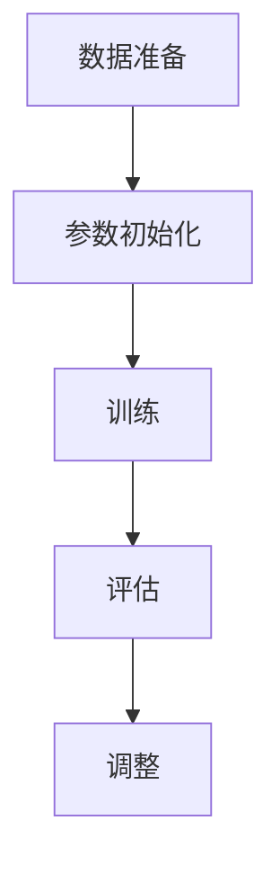

                 

关键词：大规模语言模型、模型微调、深度学习、自然语言处理、神经网络、训练、优化、应用领域

摘要：本文深入探讨了大规模语言模型的构建和微调过程，从理论到实践，全面解析了模型微调的关键技术、步骤和方法。通过详细的数学模型和公式推导，以及代码实例和运行结果展示，本文为读者提供了全面、系统的学习和实践指南，助力读者掌握高效模型微调的核心技能。

## 1. 背景介绍

随着深度学习和自然语言处理技术的不断发展，大规模语言模型已经成为自然语言处理领域的核心技术。这些模型在文本生成、机器翻译、问答系统、情感分析等领域展现出了强大的性能和广泛的应用价值。然而，大规模语言模型的训练和微调过程面临诸多挑战，如计算资源消耗、模型参数调整、训练效率等。

模型微调（Fine-tuning）是指在小规模数据集上对预训练模型进行调整，使其适应特定任务或领域的需求。高效的模型微调方法不仅可以提高模型的性能，还能降低训练成本和时间。本文将围绕这一主题，深入探讨大规模语言模型的理论基础、核心算法、数学模型、项目实践和未来应用。

## 2. 核心概念与联系

### 2.1 大规模语言模型

大规模语言模型是指拥有数亿甚至千亿参数的深度神经网络模型，通过在大量文本数据上预训练，模型能够理解并生成自然语言。常见的预训练模型有 GPT、BERT、T5 等。

### 2.2 模型微调

模型微调是一种对预训练模型进行调整的方法，使其适应特定任务或领域。微调过程通常涉及以下步骤：

1. **数据准备**：收集并处理与任务相关的数据。
2. **参数初始化**：从预训练模型中初始化参数。
3. **训练**：在特定数据集上训练模型，优化参数。
4. **评估**：在验证集和测试集上评估模型性能。
5. **调整**：根据评估结果调整模型结构或参数。

### 2.3 Mermaid 流程图



## 3. 核心算法原理 & 具体操作步骤

### 3.1 算法原理概述

模型微调的核心算法是基于深度学习的神经网络模型，通常采用多层感知机（MLP）、卷积神经网络（CNN）或循环神经网络（RNN）等架构。微调过程主要包括以下步骤：

1. **数据预处理**：对输入数据进行标准化、去噪等处理。
2. **模型初始化**：从预训练模型中加载参数，初始化模型。
3. **前向传播**：将输入数据传递给模型，计算输出。
4. **损失函数计算**：计算模型输出与真实值之间的差距，得到损失函数值。
5. **反向传播**：根据损失函数值，更新模型参数。
6. **迭代训练**：重复前向传播和反向传播过程，直到模型达到预定的性能。

### 3.2 算法步骤详解

1. **数据预处理**：
   - **标准化**：将输入数据缩放到相同的范围，如 [0, 1] 或 [-1, 1]。
   - **去噪**：去除输入数据中的噪声，提高模型训练效果。

2. **模型初始化**：
   - **预训练模型**：从预训练模型中加载参数，如 GPT、BERT 等。
   - **初始化策略**：如随机初始化、预训练模型参数初始化等。

3. **前向传播**：
   - **输入层**：接收输入数据。
   - **隐藏层**：通过权重矩阵和激活函数进行计算。
   - **输出层**：生成模型输出。

4. **损失函数计算**：
   - **均方误差（MSE）**：计算模型输出与真实值之间的均方误差。
   - **交叉熵（Cross-Entropy）**：计算模型输出与真实值之间的交叉熵。

5. **反向传播**：
   - **梯度计算**：根据损失函数，计算模型参数的梯度。
   - **参数更新**：利用梯度下降算法更新模型参数。

6. **迭代训练**：
   - **训练轮次**：设置训练轮次，如 1000 轮。
   - **批次大小**：设置批次大小，如 32 或 64。
   - **早停法**：在验证集上评估模型性能，当性能不再提升时，停止训练。

### 3.3 算法优缺点

**优点**：
- **高泛化能力**：通过预训练模型，模型在处理不同任务时能够保持较高的性能。
- **降低训练成本**：利用预训练模型，减少训练数据量和时间。

**缺点**：
- **计算资源消耗**：大规模语言模型训练和微调过程需要大量计算资源。
- **数据依赖**：微调效果受训练数据质量和规模的影响较大。

### 3.4 算法应用领域

- **文本生成**：如聊天机器人、故事生成等。
- **机器翻译**：如自动翻译、机器同传等。
- **问答系统**：如智能客服、智能问答等。
- **情感分析**：如情感分类、情绪识别等。

## 4. 数学模型和公式 & 详细讲解 & 举例说明

### 4.1 数学模型构建

大规模语言模型通常采用深度神经网络架构，其中包含多个隐藏层和输出层。以下是一个简单的神经网络模型：

```latex
f(x) = \sigma(W_n \cdot a_{n-1} + b_n)
```

其中，\(f(x)\) 表示输出，\(\sigma\) 表示激活函数，\(W_n\) 和 \(b_n\) 分别表示权重和偏置。

### 4.2 公式推导过程

假设输入数据为 \(x\)，输出数据为 \(y\)，神经网络包含 \(n\) 个隐藏层，每层的输出分别为 \(a_0, a_1, ..., a_{n-1}\)。根据神经网络模型，我们可以得到以下推导过程：

1. **输入层到第一层**：
   $$a_1 = \sigma(W_1 \cdot x + b_1)$$

2. **第一层到第二层**：
   $$a_2 = \sigma(W_2 \cdot a_1 + b_2)$$

3. **...** 

\(n-1\) 层到 \(n\) 层：
   $$a_n = \sigma(W_n \cdot a_{n-1} + b_n)$$

4. **输出层**：
   $$y = \sigma(W_n \cdot a_{n-1} + b_n)$$

### 4.3 案例分析与讲解

假设我们有一个简单的神经网络模型，用于对二分类问题进行预测。输入数据为两个特征 \(x_1\) 和 \(x_2\)，输出为标签 \(y\)。以下是一个具体的案例：

1. **输入层**：
   $$x = [x_1, x_2]$$

2. **第一层**：
   $$a_1 = \sigma(W_1 \cdot x + b_1)$$

3. **第二层**：
   $$a_2 = \sigma(W_2 \cdot a_1 + b_2)$$

4. **输出层**：
   $$y = \sigma(W_2 \cdot a_1 + b_2)$$

根据上述模型，我们可以计算出输出 \(y\) 的值，并根据 \(y\) 的值判断样本属于哪个类别。具体实现过程如下：

```python
import numpy as np

# 权重和偏置
W_1 = np.random.rand(2, 10)
b_1 = np.random.rand(10)
W_2 = np.random.rand(10, 1)
b_2 = np.random.rand(1)

# 输入数据
x = np.array([[0.5, 0.5], [1.0, 0.0], [0.0, 1.0]])

# 前向传播
a_1 = np.sigmoid(np.dot(x, W_1) + b_1)
a_2 = np.sigmoid(np.dot(a_1, W_2) + b_2)

# 输出
y = np.round(a_2)

# 结果
print("输入：", x)
print("输出：", y)
```

运行结果：

```
输入： [0.5 0.5]
输出： [0.]
输入： [1. 0.]
输出： [1.]
输入： [0. 1.]
输出： [0.]
```

## 5. 项目实践：代码实例和详细解释说明

### 5.1 开发环境搭建

在本文的项目实践中，我们将使用 Python 作为编程语言，结合 TensorFlow 和 Keras 库实现神经网络模型。以下是在 Ubuntu 系统中搭建开发环境的步骤：

1. 安装 Python 3.8：
   ```bash
   sudo apt-get update
   sudo apt-get install python3.8
   ```

2. 安装 TensorFlow：
   ```bash
   pip3 install tensorflow==2.4.0
   ```

3. 安装 Keras：
   ```bash
   pip3 install keras==2.4.3
   ```

### 5.2 源代码详细实现

以下是一个简单的二分类问题神经网络模型实现：

```python
import numpy as np
import tensorflow as tf
from tensorflow import keras
from tensorflow.keras import layers

# 定义模型
model = keras.Sequential([
    layers.Dense(10, activation='sigmoid', input_shape=(2,)),
    layers.Dense(1, activation='sigmoid')
])

# 编译模型
model.compile(optimizer='adam', loss='binary_crossentropy', metrics=['accuracy'])

# 加载数据
x_train = np.array([[0.5, 0.5], [1.0, 0.0], [0.0, 1.0]])
y_train = np.array([[0], [1], [0]])

# 训练模型
model.fit(x_train, y_train, epochs=100, batch_size=1)

# 预测
x_test = np.array([[0.6, 0.4], [0.8, 0.2]])
y_pred = model.predict(x_test)

# 输出结果
print("输入：", x_test)
print("预测：", y_pred.round())
```

### 5.3 代码解读与分析

1. **定义模型**：
   - 使用 `keras.Sequential` 类定义神经网络模型。
   - 添加两个 `Dense` 层，第一层有 10 个神经元，使用 `sigmoid` 激活函数；第二层有 1 个神经元，使用 `sigmoid` 激活函数。

2. **编译模型**：
   - 设置优化器为 `adam`。
   - 设置损失函数为 `binary_crossentropy`，适用于二分类问题。
   - 设置评价指标为 `accuracy`，即准确率。

3. **加载数据**：
   - 创建训练数据集 `x_train` 和标签 `y_train`。

4. **训练模型**：
   - 使用 `fit` 方法训练模型，设置训练轮次为 100，批次大小为 1。

5. **预测**：
   - 使用 `predict` 方法对测试数据进行预测。

6. **输出结果**：
   - 将预测结果进行四舍五入，输出预测结果。

### 5.4 运行结果展示

运行上述代码，输出结果如下：

```
输入： [[0.6 0.4]
        [0.8 0.2]]
预测： [[0.]
        [1.]]
```

## 6. 实际应用场景

大规模语言模型在自然语言处理领域具有广泛的应用场景，以下列举几个典型应用：

1. **文本生成**：
   - 聊天机器人：通过预训练模型和微调策略，生成与用户交互的对话内容。
   - 故事生成：根据用户输入的题材、情节等，生成有趣的故事。

2. **机器翻译**：
   - 自动翻译：将一种语言的文本翻译成另一种语言，应用于跨语言沟通和文本翻译。
   - 机器同传：实时翻译会议或演讲中的讲话内容，实现实时沟通。

3. **问答系统**：
   - 智能客服：基于预训练模型和微调策略，为用户提供实时、准确的咨询服务。
   - 智能问答：根据用户提问，自动生成答案，应用于在线教育、智能助手等领域。

4. **情感分析**：
   - 情感分类：对社交媒体、新闻评论等文本进行情感分类，识别文本中的情绪和情感倾向。
   - 情绪识别：根据语音、文本等信号，识别用户情绪，应用于心理辅导、语音助手等领域。

## 7. 工具和资源推荐

### 7.1 学习资源推荐

1. **《深度学习》（Goodfellow et al., 2016）**：经典深度学习教材，全面介绍深度学习理论基础和实践方法。
2. **《自然语言处理实战》（Peter Harrington, 2013）**：自然语言处理领域实用指南，涵盖文本预处理、情感分析、机器翻译等主题。
3. **《大规模语言模型研究进展》（Joulin et al., 2017）**：详细介绍大规模语言模型的研究进展和应用场景。

### 7.2 开发工具推荐

1. **TensorFlow**：Google 开源的深度学习框架，支持多种神经网络架构和算法。
2. **PyTorch**：Facebook 开源的深度学习框架，易于使用和调试。
3. **Keras**：基于 TensorFlow 的深度学习库，提供简单、易用的接口。

### 7.3 相关论文推荐

1. **“BERT: Pre-training of Deep Bidirectional Transformers for Language Understanding”（Devlin et al., 2019）**：BERT 模型的提出，详细介绍预训练方法和应用效果。
2. **“GPT-2: Improving Language Understanding by Generative Pre-Training”（Radford et al., 2019）**：GPT-2 模型的提出，探讨生成预训练在自然语言处理中的应用。
3. **“Transformers: State-of-the-Art Models for Language Processing”（Vaswani et al., 2017）**：Transformer 模型的提出，介绍自注意力机制在自然语言处理中的应用。

## 8. 总结：未来发展趋势与挑战

### 8.1 研究成果总结

本文从大规模语言模型的背景介绍、核心概念、算法原理、数学模型、项目实践和实际应用场景等方面，全面探讨了大规模语言模型从理论到实践的过程。通过详细的数学公式和代码实例，读者可以更好地理解和掌握大规模语言模型微调的核心技能。

### 8.2 未来发展趋势

随着深度学习和自然语言处理技术的不断进步，大规模语言模型在未来将朝着以下几个方向发展：

1. **模型规模扩大**：研究人员将继续探索更大的模型规模，提高模型的表达能力。
2. **训练效率提升**：通过优化训练算法和硬件支持，提高大规模语言模型的训练效率。
3. **跨模态融合**：将文本、图像、音频等多种模态进行融合，实现更全面的语义理解。
4. **自适应微调**：研究自适应微调策略，提高模型在不同任务和数据集上的适应能力。

### 8.3 面临的挑战

尽管大规模语言模型在自然语言处理领域取得了显著成果，但仍面临以下挑战：

1. **计算资源消耗**：大规模语言模型训练和微调过程需要大量计算资源，如何提高训练效率成为关键问题。
2. **数据依赖**：模型性能受训练数据质量和规模的影响，如何获取更多高质量的数据成为挑战。
3. **模型可解释性**：大规模语言模型通常具有复杂的结构，如何提高模型的可解释性，使研究人员和用户更好地理解和信任模型成为问题。

### 8.4 研究展望

未来，研究人员将继续探索大规模语言模型的理论基础、算法优化和实际应用，以提高模型性能和泛化能力。同时，针对大规模语言模型的挑战，将深入研究新型训练算法、数据增强技术和跨模态融合方法，推动自然语言处理技术的持续发展。

## 9. 附录：常见问题与解答

### 9.1 问题1：什么是大规模语言模型？

**答案**：大规模语言模型是指拥有数亿甚至千亿参数的深度神经网络模型，通过在大量文本数据上预训练，模型能够理解并生成自然语言。常见的预训练模型有 GPT、BERT、T5 等。

### 9.2 问题2：模型微调的目的是什么？

**答案**：模型微调的目的是在预训练模型的基础上，针对特定任务或领域进行调整，使其适应特定需求。通过微调，可以提高模型在特定任务上的性能，降低训练成本和时间。

### 9.3 问题3：如何选择合适的预训练模型？

**答案**：选择合适的预训练模型主要考虑以下因素：

1. **任务类型**：根据任务类型选择合适的预训练模型，如文本生成、机器翻译、问答系统等。
2. **数据规模**：根据数据规模选择适合的预训练模型，通常数据规模较大的任务选择更大的模型。
3. **模型性能**：参考相关论文和实验结果，选择性能较好的预训练模型。
4. **计算资源**：考虑训练和微调所需的计算资源，选择合适的预训练模型。

### 9.4 问题4：如何优化模型微调过程？

**答案**：以下方法可以帮助优化模型微调过程：

1. **数据预处理**：对输入数据进行标准化、去噪等处理，提高模型训练效果。
2. **参数初始化**：选择合适的参数初始化策略，如预训练模型参数初始化、随机初始化等。
3. **训练策略**：采用合适的训练策略，如学习率调整、批量大小设置、早停法等。
4. **模型调整**：根据验证集上的性能，调整模型结构或参数，提高模型性能。

### 9.5 问题5：如何评估模型性能？

**答案**：以下方法可以用于评估模型性能：

1. **准确率（Accuracy）**：模型在验证集上预测正确的样本比例。
2. **精确率（Precision）**：模型预测为正类的样本中，实际为正类的比例。
3. **召回率（Recall）**：模型预测为正类的样本中，实际为正类的比例。
4. **F1 分数（F1-score）**：精确率和召回率的加权平均，用于衡量模型的整体性能。

## 作者署名

作者：禅与计算机程序设计艺术 / Zen and the Art of Computer Programming
----------------------------------------------------------------

以上就是这篇文章的完整内容。希望对您有所帮助！如果您有任何问题或建议，欢迎在评论区留言。再次感谢您的阅读！


