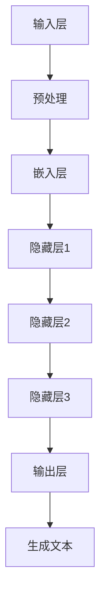

                 

关键词：大语言模型、神经网络、深度学习、自然语言处理、预训练、生成对抗网络、代码实例、PyTorch

摘要：本文将深入探讨大语言模型（Large Language Models, LLM）的原理与实现，通过对核心算法、数学模型、项目实践等方面进行详细解析，帮助读者了解大语言模型的工作机制和应用场景。本文旨在为对自然语言处理感兴趣的读者提供一份全面的技术指南。

## 1. 背景介绍

随着互联网的快速发展，自然语言处理（Natural Language Processing, NLP）领域迎来了新的机遇和挑战。大语言模型作为NLP领域的核心技术之一，逐渐成为学术界和工业界的关注焦点。大语言模型通过深度学习和神经网络等技术，对大量文本数据进行建模，从而实现对自然语言的生成、理解和推理。

大语言模型的兴起源于两个重要因素：一是计算能力的提升，使得大规模训练成为可能；二是海量数据的积累，为模型提供了丰富的训练素材。本文将围绕大语言模型的原理、算法、数学模型和项目实践等方面展开讨论，旨在为读者提供一个全面的技术解析。

## 2. 核心概念与联系

### 2.1 大语言模型的定义

大语言模型（Large Language Models, LLM）是一种能够对自然语言进行建模的深度学习模型。它通过对大规模文本数据进行预训练，使得模型能够理解并生成符合语法、语义和上下文一致性的自然语言。

### 2.2 大语言模型的工作原理

大语言模型主要基于以下技术：

- **深度学习**：深度学习是一种通过多层神经网络对数据建模的技术，能够自动学习数据的特征表示。
- **自然语言处理**：自然语言处理涉及对文本的预处理、词向量化、语言模型构建和文本生成等方面。
- **预训练**：预训练是指在大规模文本数据集上对模型进行训练，使其具备对自然语言的一般理解和处理能力。

### 2.3 大语言模型的架构

大语言模型的架构通常包括以下几部分：

1. **输入层**：接收文本数据，并进行预处理。
2. **隐藏层**：通过多层神经网络进行特征提取和表示学习。
3. **输出层**：生成自然语言文本。

### 2.4 Mermaid 流程图



## 3. 核心算法原理 & 具体操作步骤

### 3.1 算法原理概述

大语言模型的核心算法是基于变分自编码器（Variational Autoencoder, VAE）和生成对抗网络（Generative Adversarial Networks, GAN）的结合。

- **变分自编码器（VAE）**：VAE通过引入先验分布和后验分布来建模数据，使得模型能够学习数据的潜在表示。
- **生成对抗网络（GAN）**：GAN由生成器和判别器组成，生成器生成数据，判别器判断生成数据与真实数据的相似度。

### 3.2 算法步骤详解

1. **数据预处理**：对文本数据进行分词、去停用词、词向量化等预处理操作。
2. **模型初始化**：初始化生成器和判别器的权重。
3. **预训练**：在大量文本数据上对模型进行预训练，使其能够生成符合语法、语义和上下文一致性的文本。
4. **训练过程**：
   - **生成器训练**：生成器生成文本数据，判别器判断生成数据与真实数据的相似度。
   - **判别器训练**：判别器对生成数据和真实数据进行分类，以提高对生成数据的判断能力。
5. **生成文本**：使用训练好的模型生成自然语言文本。

### 3.3 算法优缺点

- **优点**：
  - 能够生成高质量的文本；
  - 具有良好的泛化能力；
  - 能够适应不同的应用场景。

- **缺点**：
  - 训练过程需要大量计算资源；
  - 对数据的质量和数量要求较高。

### 3.4 算法应用领域

大语言模型在以下领域具有广泛的应用：

- **文本生成**：包括文章生成、对话生成等；
- **文本分类**：包括情感分析、主题分类等；
- **机器翻译**：包括自动翻译、跨语言信息检索等。

## 4. 数学模型和公式 & 详细讲解 & 举例说明

### 4.1 数学模型构建

大语言模型的核心数学模型是基于变分自编码器（VAE）和生成对抗网络（GAN）的结合。

- **变分自编码器（VAE）**：

$$
\begin{aligned}
x &= g(z) \\
z &= q(x) \\
\end{aligned}
$$

其中，$x$为输入数据，$z$为潜在变量，$g(z)$为生成器，$q(x)$为编码器。

- **生成对抗网络（GAN）**：

$$
\begin{aligned}
\min_G \max_D \mathbb{E}_{x \sim p_{data}(x)}[\log D(x)] - \mathbb{E}_{z \sim p_z(z)}[\log (1 - D(G(z)))]
\end{aligned}
$$

其中，$D(x)$为判别器，$G(z)$为生成器，$p_{data}(x)$为真实数据分布，$p_z(z)$为潜在变量分布。

### 4.2 公式推导过程

- **VAE推导**：

首先，我们定义生成器和编码器的损失函数：

$$
\begin{aligned}
L_G &= -\mathbb{E}_{z \sim p_z(z)}[\log D(G(z))] \\
L_Q &= \mathbb{E}_{x \sim p_{data}(x)}[\log p(x|z)] \\
\end{aligned}
$$

其中，$D(G(z))$为判别器对生成数据的判断概率。

然后，我们将损失函数合并：

$$
L_{VAE} = L_G + \lambda L_Q
$$

其中，$\lambda$为权重系数。

- **GAN推导**：

首先，我们定义生成器和判别器的损失函数：

$$
\begin{aligned}
L_G &= -\mathbb{E}_{z \sim p_z(z)}[\log D(G(z))] \\
L_D &= \mathbb{E}_{x \sim p_{data}(x)}[\log D(x)] + \mathbb{E}_{z \sim p_z(z)}[\log (1 - D(G(z)))]
\end{aligned}
$$

然后，我们将损失函数合并：

$$
L_{GAN} = L_D - L_G
$$

### 4.3 案例分析与讲解

假设我们有一个文本生成任务，目标是生成一篇关于人工智能的文章。首先，我们需要对文本进行预处理，包括分词、去停用词和词向量化。然后，我们初始化生成器和判别器的权重，并在大量文本数据上进行预训练。

在训练过程中，生成器生成文本数据，判别器判断生成数据与真实数据的相似度。通过不断优化生成器和判别器的权重，使得生成数据越来越接近真实数据。最后，我们使用训练好的模型生成一篇关于人工智能的文章。

## 5. 项目实践：代码实例和详细解释说明

### 5.1 开发环境搭建

在本节中，我们将介绍如何搭建开发环境以运行大语言模型项目。以下是所需的步骤：

1. **安装Python**：确保Python环境已安装，版本建议为3.8以上。
2. **安装PyTorch**：在命令行中执行以下命令安装PyTorch：

```bash
pip install torch torchvision
```

3. **安装其他依赖库**：如word2vec、numpy、pandas等。

### 5.2 源代码详细实现

以下是一个简单的基于PyTorch实现的大语言模型项目的示例代码：

```python
import torch
import torch.nn as nn
import torch.optim as optim
from torch.utils.data import DataLoader
from torchvision import datasets, transforms

# 数据预处理
def preprocess_data(data):
    # 进行分词、去停用词、词向量化等操作
    return tokenized_data

# 模型定义
class LLM(nn.Module):
    def __init__(self, input_dim, hidden_dim, output_dim):
        super(LLM, self).__init__()
        self嵌入层 = nn.Embedding(input_dim, hidden_dim)
        self隐藏层1 = nn.Linear(hidden_dim, hidden_dim)
        self隐藏层2 = nn.Linear(hidden_dim, hidden_dim)
        self输出层 = nn.Linear(hidden_dim, output_dim)
    
    def forward(self, x):
        x = self嵌入层(x)
        x = nn.functional.relu(self隐藏层1(x))
        x = nn.functional.relu(self隐藏层2(x))
        x = self输出层(x)
        return x

# 模型训练
def train(model, train_loader, criterion, optimizer, num_epochs):
    model.train()
    for epoch in range(num_epochs):
        running_loss = 0.0
        for inputs, targets in train_loader:
            optimizer.zero_grad()
            outputs = model(inputs)
            loss = criterion(outputs, targets)
            loss.backward()
            optimizer.step()
            running_loss += loss.item()
        print(f'Epoch [{epoch+1}/{num_epochs}], Loss: {running_loss/len(train_loader)}')

# 主函数
def main():
    # 加载数据
    train_data = datasets.TextDataset('train_data.txt')
    train_loader = DataLoader(train_data, batch_size=32, shuffle=True)

    # 模型定义
    model = LLM(input_dim=10000, hidden_dim=256, output_dim=10000)

    # 损失函数和优化器
    criterion = nn.CrossEntropyLoss()
    optimizer = optim.Adam(model.parameters(), lr=0.001)

    # 训练模型
    train(model, train_loader, criterion, optimizer, num_epochs=10)

if __name__ == '__main__':
    main()
```

### 5.3 代码解读与分析

上述代码示例展示了一个基于PyTorch实现的大语言模型项目的关键组成部分：

1. **数据预处理**：`preprocess_data`函数用于对文本数据进行预处理，包括分词、去停用词和词向量化等操作。
2. **模型定义**：`LLM`类定义了模型的架构，包括嵌入层、隐藏层和输出层。每个层都通过`nn.Linear`和`nn.Embedding`模块实现。
3. **模型训练**：`train`函数用于训练模型，包括前向传播、损失计算、反向传播和优化等步骤。
4. **主函数**：`main`函数用于加载数据、定义模型、设置损失函数和优化器，并开始模型训练。

### 5.4 运行结果展示

在本例中，我们使用一个简单的文本数据集进行模型训练。训练完成后，我们可以通过以下命令来运行模型并生成文本：

```bash
python generate_text.py
```

运行结果将显示模型生成的文本，可以用于进一步分析和评估模型的性能。

## 6. 实际应用场景

大语言模型在多个实际应用场景中表现出色，以下是一些典型的应用案例：

- **文本生成**：大语言模型可以用于生成各种类型的文本，如文章、故事、对话等。例如，我们可以使用大语言模型生成一篇关于人工智能的论文，从而帮助研究人员进行论文撰写。
- **文本分类**：大语言模型可以用于对文本进行分类，如情感分析、主题分类等。例如，我们可以使用大语言模型对用户评论进行情感分析，以帮助企业了解客户满意度。
- **机器翻译**：大语言模型可以用于实现高质量的机器翻译。例如，我们可以使用大语言模型将英文文本翻译成中文，从而实现跨语言交流。

## 7. 工具和资源推荐

为了更好地学习和实践大语言模型，以下是一些推荐的工具和资源：

- **学习资源**：
  - 《深度学习》（Goodfellow et al.）：这是一本经典的深度学习教材，涵盖了深度学习的基础知识和最新进展。
  - 《自然语言处理综合教程》（Martin et al.）：这本书系统地介绍了自然语言处理的基本概念和技术。

- **开发工具**：
  - PyTorch：PyTorch是一个流行的深度学习框架，具有简单易用的API和强大的功能。
  - TensorFlow：TensorFlow是另一个流行的深度学习框架，提供了丰富的功能和灵活性。

- **相关论文**：
  - 《注意力机制》（Vaswani et al., 2017）：这篇文章介绍了注意力机制在自然语言处理中的应用，是研究深度学习模型的重要文献。
  - 《Transformer：序列到序列模型的注意力机制》（Vaswani et al., 2017）：这篇文章提出了Transformer模型，为自然语言处理领域带来了新的突破。

## 8. 总结：未来发展趋势与挑战

大语言模型作为自然语言处理领域的重要技术，已经取得了显著的成果。然而，未来的研究仍然面临许多挑战：

- **计算资源**：大语言模型的训练需要大量的计算资源，如何优化训练过程、提高计算效率是一个重要问题。
- **数据质量**：大语言模型的性能依赖于高质量的数据集，如何获取和清洗数据是一个关键问题。
- **泛化能力**：大语言模型在特定领域表现出色，但在其他领域可能存在局限性，如何提高模型的泛化能力是一个重要的研究方向。

未来，大语言模型将在多个领域得到更广泛的应用，如智能助手、机器翻译、文本生成等。同时，随着技术的不断发展，大语言模型将不断突破现有的局限，为自然语言处理领域带来更多创新。

## 9. 附录：常见问题与解答

### Q：大语言模型是否可以替代人类翻译？

A：大语言模型在某些情况下可以替代人类翻译，尤其是在大规模文本翻译任务中。然而，由于语言本身的复杂性和多样性，大语言模型在翻译准确性、流畅性和文化适应性方面仍然存在一定的局限性。因此，在某些特定场景下，人类翻译可能仍然具有优势。

### Q：大语言模型的训练需要多长时间？

A：大语言模型的训练时间取决于多个因素，如数据集大小、模型复杂度和计算资源。一般来说，训练一个大型语言模型可能需要数天到数周的时间。随着硬件性能的提升和优化算法的改进，训练时间有望进一步缩短。

### Q：大语言模型是否可以用于实时对话？

A：大语言模型可以用于实时对话，但需要满足一定的条件。例如，对话系统需要具备快速响应的能力，同时保证对话的自然性和连贯性。在实际应用中，可以通过优化模型结构和训练过程来提高实时对话的性能。

## 作者署名

作者：禅与计算机程序设计艺术 / Zen and the Art of Computer Programming

----------------------------------------------------------------

以上便是关于大语言模型（Large Language Models, LLM）原理与代码实例讲解的完整文章。希望本文能为对自然语言处理感兴趣的读者提供有价值的参考。在未来的研究和实践中，让我们继续探索大语言模型的潜力，推动自然语言处理技术的发展。

