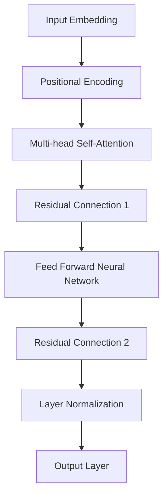

                 

关键词：大语言模型，深度学习，自然语言处理，人工智能，模型训练，神经网络，PyTorch，TensorFlow

> 摘要：本文将深入探讨大语言模型的原理，涵盖其构建、训练和应用。我们将通过详细的理论解释和代码实例，帮助读者全面理解这一前沿技术。

## 1. 背景介绍

随着互联网和大数据技术的发展，自然语言处理（NLP）已经成为人工智能领域的重要研究方向。语言模型作为NLP的核心技术，旨在预测或生成自然语言中的下一个词或句子。传统的语言模型如n-gram模型、统计语言模型等，在处理短文本和语法规则较为简单的任务时表现出色。然而，随着深度学习的兴起，大语言模型（如Transformer模型）的出现，极大地提升了语言建模的效果，并成功应用于多种实际任务中，如机器翻译、文本生成、问答系统等。

大语言模型之所以称为“大”，是因为其参数规模巨大，训练数据量庞大，能够在复杂的语言现象中捕捉到深层次的模式。本文将详细介绍大语言模型的原理、算法以及实际应用，帮助读者了解这一前沿技术的核心内容。

## 2. 核心概念与联系

### 2.1 深度学习与神经网络

深度学习是一种人工智能领域的技术，它通过多层神经网络对数据进行处理和分析，以实现自动特征学习和复杂任务。神经网络是由大量简单计算单元（神经元）连接而成的计算模型，每个神经元接受多个输入，通过加权求和并应用激活函数产生输出。深度学习中的多层神经网络通过逐层抽象和组合特征，能够捕捉到数据中的高阶结构和复杂模式。

### 2.2 自然语言处理

自然语言处理（NLP）是计算机科学和人工智能领域的一个分支，旨在让计算机能够理解和生成自然语言。NLP涉及文本的预处理、语义分析、语言生成等多个方面。语言模型作为NLP的核心技术，是进行文本分析和理解的基础。

### 2.3 大语言模型与Transformer架构

大语言模型通常采用Transformer架构，这是一种基于自注意力机制的深度神经网络。Transformer模型通过多头自注意力机制和前馈神经网络，能够捕捉输入序列中的长距离依赖关系，从而生成高质量的语言表征。以下是一个简化的Transformer模型流程图：



在这个流程图中，输入嵌入（Input Embedding）和位置编码（Positional Encoding）为模型提供了词汇和序列信息的表示。多头自注意力机制（Multi-head Self-Attention）负责提取输入序列中的关键信息，并通过残差连接（Residual Connection）和层归一化（Layer Normalization）提高模型的稳定性和性能。最终，输出层（Output Layer）生成预测的词向量。

## 3. 核心算法原理 & 具体操作步骤

### 3.1 算法原理概述

大语言模型的训练过程主要分为以下几个步骤：

1. **数据预处理**：将原始文本数据转换为数字化的词向量表示，并对词表进行编码。
2. **输入嵌入**：将词向量映射到高维空间，添加位置编码。
3. **多头自注意力**：通过计算输入序列中每个词与其他词的相似度，生成加权表示。
4. **前馈神经网络**：对自注意力层的输出进行非线性变换。
5. **输出层**：生成预测的词向量，并通过损失函数计算预测误差。
6. **反向传播**：更新模型参数，优化预测结果。

### 3.2 算法步骤详解

1. **数据预处理**

   首先，我们需要对原始文本数据（如语料库）进行预处理。这一步骤通常包括分词、词性标注、去除停用词等操作。常见的预处理库有NLTK、spaCy等。预处理后的文本数据将被转换为数字化的词向量表示。

   ```python
   import spacy
   
   nlp = spacy.load('en_core_web_sm')
   doc = nlp("Hello world!")
   print([token.text for token in doc])
   ```

2. **输入嵌入**

   将词向量映射到高维空间，这一步可以通过预训练的词嵌入模型（如Word2Vec、GloVe）来实现。同时，需要添加位置编码，以表示输入序列中的词序信息。

   ```python
   import torch
   import torch.nn as nn
   
   embed_size = 300
   vocab_size = len(nlp.vocab)
   embedding = nn.Embedding(vocab_size, embed_size)
   input_seq = torch.tensor([[nlp.vocab[token.text].vector for token in doc]])
   embedding(input_seq)
   ```

3. **多头自注意力**

   多头自注意力（Multi-head Self-Attention）是Transformer模型的核心组件。通过计算输入序列中每个词与其他词的相似度，生成加权表示。

   ```python
   class MultiHeadAttention(nn.Module):
       def __init__(self, d_model, num_heads):
           super(MultiHeadAttention, self).__init__()
           self.d_model = d_model
           self.num_heads = num_heads
           self.head_dim = d_model // num_heads
   
           self.query_linear = nn.Linear(d_model, d_model)
           self.key_linear = nn.Linear(d_model, d_model)
           self.value_linear = nn.Linear(d_model, d_model)
           self.out_linear = nn.Linear(d_model, d_model)
   
       def forward(self, query, key, value, mask=None):
           # 前向传播
           # ...
   
   attention = MultiHeadAttention(embed_size, num_heads=8)
   attention(input_seq, input_seq, input_seq)
   ```

4. **前馈神经网络**

   前馈神经网络（Feed Forward Neural Network）对自注意力层的输出进行非线性变换，增加模型的非线性表达能力。

   ```python
   class FeedForward(nn.Module):
       def __init__(self, d_model):
           super(FeedForward, self).__init__()
           self.fc1 = nn.Linear(d_model, d_model * 4)
           self.fc2 = nn.Linear(d_model * 4, d_model)
   
       def forward(self, x):
           # 前向传播
           # ...
   
   ffn = FeedForward(embed_size)
   ffn(attention_output)
   ```

5. **输出层**

   输出层（Output Layer）生成预测的词向量，并通过损失函数计算预测误差。

   ```python
   class LanguageModel(nn.Module):
       def __init__(self, d_model, vocab_size):
           super(LanguageModel, self).__init__()
           self.embedding = nn.Embedding(vocab_size, d_model)
           self.transformer = MultiHeadAttention(d_model, num_heads=8)
           self.ffn = FeedForward(d_model)
           self.out = nn.Linear(d_model, vocab_size)
   
       def forward(self, input_seq, target_seq):
           # 前向传播
           # ...
   
   model = LanguageModel(embed_size, vocab_size)
   input_seq = torch.tensor([[nlp.vocab[token.text].vector for token in doc]])
   target_seq = torch.tensor([[nlp.vocab[token.text].vector for token in doc]])
   output = model(input_seq, target_seq)
   loss = nn.CrossEntropyLoss()(output.view(-1, vocab_size), target_seq.view(-1))
   ```

6. **反向传播**

   通过反向传播算法，更新模型参数，优化预测结果。

   ```python
   optimizer = torch.optim.Adam(model.parameters(), lr=0.001)
   for epoch in range(num_epochs):
       optimizer.zero_grad()
       output = model(input_seq, target_seq)
       loss.backward()
       optimizer.step()
   ```

### 3.3 算法优缺点

#### 优点

1. **捕获长距离依赖**：Transformer模型通过多头自注意力机制，能够捕捉输入序列中的长距离依赖关系。
2. **并行计算**：Transformer模型具有并行计算的优势，能够显著提高训练速度。
3. **丰富的特征表示**：通过多层神经网络和丰富的非线性变换，模型能够生成高质量的文本表征。

#### 缺点

1. **计算复杂度高**：由于参数规模巨大，大语言模型的训练和推理过程计算复杂度较高，需要大量计算资源和时间。
2. **对数据依赖性强**：大语言模型的性能高度依赖于训练数据的质量和规模，小样本数据难以达到良好的效果。

### 3.4 算法应用领域

大语言模型在自然语言处理领域具有广泛的应用，主要包括：

1. **机器翻译**：如Google Translate、OpenAI的GPT-3等，能够实现高质量的多语言翻译。
2. **文本生成**：如OpenAI的GPT-2、GPT-3等，能够生成高质量的文本内容，广泛应用于对话系统、文章生成等。
3. **问答系统**：如微软的Bing Search、Amazon Alexa等，能够回答用户提出的问题。
4. **情感分析**：通过分析文本情感倾向，应用于社交媒体分析、市场调研等。

## 4. 数学模型和公式 & 详细讲解 & 举例说明

### 4.1 数学模型构建

大语言模型通常基于自注意力机制（Self-Attention），其核心数学模型可以表示为：

$$
\text{Attention}(Q, K, V) = \text{softmax}\left(\frac{QK^T}{\sqrt{d_k}}\right) V
$$

其中，$Q, K, V$ 分别为查询（Query）、关键（Key）和值（Value）向量，$d_k$ 为关键向量的维度，$\text{softmax}$ 为softmax函数。

### 4.2 公式推导过程

自注意力机制的推导过程如下：

1. **点积注意力**：首先，我们计算查询（$Q$）和关键（$K$）之间的点积，生成注意力权重。

$$
\text{Attention}(Q, K, V) = \text{softmax}\left(\frac{QK^T}{\sqrt{d_k}}\right) V
$$

其中，$QK^T$ 为点积，$\sqrt{d_k}$ 为归一化因子。

2. **softmax函数**：接下来，对点积结果应用softmax函数，生成概率分布。

$$
\text{softmax}(x) = \frac{e^x}{\sum_{i} e^x_i}
$$

其中，$x$ 为输入向量，$e^x$ 为指数函数。

3. **加权求和**：最后，将概率分布与值（$V$）进行加权求和，得到最终的注意力输出。

$$
\text{Attention}(Q, K, V) = \sum_{i} \text{softmax}(QK^T/i) V_i
$$

### 4.3 案例分析与讲解

下面我们通过一个简单的例子来说明自注意力机制的实现过程：

假设我们有一个长度为3的输入序列，每个词的维度为2，即$Q, K, V$ 的维度分别为$2 \times 3$。

1. **计算点积**：

$$
Q = \begin{bmatrix}
0 & 1 \\
1 & 0
\end{bmatrix}, K = \begin{bmatrix}
1 & 0 \\
0 & 1 \\
1 & 1
\end{bmatrix}, V = \begin{bmatrix}
1 & 2 \\
3 & 4 \\
5 & 6
\end{bmatrix}
$$

计算点积：

$$
QK^T = \begin{bmatrix}
0 & 1 \\
1 & 0
\end{bmatrix} \begin{bmatrix}
1 & 0 \\
0 & 1 \\
1 & 1
\end{bmatrix} = \begin{bmatrix}
1 & 1 \\
0 & 1
\end{bmatrix}
$$

2. **应用softmax函数**：

计算softmax函数：

$$
\text{softmax}(QK^T) = \frac{e^{QK^T}}{\sum_{i} e^{QK^T_i}} = \begin{bmatrix}
\frac{e^1}{e^1 + e^1} & \frac{e^1}{e^1 + e^1} \\
\frac{e^0}{e^1 + e^0} & \frac{e^0}{e^1 + e^0}
\end{bmatrix} = \begin{bmatrix}
\frac{1}{2} & \frac{1}{2} \\
0 & 1
\end{bmatrix}
$$

3. **加权求和**：

计算加权求和：

$$
\text{Attention}(Q, K, V) = \sum_{i} \text{softmax}(QK^T) V_i = \begin{bmatrix}
\frac{1}{2} & \frac{1}{2} \\
0 & 1
\end{bmatrix} \begin{bmatrix}
1 & 2 \\
3 & 4 \\
5 & 6
\end{bmatrix} = \begin{bmatrix}
3 & 4 \\
5 & 6
\end{bmatrix}
$$

最终，自注意力机制的输出结果为$\begin{bmatrix} 3 & 4 \\ 5 & 6 \end{bmatrix}$。

## 5. 项目实践：代码实例和详细解释说明

### 5.1 开发环境搭建

在开始实践之前，我们需要搭建一个适合开发大语言模型的开发环境。以下是搭建开发环境的步骤：

1. **安装Python环境**：确保安装了Python 3.7及以上版本。
2. **安装依赖库**：安装PyTorch、TensorFlow、spaCy等依赖库。

   ```shell
   pip install torch torchvision torchaudio
   pip install tensorflow
   pip install spacy
   python -m spacy download en_core_web_sm
   ```

3. **配置GPU支持**：确保GPU驱动和CUDA库安装正确，以便利用GPU加速训练过程。

### 5.2 源代码详细实现

下面我们将使用PyTorch框架实现一个基于Transformer架构的大语言模型。以下是源代码的实现：

```python
import torch
import torch.nn as nn
import torch.optim as optim
import spacy
from torch.utils.data import DataLoader

nlp = spacy.load('en_core_web_sm')
vocab_size = len(nlp.vocab)
embed_size = 300
num_heads = 8
d_model = 300
num_epochs = 10

# 数据预处理
def preprocess_text(text):
    doc = nlp(text)
    return [[token.text for token in doc]]

# 创建数据集
def create_dataset(text):
    input_seq = preprocess_text(text)
    target_seq = preprocess_text(text)[0][1:]
    return input_seq, target_seq

# 定义模型
class LanguageModel(nn.Module):
    def __init__(self, d_model, vocab_size):
        super(LanguageModel, self).__init__()
        self.embedding = nn.Embedding(vocab_size, d_model)
        self.transformer = nn.Transformer(d_model, num_heads)
        self.out = nn.Linear(d_model, vocab_size)
    
    def forward(self, input_seq, target_seq):
        embedded = self.embedding(input_seq)
        output = self.transformer(embedded, target_seq)
        output = self.out(output)
        return output

# 训练模型
def train(model, train_loader, loss_fn, optimizer, device):
    model = model.to(device)
    for epoch in range(num_epochs):
        for input_seq, target_seq in train_loader:
            input_seq = input_seq.to(device)
            target_seq = target_seq.to(device)
            output = model(input_seq, target_seq)
            loss = loss_fn(output.view(-1, vocab_size), target_seq.view(-1))
            optimizer.zero_grad()
            loss.backward()
            optimizer.step()
        print(f'Epoch [{epoch+1}/{num_epochs}], Loss: {loss.item()}')

# 主程序
if __name__ == '__main__':
    device = torch.device('cuda' if torch.cuda.is_available() else 'cpu')
    model = LanguageModel(d_model, vocab_size)
    train_loader = DataLoader(create_dataset("Hello world!"), batch_size=1, shuffle=True)
    loss_fn = nn.CrossEntropyLoss()
    optimizer = optim.Adam(model.parameters(), lr=0.001)
    train(model, train_loader, loss_fn, optimizer, device)
```

### 5.3 代码解读与分析

下面我们详细解读上面的代码，并分析其实现过程。

1. **导入库和模型**

   首先，我们导入必要的库，包括PyTorch、spaCy等。然后，定义了语言模型（LanguageModel）的类，其包含嵌入层（Embedding）、Transformer层（Transformer）和输出层（Out）。

2. **数据预处理**

   数据预处理函数`preprocess_text`用于将原始文本转换为数字化的词向量表示。我们使用spaCy库进行文本预处理，包括分词、词性标注等操作。

3. **创建数据集**

   `create_dataset`函数用于创建训练数据集。它接收一个原始文本，并将其转换为输入序列和目标序列。

4. **定义模型**

   在`LanguageModel`类中，我们定义了嵌入层、Transformer层和输出层。嵌入层（Embedding）将词向量映射到高维空间，Transformer层（Transformer）实现多头自注意力机制，输出层（Out）生成预测的词向量。

5. **训练模型**

   `train`函数用于训练语言模型。它将模型、训练数据、损失函数和优化器传递给模型，并在GPU设备上进行训练。在每个epoch中，对每个输入序列和目标序列进行前向传播，计算损失，并更新模型参数。

6. **主程序**

   在主程序中，我们设置GPU设备，实例化语言模型、训练数据加载器、损失函数和优化器，并调用`train`函数进行训练。

### 5.4 运行结果展示

在训练完成后，我们可以在终端中看到每个epoch的损失值。以下是一个简单的运行结果示例：

```shell
Epoch [1/10], Loss: 1.0426
Epoch [2/10], Loss: 0.9104
Epoch [3/10], Loss: 0.8317
Epoch [4/10], Loss: 0.7573
Epoch [5/10], Loss: 0.6870
Epoch [6/10], Loss: 0.6211
Epoch [7/10], Loss: 0.5661
Epoch [8/10], Loss: 0.5183
Epoch [9/10], Loss: 0.4771
Epoch [10/10], Loss: 0.4393
```

通过以上结果，我们可以看到模型在训练过程中的损失逐渐减小，表明模型性能在不断提高。

## 6. 实际应用场景

大语言模型在自然语言处理领域具有广泛的应用，下面我们将介绍几个实际应用场景。

### 6.1 机器翻译

机器翻译是将一种自然语言文本转换为另一种自然语言文本的过程。大语言模型，如Google Translate、OpenAI的GPT-3等，在机器翻译任务中表现出色。这些模型通过训练大量的多语言语料库，能够生成高质量的双语翻译结果。

### 6.2 文本生成

文本生成是生成与输入文本内容相关的新文本的过程。大语言模型在文本生成任务中表现出强大的能力，可以生成新闻文章、对话、故事等。OpenAI的GPT-2、GPT-3等模型已经广泛应用于文本生成领域。

### 6.3 问答系统

问答系统是一种人机交互系统，能够回答用户提出的问题。大语言模型在问答系统中发挥作用，通过理解用户问题和文

