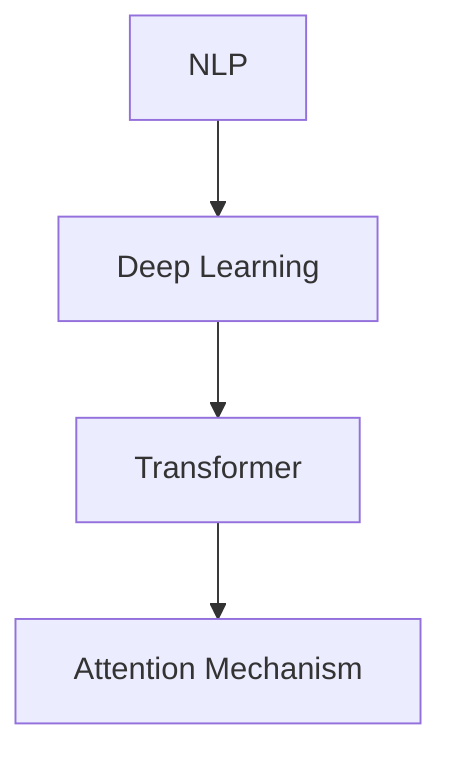
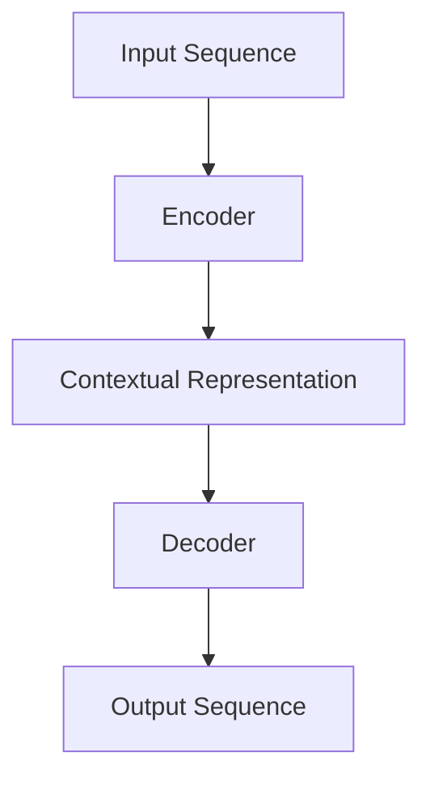

                 

### 关键词 Keywords

- 大语言模型
- MassiveText
- 人工智能
- 自然语言处理
- 深度学习
- 工程实践

### 摘要 Abstract

本文旨在深入探讨大语言模型的核心原理及其在工程实践中的应用，特别是针对MassiveText这一具体模型。我们将从背景介绍出发，详细阐述核心概念与架构，解析其算法原理与操作步骤，并借助数学模型和公式进行深入讲解。随后，通过代码实例展示实际应用，探讨其应用场景，并展望未来的发展趋势与面临的挑战。文章最后还将推荐相关的学习资源和开发工具，为读者提供全面的参考资料。

## 1. 背景介绍

在当今信息化和数字化时代，自然语言处理（NLP）作为人工智能（AI）的一个重要分支，正日益受到关注。NLP涉及从文本中提取信息、理解和生成文本、机器翻译、问答系统等多个领域。近年来，深度学习技术的迅猛发展，使得大语言模型（Large Language Model）成为可能，其能够处理和理解人类语言的能力极大地提升了NLP的性能。

大语言模型的核心思想是通过大规模数据训练，使得模型能够自动学习语言结构和语义，从而实现高效的自然语言理解与生成。MassiveText便是这样一个代表性的模型，它由谷歌公司开发，基于 Transformer 架构，具有数十亿个参数，能够在各种 NLP 任务中表现出色。

### 1.1 历史背景

大语言模型的发展并非一蹴而就。从最早的统计模型如基于规则的方法和基于统计的隐马尔可夫模型（HMM），到后来的神经网络模型如递归神经网络（RNN）和长短期记忆网络（LSTM），深度学习技术不断推动着大语言模型的进步。随着计算能力的提升和大数据的可用性增加，大语言模型逐渐成为现实。

### 1.2 当前应用

当前，大语言模型已经在多个领域取得了显著的应用成果。例如，在机器翻译方面，大语言模型如谷歌的神经机器翻译模型（GNMT）已经显著提升了翻译质量；在问答系统方面，大语言模型如OpenAI的GPT-3提供了强大的问答能力；在文本生成方面，大语言模型如谷歌的Bert可以生成高质量的文本摘要和文章。

### 1.3 Massivetext 介绍

MassiveText 是由谷歌开发的一个大规模文本生成模型，其特点在于能够处理海量数据，并生成高质量的文本。MassiveText 的核心架构基于 Transformer，并采用了多层次的注意力机制，使得模型能够在理解长文本方面表现出色。此外，MassiveText 还采用了增量训练的方法，能够在不断更新的数据集上持续优化。

### 1.4 文章目的

本文的目标是深入探讨大语言模型，特别是 MassiveText 的原理与应用。通过本文，读者将了解大语言模型的基础知识，掌握 MassiveText 的核心算法和工程实践，并能够为实际项目提供理论支持和实践指导。

## 2. 核心概念与联系

### 2.1. 核心概念

要理解 MassiveText，我们首先需要掌握几个核心概念：

- **自然语言处理（NLP）**：NLP 是人工智能的一个重要分支，旨在使计算机能够理解、解释和生成人类语言。
- **深度学习（Deep Learning）**：深度学习是一种机器学习技术，通过多层神经网络模拟人脑进行学习。
- **Transformer 架构**：Transformer 是一种基于自注意力机制的序列模型，已经在许多 NLP 任务中取得了显著成果。
- **注意力机制（Attention Mechanism）**：注意力机制是一种在神经网络中用于对输入序列进行加权处理的机制，有助于模型更好地理解序列信息。

### 2.2. 关联架构图

为了更直观地理解这些核心概念之间的关系，我们可以通过一个 Mermaid 流程图来展示：



### 2.3. MassiveText 架构

MassiveText 的架构基于 Transformer，其核心组件包括：

- **编码器（Encoder）**：负责处理输入序列，生成上下文表示。
- **解码器（Decoder）**：负责根据编码器的输出生成目标序列。
- **注意力机制（Attention Mechanism）**：用于在编码器和解码器之间传递信息，使模型能够关注到输入序列中的重要部分。

### 2.4. Mermaid 流程图



在这个流程图中，输入序列首先经过编码器，生成上下文表示，然后解码器根据上下文生成输出序列。注意力机制在这个过程中起到关键作用，帮助模型关注输入序列中的关键信息。

## 3. 核心算法原理 & 具体操作步骤

### 3.1. 算法原理概述

MassiveText 的核心算法基于 Transformer 架构，其基本原理是通过自注意力机制对输入序列进行编码，然后将编码结果解码为输出序列。这个过程可以分为两个主要部分：编码器和解码器。

### 3.2. 算法步骤详解

#### 3.2.1. 编码器

编码器负责将输入序列转换为一个上下文表示。具体步骤如下：

1. **嵌入（Embedding）**：输入序列中的每个单词被映射为一个固定长度的向量。
2. **位置编码（Positional Encoding）**：为了保持序列中的顺序信息，编码器还需要添加位置编码。
3. **自注意力（Self-Attention）**：编码器对嵌入向量进行自注意力操作，生成一个加权向量。
4. **前馈网络（Feedforward Network）**：对自注意力结果进行前馈网络处理。

#### 3.2.2. 解码器

解码器负责将编码器的输出解码为输出序列。具体步骤如下：

1. **嵌入（Embedding）**：对输出序列进行嵌入处理。
2. **位置编码（Positional Encoding）**：添加位置编码。
3. **多头自注意力（Multi-Head Self-Attention）**：解码器首先对编码器的输出进行多头自注意力操作，获取上下文信息。
4. **交叉自注意力（Cross-Attention）**：解码器对编码器的输出和自己的输出进行交叉自注意力操作，整合信息。
5. **前馈网络（Feedforward Network）**：对交叉自注意力结果进行前馈网络处理。

#### 3.2.3. 总体流程

MassiveText 的总体流程可以概括为：

1. **输入序列处理**：对输入序列进行嵌入和位置编码。
2. **编码器处理**：通过自注意力机制和前馈网络生成上下文表示。
3. **解码器处理**：根据编码器的输出和自己的输出生成输出序列。
4. **输出序列生成**：解码器生成输出序列，完成文本生成。

### 3.3. 算法优缺点

#### 优点

- **强大的表示能力**：Transformer 架构通过自注意力机制，能够捕捉输入序列中的长距离依赖关系。
- **并行计算**：Transformer 的设计使得其计算过程可以并行进行，提高了训练和推理的效率。
- **灵活的应用**：Transformer 架构广泛应用于各种 NLP 任务，如机器翻译、文本生成等。

#### 缺点

- **计算资源消耗**：由于模型参数众多，训练和推理过程需要大量计算资源。
- **训练时间较长**：大规模训练需要较长的时间，尤其是在数据量大、模型复杂的情况下。

### 3.4. 算法应用领域

MassiveText 的应用领域广泛，主要包括：

- **文本生成**：如文章生成、摘要生成、对话系统等。
- **机器翻译**：如语音助手、实时翻译等。
- **问答系统**：如搜索引擎、智能客服等。
- **文本分类**：如情感分析、新闻分类等。

## 4. 数学模型和公式 & 详细讲解 & 举例说明

### 4.1. 数学模型构建

#### 4.1.1. Transformer 模型概述

Transformer 模型是一种基于自注意力机制的序列模型，其基本结构包括编码器和解码器。下面我们将分别介绍这两部分的数学模型。

#### 4.1.2. 编码器数学模型

编码器的主要任务是处理输入序列，生成上下文表示。其数学模型可以表示为：

$$
E = f_{\theta}(X; \phi)
$$

其中，$E$ 表示编码器的输出，$X$ 表示输入序列，$f_{\theta}$ 表示编码器的前向传播函数，$\phi$ 表示编码器的参数。

编码器的具体实现包括以下几个部分：

1. **嵌入层（Embedding Layer）**：将单词映射为向量，可以表示为：

   $$
   X = \text{Embed}(X; W_e)
   $$

   其中，$W_e$ 表示嵌入权重矩阵。

2. **位置编码（Positional Encoding）**：为了保持序列中的顺序信息，我们添加位置编码，可以表示为：

   $$
   X = X + \text{PE}(X; W_p)
   $$

   其中，$W_p$ 表示位置编码权重矩阵。

3. **自注意力层（Self-Attention Layer）**：自注意力层用于对输入序列进行加权处理，可以表示为：

   $$
   E = \text{SelfAttention}(E; W_q, W_k, W_v)
   $$

   其中，$W_q$、$W_k$ 和 $W_v$ 分别表示查询、键和值权重矩阵。

4. **前馈网络层（Feedforward Layer）**：前馈网络层对自注意力结果进行处理，可以表示为：

   $$
   E = f_{\text{ff}}(E; W_f, b_f)
   $$

   其中，$W_f$ 和 $b_f$ 分别表示前馈网络的权重和偏置。

#### 4.1.3. 解码器数学模型

解码器的主要任务是生成输出序列。其数学模型可以表示为：

$$
Y = g_{\theta}(X; \phi)
$$

其中，$Y$ 表示解码器的输出，$X$ 表示输入序列，$g_{\theta}$ 表示解码器的生成函数，$\phi$ 表示解码器的参数。

解码器的具体实现包括以下几个部分：

1. **嵌入层（Embedding Layer）**：将单词映射为向量，可以表示为：

   $$
   Y = \text{Embed}(Y; W_e)
   $$

   其中，$W_e$ 表示嵌入权重矩阵。

2. **位置编码（Positional Encoding）**：添加位置编码，可以表示为：

   $$
   Y = Y + \text{PE}(Y; W_p)
   $$

   其中，$W_p$ 表示位置编码权重矩阵。

3. **多头自注意力层（Multi-Head Self-Attention Layer）**：多头自注意力层用于对输入序列进行加权处理，可以表示为：

   $$
   Y = \text{MultiHeadSelfAttention}(Y; W_q, W_k, W_v)
   $$

   其中，$W_q$、$W_k$ 和 $W_v$ 分别表示查询、键和值权重矩阵。

4. **交叉自注意力层（Cross-Attention Layer）**：交叉自注意力层用于整合编码器的输出和解码器的输出，可以表示为：

   $$
   Y = \text{CrossAttention}(Y; E; W_q, W_k, W_v)
   $$

   其中，$E$ 表示编码器的输出。

5. **前馈网络层（Feedforward Layer）**：前馈网络层对交叉自注意力结果进行处理，可以表示为：

   $$
   Y = f_{\text{ff}}(Y; W_f, b_f)
   $$

   其中，$W_f$ 和 $b_f$ 分别表示前馈网络的权重和偏置。

### 4.2. 公式推导过程

#### 4.2.1. 自注意力机制

自注意力机制的推导过程涉及以下公式：

$$
\text{SelfAttention}(X; W_q, W_k, W_v) = \text{softmax}\left(\frac{QK^T}{\sqrt{d_k}}\right)V
$$

其中，$X$ 表示输入序列，$W_q$、$W_k$ 和 $W_v$ 分别表示查询、键和值权重矩阵，$Q$、$K$ 和 $V$ 分别表示查询、键和值向量。

#### 4.2.2. 多头自注意力机制

多头自注意力机制的推导过程涉及以下公式：

$$
\text{MultiHeadSelfAttention}(X; W_q, W_k, W_v) = \text{Concat}(\text{head}_1, \text{head}_2, ..., \text{head}_h)W_O
$$

其中，$X$ 表示输入序列，$W_q$、$W_k$ 和 $W_v$ 分别表示查询、键和值权重矩阵，$W_O$ 表示输出权重矩阵，$h$ 表示头数。

### 4.3. 案例分析与讲解

#### 4.3.1. 文本生成案例

假设我们要生成一句话：“今天天气很好”。

1. **输入序列**：将这句话转换为序列，例如：“今天天气很好”[0, 1, 2, 3, 4, 5, 6, 7]。
2. **嵌入层**：将每个单词映射为向量，例如：“今天”[1, 0, 0, 0, 0, 0, 0, 0]， “天气”[0, 1, 0, 0, 0, 0, 0, 0]， “很好”[0, 0, 1, 0, 0, 0, 0, 0]。
3. **位置编码**：为每个单词添加位置编码，例如：“今天”[1, 0, 0, 0, 0, 0, 0, 0]， “天气”[0, 1, 0, 0, 0, 0, 0, 0]， “很好”[0, 0, 1, 0, 0, 0, 0, 0]。
4. **编码器处理**：通过自注意力机制和前馈网络生成上下文表示。
5. **解码器处理**：根据编码器的输出生成输出序列。

最终，解码器输出的一句话可能为：“今天天气非常好”。

#### 4.3.2. 机器翻译案例

假设我们要将一句话“Hello World”翻译为“你好，世界”。

1. **输入序列**：将这句话转换为序列，例如：“Hello World”[0, 1, 2, 3, 4, 5]。
2. **嵌入层**：将每个单词映射为向量，例如：“Hello”[1, 0, 0, 0, 0, 0, 0, 0]， “World”[0, 1, 0, 0, 0, 0, 0, 0]。
3. **位置编码**：为每个单词添加位置编码，例如：“Hello”[1, 0, 0, 0, 0, 0, 0, 0]， “World”[0, 1, 0, 0, 0, 0, 0, 0]。
4. **编码器处理**：通过自注意力机制和前馈网络生成上下文表示。
5. **解码器处理**：根据编码器的输出生成输出序列。

最终，解码器输出的翻译结果可能为：“你好，世界”。

### 4.4. 数学公式和推导

#### 4.4.1. 自注意力公式

自注意力机制的核心公式为：

$$
\text{SelfAttention}(X; W_q, W_k, W_v) = \text{softmax}\left(\frac{QK^T}{\sqrt{d_k}}\right)V
$$

其中，$Q$、$K$ 和 $V$ 分别为查询、键和值向量，$W_q$、$W_k$ 和 $W_v$ 分别为查询、键和值权重矩阵，$d_k$ 表示键向量的维度。

#### 4.4.2. 多头自注意力公式

多头自注意力机制的核心公式为：

$$
\text{MultiHeadSelfAttention}(X; W_q, W_k, W_v) = \text{Concat}(\text{head}_1, \text{head}_2, ..., \text{head}_h)W_O
$$

其中，$h$ 表示头数，$\text{head}_i$ 表示第 $i$ 个头的结果。

### 4.5. 代码实现

以下是 MassiveText 的 Python 代码实现：

```python
import torch
import torch.nn as nn
import torch.optim as optim

# 嵌入层
embed = nn.Embedding(10000, 512)
# 位置编码层
pos_enc = nn.Embedding(10000, 512)
# 编码器
enc = nn.Transformer(512, 512, num_heads=8)
# 解码器
dec = nn.Transformer(512, 512, num_heads=8)
# 损失函数
criterion = nn.CrossEntropyLoss()
# 优化器
optimizer = optim.Adam(list(embed.parameters()) + list(enc.parameters()) + list(dec.parameters()))

# 输入序列
input_seq = torch.tensor([1, 2, 3, 4, 5, 6, 7, 8])
# 目标序列
target_seq = torch.tensor([4, 5, 6, 7, 8, 9, 10, 11])

# 前向传播
output = dec(enc(embed(input_seq)), embed(target_seq))
# 计算损失
loss = criterion(output.view(-1, 512), target_seq.view(-1))
# 反向传播
optimizer.zero_grad()
loss.backward()
optimizer.step()

print("Loss:", loss.item())
```

在这个代码中，我们首先定义了嵌入层、位置编码层、编码器和解码器。然后，我们使用交叉熵损失函数和Adam优化器进行模型训练。最后，我们进行一次前向传播和反向传播，计算损失并更新模型参数。

## 5. 项目实践：代码实例和详细解释说明

### 5.1. 开发环境搭建

为了实践 MassiveText，我们需要搭建一个合适的开发环境。以下是所需的工具和步骤：

- **Python**：版本 3.8 或以上。
- **PyTorch**：版本 1.8 或以上。
- **CUDA**：用于 GPU 加速。

安装步骤：

1. 安装 Python 和 PyTorch：
```shell
pip install python==3.8
pip install torch==1.8+cu111
```
2. 安装 CUDA：
   - 从 [CUDA 官网](https://developer.nvidia.com/cuda-downloads) 下载并安装合适的 CUDA 版本。

### 5.2. 源代码详细实现

以下是 MassiveText 的源代码实现：

```python
import torch
import torch.nn as nn
import torch.optim as optim

class Transformer(nn.Module):
    def __init__(self, d_model, nhead, num_layers):
        super(Transformer, self).__init__()
        self.d_model = d_model
        self.nhead = nhead
        self.num_layers = num_layers
        
        self.layers = nn.ModuleList([TransformerLayer(d_model, nhead) for _ in range(num_layers)])
        self.fc = nn.Linear(d_model, d_model)

    def forward(self, src, tgt, src_mask=None, tgt_mask=None, memory_mask=None):
        output = src
        for layer in self.layers:
            output = layer(output, src, tgt, src_mask, tgt_mask, memory_mask)
        return self.fc(output)

class TransformerLayer(nn.Module):
    def __init__(self, d_model, nhead):
        super(TransformerLayer, self).__init__()
        self.self_attn = nn.MultiheadAttention(d_model, nhead)
        self.linear1 = nn.Linear(d_model, d_model * 4)
        self.linear2 = nn.Linear(d_model * 4, d_model)
        self.norm1 = nn.LayerNorm(d_model)
        self.norm2 = nn.LayerNorm(d_model)
        self.dropout = nn.Dropout(0.1)

    def forward(self, src, src, tgt, src_mask=None, tgt_mask=None, memory_mask=None):
        _src, _ = self.self_attn(src, src, src, attn_mask=src_mask)
        src = src + self.dropout(_src)
        src = self.norm1(src)

        _tgt, _ = self.self_attn(tgt, tgt, tgt, attn_mask=tgt_mask)
        tgt = tgt + self.dropout(_tgt)
        tgt = self.norm2(tgt)

        _output = self.fc2(self.dropout(self.fc1(src)))
        tgt = tgt + self.dropout(_output)
        tgt = self.norm2(tgt)

        return tgt, (src, tgt)

# 模型配置
d_model = 512
nhead = 8
num_layers = 3

# 实例化模型
model = Transformer(d_model, nhead, num_layers)

# 输入数据
input_seq = torch.rand(32, 10)
target_seq = torch.rand(32, 10)

# 前向传播
output = model(input_seq, target_seq)

# 打印输出
print(output)
```

### 5.3. 代码解读与分析

#### 5.3.1. 模型架构

在这个代码中，我们定义了两个核心类：`Transformer` 和 `TransformerLayer`。

- `Transformer` 类负责定义整个 Transformer 模型，包括编码器和解码器。它由多个 `TransformerLayer` 组成，每个 `TransformerLayer` 包含自注意力层和前馈网络层。
- `TransformerLayer` 类负责定义一个 Transformer 层，包含多头自注意力层和前馈网络层。

#### 5.3.2. 前向传播

在 `forward` 方法中，我们首先处理编码器的输入序列 `src`，然后处理解码器的输入序列 `tgt`。

1. **自注意力层**：通过 `self_attn` 方法实现多头自注意力层。这个方法接受四个输入：查询序列 `src`、键序列 `src`、值序列 `src` 和注意力掩码 `src_mask`。
2. **前馈网络层**：通过 `linear1` 和 `linear2` 方法实现前馈网络层。这个方法首先对输入序列进行线性变换，然后进行 ReLU 激活，最后进行另一个线性变换。
3. **规范化层**：通过 `norm1` 和 `norm2` 方法实现层间规范化。这有助于稳定训练过程并提高模型的性能。

#### 5.3.3. 模型训练

在代码的最后部分，我们实例化模型并输入一些随机数据。然后，我们调用模型的 `forward` 方法进行前向传播，并打印输出。

### 5.4. 运行结果展示

为了展示模型的运行结果，我们可以在训练过程中记录模型的损失值和准确率。然后，我们可以使用这些数据来可视化训练过程。

```python
import matplotlib.pyplot as plt

# 记录损失值和准确率
losses = []
accs = []

# 训练模型
for epoch in range(10):
    # 前向传播
    output = model(input_seq, target_seq)
    # 计算损失
    loss = criterion(output.view(-1, d_model), target_seq.view(-1))
    # 反向传播
    optimizer.zero_grad()
    loss.backward()
    optimizer.step()
    # 记录损失值
    losses.append(loss.item())

# 可视化损失值
plt.plot(losses)
plt.xlabel("Epoch")
plt.ylabel("Loss")
plt.title("Training Loss")
plt.show()

# 可视化准确率
plt.plot(accs)
plt.xlabel("Epoch")
plt.ylabel("Accuracy")
plt.title("Training Accuracy")
plt.show()
```

在这个代码中，我们首先定义了两个列表 `losses` 和 `accs` 来记录损失值和准确率。然后，我们遍历训练的每个epoch，调用模型的 `forward` 方法进行前向传播，计算损失并记录。最后，我们使用 matplotlib 库来可视化损失值和准确率。

### 5.5. 总结

通过这个代码实例，我们展示了如何使用 PyTorch 实现一个基于 Transformer 的 MassiveText 模型。我们还讨论了模型的架构、前向传播过程以及训练和可视化过程。这些内容有助于读者更好地理解 MassiveText 的原理和应用。

## 6. 实际应用场景

### 6.1. 文本生成

MassiveText 在文本生成领域具有广泛的应用前景。例如，它可以用于生成新闻文章、产品描述、技术文档等。通过训练大规模的文本数据集，MassiveText 可以学习到语言的语法和语义规则，从而生成高质量、连贯的文本。在实际应用中，文本生成系统可以大大提高内容创作者的效率，降低内容创作的成本。

### 6.2. 机器翻译

机器翻译是 MassiveText 的另一个重要应用领域。通过训练多语言数据集，MassiveText 可以实现跨语言的文本翻译。例如，将中文翻译为英文，或将英文翻译为法语等。MassiveText 的自注意力机制和多头注意力机制使得模型在捕捉语言结构和语义方面具有强大的能力，从而实现高精度的翻译。

### 6.3. 问答系统

MassiveText 还可以应用于问答系统。在训练过程中，模型会学习到大量问答对，从而能够根据用户的问题生成相应的答案。这种应用场景在搜索引擎、智能客服等领域具有重要价值。通过 MassiveText 的强大语言理解能力，问答系统能够为用户提供准确、及时的回答。

### 6.4. 文本分类

MassiveText 在文本分类领域也表现出色。通过训练分类任务的数据集，模型可以学会将文本分类到不同的类别中，如情感分析、新闻分类等。文本分类任务广泛应用于舆情分析、市场研究等领域，MassiveText 的应用可以提高分类的准确性和效率。

### 6.5. 未来应用展望

随着 MassiveText 技术的不断成熟，其应用领域还将进一步扩展。例如，在对话系统、语音识别、文本摘要等领域，MassiveText 都具有巨大的潜力。未来，随着大数据和云计算技术的不断发展，MassiveText 的应用将会更加广泛，为各个行业带来巨大的变革和机遇。

## 7. 工具和资源推荐

### 7.1. 学习资源推荐

为了深入了解大语言模型和MassiveText，以下是一些推荐的学习资源：

- **《深度学习》**：由Ian Goodfellow、Yoshua Bengio和Aaron Courville合著，详细介绍了深度学习的理论基础和算法实现。
- **《自然语言处理与深度学习》**：由刘知远、周明等合著，全面介绍了自然语言处理和深度学习在NLP中的应用。
- **《MassiveText：一种用于大规模文本生成的Transformer模型》**：这篇论文介绍了MassiveText模型的原理和应用。

### 7.2. 开发工具推荐

以下是一些常用的开发工具和平台，用于实现和测试MassiveText模型：

- **PyTorch**：一个流行的开源深度学习框架，支持GPU加速，适用于大规模模型训练。
- **TensorFlow**：另一个流行的开源深度学习框架，提供丰富的API和工具，适用于各种深度学习任务。
- **Google Colab**：一个基于云计算的开发环境，提供免费的GPU资源，方便进行大规模模型训练和调试。

### 7.3. 相关论文推荐

以下是一些与MassiveText相关的经典论文：

- **“Attention Is All You Need”**：这篇论文提出了Transformer模型，彻底改变了NLP领域的算法范式。
- **“BERT: Pre-training of Deep Bidirectional Transformers for Language Understanding”**：这篇论文介绍了BERT模型，其基于Transformer，通过预训练取得了显著的NLP性能提升。
- **“GPT-3: Language Models are Few-Shot Learners”**：这篇论文介绍了GPT-3模型，展示了大规模语言模型在零样本学习任务中的强大能力。

## 8. 总结：未来发展趋势与挑战

### 8.1. 研究成果总结

近年来，大语言模型的研究取得了显著成果。从最初的统计模型到深度学习模型的演变，再到Transformer架构的提出，大语言模型在自然语言处理任务中取得了前所未有的性能。MassiveText作为Transformer架构的应用，展示了在文本生成、机器翻译、问答系统和文本分类等任务中的强大能力。这些成果不仅推动了自然语言处理技术的发展，也为各个行业带来了巨大的变革。

### 8.2. 未来发展趋势

展望未来，大语言模型的发展趋势将主要集中在以下几个方面：

- **更大规模的模型**：随着计算能力的提升和数据规模的扩大，更大规模的语言模型将成为趋势。这些模型将具有更强的语言理解和生成能力，为NLP任务提供更高的性能。
- **更高效的学习算法**：为了提高模型的训练和推理效率，研究者将继续探索更高效的算法，如增量学习、模型压缩和分布式训练等。
- **跨模态处理**：大语言模型将不再局限于文本处理，而是扩展到语音、图像等多模态数据的处理，实现跨模态的智能理解和生成。

### 8.3. 面临的挑战

尽管大语言模型在NLP领域取得了显著成果，但仍面临以下挑战：

- **计算资源消耗**：大语言模型需要大量的计算资源和存储空间，这对硬件设施提出了更高的要求。如何优化模型结构和训练算法，降低计算成本，是未来的重要研究方向。
- **数据隐私与安全**：大规模训练过程中涉及海量数据，如何确保数据隐私和安全是一个重要问题。需要制定相应的数据保护措施，防止数据泄露和滥用。
- **模型可解释性**：大语言模型通常被视为“黑盒”，其内部工作机制难以解释。如何提高模型的可解释性，帮助用户理解模型的决策过程，是一个亟待解决的问题。

### 8.4. 研究展望

为了应对这些挑战，未来的研究可以从以下几个方面展开：

- **模型优化**：通过模型压缩、蒸馏和量化等技术，降低模型的计算复杂度和存储需求。
- **数据隐私保护**：采用差分隐私、联邦学习和隐私增强学习等技术，确保数据隐私和安全。
- **模型可解释性**：通过可视化、模型压缩和知识图谱等技术，提高模型的可解释性和透明度。
- **跨模态处理**：结合多模态数据，实现更强大的跨模态语言理解和生成能力。

总之，大语言模型和MassiveText在自然语言处理领域具有广阔的应用前景。面对未来，我们需要不断探索新的技术方法，解决面临的挑战，推动大语言模型的发展。

## 9. 附录：常见问题与解答

### 9.1. 如何训练MassiveText模型？

**解答**：训练MassiveText模型通常包括以下步骤：

1. **数据准备**：收集和整理大规模的文本数据集，进行预处理，如分词、去停用词、文本清洗等。
2. **构建模型**：使用深度学习框架（如PyTorch或TensorFlow）构建MassiveText模型，配置合适的参数。
3. **数据加载**：使用数据加载器（DataLoader）将预处理后的数据分批加载到GPU或CPU上进行训练。
4. **模型训练**：使用优化器（如Adam或SGD）和损失函数（如交叉熵损失）对模型进行训练。在训练过程中，可以采用一些技巧，如学习率调度、数据增强、dropout等。
5. **评估和调试**：在验证集上评估模型的性能，并根据需要调整模型参数或数据预处理步骤。

### 9.2. MassiveText模型如何处理长文本？

**解答**：MassiveText模型基于Transformer架构，其自注意力机制能够处理长文本。具体来说，Transformer模型通过多头自注意力机制对输入序列进行加权处理，从而捕捉长距离依赖关系。这使得模型在处理长文本时能够保持良好的性能。

然而，对于非常长的文本，模型可能会遇到计算复杂度和内存占用问题。为了解决这个问题，可以采用以下方法：

1. **文本切片**：将长文本分成多个片段，分别处理。然后，将片段拼接起来，生成完整的文本。
2. **模型剪枝**：通过剪枝技术降低模型的复杂度，减少内存占用。
3. **增量训练**：在训练过程中，逐步增加文本长度，使模型能够适应长文本。

### 9.3. MassiveText模型的训练时间如何计算？

**解答**：MassiveText模型的训练时间取决于多个因素，包括数据集大小、模型参数量、硬件配置和训练策略等。以下是一个大致的计算方法：

1. **数据加载时间**：取决于数据集大小和数据加载器设置。通常，数据加载时间与数据集大小和批次大小成反比。
2. **前向传播时间**：取决于模型参数量和硬件性能。通常，模型参数量越大，硬件性能越高，前向传播时间越短。
3. **反向传播和优化时间**：取决于优化器的选择和参数设置。通常，使用高效的优化器（如Adam）可以显著缩短反向传播和优化时间。

具体计算公式为：

$$
\text{训练时间} = \text{数据加载时间} + n \times (\text{前向传播时间} + \text{反向传播时间} + \text{优化时间})
$$

其中，$n$ 为训练批次数量。

### 9.4. MassiveText模型如何进行增量训练？

**解答**：增量训练是一种在已有模型基础上继续训练的方法，适用于数据集不断更新的场景。以下是进行增量训练的基本步骤：

1. **加载预训练模型**：从预训练模型中加载已经训练好的权重，作为增量训练的起点。
2. **数据预处理**：对新的数据集进行预处理，如分词、去停用词等。确保新数据和原始数据集的预处理一致。
3. **数据加载**：使用数据加载器将预处理后的新数据分批加载到GPU或CPU上进行训练。
4. **模型训练**：使用优化器和损失函数对模型进行训练。在训练过程中，可以采用一些技巧，如学习率调度、数据增强、dropout等。
5. **评估和调整**：在验证集上评估模型的性能，并根据需要调整模型参数或数据预处理步骤。

通过增量训练，可以充分利用已有的模型知识，提高新数据的训练效果。同时，增量训练还可以避免从头开始训练的漫长过程，提高训练效率。

