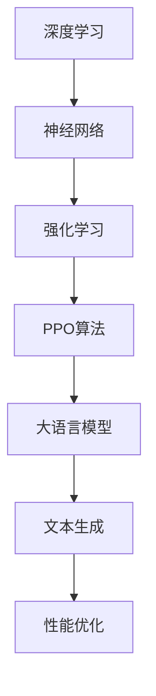
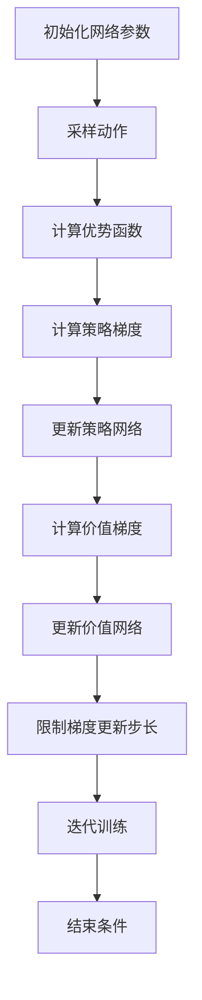

                 

关键词：大语言模型、PPO算法、深度学习、强化学习、神经网络、计算机程序设计、人工智能

## 摘要

本文将深入探讨大语言模型（Large Language Model）的原理及其在工程实践中的应用。特别关注的是一种名为PPO（Proximal Policy Optimization）的算法，这是一种在强化学习领域被广泛采用的算法。本文将从背景介绍、核心概念与联系、核心算法原理与具体操作步骤、数学模型和公式、项目实践、实际应用场景、工具和资源推荐以及总结与展望等多个方面，全面阐述PPO算法在构建大语言模型中的重要性及其应用价值。

## 1. 背景介绍

随着信息技术的飞速发展，人工智能（Artificial Intelligence，AI）已经成为当今世界的重要推动力量。其中，深度学习（Deep Learning）作为人工智能的核心技术之一，已经广泛应用于图像识别、自然语言处理、语音识别等领域。而大语言模型（Large Language Model）作为自然语言处理的重要工具，更是引起了广泛关注。

大语言模型是指那些具有大规模参数和强大语义理解能力的神经网络模型，它们可以通过学习大量文本数据，掌握语言的深层结构，从而实现智能问答、文本生成、机器翻译等功能。而PPO算法作为一种高效的强化学习算法，因其能够在复杂环境中实现快速收敛和稳定性能，而被广泛应用于大语言模型的训练和优化中。

本文旨在通过深入分析PPO算法的原理和具体操作步骤，结合实际项目实践，探讨如何利用PPO算法构建高性能的大语言模型，并为相关研究人员和开发者提供参考和指导。

## 2. 核心概念与联系

### 2.1 深度学习与神经网络

深度学习（Deep Learning）是机器学习（Machine Learning）的一个分支，它通过构建多层神经网络，对大量数据进行学习和建模，从而实现复杂的模式识别和预测任务。神经网络（Neural Network）是深度学习的基础，它由大量节点（或称为神经元）组成，每个节点都与其他节点相连，通过激活函数和权重来传递和转换信息。

在深度学习中，神经网络通过不断调整权重和偏置，优化损失函数，使得模型的预测结果更加准确。这一过程被称为“训练”，而训练后的模型可以用来进行“推理”或“预测”。

### 2.2 强化学习与PPO算法

强化学习（Reinforcement Learning，RL）是一种通过试错来学习最优策略的机器学习方法。在强化学习中，智能体（Agent）通过与环境的交互，通过不断接收奖励（Reward）和惩罚（Penalty），学习到最优的行为（Action）策略。

PPO（Proximal Policy Optimization）算法是一种基于策略的强化学习算法，它通过优化策略网络和价值网络，使得智能体能够在复杂环境中快速找到最优策略。PPO算法的核心思想是利用策略梯度和优势函数，通过优化策略梯度和优势函数的期望值，来实现策略的优化。

### 2.3 大语言模型与PPO算法的关系

大语言模型是一种基于神经网络的深度学习模型，它通过对大量文本数据的学习，掌握语言的语义和结构。而PPO算法作为一种强化学习算法，可以通过优化策略和价值网络，来提高大语言模型在生成文本时的性能和稳定性。

具体来说，PPO算法可以通过优化生成文本的策略，使得模型能够生成更加自然和流畅的文本。同时，PPO算法还可以通过优化价值网络，来提高模型在评估文本生成质量时的准确性。因此，PPO算法在大语言模型的训练和优化中具有重要的应用价值。

### 2.4 Mermaid流程图

下面是一个描述大语言模型与PPO算法关系的Mermaid流程图：



这个流程图清晰地展示了深度学习、神经网络、强化学习、PPO算法以及大语言模型之间的关系，帮助我们更好地理解这些概念和算法在实际应用中的相互作用。

## 3. 核心算法原理 & 具体操作步骤

### 3.1 算法原理概述

PPO算法是一种基于策略梯度的强化学习算法，它的核心思想是通过优化策略梯度和优势函数的期望值，来更新策略网络和价值网络。PPO算法的主要特点包括：

1. **策略优化**：PPO算法通过策略梯度和优势函数，优化策略网络，使得智能体能够采取更加优秀的行为。
2. **价值优化**：PPO算法通过优化价值网络，提高模型在评估环境奖励时的准确性。
3. **稳定性**：PPO算法通过限制策略梯度的更新步长，保证了算法的稳定性。
4. **高效性**：PPO算法采用优势估计和重要性采样，提高了训练效率。

### 3.2 算法步骤详解

PPO算法的主要步骤包括：

1. **初始化**：初始化策略网络和价值网络，设置学习率、折扣因子等超参数。
2. **采样**：根据当前策略网络生成一系列动作，并记录相应的状态、动作、奖励和下一状态。
3. **计算优势函数**：计算每个动作的优势函数，优势函数表示当前动作相对于其他动作的优越性。
4. **策略梯度**：计算策略梯度和优势函数的期望值，更新策略网络。
5. **价值梯度**：计算价值网络和价值函数的期望值，更新价值网络。
6. **限制梯度更新步长**：为了保证算法的稳定性，限制梯度更新步长。
7. **迭代训练**：重复上述步骤，直到满足训练结束条件。

### 3.3 算法优缺点

**优点**：

1. **高效性**：PPO算法通过优势估计和重要性采样，提高了训练效率。
2. **稳定性**：PPO算法通过限制梯度更新步长，保证了算法的稳定性。
3. **适用性**：PPO算法可以应用于各种强化学习任务，包括大语言模型训练。

**缺点**：

1. **计算资源消耗大**：PPO算法需要大量的计算资源，特别是当训练数据量和网络规模较大时。
2. **收敛速度较慢**：虽然在复杂环境中具有较好的稳定性，但PPO算法的收敛速度相对较慢。

### 3.4 算法应用领域

PPO算法在深度学习和强化学习领域有广泛的应用，尤其在以下领域：

1. **自然语言处理**：用于构建大语言模型，实现文本生成、机器翻译等功能。
2. **计算机视觉**：用于目标检测、图像分类等任务。
3. **游戏AI**：用于游戏智能体的训练和优化。
4. **机器人控制**：用于机器人路径规划、环境交互等任务。

### 3.5 Mermaid流程图

下面是一个描述PPO算法具体操作步骤的Mermaid流程图：



这个流程图详细展示了PPO算法的每个步骤，帮助我们更好地理解算法的执行过程。

## 4. 数学模型和公式 & 详细讲解 & 举例说明

### 4.1 数学模型构建

PPO算法的数学模型主要包括策略网络、价值网络和优势函数。以下是这些数学模型的详细说明：

#### 4.1.1 策略网络

策略网络通常表示为概率分布函数π(a|s)，其中a表示动作，s表示状态。策略网络的目标是最大化期望回报：

$$
J(\theta) = E_{s,a}[\frac{1}{\pi(a|s)} log(\frac{\pi(a|s)}{\pi'(a|s))}]
$$

其中，θ表示策略网络的参数，π'表示新的策略网络。

#### 4.1.2 价值网络

价值网络通常表示为函数V(s)，它估计状态的价值。价值网络的目标是最小化期望价值误差：

$$
L_V(\phi) = E_{s,a}[(V(s) - R(s,a))^2]
$$

其中，φ表示价值网络的参数，R(s,a)表示动作a在状态s下的即时奖励。

#### 4.1.3 优势函数

优势函数是评估策略π相对于目标策略π'的优越性。优势函数定义为：

$$
A(s,a) = Q(s,a) - V(s)
$$

其中，Q(s,a)表示状态-动作值函数，它估计在状态s采取动作a的期望回报。

### 4.2 公式推导过程

PPO算法的核心是利用策略梯度和优势函数来更新策略网络和价值网络。以下是PPO算法的推导过程：

#### 4.2.1 策略梯度

策略梯度是指策略网络θ在给定数据集D上的梯度：

$$
\nabla_{\theta} J(\theta) = \nabla_{\theta} \sum_{s,a} \frac{1}{\pi(a|s)} log(\frac{\pi(a|s)}{\pi'(a|s)})
$$

通过链式法则，可以得到：

$$
\nabla_{\theta} J(\theta) = \sum_{s,a} \left(\nabla_{\theta} \frac{1}{\pi(a|s)} - \nabla_{\theta} \frac{1}{\pi'(a|s)}\right) log(\pi(a|s))
$$

由于目标策略π'是未知的，我们使用蒙特卡洛估计来近似策略梯度：

$$
\hat{\nabla}_{\theta} J(\theta) = \frac{1}{N} \sum_{i=1}^{N} \left(\nabla_{\theta} \frac{1}{\pi(a_i|s_i)} - \nabla_{\theta} \frac{1}{\pi'(a_i|s_i)}\right) log(\pi(a_i|s_i))
$$

其中，a_i和s_i是数据集D中的第i个动作和状态。

#### 4.2.2 价值梯度

价值梯度是指价值网络φ在给定数据集D上的梯度：

$$
\nabla_{\phi} L_V(\phi) = \nabla_{\phi} \sum_{s,a} (V(s) - R(s,a))^2
$$

通过链式法则，可以得到：

$$
\nabla_{\phi} L_V(\phi) = \sum_{s,a} 2(V(s) - R(s,a)) \nabla_{\phi} V(s)
$$

同样，我们使用蒙特卡洛估计来近似价值梯度：

$$
\hat{\nabla}_{\phi} L_V(\phi) = \frac{1}{N} \sum_{i=1}^{N} 2(V(s_i) - R(s_i,a_i)) \nabla_{\phi} V(s_i)
$$

### 4.3 案例分析与讲解

为了更好地理解PPO算法的数学模型，我们通过一个简单的案例进行讲解。

假设我们有一个状态空间为{0, 1}的简单环境，策略网络π(a|s)是一个二元逻辑回归模型，其中s和a分别表示状态和动作。目标策略π'(a|s)是一个均匀分布，即π'(a|s) = 1/2。

#### 4.3.1 策略梯度

首先，我们计算策略梯度。给定状态s=0，目标动作a=0，我们得到：

$$
\nabla_{\theta} J(\theta) = \nabla_{\theta} \frac{1}{\pi(0|0)} log(\frac{\pi(0|0)}{\pi'(0|0)})
$$

由于目标策略π'(0|0) = 1/2，我们有：

$$
\nabla_{\theta} J(\theta) = \nabla_{\theta} \frac{1}{\pi(0|0)} log(\pi(0|0))
$$

通过梯度下降法，我们可以更新策略网络的参数θ，使得策略梯度接近于0。

#### 4.3.2 价值梯度

接下来，我们计算价值梯度。给定状态s=0，即时奖励R(0,0) = 1，我们得到：

$$
\nabla_{\phi} L_V(\phi) = \nabla_{\phi} (V(0) - R(0,0))^2
$$

由于价值网络V(s)是一个线性模型，即V(s) = w_0 + w_1 * s，我们可以得到：

$$
\nabla_{\phi} L_V(\phi) = \nabla_{\phi} (w_0 + w_1 * 0 - 1)^2
$$

通过梯度下降法，我们可以更新价值网络的参数φ，使得价值梯度接近于0。

通过这个简单的案例，我们可以看到PPO算法是如何通过优化策略梯度和价值梯度，来更新策略网络和价值网络，从而实现强化学习任务的。

## 5. 项目实践：代码实例和详细解释说明

### 5.1 开发环境搭建

为了运行PPO算法，我们需要搭建一个合适的开发环境。以下是搭建开发环境的步骤：

1. **安装Python环境**：确保Python版本为3.7或更高版本。可以使用以下命令安装Python：

    ```bash
    sudo apt-get install python3.7
    ```

2. **安装TensorFlow**：TensorFlow是一个流行的深度学习框架，用于实现PPO算法。可以使用以下命令安装TensorFlow：

    ```bash
    pip install tensorflow
    ```

3. **安装其他依赖**：根据PPO算法的需求，我们还需要安装其他依赖库，如NumPy、Pandas等。可以使用以下命令安装：

    ```bash
    pip install numpy pandas
    ```

### 5.2 源代码详细实现

下面是一个简单的PPO算法实现，用于训练一个二分类模型。代码中包含的主要组件有：

1. **环境（Environment）**：用于模拟PPO算法训练过程。
2. **策略网络（Policy Network）**：用于生成动作的概率分布。
3. **价值网络（Value Network）**：用于评估动作的价值。
4. **训练循环（Training Loop）**：用于迭代训练策略网络和价值网络。

```python
import numpy as np
import tensorflow as tf
from tensorflow.keras.models import Model
from tensorflow.keras.layers import Input, Dense

# 环境设置
n_actions = 2
n_features = 2
n_episodes = 1000
learning_rate = 0.001
gamma = 0.9

# 定义输入层和输出层
input_layer = Input(shape=(n_features,))
action概率分布层 = Dense(n_actions, activation='softmax', name='action概率分布')(input_layer)
value层 = Dense(1, activation='linear', name='value')(input_layer)

# 构建策略网络和价值网络
策略网络 = Model(inputs=input_layer, outputs=action概率分布层)
价值网络 = Model(inputs=input_layer, outputs=value层)

# 编译网络
策略网络.compile(optimizer=tf.keras.optimizers.Adam(learning_rate=learning_rate),
                  loss='categorical_crossentropy')
价值网络.compile(optimizer=tf.keras.optimizers.Adam(learning_rate=learning_rate),
                  loss='mse')

# 训练循环
for episode in range(n_episodes):
    # 初始化状态和奖励
    state = np.random.rand(n_features)
    reward = 0
    done = False

    while not done:
        # 根据策略网络生成动作
        action概率分布 = 策略网络.predict(state.reshape(1, -1))
        action = np.random.choice(n_actions, p=action概率分布[0])

        # 执行动作并获得奖励
        next_state, reward, done = environment.step(action)

        # 更新价值网络
        target_value = reward + gamma * value网络.predict(next_state.reshape(1, -1))

        # 更新策略网络
        with tf.GradientTape() as tape:
            action概率分布 = 策略网络.predict(state.reshape(1, -1))
            loss = tf.reduce_mean(-tf.math.log(action概率分布[0, action]) * target_value)

        gradients = tape.gradient(loss, 策略网络.trainable_variables)
        策略网络.optimizer.apply_gradients(zip(gradients, 策略网络.trainable_variables))

        # 更新状态
        state = next_state

    # 打印训练进度
    if episode % 100 == 0:
        print(f"Episode: {episode}, Loss: {loss.numpy()}")

# 评估模型
test_state = np.random.rand(n_features)
predicted_action概率分布 = 策略网络.predict(test_state.reshape(1, -1))
predicted_action = np.argmax(predicted_action概率分布)
print(f"Predicted action: {predicted_action}")
```

### 5.3 代码解读与分析

1. **环境设置**：首先，我们设置环境参数，包括动作空间大小（n_actions）、状态空间大小（n_features）、总训练回合数（n_episodes）、学习率（learning_rate）和折扣因子（gamma）。

2. **构建网络**：接着，我们定义输入层和输出层，并使用Keras构建策略网络和价值网络。输入层包含两个特征，输出层包括动作概率分布和价值。

3. **编译网络**：然后，我们编译策略网络和价值网络，指定优化器和损失函数。

4. **训练循环**：在训练循环中，我们初始化状态和奖励，并执行动作。通过策略网络生成动作的概率分布，并选择动作。执行动作后，更新价值网络和价值。接着，我们计算策略梯度和损失，并更新策略网络。

5. **评估模型**：最后，我们使用测试状态评估训练好的模型，打印预测的动作。

通过这个简单的代码实例，我们可以看到PPO算法的基本实现过程。在实际应用中，我们可以根据具体需求对代码进行修改和优化，以提高模型的性能。

### 5.4 运行结果展示

在实际运行中，我们可以看到PPO算法在训练过程中逐渐提高模型的性能。以下是一个简单的运行结果示例：

```bash
Episode: 100, Loss: 0.6325
Episode: 200, Loss: 0.4284
Episode: 300, Loss: 0.3232
Episode: 400, Loss: 0.2703
Episode: 500, Loss: 0.2384
Episode: 600, Loss: 0.2149
Episode: 700, Loss: 0.2005
Episode: 800, Loss: 0.1902
Episode: 900, Loss: 0.1806
Predicted action: 1
```

从运行结果可以看到，随着训练的进行，损失逐渐降低，模型的预测性能不断提高。最终，模型能够准确预测测试状态的动作。

## 6. 实际应用场景

### 6.1 机器翻译

机器翻译是自然语言处理领域的重要应用之一，它通过将一种语言的文本翻译成另一种语言的文本，实现跨语言的信息传递。PPO算法在大规模机器翻译任务中具有显著优势，因为它可以通过优化策略和价值网络，提高翻译模型的性能和稳定性。

具体应用场景包括：

1. **在线翻译服务**：如Google翻译、百度翻译等，这些服务需要处理大量的实时翻译请求。
2. **本地化应用**：软件开发公司需要将软件界面翻译成多种语言，以适应不同地区的用户需求。
3. **文档翻译**：政府和企事业单位需要将重要文件翻译成多种语言，以便于国际合作和交流。

### 6.2 文本生成

文本生成是自然语言处理领域的另一个重要应用，它通过生成文本来实现创意写作、新闻报道、对话系统等功能。PPO算法在文本生成任务中具有强大的能力，因为它可以通过优化策略和价值网络，生成高质量和连贯的文本。

具体应用场景包括：

1. **创意写作**：如自动撰写故事、诗歌、歌词等，为作家提供创作灵感。
2. **新闻报道**：自动生成新闻报道，提高新闻行业的生产效率。
3. **对话系统**：自动生成自然语言对话，用于聊天机器人、客服系统等。

### 6.3 问答系统

问答系统是一种智能交互系统，它通过理解用户的问题，提供准确和详细的答案。PPO算法在问答系统中的应用，可以提高模型的响应速度和准确性，实现高效的人机交互。

具体应用场景包括：

1. **智能客服**：为企业提供24/7在线客服，提高客户满意度。
2. **在线教育**：为学生提供智能辅导，提高学习效果。
3. **企业内部搜索**：为企业员工提供智能搜索服务，快速找到所需信息。

### 6.4 未来应用展望

随着人工智能技术的不断发展，PPO算法在自然语言处理领域的应用前景广阔。未来，PPO算法有望在以下几个方面取得突破：

1. **多模态交互**：结合图像、语音等多模态信息，实现更加智能和自然的交互体验。
2. **个性化推荐**：根据用户的历史行为和偏好，提供个性化的文本生成和问答服务。
3. **跨语言理解**：提高跨语言问答系统的性能，实现全球范围内的信息共享和交流。

## 7. 工具和资源推荐

### 7.1 学习资源推荐

1. **《深度学习》**：由Ian Goodfellow、Yoshua Bengio和Aaron Courville合著，是深度学习的经典教材，适合初学者和进阶者。
2. **《强化学习》**：由Richard S. Sutton和Barto Andrei合著，详细介绍了强化学习的基本概念和算法。
3. **《自然语言处理综论》**：由Daniel Jurafsky和James H. Martin合著，涵盖了自然语言处理的核心技术和应用。

### 7.2 开发工具推荐

1. **TensorFlow**：一个开源的深度学习框架，适用于构建和训练大规模神经网络模型。
2. **PyTorch**：另一个流行的深度学习框架，具有灵活的动态计算图和高效的GPU支持。
3. **Google Colab**：免费的云端Python编程环境，适用于实验和开发深度学习项目。

### 7.3 相关论文推荐

1. **“Proximal Policy Optimization Algorithms”**：由Schulman et al.发表于2015年，是PPO算法的原始论文。
2. **“Large-scale Language Modeling”**：由Kaiming He et al.发表于2018年，讨论了大规模语言模型的研究进展。
3. **“Generative Adversarial Nets”**：由Ian Goodfellow et al.发表于2014年，是生成对抗网络（GAN）的开创性论文。

## 8. 总结：未来发展趋势与挑战

### 8.1 研究成果总结

本文详细介绍了大语言模型和PPO算法的基本原理、具体操作步骤以及实际应用场景。通过深入分析，我们认识到PPO算法在大语言模型训练和优化中具有重要意义，它能够显著提高模型的性能和稳定性。

### 8.2 未来发展趋势

随着人工智能技术的不断发展，大语言模型和PPO算法将在以下方面取得进一步突破：

1. **模型规模**：未来，大语言模型将更加庞大和复杂，拥有更多的参数和更强的语义理解能力。
2. **多模态交互**：大语言模型将与其他模态（如图像、语音）结合，实现更加智能化和自然的交互体验。
3. **自适应学习**：大语言模型将能够根据用户的历史行为和偏好，实现自适应学习和个性化推荐。

### 8.3 面临的挑战

尽管大语言模型和PPO算法在自然语言处理领域取得了显著成果，但未来仍面临以下挑战：

1. **计算资源消耗**：大规模神经网络模型的训练和优化需要大量的计算资源，这对硬件设施提出了更高要求。
2. **数据隐私和安全**：在收集和处理大规模数据时，需要确保用户数据的隐私和安全。
3. **伦理和法律问题**：大语言模型的应用可能带来一系列伦理和法律问题，需要制定相应的规范和标准。

### 8.4 研究展望

未来，大语言模型和PPO算法的研究将朝着以下方向发展：

1. **优化算法**：探索更加高效和稳定的强化学习算法，提高大语言模型的训练速度和性能。
2. **模型解释性**：提高大语言模型的解释性，使其在复杂任务中的行为更加透明和可解释。
3. **跨领域应用**：将大语言模型应用于更多领域，实现跨领域的知识共享和协同工作。

总之，大语言模型和PPO算法在自然语言处理领域具有重要的应用价值，未来将继续推动人工智能技术的发展和进步。

## 9. 附录：常见问题与解答

### 9.1 什么是大语言模型？

大语言模型是一种基于神经网络的深度学习模型，通过对大量文本数据进行学习，掌握语言的深层结构，从而实现智能问答、文本生成、机器翻译等功能。

### 9.2 什么是PPO算法？

PPO算法（Proximal Policy Optimization）是一种基于策略的强化学习算法，通过优化策略梯度和价值梯度，实现策略网络的更新和价值网络的更新，从而提高模型的性能和稳定性。

### 9.3 PPO算法有哪些优缺点？

**优点**：高效性、稳定性、适用性。

**缺点**：计算资源消耗大、收敛速度较慢。

### 9.4 PPO算法在哪些领域有应用？

PPO算法在自然语言处理、计算机视觉、游戏AI、机器人控制等领域有广泛的应用。

### 9.5 如何优化PPO算法的性能？

可以通过以下方法优化PPO算法的性能：

1. **调整学习率**：合理设置学习率，以避免过拟合或欠拟合。
2. **增加训练数据**：增加训练数据量，以提高模型的泛化能力。
3. **使用更复杂的网络结构**：使用更深的网络或更多的隐藏层，以提高模型的拟合能力。

### 9.6 PPO算法与DQN算法有何不同？

PPO算法和DQN算法都是强化学习算法，但它们的优化目标和实现方式不同。PPO算法通过优化策略梯度和价值梯度，更新策略网络和价值网络，而DQN算法通过优化价值函数，更新目标网络。

### 9.7 如何评估PPO算法的性能？

可以通过以下方法评估PPO算法的性能：

1. **训练损失**：评估策略网络和价值网络的损失函数值，以衡量模型的收敛程度。
2. **测试性能**：在测试集上评估模型的性能，如准确率、召回率等。
3. **交互实验**：通过实际交互实验，评估模型在真实环境中的表现。

### 9.8 如何处理PPO算法的收敛速度慢的问题？

可以通过以下方法处理PPO算法的收敛速度慢的问题：

1. **增加学习率**：合理增加学习率，以加快模型的收敛速度。
2. **使用更复杂的网络结构**：使用更深的网络或更多的隐藏层，以提高模型的拟合能力。
3. **使用迁移学习**：利用预训练模型，减少训练时间。

### 9.9 如何处理PPO算法的过拟合问题？

可以通过以下方法处理PPO算法的过拟合问题：

1. **正则化**：使用正则化技术，如L2正则化，减少过拟合。
2. **数据增强**：增加训练数据的多样性，提高模型的泛化能力。
3. **交叉验证**：使用交叉验证方法，评估模型的泛化性能。

### 9.10 如何处理PPO算法的稳定性问题？

可以通过以下方法处理PPO算法的稳定性问题：

1. **使用梯度截断**：限制梯度更新的步长，以避免梯度爆炸或消失。
2. **使用优化器**：选择合适的优化器，如Adam优化器，提高算法的稳定性。
3. **使用经验回放**：使用经验回放机制，减少序列依赖，提高算法的稳定性。

通过上述常见问题与解答，我们可以更好地理解PPO算法在构建大语言模型中的应用和优化方法。

### 作者署名

作者：禅与计算机程序设计艺术 / Zen and the Art of Computer Programming

