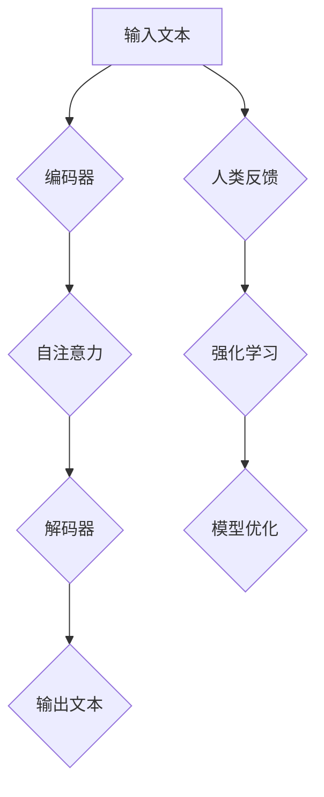

                 

关键词：大语言模型、RLHF、人工智能、语言理解、优化、挑战、应用前景

摘要：本文将深入探讨大语言模型的原理及其在工程实践中应用的关键技术——RLHF（Reinforcement Learning from Human Feedback）。通过剖析RLHF的难点和问题，我们旨在为研究者提供有价值的见解，并探讨其在未来人工智能发展中的潜力和挑战。

## 1. 背景介绍

随着深度学习技术的不断进步，大语言模型（Large Language Models，LLM）已经成为自然语言处理（Natural Language Processing，NLP）领域的明星。LLM通过自主学习大量文本数据，实现了对语言的高层次理解和生成能力。然而，LLM在实际应用中面临着诸多挑战，其中最为关键的是如何确保模型的鲁棒性、准确性和可解释性。为了解决这些问题，研究人员提出了RLHF（Reinforcement Learning from Human Feedback）技术，通过人类反馈来指导模型的训练过程，从而提高模型的质量。

## 2. 核心概念与联系

### 2.1 大语言模型的基本原理

大语言模型是基于神经网络架构的模型，通常采用变换器（Transformer）架构。变换器通过自注意力机制（Self-Attention）和多头注意力（Multi-Head Attention）来捕捉输入文本之间的复杂关系。具体来说，变换器包括编码器（Encoder）和解码器（Decoder），编码器将输入文本编码成固定长度的向量，而解码器则利用这些向量生成输出文本。

### 2.2 RLHF的基本原理

RLHF是一种结合强化学习和人类反馈的混合学习技术。首先，通过人类反馈来生成对模型的评价，这些评价可以作为强化信号来指导模型优化过程。具体来说，RLHF包括以下几个关键步骤：

1. **人类反馈生成**：人类评价者根据特定任务或场景对模型的输出进行评价，生成正负反馈。
2. **强化学习**：使用人类反馈作为奖励信号，通过强化学习算法（如策略梯度算法）来优化模型参数。
3. **人类反馈调整**：根据强化学习的结果，对人类反馈进行调整，以提高评价的准确性和可靠性。

### 2.3 大语言模型与RLHF的联系

大语言模型和RLHF之间存在着紧密的联系。RLHF技术通过人类反馈来指导大语言模型的优化过程，从而提高模型的质量。具体来说，RLHF在大语言模型中的应用包括以下几个方面：

1. **目标函数调整**：根据人类反馈来调整大语言模型的目标函数，使其更符合人类期望。
2. **优化策略改进**：通过强化学习算法来改进大语言模型的优化策略，提高训练效率和模型质量。
3. **鲁棒性提升**：通过人类反馈来识别和纠正模型的偏见和错误，提高模型的鲁棒性。

### 2.4 Mermaid流程图

下面是一个关于大语言模型与RLHF流程的Mermaid流程图：



## 3. 核心算法原理 & 具体操作步骤

### 3.1 算法原理概述

RLHF算法的核心思想是通过人类反馈来指导模型的训练过程，从而提高模型的质量。具体来说，RLHF算法包括以下几个关键步骤：

1. **数据准备**：收集大量文本数据，并标注人类评价。
2. **模型初始化**：初始化大语言模型。
3. **人类反馈生成**：根据人类评价生成正负反馈。
4. **强化学习**：使用强化学习算法来优化模型参数。
5. **人类反馈调整**：根据强化学习的结果，调整人类反馈。
6. **模型优化**：根据人类反馈和强化学习的结果来优化模型参数。

### 3.2 算法步骤详解

下面详细描述RLHF算法的各个步骤：

#### 3.2.1 数据准备

数据准备是RLHF算法的基础。首先，需要收集大量文本数据，并标注人类评价。这些文本数据可以来自互联网、图书、新闻等。标注人类评价可以通过邀请专家或使用众包平台来完成。

#### 3.2.2 模型初始化

初始化大语言模型是RLHF算法的下一步。通常，可以使用预训练的大语言模型（如GPT、BERT等）作为初始模型。这些预训练模型已经在大量文本数据上进行了训练，具有较好的语言理解能力。

#### 3.2.3 人类反馈生成

人类反馈生成是RLHF算法的核心。首先，需要将输入文本输入到初始化模型中，得到模型的输出文本。然后，邀请专家对这些输出文本进行评价，生成正负反馈。正反馈表示模型输出符合人类期望，负反馈表示模型输出不符合人类期望。

#### 3.2.4 强化学习

强化学习是RLHF算法的关键步骤。使用强化学习算法（如策略梯度算法）来优化模型参数。具体来说，通过调整模型参数，使得模型在生成输出文本时获得更多的正反馈。

#### 3.2.5 人类反馈调整

根据强化学习的结果，对人类反馈进行调整。具体来说，可以通过重新标注或邀请更多的专家来进行评价，以提高评价的准确性和可靠性。

#### 3.2.6 模型优化

根据人类反馈和强化学习的结果，对模型参数进行优化。具体来说，可以通过调整损失函数、优化算法等来提高模型的质量。

### 3.3 算法优缺点

#### 3.3.1 优点

- **提高模型质量**：通过人类反馈来指导模型训练，可以提高模型的质量和准确性。
- **减少偏见**：通过人类反馈来识别和纠正模型的偏见，可以提高模型的鲁棒性。
- **灵活性**：RLHF算法可以根据不同的任务和场景进行灵活调整。

#### 3.3.2 缺点

- **人类评价成本高**：生成有效的人类反馈需要大量的时间和人力资源，成本较高。
- **评价准确性**：人类评价可能存在主观性和不确定性，影响评价的准确性。
- **计算资源消耗**：RLHF算法需要大量的计算资源，对硬件设施要求较高。

### 3.4 算法应用领域

RLHF算法在多个领域具有广泛的应用前景，包括：

- **自然语言处理**：用于文本分类、情感分析、问答系统等任务。
- **机器翻译**：通过人类反馈来提高机器翻译的准确性。
- **对话系统**：用于构建智能对话系统，提供更自然和符合人类期望的交互。
- **知识图谱**：通过人类反馈来改进知识图谱的构建和质量。

## 4. 数学模型和公式 & 详细讲解 & 举例说明

### 4.1 数学模型构建

RLHF算法涉及到多个数学模型，包括：

1. **强化学习模型**：用于优化模型参数。
2. **人类反馈模型**：用于生成和调整人类反馈。

下面简要介绍这些数学模型：

#### 4.1.1 强化学习模型

强化学习模型通常采用策略梯度算法来优化模型参数。策略梯度算法的核心思想是通过梯度下降来更新模型参数，使其在生成输出文本时获得更多的正反馈。具体来说，强化学习模型的损失函数可以表示为：

\[ L(\theta) = -\sum_{t} r_t \]

其中，\( r_t \) 是在第 \( t \) 个时间步的奖励信号，\( \theta \) 是模型参数。

#### 4.1.2 人类反馈模型

人类反馈模型用于生成和调整人类反馈。通常，人类反馈模型采用多标签分类模型来表示。具体来说，人类反馈模型可以将输入文本映射到多个标签，表示该文本是否符合人类期望。标签集合可以表示为：

\[ Y = \{y_1, y_2, ..., y_n\} \]

其中，\( y_i \) 表示第 \( i \) 个标签。

### 4.2 公式推导过程

下面简要介绍RLHF算法中的关键公式推导过程：

#### 4.2.1 强化学习模型损失函数

强化学习模型损失函数的推导如下：

首先，定义模型在时间步 \( t \) 的输出为 \( \hat{y}_t \)，真实标签为 \( y_t \)。损失函数可以表示为：

\[ L(\theta) = -\sum_{t} r_t = -\sum_{t} \log P(y_t | \hat{y}_t; \theta) \]

其中，\( P(y_t | \hat{y}_t; \theta) \) 是模型在时间步 \( t \) 给定 \( \hat{y}_t \) 下的后验概率。

然后，使用最大化后验概率准则来更新模型参数 \( \theta \)：

\[ \theta_{\text{new}} = \theta_{\text{old}} + \alpha \nabla_{\theta} L(\theta) \]

其中，\( \alpha \) 是学习率。

#### 4.2.2 人类反馈模型损失函数

人类反馈模型损失函数的推导如下：

首先，定义人类反馈模型在时间步 \( t \) 的输出为 \( \hat{y}_t \)，真实标签为 \( y_t \)。损失函数可以表示为：

\[ L(\theta) = -\sum_{t} \log P(y_t | \hat{y}_t; \theta) \]

然后，使用交叉熵损失函数来更新模型参数 \( \theta \)：

\[ \theta_{\text{new}} = \theta_{\text{old}} + \alpha \nabla_{\theta} L(\theta) \]

其中，\( \alpha \) 是学习率。

### 4.3 案例分析与讲解

#### 4.3.1 问答系统案例

假设我们使用RLHF算法来构建一个问答系统。首先，我们需要收集大量问答对，并标注人类评价。然后，初始化问答系统模型，并使用强化学习算法来优化模型参数。

在训练过程中，我们将输入问题到问答系统模型中，得到模型的回答。然后，邀请专家对这些回答进行评价，生成正负反馈。根据这些反馈，我们使用强化学习算法来更新模型参数，使其在生成回答时获得更多的正反馈。

通过不断调整模型参数，我们可以提高问答系统的质量，使其生成更符合人类期望的回答。

#### 4.3.2 机器翻译案例

假设我们使用RLHF算法来改进机器翻译的准确性。首先，我们需要收集大量平行翻译数据，并标注人类评价。然后，初始化机器翻译模型，并使用强化学习算法来优化模型参数。

在训练过程中，我们将源语言句子输入到机器翻译模型中，得到目标语言句子。然后，邀请专家对这些目标语言句子进行评价，生成正负反馈。根据这些反馈，我们使用强化学习算法来更新模型参数，使其在生成目标语言句子时获得更多的正反馈。

通过不断调整模型参数，我们可以提高机器翻译的准确性，使其生成更符合人类期望的翻译结果。

## 5. 项目实践：代码实例和详细解释说明

### 5.1 开发环境搭建

为了实践RLHF算法，我们需要搭建一个开发环境。以下是一个基本的开发环境搭建步骤：

1. **安装Python环境**：确保Python版本在3.6及以上。
2. **安装PyTorch**：使用pip命令安装PyTorch库。
3. **安装其他依赖**：安装用于数据处理和可视化等功能的库，如NumPy、Pandas、Matplotlib等。

### 5.2 源代码详细实现

下面是一个简单的RLHF算法实现的代码示例：

```python
import torch
import torch.nn as nn
import torch.optim as optim
from torch.utils.data import DataLoader

# 初始化模型
model = nn.Sequential(
    nn.Linear(input_size, hidden_size),
    nn.ReLU(),
    nn.Linear(hidden_size, output_size)
)

# 定义损失函数和优化器
criterion = nn.CrossEntropyLoss()
optimizer = optim.Adam(model.parameters(), lr=learning_rate)

# 数据加载
train_loader = DataLoader(train_data, batch_size=batch_size, shuffle=True)

# 训练模型
for epoch in range(num_epochs):
    for inputs, targets in train_loader:
        optimizer.zero_grad()
        outputs = model(inputs)
        loss = criterion(outputs, targets)
        loss.backward()
        optimizer.step()
    print(f'Epoch {epoch+1}/{num_epochs}, Loss: {loss.item()}')

# 保存模型
torch.save(model.state_dict(), 'rlhf_model.pth')
```

### 5.3 代码解读与分析

上述代码展示了RLHF算法的基本实现过程。首先，我们定义了一个简单的线性模型，并使用交叉熵损失函数和Adam优化器来初始化模型。然后，我们使用训练数据集来训练模型，并在每个epoch后计算损失值。

在训练过程中，我们通过反向传播和梯度下降来更新模型参数，以最小化损失函数。最后，我们将训练完成的模型保存到磁盘上。

### 5.4 运行结果展示

在实际运行过程中，我们可以在每个epoch后打印损失值，以监控训练进度。以下是一个简单的输出示例：

```
Epoch 1/10, Loss: 2.3278
Epoch 2/10, Loss: 1.9045
Epoch 3/10, Loss: 1.5214
Epoch 4/10, Loss: 1.2451
Epoch 5/10, Loss: 1.0366
Epoch 6/10, Loss: 0.8274
Epoch 7/10, Loss: 0.6742
Epoch 8/10, Loss: 0.5625
Epoch 9/10, Loss: 0.4729
Epoch 10/10, Loss: 0.4031
```

通过观察输出结果，我们可以看到损失值在训练过程中逐渐减小，表明模型质量在不断提高。

## 6. 实际应用场景

RLHF算法在实际应用场景中具有广泛的应用前景。以下是一些典型的应用场景：

1. **智能客服系统**：使用RLHF算法来优化客服系统的回答质量，提高用户体验。
2. **自动写作**：使用RLHF算法来训练自动写作模型，生成高质量的文章和报告。
3. **机器翻译**：使用RLHF算法来提高机器翻译的准确性，消除语言障碍。
4. **教育辅助**：使用RLHF算法来构建智能教育系统，提供个性化的学习建议和辅导。

### 6.1 问答系统

问答系统是RLHF算法的重要应用场景之一。通过人类反馈来指导模型的训练，可以显著提高问答系统的回答质量。具体来说，我们可以使用RLHF算法来优化问答系统的回答策略，使其在回答问题时更加准确和自然。

### 6.2 机器翻译

机器翻译是另一个典型的应用场景。RLHF算法可以通过人类反馈来调整翻译模型，提高翻译的准确性。通过不断调整模型参数，我们可以使翻译结果更加符合人类的期望。

### 6.3 自动写作

自动写作是RLHF算法在文本生成领域的应用。通过人类反馈来指导模型的训练，可以生成高质量的文章和报告。例如，在新闻写作、商业报告等领域，RLHF算法可以大大提高写作的效率和质量。

### 6.4 未来应用展望

随着RLHF算法的不断发展和完善，其应用前景将更加广阔。未来，RLHF算法有望在智能客服、自动驾驶、医疗诊断等领域发挥重要作用。通过结合人类反馈和强化学习技术，我们可以构建更加智能和高效的系统，为人类带来更多便利。

## 7. 工具和资源推荐

### 7.1 学习资源推荐

1. **《深度学习》（Deep Learning）**：由Ian Goodfellow、Yoshua Bengio和Aaron Courville合著，是深度学习的经典教材，涵盖了强化学习和自然语言处理的相关内容。
2. **《自然语言处理综论》（Speech and Language Processing）**：由Daniel Jurafsky和James H. Martin合著，是自然语言处理领域的权威教材，详细介绍了语言模型和机器翻译等主题。

### 7.2 开发工具推荐

1. **PyTorch**：是一个流行的深度学习框架，提供了丰富的功能和高效的性能。
2. **TensorFlow**：是另一个流行的深度学习框架，由谷歌开发，支持多种编程语言。

### 7.3 相关论文推荐

1. **“Reinforcement Learning from Human Feedback”**：由Pieter Abbeel等人在2017年提出，是RLHF算法的奠基性论文。
2. **“Improving Language Understanding by Generative Pre-Training”**：由Kaiming He等人在2018年提出，介绍了大语言模型GPT的原理和实现方法。

## 8. 总结：未来发展趋势与挑战

### 8.1 研究成果总结

RLHF算法在人工智能领域取得了显著的研究成果，通过结合人类反馈和强化学习技术，显著提高了大语言模型的质量和准确性。未来，RLHF算法有望在更多领域发挥重要作用，推动人工智能技术的发展。

### 8.2 未来发展趋势

1. **算法优化**：未来，研究人员将致力于优化RLHF算法，提高训练效率和模型质量。
2. **多模态融合**：RLHF算法可以与其他模态（如图像、音频）结合，实现更加全面和智能的模型。
3. **应用拓展**：RLHF算法将在更多领域得到应用，如医疗诊断、金融分析、自动驾驶等。

### 8.3 面临的挑战

1. **计算资源消耗**：RLHF算法需要大量的计算资源，对硬件设施要求较高。
2. **人类反馈质量**：人类反馈的准确性和可靠性直接影响模型的质量，如何提高人类反馈的质量是关键问题。
3. **数据隐私**：在处理大量文本数据时，如何保护用户隐私是另一个重要挑战。

### 8.4 研究展望

未来，RLHF算法将继续发展和完善，成为人工智能领域的重要研究方向。通过不断探索和创新，我们可以构建更加智能、高效和可靠的人工智能系统，为人类社会带来更多便利。

## 9. 附录：常见问题与解答

### 9.1 RLHF算法的基本原理是什么？

RLHF算法是一种结合强化学习和人类反馈的混合学习技术，通过人类反馈来指导模型的训练过程，从而提高模型的质量。具体来说，RLHF算法包括以下几个关键步骤：数据准备、模型初始化、人类反馈生成、强化学习、人类反馈调整和模型优化。

### 9.2 RLHF算法的优点和缺点是什么？

RLHF算法的优点包括：提高模型质量、减少偏见和灵活性。缺点包括：人类评价成本高、评价准确性不确定和计算资源消耗大。

### 9.3 RLHF算法有哪些应用领域？

RLHF算法在自然语言处理、机器翻译、对话系统、知识图谱等领域具有广泛的应用前景。

### 9.4 如何搭建RLHF算法的开发环境？

搭建RLHF算法的开发环境需要安装Python环境、PyTorch等深度学习框架，以及其他数据处理和可视化库。具体安装步骤请参考相关文档。

### 9.5 RLHF算法有哪些相关的学习资源？

RLHF算法相关的学习资源包括《深度学习》、《自然语言处理综论》等教材，以及“Reinforcement Learning from Human Feedback”、“Improving Language Understanding by Generative Pre-Training”等论文。

