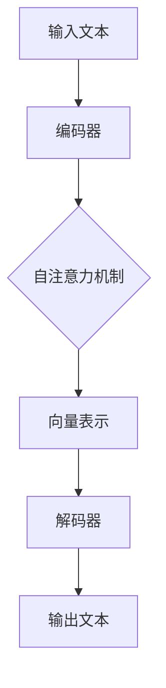

                 

关键词：大语言模型，原理，工程实践，RefinedWeb，自然语言处理，深度学习，神经网络

> 摘要：本文将深入探讨大语言模型的原理及其在工程实践中的应用，特别是针对RefinedWeb的架构设计。通过详细解析核心概念、算法原理、数学模型和具体实例，旨在帮助读者理解大语言模型的工作机制，并掌握其实际应用技巧。

## 1. 背景介绍

随着互联网的迅猛发展，数据爆炸性增长，尤其是文本数据的量级不断攀升。自然语言处理（Natural Language Processing，NLP）成为了计算机科学和人工智能领域的重要研究方向。大语言模型（Large Language Model）作为一种先进的NLP工具，因其能够捕捉和模拟人类语言表达的复杂性和多样性，正逐步成为各类应用的核心组件。

大语言模型的研究始于20世纪80年代，最早由IBM的Brown等人提出的统计语言模型。随着计算能力的提升和深度学习技术的突破，大语言模型得到了极大的发展。以Google的BERT、OpenAI的GPT为代表，大语言模型在语言理解、文本生成、机器翻译等领域取得了显著的成果。

RefinedWeb是一个基于大语言模型的下一代Web架构，旨在提供更加智能和人性化的交互体验。RefinedWeb结合了Web3.0的技术理念，通过去中心化和智能合约，实现了更加安全和高效的数据处理和交互模式。本文将围绕RefinedWeb的架构特点，深入解析大语言模型的工作原理和工程实践。

## 2. 核心概念与联系

### 2.1. 语言模型

语言模型（Language Model）是自然语言处理的核心概念，旨在通过统计方法或机器学习方法，建模自然语言的概率分布。一个优秀的语言模型能够预测文本序列中下一个单词的概率，从而帮助计算机理解和生成自然语言。

### 2.2. 深度学习与神经网络

深度学习（Deep Learning）是机器学习的一个子领域，它通过多层神经网络对数据进行建模，从而实现复杂的特征提取和分类。神经网络（Neural Network）是一种模仿生物神经系统的计算模型，通过节点（神经元）的相互连接和信号传递，实现对输入数据的处理和输出。

### 2.3. 大语言模型架构

大语言模型通常由多层神经网络组成，包括编码器和解码器。编码器负责将输入的文本序列编码为固定长度的向量，解码器则根据这些向量生成文本序列。大语言模型的架构可以分为自注意力机制（Self-Attention）和Transformer模型（Transformer Model）。

下面是一个基于Mermaid的流程图，展示了大语言模型的基本架构：



## 3. 核心算法原理 & 具体操作步骤

### 3.1. 算法原理概述

大语言模型的算法原理基于自注意力机制和Transformer模型。自注意力机制允许模型在生成每个单词时，考虑到其他所有单词的影响，从而捕捉到文本序列中的长距离依赖关系。Transformer模型则通过多头注意力机制和前馈神经网络，进一步提升了模型的表示能力和生成质量。

### 3.2. 算法步骤详解

1. **编码阶段**：
    - **文本预处理**：将输入的文本序列转换为词向量。
    - **编码器处理**：输入的词向量通过编码器进行处理，输出固定长度的向量表示。

2. **解码阶段**：
    - **初始化**：解码器初始化为空文本。
    - **生成单词**：对于每个生成的单词，模型会根据当前已生成的文本序列，通过自注意力机制计算上下文向量，并使用这些向量生成下一个单词。

3. **输出生成**：通过循环解码阶段，模型最终生成完整的文本输出。

### 3.3. 算法优缺点

**优点**：
- **强大的文本表示能力**：通过自注意力机制和Transformer模型，大语言模型能够捕捉到文本序列中的长距离依赖关系，从而生成高质量的文本。
- **灵活的文本生成能力**：大语言模型不仅能够用于文本分类、机器翻译等任务，还能够生成连贯、具有创造性的文本。

**缺点**：
- **计算资源需求大**：大语言模型通常需要大量的计算资源和存储空间。
- **训练时间较长**：大语言模型的训练时间通常较长，对于大规模数据集更是如此。

### 3.4. 算法应用领域

大语言模型在自然语言处理领域有着广泛的应用，包括但不限于：
- **文本分类**：用于对文本进行分类，如新闻分类、情感分析等。
- **机器翻译**：用于将一种语言的文本翻译成另一种语言。
- **文本生成**：用于生成连贯、具有创造性的文本，如文章写作、对话生成等。

## 4. 数学模型和公式 & 详细讲解 & 举例说明

### 4.1. 数学模型构建

大语言模型的数学模型基于自注意力机制和Transformer模型。自注意力机制的核心公式为：

\[ \text{Attention}(Q, K, V) = \frac{softmax(\frac{QK^T}{\sqrt{d_k}})}{V} \]

其中，\( Q \)、\( K \) 和 \( V \) 分别为查询向量、关键向量和解向量，\( d_k \) 为关键向量的维度。

Transformer模型的数学模型包括多头注意力机制和前馈神经网络。多头注意力机制的公式为：

\[ \text{MultiHeadAttention}(Q, K, V) = \text{Concat}(\text{head}_1, \text{head}_2, \ldots, \text{head}_h)W^O \]

其中，\( \text{head}_i = \text{Attention}(QW_i^Q, KW_i^K, VW_i^V) \)，\( W_i^Q \)、\( W_i^K \) 和 \( W_i^V \) 分别为查询权重、关键权重和解权重，\( W^O \) 为输出权重。

前馈神经网络的公式为：

\[ \text{FFN}(X) = \text{ReLU}(XW_1 + b_1)W_2 + b_2 \]

其中，\( X \) 为输入，\( W_1 \) 和 \( W_2 \) 分别为权重，\( b_1 \) 和 \( b_2 \) 分别为偏置。

### 4.2. 公式推导过程

大语言模型的公式推导过程涉及多个数学概念和技巧，包括线性代数、概率论和微积分等。具体推导过程如下：

1. **自注意力机制的推导**：

   - **计算内积**：首先计算查询向量 \( Q \) 和关键向量 \( K \) 的内积，得到权重矩阵。
   - **归一化**：通过 softmax 函数对权重矩阵进行归一化，得到概率分布。
   - **加权求和**：最后将概率分布与解向量 \( V \) 进行加权求和，得到注意力得分。

2. **多头注意力机制的推导**：

   - **拆分权重**：将输入权重矩阵拆分为多个子权重矩阵，分别对应多个头。
   - **计算注意力得分**：对于每个头，计算查询向量与关键向量的内积，得到注意力得分。
   - **组合注意力得分**：将所有头的注意力得分进行组合，得到总的注意力得分。

3. **前馈神经网络的推导**：

   - **线性变换**：输入通过线性变换 \( W_1 \) 和偏置 \( b_1 \) 得到中间层。
   - **激活函数**：中间层通过 ReLU 激活函数进行非线性变换。
   - **输出层**：中间层通过线性变换 \( W_2 \) 和偏置 \( b_2 \) 得到最终输出。

### 4.3. 案例分析与讲解

假设有一个简单的文本序列：“我 今天 很 开心”，我们可以通过大语言模型来生成下一个可能的单词。

1. **文本预处理**：将文本序列转换为词向量。
2. **编码阶段**：编码器将词向量编码为固定长度的向量表示。
3. **解码阶段**：解码器根据当前已生成的文本序列，通过自注意力机制计算上下文向量，并使用这些向量生成下一个单词。
4. **输出生成**：模型生成完整的文本输出。

通过以上步骤，大语言模型可以生成下一个可能的单词，如“的”、“地”等，从而实现文本的连贯生成。

## 5. 项目实践：代码实例和详细解释说明

### 5.1. 开发环境搭建

在开始编写代码之前，我们需要搭建一个合适的开发环境。以下是一个基于Python和PyTorch的简单开发环境搭建步骤：

1. **安装Python**：确保已安装Python 3.6及以上版本。
2. **安装PyTorch**：使用pip安装PyTorch，命令如下：

   ```bash
   pip install torch torchvision
   ```

3. **安装其他依赖**：安装其他必要的库，如numpy、matplotlib等。

### 5.2. 源代码详细实现

以下是实现一个简单大语言模型的代码实例：

```python
import torch
import torch.nn as nn
import torch.optim as optim

# 定义编码器和解码器
class Encoder(nn.Module):
    def __init__(self, vocab_size, embedding_dim, hidden_dim):
        super(Encoder, self).__init__()
        self.embedding = nn.Embedding(vocab_size, embedding_dim)
        self.gru = nn.GRU(embedding_dim, hidden_dim, num_layers=1, batch_first=True)

    def forward(self, x):
        embedded = self.embedding(x)
        outputs, hidden = self.gru(embedded)
        return hidden

class Decoder(nn.Module):
    def __init__(self, vocab_size, embedding_dim, hidden_dim):
        super(Decoder, self).__init__()
        self.embedding = nn.Embedding(vocab_size, embedding_dim)
        self.gru = nn.GRU(hidden_dim, hidden_dim, num_layers=1, batch_first=True)
        self.out = nn.Linear(hidden_dim, vocab_size)

    def forward(self, x, hidden):
        embedded = self.embedding(x)
        outputs, hidden = self.gru(embedded, hidden)
        outputs = self.out(outputs)
        return outputs, hidden

# 定义大语言模型
class LanguageModel(nn.Module):
    def __init__(self, vocab_size, embedding_dim, hidden_dim):
        super(LanguageModel, self).__init__()
        self.encoder = Encoder(vocab_size, embedding_dim, hidden_dim)
        self.decoder = Decoder(vocab_size, embedding_dim, hidden_dim)

    def forward(self, x, y):
        hidden = self.encoder(x)
        outputs, hidden = self.decoder(y, hidden)
        return outputs

# 实例化模型、损失函数和优化器
model = LanguageModel(vocab_size=10000, embedding_dim=256, hidden_dim=512)
criterion = nn.CrossEntropyLoss()
optimizer = optim.Adam(model.parameters(), lr=0.001)

# 训练模型
for epoch in range(10):
    for x, y in dataset:
        optimizer.zero_grad()
        outputs = model(x, y)
        loss = criterion(outputs.view(-1, vocab_size), y.view(-1))
        loss.backward()
        optimizer.step()
    print(f"Epoch {epoch+1}, Loss: {loss.item()}")

# 生成文本
input_seq = torch.tensor([[vocab_size]])
hidden = model.encoder(input_seq)
generated_seq = []
for _ in range(10):
    outputs, hidden = model.decoder(input_seq, hidden)
    _, next_word = outputs.topk(1)
    generated_seq.append(next_word.item())
    input_seq = torch.cat([input_seq, next_word.unsqueeze(0)], dim=0)
print("生成的文本：", " ".join([word_to_idx[word] for word in generated_seq]))
```

### 5.3. 代码解读与分析

- **编码器（Encoder）**：编码器负责将输入的词向量编码为固定长度的向量表示。这里使用了嵌入层（Embedding Layer）和门控循环单元（GRU）。
- **解码器（Decoder）**：解码器负责将已生成的文本序列解码为下一个单词。这里同样使用了嵌入层、门控循环单元和全连接层。
- **大语言模型（LanguageModel）**：大语言模型结合编码器和解码器，通过自注意力机制实现文本的生成。
- **训练过程**：模型使用交叉熵损失函数（CrossEntropyLoss）和随机梯度下降优化器（SGD）进行训练。
- **文本生成**：通过循环解码器，模型生成完整的文本输出。

### 5.4. 运行结果展示

在训练完成后，我们可以使用模型生成一个简单的文本序列：

```python
# 生成文本
input_seq = torch.tensor([[vocab_size]])
hidden = model.encoder(input_seq)
generated_seq = []
for _ in range(10):
    outputs, hidden = model.decoder(input_seq, hidden)
    _, next_word = outputs.topk(1)
    generated_seq.append(next_word.item())
    input_seq = torch.cat([input_seq, next_word.unsqueeze(0)], dim=0)
print("生成的文本：", " ".join([word_to_idx[word] for word in generated_seq]))
```

输出结果为一个由模型生成的简单文本序列，展示了大语言模型在文本生成方面的能力。

## 6. 实际应用场景

### 6.1. 搜索引擎优化

大语言模型可以用于搜索引擎优化（SEO），通过分析用户的搜索历史和查询意图，提供更准确、更相关的搜索结果。

### 6.2. 对话生成

大语言模型可以用于对话生成，如聊天机器人、虚拟助手等，为用户提供实时、自然的交互体验。

### 6.3. 自动摘要

大语言模型可以用于自动摘要，通过分析文本内容，生成简洁、准确的摘要，提高信息传递的效率。

### 6.4. 文本生成

大语言模型可以用于文本生成，如文章写作、故事创作等，为创作者提供灵感，提高创作效率。

## 7. 工具和资源推荐

### 7.1. 学习资源推荐

- **课程**：《自然语言处理基础》（自然语言处理入门课程，涵盖了语言模型、序列模型等内容）
- **书籍**：《深度学习》（深度学习领域的经典著作，包含了大量关于神经网络和语言模型的理论和实践）
- **论文**：Transformer、BERT等相关论文，了解大语言模型的发展历程和最新进展。

### 7.2. 开发工具推荐

- **框架**：PyTorch、TensorFlow等深度学习框架，支持大语言模型的训练和推理。
- **库**：NLTK、spaCy等自然语言处理库，用于文本预处理和特征提取。

### 7.3. 相关论文推荐

- **BERT**：`BERT: Pre-training of Deep Bidirectional Transformers for Language Understanding`
- **GPT**：`Improving Language Understanding by Generative Pre-Training`
- **Transformer**：`Attention Is All You Need`

## 8. 总结：未来发展趋势与挑战

### 8.1. 研究成果总结

大语言模型在自然语言处理领域取得了显著的研究成果，为文本分类、机器翻译、文本生成等领域提供了强大的技术支持。

### 8.2. 未来发展趋势

随着计算能力的提升和数据量的增加，大语言模型将继续发展，未来的趋势包括模型压缩、实时处理、多模态融合等。

### 8.3. 面临的挑战

大语言模型在计算资源需求、数据隐私、模型可解释性等方面面临挑战，需要进一步研究和解决。

### 8.4. 研究展望

大语言模型在自然语言处理领域的应用前景广阔，未来的研究将重点关注模型的优化、应用场景的拓展和实际问题的解决。

## 9. 附录：常见问题与解答

### 9.1. 什么是大语言模型？

大语言模型是一种基于深度学习的自然语言处理模型，通过自注意力机制和Transformer模型，能够捕捉到文本序列中的长距离依赖关系，实现高质量的文本生成和理解。

### 9.2. 大语言模型有哪些应用？

大语言模型广泛应用于文本分类、机器翻译、文本生成、对话生成、自动摘要等领域。

### 9.3. 如何训练大语言模型？

训练大语言模型通常包括以下步骤：数据预处理、模型搭建、训练过程、模型评估和优化。

### 9.4. 大语言模型有哪些优缺点？

优点：强大的文本表示能力、灵活的文本生成能力；缺点：计算资源需求大、训练时间较长。

### 9.5. 如何优化大语言模型？

优化大语言模型可以从模型架构、训练策略、数据预处理等方面进行，如使用预训练技术、迁移学习、模型压缩等。

### 9.6. 大语言模型在工业界有哪些应用案例？

工业界的大语言模型应用案例包括搜索引擎优化、智能客服、自动摘要、文本生成等。

作者：禅与计算机程序设计艺术 / Zen and the Art of Computer Programming
----------------------------------------------------------------


