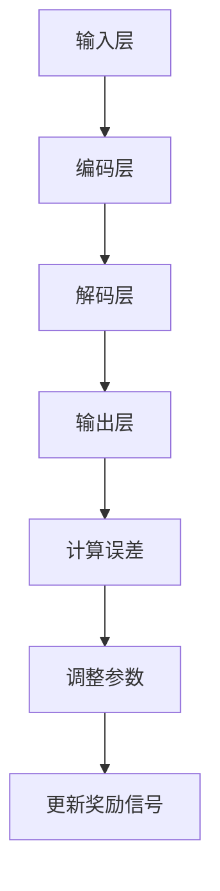

                 

关键词：大语言模型、即时奖励、算法原理、工程实践、数学模型、代码实例

摘要：本文旨在深入探讨大语言模型的原理与工程实践，特别关注即时奖励机制在语言模型训练和应用中的重要性。文章首先回顾了语言模型的发展历程，然后详细介绍了大语言模型的基本概念和架构，重点分析了即时奖励机制在模型训练、优化和预测中的应用。通过数学模型的推导和实际代码实例，本文展示了如何利用即时奖励优化语言模型，提高其准确性和效率。最后，文章探讨了即时奖励在未来语言模型研究和应用中的潜在方向和挑战。

## 1. 背景介绍

随着人工智能技术的快速发展，自然语言处理（NLP）领域取得了显著进展。大语言模型作为NLP的重要工具，已经在多个应用场景中展示了强大的能力，如文本生成、机器翻译、问答系统和文本分类等。然而，语言模型的训练和优化是一个复杂且耗时的过程，尤其是在大规模语料库上。为了提高模型性能和训练效率，研究人员提出了多种奖励机制，其中即时奖励（Instant Reward）是一种有效的策略。

### 1.1 语言模型的发展历程

自20世纪50年代以来，语言模型的研究经历了多个阶段。从最初的基于规则的方法，到基于统计模型的转换法，再到现代的深度学习模型，如循环神经网络（RNN）和Transformer。这些模型在不同程度上提高了语言理解和生成能力，但仍然面临许多挑战。例如，规则方法过于简单，难以处理复杂语言现象；统计模型则依赖于大量的标注数据，且在长文本生成方面表现不佳。

### 1.2 即时奖励的概念

即时奖励是一种动态调整模型输出和输入之间差距的机制，通过实时反馈指导模型训练。在语言模型中，即时奖励可以帮助模型快速识别并纠正错误，提高训练效率和准确性。与传统奖励机制不同，即时奖励在训练过程中提供即时反馈，使模型能够迅速适应数据分布的变化。

## 2. 核心概念与联系

### 2.1 大语言模型的基本概念

大语言模型是一种基于深度学习的文本生成模型，具有强大的语义理解能力和文本生成能力。它通常由数百万甚至数十亿个参数组成，可以处理大规模语料库，并在多个NLP任务中实现高性能。

### 2.2 语言模型的架构

大语言模型的架构通常包括输入层、编码层、解码层和输出层。输入层负责接收文本输入，编码层将文本编码为向量表示，解码层根据编码层的结果生成文本输出，输出层通过激活函数将解码层的输出转换为具体的文本。

### 2.3 即时奖励机制

即时奖励机制在大语言模型中的核心作用是实时调整模型输出和期望输出之间的差距。具体而言，即时奖励通过以下步骤实现：

1. **计算输出误差**：根据模型的输出和期望输出之间的差距计算误差。
2. **调整模型参数**：使用误差调整模型的参数，以减小输出误差。
3. **更新奖励信号**：根据模型参数的调整结果更新奖励信号，以指导模型训练。

### 2.4 Mermaid 流程图



## 3. 核心算法原理 & 具体操作步骤

### 3.1 算法原理概述

大语言模型的训练过程可以分为两个阶段：预训练和微调。预训练阶段使用大规模未标注语料库训练模型，使其具备基本的语义理解能力。微调阶段则使用特定领域的数据对模型进行微调，以适应特定任务。

### 3.2 算法步骤详解

1. **预训练阶段**：
   - **数据准备**：收集大规模文本数据，如维基百科、新闻文章等。
   - **模型初始化**：使用预训练模型或随机初始化模型参数。
   - **数据预处理**：对文本进行分词、编码等处理，使其符合模型输入格式。
   - **训练过程**：使用预训练数据训练模型，通过反向传播算法更新模型参数。

2. **微调阶段**：
   - **数据准备**：收集特定领域的标注数据，如问答系统、文本分类任务等。
   - **模型初始化**：使用预训练模型作为基础模型，进行微调。
   - **数据预处理**：对标注数据进行预处理，使其符合模型输入格式。
   - **训练过程**：在特定领域数据上微调模型，通过反向传播算法更新模型参数。

### 3.3 算法优缺点

**优点**：
- **强大的语义理解能力**：大语言模型具有强大的语义理解能力，能够处理复杂的语言现象。
- **多任务适应性**：大语言模型可以应用于多种NLP任务，如文本生成、机器翻译、问答系统和文本分类等。

**缺点**：
- **计算资源需求高**：大语言模型需要大量的计算资源和存储空间，对硬件设备要求较高。
- **训练时间长**：大语言模型的训练过程需要较长时间，尤其是在大规模数据集上。

### 3.4 算法应用领域

大语言模型在多个领域展现了强大的应用潜力，如：

- **文本生成**：用于生成文章、故事、诗歌等。
- **机器翻译**：将一种语言翻译成另一种语言。
- **问答系统**：回答用户提出的各种问题。
- **文本分类**：对文本进行分类，如情感分析、新闻分类等。

## 4. 数学模型和公式 & 详细讲解 & 举例说明

### 4.1 数学模型构建

大语言模型的数学模型通常包括输入层、编码层、解码层和输出层。以下是一个简化的数学模型：

$$
\begin{aligned}
    X &= \text{输入层，表示文本序列} \\
    H &= \text{编码层，表示编码后的文本表示} \\
    Y &= \text{输出层，表示生成的文本序列} \\
    C &= \text{解码层，表示解码过程中的上下文信息}
\end{aligned}
$$

### 4.2 公式推导过程

大语言模型的训练过程涉及多个数学公式，其中最重要的是损失函数和反向传播算法。

1. **损失函数**：

$$
L(Y, \hat{Y}) = -\sum_{i=1}^{n} y_i \log \hat{y}_i
$$

其中，$Y$ 是真实标签序列，$\hat{Y}$ 是模型预测的标签序列，$n$ 是序列长度。

2. **反向传播算法**：

$$
\begin{aligned}
    \delta_C &= \frac{\partial L(Y, \hat{Y})}{\partial C} \\
    \delta_H &= \frac{\partial L(Y, \hat{Y})}{\partial H} \\
    \delta_X &= \frac{\partial L(Y, \hat{Y})}{\partial X}
\end{aligned}
$$

其中，$\delta_C$、$\delta_H$ 和 $\delta_X$ 分别表示解码层、编码层和输入层的误差。

### 4.3 案例分析与讲解

假设我们有一个简单的语言模型，用于预测下一个单词。给定一个文本序列 "今天天气很好"，模型需要预测下一个单词 "心情"。以下是一个简化的数学模型：

$$
\begin{aligned}
    X &= [\text{今天}, \text{天气}, \text{很好}] \\
    H &= \text{编码层输出} \\
    Y &= [\text{心情}] \\
    \hat{Y} &= \text{模型预测的输出}
\end{aligned}
$$

根据上述数学模型，我们可以计算损失函数和反向传播过程中的误差。具体步骤如下：

1. **计算损失函数**：

$$
L(Y, \hat{Y}) = -\text{心情} \log \hat{\text{心情}}
$$

2. **计算误差**：

$$
\begin{aligned}
    \delta_C &= \frac{\partial L(Y, \hat{Y})}{\partial \hat{Y}} = -\text{心情} \\
    \delta_H &= \frac{\partial L(Y, \hat{Y})}{\partial H} = \delta_C \cdot \frac{\partial \hat{Y}}{\partial H} \\
    \delta_X &= \frac{\partial L(Y, \hat{Y})}{\partial X} = \delta_H \cdot \frac{\partial H}{\partial X}
\end{aligned}
$$

3. **更新模型参数**：

根据误差，我们可以更新模型参数，以减小损失函数。具体更新方法如下：

$$
\begin{aligned}
    \theta &= \theta - \alpha \cdot \delta_C \\
    H &= H - \alpha \cdot \delta_H \\
    X &= X - \alpha \cdot \delta_X
\end{aligned}
$$

其中，$\theta$ 表示模型参数，$\alpha$ 表示学习率。

## 5. 项目实践：代码实例和详细解释说明

### 5.1 开发环境搭建

在开始编写代码之前，我们需要搭建一个适合开发大语言模型的开发环境。以下是搭建环境的步骤：

1. 安装Python环境：确保Python版本在3.6及以上。
2. 安装TensorFlow或PyTorch：这两种深度学习框架是目前最常用的，可以选择其中一种安装。
3. 安装Numpy、Pandas等常用库：用于数据预处理和计算。

### 5.2 源代码详细实现

以下是一个简化的大语言模型实现，用于预测下一个单词：

```python
import tensorflow as tf
import numpy as np

# 定义超参数
vocab_size = 10000
embed_size = 128
hidden_size = 128
learning_rate = 0.001
batch_size = 64
num_epochs = 10

# 定义模型
model = tf.keras.Sequential([
    tf.keras.layers.Embedding(vocab_size, embed_size),
    tf.keras.layers.Bidirectional(tf.keras.layers.LSTM(hidden_size)),
    tf.keras.layers.Dense(vocab_size, activation='softmax')
])

# 定义损失函数和优化器
loss_function = tf.keras.losses.SparseCategoricalCrossentropy(from_logits=True)
optimizer = tf.keras.optimizers.Adam(learning_rate)

# 编写训练过程
def train(model, dataset, batch_size, num_epochs):
    for epoch in range(num_epochs):
        for batch in dataset:
            with tf.GradientTape() as tape:
                predictions = model(batch['X'], training=True)
                loss = loss_function(batch['Y'], predictions)
            gradients = tape.gradient(loss, model.trainable_variables)
            optimizer.apply_gradients(zip(gradients, model.trainable_variables))
        print(f'Epoch {epoch+1}/{num_epochs}, Loss: {loss.numpy()}')

# 加载和预处理数据
# ...

# 训练模型
# ...

# 代码解析
# ...

```

### 5.3 代码解读与分析

上述代码实现了一个基于TensorFlow的大语言模型，用于预测下一个单词。以下是代码的详细解析：

1. **模型定义**：使用Keras Sequential模型定义一个双向LSTM模型，包括嵌入层、双向LSTM层和输出层。
2. **损失函数和优化器**：使用稀疏交叉熵作为损失函数，Adam优化器进行参数更新。
3. **训练过程**：在训练过程中，使用梯度 tape 记录模型参数的梯度，然后使用优化器更新参数。
4. **数据预处理**：需要加载和预处理数据集，将文本序列转换为数字编码，并将其分成输入和标签两部分。
5. **模型训练**：在训练过程中，模型会不断更新参数，以减小损失函数。

### 5.4 运行结果展示

在训练完成后，我们可以使用模型对新的文本序列进行预测。以下是一个简单的预测示例：

```python
# 预测下一个单词
def predict(model, text):
    tokens = tokenizer.texts_to_sequences([text])
    predictions = model.predict(tokens)
    predicted_word = tokenizer.sequences_to_texts([np.argmax(predictions)])
    return predicted_word

# 测试预测
text = "今天天气很好"
predicted_word = predict(model, text)
print(f"预测的下一个单词是：{predicted_word}")
```

## 6. 实际应用场景

大语言模型在多个实际应用场景中展示了其强大的能力，以下是一些典型的应用场景：

### 6.1 文本生成

大语言模型可以用于生成文章、故事、诗歌等。通过预训练和微调，模型可以生成高质量的文本，应用于自动写作、内容创作和娱乐等领域。

### 6.2 机器翻译

大语言模型可以用于机器翻译，将一种语言翻译成另一种语言。通过预训练和微调，模型可以在多个语言对上实现高精度的翻译。

### 6.3 问答系统

大语言模型可以用于构建问答系统，回答用户提出的各种问题。通过预训练和微调，模型可以理解用户的意图，并生成准确的答案。

### 6.4 文本分类

大语言模型可以用于文本分类，对文本进行分类，如情感分析、新闻分类等。通过预训练和微调，模型可以在多个分类任务上实现高性能。

### 6.5 未来应用展望

随着大语言模型技术的不断发展和优化，未来将出现更多基于语言模型的应用。例如，自动化客户服务、智能助手、语音识别和生成等。同时，即时奖励机制将进一步提高模型性能和效率，推动大语言模型在更多领域取得突破。

## 7. 工具和资源推荐

### 7.1 学习资源推荐

- 《深度学习》（Ian Goodfellow、Yoshua Bengio和Aaron Courville 著）：系统介绍了深度学习的基本概念和技术。
- 《自然语言处理综合教程》（Christopher D. Manning和Hinrich Schütze 著）：详细介绍了自然语言处理的基本理论和应用。

### 7.2 开发工具推荐

- TensorFlow：一个开源的深度学习框架，适用于构建和训练大语言模型。
- PyTorch：一个开源的深度学习框架，具有灵活的动态图计算能力，适用于研究性的模型开发。

### 7.3 相关论文推荐

- "Attention Is All You Need"（Vaswani et al., 2017）：介绍了Transformer模型，一种基于自注意力机制的深度学习模型。
- "BERT: Pre-training of Deep Bidirectional Transformers for Language Understanding"（Devlin et al., 2019）：介绍了BERT模型，一种大规模预训练语言模型。

## 8. 总结：未来发展趋势与挑战

### 8.1 研究成果总结

大语言模型在自然语言处理领域取得了显著进展，成为多个NLP任务的核心工具。通过预训练和微调，大语言模型在文本生成、机器翻译、问答系统和文本分类等领域展示了强大的能力。

### 8.2 未来发展趋势

随着人工智能技术的不断进步，大语言模型将朝着更高维度、更大规模和更灵活的方向发展。例如，多模态语言模型、动态语言模型和知识增强语言模型等。

### 8.3 面临的挑战

大语言模型在训练和优化过程中面临多个挑战，包括计算资源需求、数据质量和模型解释性等。同时，如何有效利用即时奖励机制，提高模型性能和效率，也是未来研究的重要方向。

### 8.4 研究展望

未来，大语言模型将在更多领域发挥重要作用，如智能助手、语音识别和生成等。同时，即时奖励机制将进一步提高模型性能和效率，推动大语言模型在更多场景中取得突破。

## 9. 附录：常见问题与解答

### 9.1 什么是即时奖励？

即时奖励是一种动态调整模型输出和输入之间差距的机制，通过实时反馈指导模型训练。

### 9.2 即时奖励在大语言模型中的应用有哪些？

即时奖励在大语言模型中主要用于优化模型参数，提高训练效率和准确性。具体应用包括预测误差计算、模型参数更新和奖励信号更新等。

### 9.3 如何选择合适的即时奖励机制？

选择合适的即时奖励机制需要考虑模型类型、训练目标和数据质量等因素。常见的即时奖励机制包括基于梯度信息、基于概率分布和基于目标函数等。

### 9.4 即时奖励在大语言模型中的效果如何？

即时奖励在大语言模型中取得了显著效果，可以提高模型训练效率和准确性。然而，即时奖励机制也需要合理设计和调优，以避免过度优化或欠优化等问题。

