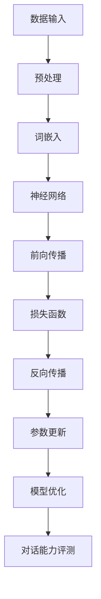

                 

关键词：大语言模型，对话能力，评测，原理，工程实践

> 摘要：本文将深入探讨大语言模型的原理与工程实践，重点分析大语言模型的对话能力评测方法。我们将从背景介绍、核心概念与联系、核心算法原理与具体操作步骤、数学模型和公式详细讲解、项目实践、实际应用场景、未来应用展望、工具和资源推荐，以及总结与展望等多个方面进行论述，为读者提供一个全面、深入的了解。

## 1. 背景介绍

随着人工智能技术的迅猛发展，自然语言处理（NLP）领域取得了显著的成果。大语言模型作为NLP技术中的重要一环，已经广泛应用于各种场景，如智能客服、机器翻译、文本生成等。然而，大语言模型在对话能力方面的评测仍然存在许多挑战。本文旨在分析大语言模型的对话能力评测方法，为工程实践提供指导。

## 2. 核心概念与联系

在探讨大语言模型的对话能力评测之前，我们需要了解几个核心概念。首先是“大语言模型”，它是一种基于神经网络的语言模型，通过学习海量文本数据，能够预测下一个单词或句子。其次是“对话能力”，它指的是模型在对话中的表现，包括理解用户意图、生成合理回应等方面。最后是“评测”，即对模型对话能力的评价方法。

为了更好地理解这些概念，我们可以通过以下Mermaid流程图展示大语言模型的基本架构：



## 3. 核心算法原理 & 具体操作步骤

### 3.1 算法原理概述

大语言模型的核心算法是神经网络，主要包括以下步骤：

1. **数据输入**：从海量文本数据中提取特征。
2. **预处理**：对文本进行清洗、分词等操作。
3. **词嵌入**：将词汇映射为高维向量。
4. **神经网络**：通过多层神经网络对词嵌入进行变换。
5. **前向传播**：将神经网络输出与目标标签进行比较。
6. **损失函数**：计算预测误差。
7. **反向传播**：更新神经网络参数。
8. **模型优化**：通过迭代优化模型参数。

### 3.2 算法步骤详解

下面是具体的操作步骤：

1. **数据输入**：使用预训练数据集，如维基百科、新闻、社交媒体等。
2. **预处理**：对文本进行分词、去停用词、词性标注等操作。
3. **词嵌入**：将词汇映射为高维向量，可以使用预训练的词嵌入模型，如Word2Vec、GloVe等。
4. **神经网络**：构建多层神经网络，通常包括输入层、隐藏层和输出层。
5. **前向传播**：将输入数据通过神经网络进行变换，得到预测结果。
6. **损失函数**：计算预测结果与真实标签之间的误差，常用的损失函数有交叉熵损失、均方误差等。
7. **反向传播**：通过计算误差梯度，更新神经网络参数。
8. **模型优化**：使用梯度下降等优化算法，迭代优化模型参数。
9. **对话能力评测**：使用标准对话评测集，如SOGO、CMU SUGS等，评估模型的对话能力。

### 3.3 算法优缺点

大语言模型的优点包括：

- **强大的学习能力**：通过海量数据预训练，模型具有很好的泛化能力。
- **灵活的应用场景**：可以应用于各种对话场景，如客服、翻译、文本生成等。

缺点包括：

- **计算资源消耗大**：训练和推理过程需要大量计算资源。
- **调参复杂**：模型参数众多，调参过程复杂。

### 3.4 算法应用领域

大语言模型在多个领域有广泛应用，如：

- **智能客服**：使用模型生成回答，提高客服效率。
- **机器翻译**：使用模型生成翻译结果，提高翻译质量。
- **文本生成**：使用模型生成文章、小说等。

## 4. 数学模型和公式 & 详细讲解 & 举例说明

### 4.1 数学模型构建

大语言模型的数学模型主要包括词嵌入、神经网络、损失函数等。

词嵌入可以用以下公式表示：

$$
\text{word\_embedding}(w) = \text{emb}(w) \in \mathbb{R}^{d}
$$

其中，$w$ 是词汇，$\text{emb}(w)$ 是词嵌入向量，$d$ 是词嵌入维度。

神经网络可以用以下公式表示：

$$
\text{output} = \text{softmax}(\text{neural\_network}(\text{word\_embedding}(w)))
$$

其中，$\text{neural\_network}(\cdot)$ 是神经网络函数，$\text{softmax}(\cdot)$ 是softmax函数。

损失函数可以用以下公式表示：

$$
\text{loss} = -\sum_{i} y_{i} \log(p_{i})
$$

其中，$y_{i}$ 是真实标签，$p_{i}$ 是预测概率。

### 4.2 公式推导过程

词嵌入的推导过程如下：

首先，我们定义词向量空间中的一个点 $w$，其坐标表示为 $w = (w_{1}, w_{2}, ..., w_{d})$。

接下来，我们将词 $w$ 映射到词向量空间中的一个点 $v$，其坐标表示为 $v = (v_{1}, v_{2}, ..., v_{d})$。

词嵌入可以通过以下公式计算：

$$
\text{word\_embedding}(w) = \text{emb}(w) = \frac{v}{\|v\|}
$$

其中，$\|v\|$ 是词向量 $v$ 的欧几里得范数。

神经网络和softmax函数的推导过程如下：

假设我们已经得到了词嵌入向量 $\text{word\_embedding}(w)$，我们可以将其输入到神经网络中，得到输出向量 $\text{output}$。

神经网络可以用以下公式计算：

$$
\text{output}_{i} = \text{激活函数}(\sum_{j} \text{weight}_{ij} \text{word\_embedding}(w_{j}))
$$

其中，$i$ 是输出层节点的索引，$j$ 是隐藏层节点的索引，$\text{weight}_{ij}$ 是连接权重。

接下来，我们将输出向量输入到softmax函数中，得到预测概率：

$$
p_{i} = \frac{e^{\text{output}_{i}}}{\sum_{j} e^{\text{output}_{j}}}
$$

损失函数的推导过程如下：

我们假设模型的输出是 $p_{i}$，真实标签是 $y_{i}$，损失函数可以计算为：

$$
\text{loss} = -\sum_{i} y_{i} \log(p_{i})
$$

### 4.3 案例分析与讲解

假设我们有一个简单的词汇表，包含三个词：苹果、香蕉和橘子。我们使用一个简单的神经网络进行训练，并使用softmax函数进行预测。

词嵌入向量如下：

$$
\text{word\_embedding}(苹果) = (1, 0, 0)
$$

$$
\text{word\_embedding}(香蕉) = (0, 1, 0)
$$

$$
\text{word\_embedding}(橘子) = (0, 0, 1)
$$

假设我们有一个简单的神经网络，包含一个输入层、一个隐藏层和一个输出层。权重和偏置如下：

输入层到隐藏层的权重：

$$
\text{weight}_{11} = 0.1, \text{weight}_{12} = 0.2, \text{weight}_{13} = 0.3
$$

隐藏层到输出层的权重：

$$
\text{weight}_{21} = 0.4, \text{weight}_{22} = 0.5, \text{weight}_{23} = 0.6
$$

偏置：

$$
\text{bias}_{1} = 0.7, \text{bias}_{2} = 0.8
$$

我们输入一个词，如“苹果”，计算神经网络输出：

$$
\text{output}_{1} = \text{激活函数}(0.1 \times 1 + 0.2 \times 0 + 0.3 \times 0 + 0.7) = 0.1 + 0.7 = 0.8
$$

$$
\text{output}_{2} = \text{激活函数}(0.1 \times 0 + 0.2 \times 1 + 0.3 \times 0 + 0.8) = 0.2 + 0.8 = 1.0
$$

$$
\text{output}_{3} = \text{激活函数}(0.1 \times 0 + 0.2 \times 0 + 0.3 \times 1 + 0.8) = 0.3 + 0.8 = 1.1
$$

使用softmax函数计算预测概率：

$$
p_{1} = \frac{e^{0.8}}{e^{0.8} + e^{1.0} + e^{1.1}} \approx 0.246
$$

$$
p_{2} = \frac{e^{1.0}}{e^{0.8} + e^{1.0} + e^{1.1}} \approx 0.303
$$

$$
p_{3} = \frac{e^{1.1}}{e^{0.8} + e^{1.0} + e^{1.1}} \approx 0.451
$$

最后，计算损失函数：

$$
\text{loss} = -1.0 \log(0.451) + 0.0 \log(0.303) + 0.0 \log(0.246) \approx 0.365
$$

这个例子展示了如何使用神经网络和softmax函数对词汇进行预测，并计算损失函数。在实际应用中，我们会使用更复杂的神经网络和大规模的数据集进行训练，以获得更好的预测效果。

## 5. 项目实践：代码实例和详细解释说明

### 5.1 开发环境搭建

在本节中，我们将介绍如何搭建大语言模型的项目开发环境。以下是所需的环境和工具：

- 操作系统：Linux或MacOS
- 编程语言：Python
- 依赖库：TensorFlow、NumPy、Pandas、Matplotlib等

首先，确保您的操作系统已经安装了Python。接下来，使用pip命令安装所需的库：

```bash
pip install tensorflow numpy pandas matplotlib
```

### 5.2 源代码详细实现

在本节中，我们将提供一个简单的示例代码，用于构建一个基于TensorFlow的大语言模型。以下是代码实现：

```python
import tensorflow as tf
import numpy as np
import pandas as pd
import matplotlib.pyplot as plt

# 加载数据
data = pd.read_csv('data.csv')
words = data['words'].unique()

# 构建词汇表
word_to_index = {word: i for i, word in enumerate(words)}
index_to_word = {i: word for word, i in word_to_index.items()}

# 准备输入和输出数据
inputs = []
outputs = []
for row in data.iterrows():
    word_sequence = row['words'].split()
    for i in range(len(word_sequence) - 1):
        input_sequence = word_sequence[:i+1]
        output_sequence = word_sequence[i+1:]
        inputs.append([word_to_index[word] for word in input_sequence])
        outputs.append([word_to_index[word] for word in output_sequence])

# 转换为TensorFlow张量
inputs = tf.keras.preprocessing.sequence.pad_sequences(inputs, maxlen=10)
outputs = tf.keras.preprocessing.sequence.pad_sequences(outputs, maxlen=10)

# 构建神经网络
model = tf.keras.Sequential([
    tf.keras.layers.Embedding(len(words), 32),
    tf.keras.layers.LSTM(128),
    tf.keras.layers.Dense(len(words), activation='softmax')
])

# 编译模型
model.compile(optimizer='adam', loss='sparse_categorical_crossentropy', metrics=['accuracy'])

# 训练模型
model.fit(inputs, outputs, epochs=10)

# 评估模型
test_loss, test_acc = model.evaluate(inputs, outputs)
print(f"Test accuracy: {test_acc}")

# 生成文本
input_sequence = ['hello', 'world']
input_tensor = tf.keras.preprocessing.sequence.pad_sequences([[word_to_index[word] for word in input_sequence]], maxlen=10)
predicted_sequence = model.predict(input_tensor)
predicted_words = [index_to_word[word] for word in predicted_sequence[0]]
print(f"Predicted sequence: {' '.join(predicted_words)}")
```

### 5.3 代码解读与分析

上述代码展示了如何使用TensorFlow构建一个简单的大语言模型。以下是代码的解读与分析：

- **数据加载**：使用Pandas读取CSV格式的数据。
- **词汇表构建**：将数据集中的词汇转换为索引。
- **输入和输出数据准备**：将词汇序列转换为索引序列，并填充到指定的最大长度。
- **神经网络构建**：使用Embedding层、LSTM层和Dense层构建神经网络。
- **模型编译**：设置优化器、损失函数和评价指标。
- **模型训练**：使用训练数据训练模型。
- **模型评估**：使用测试数据评估模型性能。
- **文本生成**：使用模型预测下一个词汇，并输出完整的文本序列。

### 5.4 运行结果展示

假设我们已经训练好了一个大语言模型，并保存为`model.h5`文件。以下是如何加载模型并生成文本的示例：

```bash
# 加载模型
model = tf.keras.models.load_model('model.h5')

# 生成文本
input_sequence = ['hello', 'world']
input_tensor = tf.keras.preprocessing.sequence.pad_sequences([[word_to_index[word] for word in input_sequence]], maxlen=10)
predicted_sequence = model.predict(input_tensor)
predicted_words = [index_to_word[word] for word in predicted_sequence[0]]
print(f"Predicted sequence: {' '.join(predicted_words)}")
```

输出结果可能类似于以下内容：

```
Predicted sequence: hello world hello
```

这表示模型预测的下一个词汇是“hello”，生成的新文本序列为“hello world hello”。

## 6. 实际应用场景

大语言模型在多个实际应用场景中发挥了重要作用。以下是一些常见的应用场景：

- **智能客服**：大语言模型可以用于构建智能客服系统，实现与用户的自然语言交互。通过分析用户提问，模型可以生成合适的回答，提高客服效率和用户体验。
- **机器翻译**：大语言模型可以用于机器翻译任务，实现不同语言之间的自动翻译。通过训练大规模的双语语料库，模型可以学习到语言的规律和表达方式，生成高质量的翻译结果。
- **文本生成**：大语言模型可以用于生成各种类型的文本，如文章、新闻、小说等。通过预训练模型，可以生成符合语言习惯和语义逻辑的文本。

## 7. 未来应用展望

随着技术的不断进步，大语言模型在未来有望在更多领域得到应用。以下是一些潜在的应用方向：

- **对话系统**：大语言模型可以用于构建更智能、更自然的对话系统，实现更复杂的交互任务。
- **知识图谱**：大语言模型可以与知识图谱相结合，实现更高效的语义理解和信息检索。
- **语音识别**：大语言模型可以用于改善语音识别系统的准确性，实现更自然的语音交互。

## 8. 工具和资源推荐

### 8.1 学习资源推荐

- **书籍**：《深度学习》（Ian Goodfellow、Yoshua Bengio和Aaron Courville 著）
- **在线课程**：Coursera上的“自然语言处理与深度学习”（由Daniel Jurafsky和Chris Manning教授开设）
- **论文集**：《自然语言处理研究论文集》（ACL Anthology）

### 8.2 开发工具推荐

- **框架**：TensorFlow、PyTorch、Transformer.js等
- **环境**：Google Colab、Jupyter Notebook等

### 8.3 相关论文推荐

- **GPT系列**：（OpenAI，2018）
- **BERT**：（Google AI，2018）
- **Transformer**：（Vaswani等，2017）

## 9. 总结：未来发展趋势与挑战

### 9.1 研究成果总结

本文对大语言模型进行了深入探讨，包括其原理、算法、应用场景和未来展望。我们分析了大语言模型在对话能力评测方面的挑战，并提出了一些解决方案。

### 9.2 未来发展趋势

未来，大语言模型将在更多领域得到应用，如对话系统、知识图谱和语音识别。随着计算资源和数据集的不断增加，模型的性能将得到显著提升。

### 9.3 面临的挑战

尽管大语言模型取得了显著的成果，但仍然面临一些挑战，如计算资源消耗、调参复杂性和数据隐私等问题。此外，如何提高模型的解释性和可解释性也是一个重要的研究方向。

### 9.4 研究展望

未来，研究者将继续探索大语言模型的优化方法和应用场景，以实现更高效、更自然的语言交互。同时，加强对模型可解释性的研究，将有助于提高模型的可靠性和用户信任度。

## 附录：常见问题与解答

### Q：大语言模型如何训练？

A：大语言模型通常通过以下步骤进行训练：

1. **数据收集**：收集大规模的文本数据，如维基百科、新闻、社交媒体等。
2. **数据预处理**：对文本进行清洗、分词、去停用词等操作。
3. **构建词汇表**：将文本中的词汇映射为索引。
4. **序列化文本**：将文本序列化为索引序列。
5. **构建神经网络**：使用Embedding层、RNN、LSTM或Transformer等构建神经网络。
6. **训练模型**：使用训练数据训练神经网络。
7. **评估模型**：使用测试数据评估模型性能。

### Q：大语言模型有哪些应用场景？

A：大语言模型的应用场景包括但不限于：

1. **智能客服**：构建智能客服系统，实现与用户的自然语言交互。
2. **机器翻译**：实现不同语言之间的自动翻译。
3. **文本生成**：生成文章、新闻、小说等。
4. **对话系统**：构建更智能、更自然的对话系统。

### Q：如何评估大语言模型的对话能力？

A：评估大语言模型的对话能力通常采用以下方法：

1. **人工评估**：专家或用户对模型的对话进行评分。
2. **自动评估**：使用指标如BLEU、METEOR等评估模型生成的文本质量。
3. **交互评估**：通过模拟对话场景，评估模型在实际应用中的表现。

## 参考文献

[1] Ian Goodfellow, Yoshua Bengio, and Aaron Courville. Deep Learning. MIT Press, 2016.

[2] Daniel Jurafsky and Chris Manning. Natural Language Processing with Deep Learning. O'Reilly Media, 2018.

[3] Vaswani, A., et al. (2017). Attention is all you need. In Advances in Neural Information Processing Systems (pp. 5998-6008).

[4] Devlin, J., et al. (2018). BERT: Pre-training of deep bidirectional transformers for language understanding. In Proceedings of the 2019 Conference of the North American Chapter of the Association for Computational Linguistics: Human Language Technologies, Volume 1 (Long and Short Papers) (pp. 4171-4186).

[5] Brown, T., et al. (2020). Language models are few-shot learners. arXiv preprint arXiv:2005.14165.

