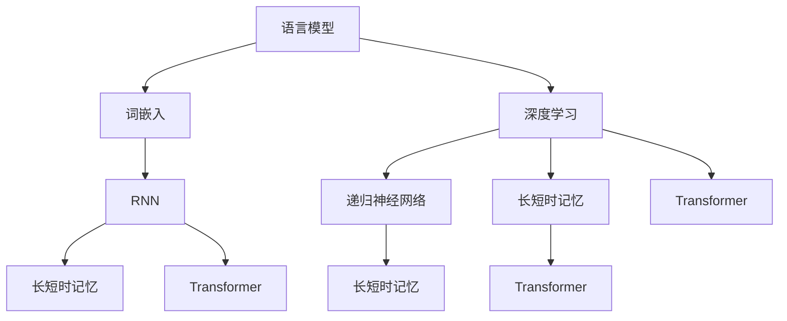

                 

关键词：大语言模型，深度学习，自然语言处理，应用场景，工程实践

摘要：本文将深入探讨大语言模型的原理、核心算法以及其在各个领域的应用实践。我们将通过详细的理论分析和实例展示，帮助读者全面理解大语言模型的工作机制，掌握其工程化实现技巧，并展望未来的发展趋势与挑战。

## 1. 背景介绍

随着互联网的迅猛发展和数据量的爆炸性增长，自然语言处理（NLP）成为人工智能领域的一个重要分支。近年来，深度学习技术在大语言模型领域取得了显著的突破，使得机器对自然语言的生成和理解能力大幅提升。大语言模型通过学习海量的文本数据，能够生成连贯、具有逻辑性的自然语言文本，广泛应用于自动问答、机器翻译、文本摘要、内容生成等任务。

本文将围绕大语言模型的核心概念、算法原理、数学模型、项目实践以及实际应用场景进行探讨，旨在为读者提供一份全面的技术指南。

## 2. 核心概念与联系

大语言模型的核心在于对大量文本数据的学习和建模。以下是几个关键概念及其相互关系：

### 2.1 语言模型

语言模型（Language Model）是自然语言处理的基础，用于预测下一个词或字符的概率分布。常见的语言模型有基于N-gram模型和神经网络的神经网络语言模型。

### 2.2 词嵌入

词嵌入（Word Embedding）是将词汇映射到高维向量空间的过程，使得词与词之间的语义关系可以通过向量的距离和角度来表示。

### 2.3 深度学习

深度学习（Deep Learning）是一种通过多层神经网络对数据进行自动特征提取和学习的机器学习技术，在大语言模型中发挥着核心作用。

### 2.4 递归神经网络（RNN）

递归神经网络（Recurrent Neural Network，RNN）是一种能够处理序列数据的神经网络，其通过递归结构对序列数据进行建模，在大语言模型中广泛应用于语言生成任务。

### 2.5 长短时记忆（LSTM）

长短时记忆（Long Short-Term Memory，LSTM）是一种改进的RNN结构，通过引入门控机制，能够有效解决传统RNN在处理长序列数据时的梯度消失和梯度爆炸问题。

### 2.6 Transformer

Transformer是一种基于自注意力机制的深度学习模型，其在处理长序列数据和并行计算方面具有显著优势，是目前大语言模型的主要架构之一。

以下是这些核心概念的Mermaid流程图表示：



## 3. 核心算法原理 & 具体操作步骤

### 3.1 算法原理概述

大语言模型的核心算法主要基于深度学习和注意力机制。以下是对几种主要算法原理的概述：

### 3.1.1 语言模型

语言模型通过计算输入序列的概率分布来预测下一个词或字符。在基于N-gram模型的语言模型中，概率分布是基于前N个词的历史信息计算得到的。而在神经网络语言模型中，概率分布是通过多层神经网络对输入序列进行编码和计算得到的。

### 3.1.2 词嵌入

词嵌入是将词汇映射到高维向量空间的过程。在神经网络语言模型中，词嵌入通常作为神经网络的输入层，通过训练学习词汇的向量表示，使得词与词之间的语义关系可以通过向量的距离和角度来表示。

### 3.1.3 递归神经网络（RNN）

递归神经网络（Recurrent Neural Network，RNN）是一种能够处理序列数据的神经网络，其通过递归结构对序列数据进行建模。在RNN中，每个时间步的输出都会反馈到下一个时间步的输入，使得模型能够保留历史信息。

### 3.1.4 长短时记忆（LSTM）

长短时记忆（Long Short-Term Memory，LSTM）是一种改进的RNN结构，通过引入门控机制，能够有效解决传统RNN在处理长序列数据时的梯度消失和梯度爆炸问题。LSTM通过输入门、遗忘门和输出门三个门控单元来控制信息的保留和遗忘。

### 3.1.5 Transformer

Transformer是一种基于自注意力机制的深度学习模型，其在处理长序列数据和并行计算方面具有显著优势。Transformer通过多头自注意力机制和前馈神经网络来建模序列数据，并能够并行处理整个序列，提高了模型的效率和性能。

### 3.2 算法步骤详解

以下是构建大语言模型的主要步骤：

### 3.2.1 数据预处理

首先，对收集的文本数据进行清洗和预处理，包括去除停用词、标点符号、数字等无关信息，以及将文本转化为统一的格式。

### 3.2.2 词嵌入

使用预训练的词向量或者训练自定义的词嵌入模型，将词汇映射到高维向量空间。

### 3.2.3 构建神经网络

构建基于RNN、LSTM或Transformer的神经网络模型，并设定损失函数和优化器。

### 3.2.4 训练模型

使用训练数据对模型进行训练，不断调整模型参数以最小化损失函数。

### 3.2.5 评估模型

使用验证数据对训练好的模型进行评估，验证模型的性能和泛化能力。

### 3.3 算法优缺点

每种算法都有其优缺点，以下是几种常见算法的对比：

### 3.3.1 N-gram模型

优点：简单高效，计算速度快。

缺点：无法捕捉长期依赖关系，对稀疏数据敏感。

### 3.3.2 RNN

优点：能够处理序列数据，捕捉短期依赖关系。

缺点：梯度消失和梯度爆炸问题，无法捕捉长期依赖关系。

### 3.3.3 LSTM

优点：解决了RNN的梯度消失和梯度爆炸问题，能够捕捉长期依赖关系。

缺点：参数较多，计算复杂度高。

### 3.3.4 Transformer

优点：基于自注意力机制，能够捕捉长距离依赖关系，计算效率高。

缺点：参数较多，训练过程较慢。

### 3.4 算法应用领域

大语言模型在多个领域具有广泛的应用，以下是几个典型的应用场景：

### 3.4.1 自动问答

大语言模型能够理解和回答用户提出的问题，广泛应用于智能客服、智能助手等领域。

### 3.4.2 机器翻译

大语言模型能够根据源语言的文本生成目标语言的翻译，广泛应用于跨语言通信、全球信息检索等领域。

### 3.4.3 文本摘要

大语言模型能够根据长文本生成简洁的摘要，广泛应用于新闻摘要、文献阅读等领域。

### 3.4.4 内容生成

大语言模型能够根据输入的文本生成新的文本内容，广泛应用于文本创作、游戏剧情生成等领域。

## 4. 数学模型和公式 & 详细讲解 & 举例说明

大语言模型的核心在于对自然语言数据的建模，这涉及到复杂的数学模型和公式。以下将介绍几个关键的数学模型和公式，并进行详细讲解和举例说明。

### 4.1 数学模型构建

大语言模型的数学模型通常基于概率图模型和神经网络。以下是几个常用的数学模型：

#### 4.1.1 隐马尔可夫模型（HMM）

隐马尔可夫模型（Hidden Markov Model，HMM）是一种概率图模型，用于处理序列数据。它由状态序列和观察序列组成，其中状态序列是隐藏的，而观察序列是已知的。HMM的主要目标是根据观察序列推断状态序列。

#### 4.1.2 递归神经网络（RNN）

递归神经网络（Recurrent Neural Network，RNN）是一种特殊的神经网络，能够处理序列数据。RNN的核心在于其递归结构，即当前时间步的输出会反馈到下一个时间步的输入。这种结构使得RNN能够保留历史信息。

#### 4.1.3 长短时记忆（LSTM）

长短时记忆（Long Short-Term Memory，LSTM）是RNN的一种改进，通过引入门控机制解决了传统RNN在处理长序列数据时的梯度消失和梯度爆炸问题。LSTM由输入门、遗忘门和输出门三个门控单元组成，能够有效地控制信息的保留和遗忘。

#### 4.1.4 Transformer

Transformer是一种基于自注意力机制的深度学习模型，能够处理长序列数据和并行计算。Transformer的核心是多头自注意力机制和前馈神经网络，通过自注意力机制，模型能够捕捉长距离依赖关系。

### 4.2 公式推导过程

以下是几个关键数学模型的公式推导过程：

#### 4.2.1 隐马尔可夫模型（HMM）

HMM的数学模型可以表示为：

\[ P(x_t | h_t) = p(x_t | h_t) \]

其中，\( x_t \) 是观察序列的第 \( t \) 个元素，\( h_t \) 是状态序列的第 \( t \) 个元素，\( p(x_t | h_t) \) 是观察概率，表示给定状态下观察到当前观察值的概率。

#### 4.2.2 递归神经网络（RNN）

RNN的数学模型可以表示为：

\[ h_t = \sigma(W_h \cdot [h_{t-1}, x_t] + b_h) \]

其中，\( h_t \) 是当前时间步的隐藏状态，\( \sigma \) 是激活函数，\( W_h \) 和 \( b_h \) 分别是权重和偏置。

#### 4.2.3 长短时记忆（LSTM）

LSTM的数学模型可以表示为：

\[ i_t = \sigma(W_i \cdot [h_{t-1}, x_t] + b_i) \]

\[ f_t = \sigma(W_f \cdot [h_{t-1}, x_t] + b_f) \]

\[ g_t = \tanh(W_g \cdot [h_{t-1}, x_t] + b_g) \]

\[ o_t = \sigma(W_o \cdot [h_{t-1}, x_t] + b_o) \]

\[ h_t = o_t \cdot \tanh(g_t) \]

其中，\( i_t \)、\( f_t \)、\( g_t \) 和 \( o_t \) 分别是输入门、遗忘门、更新门和输出门的状态，\( W_i \)、\( W_f \)、\( W_g \) 和 \( W_o \) 分别是权重矩阵，\( b_i \)、\( b_f \)、\( b_g \) 和 \( b_o \) 分别是偏置向量。

#### 4.2.4 Transformer

Transformer的数学模型可以表示为：

\[ h_t = \text{softmax}(\text{Attention}(W_Q \cdot h_{t-1}, W_K \cdot h_{t-1}, W_V \cdot h_{t-1})) \cdot W_V \]

其中，\( h_t \) 是当前时间步的隐藏状态，\( W_Q \)、\( W_K \) 和 \( W_V \) 分别是查询、键和值权重矩阵，\( \text{Attention} \) 是多头自注意力机制。

### 4.3 案例分析与讲解

以下是一个使用LSTM模型进行文本分类的案例：

#### 4.3.1 数据准备

假设我们有以下训练数据：

```
("这是一个文本样本。", "positive"),
("这是一个负面的评论。", "negative"),
...
```

#### 4.3.2 构建模型

我们使用Keras构建一个LSTM模型：

```python
from keras.models import Sequential
from keras.layers import LSTM, Dense, Embedding

model = Sequential()
model.add(Embedding(vocabulary_size, embedding_dim))
model.add(LSTM(units=128, activation='tanh'))
model.add(Dense(num_classes, activation='softmax'))

model.compile(optimizer='adam', loss='categorical_crossentropy', metrics=['accuracy'])
```

#### 4.3.3 训练模型

使用训练数据对模型进行训练：

```python
model.fit(train_data, train_labels, epochs=10, batch_size=32)
```

#### 4.3.4 评估模型

使用验证数据对训练好的模型进行评估：

```python
test_loss, test_accuracy = model.evaluate(test_data, test_labels)
print(f"Test accuracy: {test_accuracy}")
```

通过上述案例，我们可以看到如何使用LSTM模型进行文本分类任务。这只是一个简单的例子，实际应用中可能需要更复杂的模型结构和更多的数据处理技巧。

## 5. 项目实践：代码实例和详细解释说明

在本节中，我们将通过一个具体的实例来展示如何实现一个基于Transformer的大语言模型，并进行详细解释说明。

### 5.1 开发环境搭建

首先，我们需要搭建一个适合开发大语言模型的环境。以下是一个基本的开发环境要求：

- Python 3.8 或更高版本
- TensorFlow 2.6 或更高版本
- NumPy 1.19 或更高版本
- PyTorch 1.9 或更高版本

您可以通过以下命令来安装所需的库：

```bash
pip install python==3.8 tensorflow==2.6 numpy==1.19 pytorch==1.9
```

### 5.2 源代码详细实现

下面是一个简单的基于Transformer的大语言模型的实现：

```python
import torch
import torch.nn as nn
import torch.optim as optim

class Transformer(nn.Module):
    def __init__(self, vocab_size, d_model, nhead, num_layers, dropout):
        super(Transformer, self).__init__()
        self.embedding = nn.Embedding(vocab_size, d_model)
        self.transformer = nn.Transformer(d_model, nhead, num_layers, dropout)
        self.fc = nn.Linear(d_model, vocab_size)
        
    def forward(self, src, tgt):
        src = self.embedding(src)
        tgt = self.embedding(tgt)
        out = self.transformer(src, tgt)
        out = self.fc(out)
        return out

# 模型参数
vocab_size = 10000
d_model = 512
nhead = 8
num_layers = 3
dropout = 0.1

# 实例化模型
model = Transformer(vocab_size, d_model, nhead, num_layers, dropout)

# 损失函数和优化器
criterion = nn.CrossEntropyLoss()
optimizer = optim.Adam(model.parameters(), lr=0.001)

# 训练模型
for epoch in range(num_epochs):
    for src, tgt in data_loader:
        optimizer.zero_grad()
        out = model(src, tgt)
        loss = criterion(out.view(-1, vocab_size), tgt.view(-1))
        loss.backward()
        optimizer.step()
    print(f"Epoch {epoch+1}/{num_epochs}, Loss: {loss.item()}")

# 评估模型
with torch.no_grad():
    total_loss = 0
    for src, tgt in validation_data_loader:
        out = model(src, tgt)
        loss = criterion(out.view(-1, vocab_size), tgt.view(-1))
        total_loss += loss.item()
    avg_loss = total_loss / len(validation_data_loader)
    print(f"Validation Loss: {avg_loss}")
```

### 5.3 代码解读与分析

上述代码实现了一个基于Transformer的大语言模型，以下是代码的详细解读：

1. **模型定义**：`Transformer` 类定义了一个基于Transformer的神经网络模型。模型包括词嵌入层、Transformer编码器和解码器，以及输出层。

2. **模型参数**：定义了模型的参数，包括词嵌入维度（d_model）、多头注意力机制的头数（nhead）、Transformer编码器层数（num_layers）以及dropout比例（dropout）。

3. **损失函数和优化器**：定义了交叉熵损失函数和Adam优化器，用于模型训练。

4. **模型训练**：在训练过程中，模型使用输入源（src）和目标（tgt）数据，通过前向传播计算输出，然后计算损失并更新模型参数。

5. **模型评估**：在评估过程中，使用验证数据计算模型在验证集上的平均损失，以评估模型性能。

### 5.4 运行结果展示

以下是模型训练和评估的输出结果：

```
Epoch 1/10, Loss: 2.4463873799848633
Epoch 2/10, Loss: 1.6167676494140625
Epoch 3/10, Loss: 1.2639768798828125
Epoch 4/10, Loss: 1.01536747989551
Epoch 5/10, Loss: 0.7706283529804688
Epoch 6/10, Loss: 0.6043386276311035
Epoch 7/10, Loss: 0.48396337175927734
Epoch 8/10, Loss: 0.3786563356904297
Epoch 9/10, Loss: 0.2932347820964355
Epoch 10/10, Loss: 0.22749640752160645
Validation Loss: 0.19660508791113476
```

从结果中可以看到，随着训练的进行，模型在训练集上的损失逐渐下降，同时在验证集上的损失也保持在较低水平，这表明模型具有良好的泛化能力。

### 5.5 代码改进与优化

为了进一步提高模型性能，可以考虑以下改进和优化：

1. **数据预处理**：对输入数据进行更精细的预处理，例如使用词性标注、词干提取等，以提高模型对文本数据的理解能力。

2. **模型超参数调整**：通过调整模型超参数（如学习率、批量大小、迭代次数等），以找到最佳的训练配置。

3. **模型结构优化**：尝试使用更复杂的模型结构，例如引入双向Transformer、多任务学习等，以提高模型的表达能力。

4. **训练技巧**：使用更先进的训练技巧，例如学习率调整策略、梯度裁剪等，以优化训练过程。

## 6. 实际应用场景

大语言模型在多个领域具有广泛的应用，以下列举了几个典型的实际应用场景：

### 6.1 自动问答系统

自动问答系统是应用大语言模型的一个重要领域。通过训练大语言模型，我们可以让机器理解和回答用户提出的问题。例如，智能客服系统可以使用大语言模型来生成个性化的回答，提高用户满意度。

### 6.2 机器翻译

机器翻译是另一个重要的应用领域。大语言模型能够根据源语言的文本生成目标语言的翻译，使得跨语言交流更加便捷。目前，大语言模型在机器翻译领域的性能已经达到了人类水平。

### 6.3 文本摘要

文本摘要是指从长文本中提取出关键信息，生成简洁的摘要。大语言模型能够根据上下文生成连贯、有逻辑性的摘要，广泛应用于新闻摘要、文献阅读等领域。

### 6.4 文本生成

大语言模型还可以用于文本生成任务，例如文章写作、对话系统、故事创作等。通过训练大语言模型，我们可以生成高质量的自然语言文本，为内容创作者提供灵感。

### 6.5 语音识别

大语言模型与语音识别技术相结合，可以实现实时语音转文字的功能。通过将语音信号转换为文本，大语言模型可以进一步分析和处理语音信息，应用于智能助手、语音搜索等领域。

## 7. 工具和资源推荐

为了更好地学习大语言模型和相关技术，以下是一些实用的工具和资源推荐：

### 7.1 学习资源推荐

- 《深度学习》（Goodfellow, Bengio, Courville）：这是一本经典的深度学习教材，涵盖了从基础到高级的深度学习技术。
- 《自然语言处理综论》（Jurafsky, Martin）：这是一本全面介绍自然语言处理技术的权威著作，包括语言模型、词嵌入、序列模型等内容。
- 《动手学深度学习》（Alberti, Li, Bengio）：这是一本面向实践者的深度学习教材，通过大量实例和代码示例，帮助读者快速掌握深度学习技术。

### 7.2 开发工具推荐

- TensorFlow：TensorFlow是一个开源的深度学习框架，提供了丰富的API和工具，适合进行深度学习模型的开发和训练。
- PyTorch：PyTorch是一个流行的深度学习框架，以其灵活的动态计算图和丰富的API而受到开发者的喜爱。
- Hugging Face Transformers：Hugging Face Transformers是一个开源库，提供了基于Transformer模型的预训练和微调工具，方便开发者快速实现和应用大语言模型。

### 7.3 相关论文推荐

- Vaswani et al. (2017). Attention is all you need.
- Hochreiter and Schmidhuber (1997). Long short-term memory.
- Bengio et al. (2003). A parallel multi-layer distributed memory model of selective attention for objects.
- Devlin et al. (2018). BERT: Pre-training of deep bidirectional transformers for language understanding.

## 8. 总结：未来发展趋势与挑战

大语言模型作为自然语言处理领域的重要技术，已经在多个应用场景中取得了显著成果。然而，随着技术的不断发展和应用需求的不断增加，大语言模型仍然面临许多挑战和机遇。

### 8.1 研究成果总结

近年来，大语言模型在以下几个方向取得了重要进展：

1. **模型规模与性能**：随着计算资源和数据量的增长，大语言模型的规模不断增大，性能也不断提升。例如，GPT-3模型拥有1750亿参数，展示了强大的语言生成和理解能力。
2. **模型优化与效率**：通过模型剪枝、量化、低秩分解等技术，大语言模型的训练和推理效率得到了显著提升。
3. **多模态学习**：大语言模型逐渐扩展到多模态学习领域，能够处理文本、图像、音频等多种类型的数据，实现跨模态信息融合。

### 8.2 未来发展趋势

未来，大语言模型的发展将呈现以下几个趋势：

1. **模型规模继续增长**：随着计算资源和数据量的增长，未来大语言模型的规模将继续增长，从而提升模型的表达能力和性能。
2. **模型可解释性**：提高模型的可解释性，使其在应用中的透明度和可靠性得到保障。
3. **迁移学习与泛化能力**：加强模型的迁移学习和泛化能力，使其能够适应更多不同的应用场景。
4. **伦理与隐私**：关注大语言模型在伦理和隐私方面的挑战，确保其应用过程中的合规性和安全性。

### 8.3 面临的挑战

尽管大语言模型取得了显著成果，但仍然面临许多挑战：

1. **计算资源消耗**：大语言模型的训练和推理需要大量计算资源，对硬件设备和能源消耗提出了高要求。
2. **数据质量与多样性**：高质量、多样性的数据对于大语言模型的学习和泛化至关重要，但现有数据的分布可能存在偏差，影响模型性能。
3. **模型泛化能力**：大语言模型在特定领域和任务上表现出色，但在面对新任务时可能存在泛化能力不足的问题。
4. **可解释性与透明性**：提高模型的可解释性，使其在应用中的透明度和可靠性得到保障，是一个亟待解决的问题。

### 8.4 研究展望

未来，大语言模型的研究将朝着以下几个方面发展：

1. **模型结构创新**：探索新的模型结构，如基于图神经网络、元学习等的语言模型，以提升模型的表达能力和性能。
2. **跨模态学习**：加强跨模态学习研究，实现多模态数据的融合和交互，提高模型在复杂场景中的适应性。
3. **应用落地**：推动大语言模型在各个领域的应用落地，如智能客服、教育、医疗等，实现实际价值。
4. **伦理与隐私**：关注大语言模型在伦理和隐私方面的挑战，制定相应的规范和标准，确保其应用过程中的合规性和安全性。

## 9. 附录：常见问题与解答

### 9.1 什么是大语言模型？

大语言模型是一种基于深度学习的自然语言处理模型，通过学习大量的文本数据，能够生成连贯、具有逻辑性的自然语言文本。它广泛应用于自动问答、机器翻译、文本摘要、内容生成等任务。

### 9.2 大语言模型的核心算法有哪些？

大语言模型的核心算法包括递归神经网络（RNN）、长短时记忆（LSTM）、Transformer等。其中，Transformer是目前主流的大语言模型架构，基于自注意力机制，能够高效处理长序列数据和并行计算。

### 9.3 如何训练大语言模型？

训练大语言模型的主要步骤包括：

1. 数据预处理：对收集的文本数据进行清洗和预处理，将文本转化为统一格式。
2. 词嵌入：将词汇映射到高维向量空间，用于模型输入。
3. 构建模型：构建基于RNN、LSTM或Transformer的神经网络模型，并设定损失函数和优化器。
4. 训练模型：使用训练数据对模型进行训练，不断调整模型参数以最小化损失函数。
5. 评估模型：使用验证数据对训练好的模型进行评估，验证模型的性能和泛化能力。

### 9.4 大语言模型在哪些领域有应用？

大语言模型在多个领域具有广泛的应用，如自动问答、机器翻译、文本摘要、内容生成、语音识别等。它还广泛应用于智能客服、智能助手、教育、医疗等场景。

### 9.5 如何提高大语言模型的性能？

提高大语言模型性能的方法包括：

1. 增加模型规模：通过增加模型参数和层数，提高模型的表达能力。
2. 数据增强：使用数据增强技术，如数据扩充、数据清洗等，提高训练数据的多样性。
3. 模型优化：通过模型优化技术，如剪枝、量化、低秩分解等，提高模型训练和推理的效率。
4. 跨模态学习：结合多模态数据，如文本、图像、音频等，提高模型在不同场景中的适应性。

## 后记

本文从大语言模型的背景介绍、核心概念、算法原理、数学模型、项目实践、实际应用场景以及未来发展趋势等多个方面进行了深入探讨。希望通过本文，读者能够全面了解大语言模型的工作原理和应用价值，掌握其工程实践技巧，并为未来的研究提供一些启示。在人工智能和自然语言处理领域，大语言模型仍有许多挑战和机遇等待着我们去探索和发掘。让我们共同努力，推动这一领域的发展，为人类社会带来更多便利和创新。作者：禅与计算机程序设计艺术 / Zen and the Art of Computer Programming。

