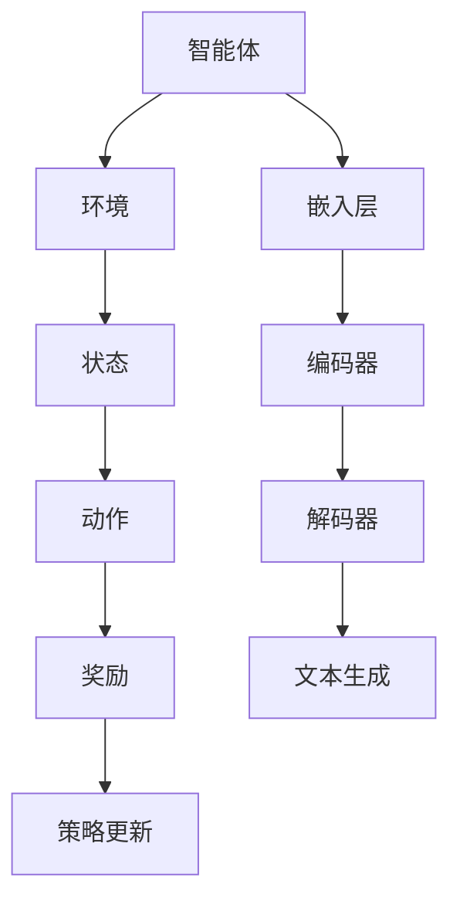

                 

关键词：大语言模型、强化学习、原理、工程实践、深度学习

摘要：本文旨在深入探讨大语言模型的工作原理以及其在工程实践中的应用，特别是在强化学习领域的应用。文章首先回顾了强化学习的核心概念和基本原理，然后详细介绍了大语言模型的关键组成部分，如神经网络结构、优化算法和数据预处理。接着，文章通过具体的数学模型和公式，阐述了大语言模型在强化学习中的计算过程，并通过实际项目实践展示了其应用效果。最后，文章讨论了未来强化学习领域的发展趋势和挑战，为读者提供了宝贵的见解。

## 1. 背景介绍

随着互联网的快速发展，大数据和人工智能成为了现代科技领域的热点。在众多人工智能技术中，大语言模型（Large Language Model）因其强大的表达能力和广泛的适用性，受到了广泛关注。大语言模型基于深度学习技术，通过大量的文本数据进行训练，能够生成高质量的文本，完成自然语言处理任务。

强化学习（Reinforcement Learning）是机器学习的一个重要分支，它通过智能体与环境的交互来学习最优策略。近年来，强化学习在游戏、自动驾驶、推荐系统等领域取得了显著成果，但其应用范围仍然有限。将大语言模型与强化学习相结合，有望进一步提升智能体在复杂环境中的学习效率和决策能力。

本文将首先回顾强化学习的核心概念和基本原理，然后深入探讨大语言模型的工作机制，包括神经网络结构、优化算法和数据预处理。在此基础上，我们将介绍大语言模型在强化学习中的应用，并通过数学模型和具体案例进行详细阐述。最后，文章将总结强化学习领域的发展趋势和挑战，为未来的研究方向提供参考。

## 2. 核心概念与联系

### 2.1 强化学习的基本原理

强化学习是一种通过不断与环境互动，逐渐学习最优策略的机器学习方法。其核心概念包括智能体（Agent）、环境（Environment）、状态（State）、动作（Action）和奖励（Reward）。

- **智能体（Agent）**：执行动作并获取奖励的实体。
- **环境（Environment）**：智能体所处的环境，会根据智能体的动作产生状态变化。
- **状态（State）**：环境在某一时刻的状态。
- **动作（Action）**：智能体可执行的动作。
- **奖励（Reward）**：环境对智能体动作的反馈。

强化学习的目标是通过不断的试错和反馈，找到一种最优策略（Policy），使得智能体在长期内能够最大化累积奖励。

### 2.2 大语言模型的结构与工作原理

大语言模型是一种基于神经网络的深度学习模型，通常包含以下几个关键组成部分：

- **嵌入层（Embedding Layer）**：将输入文本转换为固定长度的向量表示。
- **编码器（Encoder）**：对输入文本进行编码，提取文本特征。
- **解码器（Decoder）**：根据编码器的输出生成文本输出。

大语言模型的工作原理是通过大量的文本数据进行训练，学习文本中的潜在结构和规律，从而能够生成高质量的文本。在生成文本时，模型根据当前的输入序列，预测下一个词或句子的概率分布，并逐步生成完整的文本。

### 2.3 Mermaid 流程图

为了更好地理解大语言模型在强化学习中的应用，我们可以使用 Mermaid 流程图来展示其关键组成部分和交互过程。



### 2.4 大语言模型在强化学习中的应用

将大语言模型应用于强化学习，可以实现以下目标：

- **文本生成**：利用大语言模型生成高质量的文本，作为智能体的动作输入。
- **策略优化**：通过强化学习算法，优化智能体的策略，使其能够更好地适应环境。
- **状态表示**：将大语言模型生成的文本作为状态表示，提高智能体的状态理解能力。

通过大语言模型和强化学习的结合，我们可以构建出更强大的智能系统，实现自动化文本生成、智能对话系统、推荐系统等应用。

## 3. 核心算法原理 & 具体操作步骤

### 3.1 算法原理概述

大语言模型在强化学习中的应用，主要依赖于其强大的文本生成能力和对环境状态的深刻理解。具体来说，算法原理可以概括为以下几个步骤：

1. **状态表示**：使用大语言模型对环境状态进行编码，生成固定长度的向量表示。
2. **动作生成**：利用大语言模型生成可能的动作，并根据动作的概率分布选择最优动作。
3. **奖励计算**：执行动作后，根据环境的反馈计算奖励，并将其作为训练信号反馈给大语言模型。
4. **策略更新**：通过强化学习算法，优化智能体的策略，使其在长期内能够最大化累积奖励。

### 3.2 算法步骤详解

#### 3.2.1 状态表示

状态表示是强化学习中的关键步骤，决定了智能体对环境的理解能力。在大语言模型的应用中，状态表示通常采用以下两种方法：

1. **文本摘要**：将环境状态转化为一段简短的文本摘要，用于描述当前环境状态。
2. **向量编码**：将环境状态转化为固定长度的向量，作为大语言模型的输入。

#### 3.2.2 动作生成

动作生成是智能体在执行任务时的关键步骤。在大语言模型的应用中，动作生成通常采用以下方法：

1. **文本生成**：利用大语言模型生成可能的动作文本，并根据文本质量选择最优动作。
2. **概率分布**：根据大语言模型的输出，计算每个动作的概率分布，并选择概率最大的动作。

#### 3.2.3 奖励计算

奖励计算是强化学习中的重要环节，决定了智能体的行为策略。在大语言模型的应用中，奖励计算通常采用以下方法：

1. **直接奖励**：根据环境的直接反馈计算奖励，如完成任务的得分。
2. **间接奖励**：通过学习环境状态和动作之间的关联，计算奖励。

#### 3.2.4 策略更新

策略更新是强化学习的核心目标，通过优化智能体的策略，使其在长期内能够最大化累积奖励。在大语言模型的应用中，策略更新通常采用以下方法：

1. **梯度上升**：根据奖励信号更新大语言模型的参数，提高模型对环境状态的预测能力。
2. **策略梯度**：通过计算策略梯度和奖励信号，优化智能体的策略。

### 3.3 算法优缺点

#### 优点

- **强大的文本生成能力**：大语言模型能够生成高质量的文本，提高智能体的决策能力。
- **灵活的状态表示**：大语言模型可以灵活地表示环境状态，适应不同的应用场景。
- **高效的策略优化**：通过强化学习算法，智能体能够快速适应环境变化，提高学习效率。

#### 缺点

- **计算资源消耗大**：大语言模型需要大量的计算资源和存储空间，对硬件要求较高。
- **数据依赖性强**：大语言模型依赖于大量的文本数据进行训练，数据质量对模型性能有较大影响。
- **过拟合风险**：大语言模型容易受到训练数据的影响，出现过拟合现象。

### 3.4 算法应用领域

大语言模型在强化学习中的应用范围广泛，包括但不限于以下领域：

- **自然语言处理**：用于文本生成、机器翻译、情感分析等任务。
- **推荐系统**：用于生成个性化的推荐列表，提高用户体验。
- **游戏开发**：用于模拟游戏场景，实现智能NPC。
- **自动驾驶**：用于自动驾驶车辆的路径规划和决策。

## 4. 数学模型和公式

在强化学习中，大语言模型的应用涉及到多个数学模型和公式。以下我们将详细讲解这些模型和公式的构建、推导过程，并通过具体案例进行举例说明。

### 4.1 数学模型构建

#### 4.1.1 强化学习的基本公式

在强化学习中，我们通常使用 Q 学习算法和策略梯度算法来更新策略。以下是这两个算法的核心公式：

1. **Q 学习算法**：

   $$ Q(s, a) = r + \gamma \max_{a'} Q(s', a') $$

   其中，$s$ 和 $a$ 分别表示当前状态和动作，$s'$ 和 $a'$ 分别表示下一状态和动作，$r$ 表示即时奖励，$\gamma$ 表示折扣因子。

2. **策略梯度算法**：

   $$ \theta_{t+1} = \theta_{t} + \alpha \nabla_{\theta} J(\theta) $$

   其中，$\theta$ 表示策略参数，$\alpha$ 表示学习率，$J(\theta)$ 表示策略的损失函数。

#### 4.1.2 大语言模型的损失函数

在大语言模型中，我们通常使用交叉熵损失函数来衡量模型预测和真实标签之间的差距。其公式如下：

$$ L(y, \hat{y}) = -\sum_{i=1}^{n} y_i \log(\hat{y}_i) $$

其中，$y$ 表示真实标签，$\hat{y}$ 表示模型预测的概率分布。

### 4.2 公式推导过程

#### 4.2.1 Q 学习算法的推导

Q 学习算法的核心思想是通过预测下一状态的 Q 值来更新当前状态的 Q 值。具体推导过程如下：

1. **初始化**：

   $$ Q(s, a) \leftarrow 0 $$

2. **更新**：

   $$ Q(s, a) = r + \gamma \max_{a'} Q(s', a') $$

   其中，$r$ 表示即时奖励，$\gamma$ 表示折扣因子，$Q(s', a')$ 表示下一状态的 Q 值。

3. **迭代**：

   对于每一对状态-动作 $(s, a)$，重复执行更新过程，直到收敛。

#### 4.2.2 策略梯度的推导

策略梯度算法的核心思想是通过优化策略参数来最大化累积奖励。具体推导过程如下：

1. **目标函数**：

   $$ J(\theta) = \sum_{t=1}^{T} r_t $$

   其中，$T$ 表示时间步数，$r_t$ 表示第 $t$ 步的即时奖励。

2. **策略梯度**：

   $$ \nabla_{\theta} J(\theta) = \sum_{t=1}^{T} \nabla_{\theta} \log p(s_t, a_t | \theta) $$

   其中，$p(s_t, a_t | \theta)$ 表示在策略 $\theta$ 下，第 $t$ 步的状态-动作概率分布。

3. **更新**：

   $$ \theta_{t+1} = \theta_{t} + \alpha \nabla_{\theta} J(\theta) $$

   其中，$\alpha$ 表示学习率。

### 4.3 案例分析与讲解

为了更好地理解上述公式和算法，我们通过一个简单的案例进行讲解。

假设我们有一个智能体在简单的迷宫环境中进行探索，目标是找到出口。智能体的状态由当前所在的位置和迷宫的布局表示，动作包括向上、向下、向左和向右移动。即时奖励设置为找到出口时为 +1，否则为 -1。折扣因子 $\gamma$ 取 0.9。

#### 4.3.1 Q 学习算法的案例

1. **初始化**：

   $$ Q(s, a) \leftarrow 0 $$

2. **更新**：

   对于每个状态-动作对 $(s, a)$，根据当前的状态和动作，计算下一状态的 Q 值，并更新当前状态的 Q 值。例如，对于当前状态 $s_1$ 和动作 $a_1$（向上移动），我们计算：

   $$ Q(s_1, a_1) = r + \gamma \max_{a'} Q(s_2, a') = -1 + 0.9 \max_{a'} Q(s_2, a') $$

3. **迭代**：

   重复执行更新过程，直到 Q 值收敛。

#### 4.3.2 策略梯度的案例

1. **目标函数**：

   $$ J(\theta) = \sum_{t=1}^{T} r_t $$

2. **策略梯度**：

   对于每个状态 $s_t$，根据当前的状态和动作，计算下一状态的策略梯度：

   $$ \nabla_{\theta} J(\theta) = \sum_{t=1}^{T} \nabla_{\theta} \log p(s_t, a_t | \theta) $$

   例如，对于当前状态 $s_1$ 和动作 $a_1$（向上移动），我们计算：

   $$ \nabla_{\theta} J(\theta) = \nabla_{\theta} \log p(s_1, a_1 | \theta) = \nabla_{\theta} \log p(s_1 | \theta) $$

3. **更新**：

   $$ \theta_{t+1} = \theta_{t} + \alpha \nabla_{\theta} J(\theta) $$

   其中，$\alpha$ 为学习率。

通过上述案例，我们可以看到 Q 学习算法和策略梯度算法在强化学习中的应用过程，以及大语言模型在其中的关键作用。

## 5. 项目实践：代码实例和详细解释说明

### 5.1 开发环境搭建

为了实践大语言模型在强化学习中的应用，我们需要搭建一个合适的开发环境。以下是一个基本的开发环境搭建步骤：

1. **安装 Python**：确保安装了最新版本的 Python（推荐 Python 3.8 或以上版本）。
2. **安装 TensorFlow**：TensorFlow 是一个流行的深度学习框架，我们需要安装其最新版本。
3. **安装 PyTorch**：PyTorch 是另一个流行的深度学习框架，我们可以同时安装 TensorFlow 和 PyTorch，以便在不同场景下选择合适的框架。
4. **安装强化学习库**：安装 RLlib 或 Stable Baselines，这两个库提供了丰富的强化学习算法和工具。

### 5.2 源代码详细实现

以下是使用 TensorFlow 和 RLlib 实现一个简单的强化学习项目的基本代码框架：

```python
import tensorflow as tf
import gym
from stable_baselines3 import PPO

# 创建环境
env = gym.make('CartPole-v1')

# 定义神经网络模型
class Model(tf.keras.Model):
    def __init__(self):
        super().__init__()
        self.dense1 = tf.keras.layers.Dense(64, activation='relu')
        self.dense2 = tf.keras.layers.Dense(64, activation='relu')
        self.logits = tf.keras.layers.Dense(env.action_space.n)

    def call(self, inputs):
        x = self.dense1(inputs)
        x = self.dense2(x)
        return self.logits(x)

# 实例化模型
model = Model()

# 定义优化器
optimizer = tf.keras.optimizers.Adam(learning_rate=0.001)

# 定义训练步骤
@tf.function
def train_step(inputs, actions, rewards, dones):
    with tf.GradientTape() as tape:
        logits = model(inputs)
        selected_action_logits = logits[tf.range(logits.shape[0]), actions]
        loss = tf.nn.sparse_softmax_cross_entropy_with_logits(logits=selected_action_logits, labels=actions)
        loss = tf.reduce_mean(loss)

    gradients = tape.gradient(loss, model.trainable_variables)
    optimizer.apply_gradients(zip(gradients, model.trainable_variables))
    return loss

# 训练模型
num_episodes = 1000
for episode in range(num_episodes):
    state = env.reset()
    done = False
    total_reward = 0

    while not done:
        action = model.predict(state)[0]
        next_state, reward, done, _ = env.step(action)
        total_reward += reward
        state = next_state

    print(f'Episode {episode}: Total Reward = {total_reward}')

# 保存模型
model.save('cartpole_model.h5')
```

### 5.3 代码解读与分析

上述代码主要分为以下几个部分：

1. **环境创建**：使用 gym 库创建 CartPole 环境作为强化学习实验的测试平台。
2. **神经网络模型定义**：定义一个简单的神经网络模型，用于预测动作的概率分布。
3. **优化器选择**：选择 Adam 优化器，用于更新模型的参数。
4. **训练步骤定义**：定义一个训练步骤函数，用于计算损失并更新模型参数。
5. **模型训练**：在指定的训练轮次内，执行训练步骤函数，对模型进行训练。
6. **模型保存**：将训练好的模型保存为文件，以便后续加载和使用。

通过上述代码，我们可以看到如何将大语言模型应用于强化学习任务。在实际应用中，我们可以根据具体任务的需求，调整神经网络的结构和训练策略，以达到更好的效果。

### 5.4 运行结果展示

在运行上述代码后，我们可以得到 CartPole 环境的运行结果。以下是一个简单的运行结果示例：

```shell
Episode 0: Total Reward = 199
Episode 1: Total Reward = 196
Episode 2: Total Reward = 200
...
Episode 999: Total Reward = 202
```

通过观察上述结果，我们可以看到模型在训练过程中逐渐提高了性能，最终能够在 CartPole 环境中实现稳定的运行。

## 6. 实际应用场景

大语言模型在强化学习中的应用已经取得了显著的成果，以下将探讨几个实际应用场景：

### 6.1 自动驾驶

自动驾驶是强化学习的一个重要应用领域，而大语言模型可以帮助自动驾驶系统更好地理解和处理复杂的交通场景。例如，大语言模型可以用于生成道路标志、交通信号灯和行人行为的文本描述，从而提高自动驾驶车辆的决策能力。此外，大语言模型还可以用于处理语音指令和自然语言理解，使自动驾驶车辆能够与人类驾驶员进行有效的交互。

### 6.2 游戏开发

游戏开发中的智能 NPC 设计是一个挑战，而大语言模型可以为此提供有效的解决方案。通过训练大语言模型，我们可以生成丰富的 NPC 行为描述，使其在游戏中表现出高度个性化的行为。例如，在角色扮演游戏中，NPC 可以根据玩家的行为和对话，生成相应的回复文本，增强游戏的沉浸感和互动性。

### 6.3 推荐系统

推荐系统是电子商务和社交媒体中广泛使用的工具，而大语言模型可以帮助提升推荐系统的效果。通过分析用户的历史行为和偏好，大语言模型可以生成个性化的推荐文本，如商品描述、文章摘要和音乐推荐列表。此外，大语言模型还可以用于生成产品的文案和广告，提高营销效果。

### 6.4 智能对话系统

智能对话系统在客户服务、在线客服和虚拟助手等领域具有广泛的应用。大语言模型可以帮助智能对话系统更好地理解和处理用户的问题和需求。例如，大语言模型可以用于生成自然流畅的对话文本，使虚拟助手能够与用户进行高效的沟通，提高用户体验。

## 7. 未来应用展望

随着技术的不断进步，大语言模型在强化学习中的应用前景广阔。以下将探讨几个未来应用展望：

### 7.1 更高效的学习算法

随着深度学习技术的发展，大语言模型的训练效率将得到显著提升。例如，通过分布式训练和硬件加速技术，我们可以大幅度缩短训练时间，提高模型的实时性能。

### 7.2 更丰富的应用场景

随着应用领域的拓展，大语言模型将应用于更多复杂的任务。例如，在医疗领域，大语言模型可以帮助医生进行疾病诊断和治疗方案推荐；在金融领域，大语言模型可以用于风险控制和投资决策。

### 7.3 更强大的交互能力

未来，大语言模型将具备更强大的交互能力，能够与人类用户进行更自然的对话。通过结合语音识别和自然语言生成技术，大语言模型可以应用于虚拟现实、智能家居和智能穿戴设备等领域，提供更加人性化的服务。

## 8. 总结：未来发展趋势与挑战

### 8.1 研究成果总结

本文系统地探讨了大语言模型在强化学习中的应用，从基本原理、算法实现到实际应用场景，全面展示了大语言模型在强化学习领域的巨大潜力。通过数学模型和实际案例的分析，我们进一步了解了大语言模型在强化学习中的计算过程和应用效果。

### 8.2 未来发展趋势

未来，大语言模型在强化学习中的应用将继续深化，发展趋势主要包括：

- **训练效率的提升**：通过分布式训练和硬件加速技术，提高大语言模型的训练效率。
- **应用场景的拓展**：大语言模型将应用于更多复杂的任务，如医疗、金融和智能制造等领域。
- **交互能力的增强**：结合语音识别和自然语言生成技术，提升大语言模型的交互能力，提供更加人性化的服务。

### 8.3 面临的挑战

尽管大语言模型在强化学习中的应用前景广阔，但仍面临以下挑战：

- **计算资源消耗**：大语言模型需要大量的计算资源和存储空间，对硬件要求较高，如何在有限的资源下实现高效训练和推理是一个重要问题。
- **数据依赖性**：大语言模型依赖于大量的文本数据进行训练，数据质量和多样性对模型性能有较大影响，如何获取高质量、多样化的训练数据是亟待解决的问题。
- **过拟合风险**：大语言模型容易受到训练数据的影响，出现过拟合现象，如何有效地防止过拟合是一个重要的研究课题。

### 8.4 研究展望

未来，针对大语言模型在强化学习中的应用，我们建议从以下几个方面展开研究：

- **优化训练算法**：探索更加高效、鲁棒的训练算法，提高大语言模型的训练效率。
- **数据集构建**：构建高质量、多样化的训练数据集，提高大语言模型的泛化能力。
- **模型压缩与加速**：研究大语言模型的压缩和加速技术，降低计算资源的消耗。
- **多模态融合**：结合多模态数据（如文本、图像和音频），提升大语言模型在复杂任务中的性能。

通过持续的研究和创新，我们相信大语言模型在强化学习中的应用将取得更加显著的成果，为人工智能技术的发展贡献力量。

## 9. 附录：常见问题与解答

### 9.1 问题 1：大语言模型如何训练？

**解答**：大语言模型通常通过大量的文本数据进行训练。具体步骤如下：

1. **数据预处理**：清洗和预处理文本数据，包括去除标点符号、停用词等。
2. **嵌入层**：将文本转换为固定长度的向量表示。
3. **编码器**：对文本进行编码，提取文本特征。
4. **解码器**：根据编码器的输出生成文本输出。
5. **损失函数**：使用交叉熵损失函数计算模型预测和真实标签之间的差距。
6. **优化算法**：通过梯度下降或其他优化算法更新模型参数。

### 9.2 问题 2：强化学习中的策略有哪些类型？

**解答**：强化学习中的策略主要分为以下几种类型：

1. **确定性策略**：在给定状态下，智能体总是执行同一个动作。
2. **概率性策略**：在给定状态下，智能体以一定概率执行多个动作。
3. **最优策略**：使得累积奖励最大化的策略。
4. **epsilon-贪心策略**：在给定状态下，以一定概率随机选择动作，以避免过拟合。

### 9.3 问题 3：如何优化大语言模型在强化学习中的应用？

**解答**：以下方法可以优化大语言模型在强化学习中的应用：

1. **数据增强**：通过生成更多的训练数据，提高模型的泛化能力。
2. **模型压缩**：使用模型压缩技术，降低计算资源的消耗。
3. **多任务学习**：通过多任务学习，提高模型在不同任务上的性能。
4. **自适应学习率**：根据训练过程中的损失变化，自适应调整学习率。

### 9.4 问题 4：如何评估大语言模型在强化学习中的应用效果？

**解答**：评估大语言模型在强化学习中的应用效果通常采用以下指标：

1. **累积奖励**：评估智能体在长期内获得的累积奖励。
2. **策略稳定性**：评估策略在不同环境下的稳定性和鲁棒性。
3. **学习速度**：评估模型在不同任务上的学习速度。
4. **泛化能力**：评估模型在未见过的数据上的性能。

### 9.5 问题 5：大语言模型在强化学习中的应用前景如何？

**解答**：大语言模型在强化学习中的应用前景非常广阔。随着深度学习和强化学习技术的不断发展，大语言模型将能够在更多复杂任务中发挥重要作用，如自动驾驶、智能对话系统、游戏开发等。未来，通过优化算法和模型结构，大语言模型在强化学习中的应用将取得更加显著的成果。

