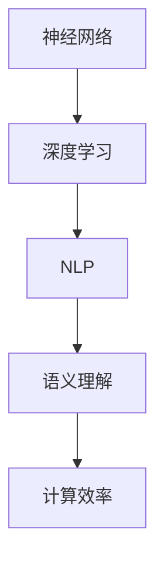

                 

关键词：大语言模型，推理，行动协同，工程实践，AI编程，神经网络，深度学习，自然语言处理，语义理解，计算效率。

> 摘要：本文将深入探讨大语言模型的原理与工程实践，特别是推理和行动协同技术。我们将从背景介绍、核心概念与联系、核心算法原理与操作步骤、数学模型和公式、项目实践、实际应用场景、工具和资源推荐、总结未来发展趋势与挑战等方面展开，旨在为广大AI开发者和研究者提供全面而深入的指导。

## 1. 背景介绍

大语言模型（Large Language Model，LLM）是近年来人工智能领域的重要突破。它们能够理解、生成和模拟人类语言，已经广泛应用于自然语言处理（NLP）的各个子领域，如机器翻译、问答系统、文本生成等。大语言模型的崛起，得益于深度学习技术的迅猛发展，特别是神经网络在处理复杂数据方面的巨大优势。

然而，随着模型的规模和复杂性不断增加，如何提高推理效率、降低计算成本成为了一个关键问题。传统的推理方法在处理大规模模型时往往效率低下，甚至无法实时响应。因此，研究高效的推理和行动协同技术，对于大语言模型的应用至关重要。

本文将围绕这一主题，首先介绍大语言模型的基本原理和核心概念，然后深入探讨推理和行动协同技术的具体实现，最后通过实际项目和实践案例，展示这些技术在现实中的应用效果。

## 2. 核心概念与联系

为了更好地理解大语言模型的原理和工程实践，我们首先需要了解一些核心概念和它们之间的联系。以下是几个关键概念：

### 2.1 神经网络

神经网络（Neural Networks，NN）是模仿人脑神经元连接方式的计算模型。在深度学习中，神经网络通过层层叠加的隐藏层，对输入数据进行特征提取和模式识别。在处理语言数据时，神经网络能够捕捉到词汇、句子和段落级别的语义信息。

### 2.2 深度学习

深度学习（Deep Learning，DL）是神经网络的一种特殊形式，它利用多层神经网络进行特征学习和模式识别。深度学习在大语言模型中的应用，使得模型能够自动学习到语言中的复杂结构和语义信息。

### 2.3 自然语言处理

自然语言处理（Natural Language Processing，NLP）是人工智能的一个子领域，它涉及对人类语言的计算机处理和分析。NLP的核心任务是使计算机能够理解和生成人类语言，从而实现人机交互。

### 2.4 语义理解

语义理解（Semantic Understanding）是NLP中的一个关键问题，它旨在使计算机能够理解文本中的语义含义。语义理解对于构建智能问答系统、文本生成等应用至关重要。

### 2.5 计算效率

计算效率（Computational Efficiency）是评估大语言模型性能的一个重要指标。高效的推理算法能够在保证模型准确性的同时，降低计算资源和时间成本。

为了更好地展示这些概念之间的联系，我们使用Mermaid流程图进行说明。



## 3. 核心算法原理 & 具体操作步骤

### 3.1 算法原理概述

大语言模型的核心算法是基于自注意力机制（Self-Attention Mechanism）的变换器模型（Transformer）。变换器模型通过多头注意力机制和位置编码，实现了对输入文本序列的并行处理，从而提高了计算效率。

### 3.2 算法步骤详解

1. **输入预处理**：对输入的文本进行分词和编码，生成词向量表示。

2. **编码层**：通过多层编码器（Encoder）对词向量进行处理，编码器中的每个层都包含多头注意力机制和前馈神经网络。

3. **解码层**：在生成输出时，解码器（Decoder）通过自注意力机制和交叉注意力机制，结合编码器的输出和已生成的文本进行预测。

4. **输出生成**：解码器根据输入的文本和编码器的输出，逐个生成预测的词，直到生成完整的输出序列。

### 3.3 算法优缺点

**优点**：
- 高效的并行处理能力，适用于大规模文本数据处理。
- 强大的语义理解能力，能够捕捉到文本中的复杂结构和含义。

**缺点**：
- 计算成本较高，特别是在训练阶段。
- 对位置信息处理不够精细，容易丢失上下文关系。

### 3.4 算法应用领域

大语言模型在自然语言处理领域有着广泛的应用，包括但不限于：

- **机器翻译**：如Google翻译、百度翻译等。
- **智能问答系统**：如ChatGPT、Doocs等。
- **文本生成**：如文章写作、摘要生成等。
- **语音识别**：结合语音识别技术，实现语音到文本的转换。

## 4. 数学模型和公式

大语言模型的数学模型主要包括词向量表示、自注意力机制和位置编码。以下是这些数学模型的具体解释和公式。

### 4.1 词向量表示

词向量表示是将文本中的词语映射到高维空间中的向量表示。常用的词向量模型有Word2Vec、GloVe等。

- **Word2Vec**：

  $$ \text{vec}(w) = \frac{1}{|\text{context}(w)|} \sum_{c \in \text{context}(w)} \text{vec}(c) $$

- **GloVe**：

  $$ \text{vec}(w) = \text{softmax}\left( \frac{\text{X}_w \text{X}_c^T}{\sqrt{|\text{X}_w|} \sqrt{|\text{X}_c|}} \right) $$

### 4.2 自注意力机制

自注意力机制是变换器模型中的一个核心组件，它通过计算输入文本序列中每个词与所有其他词的相关性，生成权重矩阵，从而实现并行处理。

$$ \text{Attention}(Q, K, V) = \text{softmax}\left( \frac{QK^T}{\sqrt{d_k}} \right) V $$

### 4.3 位置编码

位置编码是自注意力机制中的一个关键部分，它为输入文本序列中的每个词赋予位置信息。

$$ \text{pos}_i = \text{sin}\left( \frac{pos_i}{10000^{2i/d}} \right) $$
$$ \text{pos}_i = \text{cos}\left( \frac{pos_i}{10000^{2i/d}} \right) $$

其中，$pos_i$ 表示第 $i$ 个词的位置编码，$d$ 表示编码维度。

### 4.4 案例分析与讲解

以一个简单的文本生成任务为例，说明大语言模型的工作流程。

1. **输入预处理**：将输入文本“今天天气很好”进行分词和编码。

2. **编码层**：通过多层编码器对词向量进行处理，生成编码输出。

3. **解码层**：在生成输出时，解码器根据输入的编码输出和已生成的文本，逐个生成预测的词。

4. **输出生成**：解码器最终生成完整的输出文本“今天天气很好，适合户外活动”。

通过这个简单的案例，我们可以看到大语言模型在文本生成任务中的工作流程。在实际应用中，大语言模型需要处理更复杂的输入和输出，但基本原理是类似的。

## 5. 项目实践：代码实例和详细解释说明

在本节中，我们将通过一个简单的项目实践，展示大语言模型的实际应用。该项目将使用Python和Hugging Face的Transformers库，实现一个简单的文本生成任务。

### 5.1 开发环境搭建

1. 安装Python环境（建议使用Python 3.8及以上版本）。
2. 安装Hugging Face的Transformers库：

   ```bash
   pip install transformers
   ```

### 5.2 源代码详细实现

```python
from transformers import AutoTokenizer, AutoModelForCausalLM
import torch

# 1. 加载预训练模型和分词器
tokenizer = AutoTokenizer.from_pretrained("gpt2")
model = AutoModelForCausalLM.from_pretrained("gpt2")

# 2. 输入文本预处理
input_text = "今天天气很好。"

# 3. 将输入文本编码为词向量
input_ids = tokenizer.encode(input_text, return_tensors="pt")

# 4. 生成输出文本
output = model.generate(input_ids, max_length=50, num_return_sequences=1)

# 5. 解码输出文本
decoded_output = tokenizer.decode(output[0], skip_special_tokens=True)

print(decoded_output)
```

### 5.3 代码解读与分析

- **步骤1**：加载预训练模型和分词器。这里我们使用的是GPT-2模型，这是一个广泛使用的预训练语言模型。
- **步骤2**：对输入文本进行预处理，包括分词和编码。
- **步骤3**：将输入文本编码为词向量，输入到模型中。
- **步骤4**：使用模型生成输出文本。这里我们设置了最大生成长度为50，并生成1个输出序列。
- **步骤5**：将生成的输出文本解码为可读的字符串。

通过这个简单的项目实践，我们可以看到大语言模型在实际应用中的基本流程。在实际开发中，我们可以根据具体需求，调整模型的参数和生成策略，实现更复杂的文本生成任务。

## 6. 实际应用场景

大语言模型在实际应用中有着广泛的应用场景，以下列举几个典型场景：

### 6.1 智能问答系统

智能问答系统是自然语言处理领域的一个重要应用。通过大语言模型，系统能够理解用户的提问，并生成准确的回答。例如，智能客服、智能助手等。

### 6.2 文本生成

文本生成是另一个重要的应用场景，包括文章写作、摘要生成、故事创作等。通过大语言模型，可以自动生成高质量的文章和故事，降低人力成本。

### 6.3 机器翻译

大语言模型在机器翻译中的应用也非常广泛。通过训练多语言模型，可以实现高效、准确的跨语言翻译。

### 6.4 语音识别

大语言模型结合语音识别技术，可以实现语音到文本的转换。这为语音助手、智能音箱等提供了技术支持。

### 6.5 情感分析

情感分析是NLP中的一个重要任务。通过大语言模型，可以自动识别文本中的情感倾向，为舆情分析、情感监测等提供支持。

### 6.6 文本分类

文本分类是NLP中的一个基础任务。大语言模型可以自动对文本进行分类，应用于新闻分类、邮件过滤等场景。

## 7. 工具和资源推荐

为了更好地学习和实践大语言模型，以下是一些推荐的工具和资源：

### 7.1 学习资源推荐

- **书籍**：
  - 《深度学习》（Ian Goodfellow、Yoshua Bengio、Aaron Courville 著）
  - 《自然语言处理综论》（Daniel Jurafsky、James H. Martin 著）
- **在线课程**：
  - 吴恩达的《深度学习专项课程》（Coursera）
  - 斯坦福大学的《自然语言处理与深度学习》（edX）

### 7.2 开发工具推荐

- **Python库**：
  - Transformers（Hugging Face）
  - NLTK
  - spaCy
- **框架**：
  - TensorFlow
  - PyTorch
  - Keras

### 7.3 相关论文推荐

- **GPT系列**：
  - "Attention Is All You Need"（Vaswani et al., 2017）
  - "Improving Language Understanding by Generative Pre-Training"（Radford et al., 2018）
- **BERT系列**：
  - "BERT: Pre-training of Deep Bidirectional Transformers for Language Understanding"（Devlin et al., 2019）
  - "Robustly Optimized BERT Pretraining Approaches"（Liu et al., 2019）

## 8. 总结：未来发展趋势与挑战

大语言模型在自然语言处理领域取得了显著的成果，但仍面临着一些挑战和未来发展趋势：

### 8.1 研究成果总结

- 大语言模型在语义理解、文本生成、机器翻译等任务中取得了优异的性能。
- 开源模型和预训练技术使得大语言模型的应用成本大幅降低。
- 计算效率和推理算法的研究取得了一定的进展。

### 8.2 未来发展趋势

- 模型规模和复杂度将继续增加，推动性能和效率的提升。
- 多模态融合将成为一个重要方向，实现文本、图像、声音等多种数据的协同处理。
- 自动化训练和优化技术将进一步提高模型的开发效率。

### 8.3 面临的挑战

- 计算资源和能耗的消耗仍是一个关键问题。
- 模型的可靠性和鲁棒性有待提高，特别是在处理低质量数据和对抗样本时。
- 模型的可解释性和透明度需要进一步研究。

### 8.4 研究展望

- 探索新的模型架构和优化方法，提高计算效率和模型性能。
- 加强对多模态数据的处理和研究，推动跨领域的应用发展。
- 深入研究模型的解释性和透明度，提高模型的可靠性和信任度。

## 9. 附录：常见问题与解答

### 9.1 大语言模型与传统的自然语言处理技术有何区别？

大语言模型与传统NLP技术的区别主要体现在以下几个方面：

- **数据处理方式**：大语言模型采用端到端的方式处理文本数据，而传统NLP技术通常需要先进行分词、词性标注等预处理步骤。
- **语义理解能力**：大语言模型通过自注意力机制和位置编码，能够更好地捕捉文本中的语义信息和上下文关系。
- **训练和推理效率**：大语言模型采用并行计算的方式，提高了训练和推理的效率。

### 9.2 大语言模型的计算资源需求如何？

大语言模型的计算资源需求取决于模型的规模和复杂度。通常，预训练阶段需要大量的计算资源和时间。在实际应用中，推理阶段的计算资源需求相对较小，但仍然需要较高的计算能力。

### 9.3 大语言模型在工业界有哪些应用场景？

大语言模型在工业界有着广泛的应用场景，包括但不限于：

- **智能问答系统**：应用于智能客服、智能助手等场景。
- **文本生成**：应用于文章写作、摘要生成、故事创作等。
- **机器翻译**：应用于跨语言翻译和本地化服务。
- **语音识别**：结合语音识别技术，实现语音到文本的转换。
- **情感分析**：应用于舆情分析、情感监测等。

### 9.4 如何优化大语言模型的推理效率？

优化大语言模型的推理效率可以从以下几个方面进行：

- **模型压缩**：采用模型压缩技术，如量化、剪枝等，减小模型的规模和计算量。
- **硬件加速**：利用GPU、TPU等硬件加速技术，提高模型的推理速度。
- **推理优化**：采用优化算法，如动态调度、并行计算等，提高推理效率。

作者：禅与计算机程序设计艺术 / Zen and the Art of Computer Programming

