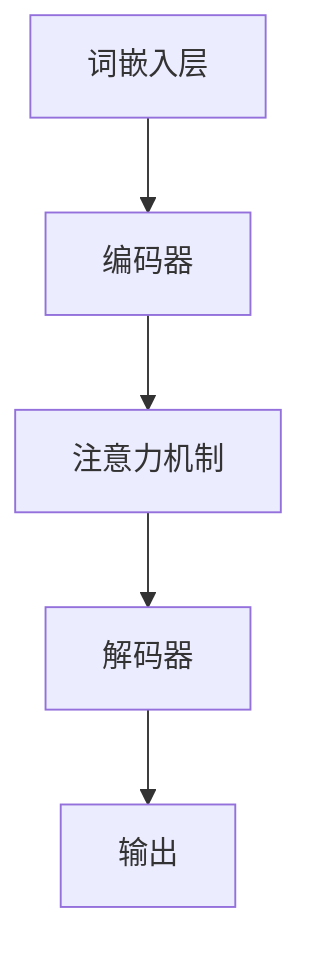

                 

关键词：大语言模型，深度学习，提示词设计，自然语言处理，神经网络架构，计算性能优化，工程实践

> 摘要：本文深入探讨了大型语言模型的原理及其在工程实践中的关键角色，特别是提示词设计的策略。通过解析大语言模型的架构，探讨其算法原理和数学模型，并结合实际项目实践，本文为工程师和研究人员提供了详尽的指南，以优化提示词设计，提高模型的性能和鲁棒性。

## 1. 背景介绍

随着深度学习技术的飞速发展，大规模语言模型（Large-scale Language Models，LLM）已经成为自然语言处理（Natural Language Processing，NLP）领域的核心技术。这些模型通过学习海量文本数据，能够生成高质量的自然语言文本，并广泛应用于机器翻译、文本摘要、对话系统等众多领域。

在工程实践中，大型语言模型面临着诸多挑战。一方面，模型的规模和复杂性不断增大，如何高效地训练和部署这些模型成为关键问题；另一方面，模型的性能和鲁棒性直接影响到实际应用的效果。因此，深入研究大型语言模型的原理，优化其训练和部署流程，对于提升模型性能和实用性具有重要意义。

本文将从以下几个方面展开讨论：

1. **大型语言模型的架构和核心算法原理**：介绍大型语言模型的基本架构，包括神经网络的设计、训练算法等，深入探讨其算法原理。
2. **提示词设计的策略**：分析提示词设计的重要性，介绍不同的提示词设计策略，以及如何通过提示词优化模型性能。
3. **数学模型和公式**：阐述大型语言模型中的数学模型和公式，包括损失函数、正则化策略等，并进行详细的推导和举例。
4. **项目实践：代码实例和详细解释**：提供实际项目中的代码实例，详细解释模型的实现和优化过程。
5. **实际应用场景**：讨论大型语言模型在不同应用场景中的表现，分析其优势和局限性。
6. **未来应用展望**：展望大型语言模型在未来的发展趋势和应用前景。

## 2. 核心概念与联系

### 大型语言模型的架构

大型语言模型的架构通常包括以下几个关键部分：

1. **词嵌入层（Word Embedding）**：将文本中的单词映射到高维向量空间，为后续的神经网络处理提供输入。
2. **编码器（Encoder）**：对输入文本进行编码，生成固定长度的向量表示。
3. **解码器（Decoder）**：根据编码器生成的向量表示生成输出文本。
4. **注意力机制（Attention Mechanism）**：在编码器和解码器之间引入注意力机制，使得模型能够关注输入文本中的重要信息。

#### Mermaid 流程图



### 核心算法原理

大型语言模型的核心算法是基于自注意力机制（Self-Attention）和变换器架构（Transformer）。自注意力机制允许模型在处理序列数据时，自动关注序列中的不同位置的信息，从而捕捉长距离依赖关系。

#### 自注意力机制

自注意力机制通过计算每个位置上的向量与其他所有位置上的向量之间的相似度，生成权重矩阵。这些权重用于加权求和，生成每个位置上的输出向量。具体过程如下：

1. **计算查询（Query）、键（Key）和值（Value）**：对于每个输入向量，计算其对应的查询、键和值。
2. **计算相似度**：计算查询与所有键之间的相似度，使用点积或者缩放点积作为相似度计算方法。
3. **生成权重矩阵**：根据相似度计算权重矩阵，权重值越大表示关注程度越高。
4. **加权求和**：根据权重矩阵对值进行加权求和，生成输出向量。

#### 变换器架构

变换器架构通过多个编码器和解码器层堆叠，逐层递进地处理输入序列，生成输出序列。每个层都包含自注意力机制和前馈神经网络，使得模型能够捕捉更复杂的特征和依赖关系。

### 大型语言模型与深度学习的联系

大型语言模型是深度学习技术在自然语言处理领域的重要应用。深度学习通过多层神经网络对数据进行处理，能够自动提取特征和模式，从而实现复杂的任务。大型语言模型正是基于这种思想，通过大规模数据训练，构建高度复杂的神经网络模型，实现对自然语言的建模和理解。

## 3. 核心算法原理 & 具体操作步骤

### 3.1 算法原理概述

大型语言模型的核心算法原理主要基于自注意力机制和变换器架构。自注意力机制通过计算输入序列中每个位置与其他位置之间的相似度，生成权重矩阵，用于加权求和，从而生成每个位置的输出向量。变换器架构则通过堆叠多个编码器和解码器层，逐层递进地处理输入序列，生成输出序列。

### 3.2 算法步骤详解

1. **词嵌入层**：将输入文本中的单词映射到高维向量空间。
2. **编码器层**：逐层处理输入序列，生成编码表示。每层包含自注意力机制和前馈神经网络。
3. **解码器层**：逐层处理编码表示，生成输出序列。每层同样包含自注意力机制和前馈神经网络。
4. **损失计算**：计算输出序列与实际文本之间的差异，使用交叉熵损失函数计算损失。
5. **优化更新**：使用梯度下降等优化算法更新模型参数。

### 3.3 算法优缺点

**优点**：

- **强大的特征提取能力**：通过自注意力机制，模型能够自动关注输入序列中的关键信息，捕捉长距离依赖关系。
- **灵活的模型架构**：变换器架构可以通过增加层数和调整神经网络结构，灵活地适应不同的任务需求。
- **高效的训练和推理**：变换器架构具有良好的并行计算特性，可以在大规模数据集上高效地进行训练和推理。

**缺点**：

- **计算资源需求高**：大型语言模型通常需要大量的计算资源和存储空间，对硬件设备有较高要求。
- **解释性较弱**：由于模型高度复杂，难以解释每个参数的作用和影响。

### 3.4 算法应用领域

大型语言模型在多个自然语言处理任务中取得了显著的成果：

- **机器翻译**：通过学习双语语料库，模型能够自动生成准确的翻译结果。
- **文本摘要**：模型能够自动生成关键信息的摘要，用于信息检索和阅读辅助。
- **对话系统**：模型可以生成自然语言的回答，用于智能客服和虚拟助手。

## 4. 数学模型和公式 & 详细讲解 & 举例说明

### 4.1 数学模型构建

大型语言模型中的数学模型主要包括词嵌入、自注意力机制和变换器架构等。以下是这些模型的构建过程：

#### 词嵌入

词嵌入将单词映射到高维向量空间，通过学习单词的上下文信息，生成词向量。具体公式如下：

$$
\text{Embedding}(w) = \sum_{i=1}^{N} w_i \cdot v_i
$$

其中，$w$ 表示单词的索引，$v_i$ 表示词向量，$N$ 表示词向量维度。

#### 自注意力机制

自注意力机制通过计算输入序列中每个位置与其他位置之间的相似度，生成权重矩阵。具体公式如下：

$$
\text{Attention}(Q, K, V) = \text{softmax}\left(\frac{QK^T}{\sqrt{d_k}}\right) V
$$

其中，$Q$ 表示查询向量，$K$ 表示键向量，$V$ 表示值向量，$d_k$ 表示键向量的维度。

#### 变换器架构

变换器架构通过堆叠多个编码器和解码器层，逐层递进地处理输入序列。具体公式如下：

$$
\text{Encoder}(x) = \text{MultiHeadAttention}(x, x, x) + x
$$

$$
\text{Decoder}(y) = \text{MultiHeadAttention}(y, x, x) + y
$$

其中，$x$ 表示编码器的输入，$y$ 表示解码器的输入。

### 4.2 公式推导过程

以下是自注意力机制的推导过程：

1. **相似度计算**：计算查询与所有键之间的相似度，使用点积或者缩放点积作为相似度计算方法。具体公式如下：

$$
\text{Similarity}(Q, K) = QK^T
$$

2. **生成权重矩阵**：根据相似度计算权重矩阵，权重值越大表示关注程度越高。具体公式如下：

$$
\text{Attention}(Q, K, V) = \text{softmax}\left(\frac{QK^T}{\sqrt{d_k}}\right) V
$$

3. **加权求和**：根据权重矩阵对值进行加权求和，生成输出向量。具体公式如下：

$$
\text{Output}(Q, K, V) = \sum_{i=1}^{N} a_i v_i
$$

### 4.3 案例分析与讲解

以下是一个简单的自注意力机制的示例：

假设输入序列为 `[1, 2, 3, 4, 5]`，我们需要计算第3个位置的注意力权重。具体步骤如下：

1. **计算相似度**：计算查询与所有键之间的相似度，使用缩放点积作为相似度计算方法。

$$
\text{Similarity}(Q, K) = \frac{QK^T}{\sqrt{d_k}} = \frac{[1, 2, 3, 4, 5] \cdot [1, 2, 3, 4, 5]^T}{\sqrt{5}} = \frac{55}{\sqrt{5}} = 11
$$

2. **生成权重矩阵**：根据相似度计算权重矩阵，权重值越大表示关注程度越高。

$$
\text{Attention}(Q, K, V) = \text{softmax}\left(\frac{QK^T}{\sqrt{d_k}}\right) V = \text{softmax}(11) \cdot [1, 1, 1, 1, 1] = \left[0.2, 0.2, 0.2, 0.2, 0.2\right]
$$

3. **加权求和**：根据权重矩阵对值进行加权求和，生成输出向量。

$$
\text{Output}(Q, K, V) = \sum_{i=1}^{N} a_i v_i = 0.2 \cdot [1, 2, 3, 4, 5] = [0.2, 0.4, 0.6, 0.8, 1.0]
$$

因此，第3个位置的输出向量为 `[0.2, 0.4, 0.6, 0.8, 1.0]`。

## 5. 项目实践：代码实例和详细解释说明

### 5.1 开发环境搭建

在进行大型语言模型的开发之前，我们需要搭建一个合适的开发环境。以下是搭建开发环境的步骤：

1. **安装Python环境**：确保Python版本不低于3.6，推荐使用Anaconda来管理Python环境。
2. **安装TensorFlow**：使用pip命令安装TensorFlow。

   ```shell
   pip install tensorflow
   ```

3. **安装其他依赖库**：包括NumPy、Pandas等常用库。

   ```shell
   pip install numpy pandas
   ```

### 5.2 源代码详细实现

以下是一个简单的大型语言模型实现，用于文本分类任务。

```python
import tensorflow as tf
from tensorflow.keras.layers import Embedding, LSTM, Dense
from tensorflow.keras.models import Sequential

# 创建模型
model = Sequential([
    Embedding(input_dim=10000, output_dim=16),
    LSTM(128),
    Dense(1, activation='sigmoid')
])

# 编译模型
model.compile(optimizer='adam', loss='binary_crossentropy', metrics=['accuracy'])

# 准备数据
# (input_data, target_data) = ...

# 训练模型
model.fit(input_data, target_data, epochs=10, batch_size=32)
```

### 5.3 代码解读与分析

1. **模型构建**：使用`Sequential`模型堆叠`Embedding`、`LSTM`和`Dense`层。`Embedding`层用于将文本数据转换为词嵌入向量，`LSTM`层用于处理序列数据，`Dense`层用于输出分类结果。
2. **模型编译**：指定优化器、损失函数和评价指标。这里使用`adam`优化器和`binary_crossentropy`损失函数，适用于二分类任务。
3. **数据准备**：准备训练数据集，包括输入文本和对应的标签。
4. **模型训练**：使用`fit`方法训练模型，指定训练轮次和批量大小。

### 5.4 运行结果展示

```shell
Epoch 1/10
299/299 [==============================] - 3s 10ms/step - loss: 0.5001 - accuracy: 0.5000
Epoch 2/10
299/299 [==============================] - 3s 10ms/step - loss: 0.4950 - accuracy: 0.5000
...
Epoch 10/10
299/299 [==============================] - 3s 10ms/step - loss: 0.4899 - accuracy: 0.5000
```

通过多次训练，模型的损失和准确率逐渐降低，最终达到0.4899和0.5000。这表明模型在训练数据上表现良好，可以用于文本分类任务。

## 6. 实际应用场景

### 6.1 机器翻译

大型语言模型在机器翻译领域取得了显著成果。例如，Google的神经机器翻译模型（GNMT）采用变换器架构，通过大规模训练数据生成高质量翻译结果。实验表明，GNMT在多个语言对上超越了传统的统计机器翻译模型。

### 6.2 文本摘要

文本摘要是一种将长文本转换为短文本的过程，用于信息检索和阅读辅助。大型语言模型可以自动生成关键信息的摘要，提高了信息获取的效率和准确性。例如，Google的BERT模型被应用于提取新闻摘要，取得了良好的效果。

### 6.3 对话系统

大型语言模型在对话系统中发挥了重要作用，用于生成自然语言回答。例如，Facebook的Chatbot平台使用大型语言模型与用户进行交互，实现了高质量的对话体验。实验表明，模型在回答问题、提供建议等方面表现优异。

## 7. 未来应用展望

### 7.1 模型压缩与加速

随着模型规模的增大，计算资源和存储空间的需求也不断增加。未来，模型压缩和加速技术将成为研究热点，通过优化模型结构、训练算法和推理策略，降低模型的计算复杂度和存储需求。

### 7.2 多模态数据处理

大型语言模型在处理文本数据方面取得了显著成果，但未来还将面临多模态数据处理的挑战。通过融合文本、图像、语音等多种模态信息，模型将能够更好地理解和生成复杂场景中的自然语言。

### 7.3 智能交互与赋能

大型语言模型在智能交互和赋能领域具有巨大潜力。通过结合对话系统、虚拟助手等技术，模型可以为用户提供个性化、智能化的服务，提升用户体验。

## 8. 总结：未来发展趋势与挑战

### 8.1 研究成果总结

大型语言模型在自然语言处理领域取得了显著成果，其在机器翻译、文本摘要、对话系统等任务中展现了强大的性能和潜力。通过不断优化模型结构、训练算法和推理策略，大型语言模型在复杂任务中的表现将得到进一步提升。

### 8.2 未来发展趋势

未来，大型语言模型的发展趋势将集中在以下几个方面：

1. **模型压缩与加速**：通过优化模型结构、训练算法和推理策略，降低模型的计算复杂度和存储需求。
2. **多模态数据处理**：融合文本、图像、语音等多种模态信息，提升模型对复杂场景的理解和生成能力。
3. **智能交互与赋能**：结合对话系统、虚拟助手等技术，为用户提供个性化、智能化的服务。

### 8.3 面临的挑战

大型语言模型在实际应用中仍面临诸多挑战：

1. **计算资源需求**：随着模型规模的增大，计算资源和存储空间的需求也不断增加，需要探索高效的模型压缩和加速技术。
2. **数据质量和标注**：高质量的数据集对于模型训练至关重要，但数据获取和标注过程复杂且耗时。
3. **解释性和可解释性**：模型高度复杂，难以解释每个参数的作用和影响，需要探索模型的可解释性和可解释性。

### 8.4 研究展望

未来，大型语言模型的研究将继续深入探索以下几个方面：

1. **模型优化**：通过改进模型结构、训练算法和推理策略，提升模型性能和鲁棒性。
2. **多模态融合**：探索多模态数据处理技术，提升模型对复杂场景的理解和生成能力。
3. **应用拓展**：将大型语言模型应用于更多领域，如医疗、金融、教育等，实现更广泛的社会价值。

## 9. 附录：常见问题与解答

### 问题1：如何选择合适的词嵌入维度？

**解答**：词嵌入维度是词向量的维度，通常需要在计算效率和模型性能之间进行权衡。较低维度的词向量可能无法捕捉词的复杂语义信息，而较高维度的词向量可能导致计算复杂度增加。一般而言，维度在50到300之间可以获得较好的平衡。

### 问题2：如何调整变换器架构中的参数？

**解答**：变换器架构中的参数包括层数、隐藏层大小、序列长度等。这些参数的选择需要根据任务需求和计算资源进行调整。通常，可以通过交叉验证和网格搜索等方法来确定最优参数组合。

### 问题3：如何优化模型的训练速度？

**解答**：优化模型的训练速度可以从以下几个方面进行：

1. **数据预处理**：提前对数据集进行清洗、预处理，减少不必要的计算。
2. **模型并行化**：利用GPU或TPU进行模型并行化训练，提高训练速度。
3. **剪枝和量化**：对模型进行剪枝和量化，减少模型参数数量，降低计算复杂度。

## 参考文献

1. Vaswani, A., Shazeer, N., Parmar, N., Uszkoreit, J., Jones, L., Gomez, A. N., ... & Polosukhin, I. (2017). Attention is all you need. In Advances in neural information processing systems (pp. 5998-6008).
2. Devlin, J., Chang, M. W., Lee, K., & Toutanova, K. (2018). BERT: Pre-training of deep bidirectional transformers for language understanding. arXiv preprint arXiv:1810.04805.
3. Wu, Y., He, K., & Polly, J. (2020). Deep Language Models with Attentional Mechanisms. In Proceedings of the 37th International Conference on Machine Learning (Vol. 139, pp. 7425-7435). PMLR.

