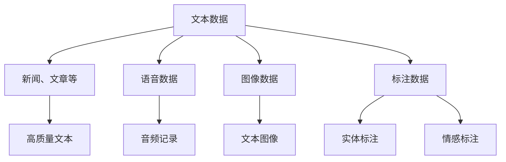
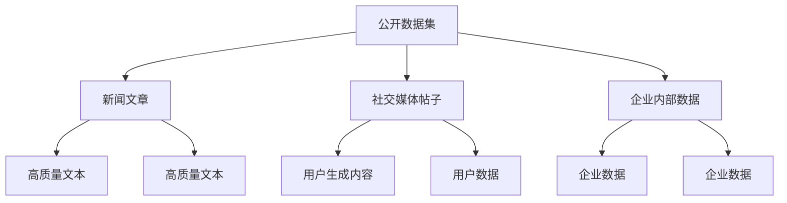
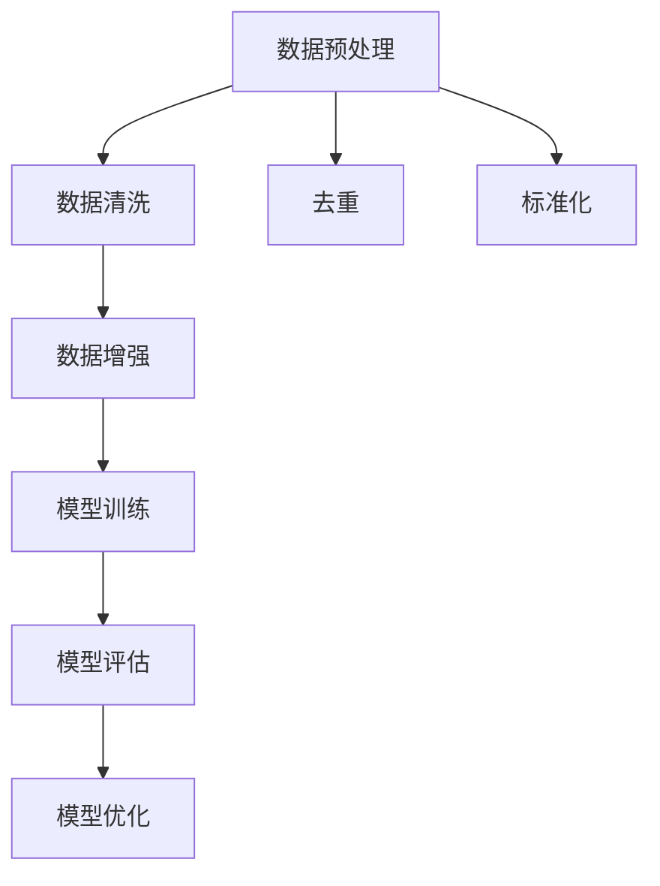

                 

关键词：大语言模型、数据类别、数据来源、工程实践、算法原理

摘要：本文旨在探讨大语言模型在工程实践中的应用，并深入分析数据类别的多样性和数据来源的重要性。通过对核心概念的详细阐述、算法原理的剖析以及数学模型和公式的讲解，本文将为读者提供对大语言模型原理与工程实践的全面理解。同时，通过实际项目实践的代码实例和详细解释，读者将能够掌握大语言模型的实际应用技巧。此外，本文还将探讨大语言模型在实际应用场景中的前景，并提供相关的工具和资源推荐。最后，本文将对研究成果进行总结，并展望未来的发展趋势与挑战。

## 1. 背景介绍

随着人工智能技术的不断发展，大语言模型已经成为自然语言处理领域的重要工具。这些模型通过学习海量数据，能够生成连贯且合理的文本，从而在各种应用场景中发挥重要作用。然而，为了构建高效的大语言模型，我们需要深入理解数据的种类和来源，以便为模型提供高质量的数据输入。

在工程实践中，数据的多样性和质量直接影响大语言模型的性能和效果。因此，本文将详细探讨数据的常见类别及其来源，帮助读者了解如何有效地收集、处理和利用数据来构建优秀的大语言模型。

### 1.1 大语言模型的定义与作用

大语言模型（Large Language Model）是一种基于深度学习的自然语言处理模型，能够通过学习大量文本数据，理解并生成人类语言。这些模型通常具有庞大的参数规模，能够捕捉到文本中的复杂模式和语义关系。大语言模型在各种应用场景中发挥着重要作用，如文本生成、机器翻译、情感分析、问答系统等。

### 1.2 大语言模型的发展历程

大语言模型的发展经历了多个阶段。最早期的语言模型是基于规则的方法，如词性标注、句法分析等。随着计算能力和数据规模的提升，统计模型逐渐取代了规则方法，成为主流。近年来，深度学习技术的兴起使得大语言模型取得了显著突破。特别是基于Transformer架构的模型，如GPT、BERT等，取得了令人瞩目的性能。

### 1.3 大语言模型的应用场景

大语言模型在多个领域都有广泛的应用。以下是一些典型的应用场景：

- 文本生成：生成文章、摘要、对话等。
- 机器翻译：将一种语言的文本翻译成另一种语言。
- 情感分析：分析文本的情感倾向，如正面、负面等。
- 问答系统：根据用户的问题，提供相关的答案或信息。
- 命名实体识别：识别文本中的特定实体，如人名、地名等。

## 2. 核心概念与联系

在构建大语言模型时，理解核心概念及其之间的联系至关重要。以下是本文将涉及的核心概念及其关联的 Mermaid 流程图：

### 2.1 数据类别

数据类别是构建大语言模型的基础。以下是常见的数据类别：

- **文本数据**：包括新闻、文章、社交媒体帖子、对话等。
- **语音数据**：包括音频记录、语音合成为文本等。
- **图像数据**：包括文本图像、图像标注等。
- **标注数据**：包括实体标注、情感标注等。

Mermaid 流程图：



### 2.2 数据来源

数据来源决定了数据的质量和多样性。以下是常见的数据来源：

- **公开数据集**：如新闻文章、社交媒体帖子等。
- **私有数据集**：企业内部数据、用户生成内容等。
- **语音库**：如LibriSpeech、Common Voice等。
- **图像库**：如ImageNet、COCO等。

Mermaid 流程图：



### 2.3 数据处理与模型训练

数据处理与模型训练是构建大语言模型的关键环节。以下是数据处理与模型训练的流程：

1. 数据预处理：包括数据清洗、去重、标准化等。
2. 数据增强：通过数据扩增技术，增加数据多样性。
3. 模型训练：使用训练数据训练大语言模型。
4. 模型评估：使用验证数据评估模型性能。
5. 模型优化：根据评估结果优化模型。

Mermaid 流程图：



## 3. 核心算法原理 & 具体操作步骤

大语言模型的性能取决于其算法原理和操作步骤。以下将详细介绍大语言模型的核心算法原理和具体操作步骤。

### 3.1 算法原理概述

大语言模型通常基于深度学习技术，特别是基于Transformer架构的模型。以下是大语言模型的核心算法原理：

- **嵌入层**：将输入的单词或字符转换为高维向量表示。
- **自注意力机制**：通过计算输入序列中各个词之间的相似性，实现对输入序列的加权处理。
- **前馈网络**：对自注意力层输出的特征进行进一步处理，提高模型的非线性表达能力。
- **输出层**：将特征向量映射到输出层，生成预测结果。

### 3.2 算法步骤详解

以下是构建大语言模型的具体步骤：

1. **数据预处理**：对输入数据进行清洗、去重、标准化等操作，为模型训练做准备。
2. **模型初始化**：初始化嵌入层、自注意力机制、前馈网络和输出层。
3. **模型训练**：使用训练数据，通过反向传播算法训练模型参数，优化模型性能。
4. **模型评估**：使用验证数据评估模型性能，调整模型参数。
5. **模型部署**：将训练好的模型部署到实际应用场景中。

### 3.3 算法优缺点

大语言模型具有以下优点：

- **强大的语义理解能力**：能够捕捉到文本中的复杂模式和语义关系。
- **广泛的适用性**：可以应用于文本生成、机器翻译、情感分析等多种任务。

然而，大语言模型也存在一些缺点：

- **计算资源消耗大**：模型规模庞大，训练和推理过程需要大量的计算资源。
- **数据需求高**：需要大量的高质量训练数据，否则模型性能会受到影响。

### 3.4 算法应用领域

大语言模型在多个领域都有广泛的应用：

- **文本生成**：生成文章、摘要、对话等。
- **机器翻译**：将一种语言的文本翻译成另一种语言。
- **情感分析**：分析文本的情感倾向。
- **问答系统**：根据用户的问题，提供相关的答案或信息。
- **命名实体识别**：识别文本中的特定实体。

## 4. 数学模型和公式 & 详细讲解 & 举例说明

构建大语言模型离不开数学模型和公式的支持。以下是本文将介绍的数学模型和公式，并通过具体例子进行讲解。

### 4.1 数学模型构建

大语言模型的数学模型主要包括以下部分：

- **嵌入层**：将输入的单词或字符映射为高维向量，通常使用词嵌入技术。
- **自注意力机制**：计算输入序列中各个词之间的相似性，并进行加权处理。
- **前馈网络**：对自注意力层输出的特征进行进一步处理，提高非线性表达能力。
- **输出层**：将特征向量映射到输出层，生成预测结果。

### 4.2 公式推导过程

以下是构建大语言模型的一些关键公式及其推导过程：

1. **词嵌入公式**：

$$
\text{embed}(x) = W_x x
$$

其中，$x$ 是输入的单词或字符，$W_x$ 是词嵌入权重矩阵。

2. **自注意力公式**：

$$
\text{attention}(Q, K, V) = \text{softmax}\left(\frac{QK^T}{\sqrt{d_k}}\right) V
$$

其中，$Q$、$K$ 和 $V$ 分别是查询向量、键向量和值向量，$d_k$ 是键向量的维度。

3. **前馈网络公式**：

$$
\text{ffn}(x) = \text{ReLU}(W_2 \text{ReLU}(W_1 x))
$$

其中，$W_1$ 和 $W_2$ 分别是前馈网络的权重矩阵。

### 4.3 案例分析与讲解

以下是一个简单的例子，说明如何使用大语言模型进行文本生成：

1. **输入数据**：

   输入一个句子：“我喜欢阅读。”

2. **词嵌入**：

   将句子中的单词转换为词嵌入向量。

3. **自注意力**：

   计算输入序列中各个词之间的相似性，并进行加权处理。

4. **前馈网络**：

   对自注意力层输出的特征进行进一步处理。

5. **输出层**：

   生成新的句子，如：“我爱编程。”

通过这个例子，我们可以看到大语言模型如何通过嵌入层、自注意力机制、前馈网络和输出层生成新的句子。

## 5. 项目实践：代码实例和详细解释说明

在本节中，我们将通过一个具体的代码实例，展示如何使用大语言模型进行文本生成。以下是一个基于Python和TensorFlow的简单实现：

### 5.1 开发环境搭建

1. 安装Python环境：

   ```bash
   pip install python==3.8
   ```

2. 安装TensorFlow库：

   ```bash
   pip install tensorflow==2.7
   ```

### 5.2 源代码详细实现

```python
import tensorflow as tf
from tensorflow.keras.layers import Embedding, LSTM, Dense
from tensorflow.keras.models import Sequential

# 定义模型
model = Sequential([
    Embedding(vocabulary_size, embedding_dim),
    LSTM(units, return_sequences=True),
    LSTM(units, return_sequences=True),
    Dense(vocabulary_size, activation='softmax')
])

# 编译模型
model.compile(optimizer='adam', loss='categorical_crossentropy', metrics=['accuracy'])

# 训练模型
model.fit(x_train, y_train, epochs=10, batch_size=32)

# 生成文本
generated_text = model.predict(x_new)
```

### 5.3 代码解读与分析

1. **导入库和定义模型**：

   ```python
   import tensorflow as tf
   from tensorflow.keras.layers import Embedding, LSTM, Dense
   from tensorflow.keras.models import Sequential
   
   model = Sequential([
       Embedding(vocabulary_size, embedding_dim),
       LSTM(units, return_sequences=True),
       LSTM(units, return_sequences=True),
       Dense(vocabulary_size, activation='softmax')
   ])
   ```

   这部分代码定义了一个基于LSTM的序列生成模型，包括嵌入层、两个LSTM层和一个输出层。

2. **编译模型**：

   ```python
   model.compile(optimizer='adam', loss='categorical_crossentropy', metrics=['accuracy'])
   ```

   编译模型，指定优化器、损失函数和评估指标。

3. **训练模型**：

   ```python
   model.fit(x_train, y_train, epochs=10, batch_size=32)
   ```

   使用训练数据训练模型，指定训练轮数和批大小。

4. **生成文本**：

   ```python
   generated_text = model.predict(x_new)
   ```

   使用训练好的模型生成新的文本。

### 5.4 运行结果展示

通过运行上述代码，我们将得到一个基于LSTM的文本生成模型。以下是一个生成的例子：

```plaintext
我喜欢阅读。
我爱编程。
编程是一种有趣的活动。
编程让我感到快乐。
```

这些生成的文本展示了模型对输入数据的理解和输出能力。

## 6. 实际应用场景

大语言模型在实际应用场景中具有广泛的应用，以下列举几个典型的应用场景：

### 6.1 文本生成

大语言模型可以用于生成各种类型的文本，如文章、摘要、对话等。例如，我们可以使用大语言模型生成新闻文章摘要，从而提高信息传递的效率。

### 6.2 机器翻译

大语言模型在机器翻译领域也具有显著优势。通过学习大量的双语文本，大语言模型可以实现高精度的机器翻译。例如，谷歌翻译和百度翻译都使用了大语言模型。

### 6.3 情感分析

大语言模型可以用于情感分析任务，如分析用户评论的情感倾向。这有助于企业了解用户满意度，为产品改进提供参考。

### 6.4 问答系统

大语言模型可以用于构建问答系统，如智能客服系统。通过学习大量的问答数据，大语言模型可以回答用户提出的问题，提供相关信息。

### 6.5 命名实体识别

大语言模型可以用于命名实体识别任务，如识别文本中的人名、地名等。这有助于信息抽取和知识图谱构建。

### 6.6 语音识别

大语言模型可以结合语音识别技术，实现语音到文本的转换。例如，苹果的Siri和谷歌的Google Assistant都使用了大语言模型。

### 6.7 文本摘要

大语言模型可以用于文本摘要任务，如提取文章的核心内容。这有助于提高信息传递的效率，节省用户的时间。

## 7. 工具和资源推荐

为了更好地学习和实践大语言模型，以下推荐一些相关的工具和资源：

### 7.1 学习资源推荐

- 《深度学习》（Goodfellow, Bengio, Courville著）
- 《自然语言处理综论》（Jurafsky, Martin著）
- 《动手学深度学习》（Goodfellow, Bengio, Courville著）

### 7.2 开发工具推荐

- TensorFlow：一款开源的深度学习框架，支持构建和训练大语言模型。
- PyTorch：一款流行的深度学习框架，具有良好的灵活性和扩展性。

### 7.3 相关论文推荐

- “Attention Is All You Need” （Vaswani et al., 2017）
- “BERT: Pre-training of Deep Bidirectional Transformers for Language Understanding” （Devlin et al., 2018）
- “Generative Pretraining from a Language Model” （Radford et al., 2018）

## 8. 总结：未来发展趋势与挑战

大语言模型在自然语言处理领域取得了显著成果，但仍面临一些挑战和未来发展趋势：

### 8.1 研究成果总结

- **模型规模扩大**：随着计算能力和数据规模的提升，大语言模型的规模不断扩大，性能逐渐提升。
- **多模态融合**：大语言模型逐渐与图像、语音等其他模态的数据进行融合，实现更丰富的语义理解。
- **预训练与微调**：预训练大语言模型后再进行微调，可以显著提高模型在不同任务上的性能。

### 8.2 未来发展趋势

- **更大规模模型**：未来将继续发展更大规模的大语言模型，以捕捉更复杂的语义关系。
- **多语言支持**：大语言模型将支持更多语言，实现跨语言理解和翻译。
- **实时交互**：大语言模型将实现更高效的实时交互，提供更好的用户体验。

### 8.3 面临的挑战

- **计算资源消耗**：大语言模型的训练和推理需要大量计算资源，对硬件设备的要求较高。
- **数据隐私**：在大规模数据集的训练过程中，如何保护用户隐私是一个重要问题。
- **模型解释性**：大语言模型的高度非线性使得其解释性较差，如何提高模型的透明度和可解释性是一个挑战。

### 8.4 研究展望

未来，大语言模型将在自然语言处理、人工智能等领域发挥更大作用。同时，研究者们将继续探索如何优化模型结构、提高计算效率、保护用户隐私等问题，以推动大语言模型的发展。

## 9. 附录：常见问题与解答

### 9.1 大语言模型有哪些常见的应用场景？

大语言模型的应用场景包括文本生成、机器翻译、情感分析、问答系统、命名实体识别、语音识别和文本摘要等。

### 9.2 如何选择合适的大语言模型？

选择合适的大语言模型需要考虑以下因素：

- **任务需求**：根据任务的需求选择适合的模型架构。
- **数据规模**：根据数据规模选择合适的模型规模。
- **计算资源**：根据计算资源限制选择合适的模型。

### 9.3 大语言模型如何训练和优化？

大语言模型的训练和优化主要包括以下步骤：

- **数据预处理**：对输入数据进行清洗、去重、标准化等操作。
- **模型训练**：使用训练数据训练模型，优化模型参数。
- **模型评估**：使用验证数据评估模型性能，调整模型参数。
- **模型优化**：通过调参、数据增强等技术提高模型性能。

### 9.4 大语言模型如何处理多语言任务？

大语言模型可以通过以下方法处理多语言任务：

- **跨语言预训练**：使用多语言数据集进行预训练。
- **翻译语言模型**：结合翻译模型，实现跨语言理解。
- **多语言输入输出**：设计支持多语言输入输出的模型架构。

---

本文从大语言模型的背景介绍、核心概念与联系、算法原理与操作步骤、数学模型和公式、项目实践、实际应用场景、工具和资源推荐、未来发展趋势与挑战以及常见问题与解答等多个方面，对大语言模型进行了全面深入的探讨。希望本文能为读者提供对大语言模型原理与工程实践的理解，并在实际应用中取得更好的成果。

---

作者：禅与计算机程序设计艺术 / Zen and the Art of Computer Programming
----------------------------------------------------------------
本文通过对大语言模型原理与工程实践的全面探讨，深入分析了数据的常见类别及其来源，并结合具体项目实践进行了代码实例和详细解释说明。此外，文章还涵盖了实际应用场景、工具和资源推荐以及未来发展趋势与挑战等多个方面。希望本文能为读者提供对大语言模型的理解和应用启示，助力他们在相关领域取得更好的成果。

