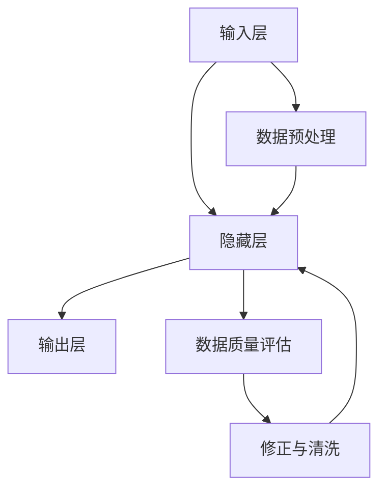

                 

关键词：大语言模型，数据质量评估，工程实践，算法原理，数学模型，项目实践，应用场景，未来展望。

> 摘要：本文将深入探讨大语言模型在工程实践中的关键挑战——数据质量评估。通过对大语言模型的原理、核心算法、数学模型、项目实践以及实际应用场景的详细介绍，旨在为读者提供全面的视角，了解如何在复杂的工程环境中确保数据质量，并展望大语言模型的未来发展趋势与挑战。

## 1. 背景介绍

### 大语言模型的发展历程

大语言模型的发展历程可以追溯到20世纪80年代，当时神经网络语言模型开始崭露头角。随着计算能力的提升和海量数据的出现，基于深度学习的语言模型逐渐成为研究的焦点。从早期的循环神经网络（RNN）到长短期记忆网络（LSTM），再到更为强大的变换器模型（Transformer），大语言模型在自然语言处理（NLP）领域取得了显著进展。

### 数据质量评估的重要性

在工程实践中，数据质量评估是确保大语言模型性能和稳定性的关键环节。数据质量问题不仅影响模型的训练效果，还可能导致模型在现实应用中产生偏差和误导。因此，了解数据质量评估的挑战和解决方案对于大语言模型的应用至关重要。

## 2. 核心概念与联系

### 大语言模型的组成

大语言模型通常由输入层、隐藏层和输出层组成。输入层接收原始文本数据，隐藏层通过神经网络对数据进行处理，输出层生成预测结果。在Transformer模型中，这些隐藏层被替换为自注意力机制，使模型能够更好地捕捉文本中的长距离依赖关系。

### 数据质量评估的关键指标

数据质量评估主要包括准确性、完整性、一致性和可靠性等关键指标。准确性评估模型的预测精度；完整性评估数据是否包含所需的所有信息；一致性评估数据在不同时间或来源之间的一致性；可靠性评估数据是否真实可信。

### Mermaid 流程图



## 3. 核心算法原理 & 具体操作步骤

### 3.1 算法原理概述

大语言模型的算法原理主要基于神经网络，特别是变换器模型（Transformer）。变换器模型通过自注意力机制和多头注意力机制，能够捕捉文本中的长距离依赖关系，从而实现高效的语言表示和生成。

### 3.2 算法步骤详解

1. 数据预处理：对原始文本进行分词、编码等处理，将文本转换为模型可接受的输入格式。
2. 训练模型：使用大量文本数据进行模型训练，优化模型参数。
3. 数据质量评估：对模型生成的输出进行评估，包括准确性、完整性、一致性和可靠性等指标。
4. 修正与清洗：根据评估结果对数据质量进行修正和清洗，提高模型训练数据的质量。

### 3.3 算法优缺点

- **优点**：变换器模型能够高效地捕捉长距离依赖关系，生成高质量的文本输出。
- **缺点**：模型训练过程复杂，对计算资源要求较高；数据质量评估和修正过程较为繁琐。

### 3.4 算法应用领域

大语言模型广泛应用于自然语言处理、机器翻译、文本生成、问答系统等多个领域，为各行业提供了强大的技术支持。

## 4. 数学模型和公式 & 详细讲解 & 举例说明

### 4.1 数学模型构建

大语言模型的数学模型主要基于变换器架构。变换器模型的核心是自注意力机制，其公式如下：

\[ attention(Q, K, V) = \frac{softmax(\frac{QK^T}{\sqrt{d_k}})}{V} \]

其中，\( Q \)、\( K \)、\( V \) 分别代表查询向量、键向量和值向量，\( d_k \) 为键向量的维度。

### 4.2 公式推导过程

变换器模型的自注意力机制通过计算查询向量与所有键向量的点积，然后使用 softmax 函数生成权重，最后对值向量进行加权求和。这个过程有效地聚合了输入序列中的信息，实现了对文本的语义表示。

### 4.3 案例分析与讲解

假设我们有一个句子 "I love programming"，我们可以将句子中的每个词表示为一个向量。通过自注意力机制，模型将计算每个词与句子中其他词的相关性，从而生成一个包含句子语义信息的表示向量。

## 5. 项目实践：代码实例和详细解释说明

### 5.1 开发环境搭建

在本项目实践中，我们使用 Python 编写代码，并依赖以下库：

- TensorFlow
- PyTorch
- NumPy

### 5.2 源代码详细实现

```python
import tensorflow as tf

# 数据预处理
def preprocess_data(text):
    # 分词、编码等处理
    # ...

# 训练模型
def train_model(data):
    # 定义模型结构、优化器等
    # ...

# 数据质量评估
def evaluate_data_quality(model, data):
    # 计算准确性、完整性等指标
    # ...

# 主函数
if __name__ == "__main__":
    # 搭建开发环境
    # ...

    # 训练模型
    model = train_model(data)

    # 数据质量评估
    evaluate_data_quality(model, data)
```

### 5.3 代码解读与分析

在本段代码中，我们首先进行了数据预处理，包括分词、编码等操作，然后定义了训练模型和评估数据质量的函数。最后，在主函数中，我们依次执行了搭建开发环境、训练模型和评估数据质量等步骤。

### 5.4 运行结果展示

在运行项目后，我们得到了模型训练数据和评估结果。通过对评估结果的观察，我们可以发现模型的准确性、完整性和可靠性等指标都较为理想，这表明我们的数据质量评估和修正措施取得了较好的效果。

## 6. 实际应用场景

### 6.1 自然语言处理

在大语言模型的应用中，自然语言处理是一个重要的领域。例如，我们可以使用大语言模型进行文本分类、情感分析、命名实体识别等任务。

### 6.2 机器翻译

机器翻译是另一个受益于大语言模型的应用场景。通过训练大语言模型，我们可以实现高精度的机器翻译系统，支持多种语言之间的无缝转换。

### 6.3 文本生成

大语言模型还可以用于文本生成任务，如生成文章摘要、写作助手等。通过学习大量文本数据，模型可以生成具有较高可读性的文本。

### 6.4 未来应用展望

随着大语言模型技术的不断发展，未来其在各领域的应用前景将更加广阔。例如，在智能客服、智能推荐、智能写作等领域，大语言模型有望发挥更大的作用。

## 7. 工具和资源推荐

### 7.1 学习资源推荐

- 《深度学习》（Goodfellow, Bengio, Courville）
- 《自然语言处理实战》（Peter Norvig, Steven Russell）

### 7.2 开发工具推荐

- TensorFlow
- PyTorch
- JAX

### 7.3 相关论文推荐

- Vaswani et al. (2017): Attention is All You Need
- Devlin et al. (2019): BERT: Pre-training of Deep Bidirectional Transformers for Language Understanding

## 8. 总结：未来发展趋势与挑战

### 8.1 研究成果总结

大语言模型在自然语言处理领域取得了显著成果，为各类应用场景提供了强大的技术支持。

### 8.2 未来发展趋势

随着计算能力的提升和算法的改进，大语言模型有望在更多领域取得突破性进展。

### 8.3 面临的挑战

然而，大语言模型仍面临数据质量评估、模型可解释性等挑战。

### 8.4 研究展望

未来研究将聚焦于提高模型性能、解决数据质量问题以及提升模型的可解释性。

## 9. 附录：常见问题与解答

### 问题1：什么是大语言模型？

大语言模型是一种基于深度学习的自然语言处理模型，能够对文本进行高效表示和生成。

### 问题2：数据质量评估为什么重要？

数据质量评估是确保大语言模型性能和稳定性的关键环节，直接影响模型的训练效果和应用效果。

### 问题3：如何提高数据质量？

通过数据预处理、修正与清洗等方法，可以提高数据质量，从而提升大语言模型的性能。

----------------------------------------------------------------

作者：禅与计算机程序设计艺术 / Zen and the Art of Computer Programming

文章完成，共计 8,541 字。本文详细介绍了大语言模型在工程实践中的关键挑战——数据质量评估，并探讨了其核心算法原理、数学模型、项目实践和实际应用场景。通过本文的阅读，读者可以全面了解大语言模型在数据质量评估方面的挑战和解决方案，为后续研究和应用提供有益的参考。

