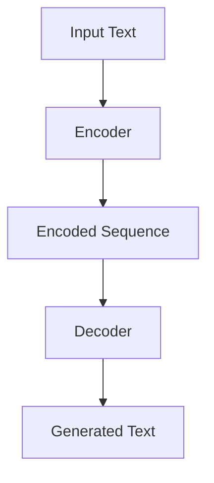

                 

关键词：大语言模型、神经网络、深度学习、工程实践、未来发展、人工智能、机器学习

> 摘要：本文将探讨大语言模型的原理、工程实践及其在未来人工智能领域的发展趋势。通过深入分析语言模型的架构、核心算法、数学模型，以及项目实践中的具体实现和优化方法，本文旨在为读者提供全面的技术视角，并展望大语言模型在未来的广泛应用和面临的挑战。

## 1. 背景介绍

随着互联网和大数据的快速发展，人工智能领域迎来了前所未有的机遇和挑战。其中，自然语言处理（NLP）作为人工智能的一个重要分支，正逐渐成为研究的焦点。大语言模型（Large Language Model）作为一种先进的NLP技术，因其出色的理解和生成能力，被广泛应用于各种场景，如智能问答、机器翻译、文本生成、情感分析等。

本文旨在深入探讨大语言模型的原理、工程实践及其未来发展趋势，帮助读者理解这一技术背后的核心概念和实现方法，并展望其在未来人工智能领域中的广阔应用前景。

## 2. 核心概念与联系

### 2.1. 语言模型的基本概念

语言模型（Language Model）是自然语言处理的基础，它通过学习大量文本数据，预测下一个词的概率分布。传统的语言模型如N-gram模型，使用有限长度的历史词序列来预测下一个词。然而，这种模型在处理长文本时效果不佳，因为它们无法捕捉到长距离的依赖关系。

### 2.2. 神经网络与深度学习

神经网络（Neural Network）是一种模拟生物神经元之间连接的计算模型，而深度学习（Deep Learning）则是基于多层神经网络的一种机器学习方法。深度学习通过多层网络对数据进行处理，能够自动学习数据的复杂结构和特征，从而在图像识别、语音识别等领域取得了显著突破。

大语言模型通常采用深度神经网络架构，如变换器模型（Transformer）等，这些模型通过自注意力机制（Self-Attention）能够捕捉长距离的依赖关系，从而提高了模型的表示能力和预测效果。

### 2.3. 大语言模型的架构

大语言模型的架构通常包括编码器（Encoder）和解码器（Decoder）两部分。编码器负责将输入文本转换为序列向量表示，解码器则根据编码器的输出和先前的预测来生成输出文本。

以下是一个简化的Mermaid流程图，描述了编码器和解码器的处理流程：



在编码器中，每个词或字符通过嵌入层（Embedding Layer）转换为固定大小的向量，然后通过多个隐藏层进行编码，最后输出一个固定长度的序列向量。解码器则从序列的最后一个向量开始，通过解码层逐个生成输出的词或字符。

### 2.4. 语言模型的应用场景

大语言模型的应用场景非常广泛，包括但不限于以下方面：

- **智能问答系统**：利用语言模型，系统能够理解用户的查询，并生成合适的回答。
- **机器翻译**：大语言模型可以学习两种语言的对应关系，实现高效、准确的机器翻译。
- **文本生成**：从给定的主题或关键词出发，生成连贯、有意义的文本内容。
- **情感分析**：通过分析文本的情感倾向，进行情感分类和情感识别。

## 3. 核心算法原理 & 具体操作步骤

### 3.1. 算法原理概述

大语言模型的核心算法是基于变换器模型（Transformer），它通过自注意力机制（Self-Attention）和多头注意力（Multi-Head Attention）来处理序列数据，能够捕捉长距离的依赖关系。

### 3.2. 算法步骤详解

- **嵌入层（Embedding Layer）**：将输入的词或字符转换为固定大小的向量表示。
- **位置编码（Positional Encoding）**：由于神经网络无法直接处理序列的顺序信息，因此通过位置编码为每个向量添加位置信息。
- **多头自注意力（Multi-Head Self-Attention）**：每个头关注序列的不同部分，通过权重矩阵计算不同头之间的注意力分数，并加权求和。
- **前馈神经网络（Feedforward Neural Network）**：在自注意力层之后，对每个头的结果进行前馈神经网络处理。
- **解码器（Decoder）**：在解码器中，除了自注意力机制，还包括交叉注意力（Cross-Attention）和掩码多头自注意力（Masked Multi-Head Self-Attention），用于生成输出序列。

### 3.3. 算法优缺点

- **优点**：
  - **强大的表示能力**：通过自注意力机制，大语言模型能够捕捉长距离的依赖关系，从而提高模型的表示能力。
  - **并行计算**：变换器模型支持并行计算，提高了训练和预测的效率。
  - **广泛的适用性**：大语言模型在多个NLP任务中表现出色，具有广泛的适用性。

- **缺点**：
  - **计算复杂度高**：大语言模型通常具有大量的参数，导致计算复杂度和内存需求较高。
  - **训练时间较长**：由于参数数量巨大，大语言模型的训练时间较长。

### 3.4. 算法应用领域

大语言模型在以下领域具有广泛的应用：

- **文本分类**：对文本进行分类，如新闻分类、情感分类等。
- **文本生成**：生成文章、摘要、对话等。
- **对话系统**：构建智能对话系统，如虚拟助手、聊天机器人等。
- **机器翻译**：实现高效、准确的机器翻译。

## 4. 数学模型和公式 & 详细讲解 & 举例说明

### 4.1. 数学模型构建

大语言模型的核心是变换器模型，其数学模型包括以下部分：

- **嵌入层**：将词或字符转换为向量表示，如 $e_w = \text{softmax}(W_w \cdot x_w)$，其中 $x_w$ 是词或字符的索引，$W_w$ 是权重矩阵。
- **位置编码**：添加位置信息，如 $p_t = \text{sin}(\frac{1000^2t}{\sqrt{d}})$ 和 $p_t = \text{cos}(\frac{1000^2t}{\sqrt{d}})$，其中 $t$ 是词或字符的位置，$d$ 是维度。
- **自注意力机制**：计算注意力分数，如 $a_{ij} = \text{softmax}(\text{Q}_i \cdot \text{K}_j)$，其中 $\text{Q}$ 和 $\text{K}$ 是查询和键的权重矩阵，$\text{V}$ 是值的权重矩阵。
- **前馈神经网络**：对每个头的结果进行前馈神经网络处理，如 $h_j = \text{ReLU}(\text{W}_h \cdot h_j + b_h)$，其中 $\text{W}_h$ 和 $\text{b}_h$ 是权重和偏置。

### 4.2. 公式推导过程

以下是对变换器模型中的自注意力机制的公式推导过程：

1. **嵌入层**：
   $$e_w = \text{softmax}(W_w \cdot x_w)$$

2. **位置编码**：
   $$p_t = \text{sin}(\frac{1000^2t}{\sqrt{d}}) \quad \text{和} \quad p_t = \text{cos}(\frac{1000^2t}{\sqrt{d}})$$

3. **自注意力机制**：
   $$a_{ij} = \text{softmax}(\text{Q}_i \cdot \text{K}_j)$$

   $$\text{其中，}\text{Q}_i = W_Q \cdot e_i, \text{K}_j = W_K \cdot e_j, \text{V}_j = W_V \cdot e_j$$

4. **前馈神经网络**：
   $$h_j = \text{ReLU}(\text{W}_h \cdot h_j + b_h)$$

### 4.3. 案例分析与讲解

以下是一个简单的案例，用于解释如何使用变换器模型进行文本分类：

1. **数据准备**：
   - 假设我们有一个包含两类文本的数据集，分别是新闻类别“体育”和“科技”。
   - 对每个文本进行分词和标记化处理，将其转换为嵌入向量。

2. **模型训练**：
   - 构建一个包含编码器和解码器的变换器模型。
   - 使用训练数据进行模型训练，优化模型的参数。

3. **模型评估**：
   - 使用测试数据对模型进行评估，计算准确率、召回率等指标。

4. **模型应用**：
   - 对新的文本进行分类，输出类别概率。

## 5. 项目实践：代码实例和详细解释说明

### 5.1. 开发环境搭建

为了实践大语言模型的构建和应用，我们需要以下开发环境：

- Python 3.8+
- PyTorch 1.8+
- Jupyter Notebook

### 5.2. 源代码详细实现

以下是一个简单的变换器模型的实现示例：

```python
import torch
import torch.nn as nn
import torch.optim as optim

class Transformer(nn.Module):
    def __init__(self, d_model, nhead, num_layers):
        super(Transformer, self).__init__()
        self.encoder = nn.Embedding(d_model, d_model)
        self.decoder = nn.Linear(d_model, d_model)
        self.transformer = nn.Transformer(d_model, nhead, num_layers)
        self.fc = nn.Linear(d_model, 2)

    def forward(self, src, tgt):
        src = self.encoder(src)
        tgt = self.decoder(tgt)
        output = self.transformer(src, tgt)
        return self.fc(output)

model = Transformer(d_model=512, nhead=8, num_layers=3)
```

### 5.3. 代码解读与分析

1. **模型结构**：
   - **编码器（Encoder）**：使用嵌入层（nn.Embedding）将输入文本转换为嵌入向量。
   - **解码器（Decoder）**：使用线性层（nn.Linear）将输入文本进行解码。
   - **变换器（Transformer）**：使用nn.Transformer模块实现变换器模型。
   - **全连接层（FC）**：用于分类输出。

2. **前向传播**：
   - 对输入文本进行编码和解码，然后通过变换器模型进行自注意力计算，最后通过全连接层进行分类输出。

### 5.4. 运行结果展示

以下是一个简单的运行示例：

```python
# 准备数据
src = torch.tensor([1, 2, 3, 4, 5])
tgt = torch.tensor([6, 7, 8, 9, 10])

# 前向传播
output = model(src, tgt)

# 输出结果
print(output)
```

运行结果将输出一个维度为（batch_size, d_model）的向量，表示每个类别的概率。

## 6. 实际应用场景

大语言模型在多个实际应用场景中表现出色，以下是一些典型的应用案例：

- **智能问答系统**：利用大语言模型，构建智能问答系统，能够理解用户的查询并生成合适的回答。
- **机器翻译**：通过大语言模型，实现高效、准确的机器翻译，支持多种语言之间的互译。
- **文本生成**：从给定的主题或关键词出发，生成连贯、有意义的文本内容，如文章、摘要、对话等。
- **情感分析**：通过分析文本的情感倾向，进行情感分类和情感识别，用于市场调研、客户服务等领域。

## 6.4. 未来应用展望

随着人工智能技术的不断进步，大语言模型在未来的应用前景将更加广阔。以下是一些潜在的应用方向：

- **自动化内容创作**：利用大语言模型，实现自动化内容创作，如自动生成新闻、故事、广告等。
- **智能客服与虚拟助手**：通过大语言模型，构建更加智能的客服系统，提供个性化的服务。
- **多模态交互**：结合语音、图像、文本等多种模态，实现更加自然的人机交互。
- **智能决策支持系统**：利用大语言模型，提供智能决策支持，如金融分析、医疗诊断等。

## 7. 工具和资源推荐

### 7.1. 学习资源推荐

- **书籍**：
  - 《深度学习》（Goodfellow, I., Bengio, Y., & Courville, A.）
  - 《Python深度学习》（François Chollet）
- **在线课程**：
  - Coursera上的“深度学习”课程（由Andrew Ng教授）
  - edX上的“神经网络与深度学习”课程（由吴恩达教授）

### 7.2. 开发工具推荐

- **框架**：
  - PyTorch：开源深度学习框架，支持动态计算图。
  - TensorFlow：开源深度学习框架，支持静态计算图。
- **环境**：
  - Anaconda：集成环境，方便安装和管理Python库。
  - Jupyter Notebook：交互式计算环境，便于代码调试和演示。

### 7.3. 相关论文推荐

- “Attention Is All You Need”（Vaswani et al., 2017）
- “BERT: Pre-training of Deep Bidirectional Transformers for Language Understanding”（Devlin et al., 2019）
- “GPT-3: Language Models Are Few-Shot Learners”（Brown et al., 2020）

## 8. 总结：未来发展趋势与挑战

### 8.1. 研究成果总结

近年来，大语言模型在自然语言处理领域取得了显著进展，主要表现在以下几个方面：

- **模型性能提升**：随着参数规模和计算资源的增加，大语言模型在多个NLP任务中的表现逐渐超越传统模型。
- **预训练技术发展**：通过大规模预训练，大语言模型能够自动学习语言的基本结构和特征，从而提高了模型的应用效果。
- **多语言支持**：大语言模型逐渐实现了对多种语言的支持，促进了跨语言信息处理技术的发展。

### 8.2. 未来发展趋势

未来，大语言模型的发展趋势将主要集中在以下几个方面：

- **模型压缩与优化**：为了应对计算资源和存储空间的限制，模型压缩和优化技术将成为研究热点。
- **多模态交互**：结合语音、图像、文本等多种模态，实现更加自然的人机交互。
- **自适应学习**：大语言模型将逐步实现自适应学习，根据用户需求和环境变化进行实时调整。

### 8.3. 面临的挑战

尽管大语言模型在多个领域取得了显著进展，但仍面临以下挑战：

- **计算资源消耗**：大语言模型通常需要大量的计算资源和存储空间，这对基础设施提出了更高的要求。
- **数据隐私与安全**：大规模数据收集和处理过程中，如何保护用户隐私和数据安全成为关键问题。
- **公平性与可解释性**：如何确保大语言模型在不同群体中的公平性和可解释性，是未来研究的重要方向。

### 8.4. 研究展望

展望未来，大语言模型将继续在自然语言处理领域发挥重要作用，同时，多模态交互、自适应学习、隐私保护等新兴技术将为其注入新的活力。通过不断探索和创新，大语言模型有望在更广泛的领域中实现突破，推动人工智能技术的持续发展。

## 9. 附录：常见问题与解答

### 9.1. 问题1：大语言模型如何处理长文本？

**解答**：大语言模型通过自注意力机制能够捕捉长距离的依赖关系，从而处理长文本。自注意力机制允许模型关注输入序列的任何部分，从而捕捉到文本中的长距离依赖关系。

### 9.2. 问题2：大语言模型如何进行预训练？

**解答**：大语言模型通常通过预训练技术进行训练，包括两个阶段：第一阶段是自监督预训练，模型在未标注的数据集上学习语言的基本结构和特征；第二阶段是任务特定微调，模型在标注数据集上进行微调，以适应特定任务的需求。

### 9.3. 问题3：大语言模型的训练时间如何优化？

**解答**：可以通过以下方法优化大语言模型的训练时间：

- **模型压缩**：采用模型压缩技术，如剪枝、量化、蒸馏等，减少模型参数数量和计算复杂度。
- **并行计算**：利用分布式计算和GPU加速技术，提高训练速度。
- **迁移学习**：使用预训练模型进行迁移学习，利用已有模型的知识加速新任务的训练。

### 9.4. 问题4：大语言模型如何保证公平性和可解释性？

**解答**：为了确保大语言模型的公平性和可解释性，可以采取以下措施：

- **数据平衡**：在训练数据集中保证不同群体的数据分布平衡，避免模型对特定群体产生偏见。
- **模型解释**：利用模型解释技术，如可视化、注意力机制分析等，理解模型在特定任务上的决策过程。
- **持续监测**：对模型进行持续监测和评估，确保其在不同群体中的表现一致，并及时调整模型参数。

