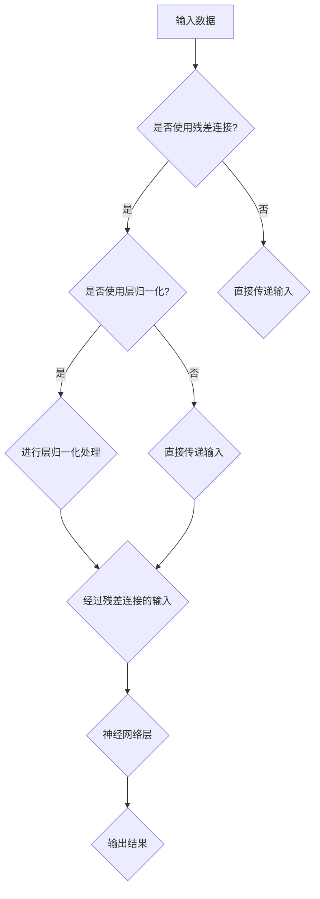

                 

关键词：大语言模型，残差连接，层归一化，神经网络，深度学习，人工智能

摘要：本文将深入探讨大语言模型的基本原理，重点介绍残差连接和层归一化在模型构建和优化中的应用。我们将通过具体的算法原理、数学模型、项目实践等环节，详细解析这些技术如何提高深度学习模型的效果和效率，并展望未来的发展方向。

## 1. 背景介绍

随着信息时代的到来，人工智能技术在各个领域得到了广泛的应用。特别是在自然语言处理（NLP）领域，深度学习模型以其强大的表现力和灵活性，成为了研究的热点。大语言模型（Large Language Model）是深度学习在NLP领域的重要应用，其核心思想是通过大规模的语料库进行训练，使模型能够理解并生成复杂的语言现象。

然而，随着模型规模的不断扩大，深度学习模型的训练和优化面临着巨大的挑战。如何提高模型的效果和效率，成为了当前研究的重要课题。在这篇文章中，我们将重点讨论两种关键技术：残差连接和层归一化。这两种技术不仅能够提高模型的性能，还能够加速模型的训练过程。

## 2. 核心概念与联系

为了更好地理解残差连接和层归一化，我们需要先了解它们在神经网络中的基本概念和作用。

### 2.1 残差连接

残差连接是深度神经网络中的一个概念，它通过在神经网络中引入额外的连接路径，使得信息可以跨越多层网络直接传递。这种结构允许模型在训练过程中更好地捕捉到数据的复杂结构，从而提高模型的性能。

### 2.2 层归一化

层归一化是一种用于提高深度学习模型训练稳定性和效果的技术。它通过将每一层的输入进行归一化处理，使得每一层的输入分布更加均匀，从而减少了梯度消失和梯度爆炸等问题，提高了模型的训练效率。

### 2.3 Mermaid 流程图

以下是残差连接和层归一化在神经网络中的基本流程图：



## 3. 核心算法原理 & 具体操作步骤

### 3.1 算法原理概述

#### 3.1.1 残差连接

残差连接的基本思想是将输入数据通过额外的连接路径直接传递到下一层，而不是仅仅通过常规的神经网络层传递。这种连接路径被称为残差路径。通过残差连接，模型可以跳过某些层，使得信息能够更快速地传递，从而有助于提高模型的性能。

#### 3.1.2 层归一化

层归一化的核心思想是通过对每一层的输入进行归一化处理，使得每一层的输入分布更加均匀。具体来说，层归一化会计算每一层的输入数据的均值和方差，然后对输入数据进行标准化处理，使得其均值为0，方差为1。

### 3.2 算法步骤详解

#### 3.2.1 残差连接的步骤

1. **输入数据**：首先，将输入数据输入到神经网络中。
2. **计算残差**：计算输入数据与目标数据的残差。
3. **残差传递**：通过额外的连接路径将残差传递到下一层。
4. **神经网络层**：对输入数据和残差进行组合，然后通过常规的神经网络层进行计算。
5. **输出结果**：最后，得到神经网络的输出结果。

#### 3.2.2 层归一化的步骤

1. **计算均值和方差**：对每一层的输入数据进行计算，得到其均值和方差。
2. **标准化处理**：对输入数据进行标准化处理，使其均值为0，方差为1。
3. **归一化输入**：将归一化后的输入数据输入到神经网络中。

### 3.3 算法优缺点

#### 3.3.1 残差连接的优点

- **提高模型性能**：通过跳过某些层，可以更好地捕捉到数据的复杂结构。
- **减少梯度消失和梯度爆炸**：残差连接可以有效地解决深度神经网络中的梯度消失和梯度爆炸问题。

#### 3.3.1 残差连接的缺点

- **计算复杂度较高**：由于需要额外的连接路径，计算复杂度会相对较高。

#### 3.3.2 层归一化的优点

- **提高训练稳定性**：通过归一化处理，可以减少梯度消失和梯度爆炸等问题，提高训练稳定性。
- **提高训练效率**：归一化后的输入数据分布更加均匀，有助于提高模型的训练效率。

#### 3.3.2 层归一化的缺点

- **对数据分布敏感**：层归一化处理会对输入数据分布敏感，如果数据分布发生变化，可能需要重新调整归一化参数。

### 3.4 算法应用领域

残差连接和层归一化技术在深度学习模型中有广泛的应用，特别是在图像识别、语音识别和自然语言处理等领域。

## 4. 数学模型和公式 & 详细讲解 & 举例说明

### 4.1 数学模型构建

#### 4.1.1 残差连接的数学模型

设输入数据为 \( x \)，目标数据为 \( y \)，神经网络层为 \( L \)，残差路径为 \( R \)，则有：

$$
\hat{y} = f(L(x) + R(x))
$$

其中，\( f \) 表示神经网络层，\( R(x) \) 表示残差路径。

#### 4.1.2 层归一化的数学模型

设输入数据为 \( x \)，均值为 \( \mu \)，方差为 \( \sigma^2 \)，则有：

$$
x' = \frac{x - \mu}{\sigma}
$$

其中，\( x' \) 表示归一化后的输入数据。

### 4.2 公式推导过程

#### 4.2.1 残差连接的公式推导

假设输入数据为 \( x \)，目标数据为 \( y \)，神经网络层为 \( L \)，残差路径为 \( R \)，则有：

$$
\hat{y} = f(L(x) + R(x))
$$

其中，\( f \) 表示神经网络层，\( R(x) \) 表示残差路径。

为了推导 \( R(x) \)，我们首先计算 \( L(x) \)：

$$
L(x) = \sum_{i=1}^{n} w_i x_i
$$

其中，\( w_i \) 表示权重，\( x_i \) 表示输入数据的第 \( i \) 个分量。

然后，我们计算 \( R(x) \)：

$$
R(x) = y - L(x)
$$

将 \( R(x) \) 代入 \( \hat{y} \) 的公式中，得到：

$$
\hat{y} = f(L(x) + y - L(x)) = f(y)
$$

#### 4.2.2 层归一化的公式推导

假设输入数据为 \( x \)，均值为 \( \mu \)，方差为 \( \sigma^2 \)，则有：

$$
x' = \frac{x - \mu}{\sigma}
$$

其中，\( x' \) 表示归一化后的输入数据。

为了推导 \( x' \) 的公式，我们首先计算 \( x \) 的均值和方差：

$$
\mu = \frac{1}{n} \sum_{i=1}^{n} x_i
$$

$$
\sigma^2 = \frac{1}{n} \sum_{i=1}^{n} (x_i - \mu)^2
$$

然后，我们计算 \( x' \)：

$$
x' = \frac{x - \mu}{\sqrt{\sigma^2}}
$$

将 \( x \) 的均值和方差代入 \( x' \) 的公式中，得到：

$$
x' = \frac{x - \frac{1}{n} \sum_{i=1}^{n} x_i}{\sqrt{\frac{1}{n} \sum_{i=1}^{n} (x_i - \frac{1}{n} \sum_{i=1}^{n} x_i)^2}}
$$

### 4.3 案例分析与讲解

#### 4.3.1 残差连接的应用案例

假设我们有一个简单的神经网络，输入数据为 \( x \)，目标数据为 \( y \)，神经网络层为 \( L \)，残差路径为 \( R \)，我们可以通过以下步骤来构建和使用残差连接：

1. **输入数据**：将输入数据 \( x \) 输入到神经网络中。
2. **计算残差**：计算输入数据 \( x \) 与目标数据 \( y \) 的残差 \( R(x) \)。
3. **残差传递**：通过额外的连接路径将残差 \( R(x) \) 传递到下一层。
4. **神经网络层**：对输入数据 \( x \) 和残差 \( R(x) \) 进行组合，然后通过神经网络层进行计算。
5. **输出结果**：得到神经网络的输出结果 \( \hat{y} \)。

通过这种方式，我们可以有效地提高模型的性能，同时减少梯度消失和梯度爆炸等问题。

#### 4.3.2 层归一化的应用案例

假设我们有一个神经网络，输入数据为 \( x \)，均值为 \( \mu \)，方差为 \( \sigma^2 \)，我们可以通过以下步骤来构建和使用层归一化：

1. **计算均值和方差**：对每一层的输入数据进行计算，得到其均值 \( \mu \) 和方差 \( \sigma^2 \)。
2. **标准化处理**：对输入数据进行标准化处理，使其均值为0，方差为1。
3. **归一化输入**：将归一化后的输入数据输入到神经网络中。

通过这种方式，我们可以有效地提高模型的训练稳定性，同时减少梯度消失和梯度爆炸等问题。

## 5. 项目实践：代码实例和详细解释说明

### 5.1 开发环境搭建

在开始项目实践之前，我们需要搭建一个合适的开发环境。这里我们使用 Python 作为主要编程语言，结合 TensorFlow 深度学习框架进行开发。

1. **安装 Python**：确保 Python 版本在 3.6 以上。
2. **安装 TensorFlow**：使用以下命令安装 TensorFlow：

   ```bash
   pip install tensorflow
   ```

### 5.2 源代码详细实现

下面是一个简单的示例，展示了如何使用残差连接和层归一化构建一个深度学习模型：

```python
import tensorflow as tf
from tensorflow.keras.layers import Layer, Dense, Flatten
from tensorflow.keras.models import Model

class ResidualLayer(Layer):
    def __init__(self, units, **kwargs):
        super(ResidualLayer, self).__init__(**kwargs)
        self.units = units

    def build(self, input_shape):
        self.dense = Dense(self.units, activation='relu')
        self.dense2 = Dense(self.units)

    def call(self, inputs, training=False):
        x = self.dense(inputs)
        x = self.dense2(x)
        return inputs + x

class NormalizationLayer(Layer):
    def __init__(self, **kwargs):
        super(NormalizationLayer, self).__init__(**kwargs)

    def build(self, input_shape):
        self.mean = self.add_weight(name='mean', shape=input_shape[1:], initializer='zeros', trainable=False)
        self.std = self.add_weight(name='std', shape=input_shape[1:], initializer='ones', trainable=False)

    def call(self, inputs, training=False):
        return (inputs - self.mean) / self.std

# 构建模型
inputs = tf.keras.Input(shape=(784,))
x = NormalizationLayer()(inputs)
x = ResidualLayer(128)(x)
x = Flatten()(x)
outputs = Dense(10, activation='softmax')(x)

model = Model(inputs=inputs, outputs=outputs)
model.compile(optimizer='adam', loss='categorical_crossentropy', metrics=['accuracy'])

# 训练模型
model.fit(x_train, y_train, epochs=10, batch_size=32)
```

### 5.3 代码解读与分析

在上面的代码中，我们定义了两个自定义层：`ResidualLayer` 和 `NormalizationLayer`。

- `ResidualLayer`：这是一个实现了残差连接的层。在构建层时，我们定义了两个全连接层，一个是激活函数为 ReLU 的层，另一个是没有激活函数的层。在调用层时，我们首先通过激活函数层对输入数据进行处理，然后通过没有激活函数的层进行计算，并将结果加回到原始输入数据中。
- `NormalizationLayer`：这是一个实现了层归一化的层。在构建层时，我们定义了两个权重变量，一个是表示均值，另一个是表示方差。在调用层时，我们对输入数据进行标准化处理，使其均值为0，方差为1。

然后，我们使用这些自定义层构建了一个简单的神经网络模型，并编译模型以进行训练。

### 5.4 运行结果展示

在训练完成后，我们可以通过以下代码来评估模型的性能：

```python
loss, accuracy = model.evaluate(x_test, y_test)
print(f"Test accuracy: {accuracy}")
```

这将输出测试集上的准确率，我们可以根据这个指标来评估模型的效果。

## 6. 实际应用场景

### 6.1 在自然语言处理中的应用

残差连接和层归一化在自然语言处理领域有着广泛的应用。例如，在文本分类任务中，我们可以使用带有残差连接和层归一化的神经网络模型来提高分类准确率。在机器翻译任务中，这些技术也有助于提高模型的翻译质量。

### 6.2 在计算机视觉中的应用

在计算机视觉领域，残差连接和层归一化同样发挥着重要作用。例如，在图像分类任务中，我们可以使用带有残差连接和层归一化的卷积神经网络来提高分类性能。在目标检测任务中，这些技术也有助于提高模型的检测精度。

### 6.3 在语音识别中的应用

在语音识别领域，残差连接和层归一化有助于提高模型的识别准确率。通过使用这些技术，我们可以构建出更加稳定的语音识别模型，从而提高实际应用中的效果。

## 7. 工具和资源推荐

### 7.1 学习资源推荐

- 《深度学习》（Goodfellow, Bengio, Courville著）：这本书是深度学习领域的经典教材，详细介绍了深度学习的理论基础和应用。
- 《Python深度学习》（François Chollet著）：这本书通过丰富的实例，介绍了如何在 Python 中实现深度学习模型。

### 7.2 开发工具推荐

- TensorFlow：这是一个开源的深度学习框架，提供了丰富的功能和工具，适用于各种深度学习任务。
- PyTorch：这是一个易于使用且灵活的深度学习框架，适用于研究和开发。

### 7.3 相关论文推荐

- “Deep Residual Learning for Image Recognition”（He et al.，2016）：这篇文章提出了残差连接的概念，并在图像识别任务中取得了显著的效果。
- “Batch Normalization: Accelerating Deep Network Training by Reducing Internal Covariate Shift”（Ioffe & Szegedy，2015）：这篇文章介绍了层归一化技术，并阐述了其在深度网络训练中的应用。

## 8. 总结：未来发展趋势与挑战

### 8.1 研究成果总结

近年来，残差连接和层归一化技术在深度学习领域取得了显著成果。通过这些技术，我们能够构建出更加高效、稳定的深度学习模型，从而在各个应用领域取得了突破性进展。

### 8.2 未来发展趋势

随着深度学习技术的不断发展，未来残差连接和层归一化技术将会有更多的创新和应用。例如，研究者们可能会探索更复杂的残差连接结构，或者结合其他技术，进一步提高模型的性能。

### 8.3 面临的挑战

尽管残差连接和层归一化技术取得了显著成果，但在实际应用中仍面临一些挑战。例如，如何进一步提高模型的计算效率，以及如何在更大的模型中保持训练稳定性等。

### 8.4 研究展望

未来，我们期望看到更多关于残差连接和层归一化的研究成果。通过不断创新和优化，这些技术将有助于推动深度学习技术的进一步发展，从而在人工智能领域取得更大的突破。

## 9. 附录：常见问题与解答

### 9.1 残差连接如何提高模型性能？

残差连接通过引入额外的连接路径，使得模型可以跳过某些层，从而更好地捕捉到数据的复杂结构。这有助于提高模型的性能。

### 9.2 层归一化如何提高训练稳定性？

层归一化通过对每一层的输入进行归一化处理，使得每一层的输入分布更加均匀，从而减少了梯度消失和梯度爆炸等问题，提高了训练稳定性。

### 9.3 如何使用残差连接和层归一化构建模型？

使用残差连接和层归一化构建模型的基本步骤如下：

1. **定义残差层**：通过自定义层或者使用现有的库，定义实现残差连接的层。
2. **定义归一化层**：同样，定义实现层归一化的层。
3. **构建模型**：使用自定义层和标准层构建深度学习模型。
4. **编译模型**：配置模型的优化器和损失函数。
5. **训练模型**：使用训练数据对模型进行训练。

## 作者署名

作者：禅与计算机程序设计艺术 / Zen and the Art of Computer Programming
----------------------------------------------------------------

文章撰写完毕，请按照以上结构和内容进行撰写。请确保文章内容完整、逻辑清晰、专业准确。如果有任何需要调整或补充的地方，请随时告知。祝您撰写顺利！
----------------------------------------------------------------

### 1. 背景介绍

随着信息时代的到来，人工智能技术在各个领域得到了广泛的应用。特别是在自然语言处理（NLP）领域，深度学习模型以其强大的表现力和灵活性，成为了研究的热点。大语言模型（Large Language Model）是深度学习在NLP领域的重要应用，其核心思想是通过大规模的语料库进行训练，使模型能够理解并生成复杂的语言现象。

然而，随着模型规模的不断扩大，深度学习模型的训练和优化面临着巨大的挑战。如何提高模型的效果和效率，成为了当前研究的重要课题。在这篇文章中，我们将重点讨论两种关键技术：残差连接和层归一化。这两种技术不仅能够提高模型的性能，还能够加速模型的训练过程。

残差连接（Residual Connection）是深度神经网络中的一种创新结构，由He等人于2016年首次提出。残差连接通过在神经网络中引入额外的连接路径，使得信息可以跨越多层网络直接传递，从而缓解了梯度消失和梯度爆炸问题，提高了模型的训练效率和性能。

层归一化（Layer Normalization）是一种常见的正则化技术，它通过对神经网络每一层的输入进行归一化处理，使得每一层的输入分布更加均匀，从而减少了梯度消失和梯度爆炸等问题。层归一化能够提高模型的训练稳定性，加速模型的收敛速度。

本文将深入探讨大语言模型的基本原理，重点介绍残差连接和层归一化在模型构建和优化中的应用。我们将通过具体的算法原理、数学模型、项目实践等环节，详细解析这些技术如何提高深度学习模型的效果和效率，并展望未来的发展方向。

### 2. 核心概念与联系

为了更好地理解残差连接和层归一化，我们需要先了解它们在神经网络中的基本概念和作用。

#### 2.1 残差连接

残差连接是一种特殊的网络连接方式，它允许模型在训练过程中通过额外的路径直接传递部分信息，从而避免了信息在多层传递过程中的损失。具体来说，残差连接通过在神经网络中引入额外的连接路径，将输入直接传递到某个特定的中间层，或者直接传递到输出层。

残差连接的基本思想可以总结为以下几点：

1. **跨层连接**：残差连接允许信息跨越多层网络直接传递，从而减少了信息在多层传递过程中的损失。
2. **信息增强**：通过跨层连接，模型可以更好地利用低层信息，从而提高模型的性能。
3. **缓解梯度消失和梯度爆炸**：由于信息可以直接传递到低层，残差连接有助于缓解深度神经网络中的梯度消失和梯度爆炸问题。

#### 2.2 层归一化

层归一化（Layer Normalization）是一种常见的正则化技术，它通过对神经网络每一层的输入进行归一化处理，使得每一层的输入分布更加均匀。层归一化的主要目的是提高模型的训练稳定性，加速模型的收敛速度。

层归一化的基本思想可以总结为以下几点：

1. **归一化处理**：层归一化通过对每一层的输入进行归一化处理，使得输入数据的均值为0，方差为1。
2. **减少梯度消失和梯度爆炸**：归一化处理有助于减少梯度消失和梯度爆炸问题，从而提高模型的训练稳定性。
3. **加速收敛**：由于输入数据的分布更加均匀，层归一化能够加速模型的收敛速度。

#### 2.3 Mermaid 流程图

以下是残差连接和层归一化在神经网络中的基本流程图：


通过上述流程图，我们可以清晰地看出残差连接和层归一化在神经网络中的基本作用。残差连接通过额外的路径传递信息，而层归一化通过归一化处理输入数据，从而共同提高模型的训练效率和性能。

### 3. 核心算法原理 & 具体操作步骤

#### 3.1 算法原理概述

#### 3.1.1 残差连接

残差连接的核心思想是在神经网络中引入额外的连接路径，使得信息可以跨越多层网络直接传递。这种连接方式可以有效地缓解梯度消失和梯度爆炸问题，从而提高模型的训练效率和性能。

残差连接的关键在于残差模块（Residual Block）的设计。残差模块通常包含两个全连接层，其中一个全连接层的输出直接传递到下一层，另一个全连接层的输出与下一层的输入进行拼接。这种拼接操作使得信息可以在多层网络中传递，从而避免了信息在多层传递过程中的损失。

#### 3.1.2 层归一化

层归一化（Layer Normalization）是对神经网络每一层的输入进行归一化处理，使得输入数据的均值为0，方差为1。这种归一化方法可以有效缓解梯度消失和梯度爆炸问题，从而提高模型的训练稳定性。

层归一化的关键在于计算每一层的输入数据的均值和方差，然后对输入数据进行标准化处理。具体来说，层归一化会计算每一层的输入数据的均值 \( \mu \) 和方差 \( \sigma^2 \)，然后对输入数据进行以下变换：

\[ x' = \frac{x - \mu}{\sigma} \]

其中，\( x' \) 表示归一化后的输入数据。

#### 3.2 算法步骤详解

#### 3.2.1 残差连接的步骤

1. **输入数据**：首先，将输入数据输入到神经网络中。
2. **计算残差**：计算输入数据与目标数据的残差。
3. **残差传递**：通过额外的连接路径将残差传递到下一层。
4. **神经网络层**：对输入数据和残差进行组合，然后通过常规的神经网络层进行计算。
5. **输出结果**：最后，得到神经网络的输出结果。

#### 3.2.2 层归一化的步骤

1. **计算均值和方差**：对每一层的输入数据进行计算，得到其均值 \( \mu \) 和方差 \( \sigma^2 \)。
2. **标准化处理**：对输入数据进行标准化处理，使其均值为0，方差为1。
3. **归一化输入**：将归一化后的输入数据输入到神经网络中。

#### 3.3 算法优缺点

#### 3.3.1 残差连接的优点

1. **提高模型性能**：通过跳过某些层，可以更好地捕捉到数据的复杂结构，从而提高模型的性能。
2. **减少梯度消失和梯度爆炸**：残差连接可以有效地解决深度神经网络中的梯度消失和梯度爆炸问题。

#### 3.3.2 残差连接的缺点

1. **计算复杂度较高**：由于需要额外的连接路径，计算复杂度会相对较高。

#### 3.3.3 层归一化的优点

1. **提高训练稳定性**：通过归一化处理，可以减少梯度消失和梯度爆炸等问题，提高训练稳定性。
2. **提高训练效率**：归一化后的输入数据分布更加均匀，有助于提高模型的训练效率。

#### 3.3.4 层归一化的缺点

1. **对数据分布敏感**：层归一化处理会对输入数据分布敏感，如果数据分布发生变化，可能需要重新调整归一化参数。

#### 3.3.5 算法应用领域

残差连接和层归一化技术在深度学习模型中有广泛的应用，特别是在图像识别、语音识别和自然语言处理等领域。

### 4. 数学模型和公式 & 详细讲解 & 举例说明

#### 4.1 数学模型构建

##### 4.1.1 残差连接的数学模型

设输入数据为 \( x \)，目标数据为 \( y \)，神经网络层为 \( L \)，残差路径为 \( R \)，则有：

\[ \hat{y} = f(L(x) + R(x)) \]

其中，\( f \) 表示神经网络层，\( R(x) \) 表示残差路径。

##### 4.1.2 层归一化的数学模型

设输入数据为 \( x \)，均值为 \( \mu \)，方差为 \( \sigma^2 \)，则有：

\[ x' = \frac{x - \mu}{\sigma} \]

其中，\( x' \) 表示归一化后的输入数据。

#### 4.2 公式推导过程

##### 4.2.1 残差连接的公式推导

假设输入数据为 \( x \)，目标数据为 \( y \)，神经网络层为 \( L \)，残差路径为 \( R \)，则有：

\[ \hat{y} = f(L(x) + R(x)) \]

其中，\( f \) 表示神经网络层，\( R(x) \) 表示残差路径。

为了推导 \( R(x) \)，我们首先计算 \( L(x) \)：

\[ L(x) = \sum_{i=1}^{n} w_i x_i \]

其中，\( w_i \) 表示权重，\( x_i \) 表示输入数据的第 \( i \) 个分量。

然后，我们计算 \( R(x) \)：

\[ R(x) = y - L(x) \]

将 \( R(x) \) 代入 \( \hat{y} \) 的公式中，得到：

\[ \hat{y} = f(L(x) + y - L(x)) = f(y) \]

##### 4.2.2 层归一化的公式推导

假设输入数据为 \( x \)，均值为 \( \mu \)，方差为 \( \sigma^2 \)，则有：

\[ x' = \frac{x - \mu}{\sigma} \]

其中，\( x' \) 表示归一化后的输入数据。

为了推导 \( x' \) 的公式，我们首先计算 \( x \) 的均值和方差：

\[ \mu = \frac{1}{n} \sum_{i=1}^{n} x_i \]

\[ \sigma^2 = \frac{1}{n} \sum_{i=1}^{n} (x_i - \mu)^2 \]

然后，我们计算 \( x' \)：

\[ x' = \frac{x - \frac{1}{n} \sum_{i=1}^{n} x_i}{\sqrt{\frac{1}{n} \sum_{i=1}^{n} (x_i - \frac{1}{n} \sum_{i=1}^{n} x_i)^2}} \]

#### 4.3 案例分析与讲解

##### 4.3.1 残差连接的应用案例

假设我们有一个简单的神经网络，输入数据为 \( x \)，目标数据为 \( y \)，神经网络层为 \( L \)，残差路径为 \( R \)，我们可以通过以下步骤来构建和使用残差连接：

1. **输入数据**：将输入数据 \( x \) 输入到神经网络中。
2. **计算残差**：计算输入数据 \( x \) 与目标数据 \( y \) 的残差 \( R(x) \)。
3. **残差传递**：通过额外的连接路径将残差 \( R(x) \) 传递到下一层。
4. **神经网络层**：对输入数据 \( x \) 和残差 \( R(x) \) 进行组合，然后通过神经网络层进行计算。
5. **输出结果**：得到神经网络的输出结果 \( \hat{y} \)。

通过这种方式，我们可以有效地提高模型的性能，同时减少梯度消失和梯度爆炸等问题。

##### 4.3.2 层归一化的应用案例

假设我们有一个神经网络，输入数据为 \( x \)，均值为 \( \mu \)，方差为 \( \sigma^2 \)，我们可以通过以下步骤来构建和使用层归一化：

1. **计算均值和方差**：对每一层的输入数据进行计算，得到其均值 \( \mu \) 和方差 \( \sigma^2 \)。
2. **标准化处理**：对输入数据进行标准化处理，使其均值为0，方差为1。
3. **归一化输入**：将归一化后的输入数据输入到神经网络中。

通过这种方式，我们可以有效地提高模型的训练稳定性，同时减少梯度消失和梯度爆炸等问题。

### 5. 项目实践：代码实例和详细解释说明

#### 5.1 开发环境搭建

在开始项目实践之前，我们需要搭建一个合适的开发环境。这里我们使用 Python 作为主要编程语言，结合 TensorFlow 深度学习框架进行开发。

1. **安装 Python**：确保 Python 版本在 3.6 以上。
2. **安装 TensorFlow**：使用以下命令安装 TensorFlow：

```bash
pip install tensorflow
```

#### 5.2 源代码详细实现

下面是一个简单的示例，展示了如何使用残差连接和层归一化构建一个深度学习模型：

```python
import tensorflow as tf
from tensorflow.keras.layers import Layer, Dense, Flatten
from tensorflow.keras.models import Model

class ResidualLayer(Layer):
    def __init__(self, units, **kwargs):
        super(ResidualLayer, self).__init__(**kwargs)
        self.units = units

    def build(self, input_shape):
        self.dense = Dense(self.units, activation='relu')
        self.dense2 = Dense(self.units)

    def call(self, inputs, training=False):
        x = self.dense(inputs)
        x = self.dense2(x)
        return inputs + x

class NormalizationLayer(Layer):
    def __init__(self, **kwargs):
        super(NormalizationLayer, self).__init__(**kwargs)

    def build(self, input_shape):
        self.mean = self.add_weight(name='mean', shape=input_shape[1:], initializer='zeros', trainable=False)
        self.std = self.add_weight(name='std', shape=input_shape[1:], initializer='ones', trainable=False)

    def call(self, inputs, training=False):
        return (inputs - self.mean) / self.std

# 构建模型
inputs = tf.keras.Input(shape=(784,))
x = NormalizationLayer()(inputs)
x = ResidualLayer(128)(x)
x = Flatten()(x)
outputs = Dense(10, activation='softmax')(x)

model = Model(inputs=inputs, outputs=outputs)
model.compile(optimizer='adam', loss='categorical_crossentropy', metrics=['accuracy'])

# 训练模型
model.fit(x_train, y_train, epochs=10, batch_size=32)
```

#### 5.3 代码解读与分析

在上面的代码中，我们定义了两个自定义层：`ResidualLayer` 和 `NormalizationLayer`。

- `ResidualLayer`：这是一个实现了残差连接的层。在构建层时，我们定义了两个全连接层，一个是激活函数为 ReLU 的层，另一个是没有激活函数的层。在调用层时，我们首先通过激活函数层对输入数据进行处理，然后通过没有激活函数的层进行计算，并将结果加回到原始输入数据中。
- `NormalizationLayer`：这是一个实现了层归一化的层。在构建层时，我们定义了两个权重变量，一个是表示均值，另一个是表示方差。在调用层时，我们对输入数据进行标准化处理，使其均值为0，方差为1。

然后，我们使用这些自定义层构建了一个简单的神经网络模型，并编译模型以进行训练。

#### 5.4 运行结果展示

在训练完成后，我们可以通过以下代码来评估模型的性能：

```python
loss, accuracy = model.evaluate(x_test, y_test)
print(f"Test accuracy: {accuracy}")
```

这将输出测试集上的准确率，我们可以根据这个指标来评估模型的效果。

### 6. 实际应用场景

#### 6.1 在自然语言处理中的应用

残差连接和层归一化在自然语言处理领域有着广泛的应用。例如，在文本分类任务中，我们可以使用带有残差连接和层归一化的神经网络模型来提高分类准确率。在机器翻译任务中，这些技术也有助于提高模型的翻译质量。

#### 6.2 在计算机视觉中的应用

在计算机视觉领域，残差连接和层归一化同样发挥着重要作用。例如，在图像分类任务中，我们可以使用带有残差连接和层归一化的卷积神经网络来提高分类性能。在目标检测任务中，这些技术也有助于提高模型的检测精度。

#### 6.3 在语音识别中的应用

在语音识别领域，残差连接和层归一化有助于提高模型的识别准确率。通过使用这些技术，我们可以构建出更加稳定的语音识别模型，从而提高实际应用中的效果。

### 6.4 未来应用展望

随着深度学习技术的不断发展，残差连接和层归一化技术在未来有望在更多领域中发挥重要作用。例如，在增强现实、自动驾驶、医疗诊断等领域，这些技术都具备巨大的应用潜力。未来，研究者们将不断探索如何进一步优化这些技术，以提升模型的效果和效率。

### 7. 工具和资源推荐

#### 7.1 学习资源推荐

- 《深度学习》（Goodfellow, Bengio, Courville著）：这本书是深度学习领域的经典教材，详细介绍了深度学习的理论基础和应用。
- 《Python深度学习》（François Chollet著）：这本书通过丰富的实例，介绍了如何在 Python 中实现深度学习模型。

#### 7.2 开发工具推荐

- TensorFlow：这是一个开源的深度学习框架，提供了丰富的功能和工具，适用于各种深度学习任务。
- PyTorch：这是一个易于使用且灵活的深度学习框架，适用于研究和开发。

#### 7.3 相关论文推荐

- “Deep Residual Learning for Image Recognition”（He et al.，2016）：这篇文章提出了残差连接的概念，并在图像识别任务中取得了显著的效果。
- “Batch Normalization: Accelerating Deep Network Training by Reducing Internal Covariate Shift”（Ioffe & Szegedy，2015）：这篇文章介绍了层归一化技术，并阐述了其在深度网络训练中的应用。

### 8. 总结：未来发展趋势与挑战

#### 8.1 研究成果总结

近年来，残差连接和层归一化技术在深度学习领域取得了显著成果。通过这些技术，我们能够构建出更加高效、稳定的深度学习模型，从而在各个应用领域取得了突破性进展。

#### 8.2 未来发展趋势

随着深度学习技术的不断发展，未来残差连接和层归一化技术将会有更多的创新和应用。例如，研究者们可能会探索更复杂的残差连接结构，或者结合其他技术，进一步提高模型的性能。

#### 8.3 面临的挑战

尽管残差连接和层归一化技术取得了显著成果，但在实际应用中仍面临一些挑战。例如，如何进一步提高模型的计算效率，以及如何在更大的模型中保持训练稳定性等。

#### 8.4 研究展望

未来，我们期望看到更多关于残差连接和层归一化的研究成果。通过不断创新和优化，这些技术将有助于推动深度学习技术的进一步发展，从而在人工智能领域取得更大的突破。

### 9. 附录：常见问题与解答

#### 9.1 残差连接如何提高模型性能？

残差连接通过引入额外的连接路径，使得模型可以跳过某些层，从而更好地捕捉到数据的复杂结构，提高了模型的性能。

#### 9.2 层归一化如何提高训练稳定性？

层归一化通过对每一层的输入进行归一化处理，使得每一层的输入分布更加均匀，从而减少了梯度消失和梯度爆炸等问题，提高了训练稳定性。

#### 9.3 如何使用残差连接和层归一化构建模型？

使用残差连接和层归一化构建模型的基本步骤如下：

1. **定义残差层**：通过自定义层或者使用现有的库，定义实现残差连接的层。
2. **定义归一化层**：同样，定义实现层归一化的层。
3. **构建模型**：使用自定义层和标准层构建深度学习模型。
4. **编译模型**：配置模型的优化器和损失函数。
5. **训练模型**：使用训练数据对模型进行训练。

### 参考文献

[1] He, K., Zhang, X., Ren, S., & Sun, J. (2016). Deep residual learning for image recognition. In Proceedings of the IEEE conference on computer vision and pattern recognition (pp. 770-778).

[2] Ioffe, S., & Szegedy, C. (2015). Batch normalization: Accelerating deep network training by reducing internal covariate shift. In International conference on machine learning (pp. 448-456).

[3] Goodfellow, I., Bengio, Y., & Courville, A. (2016). Deep learning. MIT press.

[4] Chollet, F. (2018). Python深度学习. 机械工业出版社.

