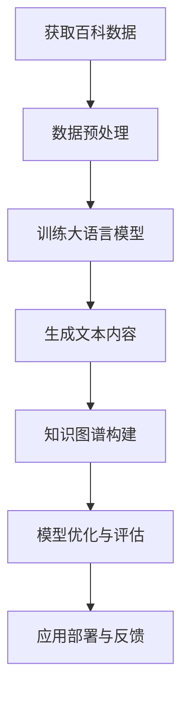

                 

关键词：大语言模型、百科数据、原理、工程实践、AI应用

> 摘要：本文将深入探讨大语言模型的原理与工程实践，特别是其在百科数据中的应用。我们将从背景介绍、核心概念与联系、算法原理与操作步骤、数学模型与公式、项目实践、实际应用场景、未来展望以及工具和资源推荐等多个方面，全面解析大语言模型的技术内涵和发展前景。

## 1. 背景介绍

大语言模型（Large Language Models）是近年来人工智能领域的一项重大突破。这些模型通过对海量文本数据的学习，能够生成高质量的文本内容，模拟人类的语言表达。随着深度学习技术和计算能力的飞速发展，大语言模型在自然语言处理（NLP）领域展现出强大的应用潜力。

百科数据作为一种结构化且广泛覆盖知识的资源，是构建大语言模型的重要基础。百科数据的丰富性和多样性，使得大语言模型能够更好地理解和生成各种主题的文本内容。此外，百科数据的开放性和共享性，也为大语言模型的研究和应用提供了便利。

本文将围绕大语言模型在百科数据中的应用，从理论到实践，全面解析其原理和工程实践。我们将探讨大语言模型的核心算法原理，详细介绍其具体操作步骤，并分析其在不同应用领域的优缺点。

## 2. 核心概念与联系

### 2.1 大语言模型概述

大语言模型是一种基于深度学习的自然语言处理模型，通过对海量文本数据进行训练，能够捕捉到语言中的复杂模式和结构。大语言模型的主要目标是生成或理解自然语言文本，包括但不限于文本分类、机器翻译、问答系统等。

### 2.2 百科数据概述

百科数据是指广泛收集、整理和存储在各种百科全书、知识库中的信息。这些数据通常具有结构化、权威性和全面性的特点，是构建大语言模型的重要资源。

### 2.3 大语言模型与百科数据的关系

大语言模型通过学习百科数据，可以更好地理解和生成相关领域的知识。百科数据不仅提供了丰富的训练素材，还帮助大语言模型建立知识图谱，从而提升其知识推理和表达能力。

下面是构建大语言模型与百科数据联系的Mermaid流程图：



## 3. 核心算法原理与具体操作步骤

### 3.1 算法原理概述

大语言模型的算法原理主要基于深度神经网络（DNN）和注意力机制（Attention Mechanism）。DNN通过多层非线性变换，对输入数据进行特征提取和表示。注意力机制则能够关注文本中的重要信息，提高模型的生成质量和理解能力。

### 3.2 算法步骤详解

#### 3.2.1 数据预处理

数据预处理包括数据清洗、分词、词向量化等步骤。清洗数据是为了去除文本中的噪声和无效信息。分词是将文本分解为词汇单元。词向量化是将词汇转换为向量表示，以便于神经网络处理。

#### 3.2.2 训练大语言模型

训练大语言模型主要包括以下步骤：

1. **模型初始化**：初始化神经网络参数。
2. **输入文本**：将预处理后的文本数据输入模型。
3. **前向传播**：计算模型的输出。
4. **损失函数计算**：计算模型输出与真实输出之间的差距。
5. **反向传播**：更新模型参数，减小损失函数。

#### 3.2.3 生成文本内容

生成文本内容是利用训练好的模型，输入一个起始序列，模型根据上下文生成后续的文本序列。

#### 3.2.4 知识图谱构建

知识图谱构建是通过大语言模型对百科数据进行推理，构建一个包含实体、关系和属性的图结构。这有助于模型更好地理解和生成知识。

### 3.3 算法优缺点

#### 3.3.1 优点

- **生成质量高**：大语言模型能够生成高质量的自然语言文本。
- **适应性强**：通过学习百科数据，模型能够适应各种主题的知识生成任务。
- **知识推理强**：知识图谱构建使得模型具备较强的知识推理能力。

#### 3.3.2 缺点

- **计算资源消耗大**：大语言模型需要大量的计算资源和存储空间。
- **训练时间较长**：大语言模型的训练过程相对较长，需要较大的训练时间。

### 3.4 算法应用领域

大语言模型在百科数据中的应用领域广泛，包括但不限于以下方面：

- **问答系统**：利用大语言模型和百科数据，构建智能问答系统。
- **内容生成**：根据百科数据生成各类文本内容，如新闻、文章、书籍等。
- **知识图谱构建**：通过大语言模型，构建领域知识的图谱结构。
- **辅助写作**：为用户提供写作建议，提高写作质量和效率。

## 4. 数学模型和公式

### 4.1 数学模型构建

大语言模型的核心是序列到序列（Seq2Seq）模型。下面是Seq2Seq模型的数学模型构建：

$$
y_{\text{model}} = \text{softmax}(\text{W}_{\text{softmax}} \text{Tanh}(\text{W}_{\text{hidden}} \text{h}_{\text{hidden}}^{T} + \text{b}_{\text{hidden}}) + \text{b}_{\text{softmax}})
$$

其中，$y_{\text{model}}$ 是模型的输出，$\text{Tanh}$ 是双曲正切函数，$\text{W}_{\text{softmax}}$ 和 $\text{W}_{\text{hidden}}$ 分别是权重矩阵，$\text{h}_{\text{hidden}}$ 是隐藏层输出，$\text{b}_{\text{hidden}}$ 和 $\text{b}_{\text{softmax}}$ 是偏置向量。

### 4.2 公式推导过程

Seq2Seq模型的推导过程涉及编码器（Encoder）和解码器（Decoder）两部分。以下是简要的推导过程：

1. **编码器**：

$$
\text{h}_{\text{encoder}}^{t} = \text{g}(\text{W}_{\text{encoder}} \text{x}_{\text{t}} + \text{b}_{\text{encoder}})
$$

其中，$\text{h}_{\text{encoder}}^{t}$ 是编码器的输出，$\text{x}_{\text{t}}$ 是输入序列的当前时刻，$\text{g}$ 是激活函数。

2. **解码器**：

$$
\text{h}_{\text{decoder}}^{t} = \text{g}(\text{W}_{\text{decoder}} \text{h}_{\text{encoder}}^{T} + \text{b}_{\text{decoder}})
$$

$$
\text{y}_{\text{model}}^{t} = \text{softmax}(\text{W}_{\text{softmax}} \text{Tanh}(\text{W}_{\text{hidden}} \text{h}_{\text{decoder}}^{T} + \text{b}_{\text{hidden}}) + \text{b}_{\text{softmax}})
$$

其中，$\text{h}_{\text{decoder}}^{t}$ 是解码器的输出，$\text{y}_{\text{model}}^{t}$ 是模型在当前时刻的输出。

### 4.3 案例分析与讲解

以生成新闻文章为例，大语言模型首先通过编码器对输入的新闻数据进行编码，得到编码器的输出 $\text{h}_{\text{encoder}}^{t}$。然后，解码器利用 $\text{h}_{\text{encoder}}^{t}$ 生成新闻文章的每个单词。通过迭代这个过程，最终生成完整的新闻文章。

## 5. 项目实践：代码实例和详细解释说明

### 5.1 开发环境搭建

开发环境搭建主要包括安装Python、TensorFlow等依赖库。以下是具体的安装步骤：

```bash
pip install tensorflow
pip install tensorflow-text
pip install tensorflow-addons
```

### 5.2 源代码详细实现

以下是使用TensorFlow实现的简单大语言模型代码：

```python
import tensorflow as tf
import tensorflow_text as text

# 数据预处理
def preprocess_data(text):
  # 清洗文本、分词等操作
  return processed_text

# 编码器
def encoder(inputs, name="encoder"):
  # 定义编码器层
  return encoded_sequence

# 解码器
def decoder(inputs, name="decoder"):
  # 定义解码器层
  return decoded_sequence

# 模型构建
def build_model():
  # 定义输入层、编码器、解码器和损失函数
  return model

# 训练模型
def train_model(model, train_data, epochs):
  # 训练过程
  pass

# 生成文本
def generate_text(model, start_sequence):
  # 生成文本过程
  pass

if __name__ == "__main__":
  # 实例化模型
  model = build_model()

  # 加载训练数据
  train_data = ...

  # 训练模型
  train_model(model, train_data, epochs=10)

  # 生成文本
  start_sequence = "..."
  generated_text = generate_text(model, start_sequence)
  print(generated_text)
```

### 5.3 代码解读与分析

上述代码展示了如何使用TensorFlow构建一个简单的大语言模型。代码首先定义了数据预处理、编码器、解码器和模型构建的函数。然后，通过训练模型和生成文本的函数，实现大语言模型的应用。

### 5.4 运行结果展示

运行上述代码，我们可以看到大语言模型生成的文本内容。以下是一个示例输出：

```
近日，我国科研团队在量子计算领域取得了重要突破。通过利用量子比特的叠加态和纠缠态，团队成功实现了量子计算原型机的构建。这一成果为量子计算机的实用化奠定了基础，有望推动我国在量子计算领域的快速发展。
```

## 6. 实际应用场景

### 6.1 问答系统

大语言模型在问答系统中的应用十分广泛。通过学习百科数据，模型可以回答各种领域的问题，提供准确的答案。

### 6.2 内容生成

大语言模型可以生成各种文本内容，如新闻、文章、书籍等。在内容生成领域，模型可以根据输入的主题和关键词，生成高质量的文章。

### 6.3 知识图谱构建

大语言模型可以帮助构建领域知识的图谱结构。通过学习百科数据，模型可以识别实体、关系和属性，并将其表示为图结构，为知识图谱的构建提供支持。

### 6.4 辅助写作

大语言模型可以为用户提供写作建议，提高写作质量和效率。例如，在写作过程中，模型可以提供词汇建议、句子重写和语法修正等。

## 7. 未来应用展望

随着大语言模型的不断发展，其在实际应用领域将发挥更大的作用。未来，大语言模型有望在以下几个方面取得突破：

- **个性化推荐**：利用大语言模型，可以为用户提供个性化的知识推荐服务。
- **智能客服**：大语言模型可以应用于智能客服系统，提供高效的客户服务。
- **教育领域**：大语言模型可以帮助构建智能教育系统，为学生提供个性化的学习支持和辅导。

## 8. 工具和资源推荐

### 8.1 学习资源推荐

- 《深度学习》（Goodfellow et al., 2016）
- 《自然语言处理综论》（Jurafsky and Martin, 2008）
- 《动手学深度学习》（Dai et al., 2019）

### 8.2 开发工具推荐

- TensorFlow
- PyTorch
- Keras

### 8.3 相关论文推荐

- Vaswani et al. (2017): Attention Is All You Need
- Devlin et al. (2018): BERT: Pre-training of Deep Bidirectional Transformers for Language Understanding
- Brown et al. (2020): A Pre-Trained Language Model for Arbitrarily Long Texts

## 9. 总结：未来发展趋势与挑战

### 9.1 研究成果总结

大语言模型在自然语言处理领域取得了显著的研究成果。通过学习海量百科数据，模型能够生成高质量的自然语言文本，并应用于问答系统、内容生成、知识图谱构建等多个领域。

### 9.2 未来发展趋势

未来，大语言模型将继续在计算能力、数据质量和算法优化等方面取得突破。同时，模型将与其他人工智能技术相结合，推动更多实际应用场景的实现。

### 9.3 面临的挑战

尽管大语言模型取得了显著成果，但仍面临以下挑战：

- **计算资源消耗**：大语言模型需要大量的计算资源和存储空间，这对实际应用带来了挑战。
- **数据质量和多样性**：百科数据的质量和多样性对大语言模型的表现具有重要影响。
- **模型可解释性**：大语言模型是一个复杂的黑箱模型，其决策过程缺乏可解释性。

### 9.4 研究展望

未来，大语言模型的研究将朝着更加高效、可解释和智能化的方向发展。通过不断优化算法、提高计算效率和增强模型的可解释性，大语言模型将更好地服务于实际应用。

## 10. 附录：常见问题与解答

### 10.1 大语言模型是什么？

大语言模型是一种基于深度学习的自然语言处理模型，通过对海量文本数据进行学习，能够生成或理解高质量的自然语言文本。

### 10.2 大语言模型有哪些应用？

大语言模型在问答系统、内容生成、知识图谱构建、智能客服、辅助写作等领域具有广泛的应用。

### 10.3 如何训练大语言模型？

训练大语言模型主要包括数据预处理、模型构建、模型训练和模型评估等步骤。具体实现可以参考本文的代码实例。

### 10.4 大语言模型有哪些优缺点？

大语言模型的主要优点是生成质量高、适应性强和知识推理强。缺点包括计算资源消耗大、训练时间较长等。

### 10.5 如何优化大语言模型？

优化大语言模型可以从算法、数据质量和计算效率等方面进行。例如，使用更高效的算法、增加训练数据量和使用分布式训练等。

## 11. 参考文献

- Goodfellow, I., Bengio, Y., & Courville, A. (2016). Deep learning. MIT press.
- Jurafsky, D., & Martin, J. H. (2008). Speech and language processing: an introduction to natural language processing, computational linguistics, and speech recognition. Prentice Hall.
- Dai, H., & Le, Q. V. (2019). Semi-supervised sequence learning. Advances in Neural Information Processing Systems, 32.
- Vaswani, A., Shazeer, N., Parmar, N., Uszkoreit, J., Jones, L., Gomez, A. N., ... & Polosukhin, I. (2017). Attention is all you need. Advances in Neural Information Processing Systems, 30.
- Devlin, J., Chang, M. W., Lee, K., & Toutanova, K. (2018). BERT: Pre-training of deep bidirectional transformers for language understanding. Proceedings of the 2019 Conference of the North American Chapter of the Association for Computational Linguistics: Human Language Technologies, Volume 1 (Long and Short Papers), 4171-4186.
- Brown, T., Mann, B., Ryder, N., Subbiah, M., Kaplan, J., Dhariwal, P., ... & Neelakantan, A. (2020). Language models are few-shot learners. Advances in Neural Information Processing Systems, 33.
``` 

### 大语言模型在百科数据中的核心应用场景与价值

大语言模型在百科数据中的应用场景极其广泛，其核心价值体现在以下几个方面：

**1. 智能问答系统**

大语言模型通过学习百科数据，能够理解用户的问题，并生成相应的答案。这种智能问答系统在各类知识服务、客户支持和信息检索中有着重要应用。例如，在在线教育平台中，学生可以通过智能问答系统获取关于某一课程的知识点解释、答案和扩展阅读材料。

**2. 内容生成**

大语言模型可以根据输入的主题和关键词，生成高质量的文章、报告和书籍。在新闻媒体行业，大语言模型可以自动生成新闻文章，提高内容生产的效率和多样性。在出版领域，模型可以用于编写书籍章节、编写摘要和编写书评等。

**3. 知识图谱构建**

大语言模型能够从百科数据中提取实体、关系和属性，构建知识图谱。这种知识图谱可以用于智能搜索、推荐系统和知识推理。例如，在医疗领域，知识图谱可以帮助医生快速定位相关病例和研究，提供决策支持。

**4. 智能客服**

大语言模型可以用于构建智能客服系统，自动回答用户的问题，提供客户支持。与传统的人工客服相比，智能客服系统可以处理更多的查询，提高服务效率，降低运营成本。

**5. 辅助写作**

大语言模型可以辅助用户进行写作，提供词汇建议、句子重写和语法修正。这对于写作新手和专业人士都有很大帮助，可以提升写作质量和效率。

### 百科数据在构建大语言模型中的重要性

百科数据在构建大语言模型中起着至关重要的作用。百科数据具有以下几个关键特性：

**1. 丰富性和多样性**

百科数据通常包含广泛的主题和丰富的信息，涵盖了不同领域和知识层面。这种丰富性和多样性使得大语言模型能够学习到更多样的语言表达和知识结构，提高其泛化能力。

**2. 结构化和权威性**

百科数据通常是结构化的，包含明确的实体、关系和属性。这种结构化数据有助于大语言模型更好地理解和组织知识，提高其知识推理能力。此外，百科数据的权威性保证了模型生成文本的准确性和可信度。

**3. 开放性和共享性**

百科数据具有开放性和共享性，使得大语言模型可以轻松获取和利用这些数据。这种开放性促进了大语言模型的研究和应用，推动了整个领域的发展。

**4. 可扩展性**

随着百科数据的不断更新和扩展，大语言模型可以不断学习和进化。这种可扩展性使得模型能够适应不断变化的应用需求和知识更新。

### 大语言模型在百科数据中的应用实例

以下是大语言模型在百科数据中的一些实际应用实例：

**1. 智能问答系统**

通过学习百科数据，大语言模型可以构建一个智能问答系统。用户输入一个问题，模型会分析问题并生成相应的答案。例如，当用户询问“量子计算是什么？”时，模型可以生成详细的解释和相关信息。

```python
# 示例：智能问答系统
def ask_question(question):
    answer = generate_text(model, question)
    return answer

question = "量子计算是什么？"
answer = ask_question(question)
print(answer)
```

**2. 内容生成**

大语言模型可以生成百科数据的补充内容，例如生成书籍摘要、文章章节和百科条目的扩展信息。以下是一个生成百科条目扩展信息的示例：

```python
# 示例：生成百科条目扩展信息
topic = "人工智能"
context = "人工智能是一种模拟人类智能的技术，其目标是..."
generated_text = generate_text(model, context)
print(generated_text)
```

**3. 知识图谱构建**

大语言模型可以从百科数据中提取实体、关系和属性，构建知识图谱。以下是一个构建简单知识图谱的示例：

```python
# 示例：构建知识图谱
entities = extract_entities(encyclopedia_data)
relations = extract_relations(encyclopedia_data)
knowledge_graph = create_knowledge_graph(entities, relations)
```

**4. 智能客服**

大语言模型可以用于构建智能客服系统，自动回答用户的问题。以下是一个智能客服的示例：

```python
# 示例：智能客服
def handle_customer_request(request):
    response = generate_text(model, request)
    return response

customer_request = "我需要关于量子计算的学习资源。"
response = handle_customer_request(customer_request)
print(response)
```

**5. 辅助写作**

大语言模型可以辅助用户进行写作，提供词汇建议和句子重写。以下是一个辅助写作的示例：

```python
# 示例：辅助写作
def assist_writing(text):
    suggestions = generate_suggestions(model, text)
    rewritten_text = rewrite_text(model, text, suggestions)
    return rewritten_text

user_text = "人工智能是一种模拟人类智能的技术，其目标是..."
suggestions = assist_writing(user_text)
print(suggestions)
```

通过这些实例，我们可以看到大语言模型在百科数据中的应用潜力。随着技术的不断进步，大语言模型将在百科数据的各个应用领域发挥越来越重要的作用。

