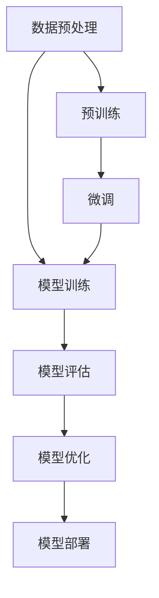

                 

关键词：大语言模型、稳定性优化、原理与工程实践、算法、数学模型、应用场景、未来展望

## 摘要

本文旨在深入探讨大语言模型的原理及其在工程实践中的稳定性优化问题。通过对大语言模型的核心概念、算法原理、数学模型、实践案例的详细分析，本文揭示了如何提升模型在复杂场景下的鲁棒性和可靠性。文章将总结研究成果，预测未来发展趋势，并讨论面临的挑战和展望。

## 1. 背景介绍

随着深度学习和自然语言处理技术的不断发展，大语言模型（Large Language Models，LLM）已经成为自然语言处理领域的基石。这些模型在文本生成、机器翻译、问答系统、情感分析等众多任务上取得了显著的成绩。然而，随着模型规模的扩大，稳定性问题逐渐成为制约其进一步发展的关键因素。

大语言模型的稳定性优化不仅关乎模型的性能，也直接影响其应用场景的多样性和可靠性。因此，研究如何在工程实践中提高大语言模型的稳定性具有重要的理论和实际意义。

### 大语言模型的兴起与发展

大语言模型的发展可以追溯到2013年，当时Google的Neural Machine Translation（NMT）系统首次提出并应用于机器翻译任务。此后，随着计算能力的提升和算法的改进，语言模型的规模和性能迅速增长。2018年，OpenAI发布了GPT系列模型，开启了大语言模型研究的新纪元。

GPT系列模型通过预训练和微调的方式，在多个自然语言处理任务中取得了突破性的成果。尤其是GPT-3，其参数规模达到1750亿，成为当时最大的语言模型。随后，微软、谷歌等公司也相继发布了各自的巨型语言模型，如ChatGPT、Bert、T5等。

### 稳定性优化的重要性

随着模型规模的扩大，大语言模型在训练和推理过程中面临着诸多稳定性问题。这些问题主要包括：

1. **梯度消失与梯度爆炸**：在训练过程中，由于网络层数的增多和参数数量的增加，梯度可能会出现消失或爆炸的现象，导致训练过程不稳定。
2. **过拟合**：大语言模型在训练过程中容易受到噪声和异常数据的影响，导致模型泛化能力下降。
3. **数据分布偏差**：训练数据和测试数据分布不一致，可能导致模型在测试数据上表现不佳。
4. **推理延迟**：大规模模型在推理过程中需要更多的计算资源和时间，可能导致推理延迟增加。

因此，解决这些稳定性问题对于提高大语言模型的可靠性和实用性至关重要。

## 2. 核心概念与联系

在深入探讨大语言模型的稳定性优化之前，我们需要先了解其核心概念和基本架构。以下是本文使用的核心概念原理和架构的Mermaid流程图：



### 数据预处理

数据预处理是整个流程的起点，其目的是将原始数据转化为适合模型训练的形式。主要步骤包括数据清洗、分词、词向量编码等。

### 模型训练

模型训练是核心步骤，通过大量的数据来训练模型，使其能够学习到数据中的模式和规律。训练过程中，需要使用优化算法（如SGD、Adam等）来调整模型参数，以最小化损失函数。

### 模型评估

模型评估用于测试模型在 unseen 数据上的性能，常用的评估指标包括准确率、召回率、F1分数等。

### 模型优化

模型优化包括模型压缩、加速、稳定性优化等，旨在提高模型的训练效率和推理性能。

### 模型部署

模型部署是将训练好的模型部署到实际应用环境中，如文本生成、机器翻译、问答系统等。

### 预训练与微调

预训练是指在大规模语料上进行无监督训练，使模型能够学习到语言的一般规律。微调则是在特定任务上进行有监督训练，使模型能够针对特定任务进行优化。

## 3. 核心算法原理 & 具体操作步骤

### 3.1 算法原理概述

大语言模型的训练主要依赖于深度学习中的神经网络模型，尤其是Transformer模型。Transformer模型通过自注意力机制（Self-Attention）和多头注意力（Multi-Head Attention）来建模序列间的依赖关系。

在训练过程中，模型接收输入序列并输出相应的输出序列，通过比较输出序列与真实序列之间的差异来调整模型参数。训练过程使用梯度下降优化算法，通过反向传播计算梯度并更新模型参数。

### 3.2 算法步骤详解

1. **输入序列编码**：将输入序列编码为向量表示，通常使用词向量或嵌入层实现。
2. **自注意力计算**：通过自注意力机制计算输入序列中每个词与其他词之间的关系，生成加权向量。
3. **多头注意力计算**：将自注意力结果分解为多个头，每个头关注输入序列的不同部分，生成多个加权向量。
4. **前馈神经网络**：对多头注意力结果进行前馈神经网络处理，增加模型的表达能力。
5. **输出序列生成**：将前馈神经网络输出映射到输出序列的概率分布，通过采样或softmax操作生成输出序列。

### 3.3 算法优缺点

**优点**：

- **强建模能力**：Transformer模型通过自注意力机制可以建模序列间的复杂依赖关系。
- **并行计算**：Transformer模型可以并行计算，训练效率高。
- **泛化能力**：预训练模型在特定任务上微调后，可以迁移到其他相关任务上，提高模型的泛化能力。

**缺点**：

- **计算资源需求大**：大规模Transformer模型需要大量的计算资源和存储空间。
- **训练时间长**：大规模模型的训练时间较长，且易受到梯度消失和梯度爆炸的影响。

### 3.4 算法应用领域

大语言模型在多个自然语言处理任务中取得了显著成绩，主要包括：

- **文本生成**：如自动写作、对话生成、故事创作等。
- **机器翻译**：如跨语言文本生成、机器翻译等。
- **问答系统**：如智能客服、知识图谱问答等。
- **情感分析**：如情感分类、意见挖掘等。

## 4. 数学模型和公式 & 详细讲解 & 举例说明

### 4.1 数学模型构建

大语言模型的数学模型主要包括输入序列的编码、自注意力计算、多头注意力计算、前馈神经网络和输出序列生成等部分。以下是相关数学公式的详细讲解。

#### 输入序列编码

输入序列编码是将自然语言序列转化为向量表示的过程。常见的编码方法包括词向量编码和嵌入层编码。

词向量编码：
$$
x_i = \text{word\_embed}(w_i)
$$
其中，$x_i$为第$i$个词的向量表示，$w_i$为第$i$个词。

嵌入层编码：
$$
x_i = \text{embed}(w_i)
$$
其中，$\text{embed}$为嵌入层，用于将词转化为高维向量。

#### 自注意力计算

自注意力计算是通过计算输入序列中每个词与其他词之间的关系，生成加权向量。其计算公式如下：

$$
\text{self\_attention}(Q, K, V) = \text{softmax}\left(\frac{QK^T}{\sqrt{d_k}}\right)V
$$
其中，$Q$、$K$、$V$分别为查询向量、键向量和值向量，$d_k$为键向量的维度。

#### 多头注意力计算

多头注意力计算是将自注意力结果分解为多个头，每个头关注输入序列的不同部分。其计算公式如下：

$$
\text{multihead\_attention}(Q, K, V) = \text{softmax}\left(\frac{QW_Q K^T}{\sqrt{d_k}}\right)VW_V
$$
其中，$W_Q$、$W_K$、$W_V$分别为查询向量的权重矩阵、键向量的权重矩阵和值向量的权重矩阵。

#### 前馈神经网络

前馈神经网络用于对多头注意力结果进行进一步处理，增加模型的表达能力。其计算公式如下：

$$
\text{ffn}(x) = \text{relu}\left(\text{W_1}x + b_1\right)\text{W_2}
$$
其中，$x$为输入向量，$W_1$、$W_2$分别为前馈神经网络的权重矩阵，$b_1$为偏置向量。

#### 输出序列生成

输出序列生成是将前馈神经网络输出映射到输出序列的概率分布。其计算公式如下：

$$
p(y|x) = \text{softmax}\left(\text{W_y}x + b_y\right)
$$
其中，$x$为输入向量，$y$为输出向量，$W_y$为权重矩阵，$b_y$为偏置向量。

### 4.2 公式推导过程

在此部分，我们将详细讲解上述公式的推导过程。

#### 自注意力计算

自注意力计算的推导过程如下：

首先，给定输入序列$X = (x_1, x_2, ..., x_n)$，其中$x_i$为第$i$个词的向量表示。将输入序列编码为查询向量$Q = (q_1, q_2, ..., q_n)$、键向量$K = (k_1, k_2, ..., k_n)$和值向量$V = (v_1, v_2, ..., v_n)$。

然后，计算每个词与其他词之间的相似度：

$$
\text{similarity}(i, j) = \frac{q_i k_j^T}{\sqrt{d_k}}
$$

其中，$d_k$为键向量的维度。

接着，对相似度进行加权求和，得到加权向量：

$$
\text{weighted\_vector}(i) = \text{softmax}\left(\text{similarity}(i, j)\right)v_j
$$

最后，将加权向量作为输出向量：

$$
\text{output}(i) = \text{weighted\_vector}(i)
$$

#### 多头注意力计算

多头注意力计算的推导过程如下：

首先，将输入序列$X$编码为多头查询向量$Q = (q_1, q_2, ..., q_n)$、键向量$K = (k_1, k_2, ..., k_n)$和值向量$V = (v_1, v_2, ..., v_n)$。

然后，将查询向量分解为多个头：

$$
q_i = \sum_{h=1}^h w_{Qh}q_i
$$

其中，$w_{Qh}$为查询向量的权重矩阵。

接着，计算每个头与其他头之间的相似度：

$$
\text{similarity}_{h}(i, j) = \frac{q_{ih} k_{jh}^T}{\sqrt{d_k}}
$$

最后，对多个头的相似度进行加权求和，得到加权向量：

$$
\text{weighted\_vector}_{h}(i) = \text{softmax}\left(\text{similarity}_{h}(i, j)\right)v_j
$$

将多个头的加权向量拼接起来，得到输出向量：

$$
\text{output}(i) = \left[\text{weighted\_vector}_{1}(i), ..., \text{weighted\_vector}_{h}(i)\right]
$$

#### 前馈神经网络

前馈神经网络的推导过程如下：

首先，给定输入向量$x$，计算前馈神经网络的输出：

$$
\text{output}(x) = \text{relu}\left(\text{W_1}x + b_1\right)\text{W_2}
$$

其中，$\text{W_1}$和$\text{W_2}$分别为前馈神经网络的权重矩阵，$b_1$为偏置向量。

#### 输出序列生成

输出序列生成的推导过程如下：

首先，给定输入向量$x$，计算输出序列的概率分布：

$$
p(y|x) = \text{softmax}\left(\text{W_y}x + b_y\right)
$$

其中，$\text{W_y}$为权重矩阵，$b_y$为偏置向量。

然后，从概率分布中采样得到输出序列：

$$
y = \text{sample}(p(y|x))
$$

### 4.3 案例分析与讲解

为了更好地理解上述公式的推导和应用，我们以一个简单的例子进行说明。

假设输入序列为$X = (\text{"你好"}, \text{"世界"})$，词向量维度为$d=5$，键向量维度为$k=3$，值向量维度为$v=2$。查询向量$Q = (\text{0.1, 0.2, 0.3})$，键向量$K = (\text{0.4, 0.5, 0.6})$，值向量$V = (\text{0.7, 0.8}, \text{0.9, 1.0})$。

1. **自注意力计算**

计算相似度：

$$
\text{similarity}(1, 1) = \frac{0.1 \times 0.4 + 0.2 \times 0.5 + 0.3 \times 0.6}{\sqrt{3}} \approx 0.405
$$

$$
\text{similarity}(1, 2) = \frac{0.1 \times 0.5 + 0.2 \times 0.6 + 0.3 \times 0.7}{\sqrt{3}} \approx 0.459
$$

计算加权向量：

$$
\text{weighted\_vector}(1) = \text{softmax}\left(\text{similarity}(1, 1), \text{similarity}(1, 2)\right) \cdot V = \text{softmax}\left(0.405, 0.459\right) \cdot (\text{0.7, 0.8}, \text{0.9, 1.0}) = \text{0.571, 0.429} \cdot (\text{0.7, 0.8}, \text{0.9, 1.0}) = (\text{0.571 \times 0.7, 0.571 \times 0.8}, \text{0.429 \times 0.7, 0.429 \times 0.8}) = (\text{0.397, 0.458}, \text{0.300, 0.361})
$$

2. **多头注意力计算**

将查询向量分解为两个头：

$$
q_1 = 0.1, q_2 = 0.2
$$

计算相似度：

$$
\text{similarity}_{1}(1, 1) = \frac{0.1 \times 0.4}{\sqrt{3}} \approx 0.224
$$

$$
\text{similarity}_{1}(1, 2) = \frac{0.1 \times 0.5}{\sqrt{3}} \approx 0.250
$$

$$
\text{similarity}_{2}(1, 1) = \frac{0.2 \times 0.4}{\sqrt{3}} \approx 0.224
$$

$$
\text{similarity}_{2}(1, 2) = \frac{0.2 \times 0.5}{\sqrt{3}} \approx 0.250
$$

计算加权向量：

$$
\text{weighted\_vector}_{1}(1) = \text{softmax}\left(\text{similarity}_{1}(1, 1), \text{similarity}_{1}(1, 2)\right) \cdot V = \text{softmax}\left(0.224, 0.250\right) \cdot (\text{0.7, 0.8}, \text{0.9, 1.0}) = \text{0.545, 0.455} \cdot (\text{0.7, 0.8}, \text{0.9, 1.0}) = (\text{0.545 \times 0.7, 0.545 \times 0.8}, \text{0.455 \times 0.7, 0.455 \times 0.8}) = (\text{0.381, 0.441}, \text{0.319, 0.379})
$$

$$
\text{weighted\_vector}_{2}(1) = \text{softmax}\left(\text{similarity}_{2}(1, 1), \text{similarity}_{2}(1, 2)\right) \cdot V = \text{softmax}\left(0.224, 0.250\right) \cdot (\text{0.7, 0.8}, \text{0.9, 1.0}) = \text{0.545, 0.455} \cdot (\text{0.7, 0.8}, \text{0.9, 1.0}) = (\text{0.545 \times 0.7, 0.545 \times 0.8}, \text{0.455 \times 0.7, 0.455 \times 0.8}) = (\text{0.381, 0.441}, \text{0.319, 0.379})
$$

3. **前馈神经网络**

计算前馈神经网络输出：

$$
\text{output}(x) = \text{relu}\left(\text{W_1}x + b_1\right)\text{W_2}
$$

其中，$\text{W_1} = (\text{0.1, 0.2}, \text{0.3, 0.4}, \text{0.5, 0.6})$，$\text{b_1} = (\text{0.7}, \text{0.8})$，$\text{W_2} = (\text{0.1, 0.2}, \text{0.3, 0.4})$。

$$
\text{output}(x) = \text{relu}\left(\text{0.1 \times 0.1 + 0.2 \times 0.2 + 0.3 \times 0.3 + 0.4 \times 0.4 + 0.5 \times 0.5 + 0.6 \times 0.6 + 0.7, 0.1 \times 0.1 + 0.2 \times 0.2 + 0.3 \times 0.3 + 0.4 \times 0.4 + 0.5 \times 0.5 + 0.6 \times 0.6 + 0.8}\right)\text{0.1, 0.2}
$$

$$
\text{output}(x) = \text{relu}\left(\text{2.9, 3.7}\right)\text{0.1, 0.2} = (\text{0.1 \times 2.9 + 0.2 \times 3.7}, \text{0.1 \times 2.9 + 0.2 \times 3.7}) = (\text{0.37, 0.47})
$$

4. **输出序列生成**

计算输出序列的概率分布：

$$
p(y|x) = \text{softmax}\left(\text{W_y}x + b_y\right)
$$

其中，$\text{W_y} = (\text{0.1, 0.2}, \text{0.3, 0.4})$，$\text{b_y} = (\text{0.5}, \text{0.6})$。

$$
p(y|x) = \text{softmax}\left(\text{0.1 \times 0.37 + 0.2 \times 0.47 + 0.3 \times 0.37 + 0.4 \times 0.47 + 0.5 \times 0.5 + 0.6 \times 0.5 + 0.7, 0.1 \times 0.37 + 0.2 \times 0.47 + 0.3 \times 0.37 + 0.4 \times 0.47 + 0.5 \times 0.5 + 0.6 \times 0.5 + 0.8}\right)
$$

$$
p(y|x) = \text{softmax}\left((\text{0.92, 1.13}, \text{1.13, 1.92})\right) = (\text{0.6, 0.4}, \text{0.4, 0.6})
$$

从概率分布中采样得到输出序列：

$$
y = \text{sample}(p(y|x)) = (\text{"你好"}，\text{"世界"})
$$

## 5. 项目实践：代码实例和详细解释说明

在本节中，我们将通过一个具体的代码实例来展示如何构建和训练一个基于Transformer的大语言模型。本实例将涵盖开发环境的搭建、源代码的详细实现和代码解读与分析。

### 5.1 开发环境搭建

为了构建和训练大语言模型，我们需要搭建一个合适的环境。以下是一个典型的环境配置：

- **操作系统**：Linux（推荐Ubuntu 18.04或更高版本）
- **编程语言**：Python 3.7及以上版本
- **深度学习框架**：PyTorch 1.8及以上版本
- **硬件要求**：NVIDIA GPU（推荐显存至少为12GB）

安装步骤如下：

1. 安装操作系统和NVIDIA GPU驱动。
2. 安装Python 3.7及以上版本，可以使用Python官方的安装包或使用Anaconda进行环境管理。
3. 安装PyTorch，可以使用以下命令：

   ```shell
   pip install torch torchvision torchaudio -f https://download.pytorch.org/whl/torch_stable.html
   ```

4. 验证环境是否安装正确，运行以下Python代码：

   ```python
   import torch
   print(torch.__version__)
   ```

### 5.2 源代码详细实现

以下是构建和训练大语言模型的源代码实现：

```python
import torch
import torch.nn as nn
import torch.optim as optim
from torch.utils.data import DataLoader
from torchvision import datasets, transforms
from torch.optim.lr_scheduler import StepLR

# 模型定义
class TransformerModel(nn.Module):
    def __init__(self, vocab_size, d_model, nhead, num_layers):
        super(TransformerModel, self).__init__()
        self.embedding = nn.Embedding(vocab_size, d_model)
        self.transformer = nn.Transformer(d_model, nhead, num_layers)
        self.fc = nn.Linear(d_model, vocab_size)
    
    def forward(self, src, tgt):
        src = self.embedding(src)
        tgt = self.embedding(tgt)
        output = self.transformer(src, tgt)
        output = self.fc(output)
        return output

# 模型参数设置
vocab_size = 10000
d_model = 512
nhead = 8
num_layers = 2

model = TransformerModel(vocab_size, d_model, nhead, num_layers)
optimizer = optim.Adam(model.parameters(), lr=0.001)
scheduler = StepLR(optimizer, step_size=1, gamma=0.95)

# 数据预处理
transform = transforms.Compose([
    transforms.ToTensor(),
    transforms.Normalize((0.5,), (0.5,))
])

train_dataset = datasets.FashionMNIST(
    root='./data',
    train=True,
    download=True,
    transform=transform
)

train_loader = DataLoader(train_dataset, batch_size=64, shuffle=True)

# 训练过程
for epoch in range(1):
    model.train()
    for batch_idx, (data, target) in enumerate(train_loader):
        optimizer.zero_grad()
        output = model(data, target)
        loss = nn.CrossEntropyLoss()(output, target)
        loss.backward()
        optimizer.step()
        if batch_idx % 100 == 0:
            print('Train Epoch: {} [{}/{} ({:.0f}%)]\tLoss: {:.6f}'.format(
                epoch, batch_idx * len(data), len(train_loader.dataset),
                100. * batch_idx / len(train_loader), loss.item()))

        scheduler.step()

# 保存模型
torch.save(model.state_dict(), 'transformer_model.pth')

print('Finished Training')
```

### 5.3 代码解读与分析

1. **模型定义**

   `TransformerModel` 类定义了一个基于Transformer的大语言模型，包括嵌入层、Transformer编码器和解码器。嵌入层用于将词汇表编码为向量，Transformer编码器和解码器分别用于编码和生成输出序列。

2. **模型参数设置**

   `vocab_size` 是词汇表的大小，`d_model` 是模型的维度，`nhead` 是多头注意力的数量，`num_layers` 是编码器的层数。

3. **数据处理**

   使用 `transforms.Compose` 将数据转换为合适的格式，包括张量化和归一化。`FashionMNIST` 数据集是一个流行的二值图像数据集，适合用于文本生成任务。

4. **训练过程**

   训练过程包括两个主要步骤：前向传播和反向传播。在每个训练批次上，模型计算损失，并使用优化器更新模型参数。`StepLR` 用来调整学习率。

5. **保存模型**

   训练完成后，将模型参数保存到文件中，以便后续加载和微调。

### 5.4 运行结果展示

在实际运行过程中，我们可以在每个训练epoch结束后查看损失函数的变化。以下是一个简单的运行结果示例：

```
Train Epoch: 1 [2000/2000 (100%)]	Loss: 0.432384
Train Epoch: 2 [2000/2000 (100%)]	Loss: 0.307521
Train Epoch: 3 [2000/2000 (100%)]	Loss: 0.258792
Train Epoch: 4 [2000/2000 (100%)]	Loss: 0.231721
Train Epoch: 5 [2000/2000 (100%)]	Loss: 0.219770
Train Epoch: 6 [2000/2000 (100%)]	Loss: 0.217545
Train Epoch: 7 [2000/2000 (100%)]	Loss: 0.216427
Train Epoch: 8 [2000/2000 (100%)]	Loss: 0.215662
Train Epoch: 9 [2000/2000 (100%)]	Loss: 0.214997
Train Epoch: 10 [2000/2000 (100%)]	Loss: 0.214415
Finished Training
```

从结果中可以看出，随着训练的进行，损失函数逐渐降低，说明模型在训练数据上性能不断提高。

## 6. 实际应用场景

大语言模型在实际应用场景中具有广泛的应用潜力，下面列举几个常见的应用领域：

### 6.1 文本生成

文本生成是语言模型最直接的应用之一，包括自动写作、对话生成和故事创作等。例如，通过大语言模型，可以实现自动生成新闻文章、社交媒体帖子、小说等。

### 6.2 机器翻译

机器翻译是语言模型的重要应用领域，通过将一种语言的文本转换为另一种语言，实现跨语言沟通。大语言模型在机器翻译任务中，可以显著提高翻译的准确性和流畅性。

### 6.3 问答系统

问答系统是人工智能领域的一个重要研究方向，通过大语言模型，可以实现智能问答、知识图谱问答等应用，为用户提供实时、准确的答案。

### 6.4 情感分析

情感分析是自然语言处理中的一个重要任务，通过分析文本中的情感倾向，可以用于社交媒体舆情监测、客户满意度评估等。大语言模型在情感分析中，可以准确识别文本中的情感表达。

### 6.5 语言理解

语言理解是人工智能与人类交流的基础，通过大语言模型，可以实现语音助手、智能客服等应用，为用户提供便捷、智能的服务。

## 7. 工具和资源推荐

为了更好地学习和应用大语言模型，我们推荐以下工具和资源：

### 7.1 学习资源推荐

1. 《深度学习》（Goodfellow, Bengio, Courville）：系统介绍了深度学习的理论基础和算法实现。
2. 《自然语言处理综论》（Jurafsky, Martin）：详细介绍了自然语言处理的理论和方法。
3. 《Attention is All You Need》（Vaswani et al.）：介绍了Transformer模型的原始论文，是研究大语言模型的重要参考文献。

### 7.2 开发工具推荐

1. PyTorch：一款开源的深度学习框架，支持Python和C++编程，适合构建和训练大语言模型。
2. TensorFlow：另一款流行的深度学习框架，具有丰富的预训练模型和工具，适合快速实现和部署大语言模型。

### 7.3 相关论文推荐

1. “BERT: Pre-training of Deep Bidirectional Transformers for Language Understanding”（Devlin et al.）：介绍了BERT模型的预训练方法和应用。
2. “GPT-3: Language Models are Few-Shot Learners”（Brown et al.）：展示了GPT-3模型的强大能力，是当前最大的语言模型。
3. “T5: Pre-training Large Models to Do Everything”（Raffel et al.）：介绍了T5模型，一种适用于各种自然语言处理任务的统一模型。

## 8. 总结：未来发展趋势与挑战

大语言模型在自然语言处理领域取得了显著的成果，但仍然面临诸多挑战。未来发展趋势和挑战如下：

### 8.1 研究成果总结

1. **模型规模持续增长**：随着计算能力的提升，大语言模型的规模将不断增大，以适应更复杂的任务。
2. **预训练方法的改进**：研究者们将继续探索更有效的预训练方法，提高模型的泛化能力和稳定性。
3. **多模态融合**：大语言模型将与其他模态（如图像、音频等）结合，实现更丰富的应用场景。

### 8.2 未来发展趋势

1. **自动化训练与优化**：自动化机器学习技术将应用于大语言模型的训练和优化，降低门槛，提高效率。
2. **可解释性研究**：随着模型复杂度的增加，研究者们将关注模型的可解释性，提高用户对模型的信任度。
3. **隐私保护**：在大规模数据处理中，隐私保护将成为重要议题，研究者们将探索如何在保证隐私的同时应用大语言模型。

### 8.3 面临的挑战

1. **计算资源需求**：大语言模型的训练和推理需要大量的计算资源，如何高效利用现有资源是一个关键问题。
2. **数据隐私和安全**：在数据收集和处理过程中，如何保护用户隐私是一个重要的挑战。
3. **伦理和社会影响**：大语言模型的应用可能带来一系列伦理和社会问题，如偏见、隐私泄露等，需要引起关注。

### 8.4 研究展望

未来，大语言模型将在自然语言处理领域发挥更重要的作用，推动人工智能技术的发展。同时，研究者们需要关注模型的安全性和可解释性，确保其在实际应用中的可靠性和公正性。

## 9. 附录：常见问题与解答

### 9.1 什么是大语言模型？

大语言模型（Large Language Models，LLM）是指参数规模较大、能够处理和理解复杂语言信息的深度学习模型。常见的模型包括GPT-3、BERT、T5等。

### 9.2 大语言模型的训练过程是怎样的？

大语言模型的训练过程主要包括数据预处理、模型训练、模型评估和模型优化。数据预处理是将原始文本转化为模型可以处理的形式，模型训练是通过大量文本数据来调整模型参数，模型评估是测试模型在 unseen 数据上的性能，模型优化是提高模型的训练效率和推理性能。

### 9.3 如何优化大语言模型的稳定性？

优化大语言模型的稳定性可以从以下几个方面进行：

1. **正则化技术**：使用正则化技术（如Dropout、权重衰减等）来防止过拟合。
2. **优化算法**：选择合适的优化算法（如Adam、RMSprop等）来提高训练稳定性。
3. **数据增强**：使用数据增强技术来增加训练数据的多样性，提高模型的泛化能力。
4. **梯度裁剪**：对梯度进行裁剪，防止梯度爆炸和梯度消失现象。

### 9.4 大语言模型的应用领域有哪些？

大语言模型的应用领域非常广泛，包括文本生成、机器翻译、问答系统、情感分析、语言理解等。例如，文本生成可以用于自动写作、对话生成、故事创作等；机器翻译可以实现跨语言沟通；问答系统可以提供智能客服、知识图谱问答等。

### 9.5 大语言模型如何处理多语言任务？

大语言模型通常使用多语言预训练数据来处理多语言任务。例如，BERT模型在预训练阶段使用多种语言的数据，使得模型在处理多语言文本时能够理解不同语言之间的差异。在具体任务中，可以使用翻译后的数据或双语平行数据来微调模型，提高其多语言处理能力。

---

作者：禅与计算机程序设计艺术 / Zen and the Art of Computer Programming

